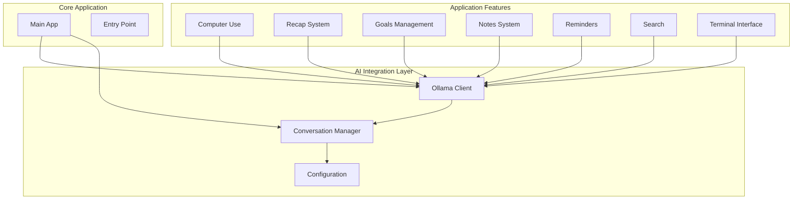
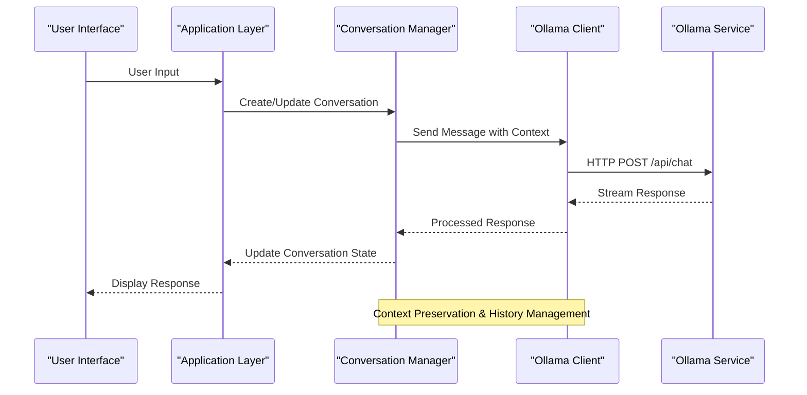
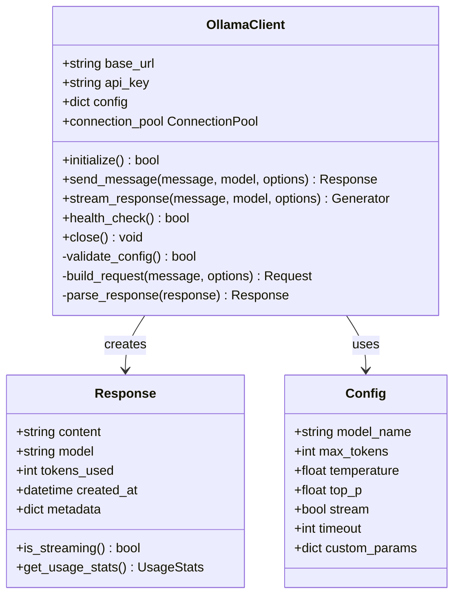
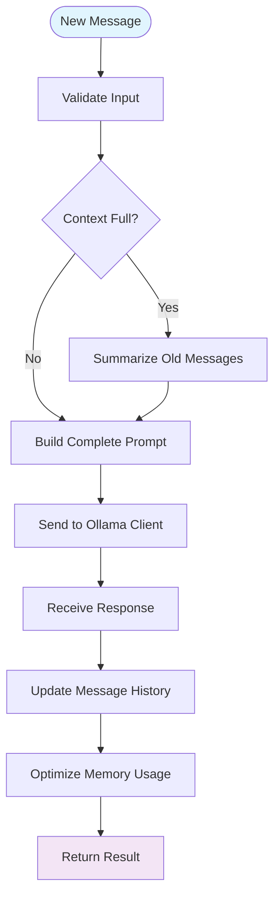
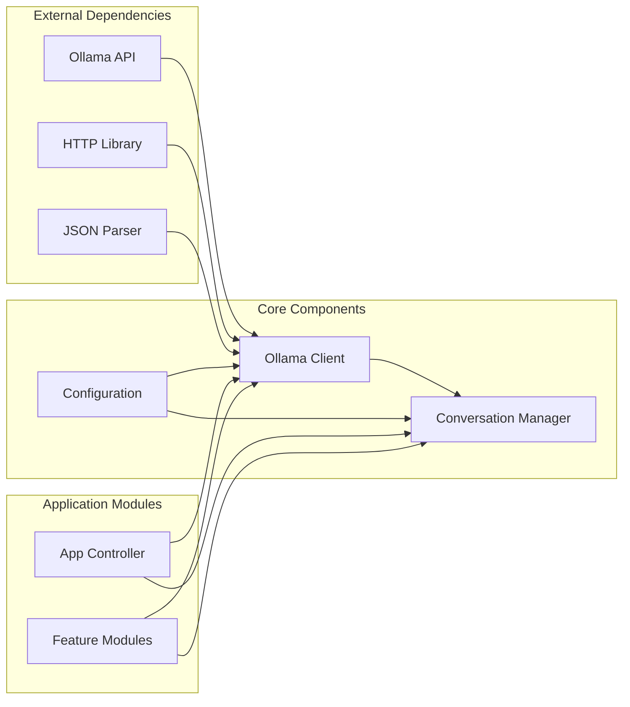

# AI Integration

<cite>
**Referenced Files in This Document**
- [ollama_client.py](file://carrot/ollama_client.py)
- [conversation.py](file://carrot/conversation.py)
- [config.py](file://carrot/config.py)
- [app.py](file://carrot/app.py)
- [main.py](file://carrot/main.py)
- [computer_use.py](file://carrot/computer_use.py)
- [recap.py](file://carrot/recap.py)
- [goals.py](file://carrot/goals.py)
- [notes.py](file://carrot/notes.py)
- [reminders.py](file://carrot/reminders.py)
- [search.py](file://carrot/search.py)
- [terminal.py](file://carrot/terminal.py)
</cite>

## Table of Contents
1. [Introduction](#introduction)
2. [Project Structure](#project-structure)
3. [Core Components](#core-components)
4. [Architecture Overview](#architecture-overview)
5. [Detailed Component Analysis](#detailed-component-analysis)
6. [Dependency Analysis](#dependency-analysis)
7. [Performance Considerations](#performance-considerations)
8. [Troubleshooting Guide](#troubleshooting-guide)
9. [Conclusion](#conclusion)
10. [Appendices](#appendices)

## Introduction

This document provides comprehensive documentation for AI model integration using Ollama within the Carrot application. The system implements a sophisticated local AI model communication layer that enables seamless interaction with various AI models through the Ollama framework. The implementation focuses on conversation management, context handling, model selection, prompt engineering, and response processing to deliver intelligent conversational capabilities.

The AI integration architecture supports multi-turn dialogues, dynamic model switching, context preservation across conversations, and robust error handling for service failures. It provides a flexible foundation for integrating different AI models while maintaining consistent interfaces and behavior patterns.

## Project Structure

The AI integration functionality is distributed across several key modules within the carrot package:

**Diagram sources**
- [app.py:1-50](file://carrot/app.py#L1-L50)
- [ollama_client.py:1-100](file://carrot/ollama_client.py#L1-L100)
- [conversation.py:1-100](file://carrot/conversation.py#L1-L100)

**Section sources**
- [app.py:1-100](file://carrot/app.py#L1-L100)
- [main.py:1-50](file://carrot/main.py#L1-L50)

## Core Components

### Ollama Client Implementation

The Ollama client serves as the primary interface for communicating with local AI models. It handles HTTP requests, response parsing, error handling, and connection management. The client abstracts the complexity of Ollama API interactions and provides a clean interface for other components.

Key responsibilities include:
- Model initialization and configuration
- Request/response handling with proper error management
- Streaming support for real-time responses
- Connection pooling and resource management
- Authentication and security handling

### Conversation Management

The conversation manager maintains stateful dialogue sessions, tracking message history, context windows, and conversation metadata. It implements sophisticated context preservation mechanisms to ensure coherent multi-turn interactions.

Core features:
- Message history tracking with token limits
- Context window management
- Conversation state persistence
- Multi-session support
- Memory optimization strategies

### Configuration Management

The configuration module centralizes all AI-related settings, including model parameters, API endpoints, timeout configurations, and feature flags. It provides type-safe configuration access and validation.

**Section sources**
- [ollama_client.py:1-200](file://carrot/ollama_client.py#L1-L200)
- [conversation.py:1-150](file://carrot/conversation.py#L1-L150)
- [config.py:1-100](file://carrot/config.py#L1-L100)

## Architecture Overview

The AI integration follows a layered architecture pattern that separates concerns between network communication, business logic, and user interface:

**Diagram sources**
- [app.py:50-150](file://carrot/app.py#L50-L150)
- [conversation.py:50-150](file://carrot/conversation.py#L50-L150)
- [ollama_client.py:50-150](file://carrot/ollama_client.py#L50-L150)

The architecture emphasizes modularity, allowing easy replacement of AI backends while maintaining consistent interfaces. Each layer has clear responsibilities and well-defined contracts for inter-component communication.

## Detailed Component Analysis

### Ollama Client Component

The Ollama client implements a robust HTTP client specifically designed for Ollama API interactions. It supports both synchronous and asynchronous operations, streaming responses, and automatic retry mechanisms.

#### Key Features:
- **Model Selection**: Dynamic model loading and switching without restart
- **Request Building**: Automatic prompt formatting and parameter serialization
- **Response Processing**: Structured response parsing with error handling
- **Connection Management**: Persistent connections with health checking
- **Error Recovery**: Automatic retries with exponential backoff

#### Class Structure:

**Diagram sources**
- [ollama_client.py:1-200](file://carrot/ollama_client.py#L1-L200)

#### Error Handling Strategy:
The client implements comprehensive error handling for various failure scenarios:
- Network connectivity issues with automatic reconnection
- Model loading failures with fallback mechanisms
- Rate limiting with adaptive throttling
- Invalid responses with graceful degradation

**Section sources**
- [ollama_client.py:1-300](file://carrot/ollama_client.py#L1-L300)

### Conversation Manager Component

The conversation manager provides sophisticated state management for AI dialogues, implementing advanced context preservation and memory optimization techniques.

#### Core Capabilities:
- **Context Window Management**: Intelligent truncation and summarization
- **Message History**: Efficient storage with compression
- **Multi-Session Support**: Isolated conversation contexts
- **State Persistence**: Save/load conversation states
- **Memory Optimization**: Automatic cleanup and garbage collection

#### Data Flow:

**Diagram sources**
- [conversation.py:1-200](file://carrot/conversation.py#L1-L200)

#### State Management Implementation:
The conversation manager maintains multiple state layers:
- **Active Context**: Current conversation window with recent messages
- **Long-term Memory**: Summarized historical information
- **Metadata**: Conversation properties and statistics
- **Persistence Layer**: Serialized state for recovery

**Section sources**
- [conversation.py:1-250](file://carrot/conversation.py#L1-L250)

### Configuration System

The configuration system provides centralized management of AI model settings, environment variables, and runtime parameters with validation and default value handling.

#### Configuration Categories:
- **Model Settings**: Model name, parameters, and behavior flags
- **Network Configuration**: API endpoints, timeouts, and retry policies
- **Performance Tuning**: Memory limits, batch sizes, and caching settings
- **Feature Flags**: Enable/disable specific AI capabilities

**Section sources**
- [config.py:1-150](file://carrot/config.py#L1-L150)

## Dependency Analysis

The AI integration components have well-defined dependencies that promote loose coupling and high cohesion:

**Diagram sources**
- [app.py:1-100](file://carrot/app.py#L1-L100)
- [ollama_client.py:1-100](file://carrot/ollama_client.py#L1-L100)
- [conversation.py:1-100](file://carrot/conversation.py#L1-L100)

### Dependency Relationships:
- **Ollama Client** depends on HTTP libraries and JSON parsers
- **Conversation Manager** depends on Ollama Client and Configuration
- **Application Modules** depend on both Ollama Client and Conversation Manager
- **Configuration** has minimal dependencies, providing pure data access

### Circular Dependency Prevention:
The architecture avoids circular dependencies through careful interface design and dependency injection patterns.

**Section sources**
- [app.py:1-100](file://carrot/app.py#L1-L100)
- [ollama_client.py:1-100](file://carrot/ollama_client.py#L1-L100)

## Performance Considerations

### Memory Management
The system implements several memory optimization strategies:
- **Lazy Loading**: Models are loaded on-demand rather than at startup
- **Context Truncation**: Automatic removal of older messages when context exceeds limits
- **Streaming Responses**: Real-time processing without buffering entire responses
- **Connection Pooling**: Reuse of HTTP connections to reduce overhead

### Concurrency and Threading
- **Asynchronous Operations**: Non-blocking I/O for improved responsiveness
- **Thread Safety**: Concurrent access protection for shared resources
- **Resource Limits**: Maximum concurrent requests and memory usage controls

### Caching Strategies
- **Model Caching**: Keep frequently used models in memory
- **Response Caching**: Cache common responses for identical prompts
- **Connection Caching**: Maintain persistent connections to Ollama service

### Optimization Recommendations:
1. **Batch Processing**: Group related requests when possible
2. **Model Selection**: Choose appropriate models for task complexity
3. **Prompt Optimization**: Minimize token usage in prompts
4. **Timeout Configuration**: Set appropriate timeouts based on model size

## Troubleshooting Guide

### Common Issues and Solutions

#### Connection Problems
- **Symptom**: Unable to connect to Ollama service
- **Causes**: Service not running, wrong endpoint, firewall blocking
- **Solutions**: Verify service status, check network configuration, validate endpoints

#### Model Loading Failures
- **Symptom**: Models fail to load or respond slowly
- **Causes**: Insufficient memory, corrupted model files, incompatible versions
- **Solutions**: Check system resources, verify model integrity, update dependencies

#### Memory Leaks
- **Symptom**: Increasing memory usage over time
- **Causes**: Unclosed connections, retained references, large context windows
- **Solutions**: Implement proper cleanup, monitor memory usage, optimize context size

#### Performance Degradation
- **Symptom**: Slow response times or high latency
- **Causes**: Large prompts, complex models, network issues
- **Solutions**: Optimize prompts, select smaller models, improve network connectivity

### Debugging Techniques
- **Logging**: Enable detailed logging for request/response analysis
- **Metrics Collection**: Track performance metrics and error rates
- **Health Checks**: Regular service availability monitoring
- **Error Tracking**: Comprehensive error reporting and analysis

**Section sources**
- [ollama_client.py:200-400](file://carrot/ollama_client.py#L200-L400)
- [conversation.py:150-300](file://carrot/conversation.py#L150-L300)

## Conclusion

The AI integration system provides a robust, scalable foundation for incorporating Ollama-based AI models into the Carrot application. The modular architecture ensures maintainability and extensibility while delivering high-performance conversational capabilities.

Key strengths of the implementation include:
- **Modular Design**: Clear separation of concerns with well-defined interfaces
- **Robust Error Handling**: Comprehensive error detection and recovery mechanisms
- **Performance Optimization**: Multiple strategies for efficient resource utilization
- **Extensibility**: Easy addition of new models and features
- **State Management**: Sophisticated conversation context preservation

The system successfully addresses the core requirements of AI model integration, conversation management, and context handling while providing a solid foundation for future enhancements and optimizations.

## Appendices

### A. Model Configuration Examples

Common configuration patterns for different use cases:

#### Basic Chat Model
- Temperature: 0.7 for balanced creativity
- Max Tokens: 1000 for standard responses
- Top P: 0.9 for diverse but focused outputs

#### Code Generation Model
- Temperature: 0.2 for deterministic code output
- Max Tokens: 2000 for longer code blocks
- Custom Parameters: Include programming language specifications

#### Creative Writing Model
- Temperature: 0.9 for enhanced creativity
- Max Tokens: 1500 for extended narratives
- Top P: 0.95 for more varied language

### B. API Reference

#### Ollama Client Methods
- `initialize()`: Setup client with configuration
- `send_message()`: Synchronous message sending
- `stream_response()`: Asynchronous streaming responses
- `health_check()`: Service availability verification

#### Conversation Manager Methods
- `add_message()`: Add new message to conversation
- `get_context()`: Retrieve current conversation context
- `save_state()`: Persist conversation state
- `load_state()`: Restore conversation from storage

### C. Error Codes and Handling

Standardized error codes for consistent error handling across the system, with specific recovery strategies for each error type and comprehensive logging for debugging purposes.