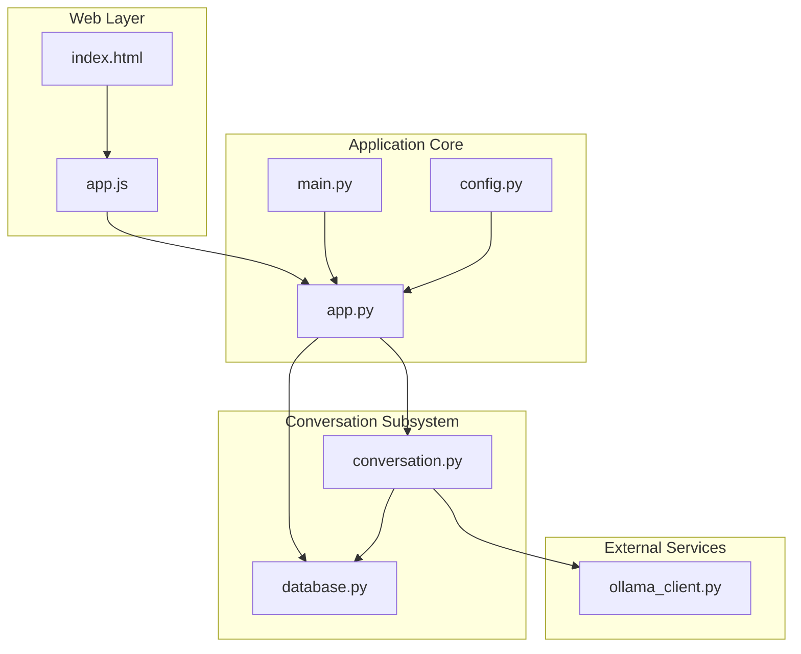
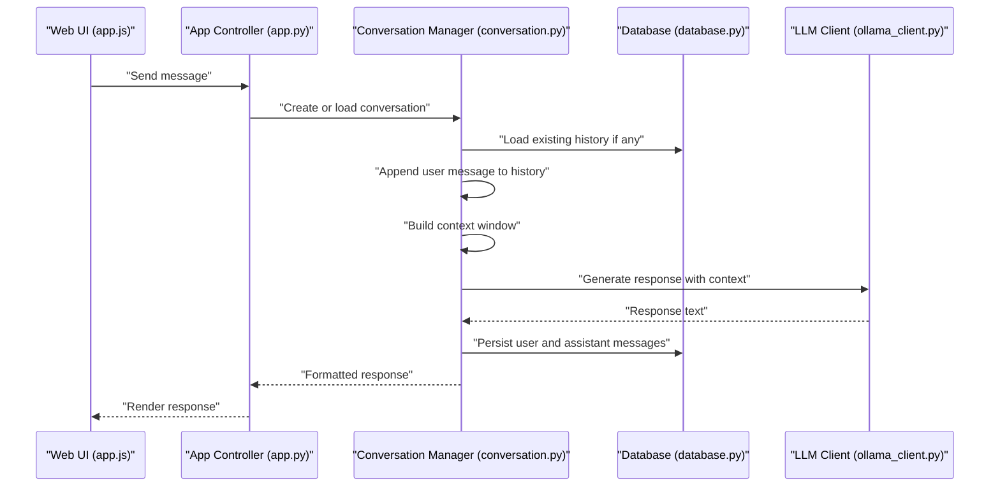
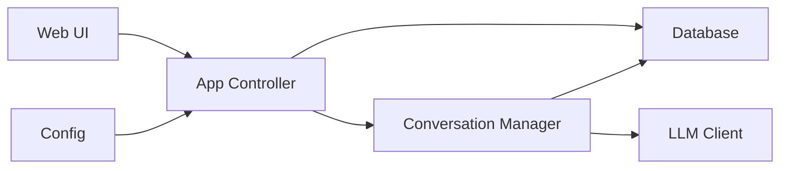
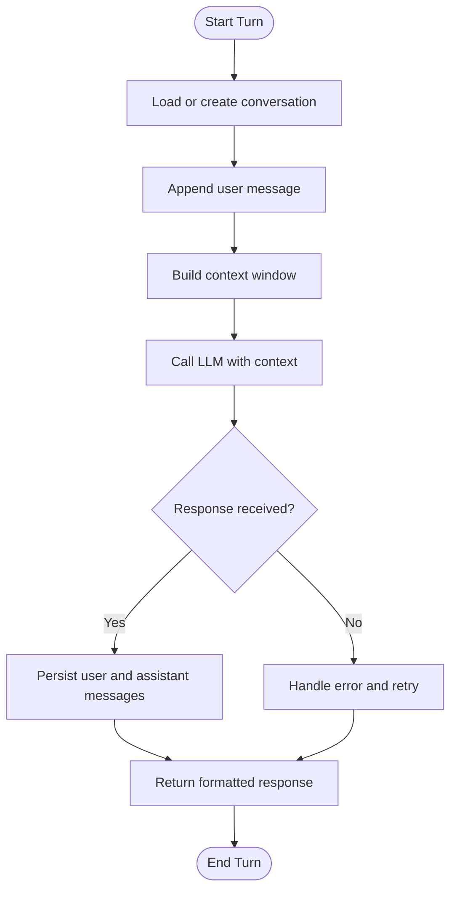

# Conversation Management

<cite>
**Referenced Files in This Document**
- [conversation.py](file://carrot/conversation.py)
- [database.py](file://carrot/database.py)
- [app.py](file://carrot/app.py)
- [main.py](file://carrot/main.py)
- [config.py](file://carrot/config.py)
- [ollama_client.py](file://carrot/ollama_client.py)
- [web/index.html](file://carrot/web/index.html)
- [web/js/app.js](file://carrot/web/js/app.js)
</cite>

## Table of Contents
1. [Introduction](#introduction)
2. [Project Structure](#project-structure)
3. [Core Components](#core-components)
4. [Architecture Overview](#architecture-overview)
5. [Detailed Component Analysis](#detailed-component-analysis)
6. [Dependency Analysis](#dependency-analysis)
7. [Performance Considerations](#performance-considerations)
8. [Troubleshooting Guide](#troubleshooting-guide)
9. [Conclusion](#conclusion)
10. [Appendices](#appendices)

## Introduction
This document explains how conversation management and context handling are implemented in the project. It covers how conversation history is stored, retrieved, and managed; the lifecycle of a conversation state; message formatting; and context preservation across multiple turns. It also provides guidance on serialization, persistence strategies, memory optimization, cleanup, garbage collection considerations, and extending functionality with external memory systems.

## Project Structure
The conversation subsystem spans several modules:
- A dedicated conversation manager for state and operations
- A database layer for persistence
- Application entry points that wire services together
- An LLM client used to generate responses within conversations
- Web UI components that present conversations and send messages

**Diagram sources**
- [conversation.py](file://carrot/conversation.py)
- [database.py](file://carrot/database.py)
- [app.py](file://carrot/app.py)
- [main.py](file://carrot/main.py)
- [config.py](file://carrot/config.py)
- [ollama_client.py](file://carrot/ollama_client.py)
- [web/index.html](file://carrot/web/index.html)
- [web/js/app.js](file://carrot/web/js/app.js)

**Section sources**
- [conversation.py](file://carrot/conversation.py)
- [database.py](file://carrot/database.py)
- [app.py](file://carrot/app.py)
- [main.py](file://carrot/main.py)
- [config.py](file://carrot/config.py)
- [ollama_client.py](file://carrot/ollama_client.py)
- [web/index.html](file://carrot/web/index.html)
- [web/js/app.js](file://carrot/web/js/app.js)

## Core Components
- Conversation Manager: Encapsulates conversation state, message history, and operations such as adding messages, retrieving context, and managing session lifecycles.
- Database Layer: Provides persistence for conversations and messages, including schema design, queries, and transactional updates.
- Application Controller: Wires the conversation manager with the database and LLM client, exposing endpoints or functions for creating, updating, and querying conversations.
- LLM Client: Interfaces with an external model service to produce responses based on provided context.
- Web Interface: Renders conversations and sends user messages to the backend.

Key responsibilities:
- Store and retrieve conversation history efficiently
- Maintain context relevance across turns
- Serialize and persist conversation state safely
- Optimize memory usage for long conversations
- Provide hooks for cleanup and garbage collection

**Section sources**
- [conversation.py](file://carrot/conversation.py)
- [database.py](file://carrot/database.py)
- [app.py](file://carrot/app.py)
- [ollama_client.py](file://carrot/ollama_client.py)
- [web/js/app.js](file://carrot/web/js/app.js)

## Architecture Overview
The conversation flow typically follows these steps:
1. The web UI sends a new message to the application controller.
2. The controller creates or retrieves the active conversation.
3. The conversation manager appends the user message to history and builds context.
4. The LLM client generates a response using the context.
5. The conversation manager persists both user and assistant messages.
6. The controller returns the formatted response to the UI.

**Diagram sources**
- [app.py](file://carrot/app.py)
- [conversation.py](file://carrot/conversation.py)
- [database.py](file://carrot/database.py)
- [ollama_client.py](file://carrot/ollama_client.py)
- [web/js/app.js](file://carrot/web/js/app.js)

## Detailed Component Analysis

### Conversation Manager
Responsibilities:
- Maintain per-conversation state (e.g., ID, timestamps, metadata)
- Manage message history with append-only semantics
- Build context windows from recent messages while preserving relevance
- Provide methods to serialize/deserialize conversation state
- Support retrieval of summaries or truncated histories for performance

Lifecycle:
- Creation: Initialize with unique ID and default settings
- Active: Append messages, update timestamps, maintain context
- Persistence: Flush changes to the database
- Cleanup: Truncate or archive old messages when thresholds are exceeded

Context building:
- Prioritize recent messages and key entities
- Optionally include system prompts or role definitions
- Avoid exceeding token or size limits by trimming older entries

Serialization:
- Convert conversation state to JSON or similar format for storage
- Ensure idempotent updates to prevent duplication

Memory optimization:
- Use streaming writes where possible
- Implement sliding window context to bound memory growth
- Defer heavy computations until needed

**Section sources**
- [conversation.py](file://carrot/conversation.py)

### Database Layer
Responsibilities:
- Define schemas for conversations and messages
- Provide CRUD operations for conversation records and message rows
- Handle transactions to ensure consistency during multi-step updates
- Support efficient queries for history retrieval and pagination

Persistence strategy:
- Normalize data into tables for conversations and messages
- Index frequently queried fields (e.g., conversation_id, timestamp)
- Use batch inserts for bulk message persistence

Cleanup and archival:
- Implement routines to archive or delete old conversations
- Provide utilities to compact message history without losing context

**Section sources**
- [database.py](file://carrot/database.py)

### Application Controller
Responsibilities:
- Expose endpoints or functions for conversation creation, messaging, and retrieval
- Coordinate between conversation manager, database, and LLM client
- Format responses for the UI and handle errors gracefully

Integration points:
- Validate inputs before passing to conversation manager
- Wrap LLM calls with retries and timeouts
- Emit events or logs for observability

**Section sources**
- [app.py](file://carrot/app.py)

### LLM Client
Responsibilities:
- Send context payloads to the model service
- Parse and return structured responses
- Handle rate limiting and error codes

Context payload:
- Construct messages array with roles and content
- Include system instructions and conversation-specific hints

**Section sources**
- [ollama_client.py](file://carrot/ollama_client.py)

### Web Interface
Responsibilities:
- Render conversation history and current messages
- Send new messages to the backend and display responses
- Manage local UI state and scrolling behavior

Interaction flow:
- On user input, call backend endpoint with conversation ID and message
- Update UI with streamed or final response
- Persist minimal client-side cache for responsiveness

**Section sources**
- [web/index.html](file://carrot/web/index.html)
- [web/js/app.js](file://carrot/web/js/app.js)

## Dependency Analysis
The conversation subsystem has clear boundaries and dependencies:
- App controller depends on conversation manager, database, and LLM client
- Conversation manager depends on database and optionally LLM client
- Web UI depends on app controller via HTTP or IPC
- Configuration influences runtime behavior (e.g., context window size, persistence options)

**Diagram sources**
- [app.py](file://carrot/app.py)
- [conversation.py](file://carrot/conversation.py)
- [database.py](file://carrot/database.py)
- [ollama_client.py](file://carrot/ollama_client.py)
- [config.py](file://carrot/config.py)
- [web/js/app.js](file://carrot/web/js/app.js)

**Section sources**
- [app.py](file://carrot/app.py)
- [conversation.py](file://carrot/conversation.py)
- [database.py](file://carrot/database.py)
- [ollama_client.py](file://carrot/ollama_client.py)
- [config.py](file://carrot/config.py)
- [web/js/app.js](file://carrot/web/js/app.js)

## Performance Considerations
- Context window sizing: Limit the number of messages included in each LLM call to reduce latency and cost.
- Pagination and lazy loading: Load only recent messages initially; fetch older ones on demand.
- Batched persistence: Group message inserts to minimize database round-trips.
- Memory bounds: Enforce maximum history length and prune older entries when thresholds are reached.
- Caching: Cache frequent reads (e.g., system prompts) to avoid repeated I/O.
- Concurrency: Use asynchronous operations for LLM calls and database writes to improve throughput.

[No sources needed since this section provides general guidance]

## Troubleshooting Guide
Common issues and resolutions:
- Missing conversation history: Verify database initialization and migration scripts; check foreign key constraints.
- Stale context: Ensure context builder includes the latest messages and respects ordering.
- Slow responses: Inspect LLM client timeouts and retry policies; consider reducing context size.
- Memory growth: Confirm pruning logic runs after each turn and respects configured limits.
- Serialization errors: Validate JSON structure and handle malformed payloads gracefully.

**Section sources**
- [conversation.py](file://carrot/conversation.py)
- [database.py](file://carrot/database.py)
- [app.py](file://carrot/app.py)
- [ollama_client.py](file://carrot/ollama_client.py)

## Conclusion
The conversation management system balances usability, performance, and reliability. By carefully designing context windows, enforcing memory bounds, and leveraging efficient persistence, it supports long-running, multi-turn dialogues. Extensibility points allow integration with external memory systems and advanced summarization techniques.

[No sources needed since this section summarizes without analyzing specific files]

## Appendices

### Multi-Turn Dialogue Example Workflow

[No sources needed since this diagram shows conceptual workflow, not actual code structure]

### Guidelines for Extending Functionality
- Add new context enrichment: Extend the context builder to include additional signals (e.g., user preferences, tool outputs).
- Integrate external memory: Connect to vector stores or knowledge bases for semantic retrieval within conversations.
- Implement summarization: Periodically summarize older history to preserve essential context while reducing size.
- Provide analytics: Track conversation metrics (length, token usage, latency) for optimization.

[No sources needed since this section provides general guidance]