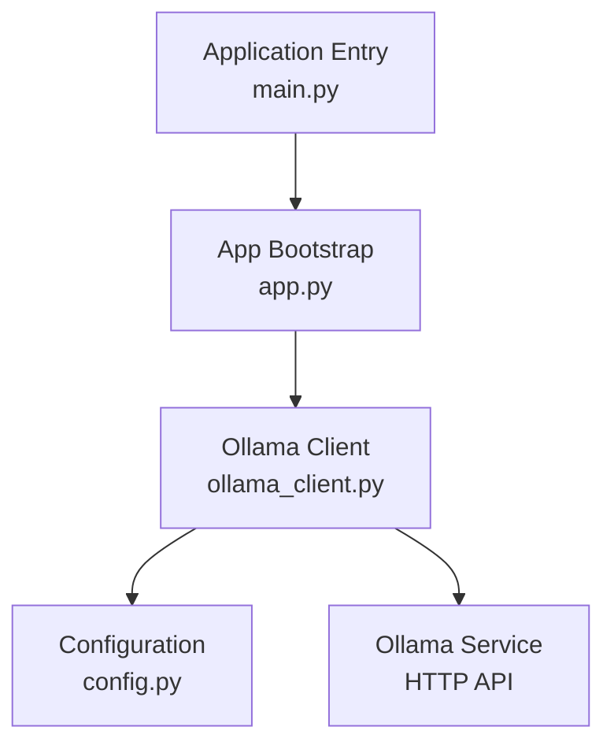
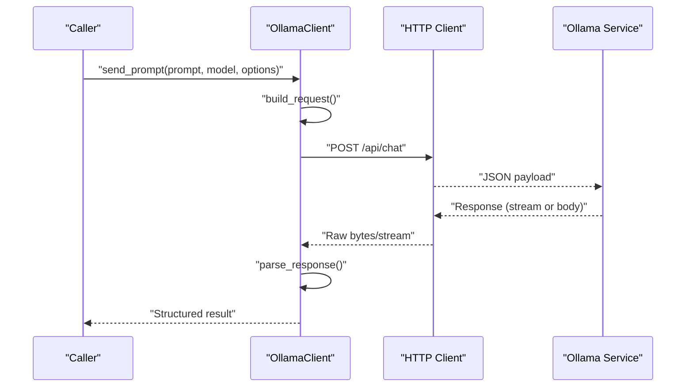
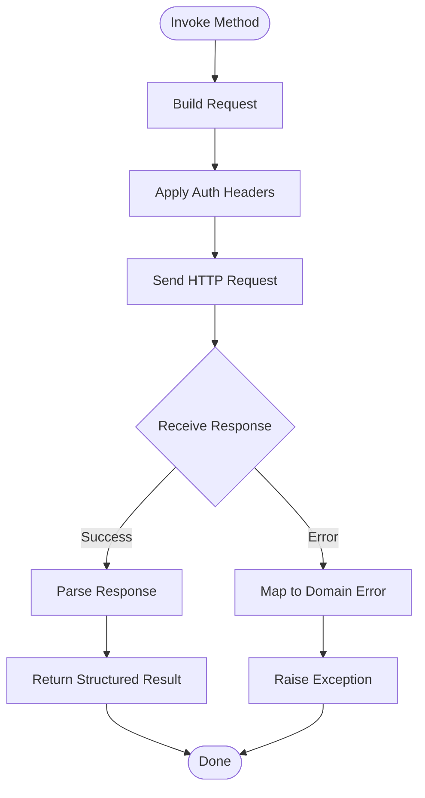
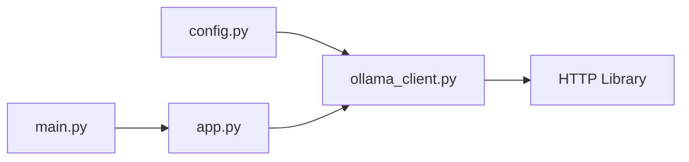

# Ollama Client

<cite>
**Referenced Files in This Document**
- [ollama_client.py](file://carrot/ollama_client.py)
- [config.py](file://carrot/config.py)
- [app.py](file://carrot/app.py)
- [main.py](file://carrot/main.py)
</cite>

## Table of Contents
1. [Introduction](#introduction)
2. [Project Structure](#project-structure)
3. [Core Components](#core-components)
4. [Architecture Overview](#architecture-overview)
5. [Detailed Component Analysis](#detailed-component-analysis)
6. [Dependency Analysis](#dependency-analysis)
7. [Performance Considerations](#performance-considerations)
8. [Troubleshooting Guide](#troubleshooting-guide)
9. [Conclusion](#conclusion)

## Introduction
This document explains how the Ollama client is implemented in the project, focusing on HTTP client setup, API communication patterns, model interaction methods, configuration, authentication, request/response handling, error handling, retries, timeouts, performance optimization, and troubleshooting. It is intended for developers integrating or extending the Ollama integration.

## Project Structure
The Ollama client lives under the application package and is used by higher-level modules to interact with the Ollama service via HTTP. Configuration is centralized and consumed by the client at runtime.

**Diagram sources**
- [main.py](file://carrot/main.py)
- [app.py](file://carrot/app.py)
- [ollama_client.py](file://carrot/ollama_client.py)
- [config.py](file://carrot/config.py)

**Section sources**
- [main.py](file://carrot/main.py)
- [app.py](file://carrot/app.py)
- [ollama_client.py](file://carrot/ollama_client.py)
- [config.py](file://carrot/config.py)

## Core Components
- HTTP client initialization and lifecycle management
- Request builders for chat, generate, list models, and other endpoints
- Response parsers and typed data structures
- Error mapping and retry/backoff logic
- Timeout and connection pooling configuration
- Authentication and header injection

Typical responsibilities:
- Build and send HTTP requests to the Ollama service
- Serialize prompts and parameters into JSON payloads
- Parse streaming and non-streaming responses
- Surface domain-specific exceptions with actionable messages
- Provide configuration hooks for timeouts, retries, and proxies

**Section sources**
- [ollama_client.py](file://carrot/ollama_client.py)
- [config.py](file://carrot/config.py)

## Architecture Overview
The client encapsulates all interactions with the Ollama HTTP API behind a clean interface. It abstracts transport details (connection pooling, timeouts), request construction, and response parsing. Higher-level components call the client without needing to know endpoint specifics.

**Diagram sources**
- [ollama_client.py](file://carrot/ollama_client.py)

## Detailed Component Analysis

### HTTP Client Setup
- Base URL resolution from configuration
- Connection pool sizing and reuse strategy
- Default headers (e.g., Content-Type, Accept)
- Optional authentication headers or tokens
- Proxy and SSL settings if required

Key behaviors:
- Reuse connections across requests
- Apply global timeouts per-request unless overridden
- Normalize errors from the underlying HTTP library

**Section sources**
- [ollama_client.py](file://carrot/ollama_client.py)
- [config.py](file://carrot/config.py)

### API Communication Patterns
Common operations:
- Chat completion with conversation history
- Single-turn generation
- Model listing and metadata retrieval
- Optional streaming responses for incremental tokens

Request building:
- Construct JSON payloads with model name, messages, and options
- Attach optional parameters like temperature, max_tokens, stream
- Handle multipart or binary payloads if needed

Response handling:
- Non-streaming: parse JSON into typed objects
- Streaming: iterate over chunks and yield events
- Normalize status codes and map to domain exceptions

**Section sources**
- [ollama_client.py](file://carrot/ollama_client.py)

### Model Interaction Methods
Representative methods:
- send_prompt(prompt, model, options) -> response
- stream_prompt(prompt, model, options) -> iterator
- list_models() -> list of model descriptors
- get_model_info(model_name) -> model metadata

Behavioral notes:
- Validate inputs before sending
- Support both synchronous and asynchronous flows where applicable
- Expose cancellation points for long-running streams

**Section sources**
- [ollama_client.py](file://carrot/ollama_client.py)

### Configuration and Connection Parameters
Configuration typically includes:
- Base URL (host and port)
- Timeouts (connect, read, write)
- Retry policy (max attempts, backoff strategy)
- Authentication token or credentials
- Proxy settings and TLS options
- Connection pool size and keep-alive behavior

Best practices:
- Separate development and production configs
- Use environment variables or secure secret stores
- Validate config at startup and fail fast on invalid values

**Section sources**
- [config.py](file://carrot/config.py)
- [ollama_client.py](file://carrot/ollama_client.py)

### Authentication
- Token-based auth via Authorization header
- Optional mTLS or certificate validation
- Header precedence and override rules
- Secure storage and rotation strategies

**Section sources**
- [ollama_client.py](file://carrot/ollama_client.py)
- [config.py](file://carrot/config.py)

### Request/Response Cycle
End-to-end flow:
- Caller invokes method with prompt and options
- Client builds request and applies middleware (auth, logging)
- HTTP layer sends request with configured timeouts
- Server responds; client parses and returns structured data
- Errors are mapped to domain exceptions with context

**Diagram sources**
- [ollama_client.py](file://carrot/ollama_client.py)

**Section sources**
- [ollama_client.py](file://carrot/ollama_client.py)

### Error Handling Strategies
- Network errors: timeout, connection refused, DNS failure
- Protocol errors: malformed responses, unsupported media types
- Application errors: 4xx/5xx status codes mapped to specific exceptions
- Retryable vs non-retryable classification
- Contextual error messages including request IDs and endpoints

Retry mechanisms:
- Exponential backoff with jitter
- Idempotency checks for safe retries
- Circuit breaker patterns for sustained failures

Timeout configurations:
- Per-request overrides
- Global defaults
- Stream-aware timeouts

**Section sources**
- [ollama_client.py](file://carrot/ollama_client.py)

### Performance Optimization
- Connection pooling and keep-alive tuning
- Request batching for multiple prompts
- Streaming responses to reduce latency
- Efficient serialization/deserialization
- Caching model metadata and embeddings when appropriate

Batching example pattern:
- Group independent requests
- Send batched payloads if supported
- Aggregate results and preserve ordering

**Section sources**
- [ollama_client.py](file://carrot/ollama_client.py)

### Usage Examples

#### Sending a Prompt and Receiving a Response
- Call the prompt method with model name, prompt text, and options
- Iterate over returned tokens if streaming is enabled
- Handle structured fields such as usage statistics

**Section sources**
- [ollama_client.py](file://carrot/ollama_client.py)

#### Handling Different Response Formats
- Non-streaming JSON responses parsed into typed objects
- Streaming chunk iteration with event types
- Error responses normalized to consistent exception types

**Section sources**
- [ollama_client.py](file://carrot/ollama_client.py)

## Dependency Analysis
The client depends on configuration and an HTTP library. Higher-level modules depend on the client’s public interface.

**Diagram sources**
- [config.py](file://carrot/config.py)
- [ollama_client.py](file://carrot/ollama_client.py)
- [app.py](file://carrot/app.py)
- [main.py](file://carrot/main.py)

**Section sources**
- [config.py](file://carrot/config.py)
- [ollama_client.py](file://carrot/ollama_client.py)
- [app.py](file://carrot/app.py)
- [main.py](file://carrot/main.py)

## Performance Considerations
- Tune connection pool size based on concurrency needs
- Use streaming for large outputs to reduce memory pressure
- Batch independent requests to minimize round-trips
- Cache static model information where possible
- Monitor latency and throughput metrics; adjust timeouts accordingly

[No sources needed since this section provides general guidance]

## Troubleshooting Guide
Common connectivity issues:
- Verify base URL, host, and port reachability
- Check firewall/proxy settings and certificates
- Inspect network logs for DNS or TLS errors

Model loading problems:
- Confirm model name and availability
- Ensure sufficient resources on the server
- Review server-side logs for model load errors

Client-side diagnostics:
- Enable verbose logging for requests/responses
- Validate configuration values at startup
- Test with minimal payloads to isolate issues

Recovery strategies:
- Implement retries with backoff for transient errors
- Gracefully degrade when the service is unavailable
- Provide clear user-facing error messages

**Section sources**
- [ollama_client.py](file://carrot/ollama_client.py)
- [config.py](file://carrot/config.py)

## Conclusion
The Ollama client centralizes HTTP interactions, configuration, and error handling to provide a robust and efficient interface for model communication. By following the recommended configuration, error handling, and performance practices, applications can reliably integrate with Ollama while maintaining responsiveness and resilience.