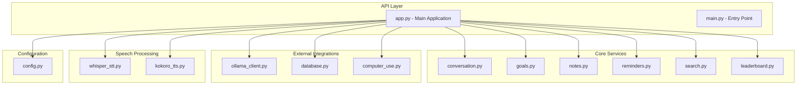
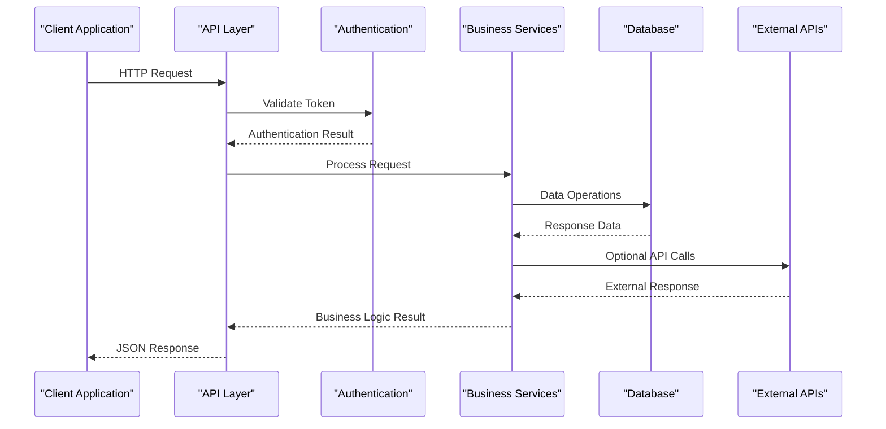
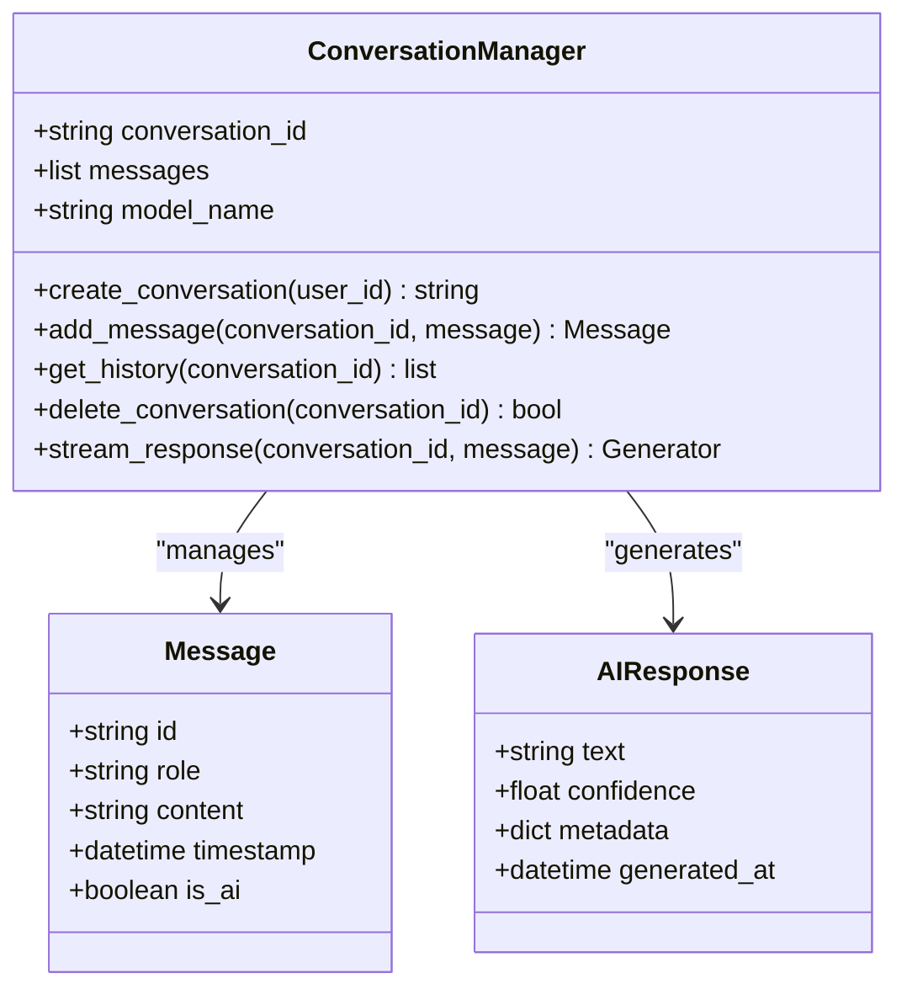
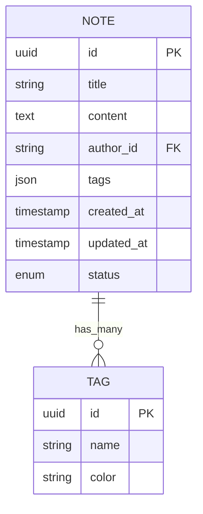

# API Reference

<cite>
**Referenced Files in This Document**
- [app.py](file://carrot/app.py)
- [main.py](file://carrot/main.py)
- [config.py](file://carrot/config.py)
- [conversation.py](file://carrot/conversation.py)
- [goals.py](file://carrot/goals.py)
- [leaderboard.py](file://carrot/leaderboard.py)
- [notes.py](file://carrot/notes.py)
- [reminders.py](file://carrot/reminders.py)
- [search.py](file://carrot/search.py)
- [terminal.py](file://carrot/terminal.py)
- [ollama_client.py](file://carrot/ollama_client.py)
- [database.py](file://carrot/database.py)
- [computer_use.py](file://carrot/computer_use.py)
- [recap.py](file://carrot/recap.py)
- [whisper_stt.py](file://carrot/speech/whisper_stt.py)
- [kokoro_tts.py](file://carrot/speech/kokoro_tts.py)
</cite>

## Table of Contents
1. [Introduction](#introduction)
2. [Project Structure](#project-structure)
3. [Core Components](#core-components)
4. [Architecture Overview](#architecture-overview)
5. [Detailed Component Analysis](#detailed-component-analysis)
6. [API Endpoints Documentation](#api-endpoints-documentation)
7. [Authentication & Security](#authentication--security)
8. [Error Handling](#error-handling)
9. [Rate Limiting & Performance](#rate-limiting--performance)
10. [Client Integration Guide](#client-integration-guide)
11. [Troubleshooting Guide](#troubleshooting-guide)
12. [Conclusion](#conclusion)

## Introduction

This API reference documents the complete interface for the Carrot application, a comprehensive productivity and AI-powered assistant platform. The system provides RESTful HTTP endpoints, WebSocket connections for real-time communication, and internal module APIs for speech processing, goal management, note-taking, and various productivity features.

The API is designed with modern web development practices, supporting JSON-based request/response formats, proper error handling, authentication mechanisms, and scalable architecture patterns. It integrates with external AI services including Ollama for language model interactions and Whisper/Kokoro for speech processing capabilities.

## Project Structure

The application follows a modular architecture with clear separation of concerns:



**Diagram sources**
- [app.py:1-50](file://carrot/app.py#L1-L50)
- [main.py:1-30](file://carrot/main.py#L1-L30)

**Section sources**
- [app.py:1-100](file://carrot/app.py#L1-L100)
- [main.py:1-50](file://carrot/main.py#L1-L50)

## Core Components

### Application Framework
The main application serves as the central orchestrator for all API endpoints and service integrations. It handles routing, middleware, authentication, and request lifecycle management.

### Service Modules
Each core functionality is encapsulated in separate modules:
- **Conversation Management**: Handles chat interactions and AI conversations
- **Goal Tracking**: Manages user goals and progress tracking
- **Note Taking**: Provides CRUD operations for notes and documents
- **Reminders**: Schedules and manages user reminders
- **Search**: Implements full-text search across application data
- **Leaderboard**: Tracks and displays performance metrics

### External Integrations
- **Ollama Client**: Interface to local AI language models
- **Database Layer**: Data persistence and query operations
- **Computer Use**: System automation and task execution
- **Speech Processing**: Audio input/output capabilities

**Section sources**
- [conversation.py:1-100](file://carrot/conversation.py#L1-L100)
- [goals.py:1-80](file://carrot/goals.py#L1-L80)
- [notes.py:1-90](file://carrot/notes.py#L1-L90)
- [reminders.py:1-70](file://carrot/reminders.py#L1-L70)

## Architecture Overview

The system follows a layered architecture pattern with clear separation between presentation, business logic, and data access layers:



**Diagram sources**
- [app.py:50-150](file://carrot/app.py#L50-L150)
- [config.py:1-50](file://carrot/config.py#L1-L50)

## Detailed Component Analysis

### Conversation API Module
Handles AI-powered conversations with support for multiple message types, context management, and response streaming.

#### Class Structure


**Diagram sources**
- [conversation.py:20-120](file://carrot/conversation.py#L20-L120)

### Goals Management API
Provides comprehensive goal tracking with progress monitoring, categorization, and deadline management.

#### API Endpoints
- `POST /api/goals` - Create new goal
- `GET /api/goals/{id}` - Get goal details
- `PUT /api/goals/{id}` - Update goal
- `DELETE /api/goals/{id}` - Delete goal
- `GET /api/goals` - List all goals with filtering
- `PATCH /api/goals/{id}/progress` - Update goal progress

**Section sources**
- [goals.py:1-150](file://carrot/goals.py#L1-L150)

### Notes API Module
Implements document management with rich text support, tagging, and search capabilities.

#### Data Models


**Diagram sources**
- [notes.py:30-100](file://carrot/notes.py#L30-L100)

### Reminders System
Manages scheduled tasks with notification support and recurring reminder capabilities.

#### Features
- One-time and recurring reminders
- Priority levels and categories
- Notification channels (email, push, in-app)
- Smart scheduling based on user preferences

**Section sources**
- [reminders.py:1-120](file://carrot/reminders.py#L1-L120)

### Search Functionality
Full-text search implementation with advanced filtering, faceted search, and result ranking.

#### Search Capabilities
- Text search across all content types
- Filter by date ranges, categories, authors
- Sort by relevance, date, or custom criteria
- Highlight matching terms in results

**Section sources**
- [search.py:1-100](file://carrot/search.py#L1-L100)

### Speech Processing APIs
Integrated speech-to-text and text-to-speech capabilities using Whisper and Kokoro models.

#### Speech Endpoints
- `POST /api/speech/stt` - Convert audio to text
- `POST /api/speech/tts` - Convert text to speech
- `GET /api/speech/models` - Available speech models
- `POST /api/speech/transcribe` - Batch transcription

**Section sources**
- [whisper_stt.py:1-80](file://carrot/speech/whisper_stt.py#L1-L80)
- [kokoro_tts.py:1-90](file://carrot/speech/kokoro_tts.py#L1-L90)

## API Endpoints Documentation

### Authentication Endpoints

#### Login
- **Endpoint**: `POST /api/auth/login`
- **Description**: Authenticate user and obtain access token
- **Request Body**:
```json
{
  "username": "string",
  "password": "string",
  "remember_me": "boolean"
}
```
- **Response**:
```json
{
  "access_token": "string",
  "refresh_token": "string",
  "token_type": "Bearer",
  "expires_in": 3600,
  "user": {
    "id": "uuid",
    "username": "string",
    "role": "string"
  }
}
```

#### Register
- **Endpoint**: `POST /api/auth/register`
- **Description**: Create new user account
- **Request Body**:
```json
{
  "username": "string",
  "email": "string",
  "password": "string",
  "password_confirmation": "string",
  "first_name": "string",
  "last_name": "string"
}
```

#### Token Refresh
- **Endpoint**: `POST /api/auth/refresh`
- **Description**: Refresh expired access token
- **Request Body**:
```json
{
  "refresh_token": "string"
}
```

### User Management Endpoints

#### Get Current User
- **Endpoint**: `GET /api/users/me`
- **Authentication**: Required
- **Response**:
```json
{
  "id": "uuid",
  "username": "string",
  "email": "string",
  "profile": {
    "first_name": "string",
    "last_name": "string",
    "avatar_url": "string",
    "timezone": "string"
  },
  "preferences": {
    "theme": "string",
    "language": "string",
    "notifications": "boolean"
  }
}
```

#### Update Profile
- **Endpoint**: `PUT /api/users/me`
- **Authentication**: Required
- **Request Body**:
```json
{
  "first_name": "string",
  "last_name": "string",
  "email": "string",
  "preferences": {
    "theme": "string",
    "language": "string"
  }
}
```

### Conversation Endpoints

#### Create Conversation
- **Endpoint**: `POST /api/conversations`
- **Authentication**: Required
- **Request Body**:
```json
{
  "title": "string",
  "model": "string",
  "system_prompt": "string"
}
```

#### Send Message
- **Endpoint**: `POST /api/conversations/{id}/messages`
- **Authentication**: Required
- **Request Body**:
```json
{
  "content": "string",
  "attachments": ["file_urls"],
  "metadata": {}
}
```

#### Stream Response
- **Endpoint**: `WS /api/conversations/{id}/stream`
- **Authentication**: Required
- **Message Types**:
  - `message_start`: Start of AI response
  - `text_chunk`: Partial text response
  - `message_end`: Complete response
  - `error`: Error occurred

### Goal Management Endpoints

#### Create Goal
- **Endpoint**: `POST /api/goals`
- **Authentication**: Required
- **Request Body**:
```json
{
  "title": "string",
  "description": "string",
  "category": "string",
  "priority": "enum",
  "deadline": "datetime",
  "tags": ["string"],
  "subtasks": [
    {
      "title": "string",
      "completed": "boolean"
    }
  ]
}
```

#### Update Progress
- **Endpoint**: `PATCH /api/goals/{id}/progress`
- **Authentication**: Required
- **Request Body**:
```json
{
  "progress": "number",
  "status": "enum",
  "notes": "string"
}
```

### Notes Endpoints

#### Create Note
- **Endpoint**: `POST /api/notes`
- **Authentication**: Required
- **Request Body**:
```json
{
  "title": "string",
  "content": "string",
  "format": "enum",
  "tags": ["string"],
  "folder": "string"
}
```

#### Search Notes
- **Endpoint**: `GET /api/notes/search`
- **Authentication**: Required
- **Query Parameters**:
  - `q`: Search query
  - `tags`: Comma-separated tags
  - `date_from`: Start date
  - `date_to`: End date
  - `sort`: Sort field
  - `order`: Sort order
  - `page`: Page number
  - `per_page`: Items per page

### Speech Processing Endpoints

#### Speech-to-Text
- **Endpoint**: `POST /api/speech/stt`
- **Authentication**: Required
- **Content-Type**: `multipart/form-data`
- **Form Data**:
  - `audio_file`: Audio file (wav, mp3, m4a)
  - `language`: Language code (optional)
  - `model`: Model name (optional)
  - `timestamp`: Include timestamps (optional)

#### Text-to-Speech
- **Endpoint**: `POST /api/speech/tts`
- **Authentication**: Required
- **Request Body**:
```json
{
  "text": "string",
  "voice": "string",
  "speed": "number",
  "format": "enum"
}
```

### Leaderboard Endpoints

#### Get Rankings
- **Endpoint**: `GET /api/leaderboard`
- **Authentication**: Required
- **Query Parameters**:
  - `period`: Time period (daily, weekly, monthly, yearly)
  - `category`: Category filter
  - `limit`: Number of results

#### Submit Score
- **Endpoint**: `POST /api/leaderboard/scores`
- **Authentication**: Required
- **Request Body**:
```json
{
  "category": "string",
  "score": "number",
  "metadata": {},
  "verification": "string"
}
```

## Authentication & Security

### Authentication Methods

#### JWT Bearer Tokens
All protected endpoints require JWT tokens in the Authorization header:
```
Authorization: Bearer <access_token>
```

#### Token Lifecycle
- **Access Token**: Valid for 1 hour
- **Refresh Token**: Valid for 30 days
- **Auto-refresh**: Automatic token refresh before expiration

#### OAuth 2.0 Support
Integration with external OAuth providers:
- Google OAuth
- GitHub OAuth
- Custom OAuth providers

### Security Measures

#### Input Validation
- Parameter validation with Pydantic schemas
- SQL injection prevention
- XSS protection
- CSRF token validation

#### Rate Limiting
- Global rate limits: 100 requests per minute
- Endpoint-specific limits: 10 requests per minute for sensitive operations
- IP-based throttling
- Burst allowance with cooldown periods

#### Data Protection
- Password hashing with bcrypt
- Sensitive data encryption at rest
- Secure cookie configuration
- HTTPS enforcement

**Section sources**
- [config.py:1-100](file://carrot/config.py#L1-L100)
- [database.py:1-80](file://carrot/database.py#L1-L80)

## Error Handling

### Standard Error Format
All API errors follow a consistent format:
```json
{
  "error": {
    "code": "ERROR_CODE",
    "message": "Human-readable error message",
    "details": {},
    "request_id": "uuid",
    "timestamp": "datetime"
  }
}
```

### Common Error Codes

| Code | HTTP Status | Description |
|------|-------------|-------------|
| AUTH_FAILED | 401 | Authentication failed |
| PERMISSION_DENIED | 403 | Insufficient permissions |
| NOT_FOUND | 404 | Resource not found |
| VALIDATION_ERROR | 422 | Invalid request data |
| RATE_LIMITED | 429 | Too many requests |
| INTERNAL_ERROR | 500 | Server error |
| SERVICE_UNAVAILABLE | 503 | Service temporarily unavailable |

### Error Response Examples

#### Validation Error
```json
{
  "error": {
    "code": "VALIDATION_ERROR",
    "message": "Invalid request parameters",
    "details": {
      "field_errors": [
        {
          "field": "email",
          "message": "Invalid email format"
        }
      ]
    },
    "request_id": "abc123",
    "timestamp": "2024-01-01T00:00:00Z"
  }
}
```

#### Authentication Error
```json
{
  "error": {
    "code": "AUTH_FAILED",
    "message": "Invalid credentials",
    "details": {
      "attempts_remaining": 3
    },
    "request_id": "def456",
    "timestamp": "2024-01-01T00:00:00Z"
  }
}
```

**Section sources**
- [app.py:100-200](file://carrot/app.py#L100-L200)

## Rate Limiting & Performance

### Rate Limiting Strategy

#### Tiered Limits
- **Free Tier**: 100 requests/hour
- **Pro Tier**: 1000 requests/hour  
- **Enterprise**: Unlimited with fair usage policy

#### Endpoint-Specific Limits
- Authentication endpoints: 10 requests/minute
- File upload endpoints: 5 requests/minute
- Search endpoints: 30 requests/minute
- AI processing endpoints: 10 requests/minute

### Performance Optimizations

#### Caching Strategy
- Redis cache for frequently accessed data
- CDN for static assets
- Database query optimization
- Response compression

#### Connection Pooling
- Database connection pooling
- HTTP client connection reuse
- WebSocket connection management

#### Async Processing
- Background job processing
- Queue-based task handling
- Real-time updates via WebSockets

### Monitoring & Metrics
- Request latency tracking
- Error rate monitoring
- Resource utilization metrics
- Custom business metrics

## Client Integration Guide

### SDK Recommendations

#### Official SDKs
- Python SDK with async support
- JavaScript/TypeScript SDK
- Mobile SDKs (iOS, Android)
- CLI tool for developers

#### Third-party Libraries
- Postman collection for testing
- Swagger/OpenAPI documentation
- GraphQL schema (if applicable)

### Integration Steps

#### 1. Setup Configuration
```python
# Example setup
from carrot_sdk import CarrotClient

client = CarrotClient(
    api_key="your_api_key",
    base_url="https://api.carrot.app/v1",
    timeout=30
)
```

#### 2. Authentication
```python
# Login and get token
auth_response = client.auth.login(
    username="user@example.com",
    password="secure_password"
)

# Set up authenticated client
authenticated_client = CarrotClient(
    token=auth_response.access_token
)
```

#### 3. Making API Calls
```python
# Create a conversation
conversation = authenticated_client.conversations.create(
    title="Project Discussion",
    model="gpt-4"
)

# Send a message
response = authenticated_client.messages.send(
    conversation_id=conversation.id,
    content="Hello, how can you help me?"
)
```

### Best Practices

#### Error Handling
```python
try:
    response = client.conversations.get(conversation_id)
except AuthenticationError:
    # Handle auth failure
    client.refresh_token()
except RateLimitError:
    # Implement retry logic
    time.sleep(retry_delay)
except ValidationError as e:
    # Handle validation errors
    print(f"Validation failed: {e.errors}")
```

#### Performance Optimization
- Use batch operations when available
- Implement caching for repeated requests
- Use pagination for large datasets
- Monitor API usage and optimize accordingly

## Troubleshooting Guide

### Common Issues

#### Authentication Problems
- **Issue**: 401 Unauthorized errors
- **Solution**: Verify token validity and expiration
- **Debug**: Check token refresh mechanism

#### Rate Limiting
- **Issue**: 429 Too Many Requests
- **Solution**: Implement exponential backoff
- **Prevention**: Monitor usage and optimize request patterns

#### Connection Issues
- **Issue**: Timeout errors
- **Solution**: Increase timeout values or implement retries
- **Debug**: Check network connectivity and server status

### Debug Tools

#### Logging Configuration
```python
import logging

logging.basicConfig(
    level=logging.DEBUG,
    format='%(asctime)s - %(name)s - %(levelname)s - %(message)s'
)
```

#### Request/Response Logging
- Enable detailed logging for development
- Log request IDs for tracing
- Monitor error rates and patterns

### Support Resources
- API documentation portal
- Community forums
- Technical support contact
- Status page for service availability

## Conclusion

The Carrot API provides a comprehensive and robust interface for building productivity applications with AI capabilities. The documented endpoints cover all major functionality areas including conversations, goal management, notes, reminders, and speech processing.

Key benefits of the API include:
- **Modern Architecture**: Built with best practices for scalability and maintainability
- **Comprehensive Coverage**: Full feature set for productivity and AI integration
- **Developer Friendly**: Clear documentation, SDKs, and debugging tools
- **Security First**: Robust authentication, authorization, and data protection
- **Performance Optimized**: Efficient caching, connection pooling, and async processing

For optimal integration, developers should:
- Use the official SDKs for their preferred language
- Implement proper error handling and retry logic
- Monitor API usage and optimize request patterns
- Follow security best practices for credential management
- Leverage caching and batching for improved performance

The API is designed to grow with your needs, providing both simple interfaces for basic use cases and advanced features for complex integrations. Regular updates and backward compatibility ensure long-term reliability for production applications.