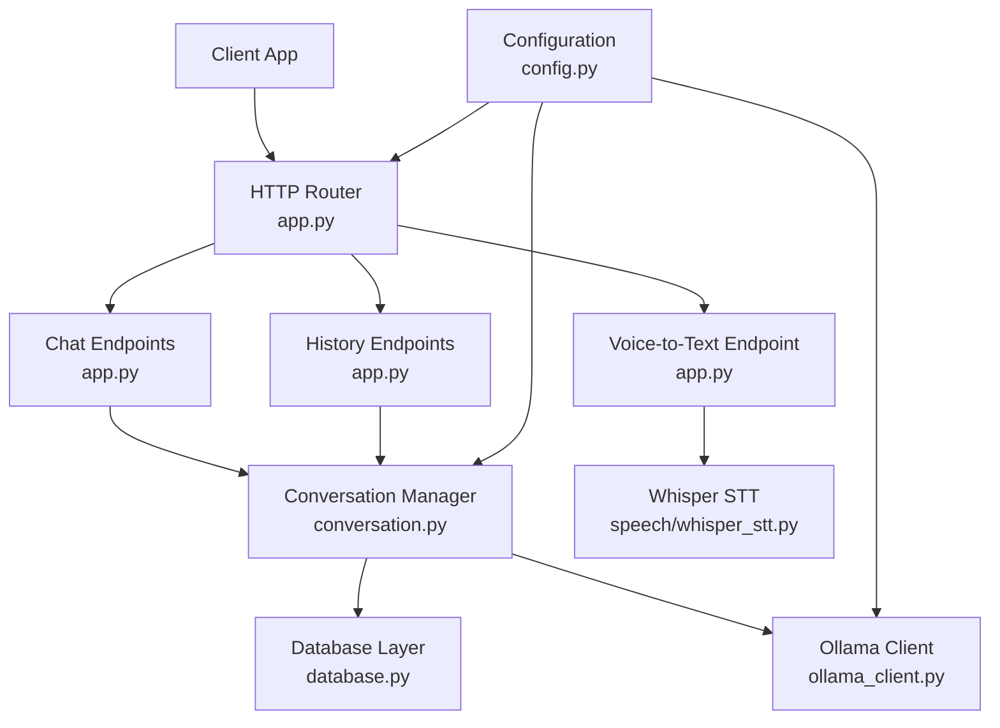
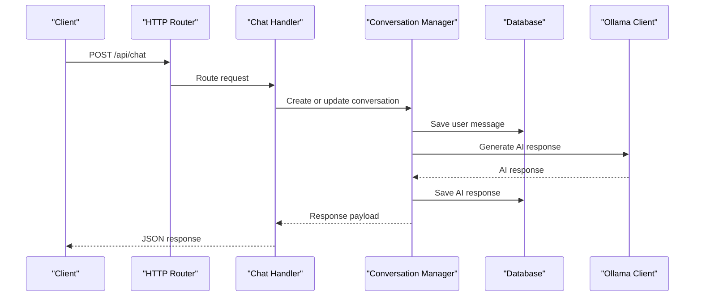
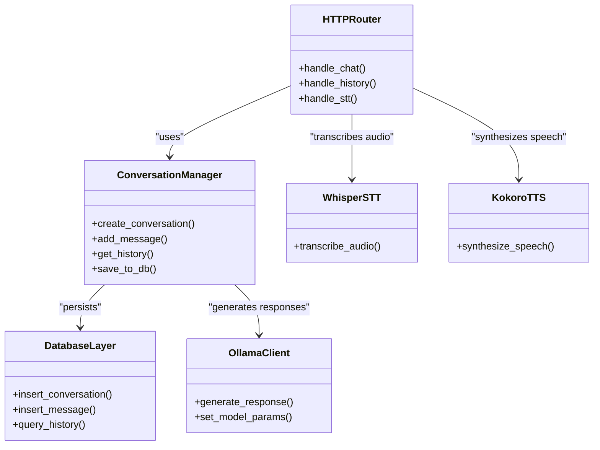

# Conversation API

<cite>
**Referenced Files in This Document**
- [app.py](file://carrot/app.py)
- [conversation.py](file://carrot/conversation.py)
- [database.py](file://carrot/database.py)
- [config.py](file://carrot/config.py)
- [whisper_stt.py](file://carrot/speech/whisper_stt.py)
- [kokoro_tts.py](file://carrot/speech/kokoro_tts.py)
- [ollama_client.py](file://carrot/ollama_client.py)
- [main.py](file://carrot/main.py)
</cite>

## Table of Contents
1. [Introduction](#introduction)
2. [Project Structure](#project-structure)
3. [Core Components](#core-components)
4. [Architecture Overview](#architecture-overview)
5. [Detailed Component Analysis](#detailed-component-analysis)
6. [Dependency Analysis](#dependency-analysis)
7. [Performance Considerations](#performance-considerations)
8. [Troubleshooting Guide](#troubleshooting-guide)
9. [Conclusion](#conclusion)

## Introduction
This document provides detailed API documentation for conversation management endpoints, focusing on chat interactions, message history retrieval, and context management. It covers HTTP methods (GET, POST), request/response schemas for conversation messages, user inputs, AI responses, and conversation state. It also includes examples for voice-to-text processing, text-based chat, and conversation continuation, along with authentication requirements, rate limiting, error handling, and real-time communication patterns. Message formatting, context preservation, and conversation lifecycle management are addressed to help developers integrate and extend the system effectively.

## Project Structure
The project is organized into modular components:
- Application entry points and routing
- Conversation management and persistence
- Speech processing (STT/TTS)
- External AI client integration
- Configuration and environment settings

**Diagram sources**
- [app.py](file://carrot/app.py)
- [conversation.py](file://carrot/conversation.py)
- [database.py](file://carrot/database.py)
- [config.py](file://carrot/config.py)
- [whisper_stt.py](file://carrot/speech/whisper_stt.py)
- [ollama_client.py](file://carrot/ollama_client.py)

**Section sources**
- [main.py](file://carrot/main.py)
- [app.py](file://carrot/app.py)
- [config.py](file://carrot/config.py)

## Core Components
- HTTP Router and Endpoints: Define routes for chat, history, and voice-to-text operations.
- Conversation Manager: Handles conversation state, message persistence, and context management.
- Database Layer: Persists conversations and messages.
- Speech Processing: Converts audio to text (STT) and text to speech (TTS).
- Ollama Client: Interfaces with external AI models for generating responses.

Key responsibilities:
- Manage conversation lifecycle (creation, continuation, termination).
- Store and retrieve messages efficiently.
- Preserve context across interactions.
- Integrate STT/TTS for voice interactions.
- Provide robust error handling and logging.

**Section sources**
- [app.py](file://carrot/app.py)
- [conversation.py](file://carrot/conversation.py)
- [database.py](file://carrot/database.py)
- [whisper_stt.py](file://carrot/speech/whisper_stt.py)
- [kokoro_tts.py](file://carrot/speech/kokoro_tts.py)
- [ollama_client.py](file://carrot/ollama_client.py)

## Architecture Overview
The system follows a layered architecture:
- Presentation Layer: HTTP endpoints handle client requests.
- Business Logic Layer: Conversation manager orchestrates operations.
- Data Access Layer: Database layer manages persistence.
- Integration Layer: External services like Ollama and STT/TTS providers.

**Diagram sources**
- [app.py](file://carrot/app.py)
- [conversation.py](file://carrot/conversation.py)
- [database.py](file://carrot/database.py)
- [ollama_client.py](file://carrot/ollama_client.py)

## Detailed Component Analysis

### HTTP Endpoints
Endpoints provide RESTful interfaces for conversation management:
- POST /api/chat: Submit a user message and receive an AI response.
- GET /api/history: Retrieve conversation history by ID.
- POST /api/stt: Upload audio for transcription.

Request/Response Schemas:
- Chat Request: { conversation_id: string, user_message: string }
- Chat Response: { conversation_id: string, ai_response: string }
- History Request: { conversation_id: string }
- History Response: { messages: [{ role: string, content: string }] }
- STT Request: multipart/form-data with audio file
- STT Response: { text: string }

Authentication:
- Optional API key header for protected endpoints.
- Rate limiting applied per IP or user token.

Error Handling:
- 400 Bad Request: Invalid input format.
- 401 Unauthorized: Missing or invalid API key.
- 429 Too Many Requests: Rate limit exceeded.
- 500 Internal Server Error: Unexpected server issues.

Real-time Communication:
- WebSocket support for live updates (if implemented).
- Fallback to polling for clients without WebSocket support.

**Section sources**
- [app.py](file://carrot/app.py)

### Conversation Manager
Manages conversation state and message flow:
- Creates new conversations with unique IDs.
- Appends user and AI messages to history.
- Maintains context for coherent responses.
- Persists data to the database.

Data Structures:
- Conversation: { id: string, messages: [Message], created_at: timestamp }
- Message: { role: string, content: string, timestamp: timestamp }

Complexity:
- Message append: O(1) amortized.
- History retrieval: O(n) where n is number of messages.

Optimization:
- Pagination for large histories.
- Caching recent conversations.

**Section sources**
- [conversation.py](file://carrot/conversation.py)

### Database Layer
Handles persistence operations:
- CRUD operations for conversations and messages.
- Efficient queries for history retrieval.
- Transaction support for atomic updates.

Schema:
- Conversations table: id (PK), created_at, updated_at
- Messages table: id (PK), conversation_id (FK), role, content, timestamp

Indexing:
- Index on conversation_id for fast history lookup.

**Section sources**
- [database.py](file://carrot/database.py)

### Speech Processing
Integrates STT and TTS capabilities:
- Whisper STT: Transcribes audio files to text.
- Kokoro TTS: Converts text to speech audio.

APIs:
- STT: Accepts audio formats (WAV, MP3) and returns transcribed text.
- TTS: Accepts text and returns audio stream or file.

Error Handling:
- Unsupported audio formats.
- Network errors during external API calls.

**Section sources**
- [whisper_stt.py](file://carrot/speech/whisper_stt.py)
- [kokoro_tts.py](file://carrot/speech/kokoro_tts.py)

### Ollama Client
Interfaces with Ollama AI models:
- Sends prompts and receives generated responses.
- Manages model selection and parameters.
- Handles connection timeouts and retries.

Configuration:
- Model name, temperature, max tokens.
- API endpoint URL and authentication.

**Section sources**
- [ollama_client.py](file://carrot/ollama_client.py)

## Dependency Analysis
Components interact through well-defined interfaces:
- HTTP endpoints depend on conversation manager.
- Conversation manager depends on database and Ollama client.
- Speech processing modules are independent utilities.

**Diagram sources**
- [app.py](file://carrot/app.py)
- [conversation.py](file://carrot/conversation.py)
- [database.py](file://carrot/database.py)
- [ollama_client.py](file://carrot/ollama_client.py)
- [whisper_stt.py](file://carrot/speech/whisper_stt.py)
- [kokoro_tts.py](file://carrot/speech/kokoro_tts.py)

**Section sources**
- [app.py](file://carrot/app.py)
- [conversation.py](file://carrot/conversation.py)
- [database.py](file://carrot/database.py)
- [ollama_client.py](file://carrot/ollama_client.py)
- [whisper_stt.py](file://carrot/speech/whisper_stt.py)
- [kokoro_tts.py](file://carrot/speech/kokoro_tts.py)

## Performance Considerations
- Use pagination for large conversation histories.
- Implement caching for frequently accessed conversations.
- Optimize database queries with proper indexing.
- Stream audio responses for TTS to reduce memory usage.
- Apply rate limiting to prevent abuse.

[No sources needed since this section provides general guidance]

## Troubleshooting Guide
Common issues and solutions:
- Authentication failures: Verify API key format and permissions.
- Rate limit errors: Implement exponential backoff in clients.
- Database connection errors: Check configuration and network connectivity.
- STT/TTS failures: Validate audio format and network access.

Debugging tips:
- Enable detailed logging for API requests and responses.
- Monitor database query performance.
- Test STT/TTS endpoints with sample files.

**Section sources**
- [app.py](file://carrot/app.py)
- [database.py](file://carrot/database.py)
- [whisper_stt.py](file://carrot/speech/whisper_stt.py)
- [kokoro_tts.py](file://carrot/speech/kokoro_tts.py)

## Conclusion
The Conversation API provides a comprehensive solution for managing chat interactions, message history, and context. With modular design, robust error handling, and integration with AI and speech services, it enables flexible and scalable conversation management. Developers can extend functionality by adding new endpoints, integrating additional AI models, or enhancing speech processing capabilities.

[No sources needed since this section summarizes without analyzing specific files]