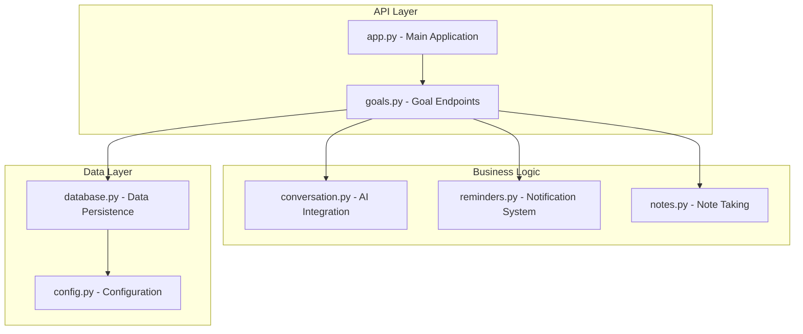
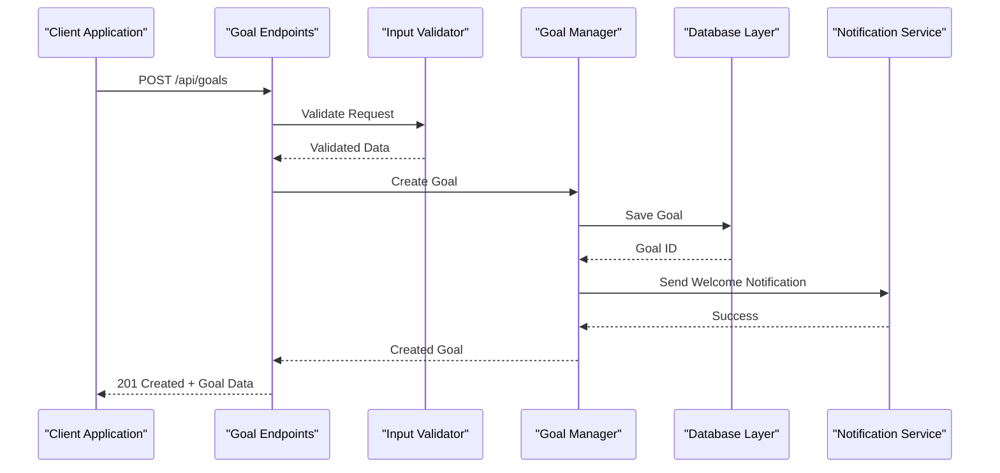

# Goals Management API

<cite>
**Referenced Files in This Document**
- [goals.py](file://carrot/goals.py)
- [app.py](file://carrot/app.py)
- [database.py](file://carrot/database.py)
- [config.py](file://carrot/config.py)
- [conversation.py](file://carrot/conversation.py)
- [reminders.py](file://carrot/reminders.py)
- [notes.py](file://carrot/notes.py)
</cite>

## Table of Contents
1. [Introduction](#introduction)
2. [Project Structure](#project-structure)
3. [Core Components](#core-components)
4. [Architecture Overview](#architecture-overview)
5. [API Endpoints Documentation](#api-endpoints-documentation)
6. [Data Models and Schemas](#data-models-and-schemas)
7. [Authentication and Authorization](#authentication-and-authorization)
8. [Error Handling](#error-handling)
9. [Performance Considerations](#performance-considerations)
10. [Troubleshooting Guide](#troubleshooting-guide)
11. [Conclusion](#conclusion)

## Introduction

The Goals Management API provides a comprehensive RESTful interface for managing personal goals within the Carrot application. This API enables users to create, update, delete, and track progress on their goals through a well-defined set of HTTP endpoints. The system supports goal categorization, status management, progress tracking, and advanced querying capabilities including filtering, sorting, and pagination.

## Project Structure

The goal tracking functionality is implemented across several core modules:



**Diagram sources**
- [app.py](file://carrot/app.py)
- [goals.py](file://carrot/goals.py)
- [database.py](file://carrot/database.py)

**Section sources**
- [app.py](file://carrot/app.py)
- [goals.py](file://carrot/goals.py)
- [database.py](file://carrot/database.py)

## Core Components

### Goal Model
The goal model represents individual goals with properties such as title, description, category, status, progress, deadlines, and metadata. Each goal maintains its own history of status changes and progress updates.

### Goal Manager
The goal manager handles all business logic operations including validation, CRUD operations, progress calculations, and integration with other system components like reminders and notes.

### Database Layer
The database layer provides persistence mechanisms for storing goal data, maintaining relationships between goals and related entities, and ensuring data integrity.

**Section sources**
- [goals.py](file://carrot/goals.py)
- [database.py](file://carrot/database.py)

## Architecture Overview

The Goals Management API follows a layered architecture pattern that separates concerns between API handling, business logic, and data persistence:



**Diagram sources**
- [goals.py](file://carrot/goals.py)
- [database.py](file://carrot/database.py)
- [reminders.py](file://carrot/reminders.py)

## API Endpoints Documentation

### Goal Management Endpoints

#### Create Goal
**Endpoint:** `POST /api/goals`

Creates a new goal with specified parameters.

**Request Schema:**
```json
{
  "title": "string (required, max 200 chars)",
  "description": "string (optional, max 1000 chars)",
  "category": "string (required, enum: personal, work, health, learning, finance)",
  "deadline": "string (optional, ISO 8601 date format)",
  "target_value": "number (optional, positive number)",
  "current_value": "number (optional, non-negative, default: 0)",
  "unit": "string (optional, e.g., 'hours', 'dollars', 'books')",
  "tags": "array (optional, array of strings)",
  "priority": "string (optional, enum: low, medium, high, urgent)",
  "is_recurring": "boolean (optional, default: false)"
}
```

**Response Schema (201 Created):**
```json
{
  "id": "string (UUID)",
  "title": "string",
  "description": "string",
  "category": "string",
  "status": "string (enum: active, completed, paused, cancelled)",
  "progress": {
    "current_value": "number",
    "target_value": "number",
    "percentage": "number",
    "unit": "string"
  },
  "deadline": "string (ISO 8601)",
  "tags": ["string"],
  "priority": "string",
  "is_recurring": "boolean",
  "created_at": "string (ISO 8601)",
  "updated_at": "string (ISO 8601)"
}
```

**Validation Rules:**
- Title must be between 1 and 200 characters
- Description must not exceed 1000 characters
- Category must be one of the predefined values
- Deadline must be a valid ISO 8601 date format
- Target value must be positive if provided
- Current value must be non-negative and not exceed target value
- Tags must be unique strings

**Status Codes:**
- `201 Created`: Goal successfully created
- `400 Bad Request`: Invalid input data
- `409 Conflict`: Duplicate goal detected

#### Update Goal
**Endpoint:** `PUT /api/goals/{goal_id}`

Updates an existing goal's properties.

**Path Parameters:**
- `goal_id`: string (UUID format)

**Request Schema:**
```json
{
  "title": "string (optional, max 200 chars)",
  "description": "string (optional, max 1000 chars)",
  "category": "string (optional, enum: personal, work, health, learning, finance)",
  "deadline": "string (optional, ISO 8601 date format)",
  "target_value": "number (optional, positive number)",
  "current_value": "number (optional, non-negative)",
  "unit": "string (optional)",
  "tags": "array (optional, array of strings)",
  "priority": "string (optional, enum: low, medium, high, urgent)",
  "is_recurring": "boolean (optional)"
}
```

**Response Schema (200 OK):**
```json
{
  "id": "string",
  "title": "string",
  "description": "string",
  "category": "string",
  "status": "string",
  "progress": {
    "current_value": "number",
    "target_value": "number",
    "percentage": "number",
    "unit": "string"
  },
  "deadline": "string",
  "tags": ["string"],
  "priority": "string",
  "is_recurring": "boolean",
  "created_at": "string",
  "updated_at": "string"
}
```

**Status Codes:**
- `200 OK`: Goal successfully updated
- `400 Bad Request`: Invalid input data
- `404 Not Found`: Goal not found
- `409 Conflict`: Business rule violation

#### Delete Goal
**Endpoint:** `DELETE /api/goals/{goal_id}`

Deletes a goal permanently.

**Path Parameters:**
- `goal_id`: string (UUID format)

**Response Schema (204 No Content):**
Empty response body

**Status Codes:**
- `204 No Content`: Goal successfully deleted
- `404 Not Found`: Goal not found
- `409 Conflict`: Cannot delete goal with dependencies

#### Get Goal by ID
**Endpoint:** `GET /api/goals/{goal_id}`

Retrieves a specific goal by its ID.

**Path Parameters:**
- `goal_id`: string (UUID format)

**Response Schema (200 OK):**
Same as goal creation response schema

**Status Codes:**
- `200 OK`: Goal found and returned
- `404 Not Found`: Goal not found

#### List Goals
**Endpoint:** `GET /api/goals`

Retrieves a paginated list of goals with filtering and sorting options.

**Query Parameters:**
- `page`: integer (optional, default: 1, min: 1)
- `per_page`: integer (optional, default: 20, max: 100)
- `category`: string (optional, filter by category)
- `status`: string (optional, filter by status)
- `priority`: string (optional, filter by priority)
- `tag`: string (optional, filter by tag)
- `search`: string (optional, search in title and description)
- `sort_by`: string (optional, fields: created_at, deadline, title, progress_percentage)
- `sort_order`: string (optional, asc or desc, default: desc)
- `date_from`: string (optional, ISO 8601 date, filter goals created after this date)
- `date_to`: string (optional, ISO 8601 date, filter goals created before this date)

**Response Schema (200 OK):**
```json
{
  "goals": [
    {
      "id": "string",
      "title": "string",
      "description": "string",
      "category": "string",
      "status": "string",
      "progress": {
        "current_value": "number",
        "target_value": "number",
        "percentage": "number",
        "unit": "string"
      },
      "deadline": "string",
      "tags": ["string"],
      "priority": "string",
      "is_recurring": "boolean",
      "created_at": "string",
      "updated_at": "string"
    }
  ],
  "pagination": {
    "current_page": "integer",
    "per_page": "integer",
    "total_items": "integer",
    "total_pages": "integer",
    "has_next": "boolean",
    "has_previous": "boolean"
  }
}
```

**Status Codes:**
- `200 OK`: Goals retrieved successfully
- `400 Bad Request`: Invalid query parameters

#### Bulk Operations
**Endpoint:** `POST /api/goals/bulk`

Performs bulk operations on multiple goals.

**Request Schema:**
```json
{
  "operations": [
    {
      "action": "string (enum: update, delete, status_change)",
      "goal_id": "string",
      "data": "object (depends on action)"
    }
  ]
}
```

**Response Schema (200 OK):**
```json
{
  "results": [
    {
      "goal_id": "string",
      "action": "string",
      "status": "string (success, failed)",
      "message": "string"
    }
  ],
  "summary": {
    "total_operations": "integer",
    "successful_operations": "integer",
    "failed_operations": "integer"
  }
}
```

**Status Codes:**
- `200 OK`: All operations processed
- `400 Bad Request`: Invalid request format
- `422 Unprocessable Entity`: Some operations failed

### Progress Tracking Endpoints

#### Update Progress
**Endpoint:** `PATCH /api/goals/{goal_id}/progress`

Updates the progress of a specific goal.

**Path Parameters:**
- `goal_id`: string (UUID format)

**Request Schema:**
```json
{
  "current_value": "number (required, non-negative)",
  "note": "string (optional, progress note)",
  "timestamp": "string (optional, ISO 8601 datetime)"
}
```

**Response Schema (200 OK):**
```json
{
  "goal_id": "string",
  "previous_progress": {
    "current_value": "number",
    "percentage": "number"
  },
  "new_progress": {
    "current_value": "number",
    "percentage": "number",
    "unit": "string"
  },
  "milestone_achieved": "boolean",
  "completion_status": "string (active, completed, over_target)"
}
```

**Status Codes:**
- `200 OK`: Progress updated successfully
- `400 Bad Request`: Invalid progress data
- `404 Not Found`: Goal not found

#### Get Progress History
**Endpoint:** `GET /api/goals/{goal_id}/progress/history`

Retrieves the progress history for a specific goal.

**Query Parameters:**
- `limit`: integer (optional, default: 50, max: 100)
- `offset`: integer (optional, default: 0)

**Response Schema (200 OK):**
```json
{
  "history": [
    {
      "timestamp": "string (ISO 8601)",
      "current_value": "number",
      "percentage": "number",
      "note": "string",
      "change_amount": "number"
    }
  ],
  "total_entries": "integer"
}
```

**Status Codes:**
- `200 OK`: History retrieved successfully
- `404 Not Found`: Goal not found

### Status Management Endpoints

#### Update Status
**Endpoint:** `PATCH /api/goals/{goal_id}/status`

Updates the status of a goal.

**Path Parameters:**
- `goal_id`: string (UUID format)

**Request Schema:**
```json
{
  "status": "string (required, enum: active, paused, completed, cancelled)",
  "reason": "string (optional, reason for status change)"
}
```

**Response Schema (200 OK):**
```json
{
  "goal_id": "string",
  "previous_status": "string",
  "new_status": "string",
  "updated_at": "string (ISO 8601)",
  "reason": "string"
}
```

**Status Codes:**
- `200 OK`: Status updated successfully
- `400 Bad Request`: Invalid status transition
- `404 Not Found`: Goal not found

#### Get Status History
**Endpoint:** `GET /api/goals/{goal_id}/status/history`

Retrieves the status change history for a specific goal.

**Response Schema (200 OK):**
```json
{
  "history": [
    {
      "timestamp": "string (ISO 8601)",
      "previous_status": "string",
      "new_status": "string",
      "reason": "string"
    }
  ],
  "total_entries": "integer"
}
```

**Status Codes:**
- `200 OK`: History retrieved successfully
- `404 Not Found`: Goal not found

### Category Management Endpoints

#### List Categories
**Endpoint:** `GET /api/categories`

Retrieves available goal categories.

**Response Schema (200 OK):**
```json
{
  "categories": [
    {
      "id": "string",
      "name": "string",
      "description": "string",
      "color": "string (hex color code)",
      "icon": "string",
      "goal_count": "integer"
    }
  ]
}
```

**Status Codes:**
- `200 OK`: Categories retrieved successfully

#### Get Category Statistics
**Endpoint:** `GET /api/categories/{category_id}/stats`

Retrieves statistics for a specific category.

**Response Schema (200 OK):**
```json
{
  "category_id": "string",
  "category_name": "string",
  "total_goals": "integer",
  "active_goals": "integer",
  "completed_goals": "integer",
  "average_completion_rate": "number",
  "top_tags": ["string"]
}
```

**Status Codes:**
- `200 OK`: Statistics retrieved successfully
- `404 Not Found`: Category not found

## Data Models and Schemas

### Goal Object
The goal object is the central entity in the system with the following structure:

| Field | Type | Required | Description | Constraints |
|-------|------|----------|-------------|-------------|
| id | string | Yes | Unique identifier | UUID v4 format |
| title | string | Yes | Goal title | 1-200 characters |
| description | string | No | Detailed description | Max 1000 characters |
| category | string | Yes | Goal category | Enum: personal, work, health, learning, finance |
| status | string | Yes | Current status | Enum: active, completed, paused, cancelled |
| progress | object | Yes | Progress information | See progress schema |
| deadline | string | No | Target completion date | ISO 8601 date format |
| tags | array | No | Categorization tags | Array of unique strings |
| priority | string | No | Priority level | Enum: low, medium, high, urgent |
| is_recurring | boolean | No | Recurring goal flag | Default: false |
| created_at | string | Yes | Creation timestamp | ISO 8601 datetime |
| updated_at | string | Yes | Last update timestamp | ISO 8601 datetime |

### Progress Object
Progress tracking uses a structured object to manage goal advancement:

| Field | Type | Description | Constraints |
|-------|------|-------------|-------------|
| current_value | number | Current progress value | Non-negative number |
| target_value | number | Target completion value | Positive number |
| percentage | number | Completion percentage | 0-100 range |
| unit | string | Measurement unit | Alphanumeric string |

### Validation Rules

#### Input Validation
All API endpoints implement comprehensive input validation:

- **Format Validation**: Date formats, email addresses, URLs, etc.
- **Range Validation**: Numeric ranges, string lengths, array sizes
- **Enum Validation**: Allowed values for categorical fields
- **Cross-field Validation**: Dependencies between fields
- **Business Rule Validation**: Domain-specific constraints

#### Error Response Format
```json
{
  "error": {
    "code": "string",
    "message": "string",
    "details": [
      {
        "field": "string",
        "message": "string",
        "code": "string"
      }
    ]
  }
}
```

**Section sources**
- [goals.py](file://carrot/goals.py)
- [database.py](file://carrot/database.py)

## Authentication and Authorization

### Authentication Method
The API uses JWT (JSON Web Token) authentication for secure access control.

### Headers
```
Authorization: Bearer <jwt_token>
Content-Type: application/json
Accept: application/json
```

### Permission Levels
- **User**: Full access to own goals
- **Admin**: Access to all goals and system administration
- **Guest**: Read-only access to public goal templates

### Token Management
- Token expiration: 24 hours
- Refresh token support for seamless re-authentication
- Automatic token renewal for long-running sessions

**Section sources**
- [app.py](file://carrot/app.py)
- [config.py](file://carrot/config.py)

## Error Handling

### HTTP Status Codes
The API uses standard HTTP status codes consistently:

- **2xx Success**: Operations completed successfully
- **4xx Client Errors**: Request-related errors
- **5xx Server Errors**: Internal server errors

### Common Error Responses

#### Validation Error (400)
```json
{
  "error": {
    "code": "VALIDATION_ERROR",
    "message": "Invalid input data",
    "details": [
      {
        "field": "title",
        "message": "Title is required",
        "code": "REQUIRED_FIELD"
      }
    ]
  }
}
```

#### Not Found Error (404)
```json
{
  "error": {
    "code": "NOT_FOUND",
    "message": "Resource not found",
    "details": []
  }
}
```

#### Conflict Error (409)
```json
{
  "error": {
    "code": "CONFLICT",
    "message": "Resource conflict",
    "details": [
      {
        "field": "deadline",
        "message": "Deadline cannot be in the past",
        "code": "INVALID_DATE"
      }
    ]
  }
}
```

### Rate Limiting
- **Default limit**: 100 requests per minute
- **Burst limit**: 20 requests per second
- **Custom limits**: Based on user tier and API key

**Section sources**
- [goals.py](file://carrot/goals.py)
- [app.py](file://carrot/app.py)

## Performance Considerations

### Database Optimization
- **Indexing**: Strategic indexing on frequently queried fields (status, category, deadline)
- **Connection Pooling**: Efficient database connection management
- **Query Optimization**: Optimized SQL queries with proper joins and filters

### Caching Strategy
- **Response Caching**: Cache frequently accessed goal lists and categories
- **Session Caching**: User session data caching for improved performance
- **Template Caching**: Pre-rendered goal templates for quick access

### Pagination Implementation
- **Cursor-based pagination**: For large datasets and real-time applications
- **Offset-based pagination**: Standard pagination for most use cases
- **Limit enforcement**: Maximum page size to prevent excessive data transfer

### Memory Management
- **Lazy loading**: Load goal details only when needed
- **Stream processing**: Handle large datasets efficiently
- **Garbage collection**: Proper cleanup of temporary objects

## Troubleshooting Guide

### Common Issues and Solutions

#### Authentication Problems
**Issue**: 401 Unauthorized errors
**Solution**: 
- Verify JWT token validity and expiration
- Check token refresh mechanism
- Ensure proper header formatting

#### Data Validation Errors
**Issue**: 400 Bad Request with validation errors
**Solution**:
- Review request payload against schema
- Check field constraints and formats
- Validate date formats and numeric ranges

#### Performance Issues
**Issue**: Slow response times
**Solution**:
- Monitor database query performance
- Check for N+1 query problems
- Implement proper indexing strategies

#### Rate Limiting
**Issue**: 429 Too Many Requests
**Solution**:
- Implement exponential backoff
- Use request queuing
- Upgrade to higher rate limit tier

### Debugging Tools
- **Request Logging**: Comprehensive API request logging
- **Error Tracking**: Centralized error monitoring and reporting
- **Performance Profiling**: Tool integration for performance analysis

### Monitoring and Alerts
- **Health Checks**: Endpoint availability monitoring
- **Error Rate Alerts**: Threshold-based alerting for error spikes
- **Performance Metrics**: Response time and throughput monitoring

**Section sources**
- [goals.py](file://carrot/goals.py)
- [app.py](file://carrot/app.py)

## Conclusion

The Goals Management API provides a robust, scalable, and user-friendly interface for managing personal goals. With comprehensive CRUD operations, advanced filtering and sorting capabilities, progress tracking, and status management, it offers everything needed for effective goal management. The API's design emphasizes data validation, error handling, and performance optimization while maintaining simplicity and ease of use.

Key features include:
- Complete RESTful API with standard HTTP methods
- Comprehensive data validation and error handling
- Advanced querying with filtering, sorting, and pagination
- Progress tracking and milestone management
- Category-based organization and statistics
- Real-time notifications and reminders integration
- Scalable architecture supporting concurrent users

The API is designed to be extensible, allowing for future enhancements such as social sharing, team collaboration features, and advanced analytics while maintaining backward compatibility.