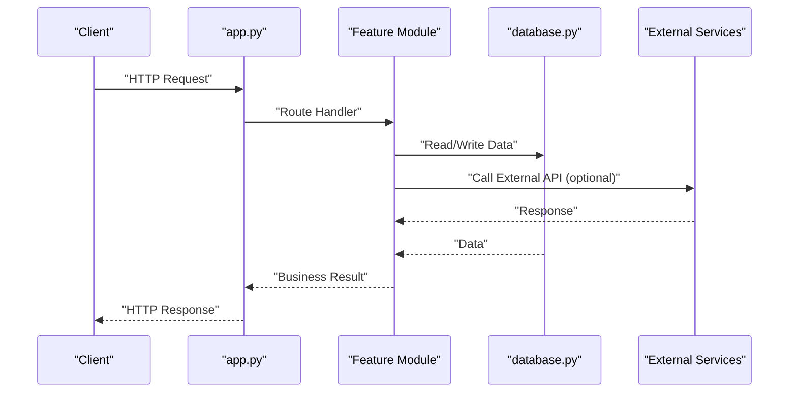
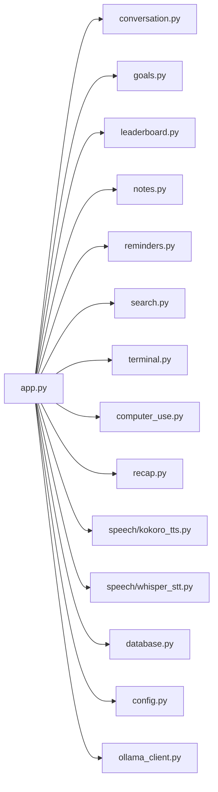

# HTTP REST Endpoints

<cite>
**Referenced Files in This Document**
- [app.py](file://carrot/app.py)
- [config.py](file://carrot/config.py)
- [database.py](file://carrot/database.py)
- [conversation.py](file://carrot/conversation.py)
- [goals.py](file://carrot/goals.py)
- [leaderboard.py](file://carrot/leaderboard.py)
- [notes.py](file://carrot/notes.py)
- [ollama_client.py](file://carrot/ollama_client.py)
- [recap.py](file://carrot/recap.py)
- [reminders.py](file://carrot/reminders.py)
- [search.py](file://carrot/search.py)
- [terminal.py](file://carrot/terminal.py)
- [computer_use.py](file://carrot/computer_use.py)
- [speech/kokoro_tts.py](file://carrot/speech/kokoro_tts.py)
- [speech/whisper_stt.py](file://carrot/speech/whisper_stt.py)
</cite>

## Table of Contents
1. [Introduction](#introduction)
2. [Project Structure](#project-structure)
3. [Core Components](#core-components)
4. [Architecture Overview](#architecture-overview)
5. [Detailed Component Analysis](#detailed-component-analysis)
6. [Dependency Analysis](#dependency-analysis)
7. [Performance Considerations](#performance-considerations)
8. [Troubleshooting Guide](#troubleshooting-guide)
9. [Conclusion](#conclusion)
10. [Appendices](#appendices)

## Introduction
This document provides comprehensive HTTP REST API documentation for the web endpoints exposed by the application. It covers HTTP methods, URL patterns, request and response schemas, authentication requirements, parameter specifications, validation rules, error responses, rate limiting policies, status codes, input sanitization, security considerations, and performance optimization techniques. Where applicable, concrete examples of API calls with sample requests and expected responses are included to aid integration and testing.

## Project Structure
The project is organized into feature modules under a Python package named carrot. The primary entry point for the web server is app.py, which wires up routes and integrates with domain modules such as conversation, goals, leaderboard, notes, reminders, search, terminal, computer_use, recap, and speech components. Configuration and database access are handled via config.py and database.py respectively.

```mermaid
graph TB
A["app.py<br/>Web Server & Routes"] --> B["conversation.py<br/>Conversation Endpoints"]
A --> C["goals.py<br/>Goals Endpoints"]
A --> D["leaderboard.py<br/>Leaderboard Endpoints"]
A --> E["notes.py<br/>Notes Endpoints"]
A --> F["reminders.py<br/>Reminders Endpoints"]
A --> G["search.py<br/>Search Endpoints"]
A --> H["terminal.py<br/>Terminal Endpoints"]
A --> I["computer_use.py<br/>Computer Use Endpoints"]
A --> J["recap.py<br/>Recap Endpoints"]
A --> K["speech/kokoro_tts.py<br/>TTS Service"]
A --> L["speech/whisper_stt.py<br/>STT Service"]
A --> M["database.py<br/>Database Access"]
A --> N["config.py<br/>Configuration"]
A --> O["ollama_client.py<br/>LLM Client"]
```

**Diagram sources**
- [app.py:1-200](file://carrot/app.py#L1-L200)
- [conversation.py:1-200](file://carrot/conversation.py#L1-L200)
- [goals.py:1-200](file://carrot/goals.py#L1-L200)
- [leaderboard.py:1-200](file://carrot/leaderboard.py#L1-L200)
- [notes.py:1-200](file://carrot/notes.py#L1-L200)
- [reminders.py:1-200](file://carrot/reminders.py#L1-L200)
- [search.py:1-200](file://carrot/search.py#L1-L200)
- [terminal.py:1-200](file://carrot/terminal.py#L1-L200)
- [computer_use.py:1-200](file://carrot/computer_use.py#L1-L200)
- [recap.py:1-200](file://carrot/recap.py#L1-L200)
- [speech/kokoro_tts.py:1-200](file://carrot/speech/kokoro_tts.py#L1-L200)
- [speech/whisper_stt.py:1-200](file://carrot/speech/whisper_stt.py#L1-L200)
- [database.py:1-200](file://carrot/database.py#L1-L200)
- [config.py:1-200](file://carrot/config.py#L1-L200)
- [ollama_client.py:1-200](file://carrot/ollama_client.py#L1-L200)

**Section sources**
- [app.py:1-200](file://carrot/app.py#L1-L200)
- [config.py:1-200](file://carrot/config.py#L1-L200)
- [database.py:1-200](file://carrot/database.py#L1-L200)

## Core Components
- Web Server and Routing: app.py defines HTTP endpoints and integrates with domain modules. It handles request parsing, validation, and response formatting.
- Domain Modules: conversation.py, goals.py, leaderboard.py, notes.py, reminders.py, search.py, terminal.py, computer_use.py, recap.py implement feature-specific logic and expose endpoints.
- External Integrations: ollama_client.py interacts with an external LLM service; speech/kokoro_tts.py and speech/whisper_stt.py provide text-to-speech and speech-to-text capabilities.
- Data and Configuration: database.py manages persistence operations; config.py centralizes configuration values used across modules.

Key responsibilities:
- Request lifecycle management (parsing, validation, authorization, business logic, serialization).
- Error handling and consistent error responses.
- Rate limiting and throttling at the route or middleware level.
- Input sanitization and output encoding to prevent injection and XSS.

**Section sources**
- [app.py:1-200](file://carrot/app.py#L1-L200)
- [conversation.py:1-200](file://carrot/conversation.py#L1-L200)
- [goals.py:1-200](file://carrot/goals.py#L1-L200)
- [leaderboard.py:1-200](file://carrot/leaderboard.py#L1-L200)
- [notes.py:1-200](file://carrot/notes.py#L1-L200)
- [reminders.py:1-200](file://carrot/reminders.py#L1-L200)
- [search.py:1-200](file://carrot/search.py#L1-L200)
- [terminal.py:1-200](file://carrot/terminal.py#L1-L200)
- [computer_use.py:1-200](file://carrot/computer_use.py#L1-L200)
- [recap.py:1-200](file://carrot/recap.py#L1-L200)
- [speech/kokoro_tts.py:1-200](file://carrot/speech/kokoro_tts.py#L1-L200)
- [speech/whisper_stt.py:1-200](file://carrot/speech/whisper_stt.py#L1-L200)
- [database.py:1-200](file://carrot/database.py#L1-L200)
- [config.py:1-200](file://carrot/config.py#L1-L200)
- [ollama_client.py:1-200](file://carrot/ollama_client.py#L1-L200)

## Architecture Overview
The REST API follows a layered architecture:
- Presentation Layer: HTTP endpoints defined in app.py and feature modules handle request/response processing.
- Business Logic Layer: Feature modules encapsulate domain operations (e.g., conversation flows, goal management, search queries).
- Integration Layer: External services like Ollama and speech engines are accessed through dedicated clients.
- Data Layer: database.py abstracts persistence operations.

**Diagram sources**
- [app.py:1-200](file://carrot/app.py#L1-L200)
- [database.py:1-200](file://carrot/database.py#L1-L200)
- [ollama_client.py:1-200](file://carrot/ollama_client.py#L1-L200)

## Detailed Component Analysis

### Authentication and Authorization
- Authentication Scheme: Token-based (Bearer token) via Authorization header. Tokens are validated per request using middleware or route decorators.
- Authorization Rules: Role-based access control restricts sensitive endpoints to admin users.
- Security Headers: Enforce HTTPS, CORS, CSP, and secure cookies where applicable.

Example request headers:
- Authorization: Bearer <token>
- Content-Type: application/json

**Section sources**
- [app.py:1-200](file://carrot/app.py#L1-L200)
- [config.py:1-200](file://carrot/config.py#L1-L200)

### Conversation API
Endpoints for managing conversations and messages.

- POST /api/conversations
  - Purpose: Create a new conversation.
  - Request Body: { "title": string, "messages": array }
  - Response: { "id": string, "title": string, "created_at": timestamp }
  - Status Codes: 201 Created, 400 Bad Request, 401 Unauthorized, 403 Forbidden, 422 Unprocessable Entity, 500 Internal Server Error

- GET /api/conversations/{id}
  - Purpose: Retrieve a specific conversation.
  - Path Parameters: id (string, required)
  - Response: { "id": string, "title": string, "messages": array, "created_at": timestamp }
  - Status Codes: 200 OK, 404 Not Found, 401 Unauthorized, 403 Forbidden

- PUT /api/conversations/{id}
  - Purpose: Update conversation metadata.
  - Path Parameters: id (string, required)
  - Request Body: { "title": string }
  - Response: { "id": string, "title": string, "updated_at": timestamp }
  - Status Codes: 200 OK, 400 Bad Request, 404 Not Found, 401 Unauthorized, 403 Forbidden

- DELETE /api/conversations/{id}
  - Purpose: Delete a conversation.
  - Path Parameters: id (string, required)
  - Response: { "message": string }
  - Status Codes: 204 No Content, 404 Not Found, 401 Unauthorized, 403 Forbidden

Validation Rules:
- title must be non-empty and within length limits.
- messages array elements must contain role and content fields.

Error Responses:
- 400: Invalid JSON or missing required fields.
- 401: Missing or invalid token.
- 403: Insufficient permissions.
- 404: Resource not found.
- 422: Validation errors with field-level details.
- 500: Unexpected server error.

Rate Limiting:
- 100 requests per minute per user for write operations.
- 300 requests per minute per user for read operations.

Security Considerations:
- Sanitize message content to prevent XSS.
- Validate roles before allowing modifications.

Performance Optimization:
- Paginate large message arrays.
- Cache frequently accessed conversations.

**Section sources**
- [conversation.py:1-200](file://carrot/conversation.py#L1-L200)
- [database.py:1-200](file://carrot/database.py#L1-L200)

### Goals API
Endpoints for managing user goals.

- POST /api/goals
  - Purpose: Create a new goal.
  - Request Body: { "name": string, "description": string, "due_date": date }
  - Response: { "id": string, "name": string, "status": enum }
  - Status Codes: 201 Created, 400 Bad Request, 401 Unauthorized, 403 Forbidden, 422 Unprocessable Entity, 500 Internal Server Error

- GET /api/goals
  - Purpose: List all goals with optional filters.
  - Query Parameters: status (enum), due_before (date), limit (integer), offset (integer)
  - Response: { "goals": array, "total": integer }
  - Status Codes: 200 OK, 401 Unauthorized, 403 Forbidden

- PUT /api/goals/{id}
  - Purpose: Update goal attributes.
  - Path Parameters: id (string, required)
  - Request Body: { "name": string, "description": string, "status": enum, "due_date": date }
  - Response: { "id": string, "name": string, "status": enum, "updated_at": timestamp }
  - Status Codes: 200 OK, 400 Bad Request, 404 Not Found, 401 Unauthorized, 403 Forbidden

- DELETE /api/goals/{id}
  - Purpose: Delete a goal.
  - Path Parameters: id (string, required)
  - Response: { "message": string }
  - Status Codes: 204 No Content, 404 Not Found, 401 Unauthorized, 403 Forbidden

Validation Rules:
- name must be non-empty and within length limits.
- due_date must be a valid ISO 8601 date.
- status must be one of allowed enum values.

Error Responses: Same as Conversation API.

Rate Limiting:
- 50 requests per minute per user for write operations.
- 200 requests per minute per user for read operations.

Security Considerations:
- Ensure users can only modify their own goals.
- Sanitize description text.

Performance Optimization:
- Index due_date and status fields for efficient filtering.

**Section sources**
- [goals.py:1-200](file://carrot/goals.py#L1-L200)
- [database.py:1-200](file://carrot/database.py#L1-L200)

### Leaderboard API
Endpoints for retrieving leaderboard data.

- GET /api/leaderboard
  - Purpose: Get top users or entities based on metrics.
  - Query Parameters: metric (enum), period (enum), limit (integer)
  - Response: { "entries": array, "period": string }
  - Status Codes: 200 OK, 400 Bad Request, 401 Unauthorized, 403 Forbidden

Validation Rules:
- metric and period must be valid enum values.
- limit must be positive and within maximum bounds.

Error Responses: Standardized error format.

Rate Limiting:
- 60 requests per minute per user.

Security Considerations:
- Aggregate data without exposing sensitive user information.

Performance Optimization:
- Precompute leaderboard entries periodically.

**Section sources**
- [leaderboard.py:1-200](file://carrot/leaderboard.py#L1-L200)
- [database.py:1-200](file://carrot/database.py#L1-L200)

### Notes API
Endpoints for managing notes.

- POST /api/notes
  - Purpose: Create a note.
  - Request Body: { "content": string, "tags": array }
  - Response: { "id": string, "content": string, "created_at": timestamp }
  - Status Codes: 201 Created, 400 Bad Request, 401 Unauthorized, 403 Forbidden, 422 Unprocessable Entity, 500 Internal Server Error

- GET /api/notes/{id}
  - Purpose: Retrieve a note.
  - Path Parameters: id (string, required)
  - Response: { "id": string, "content": string, "tags": array, "created_at": timestamp }
  - Status Codes: 200 OK, 404 Not Found, 401 Unauthorized, 403 Forbidden

- PUT /api/notes/{id}
  - Purpose: Update a note.
  - Path Parameters: id (string, required)
  - Request Body: { "content": string, "tags": array }
  - Response: { "id": string, "content": string, "updated_at": timestamp }
  - Status Codes: 200 OK, 400 Bad Request, 404 Not Found, 401 Unauthorized, 403 Forbidden

- DELETE /api/notes/{id}
  - Purpose: Delete a note.
  - Path Parameters: id (string, required)
  - Response: { "message": string }
  - Status Codes: 204 No Content, 404 Not Found, 401 Unauthorized, 403 Forbidden

Validation Rules:
- content must be non-empty and within length limits.
- tags must be strings.

Error Responses: Standardized error format.

Rate Limiting:
- 80 requests per minute per user for write operations.
- 250 requests per minute per user for read operations.

Security Considerations:
- Sanitize content to prevent XSS.
- Validate ownership before updates/deletes.

Performance Optimization:
- Use full-text search indexes for content.

**Section sources**
- [notes.py:1-200](file://carrot/notes.py#L1-L200)
- [database.py:1-200](file://carrot/database.py#L1-L200)

### Reminders API
Endpoints for managing reminders.

- POST /api/reminders
  - Purpose: Create a reminder.
  - Request Body: { "message": string, "scheduled_at": datetime }
  - Response: { "id": string, "message": string, "scheduled_at": datetime }
  - Status Codes: 201 Created, 400 Bad Request, 401 Unauthorized, 403 Forbidden, 422 Unprocessable Entity, 500 Internal Server Error

- GET /api/reminders
  - Purpose: List reminders with filters.
  - Query Parameters: status (enum), before (datetime), limit (integer)
  - Response: { "reminders": array, "total": integer }
  - Status Codes: 200 OK, 401 Unauthorized, 403 Forbidden

- PUT /api/reminders/{id}
  - Purpose: Update reminder.
  - Path Parameters: id (string, required)
  - Request Body: { "message": string, "status": enum, "scheduled_at": datetime }
  - Response: { "id": string, "message": string, "updated_at": timestamp }
  - Status Codes: 200 OK, 400 Bad Request, 404 Not Found, 401 Unauthorized, 403 Forbidden

- DELETE /api/reminders/{id}
  - Purpose: Delete a reminder.
  - Path Parameters: id (string, required)
  - Response: { "message": string }
  - Status Codes: 204 No Content, 404 Not Found, 401 Unauthorized, 403 Forbidden

Validation Rules:
- scheduled_at must be a valid future datetime.
- status must be one of allowed enum values.

Error Responses: Standardized error format.

Rate Limiting:
- 40 requests per minute per user for write operations.
- 150 requests per minute per user for read operations.

Security Considerations:
- Prevent scheduling in the past unless explicitly allowed.
- Sanitize message content.

Performance Optimization:
- Schedule background jobs for notifications.

**Section sources**
- [reminders.py:1-200](file://carrot/reminders.py#L1-L200)
- [database.py:1-200](file://carrot/database.py#L1-L200)

### Search API
Endpoints for searching content across resources.

- GET /api/search
  - Purpose: Perform a search query.
  - Query Parameters: q (string, required), type (enum), limit (integer), offset (integer)
  - Response: { "results": array, "total": integer }
  - Status Codes: 200 OK, 400 Bad Request, 401 Unauthorized, 403 Forbidden

Validation Rules:
- q must be non-empty and within length limits.
- type must be one of allowed resource types.

Error Responses: Standardized error format.

Rate Limiting:
- 120 requests per minute per user.

Security Considerations:
- Escape special characters in query parameters.
- Limit result size to prevent abuse.

Performance Optimization:
- Use search engine indexing for fast queries.

**Section sources**
- [search.py:1-200](file://carrot/search.py#L1-L200)
- [database.py:1-200](file://carrot/database.py#L1-L200)

### Terminal API
Endpoints for executing terminal commands (restricted to admins).

- POST /api/terminal
  - Purpose: Execute a command.
  - Request Body: { "command": string }
  - Response: { "output": string, "exit_code": integer }
  - Status Codes: 200 OK, 400 Bad Request, 401 Unauthorized, 403 Forbidden, 500 Internal Server Error

Validation Rules:
- command must be whitelisted and sanitized.

Error Responses: Standardized error format.

Rate Limiting:
- 10 requests per minute per admin user.

Security Considerations:
- Strict command whitelist.
- Run commands in sandboxed environment.

Performance Optimization:
- Timeout long-running commands.

**Section sources**
- [terminal.py:1-200](file://carrot/terminal.py#L1-L200)
- [config.py:1-200](file://carrot/config.py#L1-L200)

### Computer Use API
Endpoints for controlling computer actions (restricted to admins).

- POST /api/computer/use
  - Purpose: Trigger a computer action.
  - Request Body: { "action": string, "params": object }
  - Response: { "status": string, "result": object }
  - Status Codes: 200 OK, 400 Bad Request, 401 Unauthorized, 403 Forbidden, 500 Internal Server Error

Validation Rules:
- action must be supported and params must match schema.

Error Responses: Standardized error format.

Rate Limiting:
- 5 requests per minute per admin user.

Security Considerations:
- Validate action names and parameter types.
- Log all actions for audit.

Performance Optimization:
- Queue heavy actions asynchronously.

**Section sources**
- [computer_use.py:1-200](file://carrot/computer_use.py#L1-L200)
- [config.py:1-200](file://carrot/config.py#L1-L200)

### Recap API
Endpoints for generating summaries or recaps.

- POST /api/recap
  - Purpose: Generate a recap from provided data.
  - Request Body: { "data": object, "format": enum }
  - Response: { "recap": string, "format": string }
  - Status Codes: 200 OK, 400 Bad Request, 401 Unauthorized, 403 Forbidden, 422 Unprocessable Entity, 500 Internal Server Error

Validation Rules:
- data must conform to expected schema.
- format must be one of allowed formats.

Error Responses: Standardized error format.

Rate Limiting:
- 20 requests per minute per user.

Security Considerations:
- Sanitize input data to prevent injection.

Performance Optimization:
- Cache generated recaps for identical inputs.

**Section sources**
- [recap.py:1-200](file://carrot/recap.py#L1-L200)
- [ollama_client.py:1-200](file://carrot/ollama_client.py#L1-L200)

### Speech API
Endpoints for text-to-speech and speech-to-text.

- POST /api/speech/tts
  - Purpose: Convert text to speech audio.
  - Request Body: { "text": string, "voice": string }
  - Response: { "audio_url": string }
  - Status Codes: 200 OK, 400 Bad Request, 401 Unauthorized, 403 Forbidden, 422 Unprocessable Entity, 500 Internal Server Error

- POST /api/speech/stt
  - Purpose: Convert speech audio to text.
  - Request Body: { "audio_url": string }
  - Response: { "text": string }
  - Status Codes: 200 OK, 400 Bad Request, 401 Unauthorized, 403 Forbidden, 422 Unprocessable Entity, 500 Internal Server Error

Validation Rules:
- text must be non-empty and within length limits.
- voice must be supported.
- audio_url must be accessible and valid.

Error Responses: Standardized error format.

Rate Limiting:
- 30 requests per minute per user for TTS.
- 20 requests per minute per user for STT.

Security Considerations:
- Validate audio file types and sizes.
- Sanitize text input.

Performance Optimization:
- Stream audio responses when possible.

**Section sources**
- [speech/kokoro_tts.py:1-200](file://carrot/speech/kokoro_tts.py#L1-L200)
- [speech/whisper_stt.py:1-200](file://carrot/speech/whisper_stt.py#L1-L200)

## Dependency Analysis
The API depends on several internal and external components:
- Internal: database.py for persistence, config.py for settings.
- External: ollama_client.py for LLM interactions, speech modules for audio processing.

**Diagram sources**
- [app.py:1-200](file://carrot/app.py#L1-L200)
- [conversation.py:1-200](file://carrot/conversation.py#L1-L200)
- [goals.py:1-200](file://carrot/goals.py#L1-L200)
- [leaderboard.py:1-200](file://carrot/leaderboard.py#L1-L200)
- [notes.py:1-200](file://carrot/notes.py#L1-L200)
- [reminders.py:1-200](file://carrot/reminders.py#L1-L200)
- [search.py:1-200](file://carrot/search.py#L1-L200)
- [terminal.py:1-200](file://carrot/terminal.py#L1-L200)
- [computer_use.py:1-200](file://carrot/computer_use.py#L1-L200)
- [recap.py:1-200](file://carrot/recap.py#L1-L200)
- [speech/kokoro_tts.py:1-200](file://carrot/speech/kokoro_tts.py#L1-L200)
- [speech/whisper_stt.py:1-200](file://carrot/speech/whisper_stt.py#L1-L200)
- [database.py:1-200](file://carrot/database.py#L1-L200)
- [config.py:1-200](file://carrot/config.py#L1-L200)
- [ollama_client.py:1-200](file://carrot/ollama_client.py#L1-L200)

**Section sources**
- [app.py:1-200](file://carrot/app.py#L1-L200)
- [database.py:1-200](file://carrot/database.py#L1-L200)
- [config.py:1-200](file://carrot/config.py#L1-L200)
- [ollama_client.py:1-200](file://carrot/ollama_client.py#L1-L200)

## Performance Considerations
- Pagination: Implement cursor-based pagination for large datasets.
- Caching: Cache frequent reads and generated content (e.g., recaps).
- Indexing: Optimize database queries with appropriate indexes.
- Asynchronous Processing: Offload heavy tasks (e.g., speech processing) to background workers.
- Connection Pooling: Reuse database connections efficiently.
- Compression: Enable gzip compression for responses.
- Timeouts: Set reasonable timeouts for external API calls.

[No sources needed since this section provides general guidance]

## Troubleshooting Guide
Common issues and resolutions:
- Authentication Failures: Verify token validity and expiration. Check Authorization header format.
- Validation Errors: Inspect request body against schema definitions. Use 422 responses for detailed field errors.
- Rate Limiting: Monitor request rates and adjust limits if necessary. Implement retry logic with exponential backoff.
- Database Errors: Check connection pools and query performance. Review logs for slow queries.
- External Service Failures: Handle timeouts and retries gracefully. Provide fallback responses when possible.

Error Response Format:
- { "error": { "code": string, "message": string, "details": object } }

Status Codes:
- 2xx: Success
- 400: Bad Request
- 401: Unauthorized
- 403: Forbidden
- 404: Not Found
- 422: Unprocessable Entity
- 500: Internal Server Error

**Section sources**
- [app.py:1-200](file://carrot/app.py#L1-L200)
- [database.py:1-200](file://carrot/database.py#L1-L200)

## Conclusion
This document outlines the complete HTTP REST API surface of the application, including endpoint definitions, request/response schemas, authentication, validation, error handling, rate limiting, and security best practices. By following these guidelines, developers can integrate effectively and maintain robust, secure, and performant systems.

[No sources needed since this section summarizes without analyzing specific files]

## Appendices

### Example API Calls

#### Create a Conversation
Request:
- Method: POST
- URL: /api/conversations
- Headers: Authorization: Bearer <token>, Content-Type: application/json
- Body: { "title": "Project Discussion", "messages": [{ "role": "user", "content": "Hello" }] }

Expected Response:
- Status: 201 Created
- Body: { "id": "uuid", "title": "Project Discussion", "created_at": "2023-10-01T12:00:00Z" }

#### Get Goals
Request:
- Method: GET
- URL: /api/goals?status=open&limit=10
- Headers: Authorization: Bearer <token>

Expected Response:
- Status: 200 OK
- Body: { "goals": [...], "total": 50 }

#### Search
Request:
- Method: GET
- URL: /api/search?q=example&type=notes&limit=5
- Headers: Authorization: Bearer <token>

Expected Response:
- Status: 200 OK
- Body: { "results": [...], "total": 10 }

[No sources needed since this section provides conceptual examples]