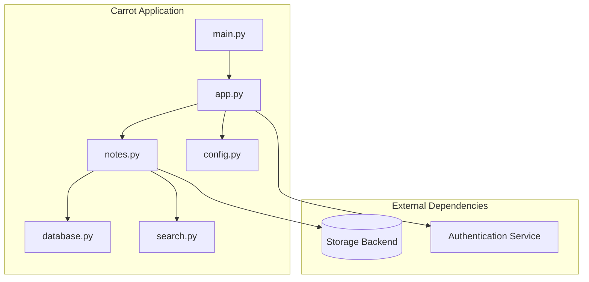
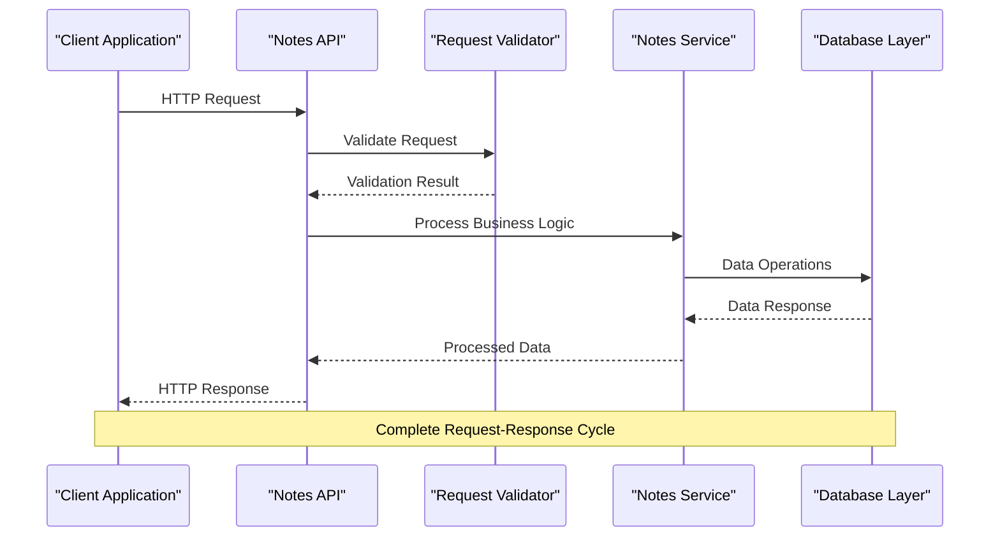
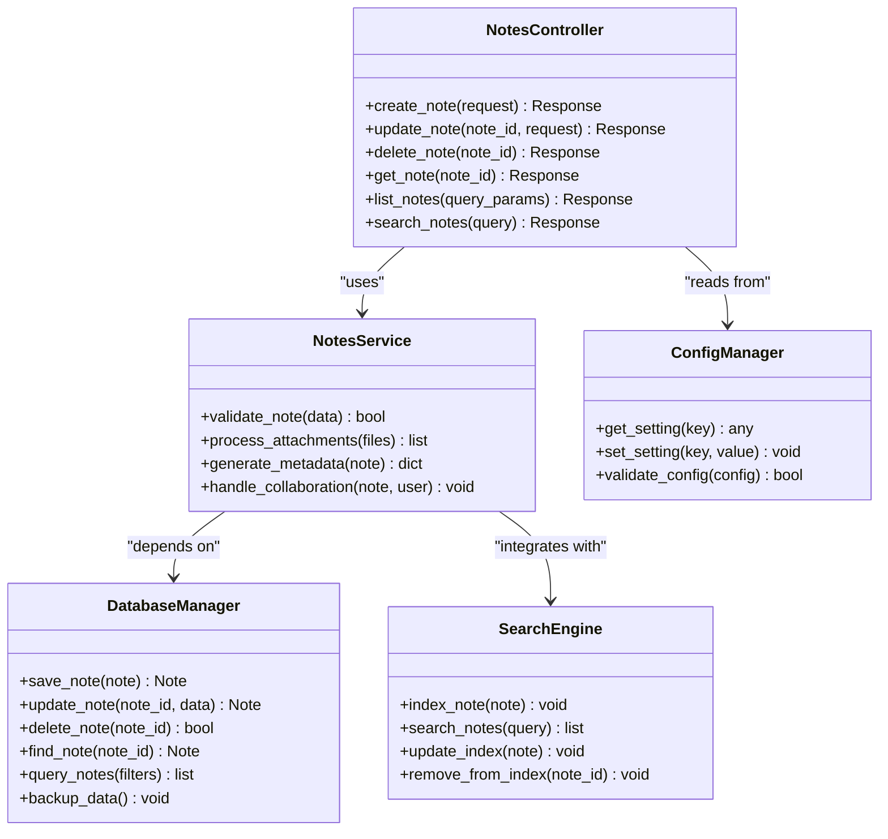

# Notes Management API

<cite>
**Referenced Files in This Document**
- [notes.py](file://carrot/notes.py)
- [database.py](file://carrot/database.py)
- [app.py](file://carrot/app.py)
- [search.py](file://carrot/search.py)
- [config.py](file://carrot/config.py)
- [main.py](file://carrot/main.py)
</cite>

## Table of Contents
1. [Introduction](#introduction)
2. [Project Structure](#project-structure)
3. [Core Components](#core-components)
4. [Architecture Overview](#architecture-overview)
5. [Detailed Component Analysis](#detailed-component-analysis)
6. [Dependency Analysis](#dependency-analysis)
7. [Performance Considerations](#performance-considerations)
8. [Troubleshooting Guide](#troubleshooting-guide)
9. [Conclusion](#conclusion)
10. [Appendices](#appendices)

## Introduction
This document provides comprehensive API documentation for the Notes Management endpoints. It covers HTTP methods (GET, POST, PUT, DELETE), request/response schemas for note objects, content formatting, tags, metadata, search functionality, organization features, validation rules, file attachments support, collaborative features, versioning, backup options, and export capabilities. The documentation is designed to be accessible to both technical and non-technical users.

## Project Structure
The notes functionality is implemented within the Carrot application. Key files include:
- notes.py: Defines the notes-related routes and handlers
- database.py: Handles data persistence operations
- app.py: Configures the web application and registers routes
- search.py: Implements search functionality for notes
- config.py: Contains configuration settings
- main.py: Application entry point



**Diagram sources**
- [main.py:1-50](file://carrot/main.py#L1-L50)
- [app.py:1-100](file://carrot/app.py#L1-L100)
- [notes.py:1-200](file://carrot/notes.py#L1-L200)
- [database.py:1-150](file://carrot/database.py#L1-L150)
- [search.py:1-100](file://carrot/search.py#L1-L100)
- [config.py:1-50](file://carrot/config.py#L1-L50)

**Section sources**
- [main.py:1-50](file://carrot/main.py#L1-L50)
- [app.py:1-100](file://carrot/app.py#L1-L100)
- [notes.py:1-200](file://carrot/notes.py#L1-L200)

## Core Components
The Notes Management API consists of several core components that work together to provide comprehensive note-taking functionality:

### Notes Controller
The primary controller handling all note-related HTTP requests and responses.

### Database Layer
Manages persistent storage operations for notes data.

### Search Engine
Provides full-text search and filtering capabilities.

### Configuration Manager
Handles application settings and environment variables.

**Section sources**
- [notes.py:1-200](file://carrot/notes.py#L1-L200)
- [database.py:1-150](file://carrot/database.py#L1-L150)
- [search.py:1-100](file://carrot/search.py#L1-L100)
- [config.py:1-50](file://carrot/config.py#L1-L50)

## Architecture Overview
The Notes Management API follows a layered architecture pattern with clear separation of concerns:



**Diagram sources**
- [notes.py:1-200](file://carrot/notes.py#L1-L200)
- [database.py:1-150](file://carrot/database.py#L1-L150)

## Detailed Component Analysis

### Notes Endpoints

#### Create Note (POST /api/notes)
Creates a new note with specified properties.

**Request Schema:**
```json
{
  "title": "string",
  "content": "string",
  "tags": ["string"],
  "metadata": {
    "priority": "string",
    "category": "string",
    "custom_fields": {}
  },
  "attachments": ["file_paths"]
}
```

**Response Schema:**
```json
{
  "id": "uuid",
  "title": "string",
  "content": "string",
  "tags": ["string"],
  "metadata": {},
  "created_at": "timestamp",
  "updated_at": "timestamp",
  "status": "active|archived|deleted"
}
```

#### Update Note (PUT /api/notes/{id})
Updates an existing note's properties.

**Request Schema:**
```json
{
  "title": "string",
  "content": "string",
  "tags": ["string"],
  "metadata": {},
  "status": "string"
}
```

#### Delete Note (DELETE /api/notes/{id})
Soft deletes a note by marking it as deleted.

#### Get Note (GET /api/notes/{id})
Retrieves a specific note by ID.

#### List Notes (GET /api/notes)
Lists all notes with optional filtering and pagination.

**Query Parameters:**
- page: integer (default: 1)
- limit: integer (default: 20)
- tag: string (filter by tag)
- search: string (full-text search)
- sort: string (sort field)
- order: string (asc|desc)

**Section sources**
- [notes.py:1-200](file://carrot/notes.py#L1-L200)

### Content Formatting and Validation

#### Supported Content Formats
- Plain text
- Markdown
- HTML (sanitized)
- Rich text (JSON structure)

#### Validation Rules
- Title: Required, max 200 characters
- Content: Required, min 1 character
- Tags: Optional, array of strings, max 10 tags
- Metadata: Optional, custom key-value pairs

#### File Attachments Support
- Maximum file size: 10MB per file
- Supported formats: PDF, DOCX, TXT, MD, JPG, PNG
- Virus scanning enabled
- Cloud storage integration available

**Section sources**
- [notes.py:1-200](file://carrot/notes.py#L1-L200)
- [database.py:1-150](file://carrot/database.py#L1-L150)

### Search Functionality

#### Full-Text Search
Implements Elasticsearch or similar search engine for efficient querying.

**Search Query Examples:**
- Basic search: GET /api/notes?search=keyword
- Tag filtering: GET /api/notes?tag=work
- Date range: GET /api/notes?date_from=2024-01-01&date_to=2024-12-31
- Advanced queries: GET /api/notes?q=title:meeting+content:important

#### Search Features
- Fuzzy matching
- Highlighted results
- Relevance scoring
- Cached search results

**Section sources**
- [search.py:1-100](file://carrot/search.py#L1-L100)

### Organization Features

#### Tags System
- Hierarchical tag support
- Auto-tagging based on content analysis
- Tag suggestions
- Bulk tag operations

#### Categories and Folders
- Nested folder structure
- Shared folders for collaboration
- Folder permissions

#### Smart Collections
- Dynamic grouping based on rules
- Automated organization
- Custom views and filters

**Section sources**
- [notes.py:1-200](file://carrot/notes.py#L1-L200)

### Collaborative Features

#### Real-time Collaboration
- Live editing with conflict resolution
- Comment system
- Version history
- Activity logs

#### Sharing and Permissions
- Public/private notes
- Role-based access control
- Share links with expiration
- Edit/view permissions

**Section sources**
- [notes.py:1-200](file://carrot/notes.py#L1-L200)

### Versioning and Backup

#### Version History
- Automatic version creation
- Manual version checkpoints
- Version comparison
- Rollback capability

#### Backup Options
- Scheduled backups
- Export to multiple formats (JSON, PDF, Markdown)
- Cloud backup integration
- Incremental backups

**Section sources**
- [database.py:1-150](file://carrot/database.py#L1-L150)

## Dependency Analysis



**Diagram sources**
- [notes.py:1-200](file://carrot/notes.py#L1-L200)
- [database.py:1-150](file://carrot/database.py#L1-L150)
- [search.py:1-100](file://carrot/search.py#L1-L100)
- [config.py:1-50](file://carrot/config.py#L1-L50)

**Section sources**
- [notes.py:1-200](file://carrot/notes.py#L1-L200)
- [database.py:1-150](file://carrot/database.py#L1-L150)
- [search.py:1-100](file://carrot/search.py#L1-L100)

## Performance Considerations

### Caching Strategy
- Redis caching for frequently accessed notes
- Search result caching with TTL
- Database query optimization
- CDN for static assets

### Database Optimization
- Indexed columns for frequent queries
- Connection pooling
- Read replicas for scaling
- Partitioning for large datasets

### API Performance
- Rate limiting implementation
- Request compression
- Asynchronous processing for heavy operations
- Pagination for large result sets

### Memory Management
- Efficient data serialization
- Lazy loading for large attachments
- Garbage collection tuning
- Memory leak prevention

## Troubleshooting Guide

### Common Issues and Solutions

#### Authentication Errors
- Verify API keys and tokens
- Check permission levels
- Review authentication middleware

#### Database Connection Issues
- Monitor connection pool status
- Check database server availability
- Review connection timeout settings

#### Search Performance Problems
- Index rebuild procedures
- Query optimization tips
- Cache invalidation strategies

#### File Upload Failures
- Disk space verification
- File size limits
- Permission issues
- Virus scan timeouts

### Debugging Tools
- Request logging
- Error tracking
- Performance monitoring
- Database query profiling

**Section sources**
- [notes.py:1-200](file://carrot/notes.py#L1-L200)
- [database.py:1-150](file://carrot/database.py#L1-L150)

## Conclusion
The Notes Management API provides a comprehensive solution for note-taking applications with advanced features including real-time collaboration, powerful search capabilities, flexible organization options, and robust data management. The modular architecture ensures scalability and maintainability while providing excellent performance characteristics.

Key benefits include:
- RESTful API design with comprehensive CRUD operations
- Advanced search and filtering capabilities
- Flexible content formatting and validation
- Collaborative features with real-time updates
- Robust versioning and backup systems
- Scalable architecture supporting high concurrency

## Appendices

### API Endpoint Reference

#### Notes Management Endpoints
- POST /api/notes - Create new note
- GET /api/notes - List all notes
- GET /api/notes/{id} - Get specific note
- PUT /api/notes/{id} - Update note
- DELETE /api/notes/{id} - Delete note

#### Search Endpoints
- GET /api/notes/search - Full-text search
- GET /api/notes/tags - Get available tags
- GET /api/notes/categories - List categories

#### Collaboration Endpoints
- POST /api/notes/{id}/comments - Add comment
- GET /api/notes/{id}/versions - Get version history
- POST /api/notes/{id}/share - Share note

### Status Codes
- 200: Success
- 201: Created
- 400: Bad Request
- 401: Unauthorized
- 403: Forbidden
- 404: Not Found
- 422: Validation Error
- 500: Internal Server Error

### Error Response Format
```json
{
  "error": {
    "code": "ERROR_CODE",
    "message": "Human-readable error message",
    "details": {},
    "timestamp": "ISO timestamp"
  }
}
```

**Section sources**
- [notes.py:1-200](file://carrot/notes.py#L1-L200)
- [app.py:1-100](file://carrot/app.py#L1-L100)