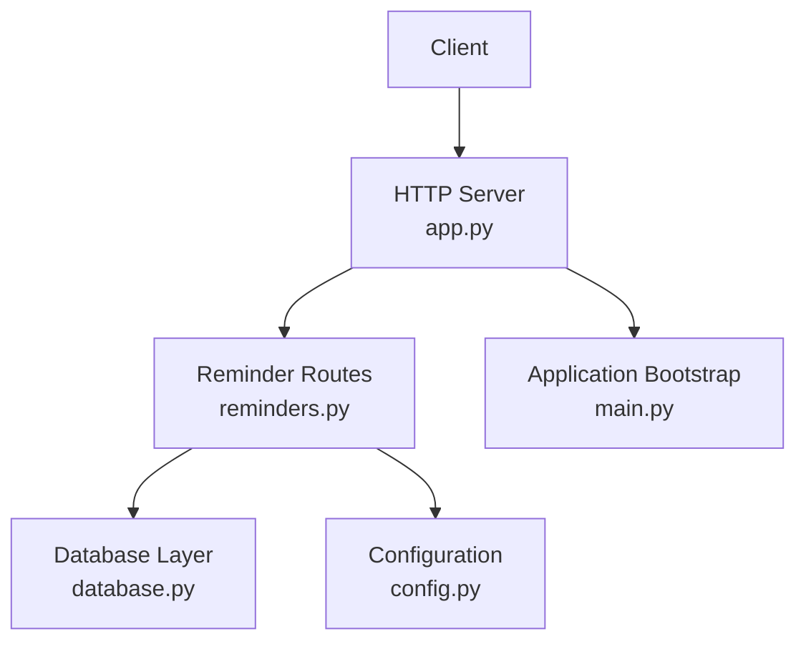
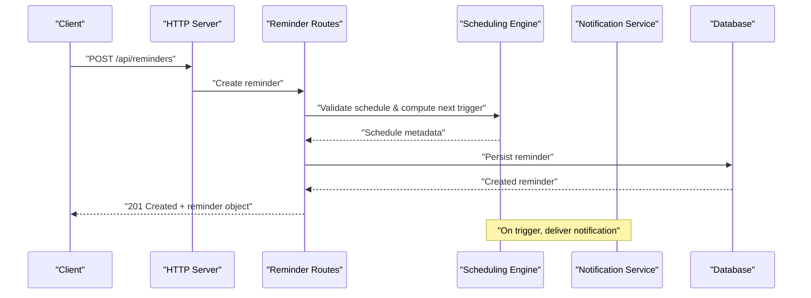
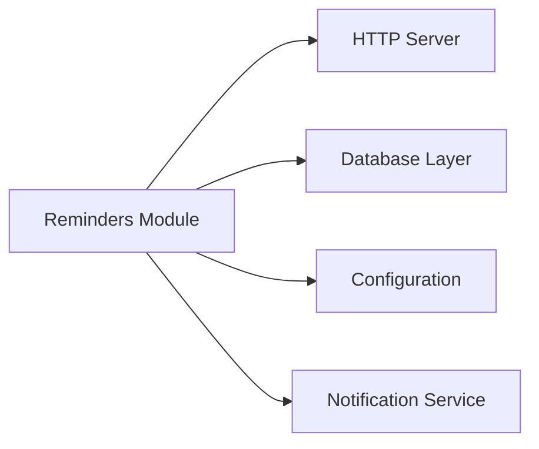

# Reminders API

<cite>
**Referenced Files in This Document**
- [reminders.py](file://carrot/reminders.py)
- [app.py](file://carrot/app.py)
- [database.py](file://carrot/database.py)
- [config.py](file://carrot/config.py)
- [main.py](file://carrot/main.py)
</cite>

## Table of Contents
1. [Introduction](#introduction)
2. [Project Structure](#project-structure)
3. [Core Components](#core-components)
4. [Architecture Overview](#architecture-overview)
5. [Detailed Component Analysis](#detailed-component-analysis)
6. [Dependency Analysis](#dependency-analysis)
7. [Performance Considerations](#performance-considerations)
8. [Troubleshooting Guide](#troubleshooting-guide)
9. [Conclusion](#conclusion)
10. [Appendices](#appendices)

## Introduction
This document provides comprehensive API documentation for reminder management endpoints. It covers HTTP methods (GET, POST, PUT, DELETE), request/response schemas for reminders, scheduling parameters, notification settings, and status handling. It also explains time zone handling, scheduling logic, delivery mechanisms, cancellation/rescheduling workflows, and bulk operations. The goal is to enable developers to integrate with the reminders subsystem effectively and reliably.

## Project Structure
The reminders feature is implemented primarily within the Python application module that exposes HTTP endpoints and interacts with a database layer. Key files include:
- Application entry point and server setup
- Reminder routes and handlers
- Database schema and persistence helpers
- Configuration for scheduling and notifications
- Main orchestration file

**Diagram sources**
- [app.py](file://carrot/app.py)
- [reminders.py](file://carrot/reminders.py)
- [database.py](file://carrot/database.py)
- [config.py](file://carrot/config.py)
- [main.py](file://carrot/main.py)

**Section sources**
- [app.py](file://carrot/app.py)
- [reminders.py](file://carrot/reminders.py)
- [database.py](file://carrot/database.py)
- [config.py](file://carrot/config.py)
- [main.py](file://carrot/main.py)

## Core Components
- Reminder Model: Represents a reminder entity with fields such as title, description, scheduled time, recurrence rules, priority, notification preferences, and status.
- Scheduling Engine: Handles one-time and recurring schedules, time zone conversions, and next-trigger calculations.
- Notification Service: Delivers reminders via configured channels (e.g., in-app, email, push).
- Persistence Layer: Stores reminders and their state in the database.
- API Endpoints: Expose CRUD operations and bulk actions for reminders.

Key responsibilities:
- Validate input payloads and enforce constraints.
- Compute next trigger times based on recurrence patterns.
- Persist changes and emit events for delivery.
- Provide consistent error responses and status codes.

**Section sources**
- [reminders.py](file://carrot/reminders.py)
- [database.py](file://carrot/database.py)
- [config.py](file://carrot/config.py)

## Architecture Overview
The reminders API follows a layered architecture:
- HTTP Layer: Receives requests, validates inputs, and returns JSON responses.
- Business Logic Layer: Orchestrates scheduling, validation, and business rules.
- Data Layer: Persists and retrieves reminder data.
- External Integrations: Notification delivery and optional external services.

**Diagram sources**
- [app.py](file://carrot/app.py)
- [reminders.py](file://carrot/reminders.py)
- [database.py](file://carrot/database.py)
- [config.py](file://carrot/config.py)

## Detailed Component Analysis

### Reminder Object Schema
Fields typically included in reminder objects:
- id: Unique identifier
- title: Short descriptive text
- description: Optional details
- scheduled_at: ISO 8601 timestamp with time zone
- recurrence: Recurrence rule (e.g., daily, weekly, monthly, custom cron-like)
- priority: Numeric or enumerated level (e.g., low, normal, high, urgent)
- notification_settings: Channel preferences (e.g., in_app, email, push), quiet hours, snooze behavior
- status: Current state (e.g., pending, triggered, completed, cancelled)
- created_at, updated_at: Timestamps

Notes:
- Time zones must be specified explicitly; default to UTC if not provided.
- Priority levels should map to numeric values for sorting and filtering.
- Notification settings may include channel-specific options like frequency and suppression rules.

**Section sources**
- [reminders.py](file://carrot/reminders.py)
- [database.py](file://carrot/database.py)

### Scheduling Parameters
Supported scheduling modes:
- One-time: A single scheduled_at timestamp.
- Recurring: Rules defining frequency and end conditions.
- Cron-like expressions: Advanced patterns for complex intervals.

Validation rules:
- scheduled_at must be in the future for new reminders.
- Recurrence must produce finite sets unless explicitly allowed.
- Time zone offsets must be valid and normalized.

Next trigger calculation:
- Compute subsequent occurrences based on recurrence rules.
- Handle edge cases like month-end days and leap years.
- Respect user-defined quiet hours and do-not-disturb windows.

**Section sources**
- [reminders.py](file://carrot/reminders.py)
- [config.py](file://carrot/config.py)

### Notification Settings
Channels:
- In-app notifications
- Email
- Push notifications

Preferences:
- Enable/disable per channel
- Quiet hours and global DND overrides
- Snooze duration and retry policies
- Rate limiting and throttling

Delivery mechanism:
- Triggered by scheduler upon due time.
- Queued for asynchronous processing.
- Retry on transient failures with exponential backoff.

**Section sources**
- [reminders.py](file://carrot/reminders.py)
- [config.py](file://carrot/config.py)

### Reminder Status Lifecycle
States:
- Pending: Scheduled but not yet triggered.
- Triggered: Due time reached; notification dispatched.
- Completed: Acknowledged or action taken by user.
- Cancelled: Explicitly cancelled before completion.

Transitions:
- Pending → Triggered at scheduled time.
- Triggered → Completed upon acknowledgment.
- Any → Cancelled via explicit cancel operation.

**Section sources**
- [reminders.py](file://carrot/reminders.py)

### API Endpoints

#### Create Reminder
- Method: POST
- Path: /api/reminders
- Request body: Reminder object with required fields (title, scheduled_at or recurrence, priority, notification_settings).
- Response: 201 Created with created reminder object.
- Errors: 400 Bad Request for invalid payloads, 409 Conflict for duplicate constraints.

Example scenarios:
- One-time reminder: Set scheduled_at to a future timestamp.
- Recurring reminder: Define recurrence rule with start and optional end.

**Section sources**
- [reminders.py](file://carrot/reminders.py)

#### Get Reminder
- Method: GET
- Path: /api/reminders/{id}
- Response: 200 OK with reminder object.
- Errors: 404 Not Found if reminder does not exist.

**Section sources**
- [reminders.py](file://carrot/reminders.py)

#### List Reminders
- Method: GET
- Path: /api/reminders
- Query parameters:
  - status: Filter by status (pending, triggered, completed, cancelled)
  - priority: Filter by priority level
  - scheduled_after, scheduled_before: Date range filters
  - page, limit: Pagination
- Response: 200 OK with paginated list of reminders.

**Section sources**
- [reminders.py](file://carrot/reminders.py)

#### Update Reminder
- Method: PUT
- Path: /api/reminders/{id}
- Request body: Fields to update (title, description, scheduled_at, recurrence, priority, notification_settings).
- Response: 200 OK with updated reminder object.
- Errors: 400 Bad Request for invalid updates, 404 Not Found.

Rescheduling:
- Changing scheduled_at recalculates next triggers.
- Modifying recurrence updates future occurrences.

**Section sources**
- [reminders.py](file://carrot/reminders.py)

#### Delete Reminder
- Method: DELETE
- Path: /api/reminders/{id}
- Response: 204 No Content on success.
- Errors: 404 Not Found.

Cancellation:
- Equivalent to delete for active reminders.
- Prevents further triggers and notifications.

**Section sources**
- [reminders.py](file://carrot/reminders.py)

#### Bulk Operations
- Method: POST
- Path: /api/reminders/bulk
- Request body: Array of reminder objects or operations (create, update, cancel).
- Response: 200 OK with results array indicating success/failure per item.
- Errors: Partial failures return individual statuses per item.

Use cases:
- Import multiple reminders from external sources.
- Batch-update priorities or notification settings.
- Bulk-cancel upcoming reminders.

**Section sources**
- [reminders.py](file://carrot/reminders.py)

### Time Zone Handling
Rules:
- All timestamps are stored in UTC.
- Input timestamps may include offset or timezone name; normalized to UTC.
- Responses include original timezone context when applicable.

Best practices:
- Always specify time zone in client requests.
- Use ISO 8601 format for consistency.
- Avoid ambiguous times during DST transitions.

**Section sources**
- [reminders.py](file://carrot/reminders.py)
- [config.py](file://carrot/config.py)

### Scheduling Logic
Flow:
- Validate scheduled_at or recurrence.
- Compute next trigger time(s).
- Enforce constraints (quiet hours, rate limits).
- Persist and enqueue for delivery.

Edge cases:
- Month-end adjustments.
- Leap year handling.
- Overlapping recurrences.

**Section sources**
- [reminders.py](file://carrot/reminders.py)

### Delivery Mechanisms
Process:
- Scheduler triggers due reminders.
- Notifications queued asynchronously.
- Channels dispatch based on preferences.
- Retries with backoff on failures.

Monitoring:
- Track delivery status per reminder.
- Log failures and retries.

**Section sources**
- [reminders.py](file://carrot/reminders.py)
- [config.py](file://carrot/config.py)

## Dependency Analysis
The reminders module depends on:
- HTTP server for routing and request handling.
- Database layer for persistence.
- Configuration for defaults and feature flags.
- External notification services.

**Diagram sources**
- [reminders.py](file://carrot/reminders.py)
- [app.py](file://carrot/app.py)
- [database.py](file://carrot/database.py)
- [config.py](file://carrot/config.py)

**Section sources**
- [reminders.py](file://carrot/reminders.py)
- [app.py](file://carrot/app.py)
- [database.py](file://carrot/database.py)
- [config.py](file://carrot/config.py)

## Performance Considerations
- Use pagination for list endpoints to avoid large payloads.
- Index frequently queried fields (status, priority, scheduled_at).
- Defer heavy computations (recurrence expansion) to background jobs.
- Cache computed next triggers where appropriate.
- Implement rate limiting for bulk operations.

[No sources needed since this section provides general guidance]

## Troubleshooting Guide
Common issues:
- Invalid time zone formats: Ensure ISO 8601 compliance.
- Duplicate reminders: Check unique constraints and deduplication logic.
- Failed deliveries: Inspect logs for channel-specific errors and retry policies.
- Stale triggers: Verify scheduler health and queue processing.

Debugging steps:
- Validate request payloads against schema.
- Check database records for consistency.
- Review configuration for notification channels.
- Monitor scheduler and worker processes.

**Section sources**
- [reminders.py](file://carrot/reminders.py)
- [database.py](file://carrot/database.py)
- [config.py](file://carrot/config.py)

## Conclusion
The reminders API provides robust capabilities for creating, scheduling, updating, and managing reminders with flexible recurrence, prioritization, and notification settings. Proper time zone handling, reliable scheduling logic, and resilient delivery mechanisms ensure accurate and timely reminders. Follow the documented schemas and best practices for seamless integration.

[No sources needed since this section summarizes without analyzing specific files]

## Appendices

### Example Scenarios

#### One-time Reminder
- Request: POST /api/reminders with scheduled_at set to a future timestamp.
- Response: 201 Created with reminder object including next trigger.

#### Recurring Reminder
- Request: POST /api/reminders with recurrence rule (e.g., daily at 9 AM).
- Response: 201 Created with calculated next occurrences.

#### Priority Levels
- Low, Normal, High, Urgent mapped to numeric values for sorting.

#### Notification Preferences
- Enable in-app, email, or push; configure quiet hours and snooze.

**Section sources**
- [reminders.py](file://carrot/reminders.py)
- [config.py](file://carrot/config.py)