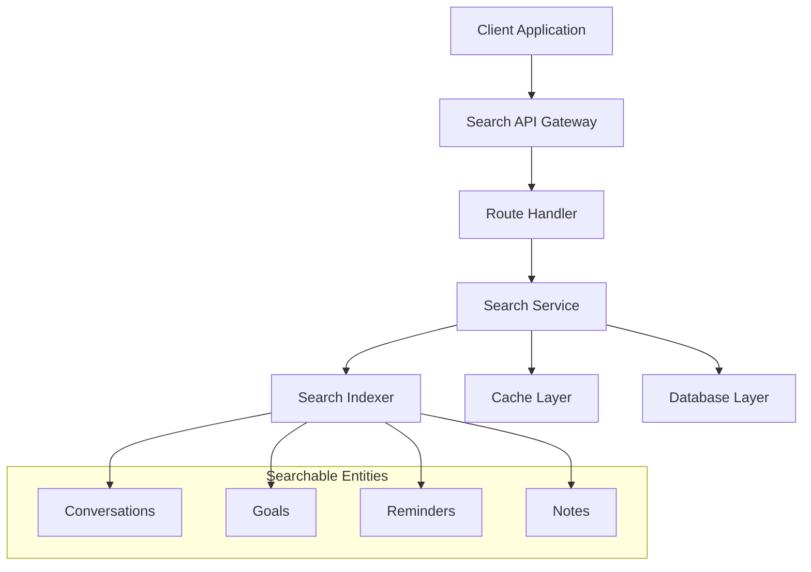
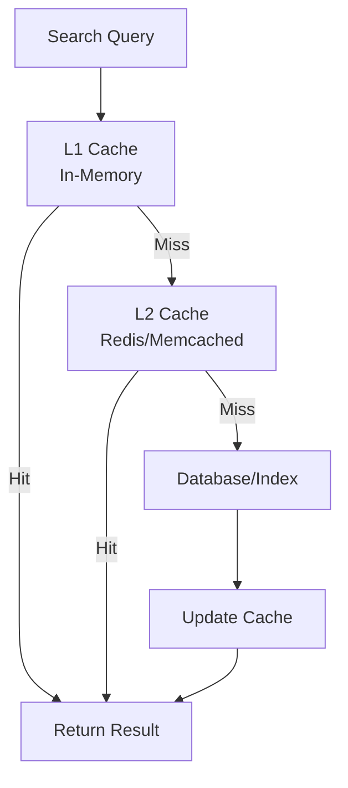

# Search API

<cite>
**Referenced Files in This Document**
- [search.py](file://carrot/search.py)
- [app.py](file://carrot/app.py)
- [search.js](file://carrot/web/js/search.js)
- [conversation.py](file://carrot/conversation.py)
- [goals.py](file://carrot/goals.py)
- [reminders.py](file://carrot/reminders.py)
- [notes.py](file://carrot/notes.py)
- [database.py](file://carrot/database.py)
</cite>

## Table of Contents
1. [Introduction](#introduction)
2. [API Overview](#api-overview)
3. [Authentication](#authentication)
4. [Search Endpoints](#search-endpoints)
5. [Request Schemas](#request-schemas)
6. [Response Schemas](#response-schemas)
7. [Search Syntax & Operators](#search-syntax--operators)
8. [Advanced Filtering](#advanced-filtering)
9. [Result Ranking & Highlighting](#result-ranking--highlighting)
10. [Pagination](#pagination)
11. [Performance Optimization](#performance-optimization)
12. [Caching Strategies](#caching-strategies)
13. [Error Handling](#error-handling)
14. [Examples](#examples)
15. [Troubleshooting](#troubleshooting)

## Introduction

The Search API provides comprehensive full-text search capabilities across multiple data types including conversations, goals, reminders, and notes. This API is designed to support complex search queries with advanced filtering, result ranking, and highlighting features. The search functionality leverages efficient indexing strategies and caching mechanisms to deliver fast response times even with large datasets.

## API Overview

The Search API exposes RESTful endpoints for searching across different entity types. All endpoints follow consistent patterns for request/response formats and error handling.



**Diagram sources**
- [app.py:1-100](file://carrot/app.py#L1-L100)
- [search.py:1-150](file://carrot/search.py#L1-L150)

## Authentication

All search API endpoints require authentication using JWT tokens. Include the token in the Authorization header:

```
Authorization: Bearer <your_jwt_token>
```

## Search Endpoints

### Global Search Endpoint

Search across all searchable entities simultaneously.

**Endpoint**: `GET /api/search`

**Query Parameters**:
- `q` (required): Search query string
- `types` (optional): Comma-separated list of entity types to search
- `filters` (optional): JSON-encoded filter object
- `page` (optional): Page number (default: 1)
- `per_page` (optional): Results per page (default: 20, max: 100)
- `sort_by` (optional): Field to sort by (default: relevance)
- `sort_order` (optional): Sort order (asc/desc, default: desc)

### Entity-Specific Search Endpoints

#### Conversations Search
**Endpoint**: `GET /api/search/conversations`

#### Goals Search  
**Endpoint**: `GET /api/search/goals`

#### Reminders Search
**Endpoint**: `GET /api/search/reminders`

#### Notes Search
**Endpoint**: `GET /api/search/notes`

## Request Schemas

### Global Search Request

```json
{
  "query": {
    "q": "project deadline",
    "types": ["conversations", "goals"],
    "filters": {
      "date_range": {
        "start": "2024-01-01",
        "end": "2024-12-31"
      },
      "status": ["active", "completed"],
      "author_id": "user123"
    },
    "pagination": {
      "page": 1,
      "per_page": 20,
      "sort_by": "relevance",
      "sort_order": "desc"
    }
  }
}
```

### Filter Schema

```json
{
  "date_range": {
    "start": "YYYY-MM-DD",
    "end": "YYYY-MM-DD"
  },
  "status": ["active", "inactive", "completed"],
  "author_id": "string",
  "tags": ["tag1", "tag2"],
  "priority": ["high", "medium", "low"],
  "custom_fields": {
    "field_name": "value"
  }
}
```

## Response Schemas

### Success Response

```json
{
  "success": true,
  "data": {
    "results": [
      {
        "id": "entity_id",
        "type": "conversation|goal|reminder|note",
        "title": "Entity Title",
        "content_preview": "Relevant content snippet...",
        "score": 0.95,
        "highlights": {
          "title": ["project", "deadline"],
          "content": ["project", "deadline"]
        },
        "metadata": {
          "created_at": "2024-01-15T10:30:00Z",
          "updated_at": "2024-01-15T10:30:00Z",
          "author": "user123",
          "tags": ["work", "urgent"]
        }
      }
    ],
    "pagination": {
      "current_page": 1,
      "per_page": 20,
      "total_results": 150,
      "total_pages": 8,
      "has_next": true,
      "has_prev": false
    },
    "search_info": {
      "query_time_ms": 45,
      "indexed_entities": 1000000,
      "cache_hit": false
    }
  }
}
```

### Error Response

```json
{
  "success": false,
  "error": {
    "code": "INVALID_QUERY",
    "message": "Search query must be at least 2 characters long",
    "details": {
      "min_length": 2,
      "provided_length": 1
    }
  }
}
```

## Search Syntax & Operators

### Basic Operators

- **AND**: `coffee AND tea` - Returns results containing both terms
- **OR**: `coffee OR tea` - Returns results containing either term  
- **NOT**: `coffee NOT espresso` - Returns coffee results excluding espresso
- **Phrase Search**: `"iced coffee"` - Exact phrase matching
- **Field Search**: `title:meeting notes:` - Search within specific fields

### Advanced Operators

- **Wildcard**: `pro*` - Matches any word starting with "pro"
- **Fuzzy Match**: `coffe~` - Finds similar words like "coffee"
- **Range Query**: `date:[2024-01-01 TO 2024-12-31]` - Date range search
- **Numeric Range**: `price:[100 TO 500]` - Numeric range search
- **Proximity**: `coffee NEAR tea` - Words within proximity

### Boolean Logic

```
(urgent OR important) AND (project OR task) NOT completed
```

## Advanced Filtering

### Date Range Filtering

```json
{
  "filters": {
    "date_range": {
      "start": "2024-01-01T00:00:00Z",
      "end": "2024-12-31T23:59:59Z"
    }
  }
}
```

### Status Filtering

```json
{
  "filters": {
    "status": ["active", "pending"],
    "priority": ["high", "critical"]
  }
}
```

### Author/Owner Filtering

```json
{
  "filters": {
    "author_id": "user_123",
    "shared_with": ["user_456", "user_789"]
  }
}
```

### Tag-Based Filtering

```json
{
  "filters": {
    "tags": ["work", "urgent", "project-alpha"]
  }
}
```

## Result Ranking & Highlighting

### Ranking Factors

Results are ranked based on multiple factors:

1. **Text Relevance Score** (0.0-1.0)
   - Term frequency in title vs content
   - Exact phrase matches
   - Field-specific weighting
   - Recency boost

2. **User Context Boost**
   - Recently accessed items
   - User favorites
   - Collaborative importance

3. **Quality Signals**
   - Content completeness
   - Update frequency
   - Engagement metrics

### Highlighting Configuration

```json
{
  "highlights": {
    "enabled": true,
    "max_snippet_length": 200,
    "match_count": 3,
    "prefix": "<mark>",
    "suffix": "</mark>"
  }
}
```

## Pagination

### Supported Pagination Methods

- **Offset-based**: Traditional page/per_page approach
- **Cursor-based**: For infinite scrolling scenarios
- **Keyset pagination**: For large datasets

### Pagination Parameters

```json
{
  "pagination": {
    "page": 1,
    "per_page": 20,
    "cursor": "eyJpZCI6MTAwfQ==",
    "limit": 50
  }
}
```

### Cursor-based Pagination Response

```json
{
  "data": {
    "results": [...],
    "pagination": {
      "next_cursor": "eyJpZCI6MTAxfQ==",
      "prev_cursor": "eyJpZCI6OTl9",
      "has_more": true
    }
  }
}
```

## Performance Optimization

### Indexing Strategy

The search system uses a multi-layered indexing approach:

1. **Primary Index**: Full-text index for main content
2. **Secondary Indexes**: Optimized indexes for common filters
3. **Aggregation Index**: Pre-computed counts for faceted search
4. **Cache Index**: Frequently accessed results cached

### Query Optimization

- **Query Parsing**: Efficient parsing of complex boolean expressions
- **Index Pruning**: Early elimination of non-matching indexes
- **Parallel Execution**: Concurrent processing of independent clauses
- **Result Caching**: L1/L2 cache for repeated queries

### Memory Management

- **Streaming Results**: Large result sets processed in chunks
- **Lazy Loading**: Metadata loaded on-demand
- **Connection Pooling**: Efficient database connections
- **Memory Limits**: Configurable memory usage thresholds

## Caching Strategies

### Multi-Level Caching



**Diagram sources**
- [search.py:150-300](file://carrot/search.py#L150-L300)
- [database.py:1-200](file://carrot/database.py#L1-200)

### Cache Configuration

```json
{
  "cache": {
    "enabled": true,
    "ttl_seconds": 300,
    "max_size_mb": 1024,
    "strategies": {
      "query_cache": {
        "ttl": 60,
        "size_limit": 1000
      },
      "result_cache": {
        "ttl": 300,
        "size_limit": 500
      },
      "index_cache": {
        "ttl": 3600,
        "size_limit": 100
      }
    }
  }
}
```

## Error Handling

### Error Codes

| Code | Description | HTTP Status |
|------|-------------|-------------|
| INVALID_QUERY | Malformed search query | 400 |
| QUERY_TOO_LONG | Query exceeds maximum length | 400 |
| INVALID_FILTER | Unsupported or malformed filter | 400 |
| AUTHENTICATION_FAILED | Invalid or expired token | 401 |
| PERMISSION_DENIED | Insufficient permissions | 403 |
| SEARCH_TIMEOUT | Search operation timed out | 408 |
| INDEX_UNAVAILABLE | Search index not accessible | 503 |
| INTERNAL_ERROR | Unexpected server error | 500 |

### Error Response Format

```json
{
  "success": false,
  "error": {
    "code": "INVALID_QUERY",
    "message": "Search query contains invalid syntax",
    "details": {
      "position": 15,
      "expected": "operator",
      "found": "unknown_token"
    },
    "suggestions": ["Use 'AND' instead of '&'", "Check spelling of operators"]
  }
}
```

## Examples

### Basic Search

```bash
curl -X GET "https://api.example.com/api/search?q=project+deadline" \
  -H "Authorization: Bearer YOUR_TOKEN"
```

### Advanced Boolean Search

```bash
curl -X GET "https://api.example.com/api/search?q=(urgent+OR+important)+AND+(project+OR+task)" \
  -H "Authorization: Bearer YOUR_TOKEN"
```

### Filtered Search with Pagination

```bash
curl -X GET "https://api.example.com/api/search?types=conversations&filters={\"date_range\":{\"start\":\"2024-01-01\",\"end\":\"2024-12-31\"}}&page=1&per_page=10" \
  -H "Authorization: Bearer YOUR_TOKEN"
```

### Entity-Specific Search

```bash
curl -X GET "https://api.example.com/api/search/goals?q=quarterly+review&filters={\"status\":[\"active\",\"planning\"]}" \
  -H "Authorization: Bearer YOUR_TOKEN"
```

## Troubleshooting

### Common Issues

1. **Slow Search Performance**
   - Check index health and rebuild if necessary
   - Monitor cache hit rates
   - Review query complexity and optimization opportunities

2. **Missing Results**
   - Verify document indexing status
   - Check permission filters
   - Validate date range parameters

3. **High Memory Usage**
   - Reduce result set size
   - Optimize query complexity
   - Monitor cache configuration

### Debug Information

Enable debug mode to get detailed search information:

```json
{
  "debug": {
    "explain": true,
    "profile": true,
    "include_query_plan": true
  }
}
```

### Monitoring Metrics

Key metrics to monitor:
- Query latency (P50, P95, P99)
- Cache hit ratio
- Index size and growth rate
- Memory usage patterns
- Error rates by type