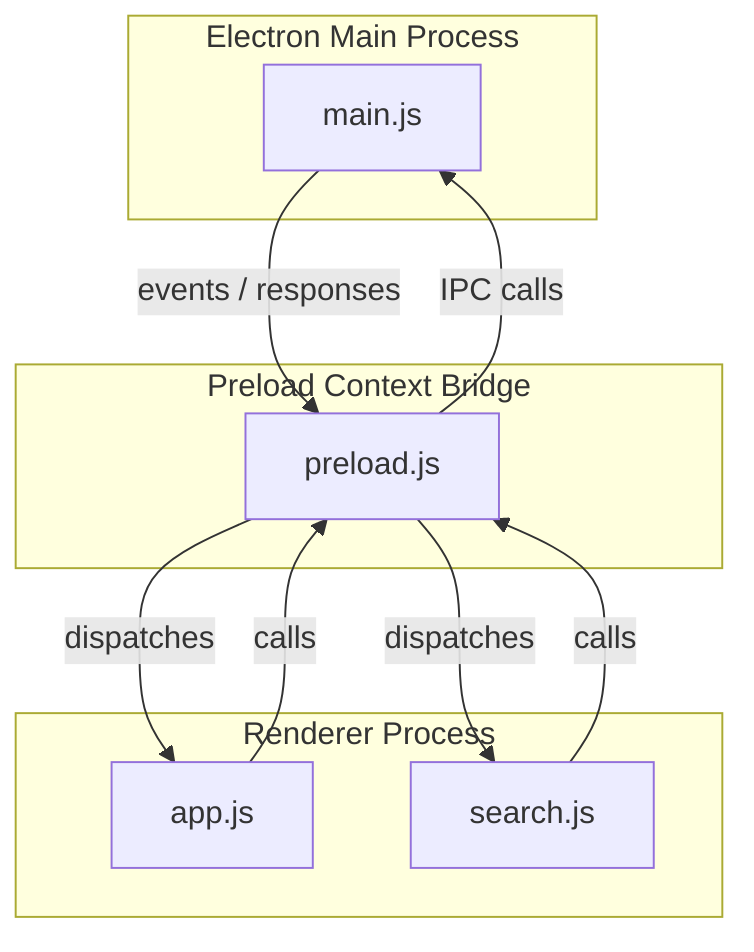
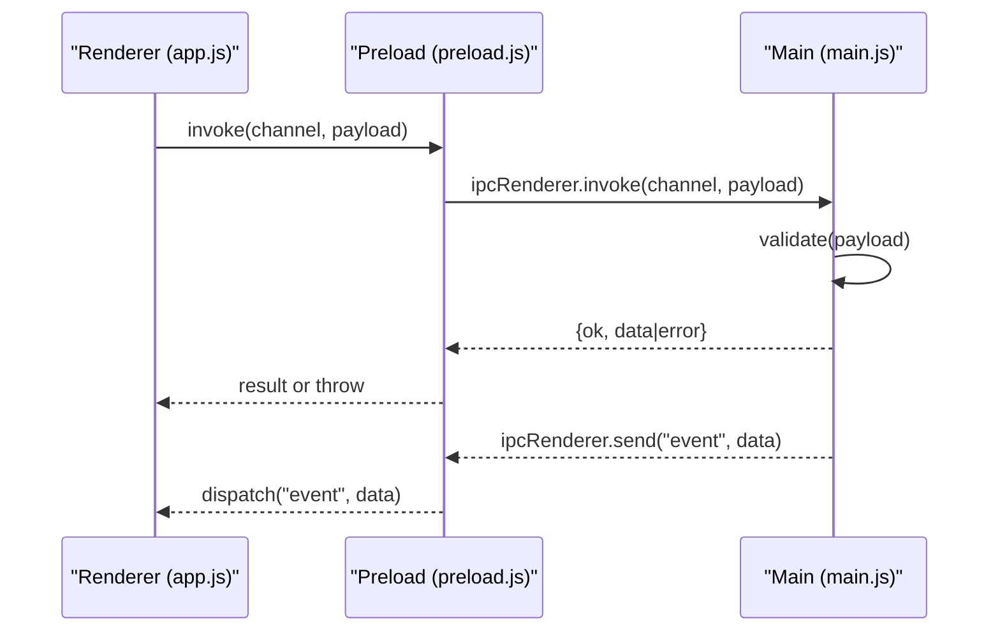
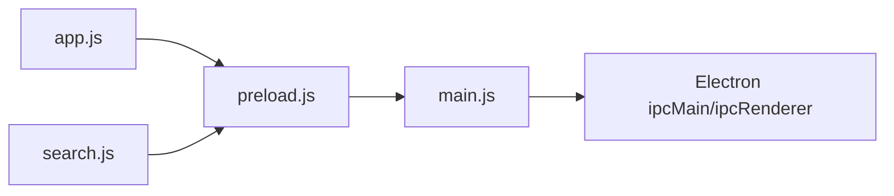

# IPC Communication

<cite>
**Referenced Files in This Document**
- [main.js](file://gui/main.js)
- [preload.js](file://gui/preload.js)
- [app.js](file://carrot/web/js/app.js)
- [search.js](file://carrot/web/js/search.js)
- [package.json](file://gui/package.json)
- [vite.config.js](file://gui/vite.config.js)
</cite>

## Table of Contents
1. [Introduction](#introduction)
2. [Project Structure](#project-structure)
3. [Core Components](#core-components)
4. [Architecture Overview](#architecture-overview)
5. [Detailed Component Analysis](#detailed-component-analysis)
6. [Dependency Analysis](#dependency-analysis)
7. [Performance Considerations](#performance-considerations)
8. [Troubleshooting Guide](#troubleshooting-guide)
9. [Conclusion](#conclusion)

## Introduction
This document explains the Inter-Process Communication (IPC) between Electron’s main process and renderer processes in this project. It focuses on message passing protocols, data serialization formats, event-driven patterns, secure implementation practices, error handling, performance optimization, input validation, and debugging techniques for cross-process communication.

## Project Structure
The IPC boundary is established by:
- Main process entrypoint that creates the BrowserWindow and registers handlers.
- Preload script that exposes a safe API to the renderer via contextBridge.
- Renderer scripts that call the exposed API and listen for events.

**Diagram sources**
- [main.js](file://gui/main.js)
- [preload.js](file://gui/preload.js)
- [app.js](file://carrot/web/js/app.js)
- [search.js](file://carrot/web/js/search.js)

**Section sources**
- [package.json](file://gui/package.json)
- [vite.config.js](file://gui/vite.config.js)

## Core Components
- Main process (main.js): Creates windows, sets security options, and registers IPC channels/handlers.
- Preload script (preload.js): Bridges a minimal, typed API from main to renderer using contextBridge and contextIsolation.
- Renderer scripts (app.js, search.js): Call the preload API and handle incoming events.

Key responsibilities:
- Define channel names and message schemas.
- Validate and sanitize inputs before processing.
- Return structured responses with success/error fields.
- Emit events for asynchronous updates.

**Section sources**
- [main.js](file://gui/main.js)
- [preload.js](file://gui/preload.js)
- [app.js](file://carrot/web/js/app.js)
- [search.js](file://carrot/web/js/search.js)

## Architecture Overview
The IPC architecture follows a strict boundary enforced by Electron’s security model:
- Renderers never access Node/Electron APIs directly.
- All IPC goes through the preload bridge.
- Main validates all inputs and returns normalized payloads.

**Diagram sources**
- [main.js](file://gui/main.js)
- [preload.js](file://gui/preload.js)
- [app.js](file://carrot/web/js/app.js)

## Detailed Component Analysis

### Main Process (main.js)
Responsibilities:
- Create BrowserWindow with secure defaults.
- Register IPC request/response handlers using ipcMain.handle.
- Emit events to renderers using ipcMain.emit or broadcast channels.
- Centralize input validation and error normalization.

Best practices implemented:
- Whitelist allowed channels.
- Strict schema validation for payloads.
- Consistent response envelope: { ok: boolean, data?: any, error?: string }.
- Avoid exposing internal module paths or secrets.

Security considerations:
- Disable nodeIntegration and enable contextIsolation.
- Use sandboxed contexts where possible.
- Never forward untrusted strings to shell/OS commands without validation.

Error handling:
- Catch exceptions around heavy operations.
- Map errors to user-friendly messages while preserving stack traces in dev logs.

Performance tips:
- Batch small messages into larger payloads when appropriate.
- Debounce frequent events (e.g., typing).
- Offload CPU-heavy work to worker threads or background tasks.

**Section sources**
- [main.js](file://gui/main.js)

### Preload Script (preload.js)
Responsibilities:
- Expose a minimal, typed API to the renderer via contextBridge.
- Wrap ipcRenderer.invoke and ipcRenderer.on to normalize payloads.
- Provide helper methods for common actions (e.g., open file, read config).

Design patterns:
- Channel-per-feature naming convention (e.g., "fs:read", "app:config").
- Request-response pattern for synchronous-like flows.
- Event streaming for long-running or push-based updates.

Validation and safety:
- Reject unknown channels.
- Sanitize arguments to prevent prototype pollution.
- Limit payload sizes to avoid memory spikes.

**Section sources**
- [preload.js](file://gui/preload.js)

### Renderer Scripts (app.js, search.js)
Responsibilities:
- Call the preload API to perform privileged operations.
- Listen for events emitted by the main process.
- Update UI based on results and errors.

Patterns:
- Use async/await with invoke for request-response.
- Subscribe/unsubscribe to events to avoid leaks.
- Show loading states and error banners to users.

Input validation:
- Validate user inputs client-side before sending.
- Handle malformed server responses gracefully.

**Section sources**
- [app.js](file://carrot/web/js/app.js)
- [search.js](file://carrot/web/js/search.js)

### Message Protocol and Data Formats
Channel naming:
- Use dot-separated namespaces: feature.action (e.g., "fs:read", "app:config").

Request envelope:
- id: unique request identifier
- channel: string
- payload: object

Response envelope:
- ok: boolean
- data: any (on success)
- error: string (on failure)

Event format:
- type: string
- payload: object

Serialization:
- JSON-safe objects only; avoid circular references.
- For large binary data, use ArrayBuffer or base64-encoded chunks.

**Section sources**
- [preload.js](file://gui/preload.js)
- [main.js](file://gui/main.js)

### Secure IPC Implementation Checklist
- Enable contextIsolation and disable nodeIntegration.
- Only expose required functions via contextBridge.
- Validate and sanitize all inputs on the main side.
- Use allowlist for channels and parameters.
- Avoid eval, dynamic requires, or shell execution with user input.
- Set proper CSP and permissions in BrowserWindow options.
- Log sensitive details only in development.

**Section sources**
- [main.js](file://gui/main.js)
- [preload.js](file://gui/preload.js)

### Error Handling Strategy
- Normalize errors to a consistent envelope.
- Distinguish recoverable vs fatal errors.
- Surface actionable messages to users; log full details internally.
- Implement retries for transient network or IO failures.
- Provide cancellation for long-running tasks.

**Section sources**
- [main.js](file://gui/main.js)
- [preload.js](file://gui/preload.js)

### Performance Optimization
- Debounce/throttle high-frequency events.
- Stream large datasets in chunks.
- Cache frequently accessed data in the main process.
- Avoid blocking the main thread; offload heavy work.
- Minimize payload size; remove unused fields.

**Section sources**
- [main.js](file://gui/main.js)
- [preload.js](file://gui/preload.js)

### Input Validation and Schema Enforcement
- Enforce types, ranges, and allowed values.
- Reject unexpected keys.
- Use a schema library or custom validators.
- Fail fast with clear error messages.

**Section sources**
- [main.js](file://gui/main.js)
- [preload.js](file://gui/preload.js)

### Debugging Cross-Process Communication
- Use DevTools for renderer and inspect logs in main console.
- Add structured logging with timestamps and correlation IDs.
- Log channel names and payload sizes (sanitized).
- Capture error stacks and context on failures.
- Use browser/network-like tools to trace event flow.

**Section sources**
- [main.js](file://gui/main.js)
- [preload.js](file://gui/preload.js)

## Dependency Analysis
The IPC layer depends on Electron’s IPC modules and is wired through the preload bridge. The renderer scripts depend only on the exposed API.

**Diagram sources**
- [app.js](file://carrot/web/js/app.js)
- [search.js](file://carrot/web/js/search.js)
- [preload.js](file://gui/preload.js)
- [main.js](file://gui/main.js)

**Section sources**
- [package.json](file://gui/package.json)
- [vite.config.js](file://gui/vite.config.js)

## Performance Considerations
- Keep payloads small and focused.
- Prefer streaming for large data.
- Batch related updates.
- Avoid synchronous IPC calls in hot paths.
- Monitor memory usage and GC pressure.

[No sources needed since this section provides general guidance]

## Troubleshooting Guide
Common issues and resolutions:
- Unknown channel errors: ensure channel names match exactly and are whitelisted.
- Serialization errors: check for non-JSON-safe structures like functions or circular refs.
- Permission denied: verify BrowserWindow security settings and preload path.
- Memory spikes: reduce payload sizes and implement chunking.
- Stale listeners: unsubscribe events when components unmount.

**Section sources**
- [main.js](file://gui/main.js)
- [preload.js](file://gui/preload.js)

## Conclusion
A robust IPC design in Electron hinges on a strict boundary enforced by the preload script, consistent message envelopes, strong validation, and careful error handling. By following the patterns and guidelines outlined here, you can build secure, maintainable, and performant cross-process communication for your application.