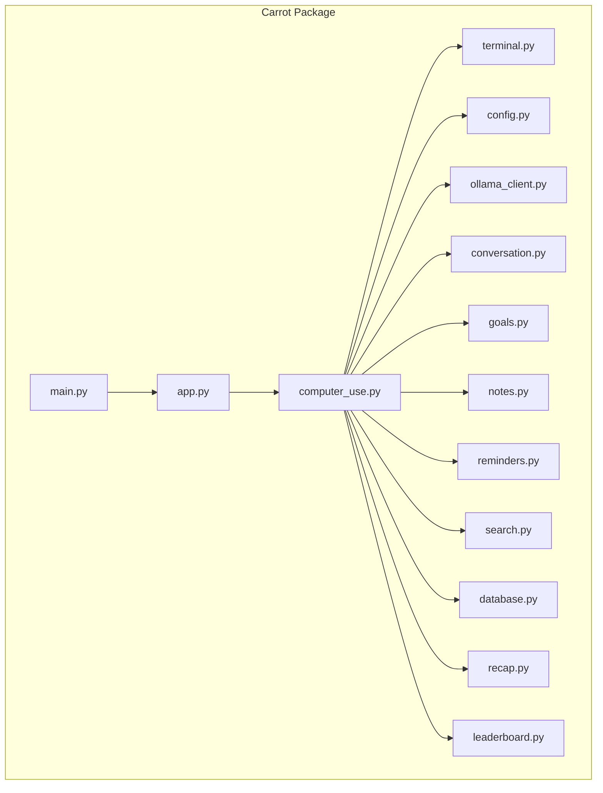
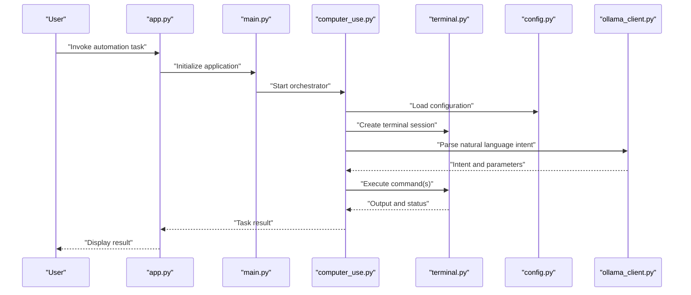
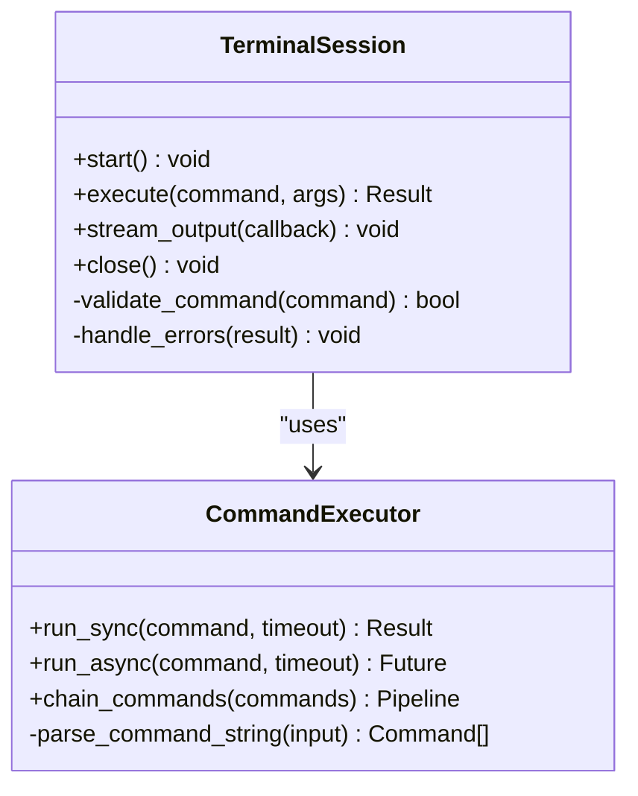
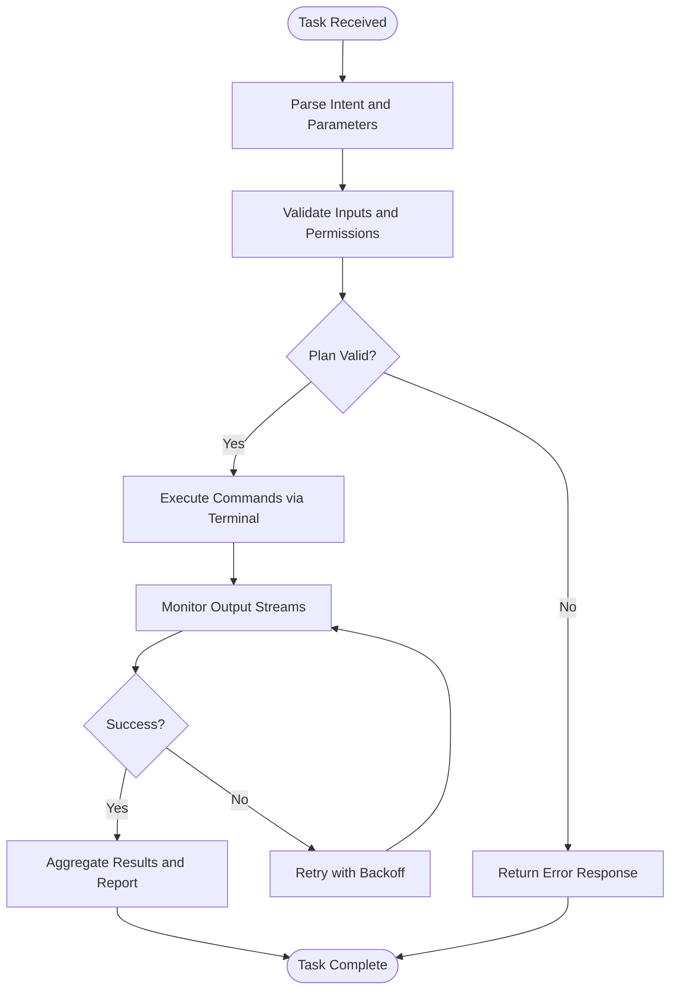
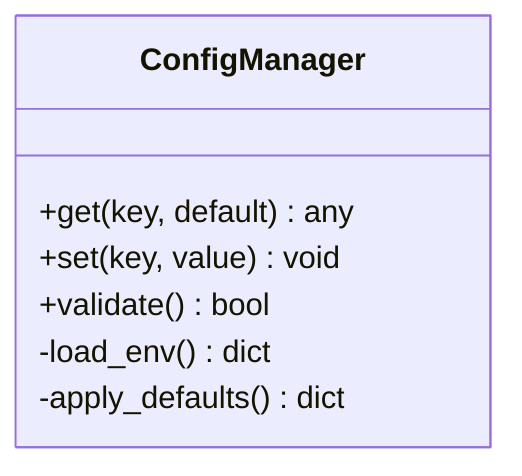
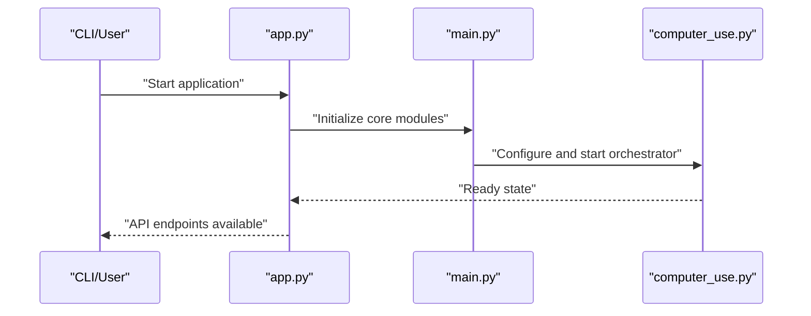
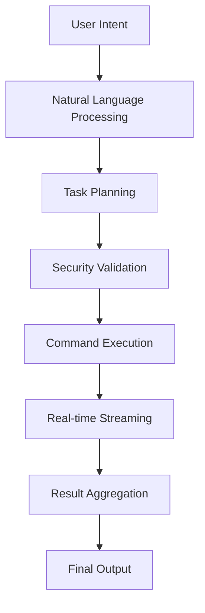
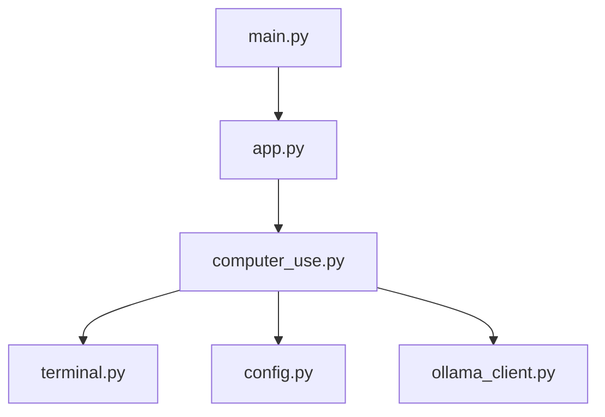

# Computer Use API

<cite>
**Referenced Files in This Document**
- [computer_use.py](file://carrot/computer_use.py)
- [terminal.py](file://carrot/terminal.py)
- [config.py](file://carrot/config.py)
- [app.py](file://carrot/app.py)
- [main.py](file://carrot/main.py)
- [ollama_client.py](file://carrot/ollama_client.py)
- [conversation.py](file://carrot/conversation.py)
- [goals.py](file://carrot/goals.py)
- [notes.py](file://carrot/notes.py)
- [reminders.py](file://carrot/reminders.py)
- [search.py](file://carrot/search.py)
- [database.py](file://carrot/database.py)
- [recap.py](file://carrot/recap.py)
- [leaderboard.py](file://carrot/leaderboard.py)
</cite>

## Table of Contents
1. [Introduction](#introduction)
2. [Project Structure](#project-structure)
3. [Core Components](#core-components)
4. [Architecture Overview](#architecture-overview)
5. [Detailed Component Analysis](#detailed-component-analysis)
6. [Dependency Analysis](#dependency-analysis)
7. [Performance Considerations](#performance-considerations)
8. [Troubleshooting Guide](#troubleshooting-guide)
9. [Conclusion](#conclusion)
10. [Appendices](#appendices)

## Introduction
This document provides comprehensive API documentation for computer automation and terminal control modules within the project. It focuses on system command execution, file operations, process management, and terminal interaction methods. The guide also covers security considerations, permission handling, error recovery patterns, examples of common automation tasks, command chaining, output processing, asynchronous operations, and real-time monitoring capabilities.

The goal is to help both technical and non-technical users understand how to safely and effectively automate computer tasks using the provided APIs.

## Project Structure
The project organizes functionality into modular Python files under the carrot package. Key modules relevant to automation and terminal control include:
- computer_use.py: High-level automation orchestration and integration points.
- terminal.py: Terminal session management, command execution, and I/O handling.
- config.py: Configuration management for environment variables and settings.
- app.py and main.py: Application entry points and initialization logic.
- ollama_client.py: Integration with external AI services for natural language-driven automation.
- conversation.py, goals.py, notes.py, reminders.py, search.py, database.py, recap.py, leaderboard.py: Supporting modules that may interact with automation workflows.

**Diagram sources**
- [computer_use.py](file://carrot/computer_use.py)
- [terminal.py](file://carrot/terminal.py)
- [config.py](file://carrot/config.py)
- [app.py](file://carrot/app.py)
- [main.py](file://carrot/main.py)
- [ollama_client.py](file://carrot/ollama_client.py)
- [conversation.py](file://carrot/conversation.py)
- [goals.py](file://carrot/goals.py)
- [notes.py](file://carrot/notes.py)
- [reminders.py](file://carrot/reminders.py)
- [search.py](file://carrot/search.py)
- [database.py](file://carrot/database.py)
- [recap.py](file://carrot/recap.py)
- [leaderboard.py](file://carrot/leaderboard.py)

**Section sources**
- [computer_use.py](file://carrot/computer_use.py)
- [terminal.py](file://carrot/terminal.py)
- [config.py](file://carrot/config.py)
- [app.py](file://carrot/app.py)
- [main.py](file://carrot/main.py)

## Core Components
- System Command Execution: Execute shell commands securely with proper input validation and error handling.
- File Operations: Read, write, and manage files with robust path validation and permission checks.
- Process Management: Start, monitor, and terminate processes asynchronously while capturing output streams.
- Terminal Interaction: Manage terminal sessions, handle interactive prompts, and stream output in real time.

These components are implemented across computer_use.py and terminal.py, with configuration managed via config.py and application orchestration through app.py and main.py.

**Section sources**
- [computer_use.py](file://carrot/computer_use.py)
- [terminal.py](file://carrot/terminal.py)
- [config.py](file://carrot/config.py)
- [app.py](file://carrot/app.py)
- [main.py](file://carrot/main.py)

## Architecture Overview
The automation architecture centers around a high-level orchestrator (computer_use.py) that coordinates terminal interactions (terminal.py), configuration (config.py), and integrations (e.g., ollama_client.py). Application entry points (app.py, main.py) initialize these components and expose APIs for automation tasks.

**Diagram sources**
- [app.py](file://carrot/app.py)
- [main.py](file://carrot/main.py)
- [computer_use.py](file://carrot/computer_use.py)
- [terminal.py](file://carrot/terminal.py)
- [config.py](file://carrot/config.py)
- [ollama_client.py](file://carrot/ollama_client.py)

## Detailed Component Analysis

### Terminal Control Module
The terminal module manages terminal sessions, executes commands, and handles I/O streams. It supports synchronous and asynchronous execution modes, enabling real-time monitoring and streaming output.

Key responsibilities:
- Session lifecycle management (create, configure, close).
- Command execution with input/output redirection.
- Error handling and retry strategies.
- Asynchronous streaming for live output capture.

**Diagram sources**
- [terminal.py](file://carrot/terminal.py)

**Section sources**
- [terminal.py](file://carrot/terminal.py)

### Automation Orchestrator
The orchestrator coordinates automation tasks by combining terminal operations, configuration, and optional AI-driven intent parsing. It ensures secure command execution and robust error recovery.

Key responsibilities:
- Task planning and decomposition.
- Secure command generation and validation.
- Process lifecycle management.
- Output aggregation and reporting.

**Diagram sources**
- [computer_use.py](file://carrot/computer_use.py)
- [terminal.py](file://carrot/terminal.py)
- [config.py](file://carrot/config.py)

**Section sources**
- [computer_use.py](file://carrot/computer_use.py)

### Configuration Management
Configuration management centralizes environment variables, feature flags, and runtime settings. It provides safe accessors and defaults to ensure consistent behavior across automation tasks.

Key responsibilities:
- Loading and validating configuration.
- Providing typed accessors for settings.
- Handling missing or invalid values gracefully.

**Diagram sources**
- [config.py](file://carrot/config.py)

**Section sources**
- [config.py](file://carrot/config.py)

### Application Entry Points
Application entry points initialize the orchestrator, terminal manager, and configuration. They expose APIs for automation tasks and handle user interactions.

Key responsibilities:
- Bootstrap application components.
- Expose REST or CLI interfaces for automation.
- Manage lifecycle and shutdown procedures.

**Diagram sources**
- [app.py](file://carrot/app.py)
- [main.py](file://carrot/main.py)
- [computer_use.py](file://carrot/computer_use.py)

**Section sources**
- [app.py](file://carrot/app.py)
- [main.py](file://carrot/main.py)

### Conceptual Overview
The automation pipeline transforms user intents into executable commands, manages their execution, and reports outcomes. It emphasizes security, reliability, and real-time feedback.

[No sources needed since this diagram shows conceptual workflow, not actual code structure]

## Dependency Analysis
The automation system exhibits clear separation of concerns with minimal coupling between modules. The orchestrator depends on terminal and configuration modules, while application entry points depend on the orchestrator. External dependencies like AI services are integrated via dedicated clients.

**Diagram sources**
- [computer_use.py](file://carrot/computer_use.py)
- [terminal.py](file://carrot/terminal.py)
- [config.py](file://carrot/config.py)
- [ollama_client.py](file://carrot/ollama_client.py)
- [app.py](file://carrot/app.py)
- [main.py](file://carrot/main.py)

**Section sources**
- [computer_use.py](file://carrot/computer_use.py)
- [terminal.py](file://carrot/terminal.py)
- [config.py](file://carrot/config.py)
- [app.py](file://carrot/app.py)
- [main.py](file://carrot/main.py)

## Performance Considerations
- Asynchronous Execution: Use async I/O for long-running commands to prevent blocking.
- Resource Limits: Set timeouts and memory limits for subprocesses to avoid resource exhaustion.
- Output Buffering: Stream large outputs incrementally to reduce memory usage.
- Connection Pooling: Reuse terminal sessions where appropriate to minimize overhead.
- Caching: Cache frequent results or configurations to improve response times.

[No sources needed since this section provides general guidance]

## Troubleshooting Guide
Common issues and resolutions:
- Permission Errors: Ensure the application runs with appropriate privileges and validate file paths.
- Command Failures: Implement retry logic with exponential backoff and log detailed error messages.
- Timeout Issues: Adjust timeouts based on command complexity and system load.
- Memory Leaks: Monitor subprocess memory usage and enforce cleanup procedures.
- Network Errors: Handle retries and fallbacks for external service calls.

**Section sources**
- [terminal.py](file://carrot/terminal.py)
- [computer_use.py](file://carrot/computer_use.py)

## Conclusion
The Computer Use API provides a robust framework for automating computer tasks through terminal control and system command execution. By emphasizing security, reliability, and real-time monitoring, it enables efficient automation workflows. Proper configuration, error handling, and performance tuning are essential for optimal operation.

[No sources needed since this section summarizes without analyzing specific files]

## Appendices
- Example Automation Tasks:
  - Run system diagnostics and report results.
  - Manage background processes with health checks.
  - Process logs in real time and trigger alerts.
- Command Chaining Patterns:
  - Sequential execution with dependency resolution.
  - Parallel execution with result aggregation.
- Output Processing Techniques:
  - Parse structured output formats (JSON, CSV).
  - Filter and transform unstructured text.

[No sources needed since this section provides general guidance]