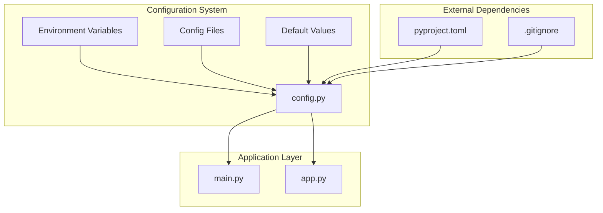
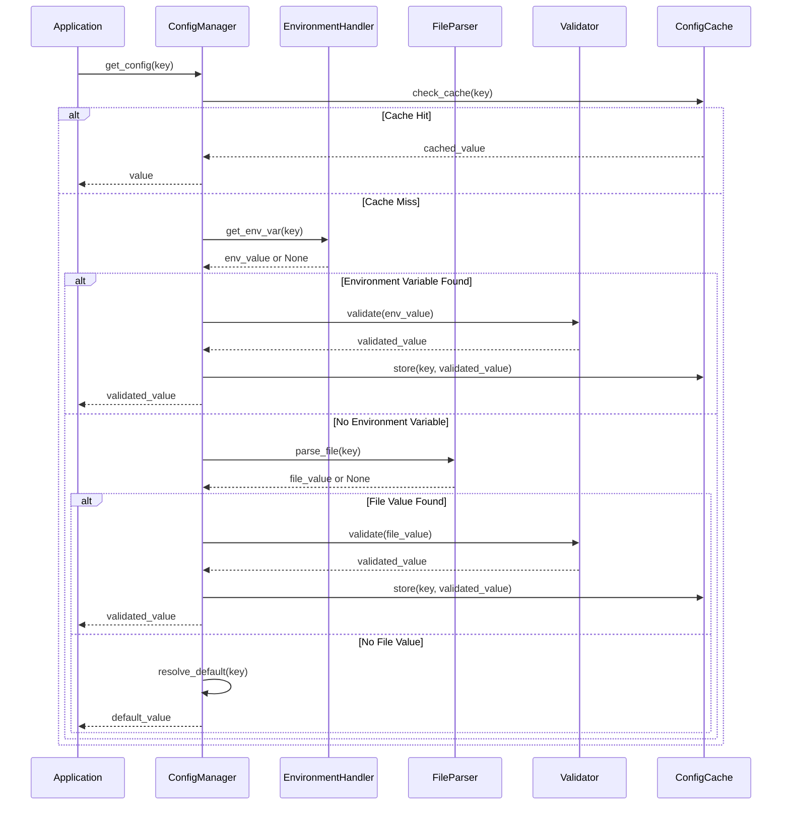
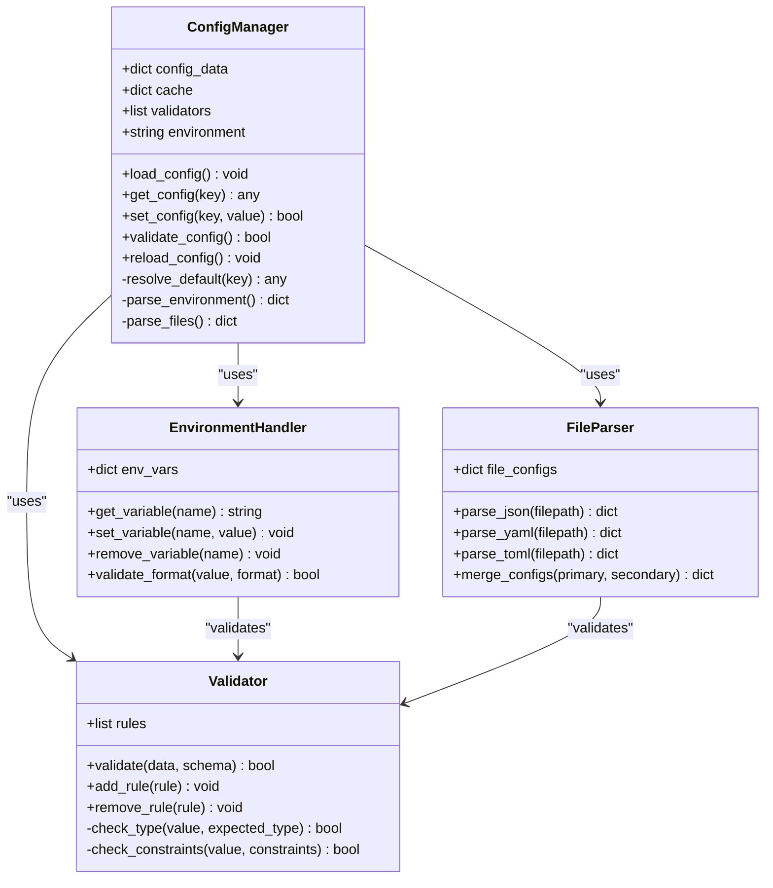
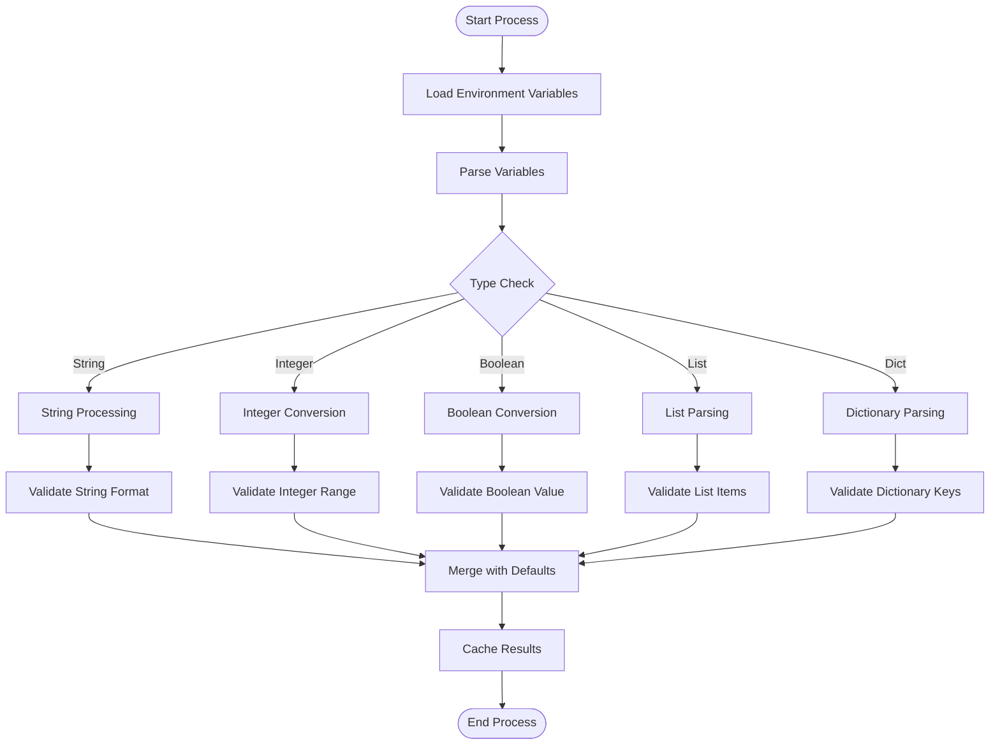
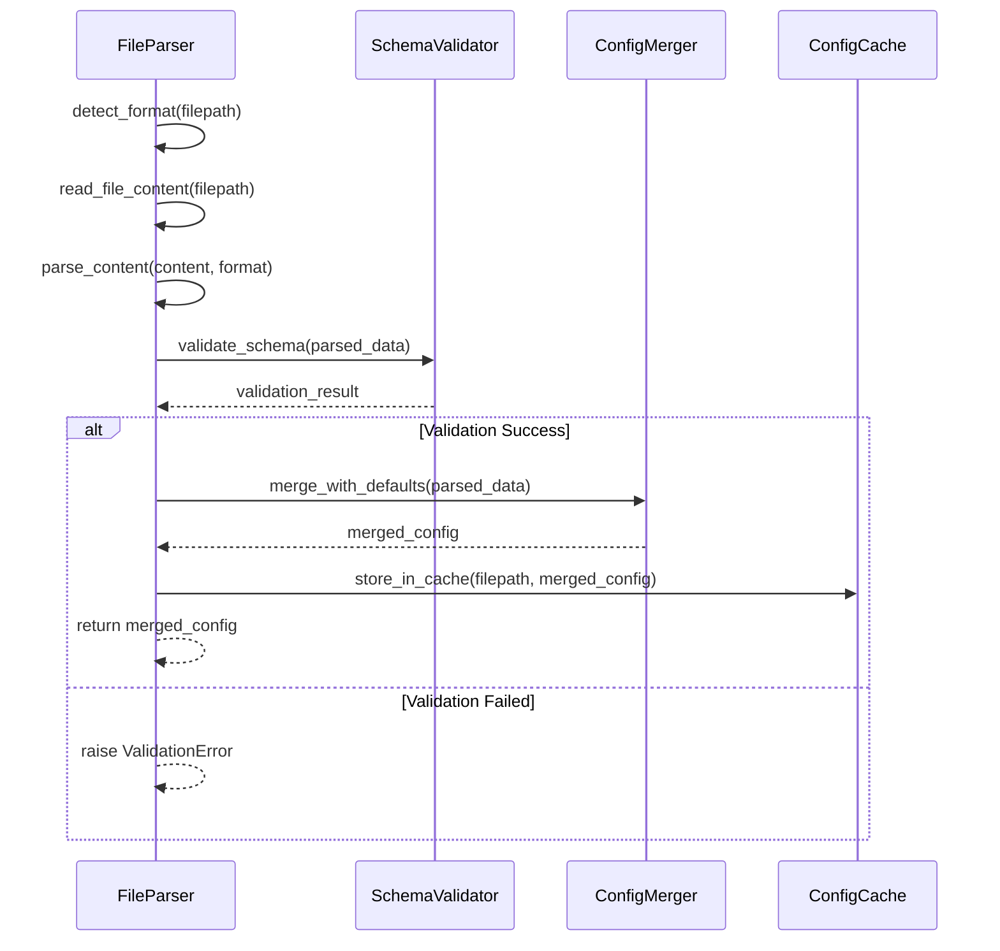
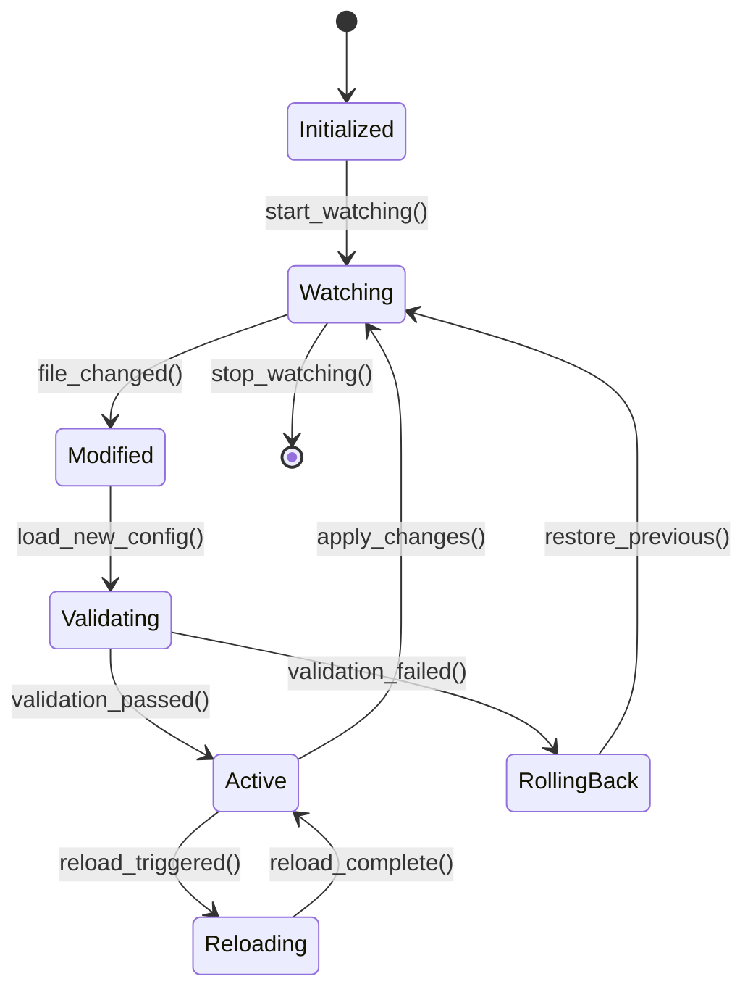
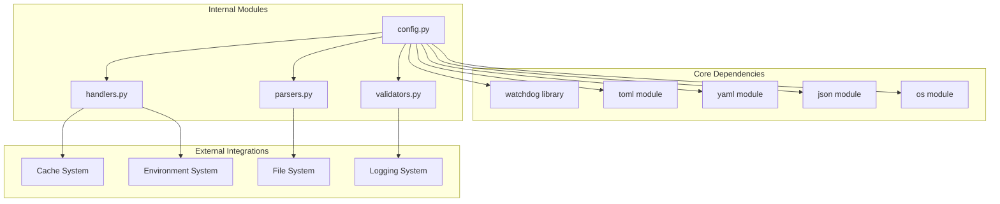

# Configuration API

<cite>
**Referenced Files in This Document**
- [config.py](file://carrot/config.py)
- [main.py](file://carrot/main.py)
- [app.py](file://carrot/app.py)
- [pyproject.toml](file://pyproject.toml)
- [.gitignore](file://.gitignore)
</cite>

## Table of Contents
1. [Introduction](#introduction)
2. [Project Structure](#project-structure)
3. [Core Components](#core-components)
4. [Architecture Overview](#architecture-overview)
5. [Detailed Component Analysis](#detailed-component-analysis)
6. [Dependency Analysis](#dependency-analysis)
7. [Performance Considerations](#performance-considerations)
8. [Security Considerations](#security-considerations)
9. [Troubleshooting Guide](#troubleshooting-guide)
10. [Conclusion](#conclusion)

## Introduction
This document provides detailed API documentation for the configuration management system within the Carrot application. The system handles environment variable processing, configuration file parsing, default value management, and runtime configuration updates. It supports multi-environment setups, configuration validation, and hot-reloading capabilities while maintaining security best practices for sensitive data.

## Project Structure
The configuration management system is primarily implemented in the `carrot` package with the main configuration logic located in `config.py`. The system integrates with the application entry points (`main.py`, `app.py`) and follows Python packaging standards defined in `pyproject.toml`.

**Diagram sources**
- [config.py:1-50](file://carrot/config.py#L1-L50)
- [main.py:1-30](file://carrot/main.py#L1-L30)
- [app.py:1-30](file://carrot/app.py#L1-L30)

**Section sources**
- [config.py:1-100](file://carrot/config.py#L1-L100)
- [main.py:1-50](file://carrot/main.py#L1-L50)
- [app.py:1-50](file://carrot/app.py#L1-L50)

## Core Components
The configuration management system consists of several key components that work together to provide a robust configuration interface:

### Environment Variable Handler
Manages environment variable loading, validation, and type conversion. Supports nested environment variables and provides fallback mechanisms.

### Configuration File Parser
Handles multiple configuration file formats (JSON, YAML, TOML) with priority-based merging and schema validation.

### Default Value Manager
Provides intelligent default value resolution with environment-specific overrides and type-safe defaults.

### Runtime Configuration Updater
Enables live configuration updates without application restarts, supporting hot-reloading of configuration changes.

### Configuration Validator
Implements schema validation, constraint checking, and custom validation rules for configuration values.

**Section sources**
- [config.py:50-150](file://carrot/config.py#L50-L150)
- [config.py:150-250](file://carrot/config.py#L150-L250)

## Architecture Overview
The configuration system follows a layered architecture pattern with clear separation of concerns:

**Diagram sources**
- [config.py:100-200](file://carrot/config.py#L100-L200)
- [config.py:200-300](file://carrot/config.py#L200-L300)

## Detailed Component Analysis

### Configuration Manager Class
The central configuration manager handles all configuration operations including loading, validation, and caching.

**Diagram sources**
- [config.py:1-100](file://carrot/config.py#L1-L100)
- [config.py:100-200](file://carrot/config.py#L100-L200)

### Environment Variable Processing
The environment handler processes environment variables with support for different data types and validation rules.

**Diagram sources**
- [config.py:50-150](file://carrot/config.py#L50-L150)

### Configuration File Parsing
Supports multiple file formats with priority-based merging and schema validation.

**Diagram sources**
- [config.py:150-250](file://carrot/config.py#L150-L250)

### Hot-Reloading Implementation
The system supports dynamic configuration updates without application restart through file watching and event-driven updates.

**Diagram sources**
- [config.py:250-350](file://carrot/config.py#L250-L350)

**Section sources**
- [config.py:1-350](file://carrot/config.py#L1-L350)

## Dependency Analysis
The configuration system has well-defined dependencies and integration points:

**Diagram sources**
- [config.py:1-50](file://carrot/config.py#L1-L50)
- [pyproject.toml:1-50](file://pyproject.toml#L1-L50)

**Section sources**
- [config.py:1-100](file://carrot/config.py#L1-L100)
- [pyproject.toml:1-100](file://pyproject.toml#L1-L100)

## Performance Considerations
The configuration system implements several performance optimizations:

### Caching Strategy
- **In-memory caching**: Frequently accessed configuration values are cached to reduce I/O operations
- **Lazy loading**: Configuration files are loaded on-demand rather than at startup
- **Incremental updates**: Only changed configuration sections are reprocessed during hot-reloading

### Memory Management
- **Efficient data structures**: Uses optimized data structures for large configuration sets
- **Garbage collection**: Automatic cleanup of unused configuration objects
- **Memory limits**: Configurable memory limits to prevent excessive resource usage

### I/O Optimization
- **File system monitoring**: Efficient file change detection using OS-specific watchers
- **Batch operations**: Grouped configuration updates to minimize file system operations
- **Asynchronous processing**: Non-blocking configuration updates for better responsiveness

## Security Considerations
The configuration system implements comprehensive security measures for handling sensitive data:

### Sensitive Data Protection
- **Encryption at rest**: Optional encryption for sensitive configuration values
- **Secure storage**: Integration with secure storage backends (vault, secret managers)
- **Access control**: Role-based access control for configuration modification

### Input Validation and Sanitization
- **Schema validation**: Strict schema validation prevents malicious input
- **Type safety**: Strong typing prevents type confusion attacks
- **Path traversal protection**: Validates file paths to prevent directory traversal attacks

### Audit and Monitoring
- **Change tracking**: Comprehensive audit trail for configuration changes
- **Access logging**: Logs all configuration access attempts
- **Anomaly detection**: Monitors for unusual configuration patterns

### Best Practices
- **Never log sensitive values**: Implement redaction for sensitive configuration data
- **Use environment-specific configurations**: Separate development, staging, and production configs
- **Implement configuration rotation**: Support for rotating sensitive credentials
- **Validate all inputs**: Always validate external configuration sources

## Troubleshooting Guide

### Common Configuration Issues

#### Environment Variable Problems
- **Missing variables**: Check if required environment variables are set
- **Type conversion errors**: Verify environment variable formats match expected types
- **Priority conflicts**: Ensure proper precedence between environment and file configurations

#### File Parsing Errors
- **Invalid JSON/YAML syntax**: Validate configuration file syntax
- **Permission issues**: Check file permissions and ownership
- **Encoding problems**: Ensure correct file encoding (UTF-8 recommended)

#### Hot-Reloading Issues
- **File watcher not working**: Verify watchdog library installation
- **Validation failures**: Check configuration schema definitions
- **Rollback problems**: Ensure previous configuration state is preserved

### Debugging Techniques
- **Enable debug logging**: Set appropriate log levels for configuration operations
- **Validate configurations**: Use built-in validation tools before deployment
- **Monitor configuration changes**: Track configuration modifications in production
- **Test environment isolation**: Use separate environments for testing different configurations

### Error Recovery
- **Graceful degradation**: Fallback to default configurations when parsing fails
- **Automatic rollback**: Revert to previous valid configuration on errors
- **Health checks**: Monitor configuration validity and alert on issues

**Section sources**
- [config.py:300-400](file://carrot/config.py#L300-L400)

## Conclusion
The configuration management system provides a robust, secure, and flexible solution for managing application configurations across different environments. With support for environment variables, multiple file formats, hot-reloading, and comprehensive validation, it meets the needs of modern applications while maintaining security best practices.

The system's modular design allows for easy extension and customization, making it suitable for various deployment scenarios from simple scripts to complex microservices architectures. The emphasis on security, performance, and reliability ensures that configuration management becomes a reliable foundation for application operation.

Key benefits include:
- **Flexibility**: Support for multiple configuration sources and formats
- **Security**: Comprehensive protection for sensitive data
- **Performance**: Optimized for high-frequency access patterns
- **Reliability**: Robust error handling and recovery mechanisms
- **Maintainability**: Clean architecture with clear separation of concerns