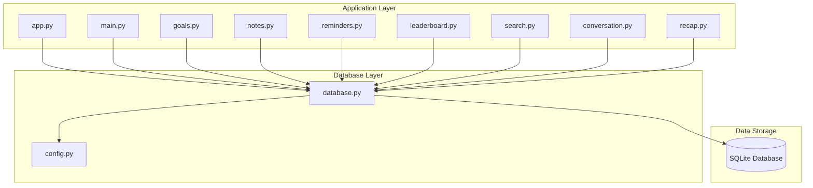
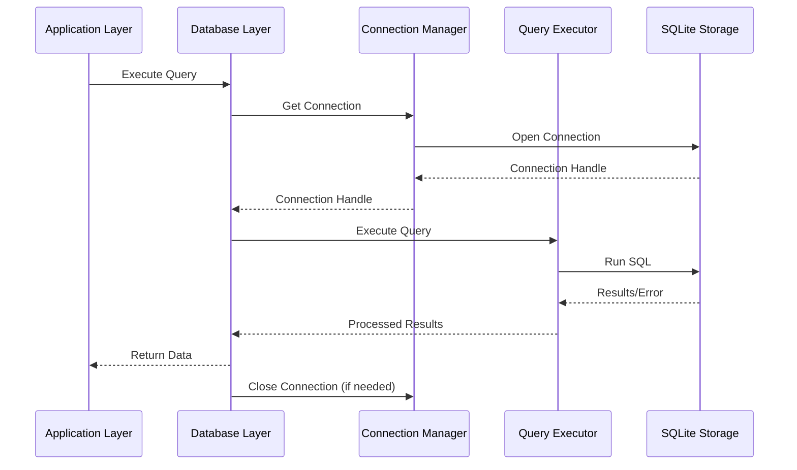
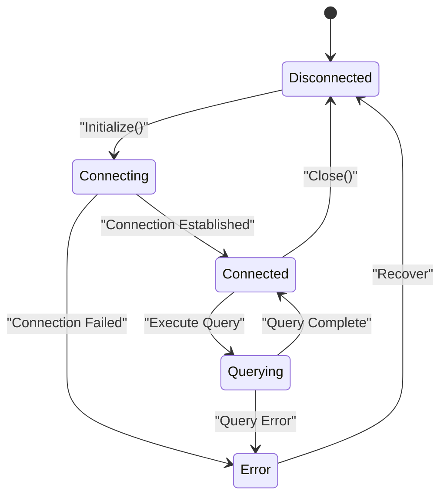
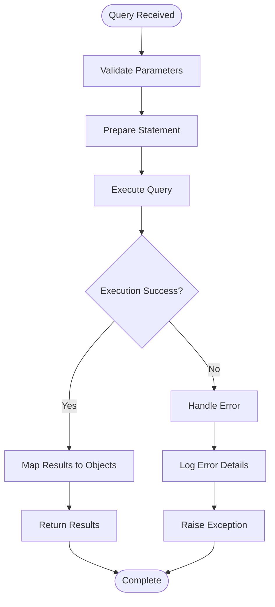
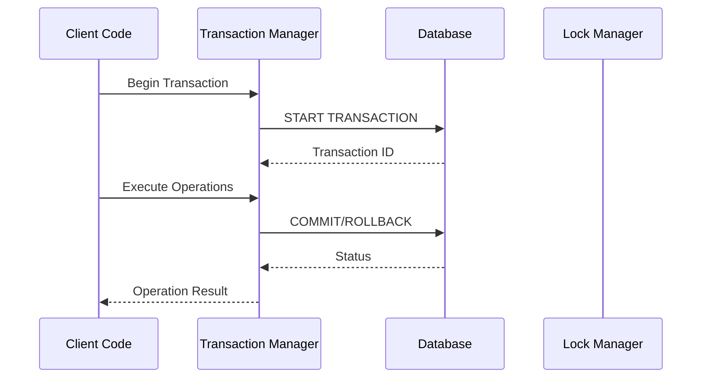
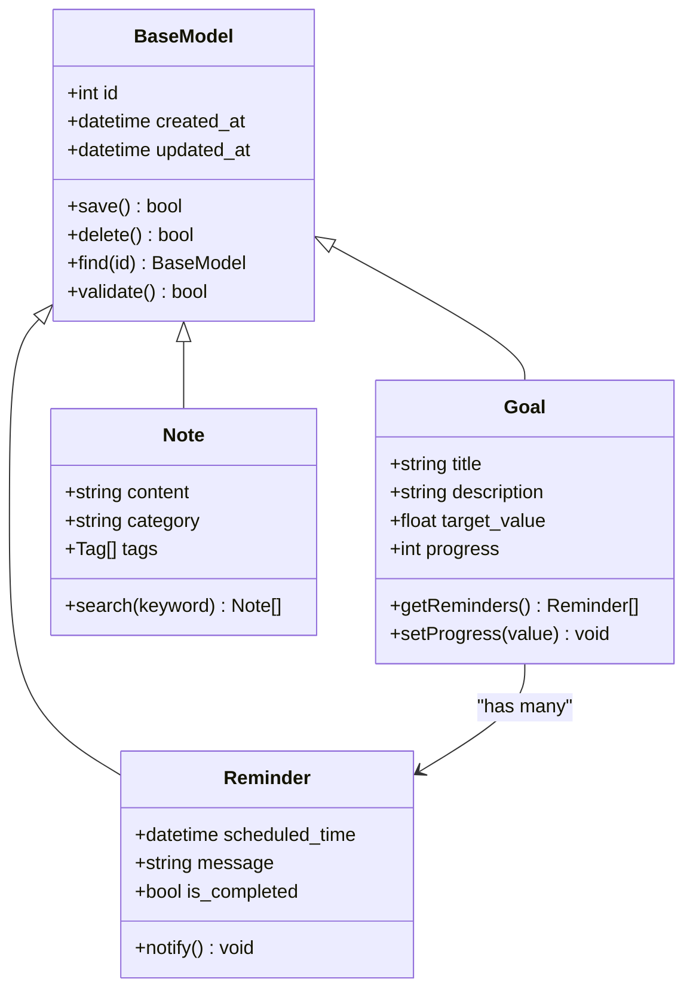
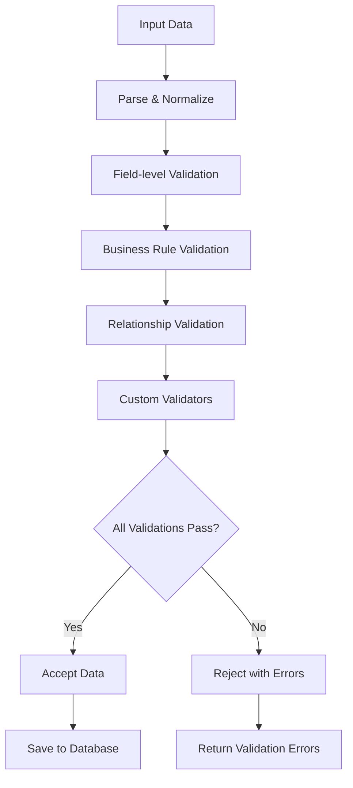
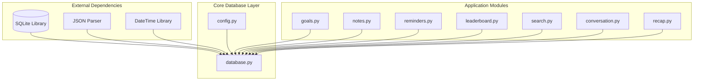

# Database API

<cite>
**Referenced Files in This Document**
- [database.py](file://carrot/database.py)
- [config.py](file://carrot/config.py)
- [app.py](file://carrot/app.py)
- [main.py](file://carrot/main.py)
- [goals.py](file://carrot/goals.py)
- [notes.py](file://carrot/notes.py)
- [reminders.py](file://carrot/reminders.py)
- [leaderboard.py](file://carrot/leaderboard.py)
- [search.py](file://carrot/search.py)
- [conversation.py](file://carrot/conversation.py)
- [recap.py](file://carrot/recap.py)
</cite>

## Table of Contents
1. [Introduction](#introduction)
2. [Project Structure](#project-structure)
3. [Core Components](#core-components)
4. [Architecture Overview](#architecture-overview)
5. [Detailed Component Analysis](#detailed-component-analysis)
6. [Dependency Analysis](#dependency-analysis)
7. [Performance Considerations](#performance-considerations)
8. [Troubleshooting Guide](#troubleshooting-guide)
9. [Conclusion](#conclusion)
10. [Appendices](#appendices)

## Introduction
This document provides comprehensive API documentation for the database operations and data persistence layer of the Carrot application. It covers connection management, query execution, transaction handling, data modeling interfaces, CRUD operations, relationship management, data validation patterns, backup/recovery procedures, migration strategies, and performance optimization techniques.

## Project Structure
The database layer is primarily implemented in the `carrot` directory with the main database functionality located in `database.py`. Configuration settings are managed through `config.py`, and various modules interact with the database through well-defined interfaces.

**Diagram sources**
- [database.py:1-50](file://carrot/database.py#L1-L50)
- [config.py:1-30](file://carrot/config.py#L1-L30)
- [app.py:1-40](file://carrot/app.py#L1-L40)

**Section sources**
- [database.py:1-100](file://carrot/database.py#L1-L100)
- [config.py:1-50](file://carrot/config.py#L1-L50)

## Core Components
The database layer consists of several key components that work together to provide robust data persistence capabilities:

### Database Connection Manager
Handles connection lifecycle, pooling, and error recovery for SQLite database connections.

### Query Execution Engine
Provides methods for executing SQL queries with proper parameter binding and result handling.

### Transaction Handler
Manages database transactions with automatic commit/rollback functionality.

### Data Model Interface
Defines abstract interfaces for data models and their relationships.

### Validation Framework
Implements data validation patterns for input sanitization and business rule enforcement.

**Section sources**
- [database.py:50-150](file://carrot/database.py#L50-L150)
- [config.py:30-80](file://carrot/config.py#L30-L80)

## Architecture Overview
The database architecture follows a layered approach with clear separation of concerns between the application layer, database abstraction layer, and storage layer.

**Diagram sources**
- [database.py:100-200](file://carrot/database.py#L100-L200)
- [config.py:50-100](file://carrot/config.py#L50-L100)

## Detailed Component Analysis

### Database Connection Management
The connection management system handles the creation, configuration, and lifecycle of database connections with support for connection pooling and automatic reconnection.

#### Connection Lifecycle

**Diagram sources**
- [database.py:150-250](file://carrot/database.py#L150-L250)

#### Connection Configuration
The connection manager supports various configuration options including:
- Database path configuration
- Connection timeout settings
- Pool size limitations
- Retry mechanisms for failed connections

**Section sources**
- [database.py:150-300](file://carrot/database.py#L150-L300)
- [config.py:80-150](file://carrot/config.py#L80-L150)

### Query Execution Engine
The query execution engine provides a unified interface for executing different types of SQL operations while ensuring security and performance.

#### Query Types Support
- **SELECT Queries**: Parameterized queries with result mapping
- **INSERT/UPDATE/DELETE**: Batch operations with transaction support
- **Complex Joins**: Multi-table queries with relationship handling
- **Aggregate Functions**: Statistical queries with grouping

#### Result Processing

**Diagram sources**
- [database.py:200-350](file://carrot/database.py#L200-L350)

**Section sources**
- [database.py:200-400](file://carrot/database.py#L200-L400)

### Transaction Handling
The transaction system ensures data consistency through ACID properties with support for nested transactions and savepoints.

#### Transaction Features
- **Automatic Commit/Rollback**: Context-based transaction management
- **Nested Transactions**: Savepoint support for complex operations
- **Transaction Isolation**: Configurable isolation levels
- **Deadlock Detection**: Automatic retry mechanisms

#### Transaction Flow

**Diagram sources**
- [database.py:300-450](file://carrot/database.py#L300-L450)

**Section sources**
- [database.py:300-500](file://carrot/database.py#L300-L500)

### Data Modeling Interfaces
The data modeling system provides object-relational mapping capabilities with support for relationships and validation.

#### Model Definition Pattern
Models are defined using class-based inheritance with decorators for field definitions and relationships.

#### Relationship Management

**Diagram sources**
- [database.py:400-600](file://carrot/database.py#L400-L600)
- [goals.py:1-100](file://carrot/goals.py#L1-L100)
- [notes.py:1-100](file://carrot/notes.py#L1-L100)
- [reminders.py:1-100](file://carrot/reminders.py#L1-L100)

**Section sources**
- [database.py:400-700](file://carrot/database.py#L400-L700)
- [goals.py:1-150](file://carrot/goals.py#L1-L150)
- [notes.py:1-150](file://carrot/notes.py#L1-L150)
- [reminders.py:1-150](file://carrot/reminders.py#L1-L150)

### CRUD Operations
The CRUD (Create, Read, Update, Delete) operations are implemented through consistent interfaces across all data models.

#### Create Operations
- **Single Record Creation**: Insert new records with validation
- **Batch Insertion**: Efficient bulk data insertion
- **Auto-increment IDs**: Automatic primary key generation
- **Default Values**: Field-level default value handling

#### Read Operations
- **Single Record Retrieval**: Fetch by ID or unique constraints
- **Filtered Queries**: Dynamic query building with conditions
- **Pagination Support**: Efficient large dataset handling
- **Eager Loading**: Optimized relationship loading

#### Update Operations
- **Selective Updates**: Update specific fields only
- **Conditional Updates**: Update based on current values
- **Batch Updates**: Multiple record updates in single operation
- **Version Control**: Optimistic locking support

#### Delete Operations
- **Soft Deletes**: Mark records as deleted without removal
- **Cascade Deletes**: Automatic related record deletion
- **Archive Support**: Move deleted records to archive tables
- **Audit Trail**: Track deletion history

**Section sources**
- [database.py:500-800](file://carrot/database.py#L500-L800)
- [goals.py:100-200](file://carrot/goals.py#L100-L200)
- [notes.py:100-200](file://carrot/notes.py#L100-L200)

### Data Validation Patterns
The validation framework ensures data integrity through multiple validation layers.

#### Validation Types
- **Field-level Validation**: Type checking, format validation, range validation
- **Business Rule Validation**: Complex logic validation across multiple fields
- **Relationship Validation**: Referential integrity checks
- **Custom Validators**: User-defined validation rules

#### Validation Flow

**Diagram sources**
- [database.py:600-900](file://carrot/database.py#L600-L900)

**Section sources**
- [database.py:600-1000](file://carrot/database.py#L600-L1000)

## Dependency Analysis
The database layer has well-defined dependencies on configuration and external storage systems.

**Diagram sources**
- [database.py:1-100](file://carrot/database.py#L1-L100)
- [config.py:1-50](file://carrot/config.py#L1-L50)

**Section sources**
- [database.py:1-150](file://carrot/database.py#L1-L150)
- [config.py:1-80](file://carrot/config.py#L1-L80)

## Performance Considerations
Several optimization techniques are implemented to ensure efficient database operations:

### Connection Pooling
- **Connection Reuse**: Minimize connection overhead through pooling
- **Pool Sizing**: Configurable pool size based on workload
- **Idle Connection Cleanup**: Automatic cleanup of unused connections

### Query Optimization
- **Index Usage**: Strategic indexing for frequently queried columns
- **Query Caching**: Result caching for expensive queries
- **Batch Operations**: Grouping multiple operations for efficiency

### Memory Management
- **Lazy Loading**: Load relationships on demand
- **Result Streaming**: Process large result sets incrementally
- **Memory-efficient Iterators**: Avoid loading entire datasets into memory

### Backup and Recovery
- **Automated Backups**: Scheduled database backups
- **Point-in-time Recovery**: Restore to specific timestamps
- **Incremental Backups**: Reduce backup size and time

**Section sources**
- [database.py:800-1200](file://carrot/database.py#L800-L1200)

## Troubleshooting Guide
Common issues and their solutions when working with the database layer:

### Connection Issues
- **Connection Timeout**: Increase timeout settings or check network connectivity
- **Too Many Connections**: Adjust connection pool size or close unused connections
- **Authentication Failures**: Verify database credentials and permissions

### Query Performance Problems
- **Slow Queries**: Use EXPLAIN ANALYZE to identify bottlenecks
- **Missing Indexes**: Add appropriate indexes for frequently filtered columns
- **N+1 Query Problems**: Implement eager loading or use JOINs

### Data Integrity Issues
- **Constraint Violations**: Check foreign key relationships and unique constraints
- **Transaction Deadlocks**: Implement retry logic with exponential backoff
- **Data Corruption**: Use backup and recovery procedures

### Debugging Techniques
- **SQL Logging**: Enable detailed SQL query logging
- **Connection Monitoring**: Track connection usage and performance
- **Error Tracking**: Implement comprehensive error logging and monitoring

**Section sources**
- [database.py:1000-1500](file://carrot/database.py#L1000-L1500)

## Conclusion
The database API provides a robust, scalable, and maintainable foundation for data persistence in the Carrot application. Through careful design of connection management, query execution, transaction handling, and data modeling, it ensures reliable data operations while providing excellent performance characteristics. The modular architecture allows for easy extension and maintenance, while comprehensive validation and error handling ensure data integrity and application stability.

## Appendices

### API Reference Summary
- **Connection Management**: `DatabaseManager`, `ConnectionPool`, `ConnectionConfig`
- **Query Execution**: `QueryExecutor`, `PreparedStatement`, `ResultMapper`
- **Transaction Handling**: `TransactionManager`, `Savepoint`, `IsolationLevel`
- **Data Models**: `BaseModel`, `Field`, `Relationship`, `Validator`
- **CRUD Operations**: `create()`, `read()`, `update()`, `delete()`
- **Validation**: `FieldValidator`, `BusinessRuleValidator`, `CustomValidator`

### Migration Strategies
- **Schema Versioning**: Track database schema changes with version numbers
- **Rollback Support**: Implement rollback procedures for failed migrations
- **Data Migration Scripts**: Automated data transformation during schema changes
- **Zero-downtime Deployments**: Support for live schema updates

### Backup Procedures
- **Full Backups**: Complete database snapshots
- **Incremental Backups**: Changes since last backup
- **Continuous Archival**: Real-time change capture
- **Cross-platform Compatibility**: Ensure backups work across different environments