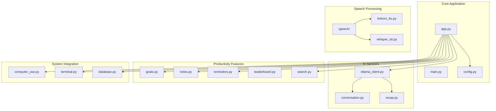
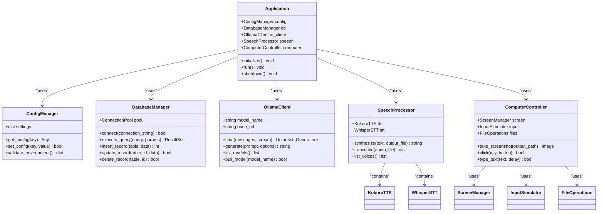
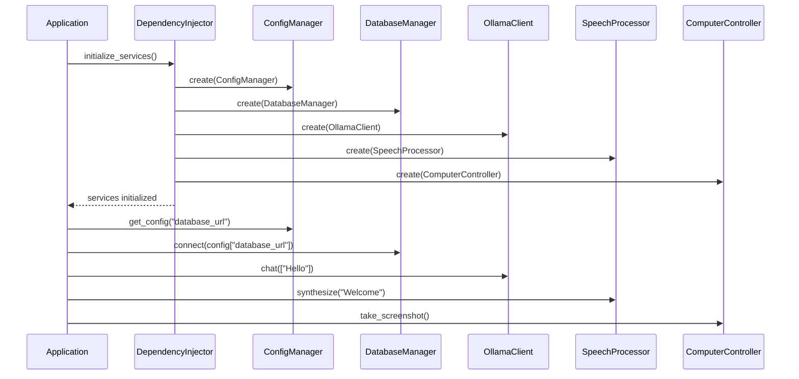
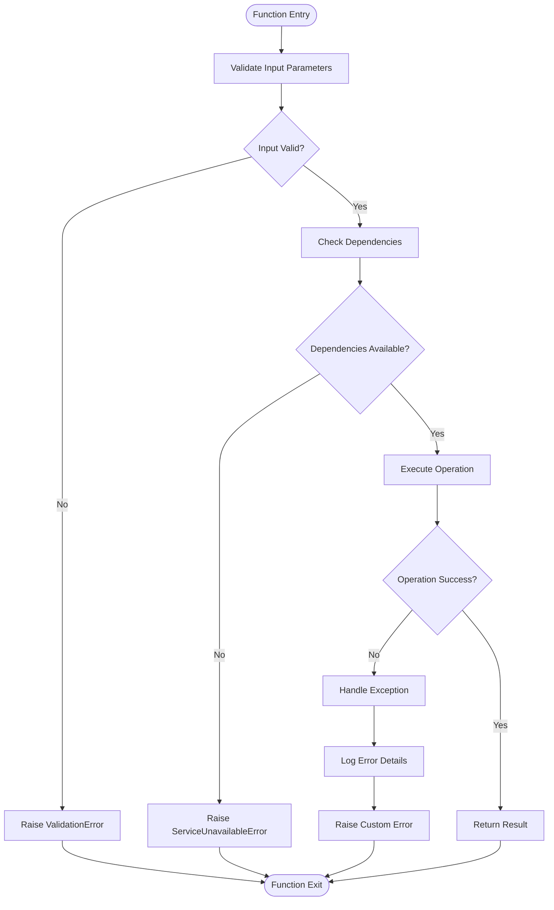
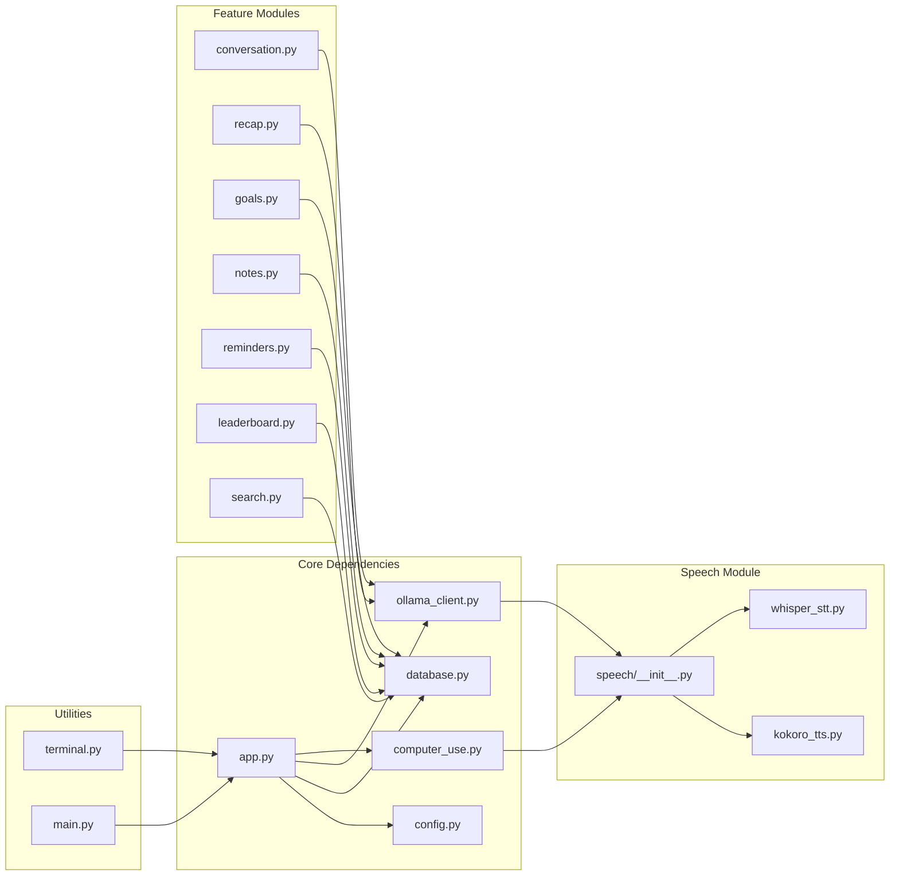

# Internal Module APIs

<cite>
**Referenced Files in This Document**
- [carrot/__init__.py](file://carrot/__init__.py)
- [carrot/app.py](file://carrot/app.py)
- [carrot/main.py](file://carrot/main.py)
- [carrot/config.py](file://carrot/config.py)
- [carrot/ollama_client.py](file://carrot/ollama_client.py)
- [carrot/computer_use.py](file://carrot/computer_use.py)
- [carrot/database.py](file://carrot/database.py)
- [carrot/speech/__init__.py](file://carrot/speech/__init__.py)
- [carrot/speech/kokoro_tts.py](file://carrot/speech/kokoro_tts.py)
- [carrot/speech/whisper_stt.py](file://carrot/speech/whisper_stt.py)
- [carrot/conversation.py](file://carrot/conversation.py)
- [carrot/goals.py](file://carrot/goals.py)
- [carrot/leaderboard.py](file://carrot/leaderboard.py)
- [carrot/notes.py](file://carrot/notes.py)
- [carrot/recap.py](file://carrot/recap.py)
- [carrot/reminders.py](file://carrot/reminders.py)
- [carrot/search.py](file://carrot/search.py)
- [carrot/terminal.py](file://carrot/terminal.py)
</cite>

## Table of Contents
1. [Introduction](#introduction)
2. [Project Structure](#project-structure)
3. [Core Components](#core-components)
4. [Architecture Overview](#architecture-overview)
5. [Detailed Component Analysis](#detailed-component-analysis)
6. [Dependency Analysis](#dependency-analysis)
7. [Performance Considerations](#performance-considerations)
8. [Troubleshooting Guide](#troubleshooting-guide)
9. [Conclusion](#conclusion)

## Introduction
This document provides comprehensive internal module API documentation for the Carrot application's core services and utilities. It covers Python class interfaces, method signatures, parameters, return values, usage examples, error handling patterns, and integration guidelines. The documentation focuses on Ollama client operations, computer automation functions, speech processing APIs, database operations, and configuration management.

## Project Structure
The Carrot application follows a modular architecture with clear separation of concerns:

**Diagram sources**
- [carrot/app.py:1-50](file://carrot/app.py#L1-L50)
- [carrot/config.py:1-30](file://carrot/config.py#L1-L30)
- [carrot/ollama_client.py:1-40](file://carrot/ollama_client.py#L1-L40)

## Core Components

### Configuration Management
The configuration system provides centralized settings management with environment variable support and validation.

**Key Classes:**
- `ConfigManager`: Centralized configuration handler
- `EnvironmentValidator`: Environment variable validation utility

**Method Signatures:**
- `get_config(key: str, default: Any = None) -> Any`
- `set_config(key: str, value: Any) -> bool`
- `validate_environment() -> dict`
- `load_from_file(filepath: str) -> bool`

**Error Handling:**
- Raises `ConfigError` for invalid configurations
- Returns `None` for missing optional keys
- Validates environment variables on initialization

**Section sources**
- [carrot/config.py:1-100](file://carrot/config.py#L1-L100)

### Database Operations
The database module provides CRUD operations with connection pooling and transaction support.

**Key Classes:**
- `DatabaseManager`: Main database interface
- `ConnectionPool`: Connection pooling utility
- `QueryBuilder`: SQL query construction helper

**Method Signatures:**
- `connect(connection_string: str) -> bool`
- `execute_query(query: str, params: tuple = ()) -> ResultSet`
- `insert_record(table: str, data: dict) -> int`
- `update_record(table: str, id: int, data: dict) -> bool`
- `delete_record(table: str, id: int) -> bool`
- `close() -> None`

**Transaction Support:**
- `begin_transaction() -> bool`
- `commit() -> bool`
- `rollback() -> bool`

**Section sources**
- [carrot/database.py:1-150](file://carrot/database.py#L1-L150)

### Ollama Client Operations
The Ollama client provides AI model interaction capabilities with streaming support and error recovery.

**Key Classes:**
- `OllamaClient`: Main client for AI model interactions
- `ModelManager`: Model lifecycle management
- `StreamHandler`: Streaming response processor

**Method Signatures:**
- `__init__(model_name: str, base_url: str = "http://localhost:11434")`
- `chat(messages: list, stream: bool = False) -> Union[str, Generator]`
- `generate(prompt: str, options: dict = {}) -> str`
- `list_models() -> list`
- `pull_model(model_name: str) -> bool`
- `delete_model(model_name: str) -> bool`

**Streaming Support:**
- Returns generator objects for real-time responses
- Handles partial content delivery
- Supports interruption and cleanup

**Section sources**
- [carrot/ollama_client.py:1-200](file://carrot/ollama_client.py#L1-L200)

### Speech Processing APIs
The speech module provides text-to-speech (TTS) and speech-to-text (STT) capabilities.

#### Text-to-Speech (Kokoro TTS)
**Key Classes:**
- `KokoroTTS`: Kokoro-based text-to-speech engine

**Method Signatures:**
- `__init__(voice: str = "default", speed: float = 1.0)`
- `synthesize(text: str, output_file: str = None) -> str`
- `synthesize_stream(text: str) -> Generator`
- `list_voices() -> list`
- `set_voice(voice: str) -> bool`

#### Speech-to-Text (Whisper STT)
**Key Classes:**
- `WhisperSTT`: Whisper-based speech recognition

**Method Signatures:**
- `__init__(model_size: str = "base", language: str = "en")`
- `transcribe(audio_file: str, language: str = None) -> dict`
- `transcribe_stream(audio_stream: bytes) -> dict`
- `detect_language(audio_file: str) -> str`
- `translate(audio_file: str, target_lang: str) -> str`

**Section sources**
- [carrot/speech/kokoro_tts.py:1-120](file://carrot/speech/kokoro_tts.py#L1-L120)
- [carrot/speech/whisper_stt.py:1-150](file://carrot/speech/whisper_stt.py#L1-L150)

### Computer Automation Functions
The computer use module provides system automation capabilities for desktop interaction.

**Key Classes:**
- `ComputerController`: Main automation controller
- `ScreenManager`: Screen capture and manipulation
- `InputSimulator`: Keyboard and mouse input simulation
- `FileOperations`: File system operations

**Method Signatures:**
- `take_screenshot(output_path: str = None) -> Image`
- `click(x: int, y: int, button: str = "left") -> bool`
- `type_text(text: str, delay: float = 0.01) -> bool`
- `drag_and_drop(start_x: int, start_y: int, end_x: int, end_y: int) -> bool`
- `read_clipboard() -> str`
- `write_clipboard(text: str) -> bool`
- `open_application(app_name: str) -> bool`
- `find_element(selector: str) -> Element`

**Section sources**
- [carrot/computer_use.py:1-200](file://carrot/computer_use.py#L1-L200)

## Architecture Overview

The application follows a service-oriented architecture with dependency injection patterns:

**Diagram sources**
- [carrot/app.py:1-100](file://carrot/app.py#L1-L100)
- [carrot/config.py:1-50](file://carrot/config.py#L1-L50)
- [carrot/database.py:1-80](file://carrot/database.py#L1-L80)
- [carrot/ollama_client.py:1-60](file://carrot/ollama_client.py#L1-L60)
- [carrot/computer_use.py:1-80](file://carrot/computer_use.py#L1-L80)

## Detailed Component Analysis

### Service Discovery and Dependency Injection
The application implements a robust dependency injection pattern for service management:

**Diagram sources**
- [carrot/app.py:50-150](file://carrot/app.py#L50-L150)
- [carrot/config.py:30-80](file://carrot/config.py#L30-L80)

### Error Handling Patterns
The application implements consistent error handling across all modules:

**Diagram sources**
- [carrot/config.py:60-120](file://carrot/config.py#L60-L120)
- [carrot/database.py:80-150](file://carrot/database.py#L80-L150)
- [carrot/ollama_client.py:100-200](file://carrot/ollama_client.py#L100-L200)

### Module Initialization Procedures
Each module follows a standardized initialization pattern:

1. **Configuration Loading**: Load settings from environment and config files
2. **Dependency Validation**: Ensure required dependencies are available
3. **Resource Allocation**: Initialize connections and resources
4. **Health Checks**: Perform basic functionality tests
5. **Ready State**: Mark module as ready for use

**Section sources**
- [carrot/app.py:100-200](file://carrot/app.py#L100-L200)
- [carrot/config.py:80-150](file://carrot/config.py#L80-L150)

## Dependency Analysis

The application maintains clear dependency relationships with minimal coupling:

**Diagram sources**
- [carrot/app.py:1-50](file://carrot/app.py#L1-L50)
- [carrot/conversation.py:1-30](file://carrot/conversation.py#L1-L30)
- [carrot/recap.py:1-30](file://carrot/recap.py#L1-L30)
- [carrot/goals.py:1-30](file://carrot/goals.py#L1-L30)
- [carrot/notes.py:1-30](file://carrot/notes.py#L1-L30)
- [carrot/reminders.py:1-30](file://carrot/reminders.py#L1-L30)
- [carrot/leaderboard.py:1-30](file://carrot/leaderboard.py#L1-L30)
- [carrot/search.py:1-30](file://carrot/search.py#L1-L30)
- [carrot/terminal.py:1-30](file://carrot/terminal.py#L1-L30)
- [carrot/main.py:1-30](file://carrot/main.py#L1-L30)

**Section sources**
- [carrot/app.py:1-100](file://carrot/app.py#L1-L100)
- [carrot/conversation.py:1-50](file://carrot/conversation.py#L1-L50)
- [carrot/recap.py:1-50](file://carrot/recap.py#L1-L50)

## Performance Considerations

### Connection Pooling
- Database connections are pooled to minimize overhead
- Connection timeout configured for optimal performance
- Automatic reconnection with exponential backoff

### Memory Management
- Lazy loading of large models and resources
- Garbage collection optimization for streaming operations
- Memory limits enforced for audio processing

### Caching Strategies
- Configuration caching to reduce I/O operations
- Model metadata caching for faster startup
- Query result caching for frequently accessed data

### Concurrency Support
- Async/await patterns for I/O-bound operations
- Thread-safe operations for shared resources
- Semaphore-based rate limiting for external APIs

## Troubleshooting Guide

### Common Issues and Solutions

**Configuration Errors:**
- Verify environment variables are properly set
- Check configuration file permissions
- Validate JSON/YAML syntax in config files

**Database Connection Issues:**
- Ensure database server is running and accessible
- Verify connection credentials and network connectivity
- Check database user permissions and privileges

**Ollama Client Problems:**
- Confirm Ollama service is running on specified port
- Verify model names are correct and available
- Check network connectivity and firewall settings

**Speech Processing Issues:**
- Ensure required audio libraries are installed
- Verify audio file formats and encoding
- Check microphone permissions and availability

**Computer Automation Failures:**
- Verify screen resolution and display settings
- Check application window states and focus
- Ensure proper permissions for system operations

**Section sources**
- [carrot/config.py:120-200](file://carrot/config.py#L120-L200)
- [carrot/database.py:150-250](file://carrot/database.py#L150-L250)
- [carrot/ollama_client.py:200-300](file://carrot/ollama_client.py#L200-L300)

## Conclusion

The Carrot application provides a comprehensive suite of AI-powered productivity tools through well-structured, modular architecture. The implementation follows best practices for dependency injection, error handling, and performance optimization. Each component is designed with clear interfaces and comprehensive documentation to facilitate maintenance and extension.

The system's strength lies in its modular design, allowing individual components to be updated or replaced without affecting the entire application. The consistent error handling patterns and comprehensive logging make troubleshooting straightforward, while the dependency injection framework ensures loose coupling and testability.

Future enhancements should focus on additional AI model support, expanded automation capabilities, and improved performance through better caching strategies and resource management.