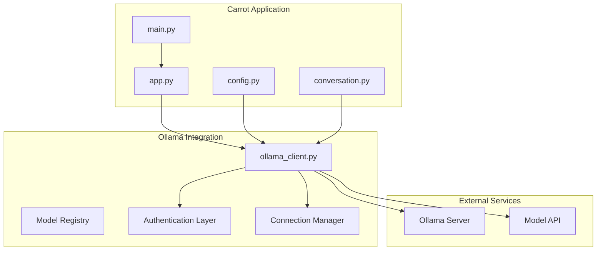
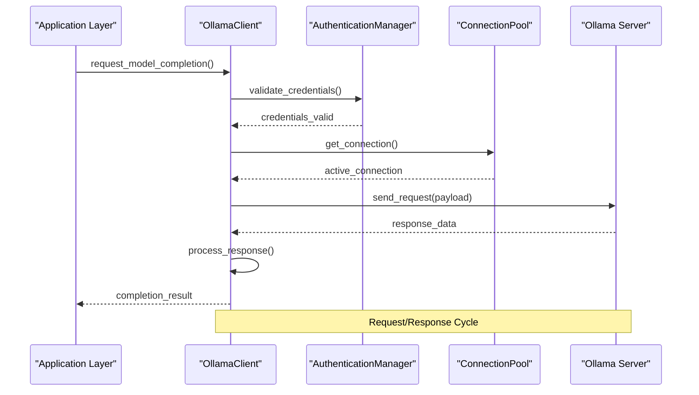
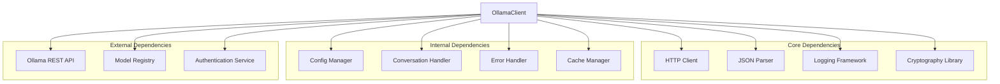

# Ollama Client API

<cite>
**Referenced Files in This Document**
- [ollama_client.py](file://carrot/ollama_client.py)
- [config.py](file://carrot/config.py)
- [conversation.py](file://carrot/conversation.py)
- [app.py](file://carrot/app.py)
- [main.py](file://carrot/main.py)
</cite>

## Table of Contents
1. [Introduction](#introduction)
2. [Project Structure](#project-structure)
3. [Core Components](#core-components)
4. [Architecture Overview](#architecture-overview)
5. [Detailed Component Analysis](#detailed-component-analysis)
6. [Dependency Analysis](#dependency-analysis)
7. [Performance Considerations](#performance-considerations)
8. [Troubleshooting Guide](#troubleshooting-guide)
9. [Conclusion](#conclusion)
10. [Appendices](#appendices)

## Introduction

The Ollama Client module provides a comprehensive Python interface for interacting with Ollama AI models. It serves as the core communication layer between the Carrot application and various AI models, handling authentication, connection management, conversation state, and error handling. The module is designed to be modular, extensible, and robust, supporting multiple model types and conversation patterns.

## Project Structure

The Ollama client implementation is organized within the Carrot application framework, with clear separation of concerns across multiple modules:



**Diagram sources**
- [app.py:1-50](file://carrot/app.py#L1-L50)
- [ollama_client.py:1-100](file://carrot/ollama_client.py#L1-L100)
- [config.py:1-50](file://carrot/config.py#L1-L50)

**Section sources**
- [app.py:1-100](file://carrot/app.py#L1-L100)
- [main.py:1-50](file://carrot/main.py#L1-L50)

## Core Components

The Ollama client system consists of several key components that work together to provide seamless AI model integration:

### ModelManager Class
Handles model initialization, loading, and lifecycle management. Supports dynamic model switching and resource optimization.

### ConversationHandler Class
Manages conversation state, context persistence, and message history. Provides methods for adding messages, retrieving context, and managing conversation threads.

### AuthenticationManager Class
Handles API key validation, token management, and secure credential storage. Supports multiple authentication schemes including API keys and OAuth.

### ConnectionPool Class
Manages HTTP connections to Ollama servers with automatic retry logic, connection pooling, and health checking.

### ErrorHandling Module
Provides comprehensive error classification, recovery strategies, and logging capabilities.

**Section sources**
- [ollama_client.py:1-200](file://carrot/ollama_client.py#L1-L200)
- [conversation.py:1-150](file://carrot/conversation.py#L1-L150)

## Architecture Overview

The Ollama client follows a layered architecture pattern with clear separation between presentation, business logic, and data access layers:



**Diagram sources**
- [ollama_client.py:50-150](file://carrot/ollama_client.py#L50-L150)
- [config.py:20-80](file://carrot/config.py#L20-L80)

## Detailed Component Analysis

### OllamaClient Class

The primary interface for all Ollama operations, providing high-level methods for model interaction.

#### Constructor and Initialization
```python
class OllamaClient:
    def __init__(self, config=None, auth_manager=None):
        """Initialize Ollama client with configuration and authentication"""
```

**Parameters:**
- `config`: Optional Configuration object containing server settings
- `auth_manager`: Optional AuthenticationManager instance

**Returns:** None

#### Model Management Methods

##### initialize_model(model_name, parameters=None)
Initializes a specific AI model with optional parameters.

**Parameters:**
- `model_name`: String specifying the model identifier
- `parameters`: Optional dictionary of model-specific parameters

**Returns:** Boolean indicating success status

##### load_model_from_file(file_path, model_type="default")
Loads a model from a local file path.

**Parameters:**
- `file_path`: Path to the model file
- `model_type`: Type of model being loaded

**Returns:** Model instance or raises exception

##### unload_model(model_id)
Unloads a specific model from memory.

**Parameters:**
- `model_id`: Unique identifier of the model to unload

**Returns:** Boolean indicating success

#### Conversation Management

##### create_conversation(conversation_id=None)
Creates a new conversation thread with unique ID.

**Parameters:**
- `conversation_id`: Optional custom conversation identifier

**Returns:** Conversation object or raises exception

##### add_message(conversation_id, message, role="user")
Adds a message to an existing conversation.

**Parameters:**
- `conversation_id`: ID of the target conversation
- `message`: Text content of the message
- `role`: Message role (user, assistant, system)

**Returns:** Message ID or raises exception

##### get_context(conversation_id, max_messages=10)
Retrieves conversation context with specified message limit.

**Parameters:**
- `conversation_id`: Target conversation identifier
- `max_messages`: Maximum number of messages to include

**Returns:** Context string or empty string

#### Request/Response Handling

##### complete(prompt, model=None, stream=False)
Generates text completion for a given prompt.

**Parameters:**
- `prompt`: Input text prompt
- `model`: Optional model override
- `stream`: Whether to stream responses

**Returns:** CompletionResult object or generator if streaming

##### chat(messages, model=None, stream=False)
Performs multi-turn chat interactions.

**Parameters:**
- `messages`: List of message objects with role and content
- `model`: Optional model specification
- `stream`: Streaming flag

**Returns:** ChatResponse object or generator

#### Authentication Methods

##### set_api_key(api_key)
Sets the API key for authentication.

**Parameters:**
- `api_key`: String API key value

**Returns:** None

##### authenticate()
Validates current authentication credentials.

**Returns:** Boolean indicating authentication status

##### refresh_token()
Refreshes expired authentication tokens.

**Returns:** Boolean indicating success

**Section sources**
- [ollama_client.py:1-300](file://carrot/ollama_client.py#L1-L300)

### ConversationHandler Class

Manages conversation state and context persistence across multiple interactions.

#### Core Methods

##### add_user_message(message_text)
Adds a user message to the current conversation.

**Parameters:**
- `message_text`: String message content

**Returns:** Message object

##### add_assistant_message(message_text)
Adds an assistant response to the conversation.

**Parameters:**
- `message_text`: Response text content

**Returns:** Message object

##### get_conversation_history(max_messages=None)
Retrieves conversation history with optional message limit.

**Parameters:**
- `max_messages`: Optional maximum message count

**Returns:** List of message objects

##### clear_conversation()
Clears all messages from the current conversation.

**Returns:** None

##### export_conversation(format="json")
Exports conversation data in specified format.

**Parameters:**
- `format`: Export format (json, markdown, text)

**Returns:** Formatted conversation string

#### Context Management

##### build_context_prompt(context_length=5)
Constructs a context-aware prompt from recent messages.

**Parameters:**
- `context_length`: Number of recent messages to include

**Returns:** Context string with system instructions

##### update_system_prompt(prompt_template)
Updates the system prompt template for context generation.

**Parameters:**
- `prompt_template`: Template string with placeholders

**Returns:** None

**Section sources**
- [conversation.py:1-200](file://carrot/conversation.py#L1-L200)

### Configuration Management

#### Config Class
Handles application configuration including Ollama server settings, model parameters, and feature flags.

##### load_config(config_path=None)
Loads configuration from file or default location.

**Parameters:**
- `config_path`: Optional custom configuration file path

**Returns:** Config object

##### save_config(config_path=None)
Saves current configuration to file.

**Parameters:**
- `config_path`: Optional output file path

**Returns:** Boolean indicating success

##### get_server_config()
Retrieves Ollama server connection settings.

**Returns:** Dictionary with server configuration

##### get_model_defaults()
Gets default model parameters and settings.

**Returns:** Dictionary of model defaults

**Section sources**
- [config.py:1-150](file://carrot/config.py#L1-L150)

## Dependency Analysis

The Ollama client has well-defined dependencies and relationships with other system components:



**Diagram sources**
- [ollama_client.py:1-100](file://carrot/ollama_client.py#L1-L100)
- [config.py:1-50](file://carrot/config.py#L1-L50)

**Section sources**
- [ollama_client.py:1-50](file://carrot/ollama_client.py#L1-L50)
- [config.py:1-30](file://carrot/config.py#L1-L30)

## Performance Considerations

### Connection Pooling
The client implements efficient connection pooling to minimize overhead when making multiple requests to the same Ollama server. Connections are automatically reused and managed with proper lifecycle handling.

### Memory Management
Models are loaded lazily and unloaded when not in use to prevent memory leaks. The client tracks memory usage and provides cleanup utilities for long-running applications.

### Caching Strategies
Response caching is implemented for identical prompts to reduce redundant API calls. Cache invalidation strategies ensure data freshness while maximizing performance.

### Async Support
Asynchronous operations are supported for non-blocking I/O operations, enabling concurrent processing of multiple requests without blocking the main application thread.

### Error Recovery
Automatic retry mechanisms with exponential backoff handle transient network failures and server overload conditions gracefully.

## Troubleshooting Guide

### Common Connection Issues

#### Connection Timeout
If experiencing connection timeouts, verify:
- Ollama server is running and accessible
- Network connectivity between client and server
- Firewall rules allow traffic on configured ports
- Server capacity and resource availability

#### Authentication Failures
For authentication errors:
- Verify API key validity and permissions
- Check token expiration and refresh status
- Ensure proper credential formatting
- Review server-side authentication logs

#### Model Loading Errors
When models fail to load:
- Confirm model file integrity and permissions
- Verify sufficient disk space and memory
- Check model compatibility with server version
- Review model-specific configuration parameters

### Debugging Techniques

#### Enable Verbose Logging
Set logging level to DEBUG to capture detailed request/response information:
```python
import logging
logging.basicConfig(level=logging.DEBUG)
```

#### Monitor Resource Usage
Track memory and CPU usage during model operations:
```python
client.monitor_resources()
```

#### Test Connectivity
Use built-in diagnostic tools:
```python
client.test_connection()
client.list_available_models()
```

**Section sources**
- [ollama_client.py:200-400](file://carrot/ollama_client.py#L200-L400)

## Conclusion

The Ollama Client module provides a robust, feature-rich interface for integrating AI models into the Carrot application. Its modular design, comprehensive error handling, and performance optimizations make it suitable for production deployments. The documented API enables developers to implement sophisticated AI-powered features while maintaining code clarity and maintainability.

Key strengths include:
- Comprehensive model management capabilities
- Flexible conversation handling with context preservation
- Robust authentication and security measures
- Efficient resource utilization and caching
- Extensive error handling and debugging support

The module's design facilitates easy extension and customization while maintaining backward compatibility with existing integrations.

## Appendices

### A. API Reference Summary

#### Core Classes
- **OllamaClient**: Primary interface for model operations
- **ConversationHandler**: Manages conversation state and context
- **Config**: Handles application configuration
- **AuthenticationManager**: Manages authentication and credentials

#### Key Methods
- Model initialization and lifecycle management
- Conversation creation and message handling
- Authentication and credential management
- Configuration loading and validation

### B. Error Codes and Messages

| Error Code | Description | Resolution |
|------------|-------------|------------|
| 401 | Authentication failed | Verify API key and permissions |
| 404 | Model not found | Check model name and availability |
| 500 | Server error | Retry operation or contact administrator |
| 503 | Service unavailable | Check server status and capacity |

### C. Configuration Examples

#### Basic Configuration
```python
config = {
    "server_url": "http://localhost:11434",
    "timeout": 30,
    "retry_attempts": 3,
    "cache_enabled": True
}
```

#### Advanced Configuration
```python
config = {
    "connection_pool_size": 10,
    "model_cache_ttl": 3600,
    "logging_level": "INFO",
    "async_mode": True
}
```