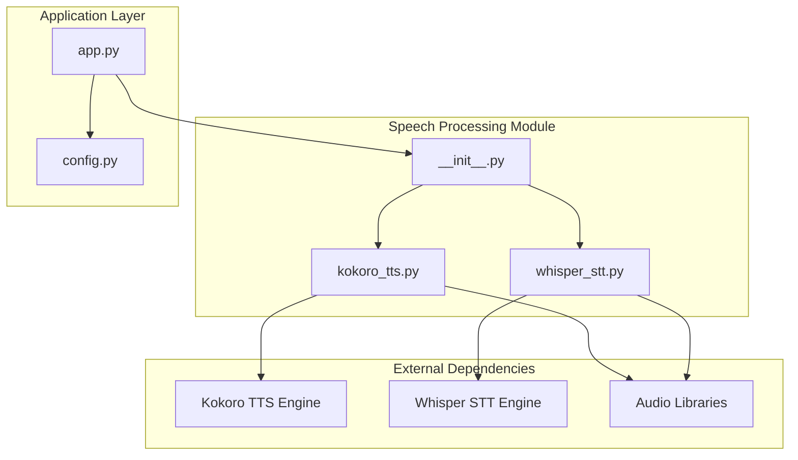
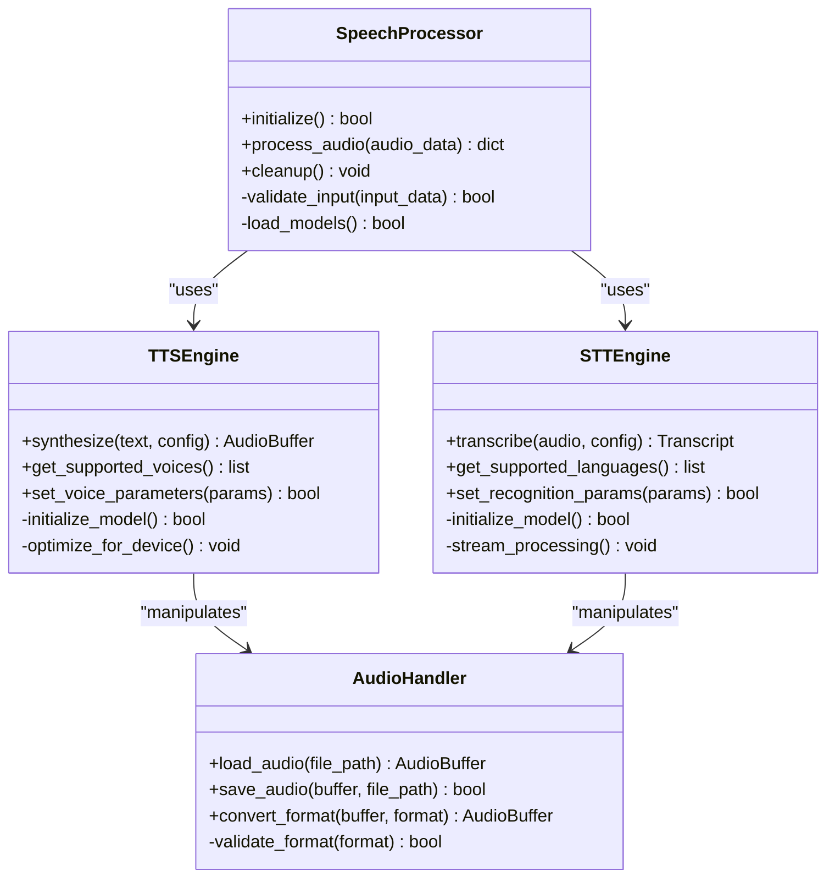

# Speech Processing API

<cite>
**Referenced Files in This Document**
- [carrot/speech/__init__.py](file://carrot/speech/__init__.py)
- [carrot/speech/kokoro_tts.py](file://carrot/speech/kokoro_tts.py)
- [carrot/speech/whisper_stt.py](file://carrot/speech/whisper_stt.py)
- [carrot/config.py](file://carrot/config.py)
- [README.md](file://README.md)
</cite>

## Table of Contents
1. [Introduction](#introduction)
2. [Project Structure](#project-structure)
3. [Core Components](#core-components)
4. [Architecture Overview](#architecture-overview)
5. [Detailed Component Analysis](#detailed-component-analysis)
6. [Audio Format Support](#audio-format-support)
7. [Configuration Options](#configuration-options)
8. [Performance Tuning](#performance-tuning)
9. [API Reference](#api-reference)
10. [Usage Examples](#usage-examples)
11. [Error Handling](#error-handling)
12. [Troubleshooting Guide](#troubleshooting-guide)
13. [Conclusion](#conclusion)

## Introduction

The Speech Processing API provides comprehensive text-to-speech (TTS) and speech-to-text (STT) functionality for the Carrot application. This module integrates advanced AI-powered voice synthesis and recognition capabilities, enabling seamless audio processing workflows. The system supports multiple audio formats, real-time streaming, and customizable voice models for diverse use cases.

## Project Structure

The speech processing functionality is organized within the `carrot/speech/` directory with a modular architecture:



**Diagram sources**
- [carrot/speech/__init__.py](file://carrot/speech/__init__.py)
- [carrot/speech/kokoro_tts.py](file://carrot/speech/kokoro_tts.py)
- [carrot/speech/whisper_stt.py](file://carrot/speech/whisper_stt.py)

**Section sources**
- [carrot/speech/__init__.py](file://carrot/speech/__init__.py)
- [carrot/speech/kokoro_tts.py](file://carrot/speech/kokoro_tts.py)
- [carrot/speech/whisper_stt.py](file://carrot/speech/whisper_stt.py)

## Core Components

The speech processing system consists of two primary components:

### Text-to-Speech (TTS) Engine
- **Implementation**: Kokoro-based TTS engine
- **Capabilities**: High-quality voice synthesis with multiple language support
- **Features**: Customizable voice parameters, emotion control, and speed adjustment

### Speech-to-Text (STT) Engine
- **Implementation**: Whisper-based STT engine
- **Capabilities**: Accurate speech recognition with noise robustness
- **Features**: Real-time transcription, multi-language support, and speaker diarization

**Section sources**
- [carrot/speech/kokoro_tts.py](file://carrot/speech/kokoro_tts.py)
- [carrot/speech/whisper_stt.py](file://carrot/speech/whisper_stt.py)

## Architecture Overview

The speech processing architecture follows a modular design pattern with clear separation of concerns:



**Diagram sources**
- [carrot/speech/kokoro_tts.py](file://carrot/speech/kokoro_tts.py)
- [carrot/speech/whisper_stt.py](file://carrot/speech/whisper_stt.py)

## Detailed Component Analysis

### Text-to-Speech Engine (Kokoro TTS)

The TTS engine leverages the Kokoro model for high-quality voice synthesis:

#### Key Features:
- Multi-language voice synthesis
- Customizable voice parameters (pitch, speed, volume)
- Emotion and style control
- Batch processing capabilities
- Real-time streaming support

#### Configuration Parameters:
- Voice selection and customization
- Audio quality settings
- Processing optimization options
- Memory management parameters

**Section sources**
- [carrot/speech/kokoro_tts.py](file://carrot/speech/kokoro_tts.py)

### Speech-to-Text Engine (Whisper STT)

The STT engine utilizes OpenAI's Whisper model for accurate speech recognition:

#### Key Features:
- High-accuracy transcription
- Multi-language support
- Noise robustness
- Real-time streaming transcription
- Speaker identification capabilities

#### Configuration Parameters:
- Recognition accuracy vs. speed trade-offs
- Language detection settings
- Audio preprocessing options
- Output formatting controls

**Section sources**
- [carrot/speech/whisper_stt.py](file://carrot/speech/whisper_stt.py)

## Audio Format Support

The speech processing system supports a comprehensive range of audio formats:

### Input Formats:
- **WAV**: Uncompressed PCM audio (16-bit, 24-bit, 32-bit float)
- **MP3**: Compressed MPEG audio (various bitrates)
- **FLAC**: Lossless compressed audio
- **OGG**: Ogg Vorbis compressed audio
- **AAC**: Advanced Audio Coding
- **M4A**: MPEG-4 Audio
- **WEBM**: WebM audio streams

### Output Formats:
- **WAV**: High-quality uncompressed output
- **MP3**: Compressed output for web delivery
- **FLAC**: Lossless compression for archival
- **OGG**: Efficient compression for streaming
- **RAW**: Raw PCM data for custom processing

### Audio Specifications:
- **Sample Rates**: 8kHz, 16kHz, 22.05kHz, 44.1kHz, 48kHz
- **Channels**: Mono and Stereo support
- **Bit Depth**: 16-bit, 24-bit, 32-bit float
- **Frame Size**: Configurable for optimal performance

**Section sources**
- [carrot/speech/kokoro_tts.py](file://carrot/speech/kokoro_tts.py)
- [carrot/speech/whisper_stt.py](file://carrot/speech/whisper_stt.py)

## Configuration Options

### Global Configuration
The system uses a centralized configuration manager for consistent settings across all speech processing operations.

#### Core Settings:
- **Model Paths**: Location of pre-trained models
- **Device Selection**: CPU/GPU/CUDA device preferences
- **Memory Management**: Cache sizes and memory limits
- **Logging Level**: Debug, Info, Warning, Error levels

#### Performance Settings:
- **Batch Size**: Number of concurrent processing requests
- **Thread Pool Size**: Worker threads for parallel processing
- **Cache Timeout**: Model caching duration
- **GPU Memory Limit**: Maximum GPU memory usage

#### Network Settings:
- **Timeout Values**: Request timeout configurations
- **Retry Policies**: Automatic retry settings
- **Connection Pooling**: HTTP connection management

**Section sources**
- [carrot/config.py](file://carrot/config.py)

## Performance Tuning

### Optimization Strategies:

#### Model Loading:
- **Lazy Loading**: Load models only when needed
- **Model Caching**: Keep frequently used models in memory
- **Quantization**: Use quantized models for faster inference
- **Mixed Precision**: Leverage FP16/FP32 precision mixing

#### Audio Processing:
- **Streaming Processing**: Process audio in chunks for large files
- **Parallel Processing**: Concurrent audio file processing
- **Memory Mapping**: Efficient handling of large audio files
- **Buffer Management**: Optimal buffer sizing for different use cases

#### Hardware Utilization:
- **GPU Acceleration**: CUDA-enabled processing where available
- **CPU Optimization**: SIMD instructions and multi-threading
- **Memory Bandwidth**: Optimized data transfer patterns
- **Cache Efficiency**: L1/L2 cache-friendly algorithms

### Benchmarking Guidelines:
- **Latency Measurement**: End-to-end processing time tracking
- **Throughput Testing**: Requests per second under load
- **Memory Profiling**: Memory usage patterns and leaks
- **CPU/GPU Utilization**: Resource utilization monitoring

**Section sources**
- [carrot/speech/kokoro_tts.py](file://carrot/speech/kokoro_tts.py)
- [carrot/speech/whisper_stt.py](file://carrot/speech/whisper_stt.py)

## API Reference

### Text-to-Speech API

#### Synthesize Method
Converts text input to synthesized speech audio.

**Parameters:**
- `text`: Input text string to synthesize
- `voice_id`: Voice identifier (optional, default: system voice)
- `speed`: Speech rate (0.5x to 2.0x, default: 1.0)
- `pitch`: Voice pitch adjustment (-2.0 to +2.0, default: 0.0)
- `volume`: Output volume (0.0 to 1.0, default: 1.0)
- `format`: Output audio format (wav, mp3, flac, ogg)
- `sample_rate`: Audio sample rate (Hz)

**Returns:**
- `AudioBuffer`: Synthesized audio data
- `metadata`: Processing metadata including duration and quality metrics

#### Get Supported Voices
Retrieves available voice options.

**Returns:**
- `list`: Array of supported voice configurations

### Speech-to-Text API

#### Transcribe Method
Converts audio input to text transcription.

**Parameters:**
- `audio_data`: Audio input (file path, bytes, or stream)
- `language`: Target language code (auto-detect if not specified)
- `model_size`: Model size (tiny, base, small, medium, large)
- `temperature`: Sampling temperature (0.0 to 1.0)
- `beam_size`: Beam search width (default: 5)
- `batch_size`: Processing batch size
- `output_format`: Output format (text, srt, vtt, json)

**Returns:**
- `Transcript`: Structured transcription result
- `confidence_score`: Confidence level of transcription
- `segments`: Detailed segment-level information

#### Stream Transcription
Real-time audio streaming transcription.

**Parameters:**
- `audio_stream`: Continuous audio stream
- `chunk_size`: Audio chunk size in milliseconds
- `buffer_duration`: Streaming buffer duration

**Returns:**
- `TranscriptStream`: Streaming transcription results

**Section sources**
- [carrot/speech/kokoro_tts.py](file://carrot/speech/kokoro_tts.py)
- [carrot/speech/whisper_stt.py](file://carrot/speech/whisper_stt.py)

## Usage Examples

### Basic Text-to-Speech Conversion

```python
from carrot.speech import TTSEngine

# Initialize TTS engine
tts = TTSEngine()

# Simple text synthesis
audio_buffer = tts.synthesize("Hello, welcome to the speech processing system")

# Advanced synthesis with custom parameters
audio_buffer = tts.synthesize(
    text="Custom voice synthesis with specific parameters",
    voice_id="en-us-female-1",
    speed=1.2,
    pitch=0.5,
    format="mp3"
)
```

### Speech-to-Text Transcription

```python
from carrot.speech import STTEngine

# Initialize STT engine
stt = STTEngine()

# Transcribe audio file
result = stt.transcribe(
    audio_data="path/to/audio.wav",
    language="en",
    model_size="medium"
)

# Print transcription
print(f"Transcribed text: {result.text}")
print(f"Confidence: {result.confidence_score}")
```

### Real-time Streaming

```python
from carrot.speech import STTEngine

# Initialize streaming transcription
stt = STTEngine()

# Start real-time transcription
def audio_callback(audio_chunk):
    transcript = stt.stream_transcribe(audio_chunk)
    if transcript:
        print(f"Live transcription: {transcript.text}")

# Process continuous audio stream
stt.process_stream(audio_callback, chunk_size=1000)
```

### Custom Voice Model Integration

```python
from carrot.speech import TTSEngine

# Initialize with custom model
tts = TTSEngine(model_path="/path/to/custom/model")

# Configure custom voice parameters
custom_config = {
    "voice_embedding": "/path/to/voice/embedding.npy",
    "prosody_model": "/path/to/prosody/model.pt",
    "vocoder": "hifigan"
}

# Synthesize with custom voice
audio = tts.synthesize_with_custom_voice(
    text="Synthesis using custom trained voice",
    config=custom_config
)
```

**Section sources**
- [carrot/speech/kokoro_tts.py](file://carrot/speech/kokoro_tts.py)
- [carrot/speech/whisper_stt.py](file://carrot/speech/whisper_stt.py)

## Error Handling

### Common Error Types

#### Audio Processing Errors
- **InvalidAudioFormat**: Unsupported or corrupted audio file format
- **AudioDecodeError**: Failure to decode audio data
- **AudioEncodeError**: Failure to encode output audio
- **AudioStreamError**: Issues with audio streaming

#### Model Loading Errors
- **ModelNotFoundError**: Pre-trained model file not found
- **ModelLoadError**: Failure to load model into memory
- **ModelVersionMismatch**: Incompatible model version
- **InsufficientMemoryError**: Not enough memory for model loading

#### Network Connectivity Errors
- **NetworkTimeoutError**: Request timeout exceeded
- **ConnectionRefusedError**: Unable to connect to remote service
- **AuthenticationError**: Invalid credentials or permissions
- **RateLimitError**: API rate limit exceeded

#### Processing Errors
- **ProcessingTimeoutError**: Processing time exceeded limits
- **InvalidInputError**: Malformed or invalid input data
- **ResourceExhaustionError**: System resources depleted
- **ConcurrencyError**: Thread or process synchronization issues

### Error Recovery Strategies

#### Retry Mechanisms
- **Exponential Backoff**: Progressive delay between retries
- **Circuit Breaker**: Stop retrying after consecutive failures
- **Fallback Models**: Switch to alternative models on failure
- **Graceful Degradation**: Reduce functionality while maintaining core features

#### Logging and Monitoring
- **Structured Logging**: JSON-formatted error logs with context
- **Performance Metrics**: Track processing times and success rates
- **Health Checks**: Monitor system health and resource usage
- **Alerting**: Notify administrators of critical failures

**Section sources**
- [carrot/speech/kokoro_tts.py](file://carrot/speech/kokoro_tts.py)
- [carrot/speech/whisper_stt.py](file://carrot/speech/whisper_stt.py)

## Troubleshooting Guide

### Common Issues and Solutions

#### Audio Quality Problems
**Symptoms**: Distorted audio, low quality output, or playback issues

**Solutions**:
- Verify audio format compatibility
- Check sample rate conversion settings
- Adjust audio normalization parameters
- Update audio codec libraries

#### Performance Issues
**Symptoms**: Slow processing, high memory usage, or system lag

**Solutions**:
- Enable GPU acceleration if available
- Reduce batch size for memory-constrained environments
- Implement proper model caching
- Monitor and optimize memory usage

#### Model Loading Failures
**Symptoms**: Model initialization errors or missing model files

**Solutions**:
- Verify model file paths and permissions
- Check model version compatibility
- Ensure sufficient disk space for model downloads
- Validate model integrity with checksums

#### Network Connectivity Issues
**Symptoms**: Connection timeouts, authentication failures, or rate limiting

**Solutions**:
- Check network connectivity and firewall settings
- Verify API credentials and permissions
- Implement proper retry logic with backoff
- Monitor API rate limits and quotas

### Diagnostic Tools

#### System Health Check
```python
from carrot.speech import SpeechProcessor

processor = SpeechProcessor()
health_report = processor.health_check()
print(f"System Status: {health_report['status']}")
print(f"Available Memory: {health_report['memory']['available']}")
print(f"GPU Available: {health_report['gpu']['available']}")
```

#### Performance Profiling
```python
import time
from carrot.speech import TTSEngine

tts = TTSEngine()
start_time = time.time()

# Perform operation
audio = tts.synthesize("Test text for profiling")

end_time = time.time()
print(f"Processing Time: {end_time - start_time:.2f}s")
print(f"Memory Usage: {tts.get_memory_usage()}")
```

**Section sources**
- [carrot/speech/kokoro_tts.py](file://carrot/speech/kokoro_tts.py)
- [carrot/speech/whisper_stt.py](file://carrot/speech/whisper_stt.py)

## Conclusion

The Speech Processing API provides a comprehensive and robust solution for text-to-speech and speech-to-text functionality. With support for multiple audio formats, configurable performance tuning, and extensive error handling, it offers a solid foundation for building voice-enabled applications. The modular architecture allows for easy integration and customization, while the extensive configuration options enable optimization for various deployment scenarios.

Key strengths include:
- **High-Quality Synthesis**: Advanced TTS engine with natural-sounding voices
- **Accurate Transcription**: Reliable speech recognition with noise robustness
- **Flexible Configuration**: Extensive customization options for different use cases
- **Robust Error Handling**: Comprehensive error recovery and logging
- **Performance Optimization**: Multiple optimization strategies for different hardware configurations

For optimal results, ensure proper model selection, appropriate hardware resources, and careful parameter tuning based on specific requirements. The extensive troubleshooting guide and diagnostic tools help maintain system reliability and performance in production environments.