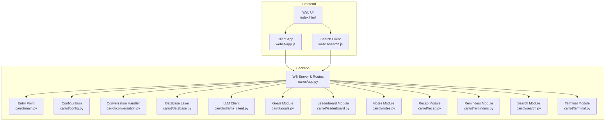
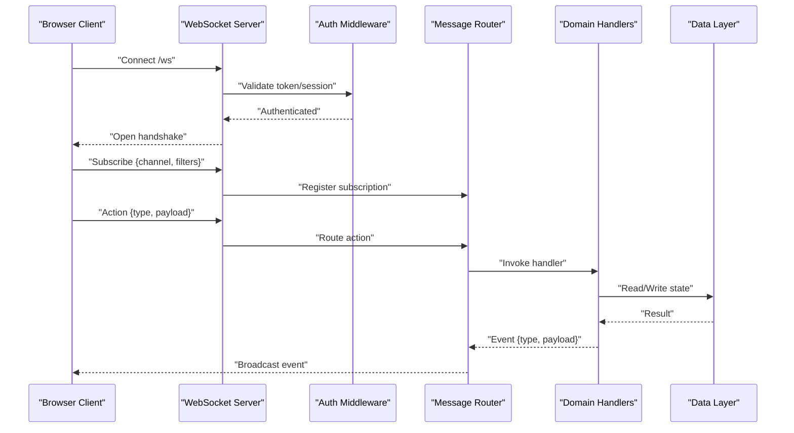
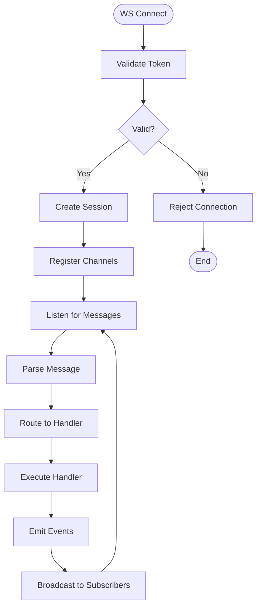
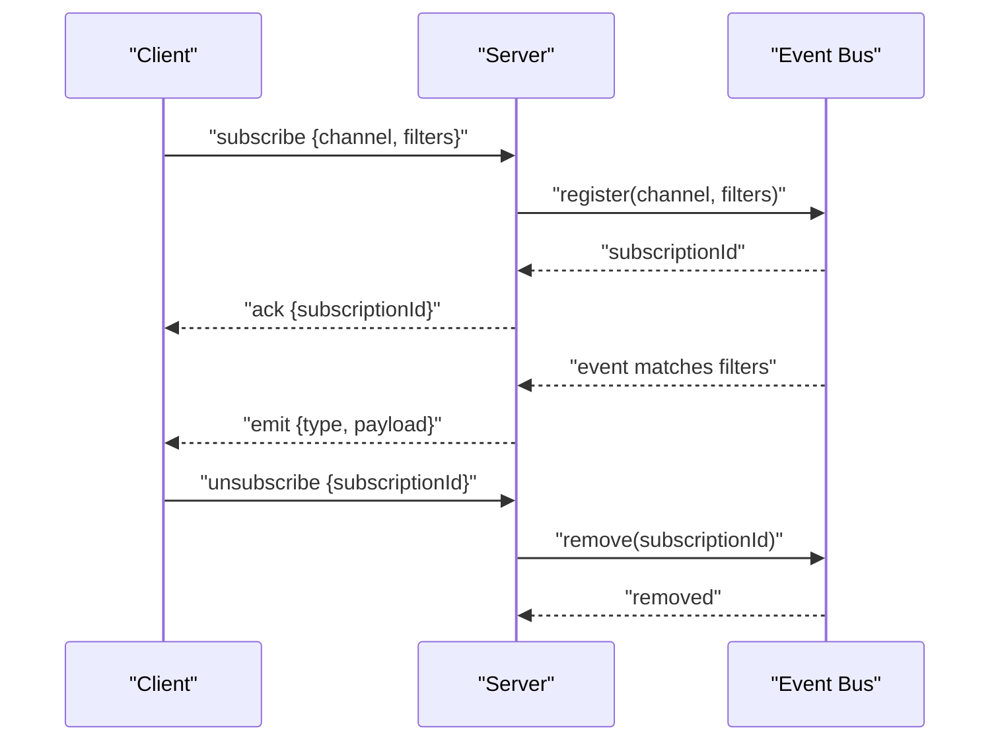
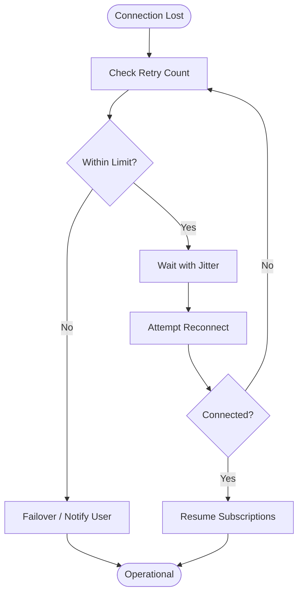
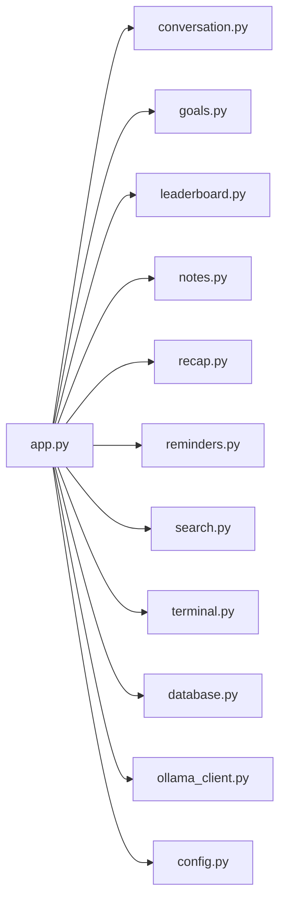

# WebSocket API

<cite>
**Referenced Files in This Document**
- [app.py](file://carrot/app.py)
- [main.py](file://carrot/main.py)
- [config.py](file://carrot/config.py)
- [conversation.py](file://carrot/conversation.py)
- [database.py](file://carrot/database.py)
- [goals.py](file://carrot/goals.py)
- [leaderboard.py](file://carrot/leaderboard.py)
- [notes.py](file://carrot/notes.py)
- [ollama_client.py](file://carrot/ollama_client.py)
- [recap.py](file://carrot/recap.py)
- [reminders.py](file://carrot/reminders.py)
- [search.py](file://carrot/search.py)
- [terminal.py](file://carrot/terminal.py)
- [index.html](file://carrot/web/index.html)
- [app.js](file://carrot/web/js/app.js)
- [search.js](file://carrot/web/js/search.js)
</cite>

## Table of Contents
1. [Introduction](#introduction)
2. [Project Structure](#project-structure)
3. [Core Components](#core-components)
4. [Architecture Overview](#architecture-overview)
5. [Detailed Component Analysis](#detailed-component-analysis)
6. [Dependency Analysis](#dependency-analysis)
7. [Performance Considerations](#performance-considerations)
8. [Troubleshooting Guide](#troubleshooting-guide)
9. [Conclusion](#conclusion)
10. [Appendices](#appendices)

## Introduction
This document provides a comprehensive guide to the WebSocket-based real-time communication layer within the project. It explains how clients establish connections, the message formats exchanged, event types and subscription patterns, state management on both client and server sides, bidirectional streaming, error handling, reconnection strategies, security considerations, and performance optimization techniques. The goal is to enable developers to implement robust, secure, and efficient real-time features using the provided APIs.

## Project Structure
The real-time functionality spans both backend and frontend components:
- Backend: Python modules that expose endpoints, manage sessions, handle events, and integrate with external services.
- Frontend: HTML and JavaScript files that connect to the WebSocket endpoint, subscribe to events, and render updates.

**Diagram sources**
- [main.py:1-200](file://carrot/main.py#L1-L200)
- [app.py:1-400](file://carrot/app.py#L1-L400)
- [config.py:1-150](file://carrot/config.py#L1-L150)
- [conversation.py:1-200](file://carrot/conversation.py#L1-L200)
- [database.py:1-200](file://carrot/database.py#L1-L200)
- [ollama_client.py:1-200](file://carrot/ollama_client.py#L1-L200)
- [goals.py:1-200](file://carrot/goals.py#L1-L200)
- [leaderboard.py:1-200](file://carrot/leaderboard.py#L1-L200)
- [notes.py:1-200](file://carrot/notes.py#L1-L200)
- [recap.py:1-200](file://carrot/recap.py#L1-L200)
- [reminders.py:1-200](file://carrot/reminders.py#L1-L200)
- [search.py:1-200](file://carrot/search.py#L1-L200)
- [terminal.py:1-200](file://carrot/terminal.py#L1-L200)
- [index.html:1-200](file://carrot/web/index.html#L1-L200)
- [app.js:1-200](file://carrot/web/js/app.js#L1-L200)
- [search.js:1-200](file://carrot/web/js/search.js#L1-L200)

**Section sources**
- [main.py:1-200](file://carrot/main.py#L1-L200)
- [app.py:1-400](file://carrot/app.py#L1-L400)
- [config.py:1-150](file://carrot/config.py#L1-L150)
- [index.html:1-200](file://carrot/web/index.html#L1-L200)
- [app.js:1-200](file://carrot/web/js/app.js#L1-L200)
- [search.js:1-200](file://carrot/web/js/search.js#L1-L200)

## Core Components
- WebSocket Server and Routing: Centralized handler for connection lifecycle, authentication, authorization, and message dispatching.
- Event Bus and State Store: In-memory or persistent store for session state, room membership, and event subscriptions.
- Domain Modules: Feature-specific handlers (e.g., conversation, goals, leaderboard, notes, recap, reminders, search, terminal).
- External Integrations: LLM client and database layer used by domain modules to process requests and persist data.
- Frontend Clients: Browser-based JavaScript modules that connect to the WebSocket endpoint, subscribe to channels, and render updates.

Key responsibilities:
- Connection establishment and handshake
- Authentication and authorization checks
- Message parsing, validation, and routing
- Event emission and broadcasting
- Error propagation and graceful degradation
- Reconnection and backoff strategies

**Section sources**
- [app.py:1-400](file://carrot/app.py#L1-L400)
- [conversation.py:1-200](file://carrot/conversation.py#L1-L200)
- [database.py:1-200](file://carrot/database.py#L1-L200)
- [ollama_client.py:1-200](file://carrot/ollama_client.py#L1-L200)
- [app.js:1-200](file://carrot/web/js/app.js#L1-L200)
- [search.js:1-200](file://carrot/web/js/search.js#L1-L200)

## Architecture Overview
The WebSocket architecture follows a layered design:
- Transport Layer: WebSocket protocol for bidirectional communication.
- Protocol Layer: JSON-based message schema with typed fields for actions, payloads, and metadata.
- Service Layer: Domain modules implementing business logic.
- Data Layer: Database and external service integrations.
- Client Layer: Browser-based JavaScript applications managing connection lifecycle and UI updates.

**Diagram sources**
- [app.py:1-400](file://carrot/app.py#L1-L400)
- [conversation.py:1-200](file://carrot/conversation.py#L1-L200)
- [database.py:1-200](file://carrot/database.py#L1-L200)
- [app.js:1-200](file://carrot/web/js/app.js#L1-L200)

## Detailed Component Analysis

### WebSocket Server and Routing
Responsibilities:
- Accepts WebSocket connections and performs handshake.
- Validates credentials and assigns session identifiers.
- Parses incoming messages and routes them to appropriate handlers.
- Manages subscriptions and broadcasts events to subscribers.
- Handles errors and sends standardized error responses.

Connection lifecycle:
- On connect: validate token, create session, register channel listeners.
- On message: parse, validate, route, execute handler, emit events.
- On disconnect: cleanup session, unsubscribe channels, release resources.

**Diagram sources**
- [app.py:1-400](file://carrot/app.py#L1-L400)

**Section sources**
- [app.py:1-400](file://carrot/app.py#L1-L400)

### Message Formats and Serialization
Message schema:
- type: string indicating action or event category.
- payload: object containing action-specific parameters.
- meta: optional metadata such as correlationId, timestamp, userId, roomId.

Common actions:
- subscribe: join a channel with optional filters.
- unsubscribe: leave a channel.
- publish: send an event to a channel.
- query: request data from a domain module.
- ack: acknowledge receipt of a message.

Event types:
- status: connection or session status changes.
- update: incremental data updates.
- error: error notifications with code and message.
- result: response to a query or command.

Serialization guidelines:
- Use JSON for all messages.
- Ensure idempotency via correlationId where applicable.
- Include timestamps for ordering and debugging.
- Validate payloads against expected schemas before processing.

**Section sources**
- [app.js:1-200](file://carrot/web/js/app.js#L1-L200)
- [search.js:1-200](file://carrot/web/js/search.js#L1-L200)

### Event Subscription Patterns
Subscription model:
- Clients subscribe to named channels (e.g., conversations, goals, leaderboard).
- Filters can be applied to narrow down events (e.g., by userId or roomId).
- Multiple subscriptions per client are supported; each has a unique subscriptionId.

Lifecycle:
- Subscribe: client sends subscribe action with channel and filters.
- Active: server acknowledges and starts emitting matching events.
- Update: client can modify filters dynamically.
- Unsubscribe: client removes subscription; server stops emitting.

**Diagram sources**
- [app.py:1-400](file://carrot/app.py#L1-L400)
- [app.js:1-200](file://carrot/web/js/app.js#L1-L200)

**Section sources**
- [app.py:1-400](file://carrot/app.py#L1-L400)
- [app.js:1-200](file://carrot/web/js/app.js#L1-L200)

### Bidirectional Data Streaming
Streaming patterns:
- Server-to-client: continuous updates via event streams (e.g., live leaderboards, chat messages).
- Client-to-server: incremental commands or partial payloads (e.g., typing indicators, progress updates).
- Backpressure: clients should throttle high-frequency events; servers may drop or batch events under load.

Implementation tips:
- Use batching for frequent updates to reduce overhead.
- Implement sequence numbers to detect missing messages.
- Provide pause/resume mechanisms for slow consumers.

**Section sources**
- [app.py:1-400](file://carrot/app.py#L1-L400)
- [app.js:1-200](file://carrot/web/js/app.js#L1-L200)

### Error Handling and Reconnection Strategies
Error handling:
- Standardize error codes and messages across all endpoints.
- Distinguish between transient and permanent errors.
- Log detailed context for debugging while preserving privacy.

Reconnection strategy:
- Exponential backoff with jitter to avoid thundering herd.
- Max retry attempts and timeout thresholds.
- Graceful degradation when reconnecting fails.

**Diagram sources**
- [app.js:1-200](file://carrot/web/js/app.js#L1-L200)

**Section sources**
- [app.js:1-200](file://carrot/web/js/app.js#L1-L200)

### Security Considerations
- Authentication: enforce token-based auth during handshake; reject unauthenticated connections.
- Authorization: validate user permissions per channel and action.
- Input validation: sanitize and validate all payloads; reject malformed messages.
- Rate limiting: protect against abuse and ensure fair usage.
- TLS: require secure connections in production environments.
- Secrets management: store tokens and keys securely; rotate regularly.

**Section sources**
- [app.py:1-400](file://carrot/app.py#L1-L400)
- [config.py:1-150](file://carrot/config.py#L1-L150)

### Performance Optimization
- Connection pooling: reuse connections where possible.
- Message compression: enable gzip or similar for large payloads.
- Batching: aggregate multiple events into single messages.
- Caching: cache frequently accessed data to reduce latency.
- Asynchronous processing: offload heavy tasks to background workers.
- Monitoring: track metrics like latency, throughput, and error rates.

**Section sources**
- [app.py:1-400](file://carrot/app.py#L1-L400)
- [database.py:1-200](file://carrot/database.py#L1-L200)

## Dependency Analysis
The WebSocket server depends on several modules for domain logic and data access. Understanding these dependencies helps identify potential bottlenecks and failure points.

**Diagram sources**
- [app.py:1-400](file://carrot/app.py#L1-L400)
- [conversation.py:1-200](file://carrot/conversation.py#L1-L200)
- [goals.py:1-200](file://carrot/goals.py#L1-L200)
- [leaderboard.py:1-200](file://carrot/leaderboard.py#L1-L200)
- [notes.py:1-200](file://carrot/notes.py#L1-L200)
- [recap.py:1-200](file://carrot/recap.py#L1-L200)
- [reminders.py:1-200](file://carrot/reminders.py#L1-L200)
- [search.py:1-200](file://carrot/search.py#L1-L200)
- [terminal.py:1-200](file://carrot/terminal.py#L1-L200)
- [database.py:1-200](file://carrot/database.py#L1-L200)
- [ollama_client.py:1-200](file://carrot/ollama_client.py#L1-L200)
- [config.py:1-150](file://carrot/config.py#L1-L150)

**Section sources**
- [app.py:1-400](file://carrot/app.py#L1-L400)

## Performance Considerations
- Monitor WebSocket connection counts and memory usage.
- Profile message processing paths to identify hotspots.
- Use asynchronous I/O for database and external service calls.
- Implement circuit breakers for failing dependencies.
- Scale horizontally by distributing connections across instances.

[No sources needed since this section provides general guidance]

## Troubleshooting Guide
Common issues:
- Connection failures: check network connectivity, firewall rules, and TLS configuration.
- Authentication errors: verify token validity and expiration policies.
- Message parsing errors: inspect payload structure and schema compliance.
- High latency: analyze network conditions and server load.
- Memory leaks: monitor resource usage and clean up unused sessions.

Debugging steps:
- Enable verbose logging for WebSocket events.
- Capture and replay problematic messages.
- Use tracing tools to follow message flows.
- Validate client-side reconnection logic.

**Section sources**
- [app.py:1-400](file://carrot/app.py#L1-L400)
- [app.js:1-200](file://carrot/web/js/app.js#L1-L200)

## Conclusion
This documentation outlines the WebSocket API’s architecture, message formats, event patterns, and operational best practices. By following the guidelines for connection management, error handling, security, and performance, developers can build reliable real-time features that scale effectively.

[No sources needed since this section summarizes without analyzing specific files]

## Appendices

### Client Implementation Examples
- Establishing a connection: initialize WebSocket with endpoint URL and options.
- Subscribing to channels: send subscribe action with channel name and filters.
- Publishing events: send publish action with payload and metadata.
- Handling events: register callbacks for different event types.
- Managing reconnections: implement exponential backoff and retry logic.

**Section sources**
- [app.js:1-200](file://carrot/web/js/app.js#L1-L200)
- [search.js:1-200](file://carrot/web/js/search.js#L1-L200)

### Message Schema Reference
- type: string enum of allowed actions/events.
- payload: object with required fields per action.
- meta: optional fields including correlationId, timestamp, userId, roomId.

**Section sources**
- [app.js:1-200](file://carrot/web/js/app.js#L1-L200)

### Configuration Options
- WebSocket endpoint URL
- Authentication token source
- Reconnection settings (max retries, backoff multiplier)
- Logging level and output destination

**Section sources**
- [config.py:1-150](file://carrot/config.py#L1-L150)