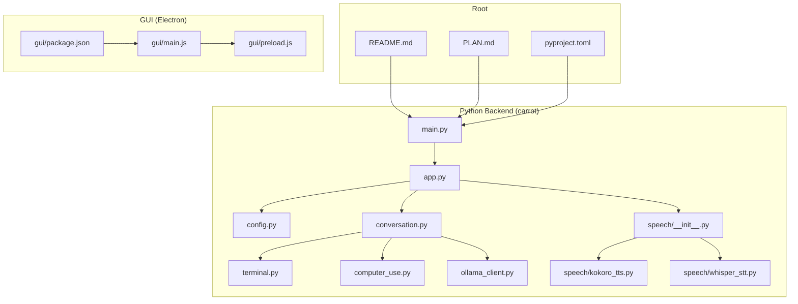
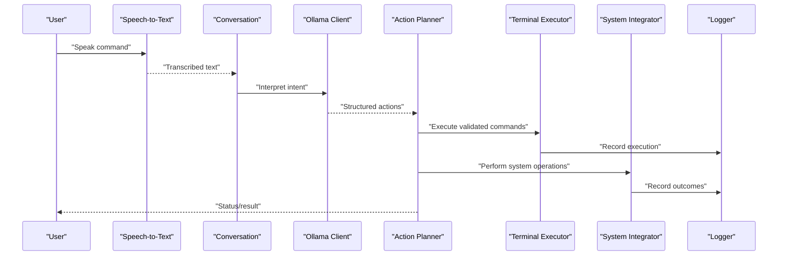
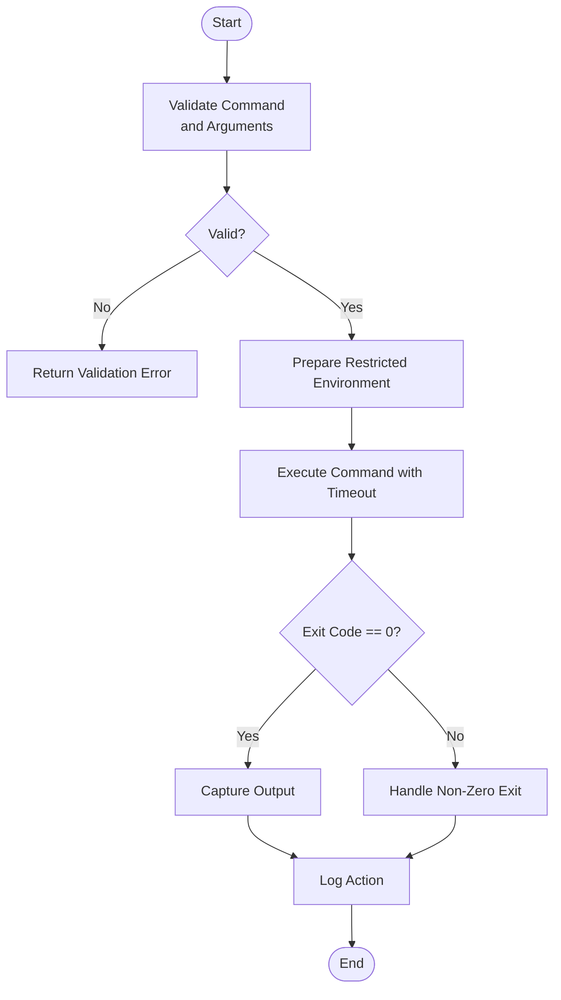
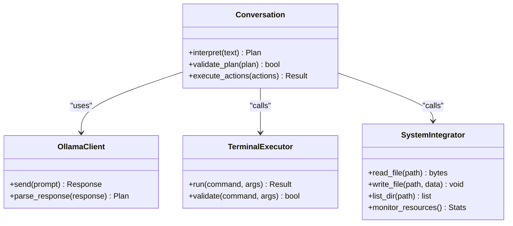
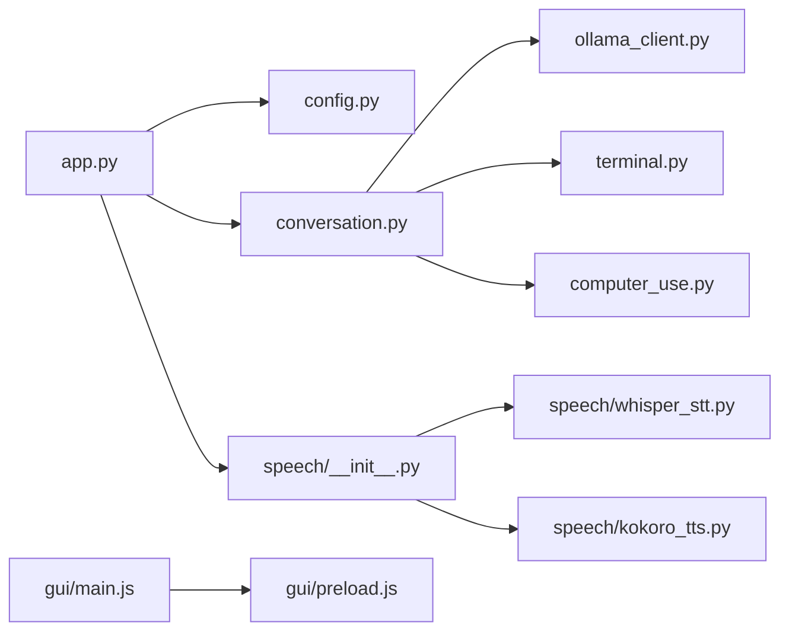

# Computer Automation

<cite>
**Referenced Files in This Document**
- [README.md](file://README.md)
- [PLAN.md](file://PLAN.md)
- [pyproject.toml](file://pyproject.toml)
- [carrot/main.py](file://carrot/main.py)
- [carrot/app.py](file://carrot/app.py)
- [carrot/config.py](file://carrot/config.py)
- [carrot/terminal.py](file://carrot/terminal.py)
- [carrot/computer_use.py](file://carrot/computer_use.py)
- [carrot/conversation.py](file://carrot/conversation.py)
- [carrot/ollama_client.py](file://carrot/ollama_client.py)
- [carrot/speech/__init__.py](file://carrot/speech/__init__.py)
- [carrot/speech/kokoro_tts.py](file://carrot/speech/kokoro_tts.py)
- [carrot/speech/whisper_stt.py](file://carrot/speech/whisper_stt.py)
- [gui/main.js](file://gui/main.js)
- [gui/preload.js](file://gui/preload.js)
- [gui/package.json](file://gui/package.json)
</cite>

## Table of Contents
1. [Introduction](#introduction)
2. [Project Structure](#project-structure)
3. [Core Components](#core-components)
4. [Architecture Overview](#architecture-overview)
5. [Detailed Component Analysis](#detailed-component-analysis)
6. [Dependency Analysis](#dependency-analysis)
7. [Performance Considerations](#performance-considerations)
8. [Troubleshooting Guide](#troubleshooting-guide)
9. [Conclusion](#conclusion)
10. [Appendices](#appendices)

## Introduction
This document explains the computer automation capabilities of the project, focusing on terminal command execution, file system operations, and system integration features. It covers how natural language commands are bridged to system-level operations, including security considerations, command validation, safe execution environments, permission management, error handling, and logging. It also provides examples for automating common desktop tasks, monitoring system resources, and interacting with external applications.

## Project Structure
The repository is organized into a Python backend (carrot), an Electron-based GUI (gui), and configuration/build files at the root. The automation surface spans:
- A Python application layer that orchestrates conversation, speech, and system integrations.
- A terminal module for executing shell commands safely.
- An Ollama client for connecting to local LLMs to interpret natural language into actions.
- A GUI layer that can expose overlays or controls for automation workflows.

**Diagram sources**
- [README.md](file://README.md)
- [PLAN.md](file://PLAN.md)
- [pyproject.toml](file://pyproject.toml)
- [carrot/main.py](file://carrot/main.py)
- [carrot/app.py](file://carrot/app.py)
- [carrot/config.py](file://carrot/config.py)
- [carrot/terminal.py](file://carrot/terminal.py)
- [carrot/computer_use.py](file://carrot/computer_use.py)
- [carrot/conversation.py](file://carrot/conversation.py)
- [carrot/ollama_client.py](file://carrot/ollama_client.py)
- [carrot/speech/__init__.py](file://carrot/speech/__init__.py)
- [carrot/speech/kokoro_tts.py](file://carrot/speech/kokoro_tts.py)
- [carrot/speech/whisper_stt.py](file://carrot/speech/whisper_stt.py)
- [gui/main.js](file://gui/main.js)
- [gui/preload.js](file://gui/preload.js)
- [gui/package.json](file://gui/package.json)

**Section sources**
- [README.md](file://README.md)
- [PLAN.md](file://PLAN.md)
- [pyproject.toml](file://pyproject.toml)

## Core Components
- Terminal Execution: Provides safe execution of shell commands with validation and controlled environment settings.
- System Integration: Bridges high-level intents to OS-level operations via a dedicated module.
- Conversation Orchestration: Translates natural language into structured actions using an LLM client.
- Speech Pipeline: Converts speech to text and text back to speech for voice-driven automation.
- Configuration: Centralizes runtime settings such as allowed commands, paths, and feature flags.
- GUI Layer: Optional overlay/UI for user interaction and visibility into automation status.

Key responsibilities:
- Command validation and allowlisting to prevent unsafe operations.
- Controlled subprocess execution with timeouts and output capture.
- Logging of all automated actions for auditability.
- Permission checks and least-privilege execution where possible.

**Section sources**
- [carrot/terminal.py](file://carrot/terminal.py)
- [carrot/computer_use.py](file://carrot/computer_use.py)
- [carrot/conversation.py](file://carrot/conversation.py)
- [carrot/ollama_client.py](file://carrot/ollama_client.py)
- [carrot/config.py](file://carrot/config.py)
- [carrot/speech/__init__.py](file://carrot/speech/__init__.py)
- [carrot/speech/kokoro_tts.py](file://carrot/speech/kokoro_tts.py)
- [carrot/speech/whisper_stt.py](file://carrot/speech/whisper_stt.py)

## Architecture Overview
The automation pipeline connects natural language input to system operations through a layered architecture:
- Input: User speaks or types a request.
- Conversion: STT converts speech to text; conversation module interprets intent.
- Planning: LLM client generates a plan or action list.
- Execution: Terminal and system integration modules execute validated commands safely.
- Feedback: Results are logged and optionally spoken back via TTS.

**Diagram sources**
- [carrot/speech/whisper_stt.py](file://carrot/speech/whisper_stt.py)
- [carrot/conversation.py](file://carrot/conversation.py)
- [carrot/ollama_client.py](file://carrot/ollama_client.py)
- [carrot/terminal.py](file://carrot/terminal.py)
- [carrot/computer_use.py](file://carrot/computer_use.py)

## Detailed Component Analysis

### Terminal Execution Module
Responsibilities:
- Validate commands against an allowlist or pattern rules.
- Execute commands in a controlled environment with timeouts and limited privileges.
- Capture stdout/stderr and return structured results.
- Log all executions with timestamps and outcomes.

Security and safety:
- Enforce allowlists for permitted commands and arguments.
- Sanitize inputs to prevent injection.
- Use restricted PATH and environment variables.
- Apply timeouts and resource limits.

Error handling:
- Distinguish between validation failures, execution errors, and timeouts.
- Provide actionable error messages and codes.

Logging:
- Record command, parameters, start/end time, exit code, and truncated outputs.

**Diagram sources**
- [carrot/terminal.py](file://carrot/terminal.py)

**Section sources**
- [carrot/terminal.py](file://carrot/terminal.py)

### System Integration Module
Responsibilities:
- Map high-level intents to OS operations (e.g., file manipulation, process control).
- Coordinate with terminal executor for shell-bound tasks.
- Expose functions for common desktop automation patterns.

Safety:
- Prefer read-only operations by default.
- Require explicit confirmation for destructive actions.
- Restrict access to sensitive directories.

Examples of supported operations:
- File system traversal and listing.
- Reading/writing files within allowed paths.
- Launching or querying processes.
- Monitoring system resources (CPU, memory, disk).

**Section sources**
- [carrot/computer_use.py](file://carrot/computer_use.py)

### Conversation and LLM Bridge
Responsibilities:
- Accept natural language prompts.
- Call the LLM client to generate structured plans.
- Translate plans into executable actions for terminal/system modules.

Integration points:
- Uses the Ollama client for local model inference.
- Produces deterministic action schemas for downstream execution.

**Diagram sources**
- [carrot/conversation.py](file://carrot/conversation.py)
- [carrot/ollama_client.py](file://carrot/ollama_client.py)
- [carrot/terminal.py](file://carrot/terminal.py)
- [carrot/computer_use.py](file://carrot/computer_use.py)

**Section sources**
- [carrot/conversation.py](file://carrot/conversation.py)
- [carrot/ollama_client.py](file://carrot/ollama_client.py)

### Speech Pipeline
Responsibilities:
- Convert speech to text using STT.
- Convert text responses back to speech using TTS.
- Manage audio I/O and buffering.

Components:
- STT module for transcription.
- TTS module for synthesis.
- Initialization and routing logic.

**Section sources**
- [carrot/speech/__init__.py](file://carrot/speech/__init__.py)
- [carrot/speech/whisper_stt.py](file://carrot/speech/whisper_stt.py)
- [carrot/speech/kokoro_tts.py](file://carrot/speech/kokoro_tts.py)

### Application Entry Points and Configuration
Responsibilities:
- Initialize subsystems (conversation, speech, terminal, system integrator).
- Load configuration from centralized config.
- Provide CLI or API entry points for automation tasks.

Configuration options:
- Allowed commands and patterns.
- Paths for file operations.
- Model endpoints and parameters.
- Logging verbosity and destinations.

**Section sources**
- [carrot/main.py](file://carrot/main.py)
- [carrot/app.py](file://carrot/app.py)
- [carrot/config.py](file://carrot/config.py)

### GUI Overlay and Interaction
Responsibilities:
- Provide an overlay UI for automation status and controls.
- Communicate with the Python backend via IPC or HTTP.
- Display logs and results to users.

**Section sources**
- [gui/main.js](file://gui/main.js)
- [gui/preload.js](file://gui/preload.js)
- [gui/package.json](file://gui/package.json)

## Dependency Analysis
High-level dependencies:
- Application depends on configuration, conversation orchestration, and speech modules.
- Conversation depends on the LLM client and execution modules.
- Terminal and system integrator depend on OS APIs and subprocess facilities.
- GUI depends on Electron runtime and communicates with backend services.

**Diagram sources**
- [carrot/app.py](file://carrot/app.py)
- [carrot/config.py](file://carrot/config.py)
- [carrot/conversation.py](file://carrot/conversation.py)
- [carrot/ollama_client.py](file://carrot/ollama_client.py)
- [carrot/terminal.py](file://carrot/terminal.py)
- [carrot/computer_use.py](file://carrot/computer_use.py)
- [carrot/speech/__init__.py](file://carrot/speech/__init__.py)
- [carrot/speech/whisper_stt.py](file://carrot/speech/whisper_stt.py)
- [carrot/speech/kokoro_tts.py](file://carrot/speech/kokoro_tts.py)
- [gui/main.js](file://gui/main.js)
- [gui/preload.js](file://gui/preload.js)

**Section sources**
- [carrot/app.py](file://carrot/app.py)
- [carrot/config.py](file://carrot/config.py)
- [carrot/conversation.py](file://carrot/conversation.py)
- [carrot/ollama_client.py](file://carrot/ollama_client.py)
- [carrot/terminal.py](file://carrot/terminal.py)
- [carrot/computer_use.py](file://carrot/computer_use.py)
- [carrot/speech/__init__.py](file://carrot/speech/__init__.py)
- [carrot/speech/whisper_stt.py](file://carrot/speech/whisper_stt.py)
- [carrot/speech/kokoro_tts.py](file://carrot/speech/kokoro_tts.py)
- [gui/main.js](file://gui/main.js)
- [gui/preload.js](file://gui/preload.js)

## Performance Considerations
- Subprocess execution should use timeouts and non-blocking I/O where possible.
- Cache frequent read-only results (e.g., directory listings) to reduce overhead.
- Stream large outputs instead of loading entirely into memory.
- Limit concurrent executions to avoid resource contention.
- Use efficient models and prompt templates to minimize LLM latency.

[No sources needed since this section provides general guidance]

## Troubleshooting Guide
Common issues and resolutions:
- Command validation failures: Check allowlists and argument patterns; ensure sanitized inputs.
- Permission errors: Verify user privileges and path restrictions; adjust configurations carefully.
- Timeouts: Increase timeout thresholds or optimize commands; monitor system load.
- LLM parsing errors: Refine prompts and response formats; add robust parsers.
- Speech I/O problems: Confirm audio device availability and permissions; test STT/TTS independently.

Logging and diagnostics:
- Enable detailed logs for command execution and system calls.
- Inspect stderr and exit codes for failure reasons.
- Use structured log entries to trace end-to-end flows.

**Section sources**
- [carrot/terminal.py](file://carrot/terminal.py)
- [carrot/computer_use.py](file://carrot/computer_use.py)
- [carrot/conversation.py](file://carrot/conversation.py)
- [carrot/ollama_client.py](file://carrot/ollama_client.py)
- [carrot/speech/whisper_stt.py](file://carrot/speech/whisper_stt.py)
- [carrot/speech/kokoro_tts.py](file://carrot/speech/kokoro_tts.py)

## Conclusion
The automation system bridges natural language to safe, auditable system operations through a layered architecture. It emphasizes secure command execution, clear error handling, and comprehensive logging. By combining speech interfaces, LLM-driven planning, and controlled execution, it enables reliable automation of desktop tasks, resource monitoring, and external application interactions while maintaining strong security and performance characteristics.

[No sources needed since this section summarizes without analyzing specific files]

## Appendices

### Examples of Automated Tasks
- Automate common desktop tasks:
  - Open applications and navigate menus via keyboard/mouse simulation.
  - Batch rename files and organize directories based on naming rules.
  - Send notifications or emails triggered by events.
- Monitor system resources:
  - Track CPU, memory, and disk usage periodically.
  - Alert when thresholds are exceeded.
- Interact with external applications:
  - Query process states and terminate unresponsive apps.
  - Read/write configuration files safely within allowed paths.

[No sources needed since this section provides general guidance]

### Security and Permissions
- Allowlist critical commands and restrict dangerous operations.
- Run automation under least-privilege accounts.
- Validate and sanitize all inputs before execution.
- Use sandboxed environments for untrusted scripts.
- Audit logs regularly and rotate sensitive outputs.

[No sources needed since this section provides general guidance]