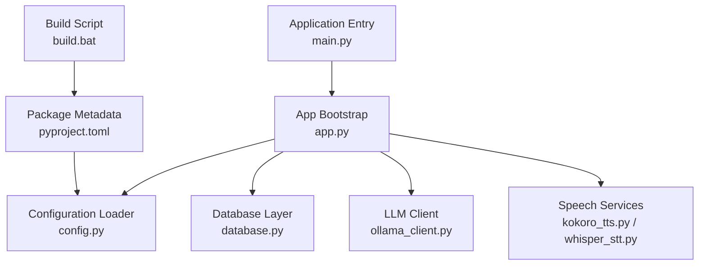
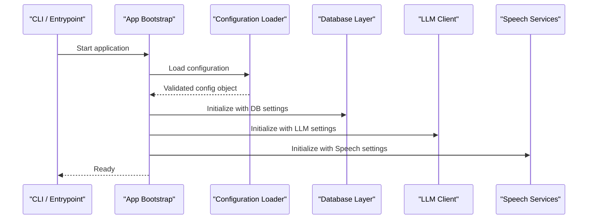
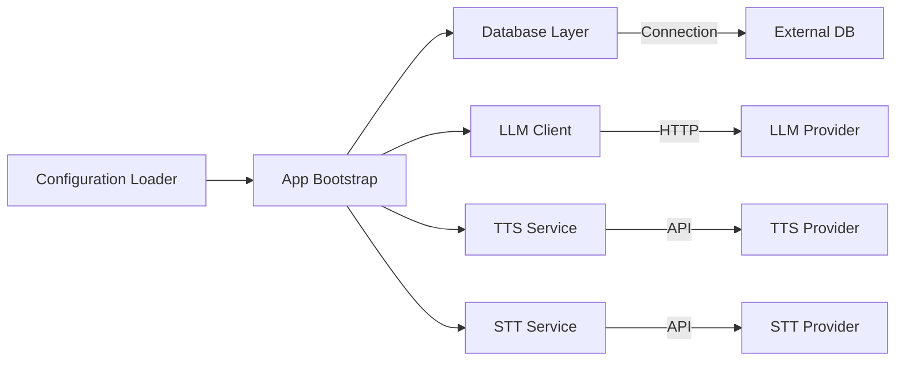

# Configuration

<cite>
**Referenced Files in This Document**
- [config.py](file://carrot/config.py)
- [app.py](file://carrot/app.py)
- [main.py](file://carrot/main.py)
- [pyproject.toml](file://pyproject.toml)
- [README.md](file://README.md)
- [build.bat](file://build.bat)
- [database.py](file://carrot/database.py)
- [ollama_client.py](file://carrot/ollama_client.py)
- [speech/kokoro_tts.py](file://carrot/speech/kokoro_tts.py)
- [speech/whisper_stt.py](file://carrot/speech/whisper_stt.py)
</cite>

## Table of Contents
1. [Introduction](#introduction)
2. [Project Structure](#project-structure)
3. [Core Components](#core-components)
4. [Architecture Overview](#architecture-overview)
5. [Detailed Component Analysis](#detailed-component-analysis)
6. [Dependency Analysis](#dependency-analysis)
7. [Performance Considerations](#performance-considerations)
8. [Troubleshooting Guide](#troubleshooting-guide)
9. [Conclusion](#conclusion)
10. [Appendices](#appendices)

## Introduction
This document provides comprehensive configuration guidance for the application, covering all settings, environment variables, and deployment options. It explains configuration file formats, default values, validation rules, and environment-specific setups for development, testing, and production. It also documents feature toggles, performance tuning parameters, security configurations, common scenarios, templates, automated deployment scripts, migration strategies, version compatibility, and troubleshooting steps.

## Project Structure
The project is a Python application with a web interface and optional GUI components. Configuration is primarily managed through a dedicated module and package metadata. Key areas include:
- Application entry points and runtime initialization
- Package-level configuration and dependency declarations
- Optional integrations (database, LLM client, speech services)
- Build and packaging scripts

**Diagram sources**
- [main.py](file://carrot/main.py)
- [app.py](file://carrot/app.py)
- [config.py](file://carrot/config.py)
- [database.py](file://carrot/database.py)
- [ollama_client.py](file://carrot/ollama_client.py)
- [speech/kokoro_tts.py](file://carrot/speech/kokoro_tts.py)
- [speech/whisper_stt.py](file://carrot/speech/whisper_stt.py)
- [pyproject.toml](file://pyproject.toml)
- [build.bat](file://build.bat)

**Section sources**
- [README.md](file://README.md)
- [pyproject.toml](file://pyproject.toml)
- [build.bat](file://build.bat)

## Core Components
This section outlines the core configuration components and their responsibilities:
- Configuration loader: centralizes reading and validating settings from environment variables and configuration files
- App bootstrap: initializes subsystems based on configuration
- Package metadata: declares dependencies and build options that influence runtime behavior
- Optional integrations: database, LLM client, and speech modules may require additional configuration keys

Key responsibilities:
- Provide defaults for all settings
- Validate required fields and types
- Support environment-specific overrides
- Expose configuration to other modules safely

**Section sources**
- [config.py](file://carrot/config.py)
- [app.py](file://carrot/app.py)
- [pyproject.toml](file://pyproject.toml)

## Architecture Overview
The configuration architecture follows a layered approach:
- Environment variables take precedence over configuration files
- Defaults are applied when values are missing or invalid
- Subsystems read configuration at startup and cache it for runtime use

**Diagram sources**
- [app.py](file://carrot/app.py)
- [config.py](file://carrot/config.py)
- [database.py](file://carrot/database.py)
- [ollama_client.py](file://carrot/ollama_client.py)
- [speech/kokoro_tts.py](file://carrot/speech/kokoro_tts.py)
- [speech/whisper_stt.py](file://carrot/speech/whisper_stt.py)

## Detailed Component Analysis

### Configuration Loader
Responsibilities:
- Define all configuration keys and defaults
- Parse environment variables and merge with file-based settings
- Validate types, ranges, and required fields
- Provide a stable API for other modules to access settings

Common categories:
- General application settings (e.g., logging level, debug mode)
- Feature toggles (e.g., enabling/disabling optional features)
- Performance tuning (e.g., concurrency limits, timeouts)
- Security (e.g., secrets management, CORS, auth flags)
- Integration-specific settings (database, LLM, speech)

Validation rules:
- Required keys must be present unless explicitly optional
- Numeric values must fall within acceptable ranges
- Boolean flags must be parseable from strings
- Secrets must not be logged or exposed in error messages

**Section sources**
- [config.py](file://carrot/config.py)

### App Bootstrap
Responsibilities:
- Load configuration once at startup
- Initialize subsystems using validated configuration
- Handle graceful errors during initialization
- Expose configuration to request handlers and background tasks

Initialization order:
- Load configuration
- Configure logging
- Initialize database connection pool
- Initialize LLM client
- Initialize speech services (if enabled)
- Start web server or GUI

Error handling:
- Fail fast on critical misconfiguration
- Log detailed but safe error messages
- Provide fallbacks where appropriate

**Section sources**
- [app.py](file://carrot/app.py)

### Database Layer
Configuration aspects:
- Connection string or host/port/database credentials
- Pool size and timeout settings
- Migration flags and schema versioning
- Read replicas or secondary connections (if applicable)

Security considerations:
- Use environment variables for secrets
- Avoid logging sensitive data
- Enforce TLS where supported

**Section sources**
- [database.py](file://carrot/database.py)

### LLM Client
Configuration aspects:
- Endpoint URL and authentication tokens
- Model selection and temperature/top-p settings
- Request/response timeouts and retries
- Rate limiting and quota controls

Feature toggles:
- Enable/disable specific models or providers
- Toggle streaming responses
- Enable caching of prompts/responses

**Section sources**
- [ollama_client.py](file://carrot/ollama_client.py)

### Speech Services
Text-to-Speech (TTS):
- Provider selection and model names
- Voice preferences and output format
- Concurrency limits and buffer sizes

Speech-to-Text (STT):
- Provider selection and model names
- Audio input format and sampling rate
- Language detection and transcription options

Feature toggles:
- Enable/disable TTS/STT features
- Select alternative providers per feature

**Section sources**
- [speech/kokoro_tts.py](file://carrot/speech/kokoro_tts.py)
- [speech/whisper_stt.py](file://carrot/speech/whisper_stt.py)

### Package Metadata and Build
Configuration aspects:
- Dependency versions and constraints
- Build targets and artifacts
- Environment markers for platform-specific installs

Deployment implications:
- Pinning dependencies ensures reproducibility
- Build scripts may set environment variables for compilation

**Section sources**
- [pyproject.toml](file://pyproject.toml)
- [build.bat](file://build.bat)

## Dependency Analysis
Configuration affects multiple subsystems. Misconfiguration in one area can cascade into failures elsewhere.

**Diagram sources**
- [config.py](file://carrot/config.py)
- [app.py](file://carrot/app.py)
- [database.py](file://carrot/database.py)
- [ollama_client.py](file://carrot/ollama_client.py)
- [speech/kokoro_tts.py](file://carrot/speech/kokoro_tts.py)
- [speech/whisper_stt.py](file://carrot/speech/whisper_stt.py)

**Section sources**
- [config.py](file://carrot/config.py)
- [app.py](file://carrot/app.py)

## Performance Considerations
Recommended tuning parameters:
- Database pool size: adjust based on workload and connection limits
- Timeouts: set reasonable request/response timeouts to avoid hangs
- Concurrency: limit parallel requests to prevent resource exhaustion
- Caching: enable response caching for repeated queries
- Logging: reduce verbosity in production to minimize I/O overhead

Best practices:
- Profile under realistic load before scaling
- Monitor key metrics (latency, throughput, error rates)
- Use connection pooling and keep-alive where supported
- Avoid synchronous blocking calls in hot paths

[No sources needed since this section provides general guidance]

## Troubleshooting Guide
Common issues and resolutions:
- Missing environment variables: ensure all required keys are set; check precedence rules
- Invalid configuration values: validate types and ranges; review error logs
- Connection failures: verify network reachability and credentials; check TLS settings
- Feature not working: confirm feature toggle is enabled; inspect provider endpoints
- Performance degradation: tune concurrency and timeouts; monitor resource usage

Debugging steps:
- Enable verbose logging temporarily
- Dump configuration (without secrets) for inspection
- Test connectivity to external services independently
- Roll back recent configuration changes incrementally

**Section sources**
- [config.py](file://carrot/config.py)
- [app.py](file://carrot/app.py)

## Conclusion
This configuration guide consolidates all settings, environment variables, and deployment options needed to run the application reliably across environments. By following the validation rules, security practices, and performance recommendations outlined here, you can maintain a robust and scalable deployment.

[No sources needed since this section summarizes without analyzing specific files]

## Appendices

### Environment-Specific Setups
- Development: enable debug mode, verbose logging, local providers, minimal security checks
- Testing: isolate data stores, mock external services, deterministic seeds
- Production: enforce strict validation, enable TLS, restrict permissions, monitor extensively

### Common Configuration Scenarios
- Single-node deployment with local database and LLM
- Multi-node deployment with shared database and remote LLM provider
- Feature-flagged rollout of new capabilities

### Template Files
- Example environment variable template
- Sample configuration file structure
- Minimal viable configuration for quick start

### Automated Deployment Scripts
- CI/CD pipeline configuration
- Containerization instructions
- Health checks and readiness probes

### Configuration Migration and Version Compatibility
- Backward-compatible changes
- Deprecation policy and migration guides
- Schema versioning and rollback strategies

[No sources needed since this section provides general guidance]