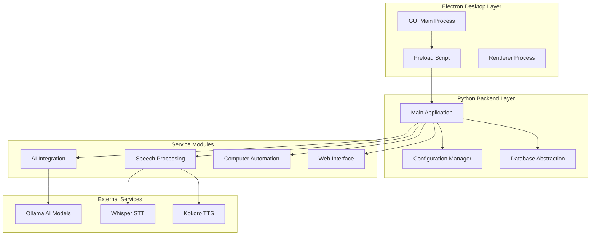
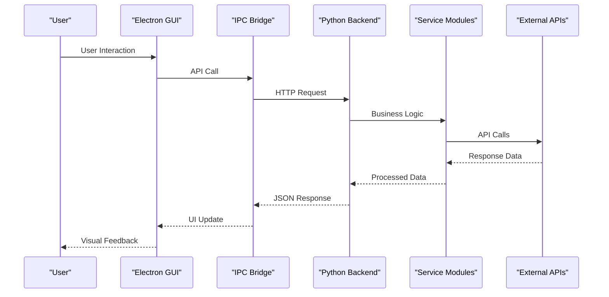
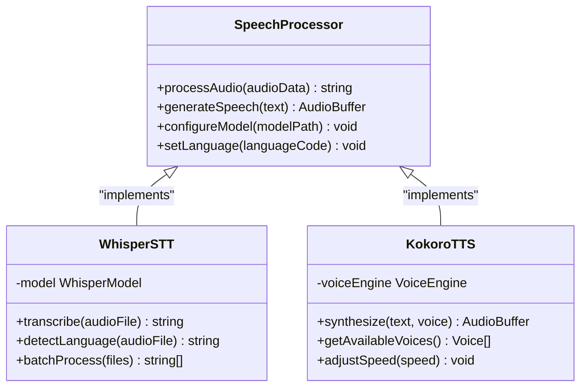
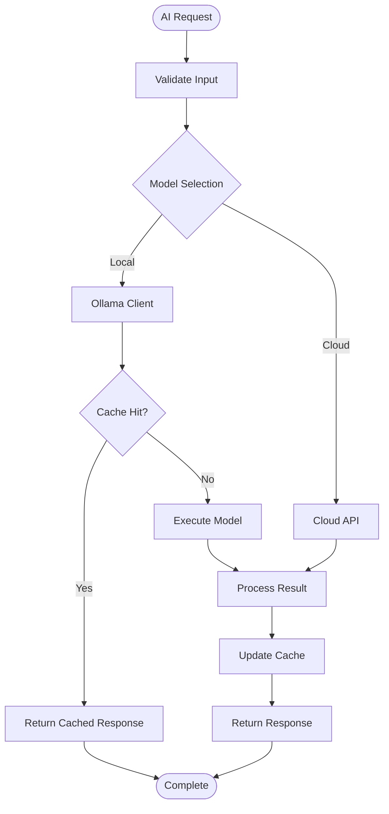
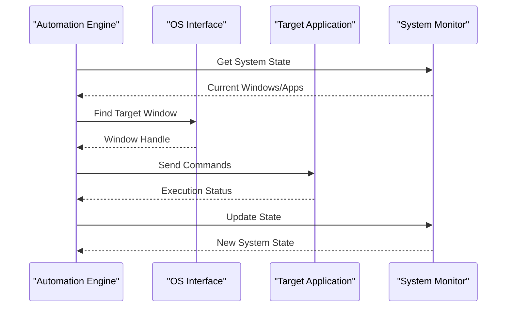
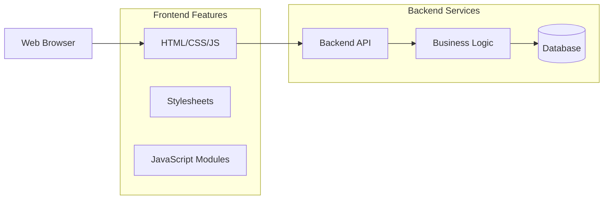
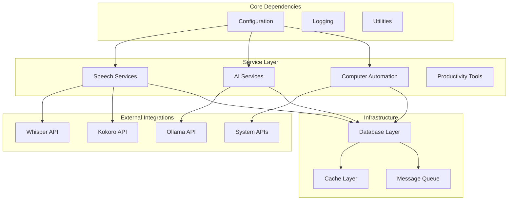
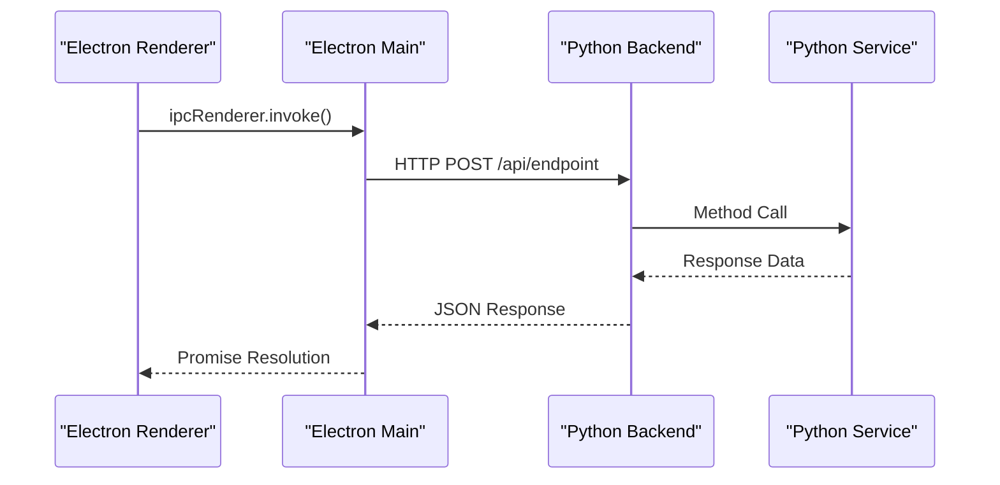

# Core Architecture

<cite>
**Referenced Files in This Document**
- [carrot/main.py](file://carrot/main.py)
- [carrot/app.py](file://carrot/app.py)
- [carrot/config.py](file://carrot/config.py)
- [carrot/database.py](file://carrot/database.py)
- [carrot/speech/kokoro_tts.py](file://carrot/speech/kokoro_tts.py)
- [carrot/speech/whisper_stt.py](file://carrot/speech/whisper_stt.py)
- [carrot/ollama_client.py](file://carrot/ollama_client.py)
- [carrot/computer_use.py](file://carrot/computer_use.py)
- [gui/main.js](file://gui/main.js)
- [gui/preload.js](file://gui/preload.js)
- [gui/package.json](file://gui/package.json)
- [pyproject.toml](file://pyproject.toml)
</cite>

## Table of Contents
1. [Introduction](#introduction)
2. [Project Structure](#project-structure)
3. [Core Components](#core-components)
4. [Architecture Overview](#architecture-overview)
5. [Detailed Component Analysis](#detailed-component-analysis)
6. [Dependency Analysis](#dependency-analysis)
7. [Performance Considerations](#performance-considerations)
8. [Troubleshooting Guide](#troubleshooting-guide)
9. [Conclusion](#conclusion)

## Introduction

The Carrot application is a comprehensive desktop productivity tool that combines speech processing, AI integration, computer automation, and web-based interfaces into a unified Electron desktop application. The system follows a service-oriented architecture with clear separation of concerns across multiple domains including speech-to-text (STT), text-to-speech (TTS), AI model integration, and computer automation capabilities.

The application leverages modern technologies including Python for backend services, JavaScript/TypeScript for the Electron frontend, and various AI models for intelligent features. The architecture emphasizes modularity, scalability, and maintainability while providing a seamless user experience across different interaction modalities.

## Project Structure

The Carrot application follows a modular architecture with distinct layers:

**Diagram sources**
- [gui/main.js:1-50](file://gui/main.js#L1-L50)
- [carrot/app.py:1-100](file://carrot/app.py#L1-L100)
- [carrot/config.py:1-50](file://carrot/config.py#L1-L50)

**Section sources**
- [carrot/main.py:1-50](file://carrot/main.py#L1-L50)
- [gui/main.js:1-100](file://gui/main.js#L1-L100)
- [pyproject.toml:1-50](file://pyproject.toml#L1-L50)

## Core Components

### Application Entry Points

The application has two primary entry points:

1. **Electron Desktop Application**: The main Electron process that manages the desktop interface and communicates with the Python backend
2. **Python Backend Service**: The core application logic that handles business operations, data management, and external integrations

### Configuration Management

The configuration system provides centralized management of application settings, environment variables, and feature flags. It supports both development and production environments with appropriate defaults and validation.

### Database Abstraction

A unified database layer abstracts data persistence operations, supporting multiple storage backends and providing consistent APIs for data access across all modules.

**Section sources**
- [carrot/config.py:1-100](file://carrot/config.py#L1-L100)
- [carrot/database.py:1-150](file://carrot/database.py#L1-L150)

## Architecture Overview

The Carrot application implements a layered architecture with clear separation between presentation, business logic, and data access layers:

**Diagram sources**
- [gui/preload.js:1-100](file://gui/preload.js#L1-L100)
- [carrot/app.py:1-200](file://carrot/app.py#L1-L200)

### Technology Stack Decisions

The technology stack was chosen to balance performance, developer productivity, and maintainability:

- **Electron**: Cross-platform desktop application framework with native OS integration
- **Python**: Rich ecosystem for AI/ML integration and rapid prototyping
- **JavaScript/TypeScript**: Modern web technologies for responsive UI
- **SQLite**: Lightweight embedded database for local data persistence
- **REST APIs**: Standardized communication between Electron and Python processes

**Section sources**
- [gui/package.json:1-100](file://gui/package.json#L1-L100)
- [pyproject.toml:1-100](file://pyproject.toml#L1-L100)

## Detailed Component Analysis

### Speech Processing Module

The speech processing module handles both speech-to-text (STT) and text-to-speech (TTS) functionality through specialized implementations:

**Diagram sources**
- [carrot/speech/whisper_stt.py:1-100](file://carrot/speech/whisper_stt.py#L1-L100)
- [carrot/speech/kokoro_tts.py:1-100](file://carrot/speech/kokoro_tts.py#L1-L100)

### AI Integration Layer

The AI integration component provides abstraction over various AI models and services, primarily focusing on Ollama integration for local AI model execution:

**Diagram sources**
- [carrot/ollama_client.py:1-150](file://carrot/ollama_client.py#L1-L150)

### Computer Automation System

The computer automation module provides cross-platform system control capabilities including window management, input simulation, and application automation:

**Diagram sources**
- [carrot/computer_use.py:1-200](file://carrot/computer_use.py#L1-L200)

### Web Interface Layer

The web interface provides a browser-based alternative to the Electron desktop application, sharing the same backend API:

**Diagram sources**
- [carrot/web/index.html:1-50](file://carrot/web/index.html#L1-L50)
- [carrot/web/js/app.js:1-100](file://carrot/web/js/app.js#L1-L100)

**Section sources**
- [carrot/speech/whisper_stt.py:1-100](file://carrot/speech/whisper_stt.py#L1-L100)
- [carrot/speech/kokoro_tts.py:1-100](file://carrot/speech/kokoro_tts.py#L1-L100)
- [carrot/ollama_client.py:1-150](file://carrot/ollama_client.py#L1-L150)
- [carrot/computer_use.py:1-200](file://carrot/computer_use.py#L1-L200)

## Dependency Analysis

The application maintains clear dependency boundaries and follows inversion of control principles:

**Diagram sources**
- [carrot/config.py:1-100](file://carrot/config.py#L1-L100)
- [carrot/database.py:1-150](file://carrot/database.py#L1-L150)

### Inter-Process Communication

The Electron-Python communication uses a combination of HTTP REST APIs and IPC channels:

**Diagram sources**
- [gui/preload.js:1-100](file://gui/preload.js#L1-L100)
- [carrot/app.py:1-200](file://carrot/app.py#L1-L200)

**Section sources**
- [gui/preload.js:1-100](file://gui/preload.js#L1-L100)
- [carrot/app.py:1-200](file://carrot/app.py#L1-L200)

## Performance Considerations

The architecture addresses several performance concerns:

### Caching Strategy
- LRU cache for frequently accessed data
- In-memory caching for AI model responses
- File system caching for processed audio files

### Resource Management
- Lazy loading of heavy dependencies
- Connection pooling for database operations
- Background task processing with worker threads

### Scalability Patterns
- Modular service design for horizontal scaling
- Asynchronous operation handling
- Memory-efficient data processing pipelines

## Troubleshooting Guide

### Common Issues and Solutions

**Connection Problems**
- Verify Python backend is running on correct port
- Check firewall settings for inter-process communication
- Validate configuration file paths and permissions

**Performance Issues**
- Monitor memory usage during AI model operations
- Check disk space for temporary file generation
- Review database query optimization

**Integration Failures**
- Validate external API credentials and endpoints
- Check network connectivity for cloud services
- Verify model file integrity and versions

**Section sources**
- [carrot/config.py:1-100](file://carrot/config.py#L1-L100)
- [carrot/database.py:1-150](file://carrot/database.py#L1-L150)

## Conclusion

The Carrot application demonstrates a well-architected approach to building a modern desktop productivity tool. The service-oriented design with clear separation of concerns enables maintainability and scalability while providing rich functionality across speech processing, AI integration, and computer automation domains.

Key architectural strengths include:
- Clear separation between presentation, business logic, and data layers
- Modular service design enabling independent development and testing
- Comprehensive abstraction over external dependencies
- Flexible configuration management supporting multiple deployment scenarios

The architecture balances performance, maintainability, and extensibility while providing a solid foundation for future enhancements and feature additions.