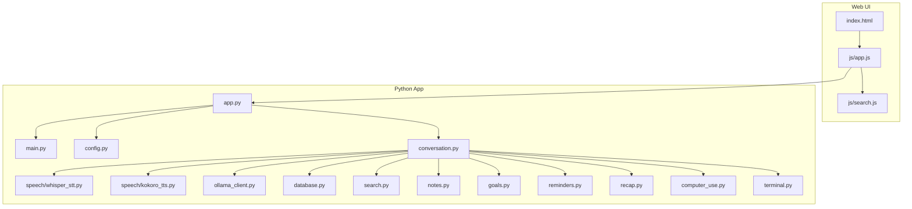
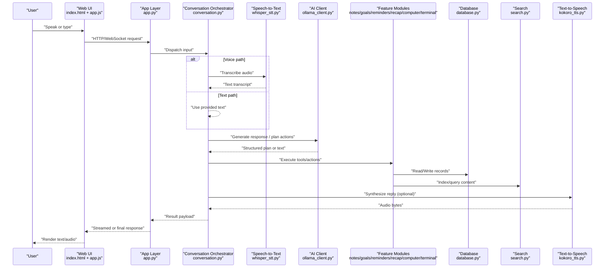
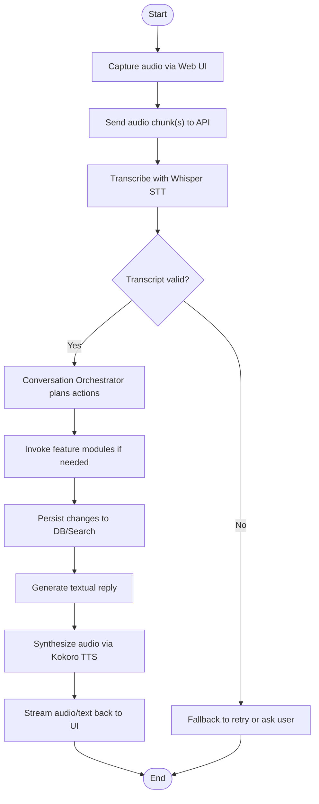
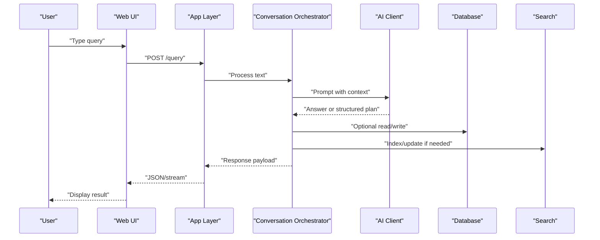
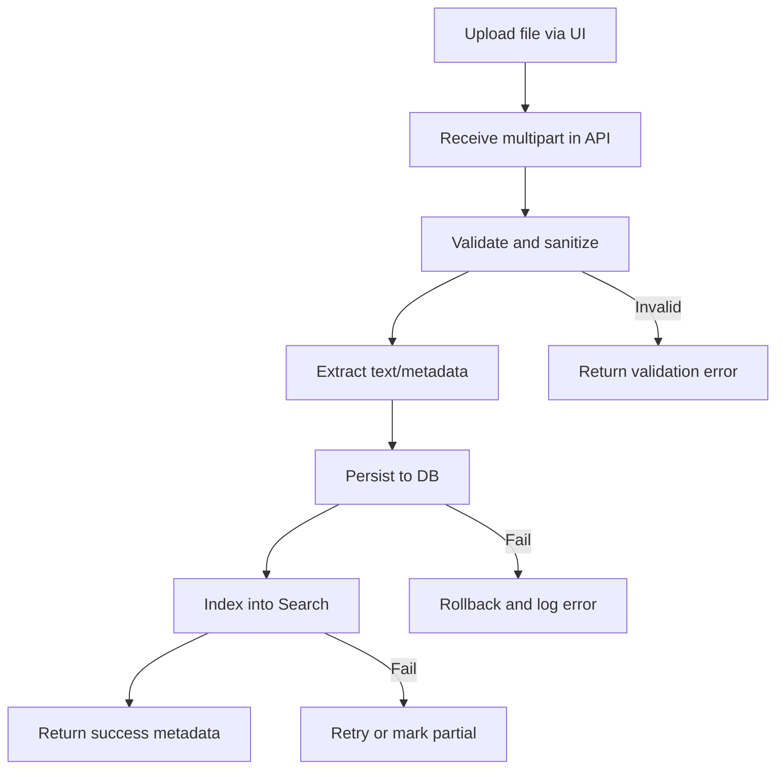
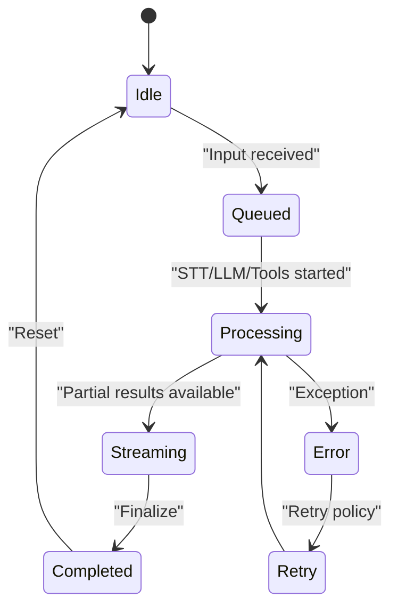
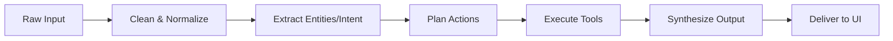
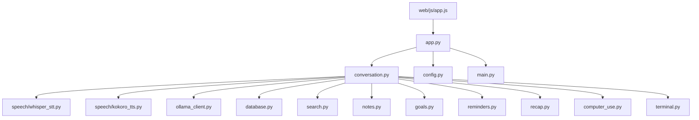

# Data Flow Patterns

<cite>
**Referenced Files in This Document**
- [app.py](file://carrot/app.py)
- [main.py](file://carrot/main.py)
- [config.py](file://carrot/config.py)
- [conversation.py](file://carrot/conversation.py)
- [speech/kokoro_tts.py](file://carrot/speech/kokoro_tts.py)
- [speech/whisper_stt.py](file://carrot/speech/whisper_stt.py)
- [ollama_client.py](file://carrot/ollama_client.py)
- [database.py](file://carrot/database.py)
- [search.py](file://carrot/search.py)
- [notes.py](file://carrot/notes.py)
- [goals.py](file://carrot/goals.py)
- [reminders.py](file://carrot/reminders.py)
- [recap.py](file://carrot/recap.py)
- [computer_use.py](file://carrot/computer_use.py)
- [terminal.py](file://carrot/terminal.py)
- [web/index.html](file://carrot/web/index.html)
- [web/js/app.js](file://carrot/web/js/app.js)
- [web/js/search.js](file://carrot/web/js/search.js)
</cite>

## Table of Contents
1. [Introduction](#introduction)
2. [Project Structure](#project-structure)
3. [Core Components](#core-components)
4. [Architecture Overview](#architecture-overview)
5. [Detailed Component Analysis](#detailed-component-analysis)
6. [Dependency Analysis](#dependency-analysis)
7. [Performance Considerations](#performance-considerations)
8. [Troubleshooting Guide](#troubleshooting-guide)
9. [Conclusion](#conclusion)
10. [Appendices](#appendices)

## Introduction
This document explains the data flow patterns in the Carrot application, focusing on how user input is transformed across speech recognition, AI processing, and response generation. It covers request/response cycles, event-driven communication, asynchronous operations, data transformation pipelines, caching strategies, and state management across layers. It also includes diagrams for common flows such as voice commands, text queries, and file operations, along with error propagation, logging patterns, and performance considerations.

## Project Structure
Carrot is a Python application with a web interface and modular features:
- Core runtime and configuration: app.py, main.py, config.py
- Conversation orchestration: conversation.py
- Speech pipeline: whisper_stt.py (STT), kokoro_tts.py (TTS)
- AI integration: ollama_client.py
- Persistence and search: database.py, search.py
- Feature modules: notes.py, goals.py, reminders.py, recap.py, computer_use.py, terminal.py
- Web UI: index.html, app.js, search.js

**Diagram sources**
- [app.py](file://carrot/app.py)
- [main.py](file://carrot/main.py)
- [config.py](file://carrot/config.py)
- [conversation.py](file://carrot/conversation.py)
- [speech/whisper_stt.py](file://carrot/speech/whisper_stt.py)
- [speech/kokoro_tts.py](file://carrot/speech/kokoro_tts.py)
- [ollama_client.py](file://carrot/ollama_client.py)
- [database.py](file://carrot/database.py)
- [search.py](file://carrot/search.py)
- [notes.py](file://carrot/notes.py)
- [goals.py](file://carrot/goals.py)
- [reminders.py](file://carrot/reminders.py)
- [recap.py](file://carrot/recap.py)
- [computer_use.py](file://carrot/computer_use.py)
- [terminal.py](file://carrot/terminal.py)
- [web/index.html](file://carrot/web/index.html)
- [web/js/app.js](file://carrot/web/js/app.js)
- [web/js/search.js](file://carrot/web/js/search.js)

**Section sources**
- [app.py](file://carrot/app.py)
- [main.py](file://carrot/main.py)
- [config.py](file://carrot/config.py)
- [conversation.py](file://carrot/conversation.py)
- [speech/whisper_stt.py](file://carrot/speech/whisper_stt.py)
- [speech/kokoro_tts.py](file://carrot/speech/kokoro_tts.py)
- [ollama_client.py](file://carrot/ollama_client.py)
- [database.py](file://carrot/database.py)
- [search.py](file://carrot/search.py)
- [notes.py](file://carrot/notes.py)
- [goals.py](file://carrot/goals.py)
- [reminders.py](file://carrot/reminders.py)
- [recap.py](file://carrot/recap.py)
- [computer_use.py](file://carrot/computer_use.py)
- [terminal.py](file://carrot/terminal.py)
- [web/index.html](file://carrot/web/index.html)
- [web/js/app.js](file://carrot/web/js/app.js)
- [web/js/search.js](file://carrot/web/js/search.js)

## Core Components
- Application entry and lifecycle: main.py initializes the process; app.py wires routes, middleware, and background tasks.
- Configuration: config.py centralizes settings used by all components.
- Conversation orchestrator: conversation.py coordinates STT, LLM calls, tool execution, persistence, and TTS output.
- Speech layer: whisper_stt.py transcribes audio to text; kokoro_tts.py synthesizes text to audio.
- AI client: ollama_client.py handles model requests and streaming responses.
- Persistence and retrieval: database.py manages storage; search.py provides indexing and querying.
- Feature modules: notes.py, goals.py, reminders.py, recap.py, computer_use.py, terminal.py implement domain-specific logic invoked by the conversation orchestrator.
- Web frontend: index.html, app.js, and search.js capture user input and render responses.

Key responsibilities and interactions are described in subsequent sections with concrete flow diagrams.

**Section sources**
- [main.py](file://carrot/main.py)
- [app.py](file://carrot/app.py)
- [config.py](file://carrot/config.py)
- [conversation.py](file://carrot/conversation.py)
- [speech/whisper_stt.py](file://carrot/speech/whisper_stt.py)
- [speech/kokoro_tts.py](file://carrot/speech/kokoro_tts.py)
- [ollama_client.py](file://carrot/ollama_client.py)
- [database.py](file://carrot/database.py)
- [search.py](file://carrot/search.py)
- [notes.py](file://carrot/notes.py)
- [goals.py](file://carrot/goals.py)
- [reminders.py](file://carrot/reminders.py)
- [recap.py](file://carrot/recap.py)
- [computer_use.py](file://carrot/computer_use.py)
- [terminal.py](file://carrot/terminal.py)
- [web/index.html](file://carrot/web/index.html)
- [web/js/app.js](file://carrot/web/js/app.js)
- [web/js/search.js](file://carrot/web/js/search.js)

## Architecture Overview
The system follows a layered architecture:
- Presentation: Web UI captures inputs and displays outputs.
- API/Runtime: Python app exposes endpoints and manages concurrency.
- Orchestration: Conversation module sequences steps based on intent.
- Services: STT/TTS, AI client, persistence, search, and feature modules.
- Storage: Database and search indexes.

**Diagram sources**
- [web/index.html](file://carrot/web/index.html)
- [web/js/app.js](file://carrot/web/js/app.js)
- [app.py](file://carrot/app.py)
- [conversation.py](file://carrot/conversation.py)
- [speech/whisper_stt.py](file://carrot/speech/whisper_stt.py)
- [ollama_client.py](file://carrot/ollama_client.py)
- [notes.py](file://carrot/notes.py)
- [goals.py](file://carrot/goals.py)
- [reminders.py](file://carrot/reminders.py)
- [recap.py](file://carrot/recap.py)
- [computer_use.py](file://carrot/computer_use.py)
- [terminal.py](file://carrot/terminal.py)
- [database.py](file://carrot/database.py)
- [search.py](file://carrot/search.py)
- [speech/kokoro_tts.py](file://carrot/speech/kokoro_tts.py)

## Detailed Component Analysis

### Voice Command Flow
End-to-end flow from microphone capture to synthesized response.

**Diagram sources**
- [web/js/app.js](file://carrot/web/js/app.js)
- [app.py](file://carrot/app.py)
- [speech/whisper_stt.py](file://carrot/speech/whisper_stt.py)
- [conversation.py](file://carrot/conversation.py)
- [notes.py](file://carrot/notes.py)
- [goals.py](file://carrot/goals.py)
- [reminders.py](file://carrot/reminders.py)
- [recap.py](file://carrot/recap.py)
- [computer_use.py](file://carrot/computer_use.py)
- [terminal.py](file://carrot/terminal.py)
- [database.py](file://carrot/database.py)
- [search.py](file://carrot/search.py)
- [speech/kokoro_tts.py](file://carrot/speech/kokoro_tts.py)

**Section sources**
- [web/js/app.js](file://carrot/web/js/app.js)
- [app.py](file://carrot/app.py)
- [speech/whisper_stt.py](file://carrot/speech/whisper_stt.py)
- [conversation.py](file://carrot/conversation.py)
- [speech/kokoro_tts.py](file://carrot/speech/kokoro_tts.py)

### Text Query Flow
Straightforward path from typed input to AI-generated answer and optional persistence.

**Diagram sources**
- [web/js/app.js](file://carrot/web/js/app.js)
- [app.py](file://carrot/app.py)
- [conversation.py](file://carrot/conversation.py)
- [ollama_client.py](file://carrot/ollama_client.py)
- [database.py](file://carrot/database.py)
- [search.py](file://carrot/search.py)

**Section sources**
- [web/js/app.js](file://carrot/web/js/app.js)
- [app.py](file://carrot/app.py)
- [conversation.py](file://carrot/conversation.py)
- [ollama_client.py](file://carrot/ollama_client.py)
- [database.py](file://carrot/database.py)
- [search.py](file://carrot/search.py)

### File Operations Flow
Handling uploads, parsing, indexing, and searchability.

**Diagram sources**
- [web/js/app.js](file://carrot/web/js/app.js)
- [app.py](file://carrot/app.py)
- [database.py](file://carrot/database.py)
- [search.py](file://carrot/search.py)

**Section sources**
- [web/js/app.js](file://carrot/web/js/app.js)
- [app.py](file://carrot/app.py)
- [database.py](file://carrot/database.py)
- [search.py](file://carrot/search.py)

### Event-Driven Communication
Background tasks and real-time updates can be modeled as events:
- Input received -> STT queued -> LLM scheduled -> Tool execution -> TTS synthesis -> UI update.
- Use queues or async channels to decouple stages and enable retries and progress reporting.

[No sources needed since this diagram shows conceptual workflow, not actual code structure]

### Data Transformation Pipelines
- STT pipeline: raw audio -> normalized frames -> transcription -> cleaned text.
- LLM pipeline: prompt assembly -> model call -> structured extraction -> action planning.
- Tool pipeline: parsed intent -> parameter binding -> side effects -> result normalization.
- TTS pipeline: text normalization -> phoneme mapping -> audio synthesis.

[No sources needed since this diagram shows conceptual workflow, not actual code structure]

### Caching Strategies
- Prompt caching: cache frequent prompts and embeddings to reduce latency.
- Result caching: memoize expensive tool outputs keyed by inputs.
- Index caching: keep search index warm with incremental updates.
- Session state: maintain short-lived conversation context to avoid reprocessing.

[No sources needed since this section provides general guidance]

### State Management Across Layers
- UI state: input buffers, playback controls, message history.
- API state: request context, rate limits, timeouts.
- Orchestrator state: conversation turns, pending tasks, tool results.
- Service state: model clients, connection pools, caches.
- Persistence state: transactions, indexes, consistency markers.

[No sources needed since this section provides general guidance]

## Dependency Analysis
High-level dependencies between modules:

**Diagram sources**
- [app.py](file://carrot/app.py)
- [conversation.py](file://carrot/conversation.py)
- [speech/whisper_stt.py](file://carrot/speech/whisper_stt.py)
- [speech/kokoro_tts.py](file://carrot/speech/kokoro_tts.py)
- [ollama_client.py](file://carrot/ollama_client.py)
- [database.py](file://carrot/database.py)
- [search.py](file://carrot/search.py)
- [notes.py](file://carrot/notes.py)
- [goals.py](file://carrot/goals.py)
- [reminders.py](file://carrot/reminders.py)
- [recap.py](file://carrot/recap.py)
- [computer_use.py](file://carrot/computer_use.py)
- [terminal.py](file://carrot/terminal.py)
- [config.py](file://carrot/config.py)
- [main.py](file://carrot/main.py)
- [web/js/app.js](file://carrot/web/js/app.js)

**Section sources**
- [app.py](file://carrot/app.py)
- [conversation.py](file://carrot/conversation.py)
- [speech/whisper_stt.py](file://carrot/speech/whisper_stt.py)
- [speech/kokoro_tts.py](file://carrot/speech/kokoro_tts.py)
- [ollama_client.py](file://carrot/ollama_client.py)
- [database.py](file://carrot/database.py)
- [search.py](file://carrot/search.py)
- [notes.py](file://carrot/notes.py)
- [goals.py](file://carrot/goals.py)
- [reminders.py](file://carrot/reminders.py)
- [recap.py](file://carrot/recap.py)
- [computer_use.py](file://carrot/computer_use.py)
- [terminal.py](file://carrot/terminal.py)
- [config.py](file://carrot/config.py)
- [main.py](file://carrot/main.py)
- [web/js/app.js](file://carrot/web/js/app.js)

## Performance Considerations
- Asynchronous processing: run STT, LLM calls, and tool executions concurrently where safe.
- Streaming responses: send partial results to UI to improve perceived latency.
- Batch operations: group writes to DB and search index updates.
- Resource limits: enforce timeouts and memory caps for large audio/files.
- Caching: reuse embeddings, prompts, and tool outputs when inputs match.
- Backpressure: queue heavy workloads and signal progress to the UI.

[No sources needed since this section provides general guidance]

## Troubleshooting Guide
Common issues and diagnostics:
- STT failures: check audio quality, sample rates, and network connectivity; retry with fallback models.
- LLM errors: handle timeouts, rate limits, and malformed responses; implement retries and circuit breakers.
- Tool exceptions: validate parameters, isolate side effects, and rollback on failure.
- DB/Search inconsistencies: verify transactions and index rebuilds; use checksums for integrity.
- Logging: ensure structured logs at each stage with correlation IDs for tracing.

**Section sources**
- [speech/whisper_stt.py](file://carrot/speech/whisper_stt.py)
- [ollama_client.py](file://carrot/ollama_client.py)
- [database.py](file://carrot/database.py)
- [search.py](file://carrot/search.py)

## Conclusion
Carrot’s data flows integrate speech, AI, and domain tools through a clear orchestration layer. By applying asynchronous processing, streaming, caching, and robust error handling, the system delivers responsive and reliable experiences across voice, text, and file workflows.

[No sources needed since this section summarizes without analyzing specific files]

## Appendices
- Glossary: STT (speech-to-text), TTS (text-to-speech), LLM (large language model).
- References: See referenced files for implementation details.

[No sources needed since this section provides general guidance]