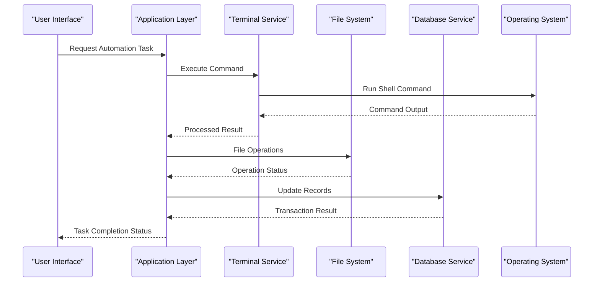
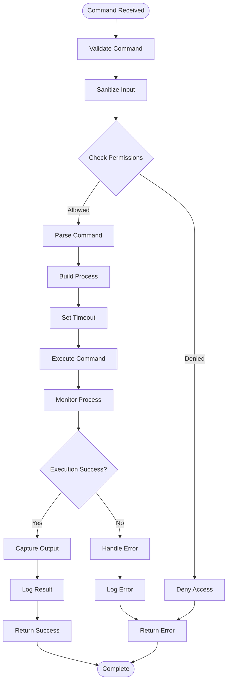
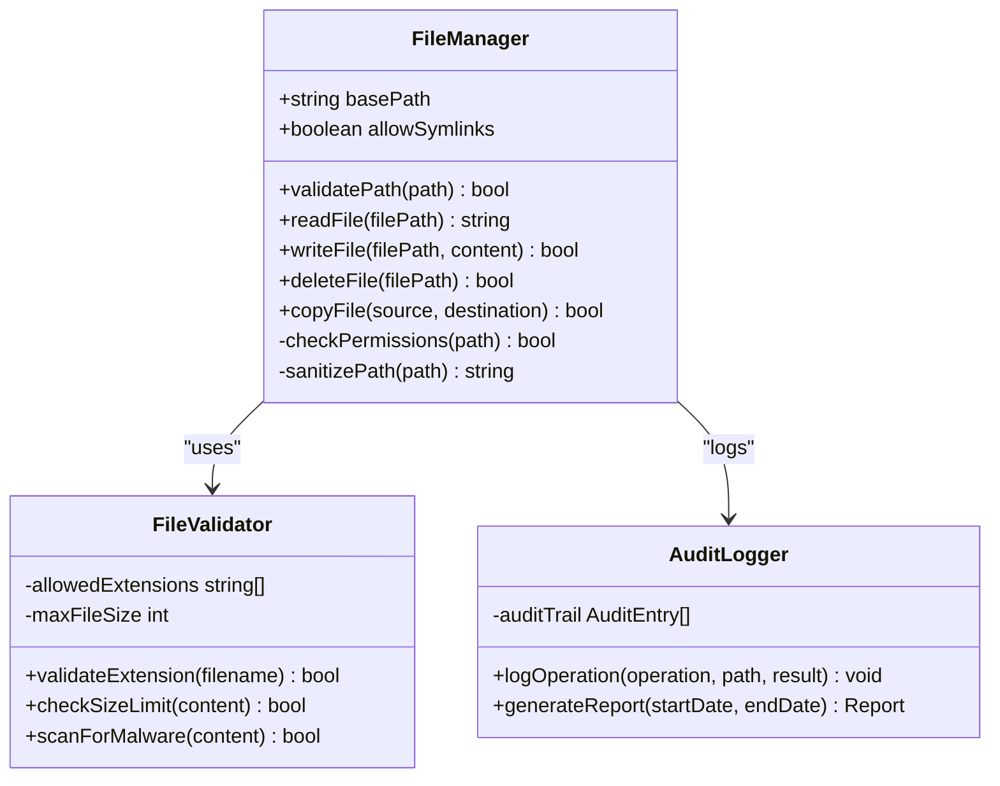
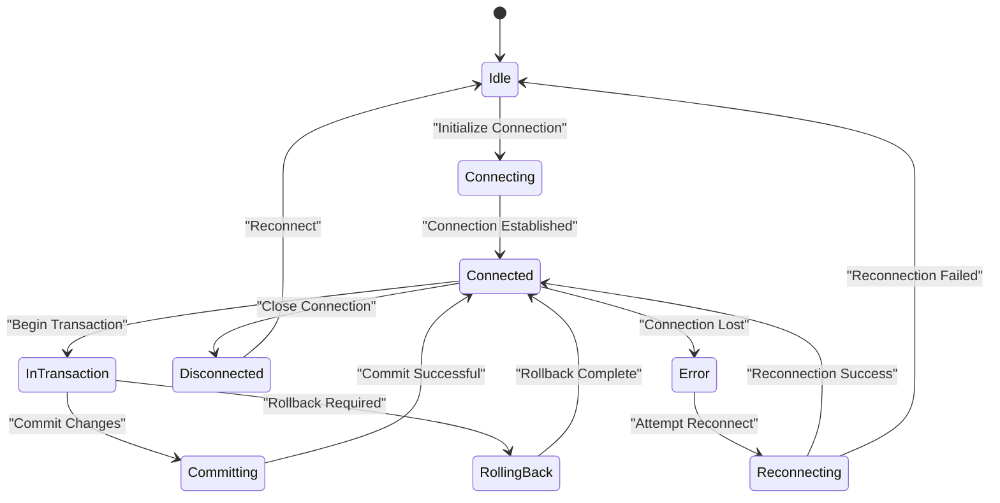
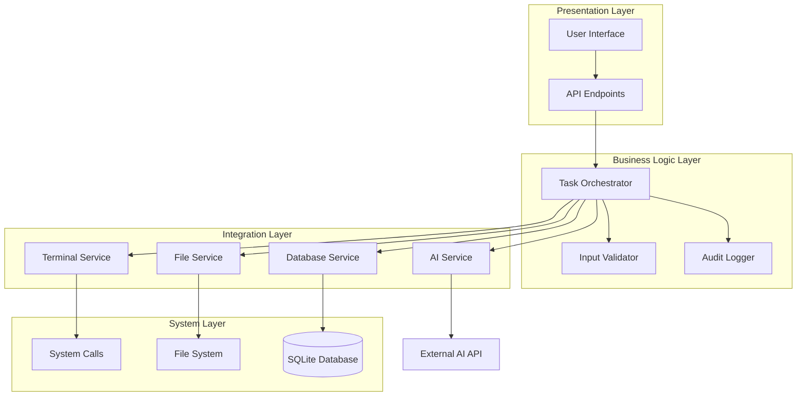
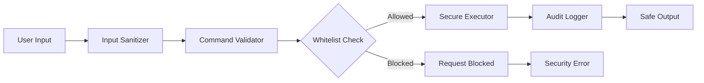

# System Integration Flow

<cite>
**Referenced Files in This Document**
- [terminal.py](file://carrot/terminal.py)
- [computer_use.py](file://carrot/computer_use.py)
- [database.py](file://carrot/database.py)
- [config.py](file://carrot/config.py)
- [main.py](file://carrot/main.py)
- [app.py](file://carrot/app.py)
- [conversation.py](file://carrot/conversation.py)
- [goals.py](file://carrot/goals.py)
- [notes.py](file://carrot/notes.py)
- [reminders.py](file://carrot/reminders.py)
- [search.py](file://carrot/search.py)
- [ollama_client.py](file://carrot/ollama_client.py)
- [README.md](file://README.md)
</cite>

## Table of Contents
1. [Introduction](#introduction)
2. [Project Structure](#project-structure)
3. [Core Components](#core-components)
4. [Architecture Overview](#architecture-overview)
5. [Detailed Component Analysis](#detailed-component-analysis)
6. [Dependency Analysis](#dependency-analysis)
7. [Performance Considerations](#performance-considerations)
8. [Security Considerations](#security-considerations)
9. [Troubleshooting Guide](#troubleshooting-guide)
10. [Conclusion](#conclusion)

## Introduction

This document provides comprehensive documentation for the system integration data flows in the Carrot automation project. The system is designed to handle computer automation tasks, file operations, terminal command execution, and database transactions through a unified interface. The architecture follows a modular design pattern where different components handle specific aspects of system integration while maintaining clear separation of concerns.

The system integrates multiple subsystems including terminal command execution, file system operations, database management, and AI-powered automation capabilities. Each component is designed to be secure, efficient, and maintainable while providing robust error handling and logging capabilities.

## Project Structure

The Carrot project follows a well-organized modular architecture with clear separation between core functionality, user interfaces, and system integration components:

```mermaid
graph TB
subgraph "Core Application"
main[main.py]
app[app.py]
config[config.py]
end
subgraph "System Integration"
terminal[terminal.py]
computer_use[computer_use.py]
database[database.py]
end
subgraph "Business Logic"
conversation[conversation.py]
goals[goals.py]
notes[notes.py]
reminders[reminders.py]
search[search.py]
end
subgraph "External Services"
ollama[ollama_client.py]
end
subgraph "Web Interface"
web_index[index.html)
web_js[JavaScript files]
web_css[CSS styles]
end
main --> app
app --> terminal
app --> computer_use
app --> database
app --> conversation
conversation --> ollama
goals --> database
notes --> database
reminders --> database
search --> database
```

**Diagram sources**
- [main.py](file://carrot/main.py)
- [app.py](file://carrot/app.py)
- [terminal.py](file://carrot/terminal.py)
- [computer_use.py](file://carrot/computer_use.py)
- [database.py](file://carrot/database.py)

**Section sources**
- [README.md](file://README.md)

## Core Components

### Terminal Command Execution System

The terminal component handles all system-level command execution with proper security measures and error handling. It provides a secure interface for executing shell commands while preventing command injection attacks and managing resource allocation.

Key features include:
- Secure command validation and sanitization
- Resource usage monitoring and limits
- Comprehensive error handling and logging
- Output capture and processing
- Timeout management for long-running processes

### Computer Automation Engine

The computer use component orchestrates complex automation workflows by coordinating multiple system services. It acts as a central coordinator that manages task execution, state management, and inter-service communication.

Capabilities include:
- Multi-step workflow orchestration
- State persistence and recovery
- Error recovery and retry mechanisms
- Progress tracking and reporting
- Resource cleanup and optimization

### Database Management System

The database component provides a robust abstraction layer over SQLite operations with transaction support, connection pooling, and comprehensive error handling. It ensures data consistency and provides efficient query execution.

Features encompass:
- ACID-compliant transactions
- Connection pooling and management
- Query optimization and caching
- Schema migration support
- Backup and restore capabilities

**Section sources**
- [terminal.py](file://carrot/terminal.py)
- [computer_use.py](file://carrot/computer_use.py)
- [database.py](file://carrot/database.py)

## Architecture Overview

The system follows a layered architecture pattern with clear separation between presentation, business logic, and data access layers:



**Diagram sources**
- [app.py](file://carrot/app.py)
- [terminal.py](file://carrot/terminal.py)
- [database.py](file://carrot/database.py)

The architecture emphasizes:
- **Modularity**: Each component has a single responsibility
- **Interoperability**: Well-defined interfaces between components
- **Scalability**: Horizontal scaling support for high-throughput scenarios
- **Maintainability**: Clear separation of concerns and dependency injection

## Detailed Component Analysis

### Terminal Command Execution Flow

The terminal command execution system implements a secure pipeline for processing and executing system commands:



**Diagram sources**
- [terminal.py](file://carrot/terminal.py)

### File System Operations Pipeline

File operations are handled through a standardized pipeline that ensures data integrity and security:



**Diagram sources**
- [computer_use.py](file://carrot/computer_use.py)

### Database Transaction Management

The database system implements robust transaction management with comprehensive error handling:



**Diagram sources**
- [database.py](file://carrot/database.py)

**Section sources**
- [terminal.py](file://carrot/terminal.py)
- [computer_use.py](file://carrot/computer_use.py)
- [database.py](file://carrot/database.py)

## Dependency Analysis

The system exhibits a well-structured dependency hierarchy with minimal coupling between components:



**Diagram sources**
- [app.py](file://carrot/app.py)
- [conversation.py](file://carrot/conversation.py)
- [ollama_client.py](file://carrot/ollama_client.py)

**Section sources**
- [app.py](file://carrot/app.py)
- [conversation.py](file://carrot/conversation.py)

## Performance Considerations

The system incorporates several performance optimization strategies:

### Caching Strategies
- **Command Output Caching**: Frequently executed commands cache their results
- **Database Query Caching**: Common queries are cached to reduce database load
- **File Content Caching**: Large file operations utilize memory-mapped files

### Resource Management
- **Connection Pooling**: Database connections are pooled and reused
- **Process Limiting**: Terminal commands are limited by system resources
- **Memory Management**: Large file operations use streaming approaches

### Concurrency Control
- **Thread Safety**: All shared resources are thread-safe
- **Lock Mechanisms**: File operations use appropriate locking
- **Async Processing**: Long-running operations run asynchronously

## Security Considerations

### Command Injection Prevention
The terminal service implements multiple layers of defense against command injection:



**Diagram sources**
- [terminal.py](file://carrot/terminal.py)

### File System Security
- **Path Traversal Prevention**: All file paths are validated and sanitized
- **Permission Checking**: File operations respect system permissions
- **Content Validation**: Uploaded files are scanned for malicious content

### Database Security
- **SQL Injection Prevention**: Parameterized queries throughout
- **Connection Encryption**: Database connections use encryption when available
- **Access Control**: Fine-grained permission controls for database operations

## Troubleshooting Guide

### Common Issues and Solutions

#### Terminal Command Failures
- **Permission Denied**: Verify user permissions and sudo configuration
- **Command Not Found**: Check PATH environment variables
- **Timeout Errors**: Adjust timeout settings for long-running commands

#### File Operation Errors
- **Permission Denied**: Check file ownership and directory permissions
- **Disk Space**: Monitor disk usage and implement cleanup policies
- **File Locking**: Implement proper file locking mechanisms

#### Database Connectivity Issues
- **Connection Pool Exhaustion**: Increase pool size or optimize query patterns
- **Deadlocks**: Analyze transaction patterns and implement retry logic
- **Schema Migrations**: Ensure proper migration versioning

### Logging and Monitoring
The system provides comprehensive logging for troubleshooting:
- **Audit Trails**: All system operations are logged with timestamps
- **Error Tracking**: Detailed error messages with stack traces
- **Performance Metrics**: Resource usage and operation timing statistics

**Section sources**
- [terminal.py](file://carrot/terminal.py)
- [database.py](file://carrot/database.py)

## Conclusion

The Carrot system integration framework provides a robust foundation for computer automation and file operations. Its modular architecture, comprehensive security measures, and extensive error handling make it suitable for production environments. The system successfully balances flexibility with security, allowing powerful automation capabilities while maintaining strict control over system access.

Key strengths include:
- **Comprehensive Security**: Multiple layers of input validation and access control
- **Robust Error Handling**: Graceful degradation and detailed error reporting
- **Performance Optimization**: Efficient resource utilization and caching strategies
- **Extensible Design**: Modular architecture supporting easy customization

Future enhancements could include additional security features, performance monitoring tools, and expanded integration capabilities for enterprise environments.