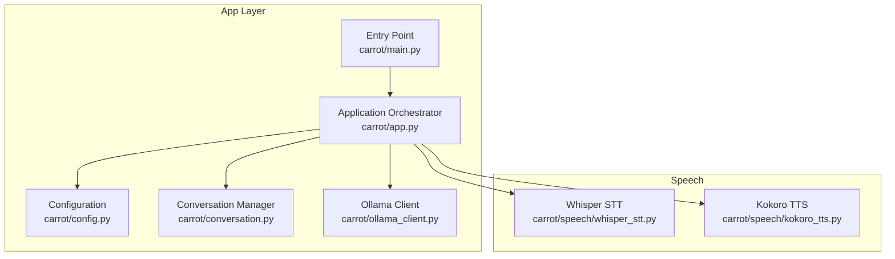
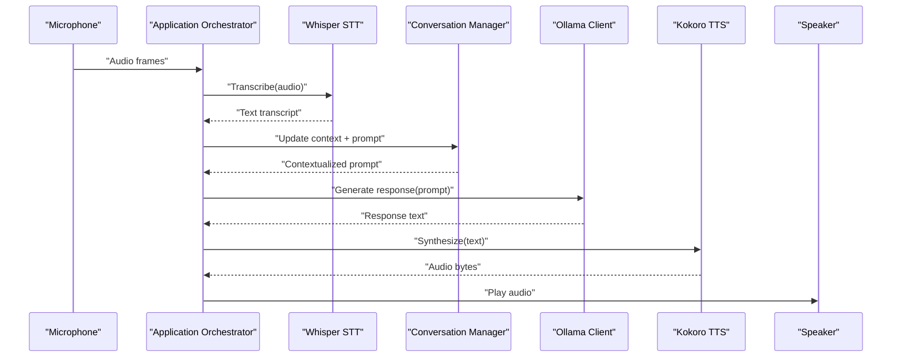
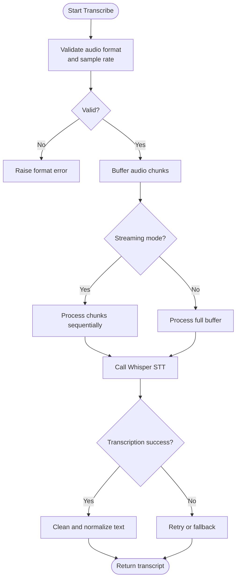
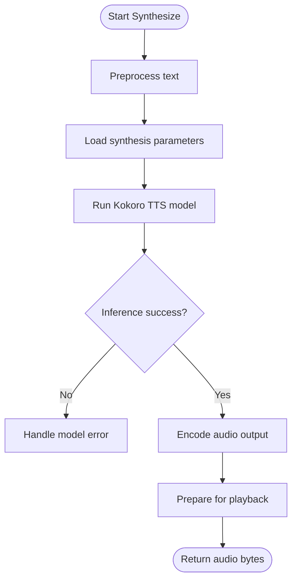
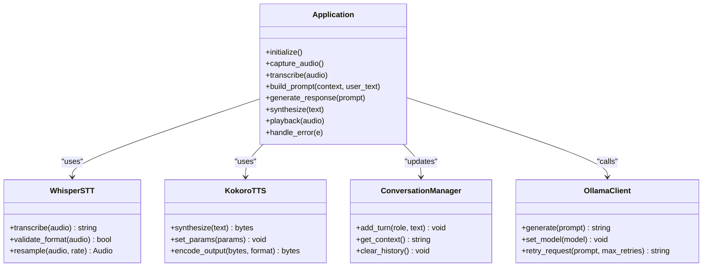
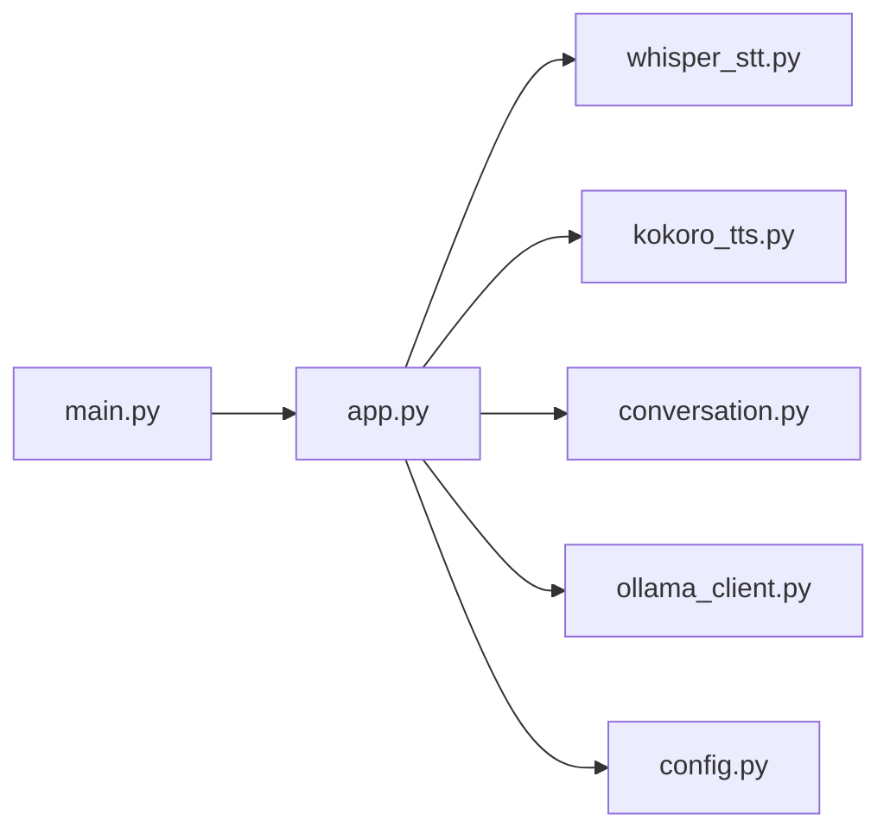

# Voice Processing Flow

<cite>
**Referenced Files in This Document**
- [whisper_stt.py](file://carrot/speech/whisper_stt.py)
- [kokoro_tts.py](file://carrot/speech/kokoro_tts.py)
- [app.py](file://carrot/app.py)
- [config.py](file://carrot/config.py)
- [conversation.py](file://carrot/conversation.py)
- [ollama_client.py](file://carrot/ollama_client.py)
- [main.py](file://carrot/main.py)
</cite>

## Table of Contents
1. [Introduction](#introduction)
2. [Project Structure](#project-structure)
3. [Core Components](#core-components)
4. [Architecture Overview](#architecture-overview)
5. [Detailed Component Analysis](#detailed-component-analysis)
6. [Dependency Analysis](#dependency-analysis)
7. [Performance Considerations](#performance-considerations)
8. [Troubleshooting Guide](#troubleshooting-guide)
9. [Conclusion](#conclusion)

## Introduction
This document explains the voice processing data flow in Carrot, covering the complete pipeline from microphone capture through speech recognition (Whisper STT), AI model interaction, and text-to-speech synthesis (Kokoro TTS). It details audio format handling, buffer management, real-time considerations, error handling for audio capture, network issues, and model processing errors, and provides performance optimization techniques for low-latency voice interactions.

## Project Structure
Carrot organizes voice-related functionality under a dedicated speech module with separate components for Whisper-based speech-to-text and Kokoro-based text-to-speech. The application orchestrates these components via the main app layer and configuration.

**Diagram sources**
- [whisper_stt.py](file://carrot/speech/whisper_stt.py)
- [kokoro_tts.py](file://carrot/speech/kokoro_tts.py)
- [app.py](file://carrot/app.py)
- [config.py](file://carrot/config.py)
- [conversation.py](file://carrot/conversation.py)
- [ollama_client.py](file://carrot/ollama_client.py)
- [main.py](file://carrot/main.py)

**Section sources**
- [whisper_stt.py](file://carrot/speech/whisper_stt.py)
- [kokoro_tts.py](file://carrot/speech/kokoro_tts.py)
- [app.py](file://carrot/app.py)
- [config.py](file://carrot/config.py)
- [conversation.py](file://carrot/conversation.py)
- [ollama_client.py](file://carrot/ollama_client.py)
- [main.py](file://carrot/main.py)

## Core Components
- Whisper STT: Converts captured audio to text using Whisper models. Handles audio input formats, chunking, and transcription requests.
- Kokoro TTS: Synthesizes spoken output from text using Kokoro models. Manages audio generation parameters and output formats.
- Application Orchestrator: Coordinates the full voice pipeline, including audio capture, STT, conversation context, AI model calls, and TTS playback.
- Configuration: Centralizes settings such as model paths, audio device selection, sampling rates, and latency thresholds.
- Conversation Manager: Maintains dialogue state and context across turns.
- Ollama Client: Interfaces with local or remote AI models for response generation.

Key responsibilities:
- Audio I/O: Capture, buffering, and playback.
- Format conversions: PCM, WAV, FLAC, MP3 where applicable.
- Real-time streaming: Chunked processing and pipelining.
- Error handling: Robust fallbacks and retries.
- Performance tuning: Batch sizes, concurrency, and caching.

**Section sources**
- [whisper_stt.py](file://carrot/speech/whisper_stt.py)
- [kokoro_tts.py](file://carrot/speech/kokoro_tts.py)
- [app.py](file://carrot/app.py)
- [config.py](file://carrot/config.py)
- [conversation.py](file://carrot/conversation.py)
- [ollama_client.py](file://carrot/ollama_client.py)

## Architecture Overview
The voice pipeline follows a linear flow with optional branching for error recovery and retries. Audio is captured, transcribed, processed by an AI model, and synthesized back into speech.

**Diagram sources**
- [app.py](file://carrot/app.py)
- [whisper_stt.py](file://carrot/speech/whisper_stt.py)
- [conversation.py](file://carrot/conversation.py)
- [ollama_client.py](file://carrot/ollama_client.py)
- [kokoro_tts.py](file://carrot/speech/kokoro_tts.py)

## Detailed Component Analysis

### Whisper STT Component
Responsibilities:
- Accept raw audio frames or buffered chunks.
- Normalize sample rate and channel layout.
- Perform transcription via Whisper API or local model.
- Return clean text transcripts with minimal latency.

Processing logic:
- Input validation and resampling.
- Chunking strategy for streaming.
- Transcription request and result parsing.
- Error handling for device access and model inference failures.

**Diagram sources**
- [whisper_stt.py](file://carrot/speech/whisper_stt.py)

**Section sources**
- [whisper_stt.py](file://carrot/speech/whisper_stt.py)

### Kokoro TTS Component
Responsibilities:
- Convert text prompts into natural speech.
- Manage synthesis parameters (voice, speed, pitch).
- Output audio in desired format for playback.

Processing logic:
- Text preprocessing and tokenization.
- Model inference for audio generation.
- Post-processing (normalization, encoding).
- Error handling for model loading and synthesis failures.

**Diagram sources**
- [kokoro_tts.py](file://carrot/speech/kokoro_tts.py)

**Section sources**
- [kokoro_tts.py](file://carrot/speech/kokoro_tts.py)

### Application Orchestrator
Responsibilities:
- Coordinate audio capture, STT, conversation context, AI model calls, and TTS playback.
- Manage buffers and real-time streaming.
- Implement retry logic and error propagation.

Control flow:
- Initialize audio devices and STT/TTS modules.
- Loop capturing audio frames.
- Trigger STT on voice activity detection.
- Build prompts with conversation context.
- Call AI model and synthesize response.
- Play synthesized audio and update context.

**Diagram sources**
- [app.py](file://carrot/app.py)
- [whisper_stt.py](file://carrot/speech/whisper_stt.py)
- [kokoro_tts.py](file://carrot/speech/kokoro_tts.py)
- [conversation.py](file://carrot/conversation.py)
- [ollama_client.py](file://carrot/ollama_client.py)

**Section sources**
- [app.py](file://carrot/app.py)
- [conversation.py](file://carrot/conversation.py)
- [ollama_client.py](file://carrot/ollama_client.py)

### Configuration Management
Responsibilities:
- Define default values for audio devices, sample rates, model paths, and latency thresholds.
- Provide runtime overrides via environment variables or config files.
- Validate critical settings before initialization.

Key settings:
- Microphone index and speaker device.
- Sample rate and chunk size for real-time processing.
- Whisper model name and Kokoro voice preset.
- Network timeouts and retry limits for AI model calls.

**Section sources**
- [config.py](file://carrot/config.py)

### Entry Point and Initialization
Responsibilities:
- Bootstrap the application, load configuration, and initialize subsystems.
- Set up logging and error reporting.
- Start the main loop for voice processing.

Initialization sequence:
- Load configuration.
- Initialize audio I/O.
- Instantiate STT and TTS modules.
- Prepare conversation context and AI client.
- Enter main processing loop.

**Section sources**
- [main.py](file://carrot/main.py)

## Dependency Analysis
The voice pipeline has clear dependencies between components, ensuring modularity and testability.

**Diagram sources**
- [main.py](file://carrot/main.py)
- [app.py](file://carrot/app.py)
- [whisper_stt.py](file://carrot/speech/whisper_stt.py)
- [kokoro_tts.py](file://carrot/speech/kokoro_tts.py)
- [conversation.py](file://carrot/conversation.py)
- [ollama_client.py](file://carrot/ollama_client.py)
- [config.py](file://carrot/config.py)

**Section sources**
- [main.py](file://carrot/main.py)
- [app.py](file://carrot/app.py)
- [whisper_stt.py](file://carrot/speech/whisper_stt.py)
- [kokoro_tts.py](file://carrot/speech/kokoro_tts.py)
- [conversation.py](file://carrot/conversation.py)
- [ollama_client.py](file://carrot/ollama_client.py)
- [config.py](file://carrot/config.py)

## Performance Considerations
- Audio Buffering: Use small, fixed-size buffers to minimize latency while avoiding excessive CPU overhead.
- Streaming STT: Process audio in chunks to reduce transcription delay and enable faster feedback.
- Concurrency: Run STT, AI model calls, and TTS synthesis asynchronously where possible.
- Model Caching: Keep models loaded in memory to avoid repeated initialization costs.
- Network Optimization: Configure appropriate timeouts and retry policies for AI model requests.
- Resource Management: Monitor CPU and memory usage; adjust chunk sizes and batch processing accordingly.
- Format Efficiency: Prefer lossless formats during processing and convert only at boundaries (input/output).

[No sources needed since this section provides general guidance]

## Troubleshooting Guide
Common issues and resolutions:
- Microphone capture failure: Check device permissions, availability, and correct index selection.
- Audio format errors: Ensure consistent sample rate and channel configuration across pipeline stages.
- STT transcription errors: Verify model availability, input quality, and network connectivity if using cloud APIs.
- AI model call failures: Inspect network status, endpoint availability, and retry configurations.
- TTS synthesis errors: Validate text input, model parameters, and output encoding compatibility.
- Playback issues: Confirm speaker device selection and audio format compatibility.

Error handling strategies:
- Graceful degradation: Fall back to alternative models or reduced quality modes.
- Retries with exponential backoff: Prevent overwhelming services during transient failures.
- Logging and diagnostics: Capture detailed error contexts for debugging.
- User feedback: Inform users about ongoing issues and recovery steps.

**Section sources**
- [app.py](file://carrot/app.py)
- [whisper_stt.py](file://carrot/speech/whisper_stt.py)
- [kokoro_tts.py](file://carrot/speech/kokoro_tts.py)
- [config.py](file://carrot/config.py)

## Conclusion
Carrot’s voice processing pipeline integrates Whisper STT and Kokoro TTS within a cohesive application architecture. By carefully managing audio formats, buffers, and real-time processing, the system achieves responsive voice interactions. Robust error handling and performance optimizations ensure reliability and efficiency. Continuous monitoring and tuning will further enhance the user experience in dynamic environments.

[No sources needed since this section summarizes without analyzing specific files]