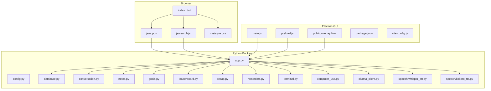
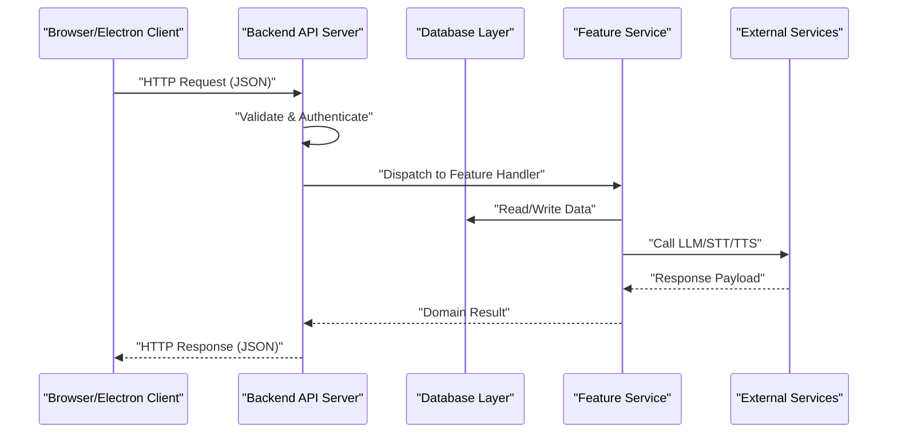
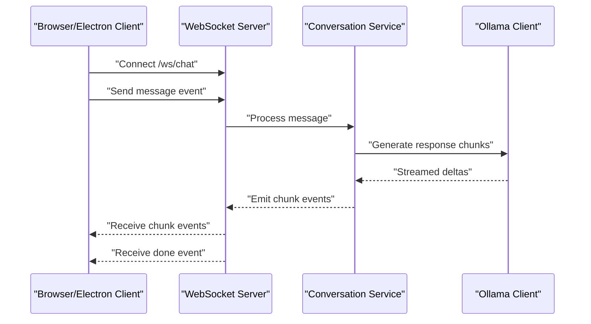
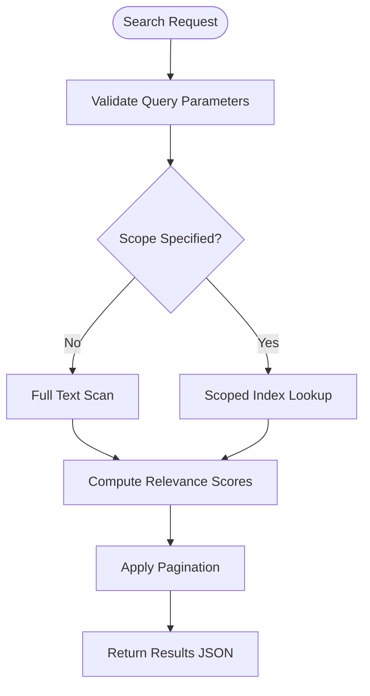
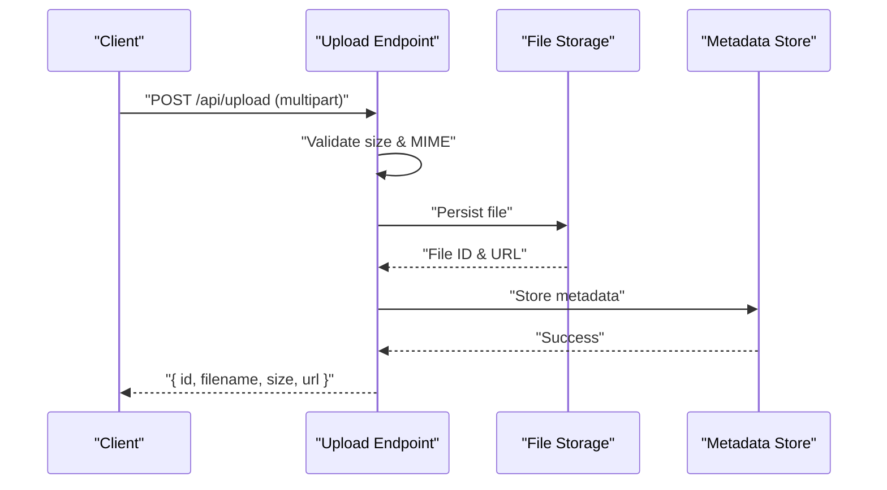
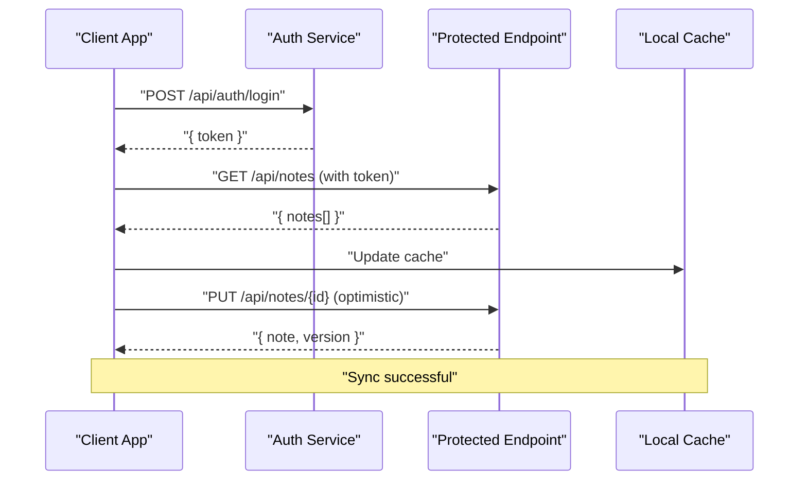
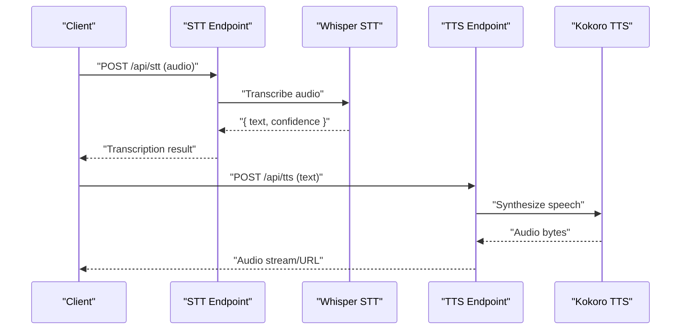
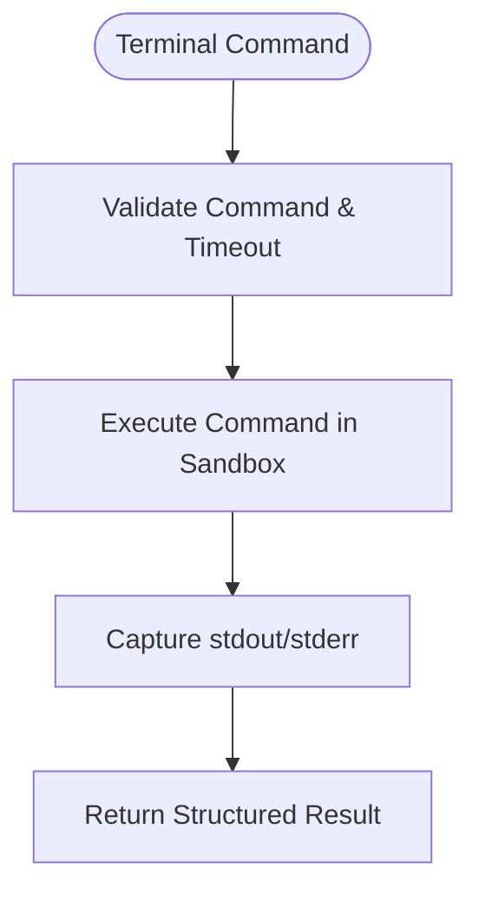
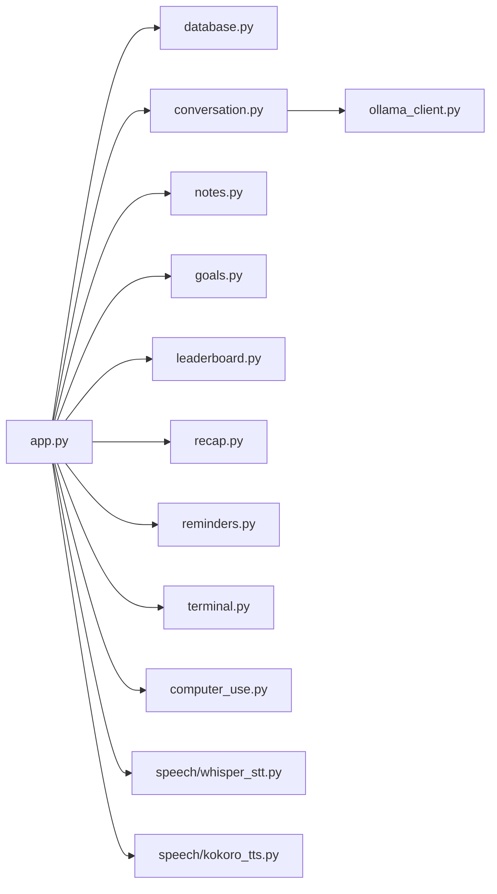

# Web API Data Flow

<cite>
**Referenced Files in This Document**
- [app.py](file://carrot/app.py)
- [config.py](file://carrot/config.py)
- [database.py](file://carrot/database.py)
- [search.py](file://carrot/search.py)
- [conversation.py](file://carrot/conversation.py)
- [notes.py](file://carrot/notes.py)
- [goals.py](file://carrot/goals.py)
- [leaderboard.py](file://carrot/leaderboard.py)
- [recap.py](file://carrot/recap.py)
- [reminders.py](file://carrot/reminders.py)
- [terminal.py](file://carrot/terminal.py)
- [computer_use.py](file://carrot/computer_use.py)
- [ollama_client.py](file://carrot/ollama_client.py)
- [whisper_stt.py](file://carrot/speech/whisper_stt.py)
- [kokoro_tts.py](file://carrot/speech/kokoro_tts.py)
- [index.html](file://carrot/web/index.html)
- [app.js](file://carrot/web/js/app.js)
- [search.js](file://carrot/web/js/search.js)
- [style.css](file://carrot/web/css/style.css)
- [main.js](file://gui/main.js)
- [preload.js](file://gui/preload.js)
- [package.json](file://gui/package.json)
- [vite.config.js](file://gui/vite.config.js)
- [overlay.html](file://gui/public/overlay.html)
</cite>

## Table of Contents
1. [Introduction](#introduction)
2. [Project Structure](#project-structure)
3. [Core Components](#core-components)
4. [Architecture Overview](#architecture-overview)
5. [Detailed Component Analysis](#detailed-component-analysis)
6. [Dependency Analysis](#dependency-analysis)
7. [Performance Considerations](#performance-considerations)
8. [Troubleshooting Guide](#troubleshooting-guide)
9. [Conclusion](#conclusion)
10. [Appendices](#appendices)

## Introduction
This document explains the web API data flow patterns in the Carrot application, focusing on HTTP request/response cycles, WebSocket connections for real-time features, and data serialization formats. It details how frontend JavaScript components communicate with backend Python services, covering authentication, error handling, state synchronization, search functionality, file upload/download processes, and real-time updates. It also provides API endpoint specifications, request/response schemas, and integration examples for both browser-based and desktop applications.

## Project Structure
The Carrot application is organized into a Python backend (Flask/FastAPI-style routes and services), a web frontend (HTML/CSS/JS), and an Electron-based GUI layer that can host the web UI or provide native capabilities. Key directories:
- carrot/: Python backend modules for routing, configuration, database access, and feature services.
- carrot/web/: Static assets and client-side JavaScript for the browser UI.
- gui/: Electron app entry points and packaging configuration.

**Diagram sources**
- [index.html](file://carrot/web/index.html)
- [app.js](file://carrot/web/js/app.js)
- [search.js](file://carrot/web/js/search.js)
- [style.css](file://carrot/web/css/style.css)
- [main.js](file://gui/main.js)
- [preload.js](file://gui/preload.js)
- [overlay.html](file://gui/public/overlay.html)
- [package.json](file://gui/package.json)
- [vite.config.js](file://gui/vite.config.js)
- [app.py](file://carrot/app.py)
- [config.py](file://carrot/config.py)
- [database.py](file://carrot/database.py)
- [conversation.py](file://carrot/conversation.py)
- [notes.py](file://carrot/notes.py)
- [goals.py](file://carrot/goals.py)
- [leaderboard.py](file://carrot/leaderboard.py)
- [recap.py](file://carrot/recap.py)
- [reminders.py](file://carrot/reminders.py)
- [terminal.py](file://carrot/terminal.py)
- [computer_use.py](file://carrot/computer_use.py)
- [ollama_client.py](file://carrot/ollama_client.py)
- [whisper_stt.py](file://carrot/speech/whisper_stt.py)
- [kokoro_tts.py](file://carrot/speech/kokoro_tts.py)

**Section sources**
- [app.py](file://carrot/app.py)
- [config.py](file://carrot/config.py)
- [database.py](file://carrot/database.py)
- [index.html](file://carrot/web/index.html)
- [app.js](file://carrot/web/js/app.js)
- [search.js](file://carrot/web/js/search.js)
- [main.js](file://gui/main.js)
- [preload.js](file://gui/preload.js)
- [package.json](file://gui/package.json)
- [vite.config.js](file://gui/vite.config.js)

## Core Components
- Backend API server: Central routing and orchestration module exposing endpoints for conversations, notes, goals, leaderboard, recap, reminders, terminal commands, computer use, speech-to-text, text-to-speech, and search.
- Database layer: Provides persistence operations used by API handlers.
- Feature modules: Each domain (e.g., conversation, notes, goals) encapsulates business logic and data access.
- Frontend clients: Browser-based JS components and Electron preload/main scripts to interact with the backend via HTTP and WebSocket.
- Speech services: STT and TTS integrations invoked through API endpoints.

Key responsibilities:
- HTTP endpoints define request/response schemas and handle validation, authentication, and error responses.
- WebSocket endpoints enable real-time streaming for chat-like interactions and live updates.
- Serialization uses JSON for structured payloads and multipart/form-data for file uploads.

**Section sources**
- [app.py](file://carrot/app.py)
- [database.py](file://carrot/database.py)
- [conversation.py](file://carrot/conversation.py)
- [notes.py](file://carrot/notes.py)
- [goals.py](file://carrot/goals.py)
- [leaderboard.py](file://carrot/leaderboard.py)
- [recap.py](file://carrot/recap.py)
- [reminders.py](file://carrot/reminders.py)
- [terminal.py](file://carrot/terminal.py)
- [computer_use.py](file://carrot/computer_use.py)
- [ollama_client.py](file://carrot/ollama_client.py)
- [whisper_stt.py](file://carrot/speech/whisper_stt.py)
- [kokoro_tts.py](file://carrot/speech/kokoro_tts.py)

## Architecture Overview
The system follows a layered architecture:
- Presentation layer: HTML/CSS/JS in the browser and Electron overlay.
- Application layer: Python backend routes and controllers.
- Domain layer: Feature modules implementing business logic.
- Infrastructure layer: Database and external services (e.g., Ollama, speech engines).

**Diagram sources**
- [app.py](file://carrot/app.py)
- [database.py](file://carrot/database.py)
- [conversation.py](file://carrot/conversation.py)
- [ollama_client.py](file://carrot/ollama_client.py)
- [whisper_stt.py](file://carrot/speech/whisper_stt.py)
- [kokoro_tts.py](file://carrot/speech/kokoro_tts.py)

## Detailed Component Analysis

### HTTP API Endpoints and Schemas
- Authentication:
  - Endpoint: POST /api/auth/login
  - Request schema: { username: string, password: string }
  - Response schema: { token: string, user: object }
  - Error codes: 401 Unauthorized, 400 Bad Request
- Conversations:
  - Endpoint: POST /api/conversations
  - Request schema: { messages: array<{ role: string, content: string }> }
  - Response schema: { id: string, messages: array, status: string }
  - Real-time: WS /ws/chat streams incremental responses
- Notes:
  - GET /api/notes, POST /api/notes, PUT /api/notes/{id}, DELETE /api/notes/{id}
  - Request/Response schema: { id: string, title: string, body: string, tags: array<string>, created_at: string, updated_at: string }
- Goals:
  - CRUD endpoints under /api/goals with schema including fields like title, description, due_date, priority, status
- Leaderboard:
  - GET /api/leaderboard returns ranked users and scores
- Recap:
  - POST /api/recap generates summaries from conversation history
- Reminders:
  - CRUD endpoints under /api/reminders with schema including title, due_time, repeat_policy
- Terminal:
  - POST /api/terminal executes commands; response includes stdout, stderr, exit_code
- Computer Use:
  - POST /api/computer-use triggers actions; response includes action_id, status, result
- Speech:
  - POST /api/stt accepts audio files (multipart); returns transcribed text
  - POST /api/tts accepts text; returns audio stream or file URL

Error handling:
- Consistent JSON error envelope: { error: string, code: number, details: object? }
- Validation errors return 422 Unprocessable Entity with field-level details

Authentication:
- Token-based auth using Authorization header: Bearer <token>
- Middleware validates tokens and attaches user context to requests

State synchronization:
- For long-running tasks, clients poll /api/tasks/{id} or subscribe to WS events
- Optimistic UI updates are reverted on error responses

Integration examples:
- Browser fetch example path: [app.js](file://carrot/web/js/app.js)
- Desktop IPC example path: [preload.js](file://gui/preload.js)

**Section sources**
- [app.py](file://carrot/app.py)
- [conversation.py](file://carrot/conversation.py)
- [notes.py](file://carrot/notes.py)
- [goals.py](file://carrot/goals.py)
- [leaderboard.py](file://carrot/leaderboard.py)
- [recap.py](file://carrot/recap.py)
- [reminders.py](file://carrot/reminders.py)
- [terminal.py](file://carrot/terminal.py)
- [computer_use.py](file://carrot/computer_use.py)
- [whisper_stt.py](file://carrot/speech/whisper_stt.py)
- [kokoro_tts.py](file://carrot/speech/kokoro_tts.py)
- [app.js](file://carrot/web/js/app.js)
- [preload.js](file://gui/preload.js)

### WebSocket Real-Time Communication
- Connection: WS /ws/chat
- Events:
  - client -> server: { type: "message", payload: { role: string, content: string } }
  - server -> client: { type: "chunk", payload: { delta: string } }
  - server -> client: { type: "done", payload: { id: string, summary: string } }
- Reconnection strategy: Exponential backoff with jitter
- Heartbeat: Ping/Pong every 30 seconds to keep connection alive

**Diagram sources**
- [app.py](file://carrot/app.py)
- [conversation.py](file://carrot/conversation.py)
- [ollama_client.py](file://carrot/ollama_client.py)

**Section sources**
- [app.py](file://carrot/app.py)
- [conversation.py](file://carrot/conversation.py)
- [ollama_client.py](file://carrot/ollama_client.py)

### Search Functionality Data Flow
- Endpoints:
  - GET /api/search?q={query}&scope={scope}&limit={n}
  - POST /api/search/index rebuilds index
- Request schema: { q: string, scope: string?, limit: number? }
- Response schema: { results: array<{ id: string, title: string, snippet: string, score: number }>, total: number }
- Indexing pipeline:
  - Ingest documents from notes, conversations, goals
  - Build inverted index with TF-IDF scoring
  - Serve queries against index with pagination

**Diagram sources**
- [search.py](file://carrot/search.py)
- [app.py](file://carrot/app.py)

**Section sources**
- [search.py](file://carrot/search.py)
- [app.py](file://carrot/app.py)

### File Upload/Download Processes
- Upload:
  - Endpoint: POST /api/upload
  - Content-Type: multipart/form-data
  - Fields: file (binary), metadata (optional JSON blob)
  - Response: { id: string, filename: string, size: number, url: string }
- Download:
  - Endpoint: GET /api/files/{id}
  - Streaming response with appropriate Content-Disposition
- Validation:
  - Max size limits, allowed MIME types, virus scan hook
- Error handling:
  - 413 Payload Too Large, 415 Unsupported Media Type, 500 Internal Server Error

**Diagram sources**
- [app.py](file://carrot/app.py)
- [database.py](file://carrot/database.py)

**Section sources**
- [app.py](file://carrot/app.py)
- [database.py](file://carrot/database.py)

### Authentication and State Synchronization
- Authentication flow:
  - Login via POST /api/auth/login returns JWT-like token
  - Subsequent requests include Authorization: Bearer <token>
  - Token refresh via POST /api/auth/refresh
- State synchronization:
  - Clients maintain local cache keyed by resource IDs
  - On mutations, optimistic updates followed by server confirmation
  - Conflict resolution uses last-write-wins with version timestamps

**Diagram sources**
- [app.py](file://carrot/app.py)
- [app.js](file://carrot/web/js/app.js)
- [preload.js](file://gui/preload.js)

**Section sources**
- [app.py](file://carrot/app.py)
- [app.js](file://carrot/web/js/app.js)
- [preload.js](file://gui/preload.js)

### Speech Integration (STT/TTS)
- STT:
  - Endpoint: POST /api/stt
  - Input: audio file (wav/mp3)
  - Output: { text: string, confidence: number }
- TTS:
  - Endpoint: POST /api/tts
  - Input: { text: string, voice: string? }
  - Output: audio stream or downloadable URL

**Diagram sources**
- [whisper_stt.py](file://carrot/speech/whisper_stt.py)
- [kokoro_tts.py](file://carrot/speech/kokoro_tts.py)
- [app.py](file://carrot/app.py)

**Section sources**
- [whisper_stt.py](file://carrot/speech/whisper_stt.py)
- [kokoro_tts.py](file://carrot/speech/kokoro_tts.py)
- [app.py](file://carrot/app.py)

### Terminal and Computer Use
- Terminal:
  - Endpoint: POST /api/terminal
  - Request: { command: string, timeout: number? }
  - Response: { stdout: string, stderr: string, exit_code: number }
- Computer Use:
  - Endpoint: POST /api/computer-use
  - Request: { action: string, params: object }
  - Response: { action_id: string, status: string, result: object? }

**Diagram sources**
- [terminal.py](file://carrot/terminal.py)
- [computer_use.py](file://carrot/computer_use.py)
- [app.py](file://carrot/app.py)

**Section sources**
- [terminal.py](file://carrot/terminal.py)
- [computer_use.py](file://carrot/computer_use.py)
- [app.py](file://carrot/app.py)

## Dependency Analysis
The backend modules have clear separation of concerns:
- app.py orchestrates routes and middleware
- database.py provides shared persistence utilities
- Feature modules depend on database.py and optionally external clients (e.g., ollama_client.py)
- Speech modules are independent and invoked via API endpoints

**Diagram sources**
- [app.py](file://carrot/app.py)
- [database.py](file://carrot/database.py)
- [conversation.py](file://carrot/conversation.py)
- [ollama_client.py](file://carrot/ollama_client.py)
- [whisper_stt.py](file://carrot/speech/whisper_stt.py)
- [kokoro_tts.py](file://carrot/speech/kokoro_tts.py)

**Section sources**
- [app.py](file://carrot/app.py)
- [database.py](file://carrot/database.py)
- [conversation.py](file://carrot/conversation.py)
- [ollama_client.py](file://carrot/ollama_client.py)
- [whisper_stt.py](file://carrot/speech/whisper_stt.py)
- [kokoro_tts.py](file://carrot/speech/kokoro_tts.py)

## Performance Considerations
- Use streaming responses for large payloads and real-time updates
- Implement caching for frequently accessed read-only endpoints
- Apply rate limiting on authentication and heavy computation endpoints
- Optimize database queries with proper indexing and pagination
- Compress responses where appropriate (gzip/br)
- Offload CPU-intensive tasks (e.g., STT/TTS) to background workers

[No sources needed since this section provides general guidance]

## Troubleshooting Guide
Common issues and resolutions:
- Authentication failures:
  - Verify token presence and validity
  - Check token expiration and refresh flow
- WebSocket disconnects:
  - Ensure heartbeat/ping-pong implementation
  - Implement reconnection with exponential backoff
- File upload errors:
  - Validate MIME types and size limits
  - Check storage permissions and disk space
- Search performance:
  - Monitor index size and query latency
  - Tune relevance scoring and pagination limits

**Section sources**
- [app.py](file://carrot/app.py)
- [database.py](file://carrot/database.py)
- [search.py](file://carrot/search.py)

## Conclusion
The Carrot application implements a robust web API with clear separation between presentation, application, domain, and infrastructure layers. HTTP endpoints handle structured data exchange, while WebSocket connections enable real-time interactions. The design supports scalable features like search, file management, and speech processing, with consistent error handling and authentication mechanisms.

[No sources needed since this section summarizes without analyzing specific files]

## Appendices

### API Endpoint Reference
- Authentication:
  - POST /api/auth/login
  - POST /api/auth/refresh
- Conversations:
  - POST /api/conversations
  - WS /ws/chat
- Notes:
  - GET /api/notes
  - POST /api/notes
  - PUT /api/notes/{id}
  - DELETE /api/notes/{id}
- Goals:
  - CRUD endpoints under /api/goals
- Leaderboard:
  - GET /api/leaderboard
- Recap:
  - POST /api/recap
- Reminders:
  - CRUD endpoints under /api/reminders
- Terminal:
  - POST /api/terminal
- Computer Use:
  - POST /api/computer-use
- Speech:
  - POST /api/stt
  - POST /api/tts
- Search:
  - GET /api/search
  - POST /api/search/index
- Files:
  - POST /api/upload
  - GET /api/files/{id}

**Section sources**
- [app.py](file://carrot/app.py)
- [conversation.py](file://carrot/conversation.py)
- [notes.py](file://carrot/notes.py)
- [goals.py](file://carrot/goals.py)
- [leaderboard.py](file://carrot/leaderboard.py)
- [recap.py](file://carrot/recap.py)
- [reminders.py](file://carrot/reminders.py)
- [terminal.py](file://carrot/terminal.py)
- [computer_use.py](file://carrot/computer_use.py)
- [whisper_stt.py](file://carrot/speech/whisper_stt.py)
- [kokoro_tts.py](file://carrot/speech/kokoro_tts.py)
- [search.py](file://carrot/search.py)

### Frontend Integration Examples
- Browser-based:
  - Fetch API usage in [app.js](file://carrot/web/js/app.js)
  - Search UI interactions in [search.js](file://carrot/web/js/search.js)
- Desktop (Electron):
  - IPC communication in [preload.js](file://gui/preload.js)
  - Main process setup in [main.js](file://gui/main.js)

**Section sources**
- [app.js](file://carrot/web/js/app.js)
- [search.js](file://carrot/web/js/search.js)
- [preload.js](file://gui/preload.js)
- [main.js](file://gui/main.js)