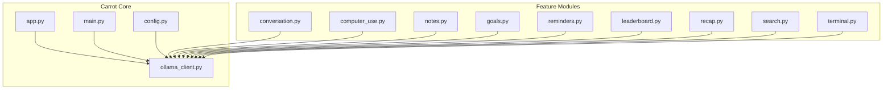
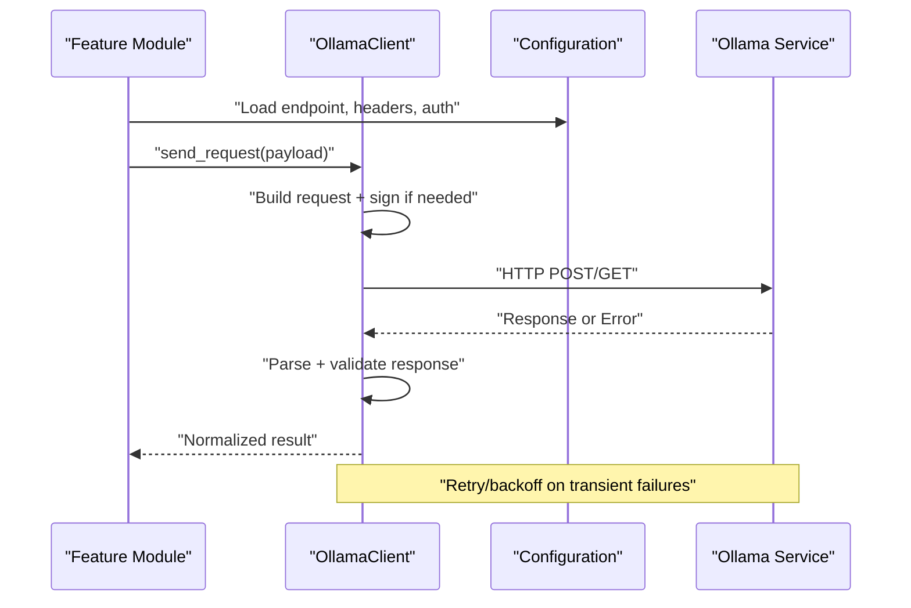
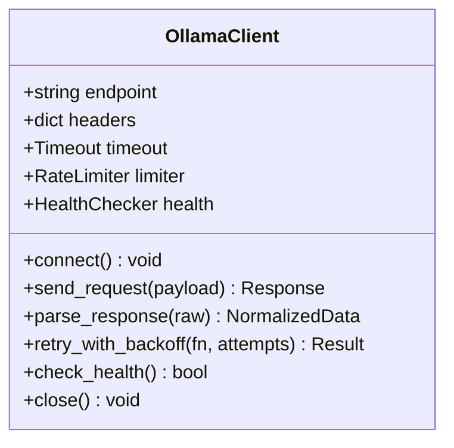
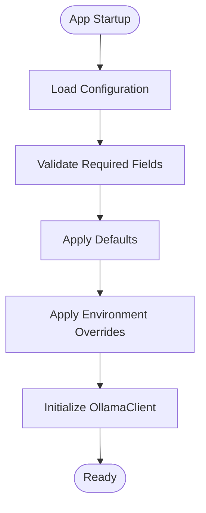
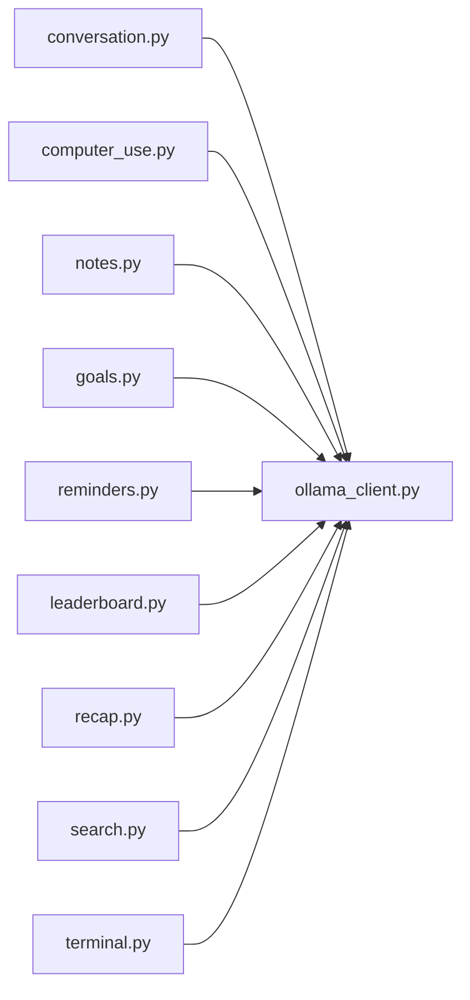
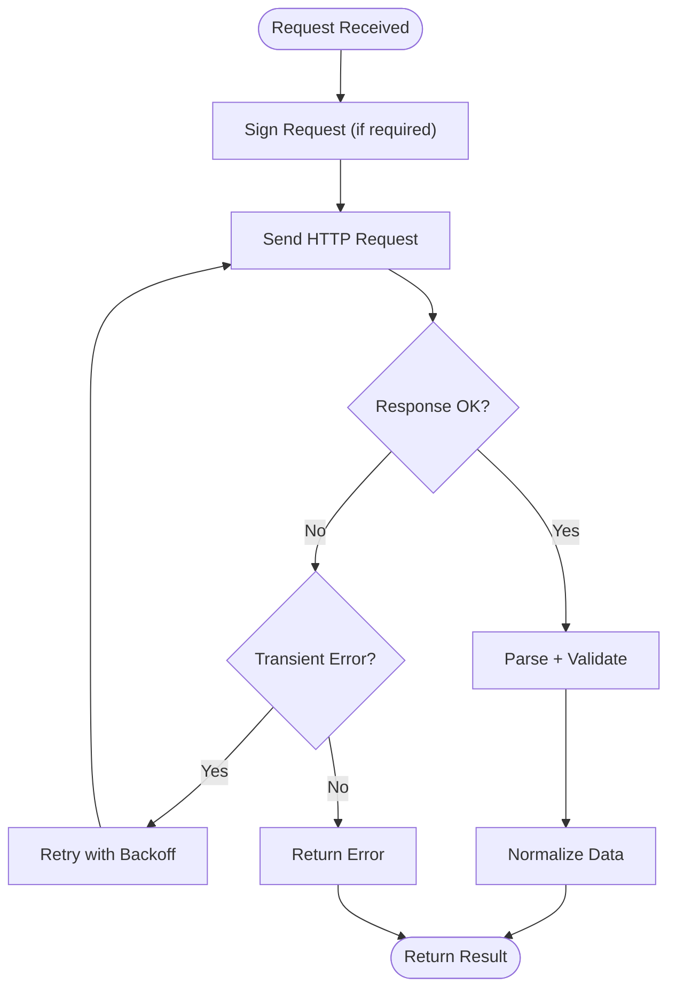
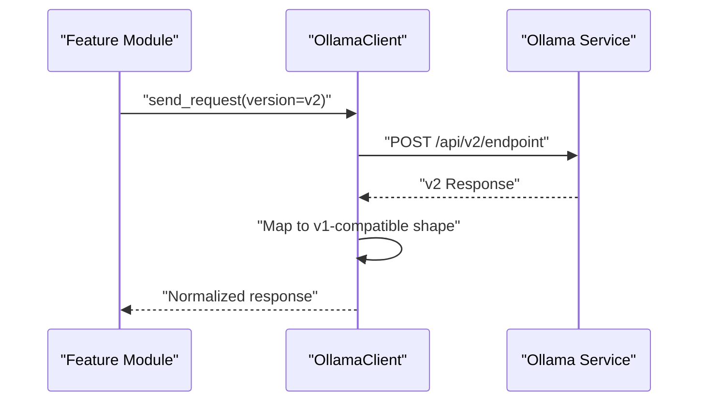
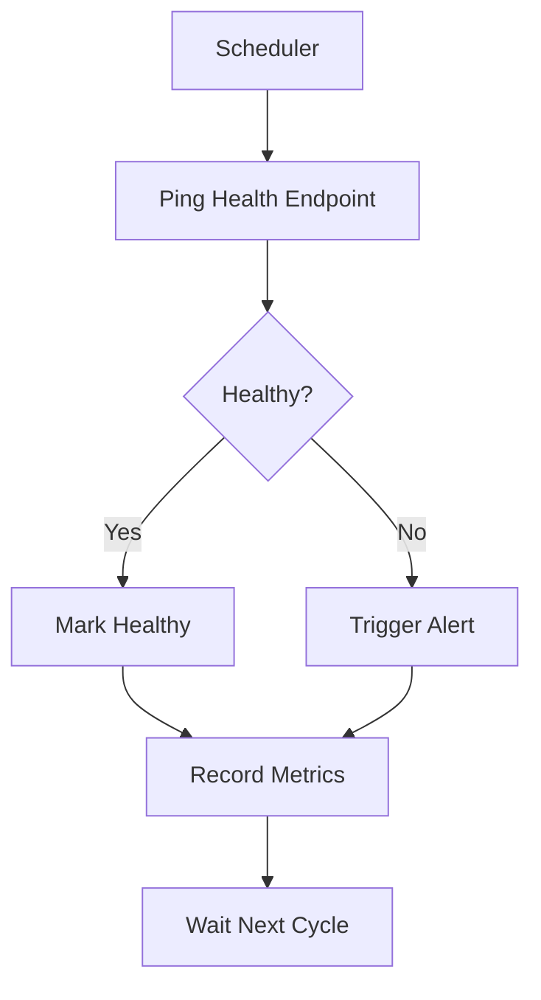
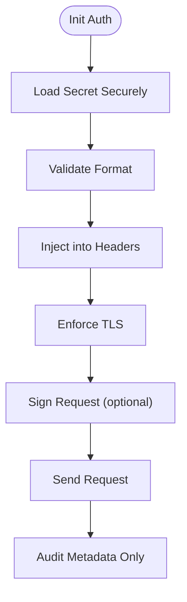
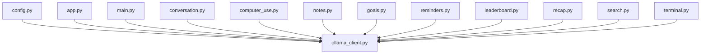

# External API Integration

<cite>
**Referenced Files in This Document**
- [ollama_client.py](file://carrot/ollama_client.py)
- [config.py](file://carrot/config.py)
- [app.py](file://carrot/app.py)
- [main.py](file://carrot/main.py)
- [conversation.py](file://carrot/conversation.py)
- [computer_use.py](file://carrot/computer_use.py)
- [notes.py](file://carrot/notes.py)
- [goals.py](file://carrot/goals.py)
- [reminders.py](file://carrot/reminders.py)
- [leaderboard.py](file://carrot/leaderboard.py)
- [recap.py](file://carrot/recap.py)
- [search.py](file://carrot/search.py)
- [terminal.py](file://carrot/terminal.py)
</cite>

## Table of Contents
1. [Introduction](#introduction)
2. [Project Structure](#project-structure)
3. [Core Components](#core-components)
4. [Architecture Overview](#architecture-overview)
5. [Detailed Component Analysis](#detailed-component-analysis)
6. [Dependency Analysis](#dependency-analysis)
7. [Performance Considerations](#performance-considerations)
8. [Troubleshooting Guide](#troubleshooting-guide)
9. [Conclusion](#conclusion)

## Introduction
This document explains how Carrot integrates with external APIs, focusing on the Ollama client implementation and its usage across the application. It covers connection management, request/response handling, authentication mechanisms, error recovery strategies, configuration patterns for endpoints, rate limiting, retry logic, API versioning, backward compatibility, health monitoring, and security considerations such as API key handling, request signing, and secure communication protocols.

## Project Structure
Carrot organizes external API integration primarily through a dedicated Ollama client module, which is consumed by various feature modules (e.g., conversation, computer use, notes, goals, reminders, leaderboard, recap, search, terminal). Configuration for endpoints and credentials is centralized to keep integrations consistent and secure.

**Diagram sources**
- [app.py](file://carrot/app.py)
- [main.py](file://carrot/main.py)
- [config.py](file://carrot/config.py)
- [ollama_client.py](file://carrot/ollama_client.py)
- [conversation.py](file://carrot/conversation.py)
- [computer_use.py](file://carrot/computer_use.py)
- [notes.py](file://carrot/notes.py)
- [goals.py](file://carrot/goals.py)
- [reminders.py](file://carrot/reminders.py)
- [leaderboard.py](file://carrot/leaderboard.py)
- [recap.py](file://carrot/recap.py)
- [search.py](file://carrot/search.py)
- [terminal.py](file://carrot/terminal.py)

**Section sources**
- [app.py](file://carrot/app.py)
- [main.py](file://carrot/main.py)
- [config.py](file://carrot/config.py)
- [ollama_client.py](file://carrot/ollama_client.py)
- [conversation.py](file://carrot/conversation.py)
- [computer_use.py](file://carrot/computer_use.py)
- [notes.py](file://carrot/notes.py)
- [goals.py](file://carrot/goals.py)
- [reminders.py](file://carrot/reminders.py)
- [leaderboard.py](file://carrot/leaderboard.py)
- [recap.py](file://carrot/recap.py)
- [search.py](file://carrot/search.py)
- [terminal.py](file://carrot/terminal.py)

## Core Components
- Ollama Client: Encapsulates HTTP interactions with the Ollama service, including connection lifecycle, request building, response parsing, retries, and error handling.
- Configuration: Centralized settings for endpoint URLs, timeouts, headers, authentication tokens, and feature flags.
- Feature Modules: Consumers of the Ollama client that implement domain-specific workflows (e.g., chat conversations, computer automation, note generation, goal planning, reminders, leaderboards, recaps, search, terminal commands).

Key responsibilities:
- Connection management: Establish, reuse, and close connections; handle network errors gracefully.
- Request/response handling: Build payloads, set headers, parse responses, and normalize data for internal use.
- Authentication: Securely manage API keys or tokens; inject them into requests.
- Error recovery: Implement retries with backoff, circuit breakers, and fallbacks where appropriate.
- Rate limiting: Enforce per-endpoint or global limits to avoid throttling.
- Versioning and compatibility: Manage API versions and adapt to schema changes without breaking existing features.
- Health monitoring: Periodically check service availability and expose metrics.

**Section sources**
- [ollama_client.py](file://carrot/ollama_client.py)
- [config.py](file://carrot/config.py)
- [conversation.py](file://carrot/conversation.py)
- [computer_use.py](file://carrot/computer_use.py)
- [notes.py](file://carrot/notes.py)
- [goals.py](file://carrot/goals.py)
- [reminders.py](file://carrot/reminders.py)
- [leaderboard.py](file://carrot/leaderboard.py)
- [recap.py](file://carrot/recap.py)
- [search.py](file://carrot/search.py)
- [terminal.py](file://carrot/terminal.py)

## Architecture Overview
The Ollama client acts as a single integration point for all external API calls. Feature modules call into it with structured requests, and receive normalized responses. Configuration drives behavior like timeouts, retries, and authentication.

**Diagram sources**
- [ollama_client.py](file://carrot/ollama_client.py)
- [config.py](file://carrot/config.py)
- [conversation.py](file://carrot/conversation.py)
- [computer_use.py](file://carrot/computer_use.py)
- [notes.py](file://carrot/notes.py)
- [goals.py](file://carrot/goals.py)
- [reminders.py](file://carrot/reminders.py)
- [leaderboard.py](file://carrot/leaderboard.py)
- [recap.py](file://carrot/recap.py)
- [search.py](file://carrot/search.py)
- [terminal.py](file://carrot/terminal.py)

## Detailed Component Analysis

### Ollama Client Implementation
Responsibilities:
- Connection management: Maintain persistent sessions when possible; detect and recover from connection drops.
- Request building: Construct JSON payloads, set required headers (including versioning), and attach authentication tokens securely.
- Response handling: Parse JSON, validate schemas, map fields to internal models, and stream results if supported.
- Error handling: Distinguish between client errors (invalid input, unauthorized) and server/network errors; implement retry with exponential backoff and jitter.
- Rate limiting: Enforce quotas per endpoint or globally using token bucket or sliding window algorithms.
- Health checks: Periodically ping a lightweight endpoint to verify service readiness and update internal state.

**Diagram sources**
- [ollama_client.py](file://carrot/ollama_client.py)

**Section sources**
- [ollama_client.py](file://carrot/ollama_client.py)

### Configuration Patterns
Responsibilities:
- Endpoint configuration: Base URL, path prefixes, and environment-specific overrides.
- Authentication: API keys, bearer tokens, or certificate-based auth; loaded from secure stores.
- Timeouts and retries: Global defaults and per-call overrides; backoff strategy parameters.
- Feature flags: Enable/disable capabilities like streaming, compression, or experimental endpoints.
- Logging and tracing: Structured logs, correlation IDs, and sampling rates.

**Diagram sources**
- [config.py](file://carrot/config.py)

**Section sources**
- [config.py](file://carrot/config.py)

### Usage Across Feature Modules
Each feature module uses the Ollama client to perform domain-specific tasks:
- Conversation: Chat prompts, context management, and response streaming.
- Computer Use: Automation commands and tool orchestration via LLM-generated actions.
- Notes: Summarization, extraction, and formatting of notes.
- Goals: Planning, decomposition, and progress tracking suggestions.
- Reminders: Scheduling and natural language processing for reminder creation.
- Leaderboard: Aggregation and presentation of performance metrics.
- Recap: Generating summaries of activities or conversations.
- Search: Query formulation and result interpretation.
- Terminal: Command translation and execution assistance.

**Diagram sources**
- [conversation.py](file://carrot/conversation.py)
- [computer_use.py](file://carrot/computer_use.py)
- [notes.py](file://carrot/notes.py)
- [goals.py](file://carrot/goals.py)
- [reminders.py](file://carrot/reminders.py)
- [leaderboard.py](file://carrot/leaderboard.py)
- [recap.py](file://carrot/recap.py)
- [search.py](file://carrot/search.py)
- [terminal.py](file://carrot/terminal.py)
- [ollama_client.py](file://carrot/ollama_client.py)

**Section sources**
- [conversation.py](file://carrot/conversation.py)
- [computer_use.py](file://carrot/computer_use.py)
- [notes.py](file://carrot/notes.py)
- [goals.py](file://carrot/goals.py)
- [reminders.py](file://carrot/reminders.py)
- [leaderboard.py](file://carrot/leaderboard.py)
- [recap.py](file://carrot/recap.py)
- [search.py](file://carrot/search.py)
- [terminal.py](file://carrot/terminal.py)
- [ollama_client.py](file://carrot/ollama_client.py)

### Request/Response Handling and Error Recovery
Patterns:
- Request signing: Optional HMAC or JWT signing for sensitive endpoints.
- Response normalization: Map varying API schemas to stable internal types.
- Retry strategy: Exponential backoff with jitter; idempotent operations only.
- Circuit breaker: Temporarily halt requests after repeated failures; auto-recover after cooldown.
- Fallbacks: Cache last known good responses or degrade gracefully when unavailable.

**Diagram sources**
- [ollama_client.py](file://carrot/ollama_client.py)

**Section sources**
- [ollama_client.py](file://carrot/ollama_client.py)

### API Versioning and Backward Compatibility
Strategies:
- Header-based versioning: Include an API version in request headers.
- Path-based versioning: Prefix endpoints with version segments.
- Schema evolution: Add optional fields; maintain default behaviors for older clients.
- Deprecation policy: Announce deprecations and provide migration guides.
- Compatibility layer: Translate newer responses to older schemas when necessary.

**Diagram sources**
- [ollama_client.py](file://carrot/ollama_client.py)
- [config.py](file://carrot/config.py)

**Section sources**
- [ollama_client.py](file://carrot/ollama_client.py)
- [config.py](file://carrot/config.py)

### Monitoring External Service Health
Approaches:
- Health endpoint polling: Periodic GET to a lightweight status route.
- Metrics collection: Latency, error rates, throughput, and quota usage.
- Alerts: Threshold-based notifications for degraded states.
- Readiness gates: Prevent feature activation until health checks pass.

**Diagram sources**
- [ollama_client.py](file://carrot/ollama_client.py)

**Section sources**
- [ollama_client.py](file://carrot/ollama_client.py)

### Security Considerations
Best practices:
- API key storage: Use environment variables or secure vaults; never hardcode secrets.
- Transport security: Enforce HTTPS/TLS; validate certificates.
- Request signing: Sign critical requests to prevent tampering.
- Least privilege: Scope API keys to minimal required permissions.
- Audit logging: Log metadata without sensitive content; redact secrets.
- Input validation: Sanitize payloads and enforce strict schemas.

**Diagram sources**
- [config.py](file://carrot/config.py)
- [ollama_client.py](file://carrot/ollama_client.py)

**Section sources**
- [config.py](file://carrot/config.py)
- [ollama_client.py](file://carrot/ollama_client.py)

## Dependency Analysis
The Ollama client is a central dependency for multiple feature modules. Configuration drives client behavior, while app and main orchestrate initialization and lifecycle.

**Diagram sources**
- [config.py](file://carrot/config.py)
- [app.py](file://carrot/app.py)
- [main.py](file://carrot/main.py)
- [ollama_client.py](file://carrot/ollama_client.py)
- [conversation.py](file://carrot/conversation.py)
- [computer_use.py](file://carrot/computer_use.py)
- [notes.py](file://carrot/notes.py)
- [goals.py](file://carrot/goals.py)
- [reminders.py](file://carrot/reminders.py)
- [leaderboard.py](file://carrot/leaderboard.py)
- [recap.py](file://carrot/recap.py)
- [search.py](file://carrot/search.py)
- [terminal.py](file://carrot/terminal.py)

**Section sources**
- [config.py](file://carrot/config.py)
- [app.py](file://carrot/app.py)
- [main.py](file://carrot/main.py)
- [ollama_client.py](file://carrot/ollama_client.py)
- [conversation.py](file://carrot/conversation.py)
- [computer_use.py](file://carrot/computer_use.py)
- [notes.py](file://carrot/notes.py)
- [goals.py](file://carrot/goals.py)
- [reminders.py](file://carrot/reminders.py)
- [leaderboard.py](file://carrot/leaderboard.py)
- [recap.py](file://carrot/recap.py)
- [search.py](file://carrot/search.py)
- [terminal.py](file://carrot/terminal.py)

## Performance Considerations
- Connection pooling: Reuse HTTP connections to reduce latency.
- Streaming responses: Process large outputs incrementally to minimize memory pressure.
- Caching: Cache frequent reads and stable results to reduce load.
- Batching: Group small requests where supported by the API.
- Timeouts: Tune per-operation timeouts based on expected latency profiles.
- Backpressure: Limit concurrent requests to avoid overwhelming the client or server.

[No sources needed since this section provides general guidance]

## Troubleshooting Guide
Common issues and resolutions:
- Connection failures: Verify endpoint reachability, TLS settings, and firewall rules.
- Authentication errors: Confirm API key validity, scopes, and header injection.
- Rate limit exceeded: Adjust retry intervals and implement adaptive throttling.
- Schema mismatches: Inspect response mappings and update compatibility layers.
- Health degradation: Review metrics and alerts; consider failover or graceful degradation.

**Section sources**
- [ollama_client.py](file://carrot/ollama_client.py)
- [config.py](file://carrot/config.py)

## Conclusion
Carrot’s external API integration centers around a robust Ollama client that standardizes connection management, request/response handling, authentication, error recovery, rate limiting, versioning, and health monitoring. Configuration-driven design ensures consistency and security across feature modules. By following the patterns outlined here, developers can extend integrations safely and reliably while maintaining high availability and performance.