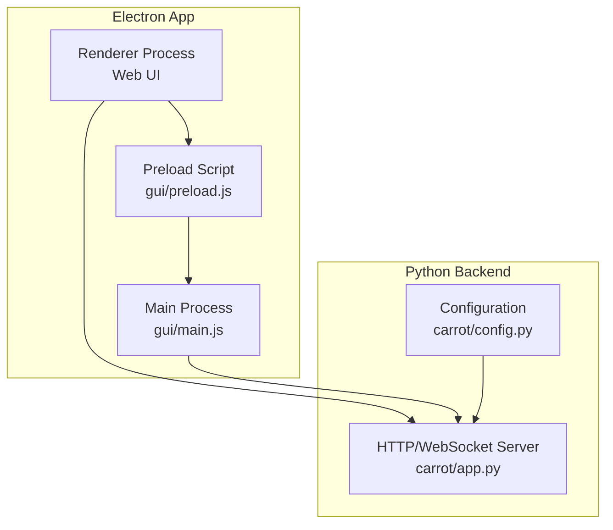
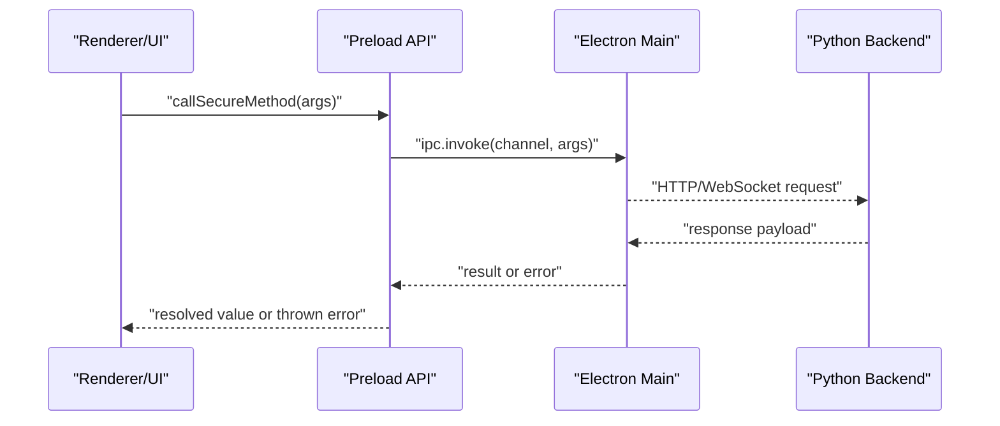
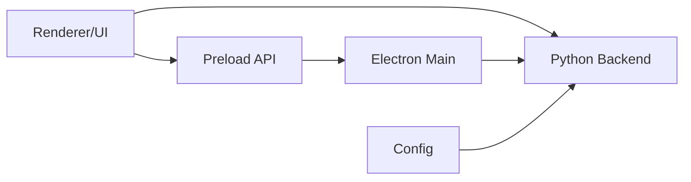

# IPC Communication

<cite>
**Referenced Files in This Document**
- [main.js](file://gui/main.js)
- [preload.js](file://gui/preload.js)
- [app.py](file://carrot/app.py)
- [config.py](file://carrot/config.py)
- [package.json](file://gui/package.json)
- [vite.config.js](file://gui/vite.config.js)
- [index.html](file://carrot/web/index.html)
- [app.js](file://carrot/web/js/app.js)
- [search.js](file://carrot/web/js/search.js)
</cite>

## Table of Contents
1. [Introduction](#introduction)
2. [Project Structure](#project-structure)
3. [Core Components](#core-components)
4. [Architecture Overview](#architecture-overview)
5. [Detailed Component Analysis](#detailed-component-analysis)
6. [Dependency Analysis](#dependency-analysis)
7. [Performance Considerations](#performance-considerations)
8. [Troubleshooting Guide](#troubleshooting-guide)
9. [Conclusion](#conclusion)

## Introduction
This document explains the Inter-Process Communication (IPC) patterns used by the Carrot application, focusing on:
- Electron main and renderer processes communicating via a preload script and message passing channels
- The web interface’s communication with the Python backend over HTTP and WebSocket APIs
- Event handling, error propagation, and security considerations for IPC channels
- Performance optimization techniques and debugging strategies for cross-process communication

The goal is to provide both high-level architecture understanding and practical guidance for developers working on or extending the IPC layer.

## Project Structure
Carrot uses an Electron-based GUI layered over a Python backend:
- Electron main process orchestrates the application lifecycle and exposes secure IPC channels through a preload script
- Renderer processes (web UI) interact with the preload API rather than calling Node/Electron APIs directly
- The Python backend serves HTTP endpoints and optional WebSocket channels for real-time features

**Diagram sources**
- [main.js](file://gui/main.js)
- [preload.js](file://gui/preload.js)
- [app.py](file://carrot/app.py)
- [config.py](file://carrot/config.py)

**Section sources**
- [main.js](file://gui/main.js)
- [preload.js](file://gui/preload.js)
- [app.py](file://carrot/app.py)
- [config.py](file://carrot/config.py)

## Core Components
- Electron Main Process: Initializes the app, manages windows, and registers IPC handlers that bridge to backend services or system resources.
- Preload Script: Exposes a minimal, typed API to the renderer via contextBridge, sanitizing inputs and enforcing channel policies.
- Renderer/Web UI: Uses the preload API to request actions and listen for events; communicates with the Python backend via fetch/axios and WebSocket clients.
- Python Backend: Provides REST endpoints and WebSocket routes for data operations, background tasks, and streaming responses.

Key responsibilities:
- Enforce least privilege by exposing only necessary methods from preload
- Serialize payloads consistently (JSON for HTTP, structured messages for WebSocket)
- Centralize error mapping across IPC boundaries to ensure consistent error shapes

**Section sources**
- [main.js](file://gui/main.js)
- [preload.js](file://gui/preload.js)
- [app.py](file://carrot/app.py)
- [config.py](file://carrot/config.py)

## Architecture Overview
The IPC architecture follows a clear separation of concerns:
- Renderer calls preload functions (no direct Node/Electron access)
- Preload validates and forwards requests to main process IPC handlers
- Main process coordinates with backend services and returns results
- Web UI may also call Python backend directly for data operations

**Diagram sources**
- [preload.js](file://gui/preload.js)
- [main.js](file://gui/main.js)
- [app.py](file://carrot/app.py)

## Detailed Component Analysis

### Electron Main Process (gui/main.js)
Responsibilities:
- Create and manage BrowserWindow instances
- Register IPC channels for privileged operations
- Coordinate with the Python backend (e.g., starting/stopping services, issuing commands)
- Handle errors and return standardized responses to preload

Best practices:
- Use explicit channel names and validate arguments
- Avoid exposing raw Node modules; wrap functionality in safe handlers
- Implement timeouts and cancellation where appropriate

Security considerations:
- Whitelist allowed channels
- Sanitize and validate all incoming payloads
- Disable unnecessary Node integration in renderer contexts

**Section sources**
- [main.js](file://gui/main.js)

### Preload Script (gui/preload.js)
Responsibilities:
- Bridge selected APIs to the renderer using contextBridge
- Define typed methods that map to specific IPC channels
- Normalize error objects and handle async flows

Patterns:
- One method per channel to keep the surface area small
- Consistent payload shape for requests and responses
- Centralized error transformation to match frontend expectations

Security considerations:
- Only expose what is strictly needed
- Validate inputs before invoking IPC
- Avoid returning sensitive internal state unless explicitly required

**Section sources**
- [preload.js](file://gui/preload.js)

### Web Interface (carrot/web)
Components:
- index.html: Entry point for the web UI
- js/app.js: Application bootstrap, event wiring, and UI state management
- js/search.js: Search-related interactions and API calls

Communication patterns:
- HTTP requests to Python backend for CRUD and configuration
- WebSocket client for real-time updates and streaming
- Event-driven UI updates based on backend signals

Error handling:
- Network retries with exponential backoff
- User-friendly error messages mapped from backend codes
- Graceful degradation when backend is unavailable

**Section sources**
- [index.html](file://carrot/web/index.html)
- [app.js](file://carrot/web/js/app.js)
- [search.js](file://carrot/web/js/search.js)

### Python Backend (carrot/app.py)
Responsibilities:
- Serve HTTP endpoints for data and control operations
- Manage WebSocket connections for live updates
- Integrate with internal modules (e.g., speech, search, goals) and external tools

API design:
- REST endpoints with JSON payloads
- WebSocket messages with typed event names and payloads
- Consistent error response format

Performance:
- Async handlers for I/O-bound operations
- Connection pooling and caching where applicable
- Streaming responses for long-running tasks

**Section sources**
- [app.py](file://carrot/app.py)

### Configuration (carrot/config.py)
Responsibilities:
- Centralize environment-specific settings
- Provide defaults and validation for critical options (ports, flags, feature toggles)

Usage:
- Backend reads config at startup
- IPC channels can be gated by feature flags
- Runtime overrides supported for development/debugging

**Section sources**
- [config.py](file://carrot/config.py)

## Dependency Analysis
The following diagram shows how components depend on each other for IPC and backend communication:

**Diagram sources**
- [preload.js](file://gui/preload.js)
- [main.js](file://gui/main.js)
- [app.py](file://carrot/app.py)
- [config.py](file://carrot/config.py)

**Section sources**
- [package.json](file://gui/package.json)
- [vite.config.js](file://gui/vite.config.js)

## Performance Considerations
- Minimize IPC calls: Batch operations and debounce frequent events
- Prefer WebSocket streams for large or continuous data transfers
- Use efficient serialization formats (JSON is common; consider MessagePack if needed)
- Cache frequently accessed data in the renderer or preload layer
- Implement timeouts and cancellations to prevent hanging operations
- Profile network and IPC latency; identify bottlenecks early

[No sources needed since this section provides general guidance]

## Troubleshooting Guide
Common issues and strategies:
- Channel not found: Ensure preload maps the correct channel name and main registers it
- Serialization errors: Validate payload structure and types before sending
- CORS/network failures: Verify backend URL, ports, and CORS headers
- Memory leaks: Check for unbounded caches and event listeners
- Debugging:
  - Enable Electron devtools for renderer inspection
  - Log IPC messages with sanitized payloads
  - Use backend access logs and WebSocket traces
  - Add health-check endpoints to verify backend availability

**Section sources**
- [app.py](file://carrot/app.py)
- [config.py](file://carrot/config.py)

## Conclusion
Carrot’s IPC design separates concerns between Electron main, preload, renderer, and the Python backend. By restricting the preload surface, standardizing message formats, and centralizing error handling, the application achieves secure and maintainable cross-process communication. Following the performance and debugging recommendations will help keep the system responsive and easy to troubleshoot.

[No sources needed since this section summarizes without analyzing specific files]