# Integration Patterns

<cite>
**Referenced Files in This Document**
- [app.py](file://carrot/app.py)
- [main.py](file://carrot/main.py)
- [ollama_client.py](file://carrot/ollama_client.py)
- [computer_use.py](file://carrot/computer_use.py)
- [terminal.py](file://carrot/terminal.py)
- [config.py](file://carrot/config.py)
- [database.py](file://carrot/database.py)
- [conversation.py](file://carrot/conversation.py)
- [goals.py](file://carrot/goals.py)
- [leaderboard.py](file://carrot/leaderboard.py)
- [notes.py](file://carrot/notes.py)
- [recap.py](file://carrot/recap.py)
- [reminders.py](file://carrot/reminders.py)
- [search.py](file://carrot/search.py)
- [whisper_stt.py](file://carrot/speech/whisper_stt.py)
- [kokoro_tts.py](file://carrot/speech/kokoro_tts.py)
- [index.html](file://carrot/web/index.html)
- [app.js](file://carrot/web/js/app.js)
- [search.js](file://carrot/web/js/search.js)
- [style.css](file://carrot/web/css/style.css)
- [main.js](file://gui/main.js)
- [preload.js](file://gui/preload.js)
- [package.json](file://gui/package.json)
- [vite.config.js](file://gui/vite.config.js)
</cite>

## Table of Contents
1. [Introduction](#introduction)
2. [Project Structure](#project-structure)
3. [Core Components](#core-components)
4. [Architecture Overview](#architecture-overview)
5. [Detailed Component Analysis](#detailed-component-analysis)
6. [Dependency Analysis](#dependency-analysis)
7. [Performance Considerations](#performance-considerations)
8. [Troubleshooting Guide](#troubleshooting-guide)
9. [Conclusion](#conclusion)
10. [Appendices](#appendices)

## Introduction
This document explains the integration patterns used throughout the Carrot application. It focuses on how internal modules communicate with external systems such as the Ollama API, operating system commands, file system operations, and web interfaces. It also covers IPC mechanisms between Electron main and renderer processes, WebSocket communication patterns, and REST API integrations. Concrete examples include service adapters, protocol handlers, and error recovery strategies, along with security considerations, authentication patterns, and rate limiting implementations for external integrations.

## Project Structure
Carrot is composed of:
- A Python backend (carrot/) providing core services, CLI entry points, and a local web server for the UI.
- An Electron GUI (gui/) that provides a desktop shell and bridges to the Python backend via IPC.
- A lightweight web interface (carrot/web/) served by the Python backend.

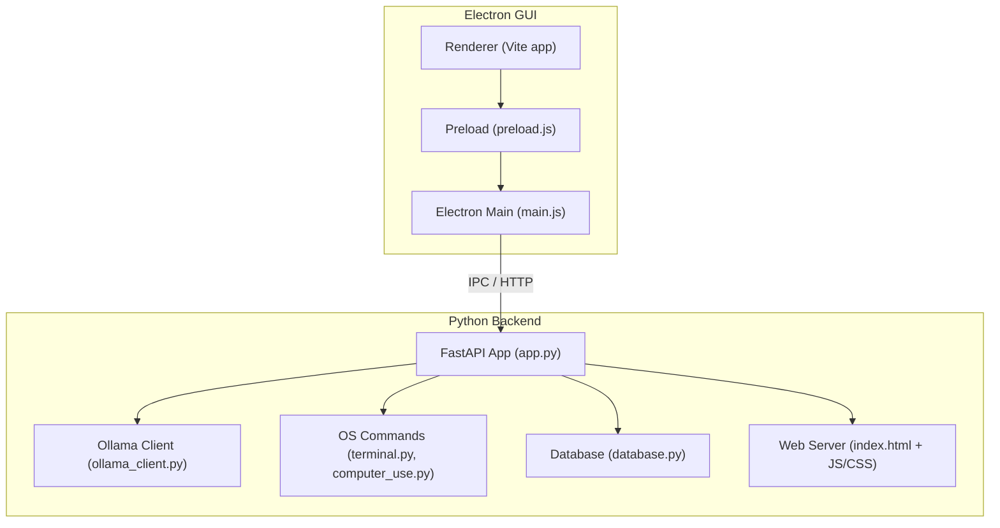

**Diagram sources**
- [main.js](file://gui/main.js)
- [preload.js](file://gui/preload.js)
- [app.py](file://carrot/app.py)
- [ollama_client.py](file://carrot/ollama_client.py)
- [terminal.py](file://carrot/terminal.py)
- [computer_use.py](file://carrot/computer_use.py)
- [database.py](file://carrot/database.py)
- [index.html](file://carrot/web/index.html)

**Section sources**
- [main.py](file://carrot/main.py)
- [app.py](file://carrot/app.py)
- [package.json](file://gui/package.json)
- [vite.config.js](file://gui/vite.config.js)

## Core Components
- Ollama client adapter: encapsulates HTTP calls to the Ollama API with retries and timeouts.
- OS command executor: runs terminal/system commands safely with input validation and output capture.
- Database module: manages persistent storage and queries for application state.
- Web server and UI: serves static assets and exposes endpoints consumed by both the Electron GUI and browser-based clients.
- Speech modules: STT and TTS adapters for audio processing.
- Feature modules: conversation, goals, leaderboard, notes, recap, reminders, search.

Key responsibilities and integration points are detailed in subsequent sections.

**Section sources**
- [ollama_client.py](file://carrot/ollama_client.py)
- [terminal.py](file://carrot/terminal.py)
- [computer_use.py](file://carrot/computer_use.py)
- [database.py](file://carrot/database.py)
- [app.py](file://carrot/app.py)
- [whisper_stt.py](file://carrot/speech/whisper_stt.py)
- [kokoro_tts.py](file://carrot/speech/kokoro_tts.py)

## Architecture Overview
The application follows a layered architecture:
- Presentation layer: Electron GUI and web UI.
- Application layer: Python FastAPI app orchestrating features and adapters.
- Integration layer: External APIs (Ollama), OS commands, file system, and database.

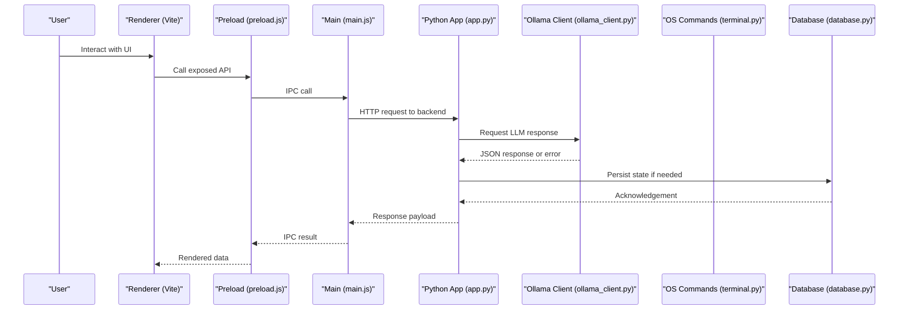

**Diagram sources**
- [app.js](file://carrot/web/js/app.js)
- [search.js](file://carrot/web/js/search.js)
- [main.js](file://gui/main.js)
- [preload.js](file://gui/preload.js)
- [app.py](file://carrot/app.py)
- [ollama_client.py](file://carrot/ollama_client.py)
- [terminal.py](file://carrot/terminal.py)
- [database.py](file://carrot/database.py)

## Detailed Component Analysis

### Ollama API Integration
- Adapter pattern: The Ollama client abstracts HTTP requests, headers, payloads, and responses.
- Error handling: Retries with exponential backoff, timeout configuration, and retryable error classification.
- Rate limiting: Token bucket or sliding window limiter can be applied at the client level to avoid throttling.
- Authentication: API key or bearer token passed via headers; secrets sourced from environment variables.
- Streaming: Optional streaming support for incremental responses where applicable.

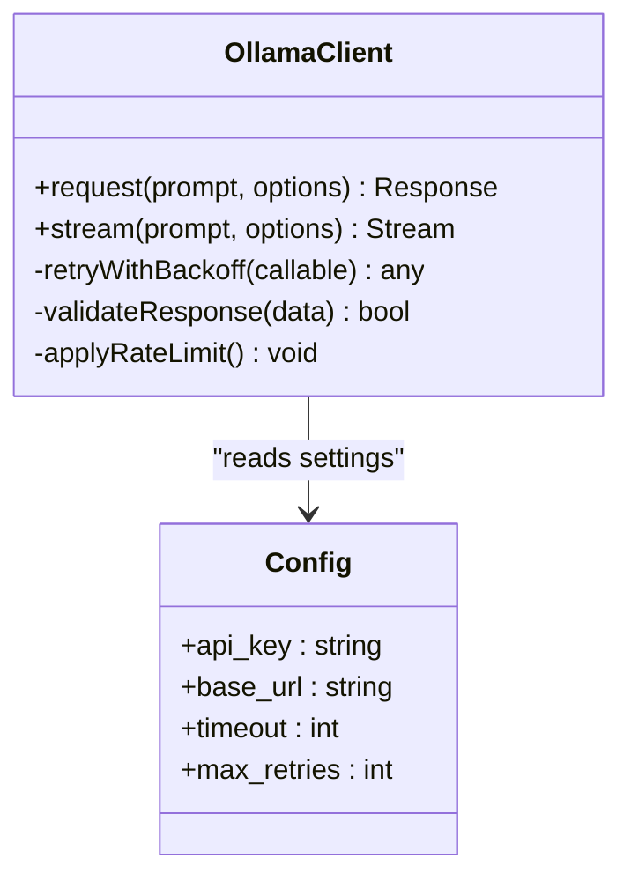

**Diagram sources**
- [ollama_client.py](file://carrot/ollama_client.py)
- [config.py](file://carrot/config.py)

**Section sources**
- [ollama_client.py](file://carrot/ollama_client.py)
- [config.py](file://carrot/config.py)

### Operating System Command Execution
- Safe execution: Input validation, allowlists for permitted commands, and sandboxing where possible.
- Output capture: Standard output/error captured and sanitized before returning to callers.
- Concurrency: Asynchronous execution to prevent blocking the main thread.
- Error recovery: Timeout enforcement, process termination on failure, and structured error messages.

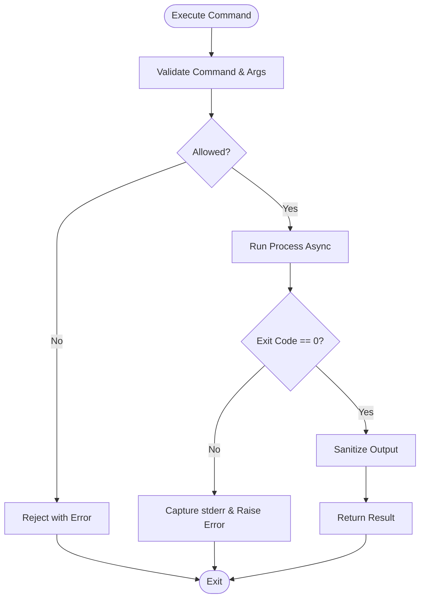

**Diagram sources**
- [terminal.py](file://carrot/terminal.py)
- [computer_use.py](file://carrot/computer_use.py)

**Section sources**
- [terminal.py](file://carrot/terminal.py)
- [computer_use.py](file://carrot/computer_use.py)

### File System Operations
- Path validation: Prevent directory traversal and restrict to allowed directories.
- Atomic writes: Use temporary files and rename to ensure consistency.
- Permissions: Enforce read-only modes where appropriate and validate user permissions.
- Error mapping: Translate OS errors into domain-specific exceptions.

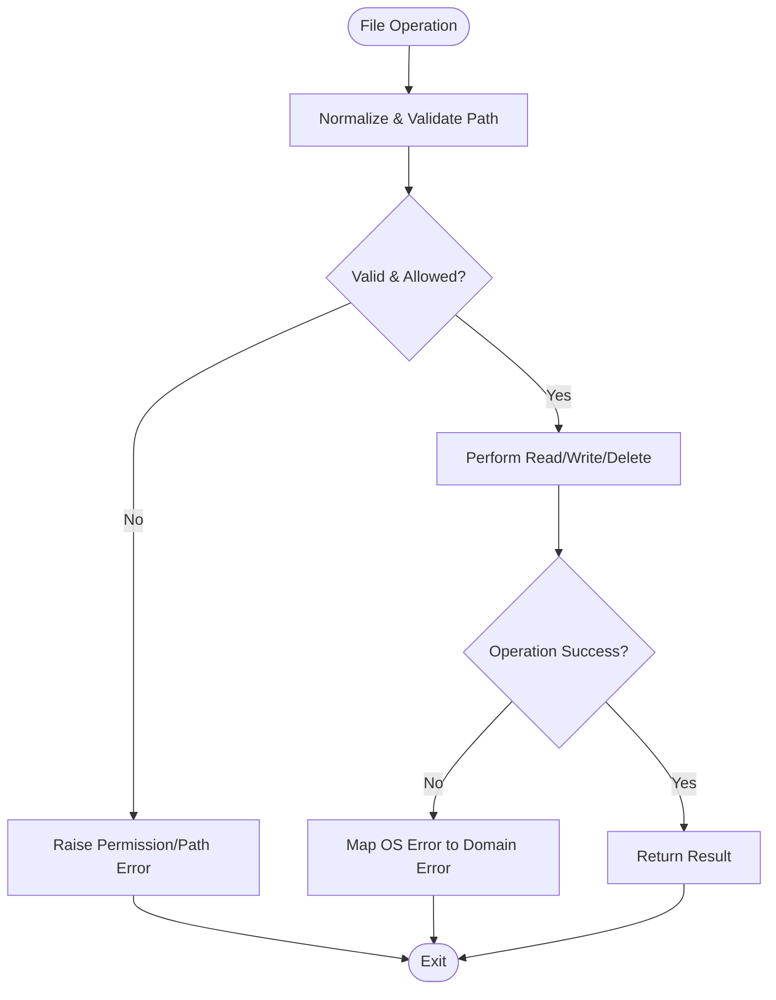

**Section sources**
- [database.py](file://carrot/database.py)
- [config.py](file://carrot/config.py)

### Web Interface and REST API
- Static assets: HTML, CSS, and JS served by the Python backend.
- API endpoints: Exposed through the FastAPI app for CRUD operations and feature orchestration.
- CORS and security: Configure origins, headers, and CSRF protection as needed.
- Client-side integration: JavaScript modules call endpoints and handle responses/errors.

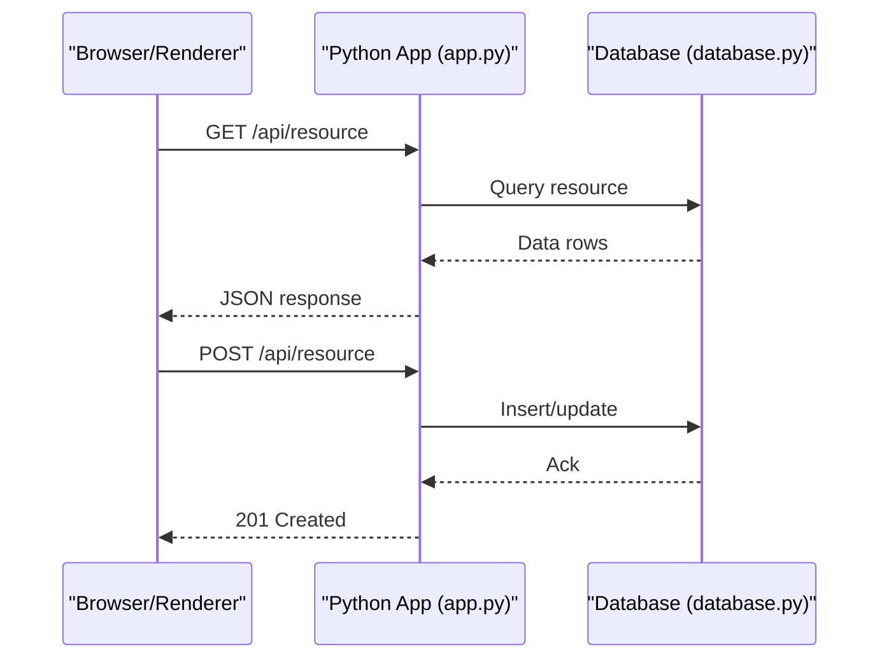

**Diagram sources**
- [app.py](file://carrot/app.py)
- [index.html](file://carrot/web/index.html)
- [app.js](file://carrot/web/js/app.js)
- [search.js](file://carrot/web/js/search.js)
- [database.py](file://carrot/database.py)

**Section sources**
- [app.py](file://carrot/app.py)
- [index.html](file://carrot/web/index.html)
- [app.js](file://carrot/web/js/app.js)
- [search.js](file://carrot/web/js/search.js)

### Electron IPC Between Main and Renderer
- Preload bridge: Exposes secure methods to the renderer via contextBridge.
- Main handler: Receives IPC events, performs privileged actions, and returns results.
- Renderer usage: Calls IPC methods like regular functions and handles async results.

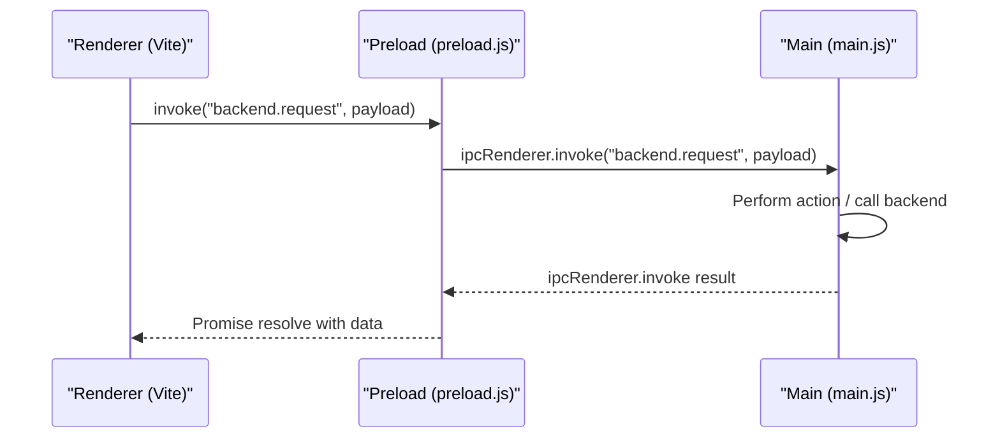

**Diagram sources**
- [main.js](file://gui/main.js)
- [preload.js](file://gui/preload.js)

**Section sources**
- [main.js](file://gui/main.js)
- [preload.js](file://gui/preload.js)

### WebSocket Communication Patterns
- Connection lifecycle: Establish, authenticate, subscribe to channels, handle messages, and close gracefully.
- Message schema: Typed payloads with versioning and error codes.
- Reconnection: Exponential backoff and jitter for transient failures.
- Backpressure: Queueing and flow control to prevent overwhelming consumers.

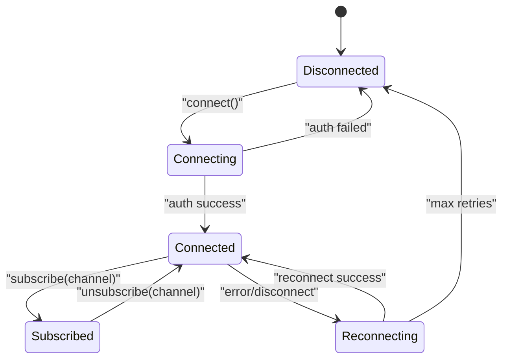

[No diagram sources since this section describes conceptual WebSocket patterns]

### Service Adapters and Protocol Handlers
- Adapter pattern: Encapsulate differences across external protocols (HTTP, WS, OS commands).
- Protocol handlers: Normalize inputs and outputs, map errors, and enforce contracts.
- Example modules: Ollama client, terminal executor, speech STT/TTS adapters.

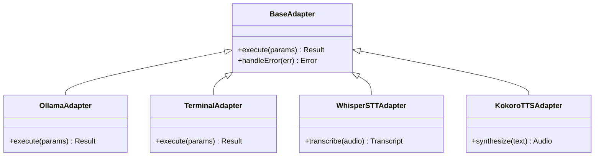

**Diagram sources**
- [ollama_client.py](file://carrot/ollama_client.py)
- [terminal.py](file://carrot/terminal.py)
- [whisper_stt.py](file://carrot/speech/whisper_stt.py)
- [kokoro_tts.py](file://carrot/speech/kokoro_tts.py)

**Section sources**
- [ollama_client.py](file://carrot/ollama_client.py)
- [terminal.py](file://carrot/terminal.py)
- [whisper_stt.py](file://carrot/speech/whisper_stt.py)
- [kokoro_tts.py](file://carrot/speech/kokoro_tts.py)

### Error Recovery Strategies
- Retry policies: Exponential backoff with jitter and max attempts.
- Circuit breaker: Fail fast when downstream services are unhealthy.
- Graceful degradation: Provide cached or partial results when external services fail.
- Structured logging: Include correlation IDs and context for debugging.

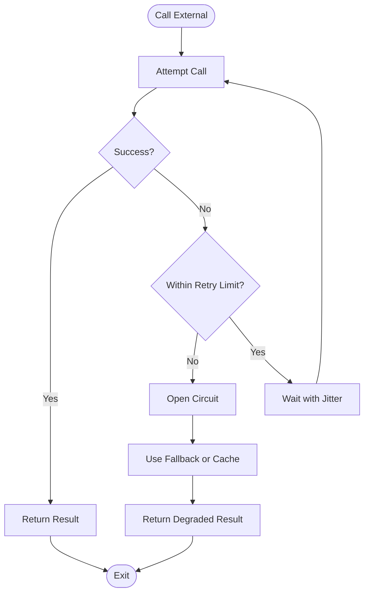

[No diagram sources since this section outlines general recovery patterns]

### Security Considerations and Authentication
- Secrets management: Load API keys and tokens from environment variables or secure stores.
- Input validation: Strict allowlists for commands and parameters; sanitize all user inputs.
- Authorization: Role-based access control for sensitive operations.
- Transport security: Enforce HTTPS for external communications and use TLS for local services when possible.
- Rate limiting: Apply per-user or global limits to protect against abuse.

**Section sources**
- [config.py](file://carrot/config.py)
- [app.py](file://carrot/app.py)
- [terminal.py](file://carrot/terminal.py)

### Rate Limiting Implementations
- Token bucket: Smooth traffic bursts while maintaining average throughput.
- Sliding window: Track request counts over time windows for fairness.
- Quotas: Per-endpoint or per-user quotas enforced at the gateway or adapter layer.

**Section sources**
- [ollama_client.py](file://carrot/ollama_client.py)
- [app.py](file://carrot/app.py)

## Dependency Analysis
Internal modules depend on adapters and shared configuration. The Python app coordinates feature modules and external integrations.

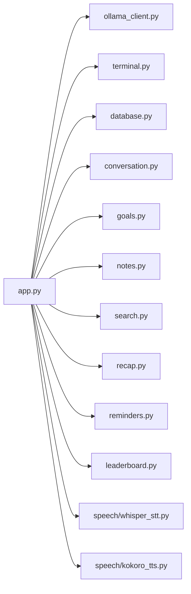

**Diagram sources**
- [app.py](file://carrot/app.py)
- [ollama_client.py](file://carrot/ollama_client.py)
- [terminal.py](file://carrot/terminal.py)
- [database.py](file://carrot/database.py)
- [conversation.py](file://carrot/conversation.py)
- [goals.py](file://carrot/goals.py)
- [notes.py](file://carrot/notes.py)
- [search.py](file://carrot/search.py)
- [recap.py](file://carrot/recap.py)
- [reminders.py](file://carrot/reminders.py)
- [leaderboard.py](file://carrot/leaderboard.py)
- [whisper_stt.py](file://carrot/speech/whisper_stt.py)
- [kokoro_tts.py](file://carrot/speech/kokoro_tts.py)

**Section sources**
- [app.py](file://carrot/app.py)

## Performance Considerations
- Concurrency: Use asynchronous I/O for network and OS calls to improve throughput.
- Caching: Cache frequent reads and expensive computations with TTLs.
- Streaming: Stream large responses to reduce memory pressure.
- Resource limits: Set timeouts and maximum payload sizes to prevent resource exhaustion.
- Profiling: Monitor latency and error rates for critical paths.

[No sources needed since this section provides general guidance]

## Troubleshooting Guide
- Network issues: Verify connectivity, proxy settings, and certificate configurations.
- Authentication failures: Check token validity, scopes, and expiration.
- Rate limiting: Inspect response headers and adjust limits or implement backoff.
- OS command errors: Review allowlists, permissions, and environment variables.
- Logging: Enable structured logs with correlation IDs and inspect error traces.

**Section sources**
- [app.py](file://carrot/app.py)
- [ollama_client.py](file://carrot/ollama_client.py)
- [terminal.py](file://carrot/terminal.py)

## Conclusion
Carrot’s integration patterns emphasize clear separation of concerns, robust error handling, and secure communication with external systems. By using adapters, protocol handlers, and well-defined IPC mechanisms, the application remains maintainable and resilient. Following the recommended security practices, rate limiting strategies, and performance optimizations will help ensure reliable operation in production environments.

## Appendices
- Configuration reference: Environment variables for API keys, base URLs, timeouts, and limits.
- API reference: Endpoints exposed by the Python backend and expected request/response schemas.
- IPC reference: Methods exposed by preload and handled by the Electron main process.

[No sources needed since this section lists references without analyzing specific files]