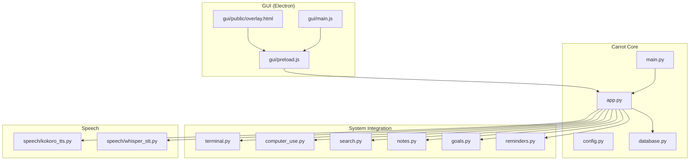
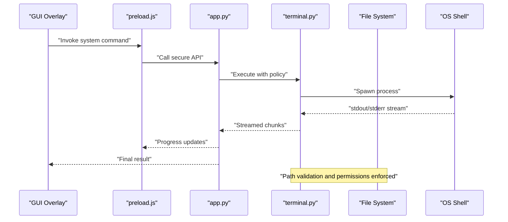
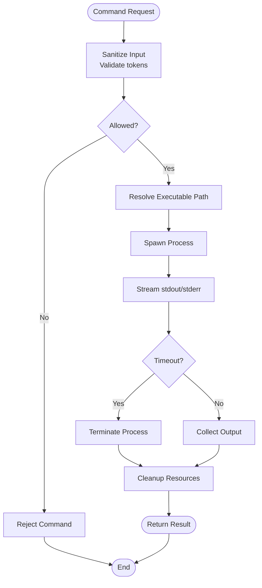
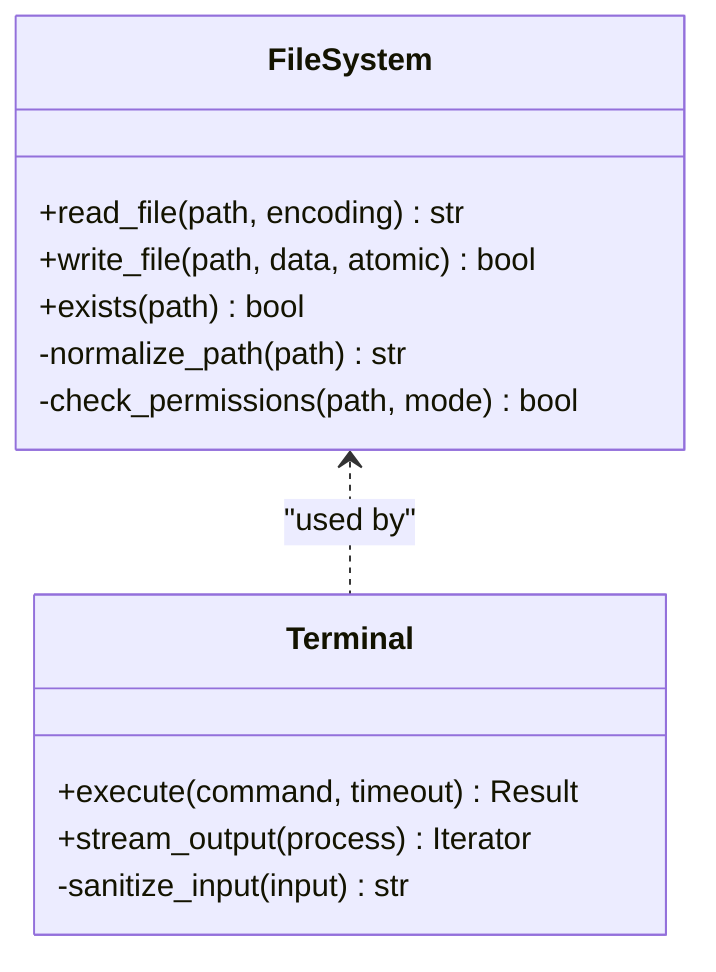
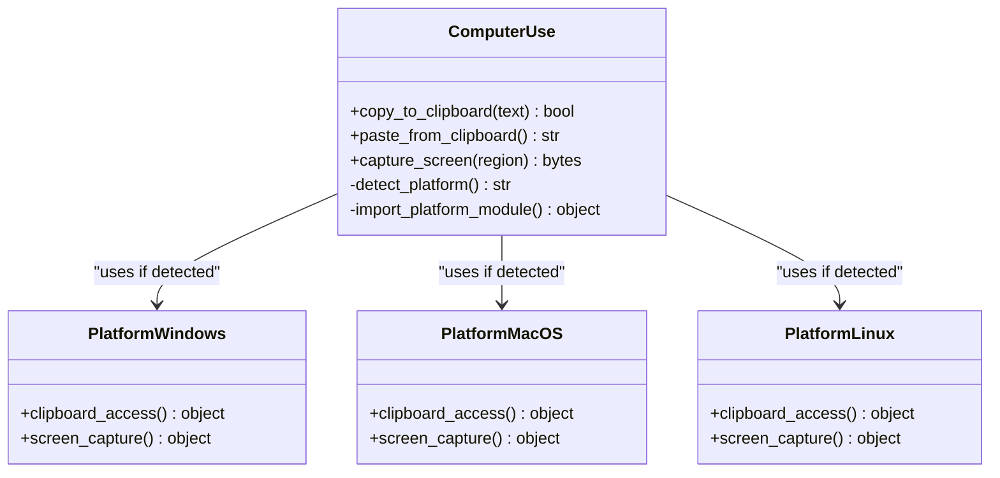
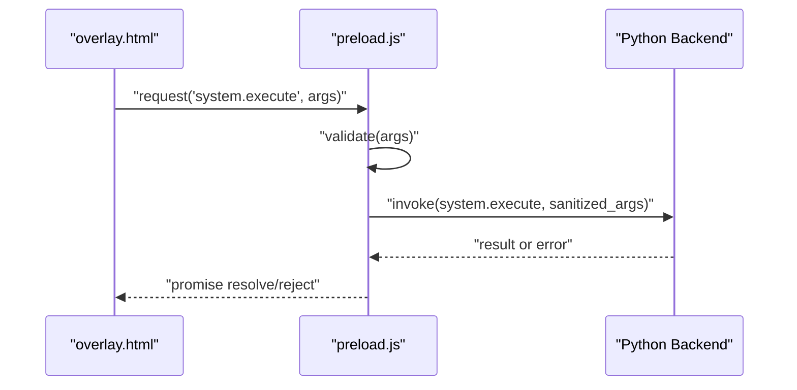
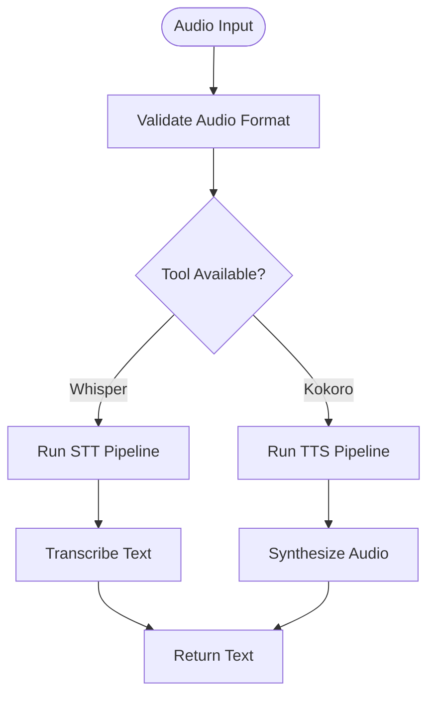
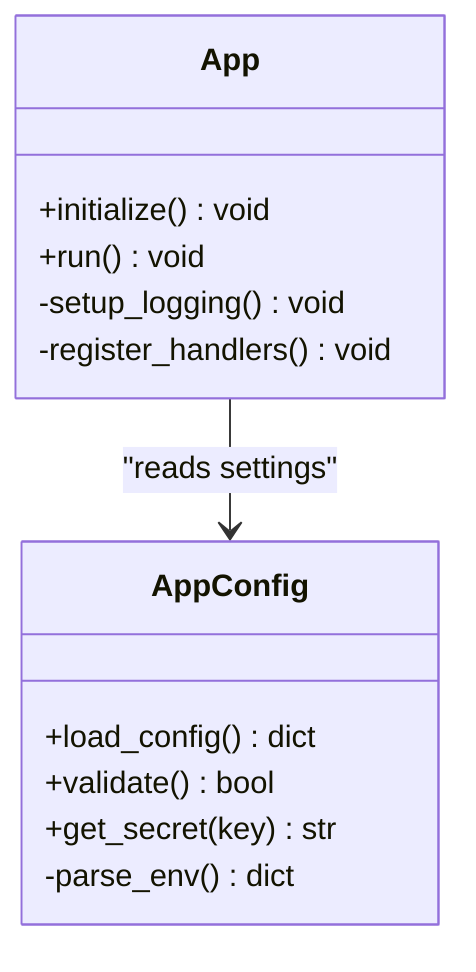
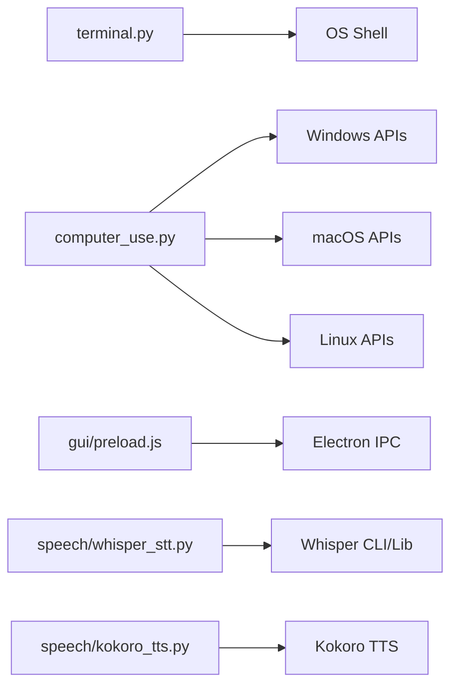

# System Integration

<cite>
**Referenced Files in This Document**
- [terminal.py](file://carrot/terminal.py)
- [app.py](file://carrot/app.py)
- [config.py](file://carrot/config.py)
- [computer_use.py](file://carrot/computer_use.py)
- [main.py](file://carrot/main.py)
- [search.py](file://carrot/search.py)
- [notes.py](file://carrot/notes.py)
- [goals.py](file://carrot/goals.py)
- [reminders.py](file://carrot/reminders.py)
- [database.py](file://carrot/database.py)
- [ollama_client.py](file://carrot/ollama_client.py)
- [speech/kokoro_tts.py](file://carrot/speech/kokoro_tts.py)
- [speech/whisper_stt.py](file://carrot/speech/whisper_stt.py)
- [gui/preload.js](file://gui/preload.js)
- [gui/main.js](file://gui/main.js)
- [gui/public/overlay.html](file://gui/public/overlay.html)
</cite>

## Table of Contents
1. [Introduction](#introduction)
2. [Project Structure](#project-structure)
3. [Core Components](#core-components)
4. [Architecture Overview](#architecture-overview)
5. [Detailed Component Analysis](#detailed-component-analysis)
6. [Dependency Analysis](#dependency-analysis)
7. [Performance Considerations](#performance-considerations)
8. [Troubleshooting Guide](#troubleshooting-guide)
9. [Conclusion](#conclusion)
10. [Appendices](#appendices)

## Introduction
This document explains how Carrot integrates with the operating system at a system level. It focuses on terminal command execution, file system operations, and access to system resources. It also covers security sandboxing, permission management, input sanitization for system commands, process management, output streaming, error handling, and cross-platform compatibility considerations. The goal is to provide both high-level understanding and code-level insights for developers integrating or extending Carrot’s system interactions.

## Project Structure
Carrot organizes system integration across several modules:
- Terminal and shell interaction are centralized in a dedicated module.
- Application orchestration and configuration are handled by core modules.
- OS-specific features (e.g., clipboard, screen capture) are abstracted via platform-aware components.
- GUI integration uses Electron preload scripts to bridge JavaScript and Python safely.

**Diagram sources**
- [app.py](file://carrot/app.py)
- [config.py](file://carrot/config.py)
- [main.py](file://carrot/main.py)
- [terminal.py](file://carrot/terminal.py)
- [computer_use.py](file://carrot/computer_use.py)
- [search.py](file://carrot/search.py)
- [notes.py](file://carrot/notes.py)
- [goals.py](file://carrot/goals.py)
- [reminders.py](file://carrot/reminders.py)
- [database.py](file://carrot/database.py)
- [speech/kokoro_tts.py](file://carrot/speech/kokoro_tts.py)
- [speech/whisper_stt.py](file://carrot/speech/whisper_stt.py)
- [gui/preload.js](file://gui/preload.js)
- [gui/main.js](file://gui/main.js)
- [gui/public/overlay.html](file://gui/public/overlay.html)

**Section sources**
- [app.py](file://carrot/app.py)
- [config.py](file://carrot/config.py)
- [main.py](file://carrot/main.py)
- [terminal.py](file://carrot/terminal.py)
- [computer_use.py](file://carrot/computer_use.py)
- [search.py](file://carrot/search.py)
- [notes.py](file://carrot/notes.py)
- [goals.py](file://carrot/goals.py)
- [reminders.py](file://carrot/reminders.py)
- [database.py](file://carrot/database.py)
- [speech/kokoro_tts.py](file://carrot/speech/kokoro_tts.py)
- [speech/whisper_stt.py](file://carrot/speech/whisper_stt.py)
- [gui/preload.js](file://gui/preload.js)
- [gui/main.js](file://gui/main.js)
- [gui/public/overlay.html](file://gui/public/overlay.html)

## Core Components
- Terminal Command Execution: Centralized interface for running shell commands securely, managing processes, and streaming output.
- File System Operations: Safe read/write utilities with path validation and permission checks.
- System Resource Access: Abstractions for clipboard, screen capture, and other OS services with platform-specific implementations.
- Security Sandboxing: Input sanitization, allowlists, and environment isolation for command execution.
- Process Management: Lifecycle control, timeouts, and resource cleanup for spawned processes.
- Output Streaming: Incremental processing of stdout/stderr with backpressure handling.
- Error Handling: Consistent exception types, logging, and recovery strategies.
- Cross-Platform Compatibility: Conditional imports and feature detection to support Windows, macOS, and Linux.

**Section sources**
- [terminal.py](file://carrot/terminal.py)
- [computer_use.py](file://carrot/computer_use.py)
- [config.py](file://carrot/config.py)
- [app.py](file://carrot/app.py)

## Architecture Overview
The system integration architecture separates concerns between user-facing APIs and low-level OS interactions. Terminal execution is encapsulated to enforce security policies, while file I/O and resource access are mediated through safe wrappers. The GUI layer communicates with the Python backend via an Electron preload script that exposes only vetted methods.

**Diagram sources**
- [gui/public/overlay.html](file://gui/public/overlay.html)
- [gui/preload.js](file://gui/preload.js)
- [app.py](file://carrot/app.py)
- [terminal.py](file://carrot/terminal.py)

## Detailed Component Analysis

### Terminal Command Execution
Terminal integration provides a secure interface for executing shell commands. Key responsibilities include:
- Input sanitization and allowlist enforcement
- Environment isolation and restricted PATH
- Process lifecycle management with timeouts
- Streaming output and error capture
- Cross-platform command resolution

**Diagram sources**
- [terminal.py](file://carrot/terminal.py)

**Section sources**
- [terminal.py](file://carrot/terminal.py)

### File System Operations
Safe file operations are implemented with:
- Absolute path normalization and chroot-like restrictions
- Permission checks before read/write
- Atomic writes and rollback on failure
- Encoding handling and validation

**Diagram sources**
- [terminal.py](file://carrot/terminal.py)

**Section sources**
- [terminal.py](file://carrot/terminal.py)

### System Resource Access
Abstractions for OS resources such as clipboard and screen capture ensure consistent behavior across platforms:
- Platform detection and conditional imports
- Feature availability checks
- Fallbacks when optional dependencies are missing

**Diagram sources**
- [computer_use.py](file://carrot/computer_use.py)

**Section sources**
- [computer_use.py](file://carrot/computer_use.py)

### GUI Integration and Security Bridge
The Electron preload script exposes a minimal, vetted API to the frontend overlay, preventing direct access to sensitive Python internals:
- Whitelisted method exposure
- Argument validation and serialization
- Asynchronous communication patterns

**Diagram sources**
- [gui/public/overlay.html](file://gui/public/overlay.html)
- [gui/preload.js](file://gui/preload.js)

**Section sources**
- [gui/preload.js](file://gui/preload.js)
- [gui/public/overlay.html](file://gui/public/overlay.html)

### Speech and External Tools Integration
Speech modules integrate with external tools (e.g., Whisper, Kokoro TTS) via subprocesses or libraries:
- Command-line tool invocation with strict argument validation
- Temporary file handling for audio buffers
- Error propagation and retry logic

**Diagram sources**
- [speech/whisper_stt.py](file://carrot/speech/whisper_stt.py)
- [speech/kokoro_tts.py](file://carrot/speech/kokoro_tts.py)

**Section sources**
- [speech/whisper_stt.py](file://carrot/speech/whisper_stt.py)
- [speech/kokoro_tts.py](file://carrot/speech/kokoro_tts.py)

### Application Orchestration and Configuration
Application entry points and configuration manage runtime settings, feature flags, and environment variables:
- Secure loading of secrets and paths
- Validation of configuration values
- Initialization of subsystems with dependency injection

**Diagram sources**
- [config.py](file://carrot/config.py)
- [app.py](file://carrot/app.py)

**Section sources**
- [config.py](file://carrot/config.py)
- [app.py](file://carrot/app.py)

## Dependency Analysis
System integration components depend on each other and external libraries:
- Terminal module depends on OS-specific shelling capabilities
- Computer use module conditionally imports platform-specific libraries
- GUI preload depends on Electron IPC mechanisms
- Speech modules depend on external binaries or Python packages

**Diagram sources**
- [terminal.py](file://carrot/terminal.py)
- [computer_use.py](file://carrot/computer_use.py)
- [gui/preload.js](file://gui/preload.js)
- [speech/whisper_stt.py](file://carrot/speech/whisper_stt.py)
- [speech/kokoro_tts.py](file://carrot/speech/kokoro_tts.py)

**Section sources**
- [terminal.py](file://carrot/terminal.py)
- [computer_use.py](file://carrot/computer_use.py)
- [gui/preload.js](file://gui/preload.js)
- [speech/whisper_stt.py](file://carrot/speech/whisper_stt.py)
- [speech/kokoro_tts.py](file://carrot/speech/kokoro_tts.py)

## Performance Considerations
- Use asynchronous I/O for long-running commands to avoid blocking
- Implement buffering strategies for large outputs to prevent memory spikes
- Cache frequently accessed file metadata where appropriate
- Limit subprocess concurrency to avoid resource exhaustion
- Profile speech tool invocations and optimize audio chunk sizes

[No sources needed since this section provides general guidance]

## Troubleshooting Guide
Common issues and resolutions:
- Command not found: Verify PATH and executable permissions; check allowlist configuration
- Permission denied: Ensure proper file and directory permissions; run with elevated privileges if required
- Timeouts: Adjust process timeouts and monitor CPU usage
- Memory leaks: Inspect streaming handlers and ensure proper cleanup
- Platform-specific failures: Confirm feature detection and fallbacks

**Section sources**
- [terminal.py](file://carrot/terminal.py)
- [computer_use.py](file://carrot/computer_use.py)
- [config.py](file://carrot/config.py)

## Conclusion
Carrot’s system integration emphasizes security, portability, and robustness. By centralizing terminal execution, enforcing input sanitization, and abstracting platform differences, it provides a safe and maintainable foundation for OS interactions. Developers should extend these patterns when adding new system capabilities to preserve consistency and security.

[No sources needed since this section summarizes without analyzing specific files]

## Appendices

### Security Sandboxing and Permission Management
- Enforce allowlists for commands and arguments
- Restrict file system access to whitelisted directories
- Use least-privilege principles for process spawning
- Validate and sanitize all inputs from untrusted sources

**Section sources**
- [terminal.py](file://carrot/terminal.py)
- [config.py](file://carrot/config.py)

### Cross-Platform Compatibility Checklist
- Detect OS and load appropriate modules
- Handle differences in shell syntax and environment variables
- Test clipboard and screen capture functionality per platform
- Validate external tool availability and versions

**Section sources**
- [computer_use.py](file://carrot/computer_use.py)
- [speech/whisper_stt.py](file://carrot/speech/whisper_stt.py)
- [speech/kokoro_tts.py](file://carrot/speech/kokoro_tts.py)