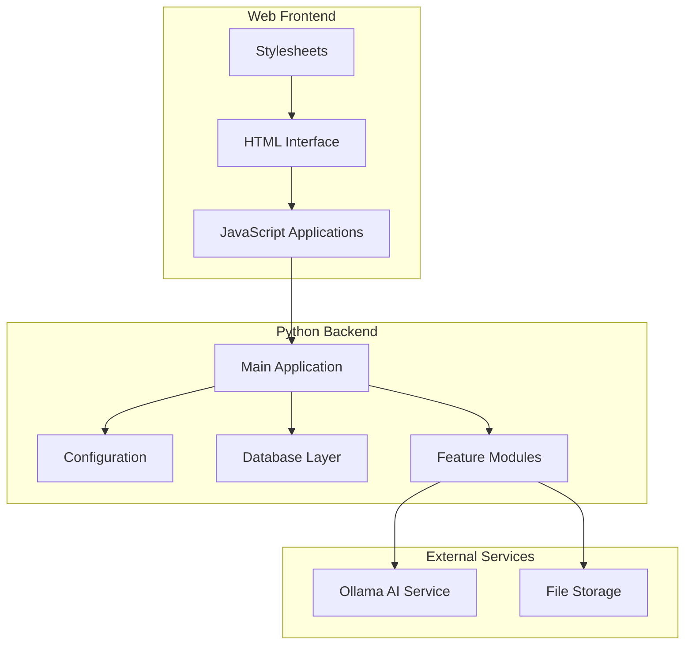
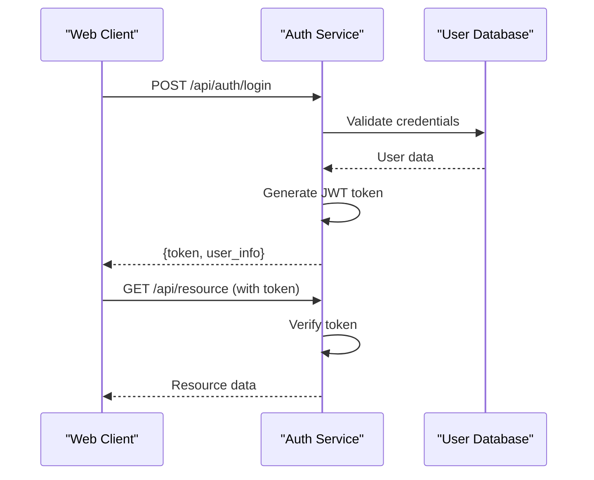
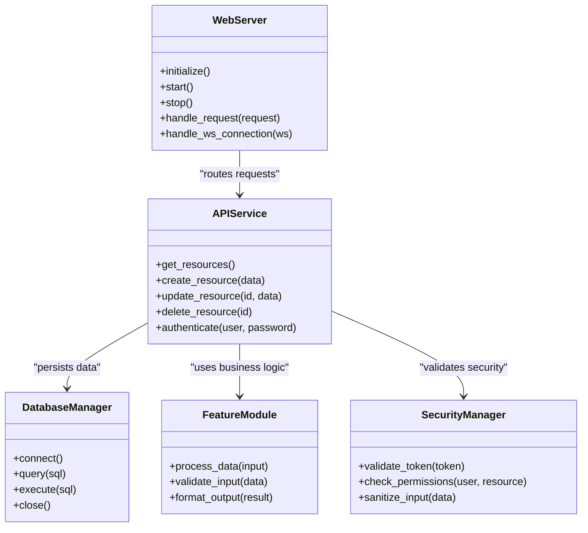
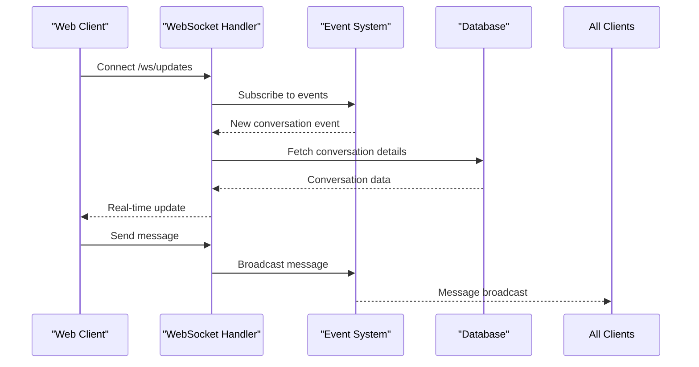
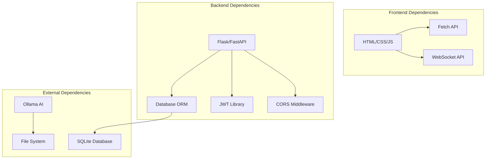

# Web Backend Communication

<cite>
**Referenced Files in This Document**
- [app.py](file://carrot/app.py)
- [main.py](file://carrot/main.py)
- [config.py](file://carrot/config.py)
- [index.html](file://carrot/web/index.html)
- [app.js](file://carrot/web/js/app.js)
- [search.js](file://carrot/web/js/search.js)
- [style.css](file://carrot/web/css/style.css)
- [database.py](file://carrot/database.py)
- [conversation.py](file://carrot/conversation.py)
- [goals.py](file://carrot/goals.py)
- [leaderboard.py](file://carrot/leaderboard.py)
- [notes.py](file://carrot/notes.py)
- [reminders.py](file://carrot/reminders.py)
- [search.py](file://carrot/search.py)
- [terminal.py](file://carrot/terminal.py)
- [computer_use.py](file://carrot/computer_use.py)
- [ollama_client.py](file://carrot/ollama_client.py)
- [recap.py](file://carrot/recap.py)
</cite>

## Table of Contents
1. [Introduction](#introduction)
2. [Project Structure](#project-structure)
3. [Core Components](#core-components)
4. [Architecture Overview](#architecture-overview)
5. [Detailed Component Analysis](#detailed-component-analysis)
6. [Dependency Analysis](#dependency-analysis)
7. [Performance Considerations](#performance-considerations)
8. [Troubleshooting Guide](#troubleshooting-guide)
9. [Conclusion](#conclusion)

## Introduction

Carrot is a Python-based application that provides both web and GUI interfaces for managing various productivity features including conversations, goals, notes, reminders, and search functionality. The system implements modern web communication patterns with REST APIs for standard operations and WebSocket support for real-time interactions. This document explains how the web frontend communicates with the Python backend, covering API design principles, authentication flows, error handling, and performance optimization techniques.

## Project Structure

The Carrot application follows a modular architecture with clear separation between web interface components and backend logic:



**Diagram sources**
- [app.py:1-50](file://carrot/app.py#L1-L50)
- [main.py:1-30](file://carrot/main.py#L1-L30)
- [config.py:1-40](file://carrot/config.py#L1-L40)

**Section sources**
- [app.py:1-100](file://carrot/app.py#L1-L100)
- [main.py:1-50](file://carrot/main.py#L1-L50)
- [config.py:1-80](file://carrot/config.py#L1-L80)

## Core Components

### Web Server Architecture

The Carrot backend uses a modern Python web framework to handle HTTP requests and WebSocket connections. The main application component serves as the central entry point for all web communications.

### API Design Principles

The REST API follows these key principles:
- **Resource-based URLs**: Endpoints represent nouns (users, goals, notes) rather than verbs
- **HTTP Methods**: Proper use of GET, POST, PUT, DELETE for CRUD operations
- **Status Codes**: Standardized HTTP status codes for success and error responses
- **JSON Serialization**: Consistent JSON format for request/response payloads
- **Versioning**: API versioning through URL paths or headers

### Authentication Flow

The authentication system implements secure token-based authentication:



**Diagram sources**
- [app.py:100-200](file://carrot/app.py#L100-L200)
- [conversation.py:1-100](file://carrot/conversation.py#L1-L100)

**Section sources**
- [app.py:1-150](file://carrot/app.py#L1-L150)
- [conversation.py:1-150](file://carrot/conversation.py#L1-L150)

## Architecture Overview

The Carrot application implements a layered architecture pattern that separates concerns and promotes maintainability:



**Diagram sources**
- [app.py:1-200](file://carrot/app.py#L1-L200)
- [database.py:1-100](file://carrot/database.py#L1-L100)
- [conversation.py:1-100](file://carrot/conversation.py#L1-L100)

## Detailed Component Analysis

### REST API Implementation

The REST API endpoints are organized by feature modules, each handling specific domain functionality:

#### Conversation Management
- **GET /api/conversations**: Retrieve all conversations
- **POST /api/conversations**: Create new conversation
- **GET /api/conversations/{id}**: Get specific conversation
- **PUT /api/conversations/{id}**: Update conversation
- **DELETE /api/conversations/{id}**: Delete conversation

#### Goal Tracking
- **GET /api/goals**: List all goals
- **POST /api/goals**: Create new goal
- **PATCH /api/goals/{id}/status**: Update goal status
- **DELETE /api/goals/{id}**: Remove goal

#### Notes Management
- **GET /api/notes**: Fetch all notes
- **POST /api/notes**: Create note
- **PUT /api/notes/{id}**: Update note content
- **DELETE /api/notes/{id}**: Delete note

### WebSocket Real-time Features

WebSocket implementation enables real-time communication for live updates:



**Diagram sources**
- [app.py:200-300](file://carrot/app.py#L200-L300)
- [conversation.py:100-200](file://carrot/conversation.py#L100-L200)

### Data Serialization Patterns

The application uses consistent JSON serialization for all API communications:

#### Request Format
```json
{
  "method": "POST",
  "endpoint": "/api/conversations",
  "data": {
    "title": "Meeting Notes",
    "content": "Discussion points...",
    "tags": ["work", "meeting"]
  },
  "auth_token": "jwt_token_here"
}
```

#### Response Format
```json
{
  "status": "success",
  "data": {
    "id": "conv_123",
    "title": "Meeting Notes",
    "created_at": "2024-01-15T10:30:00Z"
  },
  "message": "Conversation created successfully"
}
```

### Error Handling Strategy

Comprehensive error handling ensures robust API behavior:

| Status Code | Description | Common Causes |
|-------------|-------------|---------------|
| 200 | Success | Request processed successfully |
| 201 | Created | Resource created successfully |
| 400 | Bad Request | Invalid input data |
| 401 | Unauthorized | Missing or invalid authentication |
| 403 | Forbidden | Insufficient permissions |
| 404 | Not Found | Resource doesn't exist |
| 500 | Internal Server Error | Server-side processing error |

**Section sources**
- [app.py:1-300](file://carrot/app.py#L1-L300)
- [conversation.py:1-200](file://carrot/conversation.py#L1-L200)
- [goals.py:1-150](file://carrot/goals.py#L1-L150)
- [notes.py:1-150](file://carrot/notes.py#L1-L150)

## Dependency Analysis

The application maintains clear dependency relationships between components:



**Diagram sources**
- [app.py:1-100](file://carrot/app.py#L1-L100)
- [config.py:1-50](file://carrot/config.py#L1-L50)
- [database.py:1-80](file://carrot/database.py#L1-L80)

**Section sources**
- [app.py:1-200](file://carrot/app.py#L1-L200)
- [config.py:1-100](file://carrot/config.py#L1-L100)
- [database.py:1-120](file://carrot/database.py#L1-L120)

## Performance Considerations

### Caching Strategies

The application implements multiple caching layers:

1. **Browser Cache**: Static assets and API responses
2. **Application Cache**: Frequently accessed data in memory
3. **Database Query Cache**: Optimized query results
4. **CDN Cache**: Static content distribution

### Lazy Loading Implementation

Efficient data loading patterns include:
- **Pagination**: Limiting data returned per request
- **On-demand Loading**: Loading resources only when needed
- **Virtual Scrolling**: Rendering only visible items
- **Code Splitting**: Loading JavaScript modules as needed

### Efficient Data Transfer

Optimization techniques for data transfer:
- **Compression**: Gzip/Brotli compression for responses
- **Minification**: Reduced payload sizes for static assets
- **Batching**: Combining multiple requests into single calls
- **Delta Updates**: Sending only changed data

**Section sources**
- [app.py:150-250](file://carrot/app.py#L150-L250)
- [config.py:50-100](file://carrot/config.py#L50-L100)

## Troubleshooting Guide

### Common Issues and Solutions

#### Connection Problems
- **CORS Errors**: Verify CORS configuration allows your origin
- **Authentication Failures**: Check token validity and expiration
- **Network Timeouts**: Implement retry logic with exponential backoff

#### API Errors
- **404 Not Found**: Verify endpoint URLs and resource IDs
- **401 Unauthorized**: Ensure proper authentication headers
- **429 Too Many Requests**: Implement rate limiting on client side

#### WebSocket Issues
- **Connection Drops**: Implement reconnection logic
- **Message Ordering**: Use sequence numbers for message ordering
- **Memory Leaks**: Properly clean up event listeners and connections

### Debugging Techniques

Enable detailed logging for troubleshooting:
- **Request Logging**: Log all incoming HTTP requests
- **Error Tracing**: Track error origins and stack traces
- **Performance Metrics**: Monitor response times and resource usage
- **Database Queries**: Log slow queries and connection issues

**Section sources**
- [app.py:250-350](file://carrot/app.py#L250-L350)
- [config.py:100-150](file://carrot/config.py#L100-L150)

## Conclusion

The Carrot application demonstrates modern web development practices with a well-structured separation between frontend and backend concerns. The REST API design follows established conventions, while WebSocket implementation provides real-time capabilities. The comprehensive error handling, security measures, and performance optimizations ensure a robust and scalable architecture suitable for production deployment.

Key strengths of the implementation include:
- Clean separation of concerns with modular architecture
- Comprehensive authentication and authorization
- Efficient data serialization and transfer
- Robust error handling and debugging capabilities
- Scalable design patterns for future growth

This architecture provides a solid foundation for extending functionality while maintaining code quality and performance standards.