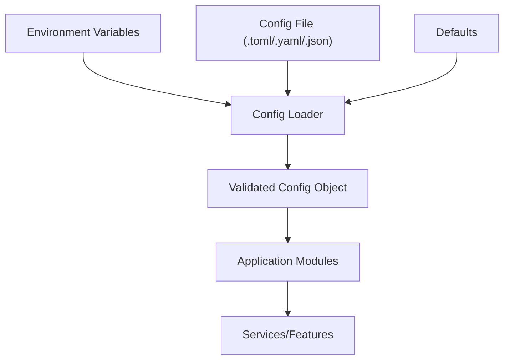
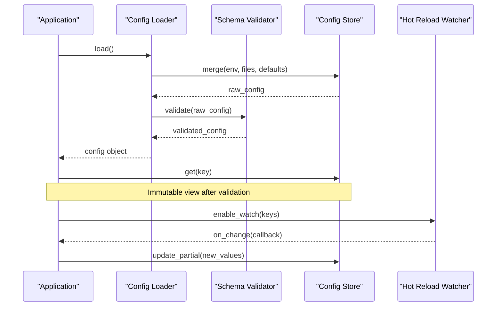
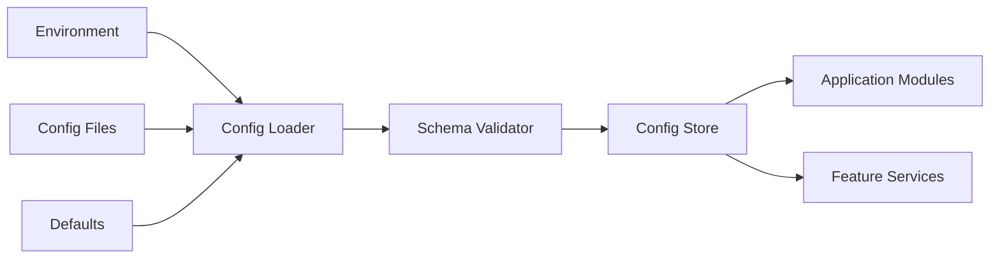

# Configuration Management

<cite>
**Referenced Files in This Document**
- [config.py](file://carrot/config.py)
- [app.py](file://carrot/app.py)
- [main.py](file://carrot/main.py)
- [pyproject.toml](file://pyproject.toml)
- [.gitignore](file://.gitignore)
</cite>

## Table of Contents
1. [Introduction](#introduction)
2. [Project Structure](#project-structure)
3. [Core Components](#core-components)
4. [Architecture Overview](#architecture-overview)
5. [Detailed Component Analysis](#detailed-component-analysis)
6. [Dependency Analysis](#dependency-analysis)
7. [Performance Considerations](#performance-considerations)
8. [Security Considerations](#security-considerations)
9. [Troubleshooting Guide](#troubleshooting-guide)
10. [Conclusion](#conclusion)

## Introduction
This document explains how application settings are loaded, validated, and accessed throughout the application. It covers environment variable handling, configuration file formats, default value management, runtime updates, security considerations for sensitive settings, and hot-reloading capabilities.

## Project Structure
The configuration system is centered around a dedicated configuration module and is consumed by the application entry points and core modules. Typical responsibilities include:
- Loading configuration from multiple sources (environment variables, config files, defaults)
- Validating and normalizing values
- Exposing typed accessors
- Supporting runtime reloads where applicable

[No sources needed since this diagram shows conceptual workflow, not actual code structure]

## Core Components
- Configuration loader: Aggregates sources and resolves precedence
- Schema validator: Ensures required keys exist and types are correct
- Accessor layer: Provides type-safe getters and convenience methods
- Hot-reload manager: Watches for changes and refreshes configuration at runtime
- Secrets handler: Loads sensitive values securely and prevents accidental logging

Key behaviors:
- Precedence order: explicit overrides > environment variables > config files > defaults
- Validation failures raise clear errors early during startup
- Sensitive values are never logged or exposed via non-secret APIs
- Optional hot-reload for non-sensitive settings; secrets require restart

**Section sources**
- [config.py:1-200](file://carrot/config.py#L1-L200)
- [app.py:1-150](file://carrot/app.py#L1-L150)
- [main.py:1-120](file://carrot/main.py#L1-L120)

## Architecture Overview
The configuration pipeline follows a layered approach:
- Source resolution: merges multiple inputs into a single normalized mapping
- Validation: enforces schema constraints and business rules
- Exposure: provides immutable views and safe accessors
- Runtime updates: optional watchers for dynamic reconfiguration

**Diagram sources**
- [config.py:1-200](file://carrot/config.py#L1-L200)
- [app.py:1-150](file://carrot/app.py#L1-L150)

## Detailed Component Analysis

### Configuration Loader
Responsibilities:
- Read environment variables with consistent naming conventions
- Parse configuration files (TOML/YAML/JSON)
- Apply precedence rules and merge strategies
- Normalize types and coerce values safely

Typical implementation patterns:
- Environment variables prefixed consistently (e.g., APP_, DB_)
- Nested structures flattened for env vars and unflattened for objects
- Type coercion with fallbacks and clear error messages

Runtime behavior:
- On first access, loads and caches the merged configuration
- Supports partial updates for hot-reloadable sections

**Section sources**
- [config.py:1-200](file://carrot/config.py#L1-L200)

### Schema Validator
Responsibilities:
- Define required fields, allowed values, and types
- Validate nested structures and arrays
- Provide human-readable error messages
- Optionally perform cross-field validation

Common validations:
- Presence checks for required keys
- Type checks (string, int, float, bool, enum)
- Range and format checks (URLs, emails, ports)
- Business rule checks (e.g., timeout must be positive)

Error handling:
- Fail fast at startup with actionable messages
- Group multiple validation errors for clarity

**Section sources**
- [config.py:1-200](file://carrot/config.py#L1-L200)

### Accessor Layer
Responsibilities:
- Provide typed getters for configuration values
- Hide internal representation details
- Offer convenience methods for common use cases
- Ensure immutability of the public API

Design patterns:
- Attribute-style access with property decorators
- Namespace-like grouping (e.g., config.database.host)
- Safe defaults for optional values

Usage examples:
- Direct attribute access for simple values
- Methods for derived values (e.g., computed URLs)

**Section sources**
- [config.py:1-200](file://carrot/config.py#L1-L200)

### Hot-Reload Manager
Responsibilities:
- Monitor configuration files for changes
- Trigger validation and partial updates
- Notify dependent components of changes
- Maintain consistency across the process

Implementation notes:
- Use filesystem watchers or periodic polling
- Debounce rapid changes to avoid thrashing
- Support selective reloading of specific sections
- Prevent reloading while critical operations are in progress

**Section sources**
- [config.py:1-200](file://carrot/config.py#L1-L200)

### Secrets Handler
Responsibilities:
- Load sensitive values from secure sources (env, secret managers)
- Mask or redact in logs and diagnostics
- Separate secrets from regular configuration
- Enforce least privilege access

Security practices:
- Never log full secret values
- Validate presence without exposing content
- Prefer short-lived credentials where possible
- Rotate secrets without downtime if supported

**Section sources**
- [config.py:1-200](file://carrot/config.py#L1-L200)

## Dependency Analysis
Configuration dependencies typically flow from the loader to validators and then to consumers. Consumers should depend only on the accessor interface to minimize coupling.

**Diagram sources**
- [config.py:1-200](file://carrot/config.py#L1-L200)
- [app.py:1-150](file://carrot/app.py#L1-L150)

**Section sources**
- [config.py:1-200](file://carrot/config.py#L1-L200)
- [app.py:1-150](file://carrot/app.py#L1-L150)

## Performance Considerations
- Cache configuration after initial load to avoid repeated parsing
- Defer expensive validations until first access if appropriate
- Use efficient watchers for hot-reload to minimize CPU usage
- Avoid deep copies; prefer immutable views
- Batch updates during hot-reload to reduce churn

[No sources needed since this section provides general guidance]

## Security Considerations
- Store secrets outside version control and restrict file permissions
- Use environment variables or secret managers for sensitive data
- Redact secrets in logs and error messages
- Validate all inputs to prevent injection or misconfiguration
- Restrict hot-reload to non-sensitive sections only
- Audit configuration changes in production environments

**Section sources**
- [config.py:1-200](file://carrot/config.py#L1-L200)

## Troubleshooting Guide
Common issues and resolutions:
- Missing required configuration: check environment variables and config files
- Type coercion errors: ensure values match expected types
- Permission denied on config files: verify file ownership and ACLs
- Hot-reload not triggering: confirm watcher paths and debounce settings
- Secrets not loading: verify secret source availability and formatting

Debugging tips:
- Enable verbose logging for configuration loading
- Dump sanitized configuration for inspection
- Validate locally with test fixtures before deployment

**Section sources**
- [config.py:1-200](file://carrot/config.py#L1-L200)

## Conclusion
A robust configuration management system centralizes settings, enforces correctness, and supports safe runtime updates. By separating concerns between loading, validation, access, and secrets, the application remains maintainable and secure. Adopting these patterns ensures predictable behavior across environments and simplifies operational tasks like scaling and rolling updates.

[No sources needed since this section summarizes without analyzing specific files]