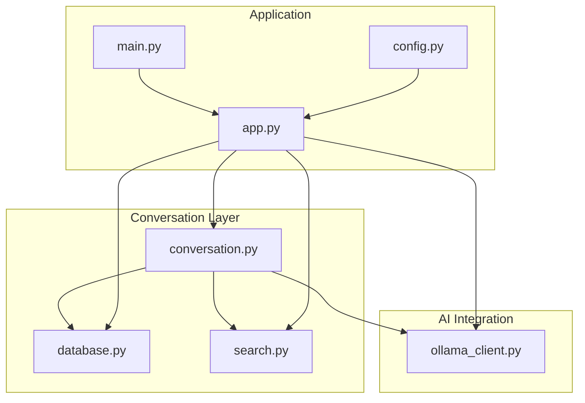
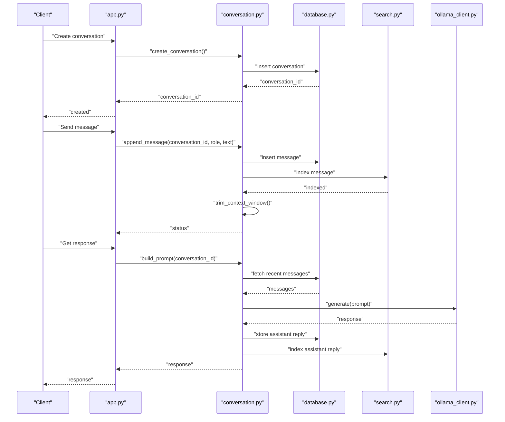
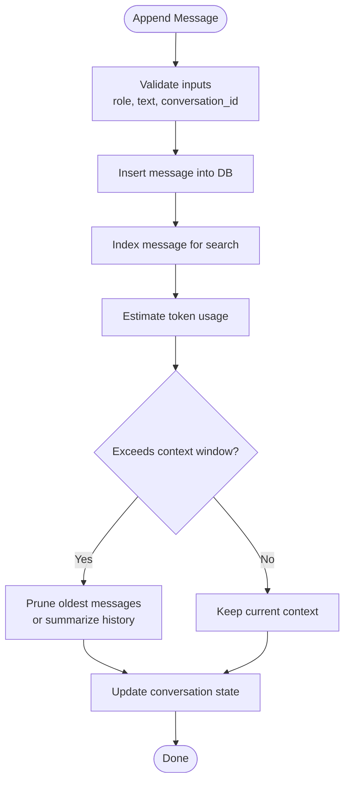
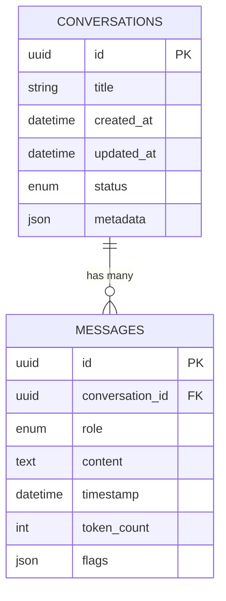
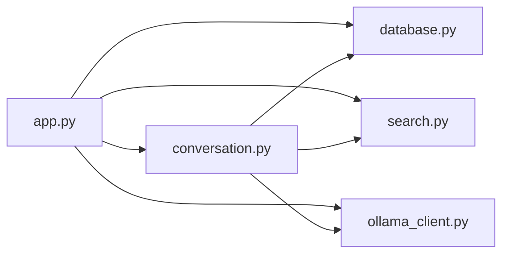

# Conversation System

<cite>
**Referenced Files in This Document**
- [conversation.py](file://carrot/conversation.py)
- [database.py](file://carrot/database.py)
- [app.py](file://carrot/app.py)
- [ollama_client.py](file://carrot/ollama_client.py)
- [search.py](file://carrot/search.py)
- [config.py](file://carrot/config.py)
- [main.py](file://carrot/main.py)
</cite>

## Table of Contents
1. [Introduction](#introduction)
2. [Project Structure](#project-structure)
3. [Core Components](#core-components)
4. [Architecture Overview](#architecture-overview)
5. [Detailed Component Analysis](#detailed-component-analysis)
6. [Dependency Analysis](#dependency-analysis)
7. [Performance Considerations](#performance-considerations)
8. [Troubleshooting Guide](#troubleshooting-guide)
9. [Conclusion](#conclusion)

## Introduction
This document explains the conversation management system, focusing on message history tracking, context preservation, and conversation state management. It covers the conversation lifecycle, memory and context window handling, persistence, search capabilities, and integration with AI models for context-aware responses. The goal is to make the system understandable for both technical and non-technical readers while providing concrete references to the codebase.

## Project Structure
The conversation system spans several modules:
- Conversation model and lifecycle logic
- Database persistence and schema
- API endpoints and orchestration
- AI client integration for model calls
- Search indexing and retrieval
- Configuration and application entry points

**Diagram sources**
- [main.py](file://carrot/main.py)
- [app.py](file://carrot/app.py)
- [conversation.py](file://carrot/conversation.py)
- [database.py](file://carrot/database.py)
- [search.py](file://carrot/search.py)
- [ollama_client.py](file://carrot/ollama_client.py)
- [config.py](file://carrot/config.py)

**Section sources**
- [main.py](file://carrot/main.py)
- [app.py](file://carrot/app.py)
- [conversation.py](file://carrot/conversation.py)
- [database.py](file://carrot/database.py)
- [search.py](file://carrot/search.py)
- [ollama_client.py](file://carrot/ollama_client.py)
- [config.py](file://carrot/config.py)

## Core Components
- Conversation manager: encapsulates creation, loading, appending messages, trimming context windows, and exporting summaries.
- Persistence layer: stores conversations and messages in a durable store (e.g., SQLite), supports queries and migrations.
- Search index: indexes messages and metadata to enable full-text or keyword search across conversations.
- AI client: wraps model calls, constructs prompts from conversation context, and handles streaming or batched responses.
- Application controller: exposes HTTP endpoints or CLI commands that orchestrate conversation operations and integrate with search and AI.

Key responsibilities:
- Message history tracking: append, retrieve, paginate, and truncate messages based on token budget.
- Context preservation: maintain user/system roles, timestamps, and optional flags for summarization or archival.
- State management: track active conversation IDs, last-accessed times, and lifecycle states (active, archived).
- Memory management: enforce context window limits by pruning older messages or compressing via summaries.
- Persistence: ensure durability and consistency across restarts; support backup/restore.
- Search: index content and metadata; provide fast retrieval and filtering.
- AI integration: build prompts from context, handle retries, timeouts, and error propagation.

**Section sources**
- [conversation.py](file://carrot/conversation.py)
- [database.py](file://carrot/database.py)
- [search.py](file://carrot/search.py)
- [ollama_client.py](file://carrot/ollama_client.py)
- [app.py](file://carrot/app.py)
- [config.py](file://carrot/config.py)

## Architecture Overview
The system follows a layered architecture:
- Presentation/API layer: app.py exposes endpoints or CLI commands.
- Business logic: conversation.py implements lifecycle and context management.
- Data layer: database.py persists conversations and messages; search.py provides indexing and retrieval.
- External integration: ollama_client.py communicates with AI models.

**Diagram sources**
- [app.py](file://carrot/app.py)
- [conversation.py](file://carrot/conversation.py)
- [database.py](file://carrot/database.py)
- [search.py](file://carrot/search.py)
- [ollama_client.py](file://carrot/ollama_client.py)

## Detailed Component Analysis

### Conversation Manager
Responsibilities:
- Create and load conversations by ID.
- Append user and assistant messages with roles and timestamps.
- Maintain context window using token estimation and truncation strategies.
- Export summaries or snapshots for archival.
- Manage lifecycle states (active, paused, archived).

Context window handling:
- Estimate tokens per message and cumulative tokens.
- Prune oldest messages when exceeding configured limit.
- Optionally compress historical segments into summaries before pruning.

State management:
- Track last-accessed time for eviction policies.
- Enforce maximum number of concurrent active conversations.

**Diagram sources**
- [conversation.py](file://carrot/conversation.py)
- [database.py](file://carrot/database.py)
- [search.py](file://carrot/search.py)

**Section sources**
- [conversation.py](file://carrot/conversation.py)

### Persistence Layer
Responsibilities:
- Define schemas for conversations and messages.
- Provide CRUD operations with transactional safety.
- Support pagination and filtering by conversation_id, role, timestamp.
- Handle migrations and backups.

Data model highlights:
- Conversations: id, title, created_at, updated_at, status, metadata.
- Messages: id, conversation_id, role, content, timestamp, token_count, flags.

**Diagram sources**
- [database.py](file://carrot/database.py)

**Section sources**
- [database.py](file://carrot/database.py)

### Search Index
Responsibilities:
- Index message content and metadata for fast retrieval.
- Support keyword search, filters by conversation_id, role, date range.
- Re-index on updates and deletions.

Operations:
- Index new messages.
- Query with filters and pagination.
- Delete indexed entries on message removal.

**Section sources**
- [search.py](file://carrot/search.py)

### AI Client Integration
Responsibilities:
- Construct prompts from conversation context.
- Call model APIs with retries and timeouts.
- Stream or batch responses; parse and validate outputs.
- Handle errors and propagate meaningful messages.

Prompt construction:
- Assemble system prompt, user instructions, and recent messages within context window.
- Include metadata like timestamps and roles.

**Section sources**
- [ollama_client.py](file://carrot/ollama_client.py)

### Application Controller
Responsibilities:
- Expose endpoints for conversation CRUD and messaging.
- Orchestrate persistence, search indexing, and AI calls.
- Enforce rate limits and quotas.
- Return structured responses and error codes.

Typical flows:
- Create conversation: instantiate, persist, return ID.
- Send message: append, index, trim context, generate response, store reply.
- Retrieve history: fetch paginated messages with filters.
- Search: query index and return results.

**Section sources**
- [app.py](file://carrot/app.py)

## Dependency Analysis
The conversation system has clear dependencies:
- app.py depends on conversation.py, database.py, search.py, and ollama_client.py.
- conversation.py depends on database.py, search.py, and ollama_client.py.
- database.py is foundational and used by conversation.py and app.py.
- search.py is used by conversation.py and app.py.
- ollama_client.py is used by conversation.py and app.py.

**Diagram sources**
- [app.py](file://carrot/app.py)
- [conversation.py](file://carrot/conversation.py)
- [database.py](file://carrot/database.py)
- [search.py](file://carrot/search.py)
- [ollama_client.py](file://carrot/ollama_client.py)

**Section sources**
- [app.py](file://carrot/app.py)
- [conversation.py](file://carrot/conversation.py)
- [database.py](file://carrot/database.py)
- [search.py](file://carrot/search.py)
- [ollama_client.py](file://carrot/ollama_client.py)

## Performance Considerations
- Token estimation accuracy: use conservative estimates to avoid overflows; periodically recalibrate.
- Truncation strategy: prefer summarization for long histories to preserve key context.
- Indexing efficiency: batch index updates; avoid re-indexing unchanged messages.
- Database queries: paginate large histories; use indexes on conversation_id and timestamp.
- AI calls: implement retries with exponential backoff; cache frequent prompts if appropriate.
- Concurrency: lock conversations during writes to prevent race conditions.

[No sources needed since this section provides general guidance]

## Troubleshooting Guide
Common issues and resolutions:
- Missing conversation ID: verify creation flow and persistence; check DB integrity.
- Context overflow: review token estimation and truncation thresholds; adjust configuration.
- Search failures: ensure indexing runs after inserts; rebuild index if corrupted.
- AI call errors: inspect network connectivity, model availability, and prompt formatting; add logging.
- Slow queries: analyze DB indexes; optimize pagination and filter usage.

Operational checks:
- Verify DB schema version and migrations.
- Confirm search index consistency with DB state.
- Monitor AI client latency and error rates.

**Section sources**
- [conversation.py](file://carrot/conversation.py)
- [database.py](file://carrot/database.py)
- [search.py](file://carrot/search.py)
- [ollama_client.py](file://carrot/ollama_client.py)
- [app.py](file://carrot/app.py)

## Conclusion
The conversation management system provides robust message history tracking, context preservation, and state management through a layered architecture. It integrates persistence, search, and AI model calls to deliver context-aware responses. By carefully managing context windows, indexing efficiently, and handling errors gracefully, the system scales to support rich conversational experiences.

[No sources needed since this section summarizes without analyzing specific files]