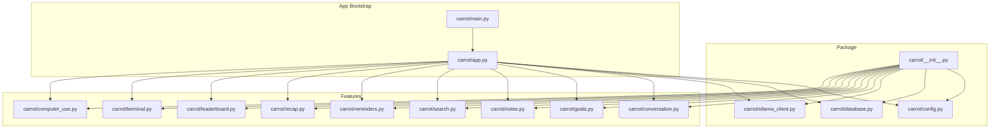
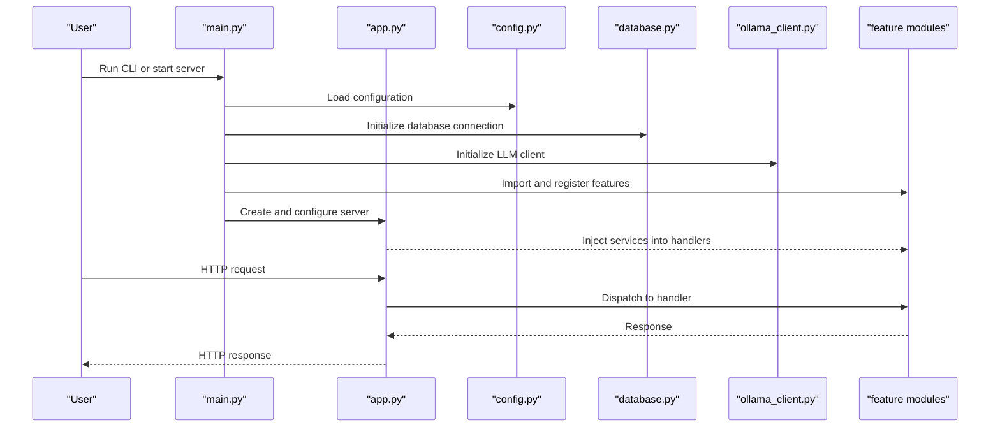
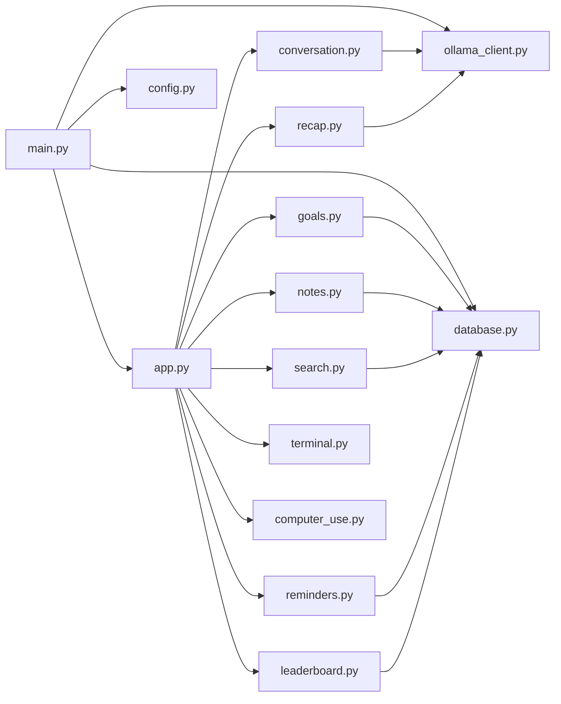

# Core Modules

<cite>
**Referenced Files in This Document**
- [carrot/__init__.py](file://carrot/__init__.py)
- [carrot/main.py](file://carrot/main.py)
- [carrot/app.py](file://carrot/app.py)
- [carrot/config.py](file://carrot/config.py)
- [carrot/database.py](file://carrot/database.py)
- [carrot/conversation.py](file://carrot/conversation.py)
- [carrot/ollama_client.py](file://carrot/ollama_client.py)
- [carrot/goals.py](file://carrot/goals.py)
- [carrot/notes.py](file://carrot/notes.py)
- [carrot/search.py](file://carrot/search.py)
- [carrot/reminders.py](file://carrot/reminders.py)
- [carrot/recap.py](file://carrot/recap.py)
- [carrot/leaderboard.py](file://carrot/leaderboard.py)
- [carrot/terminal.py](file://carrot/terminal.py)
- [carrot/computer_use.py](file://carrot/computer_use.py)
</cite>

## Table of Contents
1. [Introduction](#introduction)
2. [Project Structure](#project-structure)
3. [Core Components](#core-components)
4. [Architecture Overview](#architecture-overview)
5. [Detailed Component Analysis](#detailed-component-analysis)
6. [Dependency Analysis](#dependency-analysis)
7. [Performance Considerations](#performance-considerations)
8. [Troubleshooting Guide](#troubleshooting-guide)
9. [Conclusion](#conclusion)

## Introduction
This document explains the Carrot application’s core modules, focusing on entry points, initialization sequence, module loading, dependency injection, and how services are made available across the app. It covers the package-level interface in __init__.py, the CLI/application bootstrap in main.py, and the web server setup in app.py.

## Project Structure
At a high level, the carrot package exposes a cohesive API through its package __init__.py, while main.py bootstraps the runtime (CLI or server), and app.py configures and runs the web server. Feature modules (conversation, goals, notes, search, reminders, recap, leaderboard, terminal, computer_use, database, ollama_client) are loaded and wired into the application context by the bootstrap logic.

[No sources needed since this diagram shows conceptual workflow, not actual code structure]

## Core Components
- Package interface (__init__.py): Exposes a clean public API for importing features and configuration. It typically initializes shared state and registers feature modules so they can be accessed via the package namespace.
- Application bootstrap (main.py): Parses arguments, loads configuration, sets up logging, initializes services, and either starts the web server or runs a CLI command.
- Web server (app.py): Configures the framework (e.g., routes, middleware, static assets), wires dependencies into request handlers, and serves the UI under web/.

Typical responsibilities:
- Configuration: Centralized settings from environment variables and/or config files.
- Database: Connection management, migrations, and repository abstractions.
- LLM client: Wrapper around an external model service (e.g., Ollama).
- Feature modules: Domain-specific functionality exposed as services or controllers.

How modules are imported and initialized:
- Import feature modules at package load time or lazily on demand.
- Instantiate services with dependencies (config, DB, clients).
- Register services in a central application context or dependency container.
- Make services available to route handlers and other components via the container.

Dependency injection patterns commonly used:
- Container-based DI: A single registry holds instances; modules retrieve dependencies by key.
- Constructor injection: Services receive their dependencies explicitly during instantiation.
- Context-local storage: Per-request or per-process contexts expose services to handlers.

Services made available across the application:
- Global application object or singleton container.
- Module-level getters that resolve from the container.
- Framework-provided contexts (e.g., Flask’s g or custom contextvars).

**Section sources**
- [carrot/__init__.py](file://carrot/__init__.py)
- [carrot/main.py](file://carrot/main.py)
- [carrot/app.py](file://carrot/app.py)
- [carrot/config.py](file://carrot/config.py)

## Architecture Overview
The application follows a layered architecture:
- Entry layer: main.py orchestrates startup and mode selection (CLI vs. server).
- Server layer: app.py configures the web framework, routes, and middleware.
- Service layer: Feature modules implement domain logic and expose APIs.
- Infrastructure layer: config.py, database.py, and ollama_client.py provide cross-cutting concerns.

**Diagram sources**
- [carrot/main.py](file://carrot/main.py)
- [carrot/app.py](file://carrot/app.py)
- [carrot/config.py](file://carrot/config.py)
- [carrot/database.py](file://carrot/database.py)
- [carrot/ollama_client.py](file://carrot/ollama_client.py)

**Section sources**
- [carrot/main.py](file://carrot/main.py)
- [carrot/app.py](file://carrot/app.py)

## Detailed Component Analysis

### Package Interface: carrot/__init__.py
Purpose:
- Define the package’s public API surface.
- Centralize imports for convenience.
- Optionally initialize shared state or register feature modules.

Common patterns:
- Lazy imports to avoid heavy initialization at import time.
- Factory functions that return configured services.
- Registration hooks that allow features to attach themselves to the app.

Example usage patterns:
- Importing a feature: from carrot import conversation
- Getting a configured service: from carrot import get_goals_service
- Accessing shared config: from carrot.config import settings

**Section sources**
- [carrot/__init__.py](file://carrot/__init__.py)

### Application Bootstrap: carrot/main.py
Responsibilities:
- Parse CLI arguments or detect run mode.
- Load configuration from environment and config files.
- Initialize infrastructure (logging, DB, LLM client).
- Import and register feature modules.
- Start the web server or execute a CLI command.

Initialization sequence:
1. Load settings (env vars, defaults).
2. Configure logging and error reporting.
3. Initialize database connections and run migrations if needed.
4. Create external clients (e.g., Ollama).
5. Import feature modules and register them with the app/container.
6. Build the server instance and run it.

Module loading mechanisms:
- Explicit imports for required features.
- Optional discovery for plugins or additional modules.
- Registration calls that bind services to the container.

Dependency injection:
- Construct services with explicit dependencies.
- Store instances in a container accessible to handlers.
- Provide getters or decorators to resolve dependencies at runtime.

**Section sources**
- [carrot/main.py](file://carrot/main.py)
- [carrot/config.py](file://carrot/config.py)
- [carrot/database.py](file://carrot/database.py)
- [carrot/ollama_client.py](file://carrot/ollama_client.py)

### Web Server Setup: carrot/app.py
Responsibilities:
- Configure the web framework (routes, middleware, templates, static files).
- Wire dependencies into route handlers.
- Mount UI assets under web/.
- Provide health checks and diagnostic endpoints.

Server wiring:
- Create the app instance.
- Attach middleware (auth, logging, CORS).
- Register routes that delegate to feature modules.
- Serve static assets from web/css, web/js, and web/index.html.

Request flow:
1. Request arrives at a route.
2. Middleware processes headers, auth, and metrics.
3. Handler resolves dependencies from the container.
4. Feature logic executes and returns a response.
5. Response is serialized and sent back.

**Section sources**
- [carrot/app.py](file://carrot/app.py)

### Configuration: carrot/config.py
Responsibilities:
- Load environment variables and default values.
- Validate settings and raise clear errors on misconfiguration.
- Expose a typed settings object to the rest of the app.

Best practices:
- Separate development, staging, and production profiles.
- Use environment-specific overrides.
- Keep secrets out of version control.

**Section sources**
- [carrot/config.py](file://carrot/config.py)

### Database: carrot/database.py
Responsibilities:
- Manage connection lifecycle and pooling.
- Provide repositories or ORM abstractions.
- Handle migrations and schema updates.

Usage:
- Initialize once during bootstrap.
- Share across feature modules via the container.
- Wrap long-running operations in transactions where appropriate.

**Section sources**
- [carrot/database.py](file://carrot/database.py)

### LLM Client: carrot/ollama_client.py
Responsibilities:
- Encapsulate communication with the Ollama service.
- Provide methods for chat completions and embeddings.
- Implement retries, timeouts, and error mapping.

Integration:
- Injected into conversation and other AI-driven features.
- Configured via settings (base URL, model name, tokens).

**Section sources**
- [carrot/ollama_client.py](file://carrot/ollama_client.py)

### Feature Modules
- conversation.py: Orchestrates multi-turn dialogues, manages context, and integrates with the LLM client.
- goals.py: CRUD and lifecycle management for user goals.
- notes.py: Storage and retrieval of notes with tagging and search support.
- search.py: Indexing and querying across content types.
- reminders.py: Scheduling and notifications for reminders.
- recap.py: Summarization and periodic recaps using the LLM client.
- leaderboard.py: Aggregation and ranking of achievements or scores.
- terminal.py: CLI commands and interactive shell integration.
- computer_use.py: Automation helpers for OS-level tasks.

Each module typically:
- Defines a service class or set of functions.
- Depends on config, database, and possibly the LLM client.
- Registers itself with the app container or provides factory functions.

**Section sources**
- [carrot/conversation.py](file://carrot/conversation.py)
- [carrot/goals.py](file://carrot/goals.py)
- [carrot/notes.py](file://carrot/notes.py)
- [carrot/search.py](file://carrot/search.py)
- [carrot/reminders.py](file://carrot/reminders.py)
- [carrot/recap.py](file://carrot/recap.py)
- [carrot/leaderboard.py](file://carrot/leaderboard.py)
- [carrot/terminal.py](file://carrot/terminal.py)
- [carrot/computer_use.py](file://carrot/computer_use.py)

## Dependency Analysis
The following diagram illustrates how modules depend on each other during initialization and request handling.

**Diagram sources**
- [carrot/main.py](file://carrot/main.py)
- [carrot/app.py](file://carrot/app.py)
- [carrot/config.py](file://carrot/config.py)
- [carrot/database.py](file://carrot/database.py)
- [carrot/ollama_client.py](file://carrot/ollama_client.py)
- [carrot/conversation.py](file://carrot/conversation.py)
- [carrot/goals.py](file://carrot/goals.py)
- [carrot/notes.py](file://carrot/notes.py)
- [carrot/search.py](file://carrot/search.py)
- [carrot/reminders.py](file://carrot/reminders.py)
- [carrot/recap.py](file://carrot/recap.py)
- [carrot/leaderboard.py](file://carrot/leaderboard.py)
- [carrot/terminal.py](file://carrot/terminal.py)
- [carrot/computer_use.py](file://carrot/computer_use.py)

**Section sources**
- [carrot/main.py](file://carrot/main.py)
- [carrot/app.py](file://carrot/app.py)

## Performance Considerations
- Lazy initialization: Defer expensive setup until first use to reduce startup time.
- Connection pooling: Reuse DB connections and HTTP clients.
- Caching: Cache frequent reads and LLM responses where safe.
- Async I/O: Prefer async handlers for I/O-bound operations.
- Resource limits: Set timeouts and rate limits for external services.
- Logging: Use structured logs and sampling to minimize overhead.

## Troubleshooting Guide
Common issues and resolutions:
- Missing environment variables: Ensure all required settings are present and valid.
- Database connectivity: Verify credentials, host, port, and network reachability.
- LLM client failures: Check base URL, model availability, and token quotas.
- Route not found: Confirm routes are registered and prefixes match requests.
- Static assets 404: Verify web directory paths and server static mount configuration.

Diagnostic steps:
- Enable verbose logging during development.
- Add health check endpoints for DB and LLM client.
- Inspect container contents to ensure services are registered.
- Reproduce with minimal configuration to isolate issues.

**Section sources**
- [carrot/config.py](file://carrot/config.py)
- [carrot/database.py](file://carrot/database.py)
- [carrot/ollama_client.py](file://carrot/ollama_client.py)
- [carrot/app.py](file://carrot/app.py)

## Conclusion
The Carrot application organizes its core through a clear separation of concerns: package-level exposure, a robust bootstrap process, and a modular feature set. By centralizing configuration, managing dependencies via a container or context, and keeping feature modules focused, the app remains maintainable and extensible. Following the patterns outlined here will help you add new features, integrate new services, and scale the application effectively.