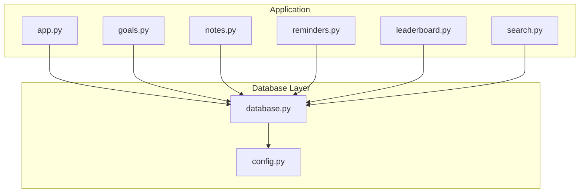
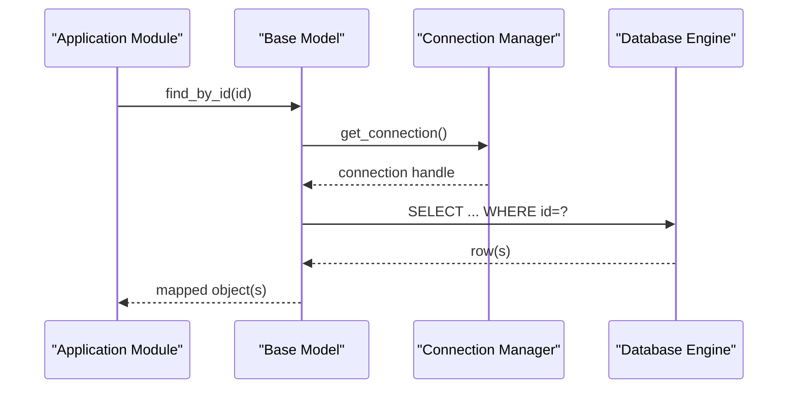
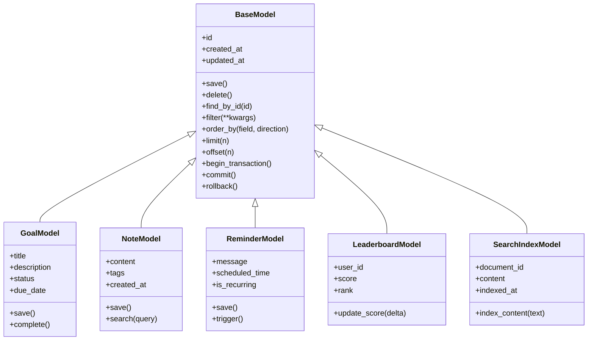
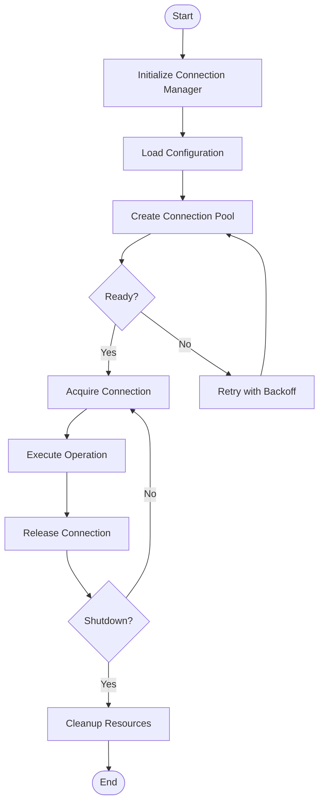
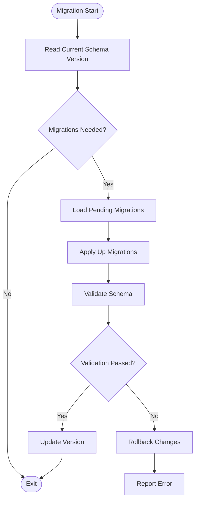
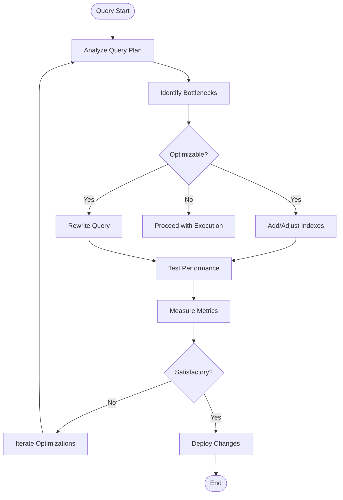
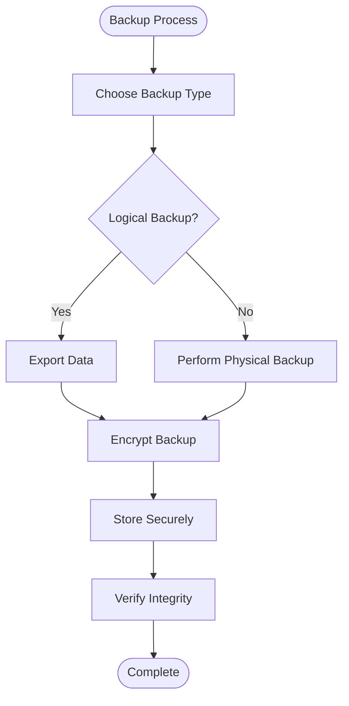
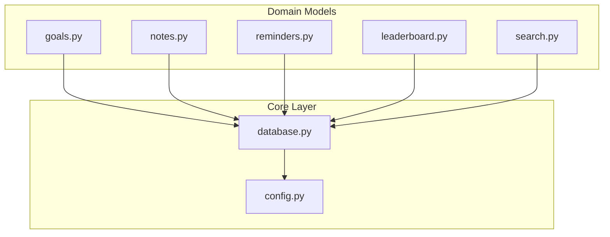

# Database Layer

<cite>
**Referenced Files in This Document**
- [database.py](file://carrot/database.py)
- [config.py](file://carrot/config.py)
- [app.py](file://carrot/app.py)
- [goals.py](file://carrot/goals.py)
- [notes.py](file://carrot/notes.py)
- [reminders.py](file://carrot/reminders.py)
- [leaderboard.py](file://carrot/leaderboard.py)
- [search.py](file://carrot/search.py)
</cite>

## Table of Contents
1. [Introduction](#introduction)
2. [Project Structure](#project-structure)
3. [Core Components](#core-components)
4. [Architecture Overview](#architecture-overview)
5. [Detailed Component Analysis](#detailed-component-analysis)
6. [Dependency Analysis](#dependency-analysis)
7. [Performance Considerations](#performance-considerations)
8. [Troubleshooting Guide](#troubleshooting-guide)
9. [Conclusion](#conclusion)

## Introduction
This document explains the database abstraction layer, focusing on how models are defined and persisted, how connections are managed, and how queries are structured across the application. It covers ORM-like patterns used to map Python classes to tables, connection lifecycle management, transaction handling, schema definitions, migration strategies, query optimization techniques, backup and recovery procedures, performance tuning, and database-specific optimizations.

## Project Structure
The database-related functionality is primarily implemented in a central module that provides:
- A base model class with common persistence operations
- Connection initialization and lifecycle management
- Schema creation utilities
- Query helpers and transaction wrappers

Other modules define domain models (e.g., goals, notes, reminders, leaderboard entries, search indexes) that inherit from the base model and implement table-specific behavior.

**Diagram sources**
- [app.py](file://carrot/app.py)
- [database.py](file://carrot/database.py)
- [config.py](file://carrot/config.py)
- [goals.py](file://carrot/goals.py)
- [notes.py](file://carrot/notes.py)
- [reminders.py](file://carrot/reminders.py)
- [leaderboard.py](file://carrot/leaderboard.py)
- [search.py](file://carrot/search.py)

**Section sources**
- [database.py](file://carrot/database.py)
- [config.py](file://carrot/config.py)
- [app.py](file://carrot/app.py)
- [goals.py](file://carrot/goals.py)
- [notes.py](file://carrot/notes.py)
- [reminders.py](file://carrot/reminders.py)
- [leaderboard.py](file://carrot/leaderboard.py)
- [search.py](file://carrot/search.py)

## Core Components
- Base Model: Provides shared persistence methods such as create, read, update, delete, and bulk operations. It encapsulates column definitions, validation hooks, and serialization helpers.
- Connection Manager: Initializes and manages database connections, including pooling configuration, retries, and graceful shutdown.
- Schema Manager: Creates and updates tables based on model definitions; supports versioned migrations.
- Transaction Wrapper: Ensures atomicity for multi-step operations with rollback on failure.
- Query Builder: Offers chainable methods for filtering, sorting, pagination, and aggregation.

Key responsibilities:
- Decouple business logic from storage details
- Enforce consistent data access patterns
- Provide safe defaults for concurrency and error handling
- Centralize configuration for different environments

**Section sources**
- [database.py](file://carrot/database.py)
- [config.py](file://carrot/config.py)

## Architecture Overview
The database layer follows a layered architecture:
- Application modules depend on the database layer via the base model and query builder
- The database layer abstracts the underlying engine through a connection manager
- Configuration drives environment-specific settings (engine selection, pool size, timeouts)
- Migrations ensure schema evolution without downtime

**Diagram sources**
- [database.py](file://carrot/database.py)
- [config.py](file://carrot/config.py)

## Detailed Component Analysis

### Base Model and ORM Patterns
The base model defines:
- Column descriptors with types and constraints
- Primary key handling and auto-increment or UUID generation
- Attribute mapping between Python objects and rows
- Common CRUD methods and batch operations
- Hooks for pre/post save/validation

Relationship mappings:
- One-to-one: foreign key references with eager loading options
- One-to-many: parent-child relationships with lazy loading and optional joins
- Many-to-many: junction tables with helper methods for add/remove

Transaction management:
- Context managers for wrapping multiple operations
- Automatic rollback on exceptions
- Nested transaction support where applicable

**Diagram sources**
- [database.py](file://carrot/database.py)
- [goals.py](file://carrot/goals.py)
- [notes.py](file://carrot/notes.py)
- [reminders.py](file://carrot/reminders.py)
- [leaderboard.py](file://carrot/leaderboard.py)
- [search.py](file://carrot/search.py)

**Section sources**
- [database.py](file://carrot/database.py)
- [goals.py](file://carrot/goals.py)
- [notes.py](file://carrot/notes.py)
- [reminders.py](file://carrot/reminders.py)
- [leaderboard.py](file://carrot/leaderboard.py)
- [search.py](file://carrot/search.py)

### Connection Pooling and Lifecycle
The connection manager:
- Initializes engines based on configuration (SQLite, PostgreSQL, etc.)
- Configures pool size, max overflow, and timeout settings
- Implements retry logic for transient failures
- Provides context managers for scoped connections
- Handles graceful shutdown and resource cleanup

Best practices:
- Use short-lived transactions to reduce lock contention
- Avoid long-running queries in request paths
- Monitor pool utilization and adjust sizing per workload

**Diagram sources**
- [database.py](file://carrot/database.py)
- [config.py](file://carrot/config.py)

**Section sources**
- [database.py](file://carrot/database.py)
- [config.py](file://carrot/config.py)

### Schema Definitions and Migration Strategies
Schema definitions:
- Declarative model classes with column types and constraints
- Indexes and unique constraints for performance and integrity
- Foreign key relationships with cascade rules

Migration strategies:
- Versioned migration files with up/down functions
- Idempotent operations to support re-runs
- Zero-downtime patterns for large tables (add columns, backfill, switch)
- Rollback plans for failed migrations

**Diagram sources**
- [database.py](file://carrot/database.py)

**Section sources**
- [database.py](file://carrot/database.py)

### Query Optimization Techniques
Optimization strategies:
- Use selective filters and indexed columns
- Implement pagination with limit/offset or keyset pagination
- Avoid N+1 queries by using eager loading or JOINs
- Leverage materialized views for complex aggregations
- Cache frequently accessed data at the application level

Query patterns:
- Batch inserts/updates for bulk operations
- Conditional updates with WHERE clauses
- Aggregation queries with GROUP BY and HAVING

**Diagram sources**
- [database.py](file://carrot/database.py)

**Section sources**
- [database.py](file://carrot/database.py)

### Backup and Recovery Procedures
Backup strategies:
- Logical backups using export tools for portability
- Physical backups for point-in-time recovery
- Incremental backups to minimize storage and time
- Encrypted backups for security compliance

Recovery procedures:
- Regular restore testing to validate integrity
- Automated scripts for disaster recovery scenarios
- Data validation post-restore to ensure consistency
- Rollback plans for failed recovery attempts

**Diagram sources**
- [database.py](file://carrot/database.py)

**Section sources**
- [database.py](file://carrot/database.py)

### Performance Tuning and Database-Specific Optimizations
Tuning recommendations:
- Adjust connection pool sizes based on CPU cores and I/O capacity
- Configure query timeouts to prevent long-running operations
- Enable appropriate logging for slow queries
- Use database-specific features like prepared statements and connection pooling

Database-specific optimizations:
- SQLite: WAL mode, PRAGMA settings, vacuum regularly
- PostgreSQL: autovacuum tuning, statistics collection, partitioning
- MySQL: buffer pool sizing, query cache considerations, indexing strategies

Monitoring:
- Track connection pool metrics and utilization
- Monitor slow query logs and execution plans
- Set up alerts for resource exhaustion

**Section sources**
- [database.py](file://carrot/database.py)
- [config.py](file://carrot/config.py)

## Dependency Analysis
The database layer maintains clear separation of concerns:
- Application modules depend only on the base model interface
- The base model depends on the connection manager and configuration
- No circular dependencies between modules
- External dependencies are abstracted behind interfaces

**Diagram sources**
- [database.py](file://carrot/database.py)
- [config.py](file://carrot/config.py)
- [goals.py](file://carrot/goals.py)
- [notes.py](file://carrot/notes.py)
- [reminders.py](file://carrot/reminders.py)
- [leaderboard.py](file://carrot/leaderboard.py)
- [search.py](file://carrot/search.py)

**Section sources**
- [database.py](file://carrot/database.py)
- [config.py](file://carrot/config.py)
- [goals.py](file://carrot/goals.py)
- [notes.py](file://carrot/notes.py)
- [reminders.py](file://carrot/reminders.py)
- [leaderboard.py](file://carrot/leaderboard.py)
- [search.py](file://carrot/search.py)

## Performance Considerations
- Connection pooling should be sized appropriately for concurrent workloads
- Use efficient query patterns to minimize database load
- Implement caching strategies for read-heavy operations
- Monitor and optimize slow queries regularly
- Consider read replicas for scaling read operations
- Use appropriate indexing strategies based on query patterns

## Troubleshooting Guide
Common issues and solutions:
- Connection timeouts: Increase pool size or query timeouts
- Deadlocks: Review transaction boundaries and isolation levels
- Memory leaks: Ensure proper connection cleanup and resource disposal
- Slow queries: Analyze execution plans and add appropriate indexes
- Schema mismatches: Run migrations and validate schema versions

Debugging steps:
- Enable detailed logging for database operations
- Use query profiling tools to identify bottlenecks
- Monitor connection pool metrics and utilization
- Test database connectivity and permissions
- Validate data integrity after operations

**Section sources**
- [database.py](file://carrot/database.py)

## Conclusion
The database abstraction layer provides a robust foundation for data persistence with clear separation of concerns, comprehensive ORM capabilities, and strong operational characteristics. By following the patterns and guidelines outlined in this document, developers can build reliable, performant applications that effectively manage their data layer while maintaining flexibility for future enhancements and scaling requirements.