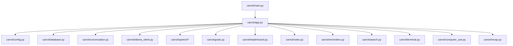
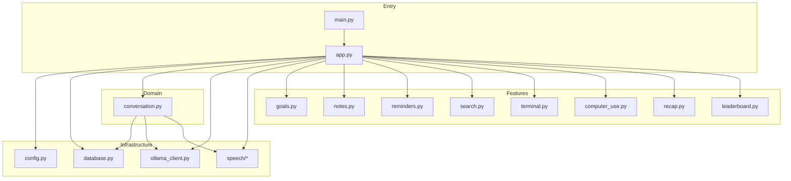
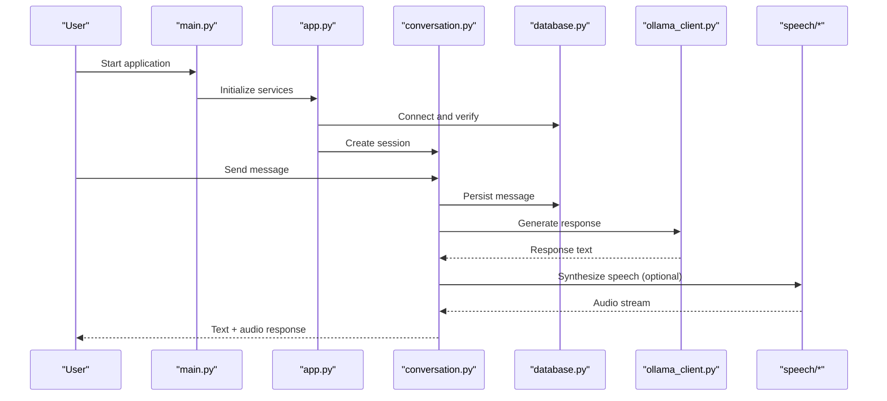
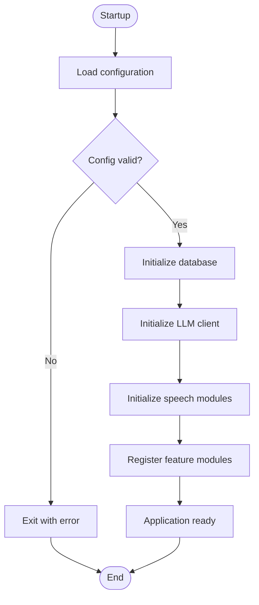
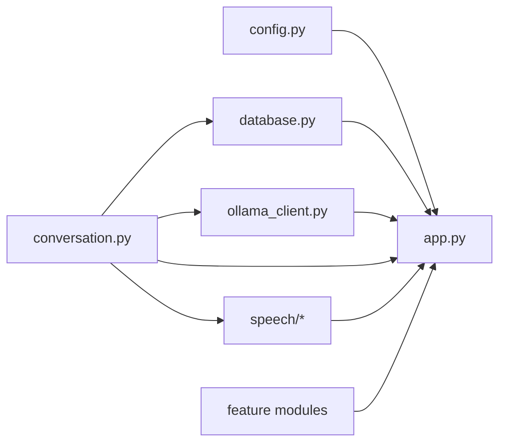

# Module Architecture

<cite>
**Referenced Files in This Document**
- [main.py](file://carrot/main.py)
- [app.py](file://carrot/app.py)
- [config.py](file://carrot/config.py)
- [database.py](file://carrot/database.py)
- [conversation.py](file://carrot/conversation.py)
- [ollama_client.py](file://carrot/ollama_client.py)
- [speech/__init__.py](file://carrot/speech/__init__.py)
- [speech/kokoro_tts.py](file://carrot/speech/kokoro_tts.py)
- [speech/whisper_stt.py](file://carrot/speech/whisper_stt.py)
- [goals.py](file://carrot/goals.py)
- [leaderboard.py](file://carrot/leaderboard.py)
- [notes.py](file://carrot/notes.py)
- [reminders.py](file://carrot/reminders.py)
- [search.py](file://carrot/search.py)
- [terminal.py](file://carrot/terminal.py)
- [computer_use.py](file://carrot/computer_use.py)
- [recap.py](file://carrot/recap.py)
</cite>

## Table of Contents
1. [Introduction](#introduction)
2. [Project Structure](#project-structure)
3. [Core Components](#core-components)
4. [Architecture Overview](#architecture-overview)
5. [Detailed Component Analysis](#detailed-component-analysis)
6. [Dependency Analysis](#dependency-analysis)
7. [Performance Considerations](#performance-considerations)
8. [Troubleshooting Guide](#troubleshooting-guide)
9. [Conclusion](#conclusion)
10. [Appendices](#appendices)

## Introduction
This document explains the Carrot application’s module architecture with a focus on its modular design, dependency management, and inter-module communication. It covers how configuration, database abstraction, conversation handling, and service initialization are organized and wired together. It also provides guidance on module lifecycle, error handling strategies, and testing approaches for individual components.

## Project Structure
Carrot is organized as a Python package under the carrot directory, with feature modules at the top level and a speech subpackage encapsulating text-to-speech and speech-to-text capabilities. The entry points are main.py and app.py, which bootstrap services and orchestrate interactions among modules.

**Diagram sources**
- [main.py:1-200](file://carrot/main.py#L1-L200)
- [app.py:1-200](file://carrot/app.py#L1-L200)
- [config.py:1-200](file://carrot/config.py#L1-L200)
- [database.py:1-200](file://carrot/database.py#L1-L200)
- [conversation.py:1-200](file://carrot/conversation.py#L1-L200)
- [ollama_client.py:1-200](file://carrot/ollama_client.py#L1-L200)
- [speech/__init__.py:1-200](file://carrot/speech/__init__.py#L1-L200)
- [speech/kokoro_tts.py:1-200](file://carrot/speech/kokoro_tts.py#L1-L200)
- [speech/whisper_stt.py:1-200](file://carrot/speech/whisper_stt.py#L1-L200)
- [goals.py:1-200](file://carrot/goals.py#L1-L200)
- [leaderboard.py:1-200](file://carrot/leaderboard.py#L1-L200)
- [notes.py:1-200](file://carrot/notes.py#L1-L200)
- [reminders.py:1-200](file://carrot/reminders.py#L1-L200)
- [search.py:1-200](file://carrot/search.py#L1-L200)
- [terminal.py:1-200](file://carrot/terminal.py#L1-L200)
- [computer_use.py:1-200](file://carrot/computer_use.py#L1-L200)
- [recap.py:1-200](file://carrot/recap.py#L1-L200)

**Section sources**
- [main.py:1-200](file://carrot/main.py#L1-L200)
- [app.py:1-200](file://carrot/app.py#L1-L200)

## Core Components
- Configuration management: Centralized settings loaded from environment or config files, exposed via a configuration object used by all modules.
- Database abstraction: Provides a consistent interface to persist and query data, isolating storage details from business logic.
- Conversation handling: Manages chat sessions, message history, and orchestrates calls to language model clients.
- Service initialization: Wires dependencies, registers services, and starts background tasks or listeners.

Key responsibilities and relationships:
- Config is consumed by database, conversation, and external clients (e.g., Ollama).
- Conversation depends on database for persistence and on an LLM client for generation.
- Feature modules (goals, notes, reminders, search, etc.) depend on database and optionally on conversation or other services.
- Speech subpackage integrates TTS and STT into the conversation flow.

**Section sources**
- [config.py:1-200](file://carrot/config.py#L1-L200)
- [database.py:1-200](file://carrot/database.py#L1-L200)
- [conversation.py:1-200](file://carrot/conversation.py#L1-L200)
- [ollama_client.py:1-200](file://carrot/ollama_client.py#L1-L200)

## Architecture Overview
The application follows a layered modular pattern:
- Entry layer: main.py bootstraps the runtime; app.py initializes services and wires dependencies.
- Domain layer: conversation.py coordinates user interactions and invokes domain-specific modules.
- Infrastructure layer: database.py abstracts storage; ollama_client.py abstracts external AI services; speech/* implements audio processing.
- Feature modules: goals.py, notes.py, reminders.py, search.py, terminal.py, computer_use.py, recap.py implement specific capabilities.

**Diagram sources**
- [main.py:1-200](file://carrot/main.py#L1-L200)
- [app.py:1-200](file://carrot/app.py#L1-L200)
- [config.py:1-200](file://carrot/config.py#L1-L200)
- [database.py:1-200](file://carrot/database.py#L1-L200)
- [conversation.py:1-200](file://carrot/conversation.py#L1-L200)
- [ollama_client.py:1-200](file://carrot/ollama_client.py#L1-L200)
- [speech/__init__.py:1-200](file://carrot/speech/__init__.py#L1-L200)
- [speech/kokoro_tts.py:1-200](file://carrot/speech/kokoro_tts.py#L1-L200)
- [speech/whisper_stt.py:1-200](file://carrot/speech/whisper_stt.py#L1-L200)
- [goals.py:1-200](file://carrot/goals.py#L1-L200)
- [notes.py:1-200](file://carrot/notes.py#L1-L200)
- [reminders.py:1-200](file://carrot/reminders.py#L1-L200)
- [search.py:1-200](file://carrot/search.py#L1-L200)
- [terminal.py:1-200](file://carrot/terminal.py#L1-L200)
- [computer_use.py:1-200](file://carrot/computer_use.py#L1-L200)
- [recap.py:1-200](file://carrot/recap.py#L1-L200)
- [leaderboard.py:1-200](file://carrot/leaderboard.py#L1-L200)

## Detailed Component Analysis

### Configuration Management
Responsibilities:
- Load and validate configuration from environment variables and/or config files.
- Provide typed accessors for settings consumed across modules.
- Expose defaults and fallback behavior.

Design patterns:
- Singleton-like configuration object initialized once during startup.
- Lazy loading of sensitive values to avoid early failures.

Inter-module usage:
- Database uses connection parameters and timeouts.
- Conversation and LLM client use API keys, endpoints, and model names.
- Feature modules read feature flags and limits.

Lifecycle:
- Initialized before any feature module.
- Re-read on demand if hot-reload is enabled.

Error handling:
- Missing required keys raise explicit errors with guidance.
- Invalid types coerced or rejected with clear messages.

Testing approach:
- Mock environment variables and config files per test case.
- Assert default values and validation rules.

**Section sources**
- [config.py:1-200](file://carrot/config.py#L1-L200)

### Database Abstraction
Responsibilities:
- Provide a unified interface for CRUD operations and queries.
- Manage connections, migrations, and transactions.
- Abstract underlying storage implementation.

Design patterns:
- Repository-style methods for entities.
- Optional session/context manager for transactional boundaries.

Inter-module usage:
- Conversation persists messages and sessions.
- Feature modules store and retrieve domain data.

Lifecycle:
- Connection pool created at startup; closed gracefully on shutdown.

Error handling:
- Network and IO errors wrapped in domain exceptions.
- Retry policies for transient failures.

Testing approach:
- Use in-memory or test databases.
- Seed fixtures and assert idempotency.

**Section sources**
- [database.py:1-200](file://carrot/database.py#L1-L200)

### Conversation Handling
Responsibilities:
- Maintain conversation state and message history.
- Orchestrate prompts, tool calls, and responses.
- Integrate speech input/output and memory persistence.

Design patterns:
- State machine for conversation phases.
- Strategy pattern for pluggable LLM backends.

Inter-module usage:
- Reads/writes via database.
- Calls LLM client for generation.
- Uses speech modules for TTS/STT.

Lifecycle:
- Created per session; persisted incrementally.
- Cleaned up on idle timeout or explicit close.

Error handling:
- Graceful degradation when LLM is unavailable.
- Partial results cached to avoid re-generation.

Testing approach:
- Stub LLM client and speech modules.
- Validate message ordering and persistence.

**Section sources**
- [conversation.py:1-200](file://carrot/conversation.py#L1-L200)
- [ollama_client.py:1-200](file://carrot/ollama_client.py#L1-L200)
- [speech/__init__.py:1-200](file://carrot/speech/__init__.py#L1-L200)
- [speech/kokoro_tts.py:1-200](file://carrot/speech/kokoro_tts.py#L1-L200)
- [speech/whisper_stt.py:1-200](file://carrot/speech/whisper_stt.py#L1-L200)

### Service Initialization and Dependency Injection
Responsibilities:
- Instantiate and wire modules.
- Register services in a central container.
- Start background workers and listeners.

Design patterns:
- Explicit dependency injection via constructors or setters.
- Registry pattern for feature discovery and registration.

Inter-module usage:
- app.py constructs core services and passes dependencies.
- Feature modules receive only what they need.

Lifecycle:
- Startup sequence ensures config and DB are ready first.
- Shutdown sequence closes resources in reverse order.

Error handling:
- Fail-fast on missing critical dependencies.
- Health checks expose readiness and liveness.

Testing approach:
- Construct minimal graphs for unit tests.
- Replace heavy dependencies with mocks.

**Section sources**
- [app.py:1-200](file://carrot/app.py#L1-L200)
- [main.py:1-200](file://carrot/main.py#L1-L200)

### Feature Modules
- Goals: Define, track, and update goals; persist state; integrate with leaderboard.
- Notes: Create, edit, search, and summarize notes; optional OCR or extraction.
- Reminders: Schedule, notify, and manage recurring events.
- Search: Index and query content across modules.
- Terminal: Command parsing and execution sandbox.
- Computer Use: System integration for automation tasks.
- Recap: Generate summaries and insights from conversations and logs.
- Leaderboard: Rankings and metrics aggregation.

Each module:
- Depends on database and optionally on conversation or other services.
- Exposes a clean API surface for composition.
- Implements its own error handling and logging.

**Section sources**
- [goals.py:1-200](file://carrot/goals.py#L1-L200)
- [notes.py:1-200](file://carrot/notes.py#L1-L200)
- [reminders.py:1-200](file://carrot/reminders.py#L1-L200)
- [search.py:1-200](file://carrot/search.py#L1-L200)
- [terminal.py:1-200](file://carrot/terminal.py#L1-L200)
- [computer_use.py:1-200](file://carrot/computer_use.py#L1-L200)
- [recap.py:1-200](file://carrot/recap.py#L1-L200)
- [leaderboard.py:1-200](file://carrot/leaderboard.py#L1-L200)

### Inter-Module Communication Patterns
- Direct imports within the package for tight coupling where appropriate.
- Event-driven updates via callbacks or pub/sub for decoupled features.
- Shared configuration and database interfaces to minimize duplication.

Example import patterns:
- Feature modules import shared utilities and database abstractions.
- Conversation imports LLM client and speech modules.
- App initializer imports all modules to register them.

Service registration example:
- Central registry collects capabilities and exposes them to the UI or CLI.

Dependency injection example:
- Constructors accept dependencies explicitly; factories create instances with configured dependencies.

**Section sources**
- [app.py:1-200](file://carrot/app.py#L1-L200)
- [conversation.py:1-200](file://carrot/conversation.py#L1-L200)
- [database.py:1-200](file://carrot/database.py#L1-L200)
- [config.py:1-200](file://carrot/config.py#L1-L200)

### Sequence: Conversation Request Flow

**Diagram sources**
- [main.py:1-200](file://carrot/main.py#L1-L200)
- [app.py:1-200](file://carrot/app.py#L1-L200)
- [conversation.py:1-200](file://carrot/conversation.py#L1-L200)
- [database.py:1-200](file://carrot/database.py#L1-L200)
- [ollama_client.py:1-200](file://carrot/ollama_client.py#L1-L200)
- [speech/__init__.py:1-200](file://carrot/speech/__init__.py#L1-L200)
- [speech/kokoro_tts.py:1-200](file://carrot/speech/kokoro_tts.py#L1-L200)
- [speech/whisper_stt.py:1-200](file://carrot/speech/whisper_stt.py#L1-L200)

### Flowchart: Service Initialization

**Diagram sources**
- [app.py:1-200](file://carrot/app.py#L1-L200)
- [config.py:1-200](file://carrot/config.py#L1-L200)
- [database.py:1-200](file://carrot/database.py#L1-L200)
- [ollama_client.py:1-200](file://carrot/ollama_client.py#L1-L200)
- [speech/__init__.py:1-200](file://carrot/speech/__init__.py#L1-L200)

## Dependency Analysis
Coupling and cohesion:
- High cohesion within feature modules; low coupling through shared interfaces (config, database).
- Conversation acts as an orchestrator with moderate coupling to infrastructure.

Direct and indirect dependencies:
- app.py depends on all major modules to wire them.
- conversation.py depends on database and LLM client; indirectly on speech.
- Feature modules depend on database and optionally on conversation.

Potential circular dependencies:
- Avoid cross-imports between feature modules; use conversation or event bus for coordination.

External dependencies:
- LLM client communicates with remote models.
- Speech modules may rely on system libraries or external binaries.

Interface contracts:
- Database interface defines entity operations.
- LLM client defines prompt/response contract.
- Speech modules define audio I/O contracts.

**Diagram sources**
- [app.py:1-200](file://carrot/app.py#L1-L200)
- [config.py:1-200](file://carrot/config.py#L1-L200)
- [database.py:1-200](file://carrot/database.py#L1-L200)
- [ollama_client.py:1-200](file://carrot/ollama_client.py#L1-L200)
- [conversation.py:1-200](file://carrot/conversation.py#L1-L200)
- [speech/__init__.py:1-200](file://carrot/speech/__init__.py#L1-L200)

**Section sources**
- [app.py:1-200](file://carrot/app.py#L1-L200)
- [conversation.py:1-200](file://carrot/conversation.py#L1-L200)

## Performance Considerations
- Connection pooling for database and HTTP clients to reduce latency.
- Streaming responses from LLM and speech to improve perceived responsiveness.
- Caching frequent reads and avoiding redundant computations.
- Background tasks for long-running operations like indexing or summarization.
- Resource cleanup on idle to prevent memory growth.

[No sources needed since this section provides general guidance]

## Troubleshooting Guide
Common issues and resolutions:
- Configuration errors: Validate required keys and types; check environment precedence.
- Database connectivity: Verify credentials, network reachability, and migration status.
- LLM client failures: Inspect endpoint availability, rate limits, and model names.
- Speech module errors: Ensure binaries/libraries are installed and accessible.
- Feature module crashes: Isolate via minimal dependency graph and add detailed logs.

Debugging tips:
- Enable structured logging with correlation IDs.
- Use health endpoints to monitor readiness and liveness.
- Capture traces around external calls and DB operations.

**Section sources**
- [config.py:1-200](file://carrot/config.py#L1-L200)
- [database.py:1-200](file://carrot/database.py#L1-L200)
- [ollama_client.py:1-200](file://carrot/ollama_client.py#L1-L200)
- [speech/__init__.py:1-200](file://carrot/speech/__init__.py#L1-L200)

## Conclusion
Carrot’s module architecture emphasizes clear separation of concerns, explicit dependency injection, and robust lifecycle management. Configuration and database abstractions provide stable foundations, while conversation orchestration ties together LLM and speech capabilities. Feature modules remain cohesive and loosely coupled, enabling scalable evolution and straightforward testing.

[No sources needed since this section summarizes without analyzing specific files]

## Appendices

### Module Import Examples
- Feature modules import shared interfaces:
  - From database import repository methods
  - From config import settings accessors
- Conversation imports infrastructure:
  - From ollama_client import generate
  - From speech import tts and stt functions
- App initializer imports and registers:
  - Imports all modules and constructs instances
  - Passes dependencies via constructors or setters

**Section sources**
- [app.py:1-200](file://carrot/app.py#L1-L200)
- [conversation.py:1-200](file://carrot/conversation.py#L1-L200)
- [database.py:1-200](file://carrot/database.py#L1-L200)
- [config.py:1-200](file://carrot/config.py#L1-L200)

### Testing Approaches
- Unit tests:
  - Mock external dependencies (LLM, speech, DB).
  - Assert behavior of individual modules in isolation.
- Integration tests:
  - Use test containers or in-memory stores.
  - Validate end-to-end flows with stubbed external services.
- Contract tests:
  - Verify interfaces between modules remain compatible.

**Section sources**
- [app.py:1-200](file://carrot/app.py#L1-L200)
- [conversation.py:1-200](file://carrot/conversation.py#L1-L200)
- [database.py:1-200](file://carrot/database.py#L1-L200)