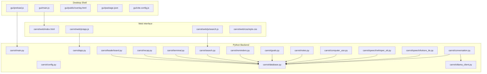
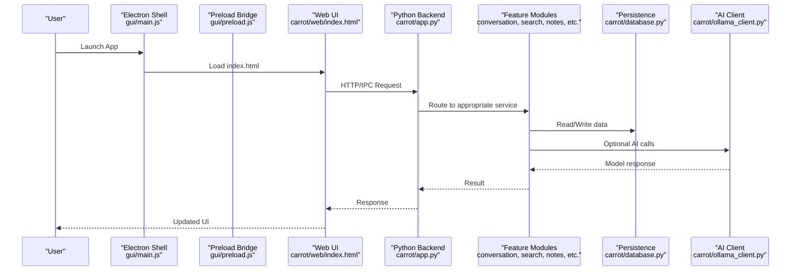
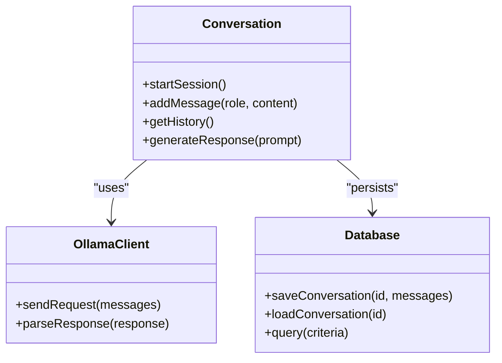
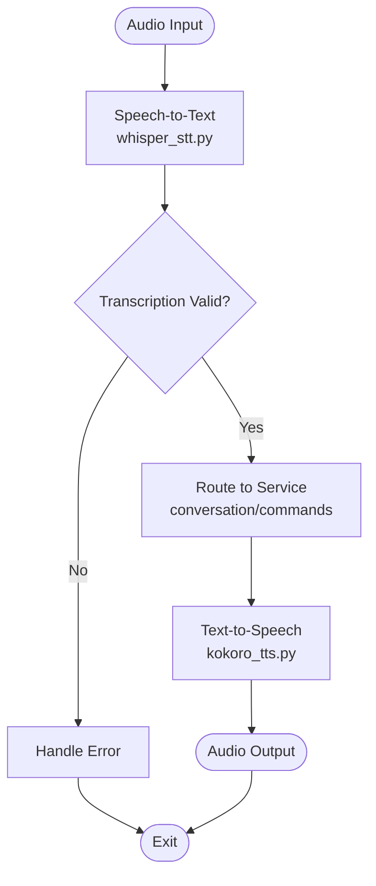
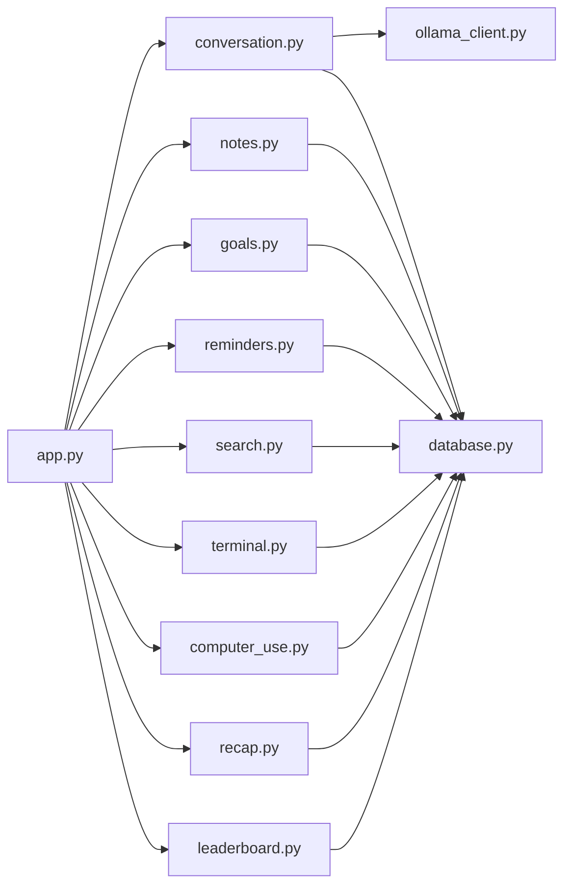

# System Overview

<cite>
**Referenced Files in This Document**
- [README.md](file://README.md)
- [PLAN.md](file://PLAN.md)
- [pyproject.toml](file://pyproject.toml)
- [build.bat](file://build.bat)
- [carrot/main.py](file://carrot/main.py)
- [carrot/app.py](file://carrot/app.py)
- [carrot/config.py](file://carrot/config.py)
- [carrot/database.py](file://carrot/database.py)
- [carrot/conversation.py](file://carrot/conversation.py)
- [carrot/ollama_client.py](file://carrot/ollama_client.py)
- [carrot/speech/kokoro_tts.py](file://carrot/speech/kokoro_tts.py)
- [carrot/speech/whisper_stt.py](file://carrot/speech/whisper_stt.py)
- [carrot/computer_use.py](file://carrot/computer_use.py)
- [carrot/goals.py](file://carrot/goals.py)
- [carrot/leaderboard.py](file://carrot/leaderboard.py)
- [carrot/notes.py](file://carrot/notes.py)
- [carrot/recap.py](file://carrot/recap.py)
- [carrot/reminders.py](file://carrot/reminders.py)
- [carrot/search.py](file://carrot/search.py)
- [carrot/terminal.py](file://carrot/terminal.py)
- [gui/main.js](file://gui/main.js)
- [gui/preload.js](file://gui/preload.js)
- [gui/package.json](file://gui/package.json)
- [gui/vite.config.js](file://gui/vite.config.js)
- [gui/public/overlay.html](file://gui/public/overlay.html)
- [carrot/web/index.html](file://carrot/web/index.html)
- [carrot/web/js/app.js](file://carrot/web/js/app.js)
- [carrot/web/js/search.js](file://carrot/web/js/search.js)
- [carrot/web/css/style.css](file://carrot/web/css/style.css)
</cite>

## Table of Contents
1. Introduction
2. Project Structure
3. Core Components
4. Architecture Overview
5. Detailed Component Analysis
6. Dependency Analysis
7. Performance Considerations
8. Troubleshooting Guide
9. Conclusion

## Introduction
This document provides a comprehensive system overview of the Carrot application, explaining its high-level architecture and how it integrates speech processing, AI capabilities, computer automation, and productivity features into a cohesive desktop experience. The system is composed of:
- A modular Python backend that implements core services (conversation, memory, search, reminders, goals, notes, terminal, and more).
- A web interface layer that renders the UI and communicates with the backend via HTTP or IPC.
- An Electron desktop wrapper that packages the app for distribution and bridges native OS capabilities to the web UI.

The design emphasizes modularity, clear separation of concerns, and extensibility. It balances local-first data storage with optional cloud-based AI services, enabling both offline usability and advanced AI-powered features.

## Project Structure
At a high level, the repository organizes functionality by feature modules under carrot/, a web UI under carrot/web/, and an Electron wrapper under gui/. Configuration and build scripts are at the root.

Key areas:
- Python backend:
  - Entry points and runtime orchestration
  - Feature modules for conversation, AI client, speech, computer use, productivity tools
  - Data persistence and configuration
- Web interface:
  - HTML/CSS/JS for the user-facing UI
  - Client-side logic for search and interactions
- Electron wrapper:
  - Desktop shell, window management, and IPC bridge
  - Packaging and build configuration

**Diagram sources**
- [gui/main.js](file://gui/main.js)
- [gui/preload.js](file://gui/preload.js)
- [gui/public/overlay.html](file://gui/public/overlay.html)
- [gui/package.json](file://gui/package.json)
- [gui/vite.config.js](file://gui/vite.config.js)
- [carrot/web/index.html](file://carrot/web/index.html)
- [carrot/web/js/app.js](file://carrot/web/js/app.js)
- [carrot/web/js/search.js](file://carrot/web/js/search.js)
- [carrot/web/css/style.css](file://carrot/web/css/style.css)
- [carrot/main.py](file://carrot/main.py)
- [carrot/app.py](file://carrot/app.py)
- [carrot/config.py](file://carrot/config.py)
- [carrot/database.py](file://carrot/database.py)
- [carrot/conversation.py](feature modules)
- [carrot/ollama_client.py](file://carrot/ollama_client.py)
- [carrot/speech/kokoro_tts.py](file://carrot/speech/kokoro_tts.py)
- [carrot/speech/whisper_stt.py](file://carrot/speech/whisper_stt.py)
- [carrot/computer_use.py](file://carrot/computer_use.py)
- [carrot/notes.py](file://carrot/notes.py)
- [carrot/goals.py](file://carrot/goals.py)
- [carrot/reminders.py](file://carrot/reminders.py)
- [carrot/search.py](file://carrot/search.py)
- [carrot/terminal.py](file://carrot/terminal.py)
- [carrot/recap.py](file://carrot/recap.py)
- [carrot/leaderboard.py](file://carrot/leaderboard.py)

**Section sources**
- [README.md](file://README.md)
- [PLAN.md](file://PLAN.md)
- [pyproject.toml](file://pyproject.toml)
- [build.bat](file://build.bat)

## Core Components
- Python backend entrypoints:
  - Application bootstrap and server initialization
  - Configuration management and environment setup
  - Database access abstraction and persistence layer
- Conversation and AI:
  - Conversation state management and history
  - AI client integration for model inference
- Speech pipeline:
  - Text-to-speech synthesis
  - Speech-to-text transcription
- Productivity and automation:
  - Notes, goals, reminders, recap generation
  - Search across content and metadata
  - Terminal-like operations and computer automation utilities
- Leaderboard and analytics:
  - Tracking and reporting of productivity metrics

These components follow a modular design where each feature module encapsulates its own responsibilities and interacts through well-defined interfaces, primarily via the database and shared configuration.

**Section sources**
- [carrot/main.py](file://carrot/main.py)
- [carrot/app.py](file://carrot/app.py)
- [carrot/config.py](file://carrot/config.py)
- [carrot/database.py](file://carrot/database.py)
- [carrot/conversation.py](file://carrot/conversation.py)
- [carrot/ollama_client.py](file://carrot/ollama_client.py)
- [carrot/speech/kokoro_tts.py](file://carrot/speech/kokoro_tts.py)
- [carrot/speech/whisper_stt.py](file://carrot/speech/whisper_stt.py)
- [carrot/computer_use.py](file://carrot/computer_use.py)
- [carrot/notes.py](file://carrot/notes.py)
- [carrot/goals.py](file://carrot/goals.py)
- [carrot/reminders.py](file://carrot/reminders.py)
- [carrot/search.py](file://carrot/search.py)
- [carrot/terminal.py](file://carrot/terminal.py)
- [carrot/recap.py](file://carrot/recap.py)
- [carrot/leaderboard.py](file://carrot/leaderboard.py)

## Architecture Overview
Carrot follows a layered architecture:
- Presentation layer: Electron shell and web UI render the interface and handle user interactions.
- Application layer: Python backend exposes services and endpoints consumed by the web UI and Electron preload script.
- Data layer: Local-first persistence ensures reliability and privacy; optional external AI services provide advanced capabilities.

**Diagram sources**
- [gui/main.js](file://gui/main.js)
- [gui/preload.js](file://gui/preload.js)
- [carrot/web/index.html](file://carrot/web/index.html)
- [carrot/app.py](file://carrot/app.py)
- [carrot/database.py](file://carrot/database.py)
- [carrot/ollama_client.py](file://carrot/ollama_client.py)

## Detailed Component Analysis

### Python Backend Orchestration
Responsibilities:
- Initialize the application lifecycle
- Configure settings and environment variables
- Start the web server and expose endpoints
- Coordinate between feature modules and the database

Design patterns:
- Modular service composition
- Centralized configuration
- Clear separation between I/O and business logic

**Section sources**
- [carrot/main.py](file://carrot/main.py)
- [carrot/app.py](file://carrot/app.py)
- [carrot/config.py](file://carrot/config.py)

### Conversation and AI Integration
Responsibilities:
- Manage conversation state and history
- Interact with AI models via the client
- Persist conversations and context

Data flow:
- Incoming prompts are processed by the conversation module
- Context is retrieved from the database
- AI client generates responses
- Results are stored and returned to the UI

**Diagram sources**
- [carrot/conversation.py](file://carrot/conversation.py)
- [carrot/ollama_client.py](file://carrot/ollama_client.py)
- [carrot/database.py](file://carrot/database.py)

**Section sources**
- [carrot/conversation.py](file://carrot/conversation.py)
- [carrot/ollama_client.py](file://carrot/ollama_client.py)
- [carrot/database.py](file://carrot/database.py)

### Speech Processing Pipeline
Responsibilities:
- Convert text to speech using a TTS engine
- Transcribe audio input to text using STT
- Integrate with conversation and productivity modules

Processing logic:
- Audio capture triggers STT
- Transcribed text flows into conversation or commands
- Responses can be synthesized back to speech

**Diagram sources**
- [carrot/speech/whisper_stt.py](file://carrot/speech/whisper_stt.py)
- [carrot/speech/kokoro_tts.py](file://carrot/speech/kokoro_tts.py)
- [carrot/conversation.py](file://carrot/conversation.py)

**Section sources**
- [carrot/speech/whisper_stt.py](file://carrot/speech/whisper_stt.py)
- [carrot/speech/kokoro_tts.py](file://carrot/speech/kokoro_tts.py)

### Computer Automation and Terminal Utilities
Responsibilities:
- Execute system commands safely
- Automate repetitive tasks
- Provide terminal-like interaction within the app

Integration:
- Commands are validated and executed in a sandboxed manner
- Results are logged and can trigger further actions

**Section sources**
- [carrot/computer_use.py](file://carrot/computer_use.py)
- [carrot/terminal.py](file://carrot/terminal.py)

### Productivity Features
Notes:
- Create, update, delete, and search notes
- Link notes to conversations and goals

Goals and Reminders:
- Define goals with deadlines
- Set reminders and notifications
- Track progress and completion

Recap and Leaderboard:
- Generate daily/weekly recaps
- Display productivity metrics and achievements

Search:
- Full-text search across notes, conversations, and metadata
- Indexing and query optimization

**Section sources**
- [carrot/notes.py](file://carrot/notes.py)
- [carrot/goals.py](file://carrot/goals.py)
- [carrot/reminders.py](file://carrot/reminders.py)
- [carrot/recap.py](file://carrot/recap.py)
- [carrot/leaderboard.py](file://carrot/leaderboard.py)
- [carrot/search.py](file://carrot/search.py)

### Web Interface Layer
Responsibilities:
- Render the user interface
- Handle user interactions and display results
- Communicate with the backend via HTTP or IPC

Components:
- HTML structure and styling
- JavaScript modules for app logic and search
- Responsive design for desktop usage

**Section sources**
- [carrot/web/index.html](file://carrot/web/index.html)
- [carrot/web/js/app.js](file://carrot/web/js/app.js)
- [carrot/web/js/search.js](file://carrot/web/js/search.js)
- [carrot/web/css/style.css](file://carrot/web/css/style.css)

### Electron Desktop Wrapper
Responsibilities:
- Package the web UI and backend into a desktop application
- Provide native OS integrations and window management
- Bridge IPC between the web UI and Python backend

Configuration:
- Build scripts and packaging options
- Vite configuration for development and production

**Section sources**
- [gui/main.js](file://gui/main.js)
- [gui/preload.js](file://gui/preload.js)
- [gui/package.json](file://gui/package.json)
- [gui/vite.config.js](file://gui/vite.config.js)
- [gui/public/overlay.html](file://gui/public/overlay.html)

## Dependency Analysis
The system exhibits low coupling between feature modules, with the database acting as the central coordination point. External dependencies include AI model clients and optional speech engines.

**Diagram sources**
- [carrot/app.py](file://carrot/app.py)
- [carrot/conversation.py](file://carrot/conversation.py)
- [carrot/notes.py](file://carrot/notes.py)
- [carrot/goals.py](file://carrot/goals.py)
- [carrot/reminders.py](file://carrot/reminders.py)
- [carrot/search.py](file://carrot/search.py)
- [carrot/terminal.py](file://carrot/terminal.py)
- [carrot/computer_use.py](file://carrot/computer_use.py)
- [carrot/recap.py](file://carrot/recap.py)
- [carrot/leaderboard.py](file://carrot/leaderboard.py)
- [carrot/ollama_client.py](file://carrot/ollama_client.py)
- [carrot/database.py](file://carrot/database.py)

**Section sources**
- [carrot/app.py](file://carrot/app.py)
- [carrot/database.py](file://carrot/database.py)

## Performance Considerations
- Local-first data storage reduces latency and improves reliability
- Asynchronous operations for AI and speech processing prevent UI blocking
- Efficient indexing for search queries enhances responsiveness
- Caching strategies for frequently accessed data reduce redundant computations
- Resource management for long-running processes like TTS and STT

[No sources needed since this section provides general guidance]

## Troubleshooting Guide
Common issues and resolutions:
- AI client connection failures: Verify model availability and network connectivity
- Speech processing errors: Check audio input permissions and engine configurations
- Database corruption: Use backup restoration and integrity checks
- UI rendering problems: Validate HTML/CSS/JS assets and browser compatibility
- Electron packaging issues: Review build scripts and dependency versions

**Section sources**
- [carrot/ollama_client.py](file://carrot/ollama_client.py)
- [carrot/speech/whisper_stt.py](file://carrot/speech/whisper_stt.py)
- [carrot/speech/kokoro_tts.py](file://carrot/speech/kokoro_tts.py)
- [carrot/database.py](file://carrot/database.py)
- [gui/main.js](file://gui/main.js)
- [build.bat](file://build.bat)

## Conclusion
Carrot’s architecture combines a modular Python backend, a responsive web interface, and an Electron desktop wrapper to deliver a powerful productivity suite. The design emphasizes modularity, clear boundaries, and extensibility while integrating speech processing, AI capabilities, and computer automation. This approach enables both offline functionality and advanced AI-powered features, providing users with a cohesive and efficient desktop experience.

[No sources needed since this section summarizes without analyzing specific files]