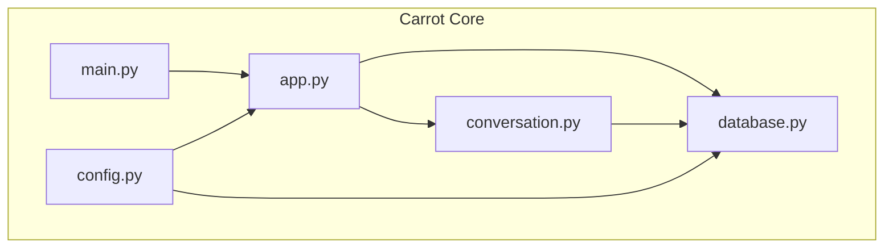
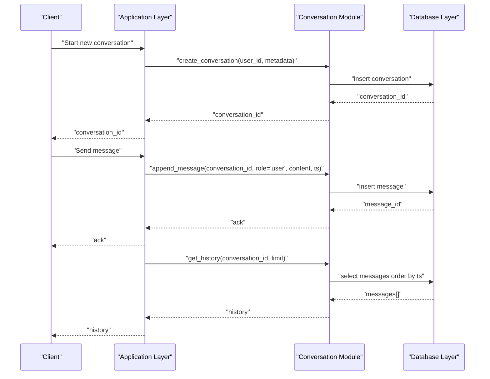
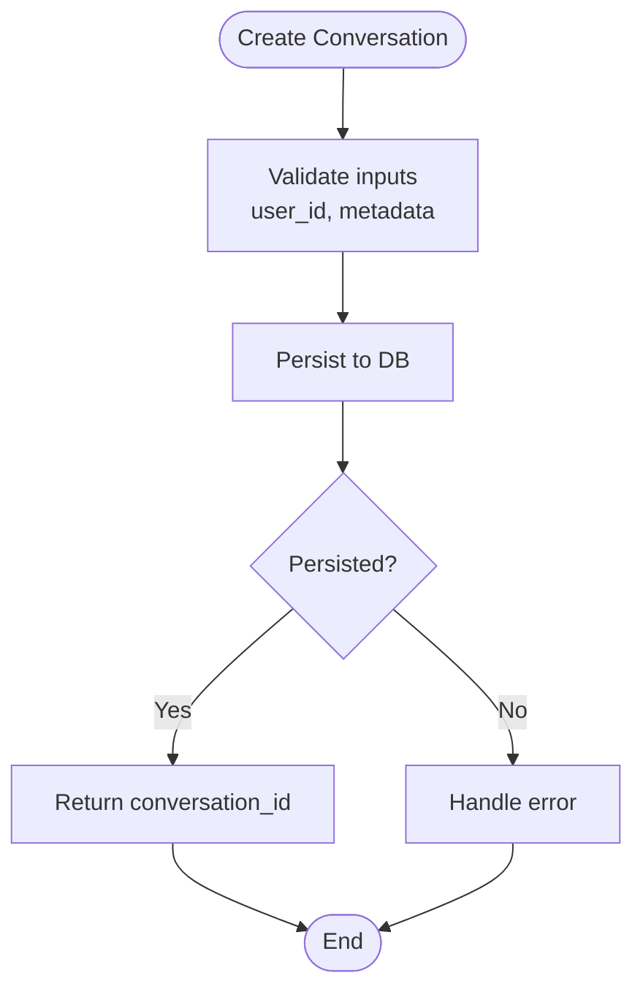
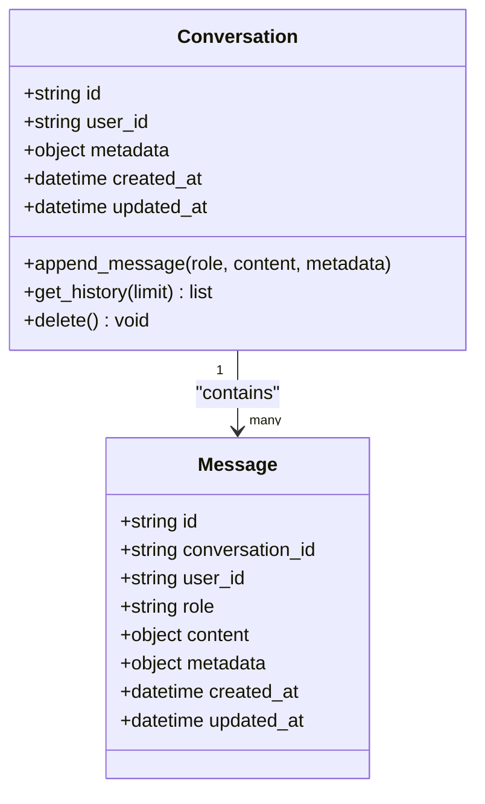
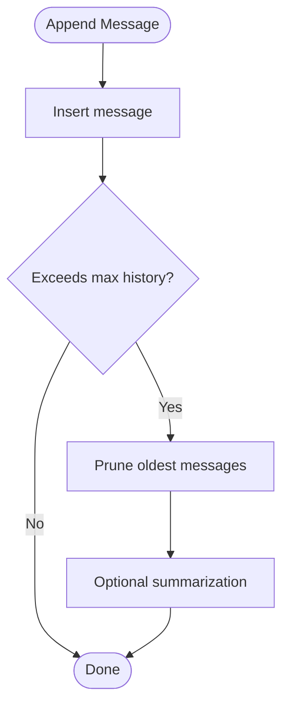
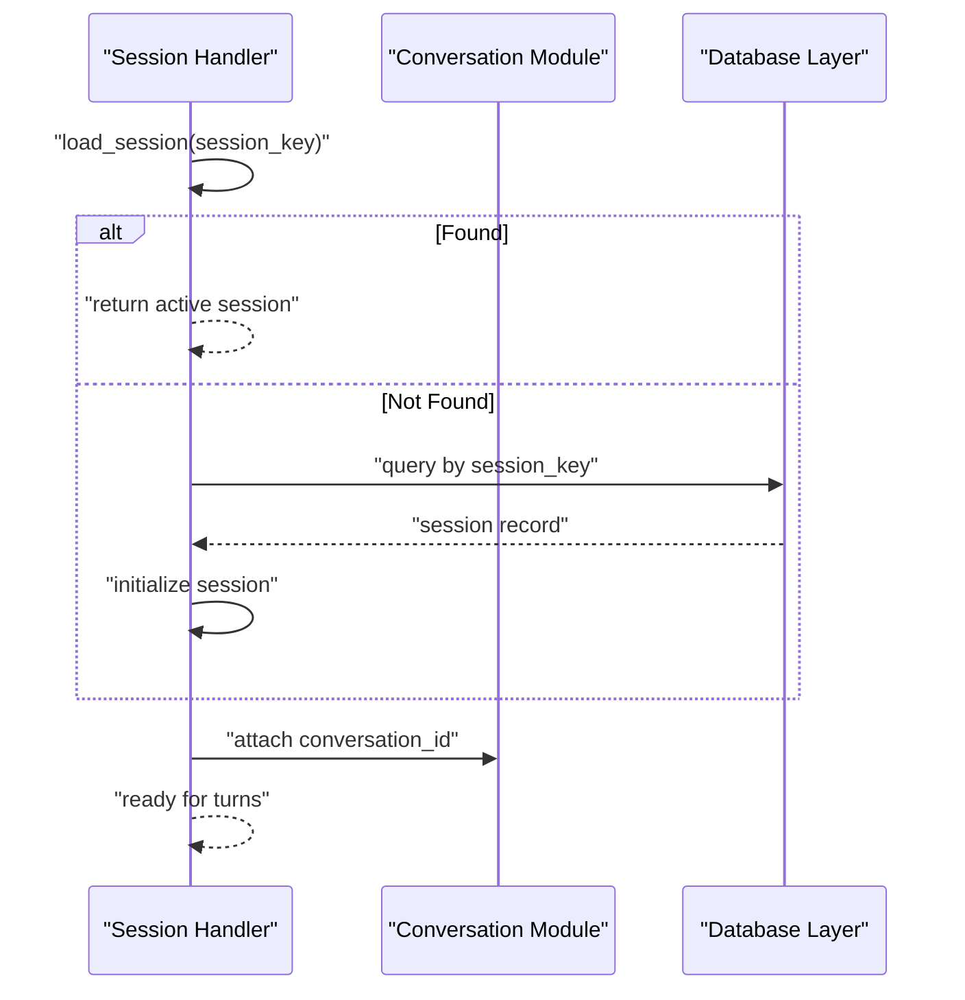
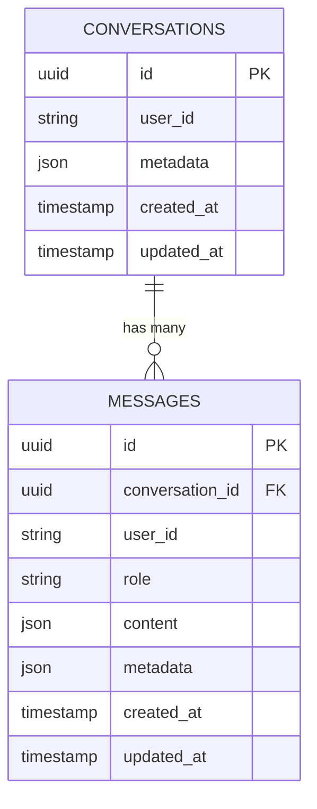
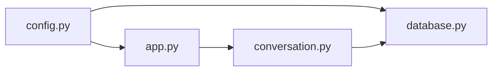

# Conversation Data Model

<cite>
**Referenced Files in This Document**
- [conversation.py](file://carrot/conversation.py)
- [database.py](file://carrot/database.py)
- [app.py](file://carrot/app.py)
- [config.py](file://carrot/config.py)
- [main.py](file://carrot/main.py)
</cite>

## Table of Contents
1. [Introduction](#introduction)
2. [Project Structure](#project-structure)
3. [Core Components](#core-components)
4. [Architecture Overview](#architecture-overview)
5. [Detailed Component Analysis](#detailed-component-analysis)
6. [Dependency Analysis](#dependency-analysis)
7. [Performance Considerations](#performance-considerations)
8. [Troubleshooting Guide](#troubleshooting-guide)
9. [Conclusion](#conclusion)

## Introduction
This document explains the conversation data model and message storage system used by the application. It covers how conversations are represented, how messages are stored and retrieved, how context is managed across turns, and how sessions are handled. It also documents metadata such as timestamps and user associations, AI response tracking, lifecycle management, cleanup policies, and memory strategies. Examples of data structures and query patterns are included to guide implementation and integration.

## Project Structure
The conversation subsystem spans a small set of core modules:
- A dedicated conversation module that defines entities and operations for conversations and messages.
- A database module that provides persistence primitives and schema access.
- Application entry points and configuration that wire these components together.

**Diagram sources**
- [conversation.py](file://carrot/conversation.py)
- [database.py](file://carrot/database.py)
- [config.py](file://carrot/config.py)
- [app.py](file://carrot/app.py)
- [main.py](file://carrot/main.py)

**Section sources**
- [conversation.py](file://carrot/conversation.py)
- [database.py](file://carrot/database.py)
- [config.py](file://carrot/config.py)
- [app.py](file://carrot/app.py)
- [main.py](file://carrot/main.py)

## Core Components
- Conversation entity: Represents a single conversation session with identifiers, metadata, and links to its messages.
- Message entity: Represents individual turns within a conversation, including role, content, timestamps, and optional metadata (e.g., tool usage or citations).
- Context manager: Maintains the active conversation state, handles turn-by-turn updates, and enforces limits on history size.
- Session handler: Manages per-user or per-device sessions, creation, lookup, and cleanup.
- Storage layer: Persists conversations and messages via the database module, providing CRUD operations and queries.

Key responsibilities:
- Create, read, update, and delete conversations.
- Append messages to a conversation and retrieve ordered history.
- Track AI responses and associate them with user prompts.
- Enforce retention and pruning policies to manage memory.
- Provide consistent interfaces for the UI and background tasks.

**Section sources**
- [conversation.py](file://carrot/conversation.py)
- [database.py](file://carrot/database.py)

## Architecture Overview
The architecture separates concerns between domain logic (conversation and message models), persistence (database), and orchestration (application layer). The conversation module exposes high-level APIs; the database module abstracts storage details; the app layer wires configuration and routes requests to handlers.

**Diagram sources**
- [conversation.py](file://carrot/conversation.py)
- [database.py](file://carrot/database.py)
- [app.py](file://carrot/app.py)

## Detailed Component Analysis

### Conversation Entity and Lifecycle
- Creation: Initializes a new conversation with a unique identifier, user association, and initial metadata.
- Retrieval: Loads an existing conversation by ID, including summary fields and latest timestamp.
- Deletion: Removes a conversation and cascades deletion of associated messages.
- Lifecycle states: Active, archived, deleted (if implemented).

**Diagram sources**
- [conversation.py](file://carrot/conversation.py)
- [database.py](file://carrot/database.py)

**Section sources**
- [conversation.py](file://carrot/conversation.py)
- [database.py](file://carrot/database.py)

### Message Structure and Metadata
- Role: Distinguishes user prompts from AI responses and system messages.
- Content: Text payload or structured payload depending on feature set.
- Timestamps: Created at and updated at for ordering and auditing.
- Associations: Links to conversation_id and user_id.
- Optional metadata: Tool calls, citations, confidence scores, or flags.

**Diagram sources**
- [conversation.py](file://carrot/conversation.py)
- [database.py](file://carrot/database.py)

**Section sources**
- [conversation.py](file://carrot/conversation.py)
- [database.py](file://carrot/database.py)

### Context Management and History
- Context window: Maintains a bounded history of recent messages to feed into AI prompts.
- Pruning policy: Removes oldest messages when exceeding configured limits.
- Summarization: Optionally compresses older parts of history to preserve context while reducing size.
- Ordering: Strictly chronological based on timestamps.

**Diagram sources**
- [conversation.py](file://carrot/conversation.py)
- [database.py](file://carrot/database.py)

**Section sources**
- [conversation.py](file://carrot/conversation.py)
- [database.py](file://carrot/database.py)

### Session Handling
- Session scope: Per-user or per-device sessions tied to a conversation.
- Lookup: Retrieve active session by user/session key.
- Cleanup: Expire or archive inactive sessions after a configurable timeout.
- Persistence: Sessions may be ephemeral in memory with durable snapshots persisted periodically.

**Diagram sources**
- [conversation.py](file://carrot/conversation.py)
- [database.py](file://carrot/database.py)

**Section sources**
- [conversation.py](file://carrot/conversation.py)
- [database.py](file://carrot/database.py)

### Storage Layer and Query Patterns
- Schema: Tables or collections for conversations and messages with indexes on foreign keys and timestamps.
- Indexing: Optimized for retrieval by conversation_id and created_at ordering.
- Queries:
  - Get latest N messages for a conversation.
  - Search messages by role or keyword.
  - Aggregate counts and last activity per conversation.
- Transactions: Ensure atomicity when appending multiple messages or performing cleanup.

**Diagram sources**
- [database.py](file://carrot/database.py)

**Section sources**
- [database.py](file://carrot/database.py)

### AI Response Tracking
- Role separation: User vs AI vs system roles ensure clear attribution.
- Metadata fields: Store tool invocations, function results, or citations alongside AI responses.
- Consistency: Maintain strict ordering and pairing of user prompts and AI replies.
- Auditability: Use timestamps and IDs to trace full interaction chains.

**Section sources**
- [conversation.py](file://carrot/conversation.py)
- [database.py](file://carrot/database.py)

### Cleanup Policies and Memory Management
- Retention: Configurable maximum number of messages per conversation.
- Archival: Move old conversations to cold storage or mark as archived.
- Garbage collection: Periodic jobs to purge expired sessions and orphaned messages.
- Memory strategy: Keep only active windows in memory; stream or paginate large histories.

**Section sources**
- [conversation.py](file://carrot/conversation.py)
- [config.py](file://carrot/config.py)

## Dependency Analysis
The conversation module depends on the database module for persistence and is orchestrated by the application layer. Configuration influences behavior such as retention limits and session timeouts.

**Diagram sources**
- [config.py](file://carrot/config.py)
- [app.py](file://carrot/app.py)
- [conversation.py](file://carrot/conversation.py)
- [database.py](file://carrot/database.py)

**Section sources**
- [config.py](file://carrot/config.py)
- [app.py](file://carrot/app.py)
- [conversation.py](file://carrot/conversation.py)
- [database.py](file://carrot/database.py)

## Performance Considerations
- Indexing: Ensure indexes on conversation_id and created_at for fast history retrieval.
- Pagination: Use cursor-based pagination for large histories to avoid heavy payloads.
- Bounded context: Limit context window size to reduce token usage and latency.
- Batch writes: Group related message inserts into transactions where possible.
- Caching: Cache frequently accessed conversation summaries or last few messages in memory.

[No sources needed since this section provides general guidance]

## Troubleshooting Guide
Common issues and resolutions:
- Missing conversation_id: Validate input and ensure proper initialization before appending messages.
- Out-of-order messages: Verify timestamp generation and insertion order; enforce monotonic timestamps.
- Excessive memory usage: Reduce context window size and enable periodic pruning.
- Slow queries: Review indexes and query plans; add composite indexes if necessary.
- Orphaned messages: Implement cascade deletes and periodic integrity checks.

**Section sources**
- [conversation.py](file://carrot/conversation.py)
- [database.py](file://carrot/database.py)

## Conclusion
The conversation data model centers around two primary entities—Conversations and Messages—supported by a robust storage layer and clear lifecycle management. By enforcing bounded contexts, strong indexing, and consistent metadata, the system delivers reliable history retrieval, efficient memory usage, and clear audit trails for AI interactions. Proper session handling and cleanup policies ensure long-term stability and scalability.

[No sources needed since this section summarizes without analyzing specific files]