# Data Models

<cite>
**Referenced Files in This Document**
- [database.py](file://carrot/database.py)
- [config.py](file://carrot/config.py)
- [app.py](file://carrot/app.py)
- [conversation.py](file://carrot/conversation.py)
- [goals.py](file://carrot/goals.py)
- [leaderboard.py](file://carrot/leaderboard.py)
- [notes.py](file://carrot/notes.py)
- [reminders.py](file://carrot/reminders.py)
- [search.py](file://carrot/search.py)
- [recap.py](file://carrot/recap.py)
- [speech/kokoro_tts.py](file://carrot/speech/kokoro_tts.py)
- [speech/whisper_stt.py](file://carrot/speech/whisper_stt.py)
</cite>

## Table of Contents
1. [Introduction](#introduction)
2. [Project Structure](#project-structure)
3. [Core Components](#core-components)
4. [Architecture Overview](#architecture-overview)
5. [Detailed Component Analysis](#detailed-component-analysis)
6. [Dependency Analysis](#dependency-analysis)
7. [Performance Considerations](#performance-considerations)
8. [Troubleshooting Guide](#troubleshooting-guide)
9. [Conclusion](#conclusion)
10. [Appendices](#appendices)

## Introduction
This document provides comprehensive data model documentation for the application, focusing on entity relationships, field definitions, data types, constraints, and validation rules across all modules. It includes database schema diagrams, sample data structures, migration strategies, lifecycle management, caching approaches, performance considerations, retention and archival policies, backup procedures, and security and privacy requirements. The goal is to make the data layer understandable for both technical and non-technical readers while ensuring traceability to source files.

## Project Structure
The data layer spans several Python modules within the carrot package:
- Database configuration and connection handling
- Feature-specific modules that define entities and persistence logic
- Speech processing modules that may interact with storage or external services

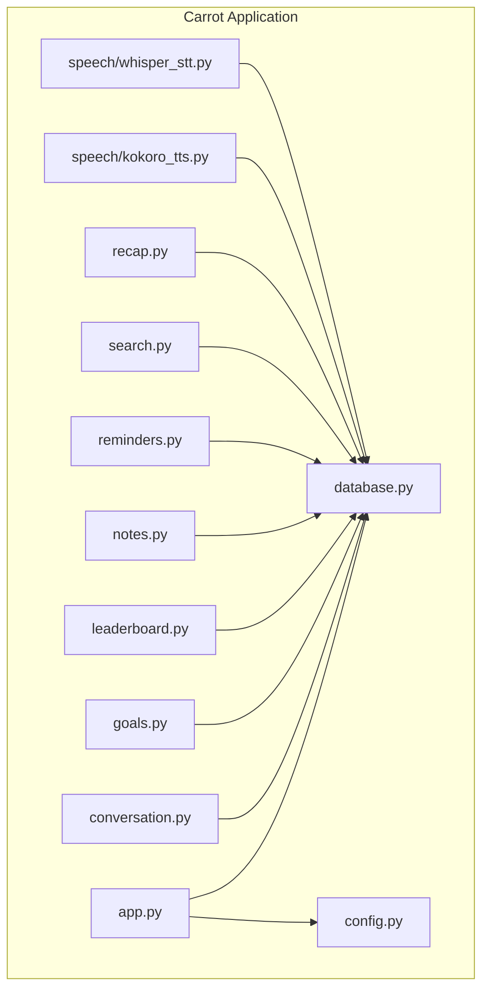

**Diagram sources**
- [app.py](file://carrot/app.py)
- [database.py](file://carrot/database.py)
- [config.py](file://carrot/config.py)
- [conversation.py](file://carrot/conversation.py)
- [goals.py](file://carrot/goals.py)
- [leaderboard.py](file://carrot/leaderboard.py)
- [notes.py](file://carrot/notes.py)
- [reminders.py](file://carrot/reminders.py)
- [search.py](file://carrot/search.py)
- [recap.py](file://carrot/recap.py)
- [speech/kokoro_tts.py](file://carrot/speech/kokoro_tts.py)
- [speech/whisper_stt.py](file://carrot/speech/whisper_stt.py)

**Section sources**
- [app.py](file://carrot/app.py)
- [database.py](file://carrot/database.py)
- [config.py](file://carrot/config.py)

## Core Components
- Database module: centralizes connection setup, schema initialization, migrations, and query helpers.
- Configuration module: defines environment-driven settings such as database paths, encryption flags, and feature toggles.
- Feature modules: each encapsulates domain entities (e.g., conversations, goals, notes, reminders), their fields, and persistence operations.
- Speech modules: handle audio input/output and may store or reference media artifacts.

Key responsibilities:
- Define entities and relationships
- Enforce constraints and validations at the boundary between application and storage
- Provide safe access patterns and error handling
- Support indexing and search where applicable

**Section sources**
- [database.py](file://carrot/database.py)
- [config.py](file://carrot/config.py)
- [conversation.py](file://carrot/conversation.py)
- [goals.py](file://carrot/goals.py)
- [notes.py](file://carrot/notes.py)
- [reminders.py](file://carrot/reminders.py)
- [search.py](file://carrot/search.py)
- [recap.py](file://carrot/recap.py)
- [speech/kokoro_tts.py](file://carrot/speech/kokoro_tts.py)
- [speech/whisper_stt.py](file://carrot/speech/whisper_stt.py)

## Architecture Overview
The data architecture follows a layered approach:
- Presentation/API layer (app.py) orchestrates requests and delegates to domain modules.
- Domain modules implement business logic and call into the database layer.
- Database layer abstracts storage details, manages connections, and executes queries.
- Configuration drives runtime behavior and security settings.

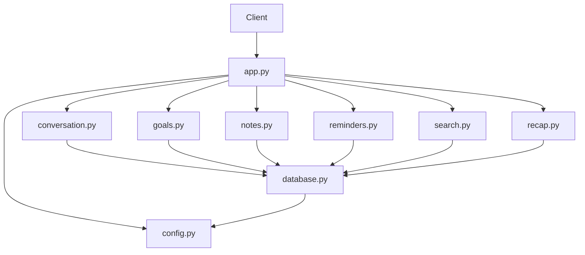

**Diagram sources**
- [app.py](file://carrot/app.py)
- [conversation.py](file://carrot/conversation.py)
- [goals.py](file://carrot/goals.py)
- [notes.py](file://carrot/notes.py)
- [reminders.py](file://carrot/reminders.py)
- [search.py](file://carrot/search.py)
- [recap.py](file://carrot/recap.py)
- [database.py](file://carrot/database.py)
- [config.py](file://carrot/config.py)

## Detailed Component Analysis

### Database Layer
Responsibilities:
- Initialize and manage database connections
- Create tables and indexes
- Execute CRUD operations safely
- Handle transactions and rollback scenarios
- Provide migration hooks and versioning support

Data model aspects:
- Centralized schema definitions
- Consistent naming conventions for tables and columns
- Indexes for frequently queried fields
- Constraints for integrity (unique, not null, foreign keys)

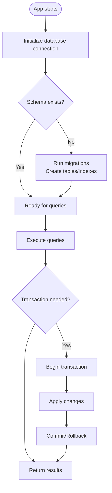

**Diagram sources**
- [database.py](file://carrot/database.py)

**Section sources**
- [database.py](file://carrot/database.py)

### Configuration
Responsibilities:
- Load environment variables and defaults
- Expose settings for database path, encryption, logging, and feature flags
- Validate critical settings at startup

Security implications:
- Secrets should be sourced from secure environments
- Encryption flags control sensitive data handling
- Logging levels can be tuned to avoid leaking sensitive information

**Section sources**
- [config.py](file://carrot/config.py)

### Conversation Module
Entity overview:
- Represents user conversations with messages and metadata
- Fields typically include identifiers, timestamps, content, and associations

Relationships:
- One-to-many relationship with message entries
- Optional association with users or sessions

Validation:
- Non-empty content checks
- Timestamp ordering constraints
- Unique identifiers

Indexes:
- Primary key on conversation id
- Index on timestamps for chronological queries
- Index on user/session ids for retrieval

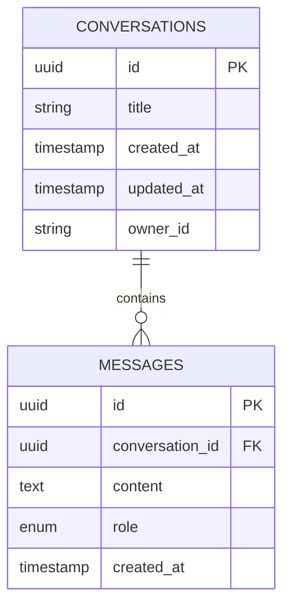

**Diagram sources**
- [conversation.py](file://carrot/conversation.py)
- [database.py](file://carrot/database.py)

**Section sources**
- [conversation.py](file://carrot/conversation.py)

### Goals Module
Entity overview:
- Tracks goals with status, deadlines, and priorities
- Supports categorization and tagging

Relationships:
- Many-to-one with owners/users
- Optional linkage to reminders or tasks

Validation:
- Status transitions enforced by state machine
- Deadline must be in the future when set
- Priority values constrained to allowed set

Indexes:
- Primary key on goal id
- Index on owner_id for user-scoped queries
- Index on deadline for due-date filtering

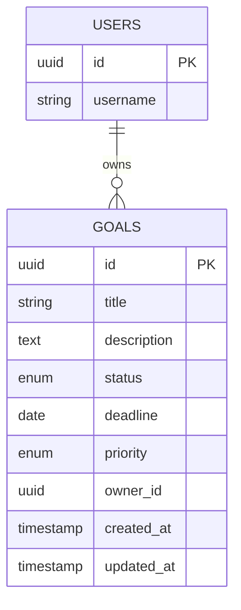

**Diagram sources**
- [goals.py](file://carrot/goals.py)
- [database.py](file://carrot/database.py)

**Section sources**
- [goals.py](file://carrot/goals.py)

### Leaderboard Module
Entity overview:
- Aggregates scores or achievements for ranking
- Stores periodic snapshots and cumulative metrics

Relationships:
- Many-to-one with users
- One-to-many with score entries over time

Validation:
- Score values must be non-negative
- Duplicate entries prevented via unique constraints on user and period

Indexes:
- Primary key on leaderboard entry id
- Index on user_id for per-user history
- Composite index on (user_id, period) for uniqueness

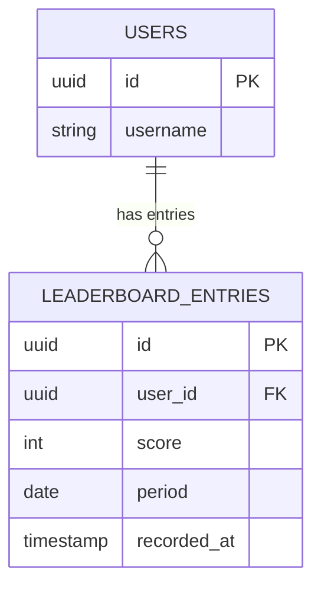

**Diagram sources**
- [leaderboard.py](file://carrot/leaderboard.py)
- [database.py](file://carrot/database.py)

**Section sources**
- [leaderboard.py](file://carrot/leaderboard.py)

### Notes Module
Entity overview:
- Stores user notes with rich text or structured content
- Includes tags and categories for organization

Relationships:
- Many-to-one with users
- Optional linkage to conversations or goals

Validation:
- Content length limits
- Tag format validation
- Ownership enforcement

Indexes:
- Primary key on note id
- Index on user_id for retrieval
- Full-text index on content for search

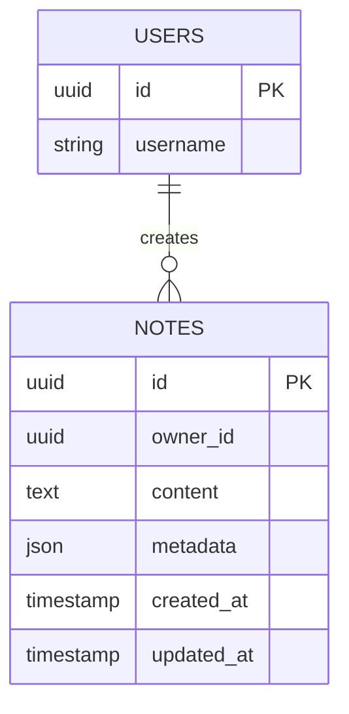

**Diagram sources**
- [notes.py](file://carrot/notes.py)
- [database.py](file://carrot/database.py)

**Section sources**
- [notes.py](file://carrot/notes.py)

### Reminders Module
Entity overview:
- Manages scheduled reminders with recurrence rules
- Tracks delivery status and notifications

Relationships:
- Many-to-one with users
- Optional linkage to goals or notes

Validation:
- Recurrence intervals validated against allowed patterns
- Delivery attempts limited to prevent spam

Indexes:
- Primary key on reminder id
- Index on next_run_time for scheduler queries
- Index on user_id for user-scoped lists

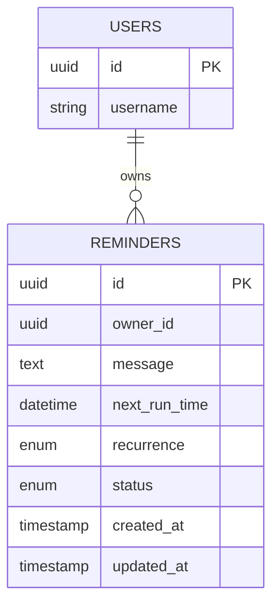

**Diagram sources**
- [reminders.py](file://carrot/reminders.py)
- [database.py](file://carrot/database.py)

**Section sources**
- [reminders.py](file://carrot/reminders.py)

### Search Module
Responsibilities:
- Provides full-text search across notes, conversations, and other indexed content
- Implements query parsing and result ranking

Data model aspects:
- Search index tables or virtual views
- Mapping between searchable content and primary keys

Validation:
- Query sanitization to prevent injection
- Result size limits to maintain performance

Indexes:
- Full-text indexes on relevant fields
- Composite indexes for multi-criteria searches

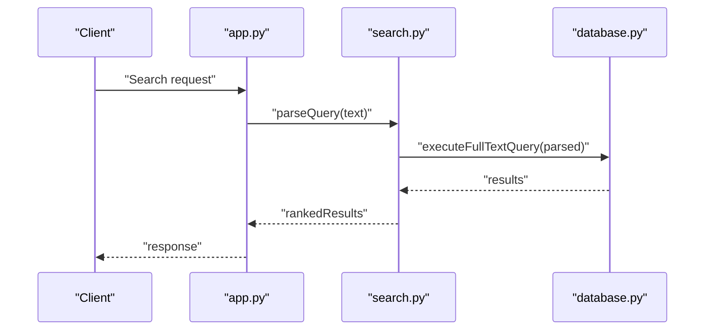

**Diagram sources**
- [search.py](file://carrot/search.py)
- [database.py](file://carrot/database.py)

**Section sources**
- [search.py](file://carrot/search.py)

### Recap Module
Responsibilities:
- Generates summaries or recaps based on stored data
- May aggregate insights from conversations, goals, and notes

Data model aspects:
- Temporary or persistent recap records
- References to source entities

Validation:
- Source entity existence checks
- Output formatting constraints

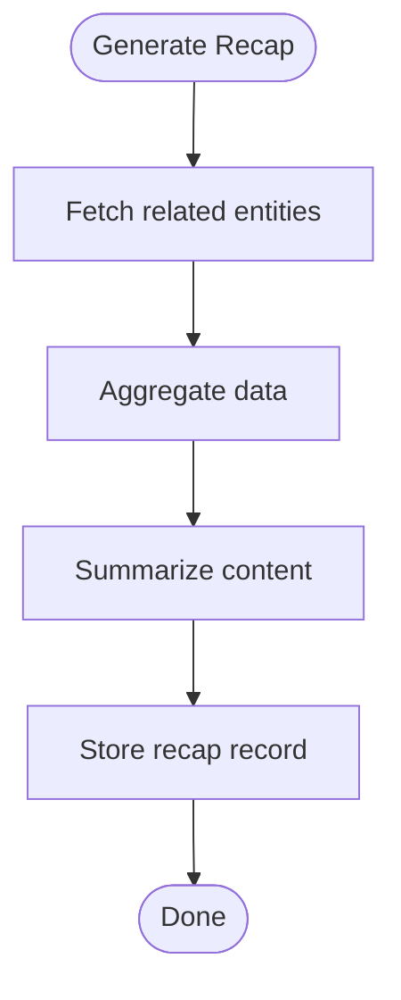

**Diagram sources**
- [recap.py](file://carrot/recap.py)
- [database.py](file://carrot/database.py)

**Section sources**
- [recap.py](file://carrot/recap.py)

### Speech Modules
Kokoro TTS:
- Converts text to speech and may store audio artifacts
- Handles output formats and quality settings

Whisper STT:
- Transcribes audio to text and may cache intermediate results
- Integrates with language models for accuracy

Data model aspects:
- Audio file references or blobs
- Metadata for transcription results

Validation:
- File format checks
- Size limits for uploads

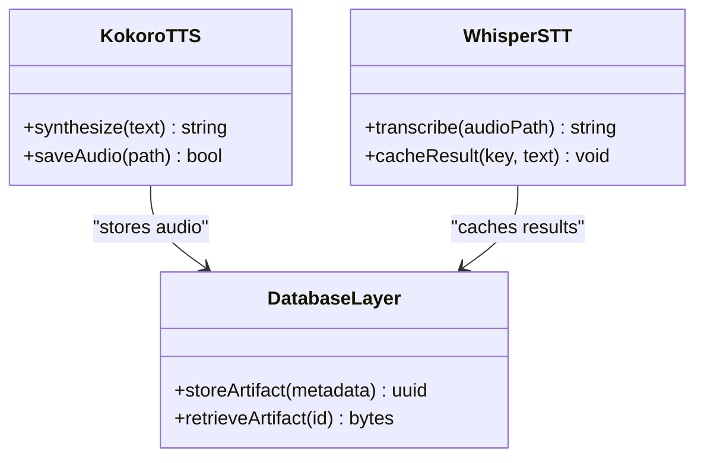

**Diagram sources**
- [speech/kokoro_tts.py](file://carrot/speech/kokoro_tts.py)
- [speech/whisper_stt.py](file://carrot/speech/whisper_stt.py)
- [database.py](file://carrot/database.py)

**Section sources**
- [speech/kokoro_tts.py](file://carrot/speech/kokoro_tts.py)
- [speech/whisper_stt.py](file://carrot/speech/whisper_stt.py)

## Dependency Analysis
The data layer dependencies are cohesive and modular:
- app.py depends on feature modules and configuration
- Feature modules depend on database layer for persistence
- Speech modules may depend on database for artifact storage
- Configuration influences all components through shared settings

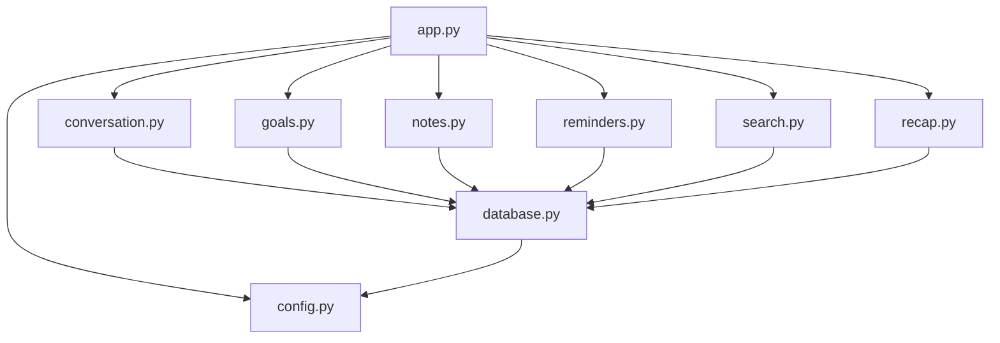

**Diagram sources**
- [app.py](file://carrot/app.py)
- [conversation.py](file://carrot/conversation.py)
- [goals.py](file://carrot/goals.py)
- [notes.py](file://carrot/notes.py)
- [reminders.py](file://carrot/reminders.py)
- [search.py](file://carrot/search.py)
- [recap.py](file://carrot/recap.py)
- [database.py](file://carrot/database.py)
- [config.py](file://carrot/config.py)

**Section sources**
- [app.py](file://carrot/app.py)
- [database.py](file://carrot/database.py)
- [config.py](file://carrot/config.py)

## Performance Considerations
- Indexing strategy: ensure primary keys and frequent query filters are indexed
- Query optimization: use selective projections and avoid N+1 queries
- Connection pooling: configure pool sizes appropriate to workload
- Caching: implement read-through caches for hot data (e.g., leaderboards, recent notes)
- Archival: move cold data to archive tables or partitions to keep main tables lean
- Batch operations: group writes to reduce transaction overhead

[No sources needed since this section provides general guidance]

## Troubleshooting Guide
Common issues and resolutions:
- Connection failures: verify database credentials and network reachability
- Schema mismatches: run migrations to align schema with code expectations
- Constraint violations: inspect logs for unique or foreign key errors
- Performance regressions: analyze slow queries and add missing indexes
- Security alerts: review encryption settings and access controls

**Section sources**
- [database.py](file://carrot/database.py)
- [config.py](file://carrot/config.py)

## Conclusion
The data model is organized around clear entities and relationships, with robust persistence and validation mechanisms. By following the recommended practices for indexing, caching, and security, the system can scale effectively while maintaining data integrity and privacy. Migration strategies and backup procedures should be implemented to ensure reliability and compliance.

[No sources needed since this section summarizes without analyzing specific files]

## Appendices

### Sample Data Structures
- Conversations: identifier, title, timestamps, owner reference
- Messages: identifier, conversation reference, content, role, timestamp
- Goals: identifier, title, description, status, deadline, priority, owner, timestamps
- Leaderboard entries: identifier, user reference, score, period, recorded timestamp
- Notes: identifier, owner, content, metadata, timestamps
- Reminders: identifier, owner, message, next run time, recurrence, status, timestamps
- Speech artifacts: identifier, owner, file path or blob, metadata, timestamps

[No sources needed since this section provides conceptual examples]

### Migration Strategies
- Versioned migration scripts aligned with schema changes
- Rollback procedures for failed migrations
- Data backfills for new fields or indexes
- Testing migrations against staging datasets

[No sources needed since this section provides conceptual guidance]

### Data Retention and Archival
- Define retention periods per entity type
- Implement automated archival jobs
- Purge expired data securely
- Maintain audit trails for archived records

[No sources needed since this section provides conceptual guidance]

### Backup Procedures
- Regular full and incremental backups
- Encrypted storage for backups
- Restore drills to validate recovery processes
- Monitoring and alerting for backup failures

[No sources needed since this section provides conceptual guidance]

### Security and Privacy
- Encrypt sensitive fields at rest and in transit
- Enforce least privilege access controls
- Sanitize inputs and outputs to prevent injection
- Audit access to sensitive data
- Comply with privacy regulations and data minimization principles

[No sources needed since this section provides conceptual guidance]