# Goals Data Model

<cite>
**Referenced Files in This Document**
- [goals.py](file://carrot/goals.py)
- [database.py](file://carrot/database.py)
- [app.py](file://carrot/app.py)
- [config.py](file://carrot/config.py)
</cite>

## Table of Contents
1. [Introduction](#introduction)
2. [Project Structure](#project-structure)
3. [Core Components](#core-components)
4. [Architecture Overview](#architecture-overview)
5. [Detailed Component Analysis](#detailed-component-analysis)
6. [Dependency Analysis](#dependency-analysis)
7. [Performance Considerations](#performance-considerations)
8. [Troubleshooting Guide](#troubleshooting-guide)
9. [Conclusion](#conclusion)
10. [Appendices](#appendices)

## Introduction
This document describes the goals tracking data model, including goal entities, status tracking, progress monitoring, categorization systems, hierarchies, dependencies, deadlines, milestone tracking, validation rules, business logic constraints, automated status updates, analytics and reporting structures, historical tracking, and example workflows for creation, updates, and completion. It is intended to be accessible to both technical and non-technical readers while remaining grounded in the repository’s implementation.

## Project Structure
The goals feature is implemented primarily within the Python application layer and persists data through a database module. The relevant files include:
- Goals domain logic and persistence helpers
- Database schema and access patterns
- Application entry points and API handlers
- Configuration settings that influence behavior

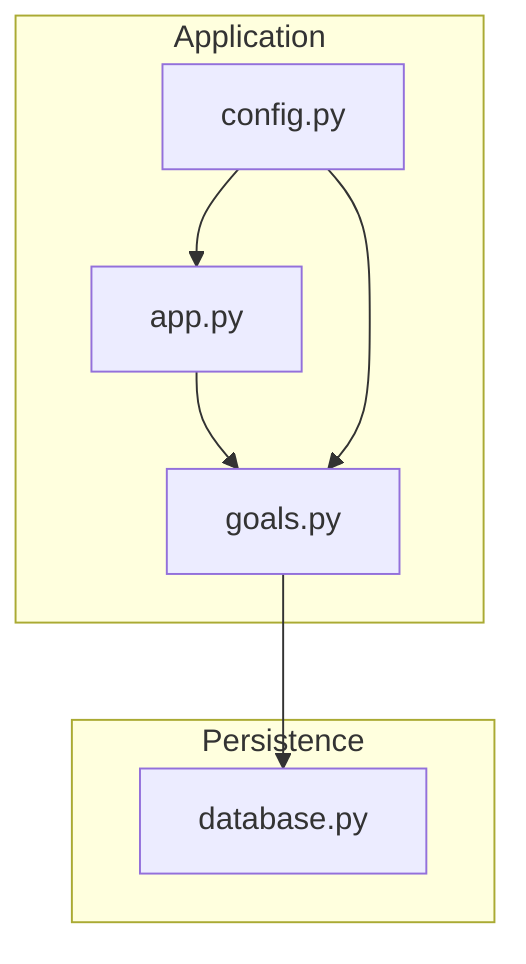

**Diagram sources**
- [app.py](file://carrot/app.py)
- [goals.py](file://carrot/goals.py)
- [database.py](file://carrot/database.py)
- [config.py](file://carrot/config.py)

**Section sources**
- [goals.py](file://carrot/goals.py)
- [database.py](file://carrot/database.py)
- [app.py](file://carrot/app.py)
- [config.py](file://carrot/config.py)

## Core Components
- Goal entity: Represents a user-defined objective with attributes such as title, description, category, deadline, parent/child relationships, dependencies, milestones, and progress metrics.
- Status tracking: Enumerated states (e.g., not started, in progress, completed, cancelled) with transitions governed by business rules.
- Progress monitoring: Numeric or percentage-based progress fields updated via checkpoints or milestone completions.
- Categorization system: Tags or categories enabling grouping and filtering of goals.
- Hierarchies and dependencies: Parent-child structure and dependency edges between goals to model complex plans.
- Deadlines and milestones: Time-bound targets and intermediate deliverables that drive automation and reminders.
- Validation and constraints: Rules ensuring data integrity (e.g., valid dates, consistent statuses, acyclic dependencies).
- Automated status updates: Background or event-driven logic that adjusts status based on deadlines, milestone completion, and progress thresholds.
- Analytics and reporting: Aggregations over goals by category, status, deadline proximity, and completion rates; historical snapshots for trend analysis.

**Section sources**
- [goals.py](file://carrot/goals.py)
- [database.py](file://carrot/database.py)

## Architecture Overview
The goals subsystem follows a layered architecture:
- Presentation/API layer: Exposes endpoints or commands for creating, updating, querying, and completing goals.
- Domain layer: Encapsulates goal business logic, validation, state transitions, and progress calculations.
- Persistence layer: Manages schema definitions, queries, transactions, and migrations.

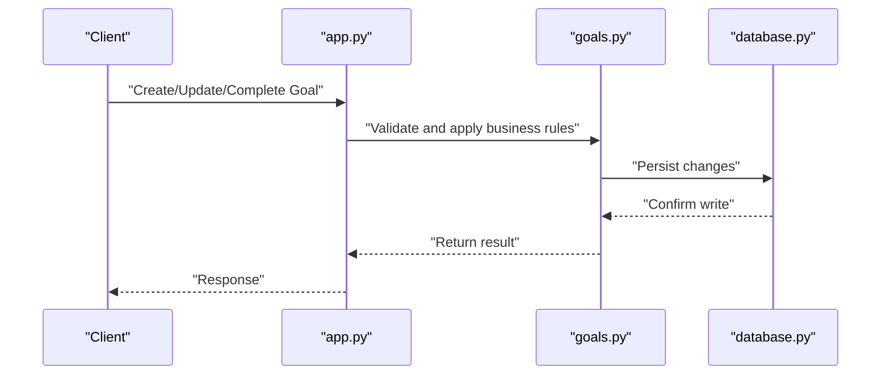

**Diagram sources**
- [app.py](file://carrot/app.py)
- [goals.py](file://carrot/goals.py)
- [database.py](file://carrot/database.py)

## Detailed Component Analysis

### Goal Entity Model
- Attributes typically include:
  - Identifier and metadata (title, description, created/updated timestamps)
  - Category/tag for classification
  - Deadline and priority
  - Parent_id for hierarchical structure
  - Dependencies list for cross-goal constraints
  - Milestones with due dates and completion flags
  - Progress fields (numeric or percentage) and checkpoints
  - Status field with allowed transitions
- Relationships:
  - One-to-many parent-child hierarchy
  - Many-to-many dependencies via edges or lists
  - One-to-many milestones per goal

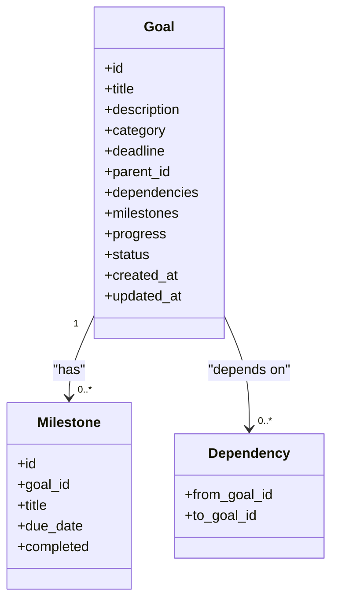

**Diagram sources**
- [goals.py](file://carrot/goals.py)
- [database.py](file://carrot/database.py)

**Section sources**
- [goals.py](file://carrot/goals.py)
- [database.py](file://carrot/database.py)

### Status Tracking and Transitions
- Allowed statuses commonly include: Not Started, In Progress, Completed, Cancelled.
- Transition rules:
  - Not Started → In Progress when work begins or first checkpoint added
  - In Progress → Completed when all required conditions are met (e.g., milestones done, progress threshold reached)
  - Any → Cancelled under explicit cancellation logic
- Automated updates:
  - Deadline-driven transitions (e.g., overdue handling)
  - Milestone completion triggers partial or full progress updates
  - Progress thresholds trigger status changes

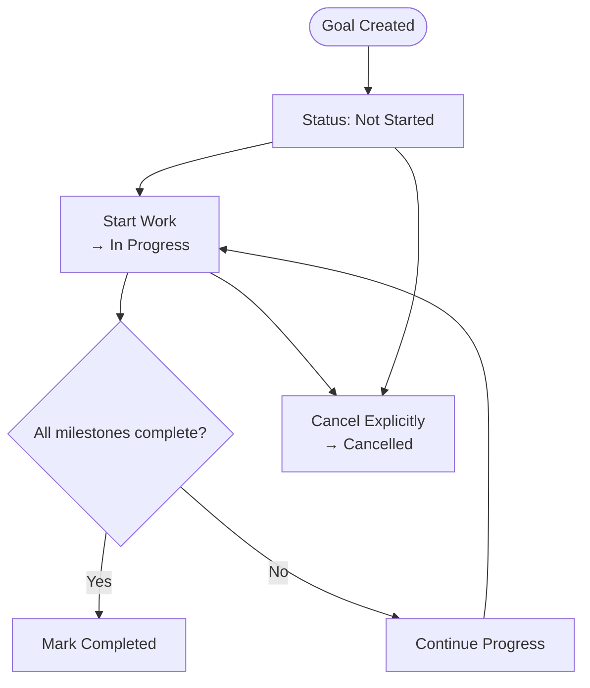

**Diagram sources**
- [goals.py](file://carrot/goals.py)

**Section sources**
- [goals.py](file://carrot/goals.py)

### Progress Monitoring and Milestones
- Progress can be tracked via:
  - Percentage fields updated incrementally
  - Checkpoint entries with timestamps and notes
  - Milestone completion counts influencing overall progress
- Business logic:
  - Progress cannot exceed 100%
  - Milestone due dates affect urgency indicators
  - Automatic recalculation upon milestone completion

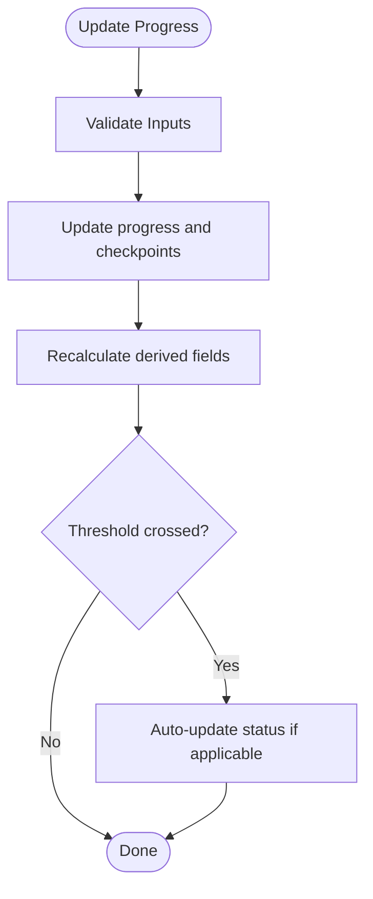

**Diagram sources**
- [goals.py](file://carrot/goals.py)

**Section sources**
- [goals.py](file://carrot/goals.py)

### Hierarchies and Dependencies
- Hierarchies:
  - Parent-child links enable roll-up of progress and deadlines
  - Child completion may contribute to parent progress
- Dependencies:
  - A goal cannot start until its dependencies are completed
  - Cycle detection prevents circular dependencies
- Enforcement:
  - Validation at create/update time
  - Runtime checks before transitioning to In Progress

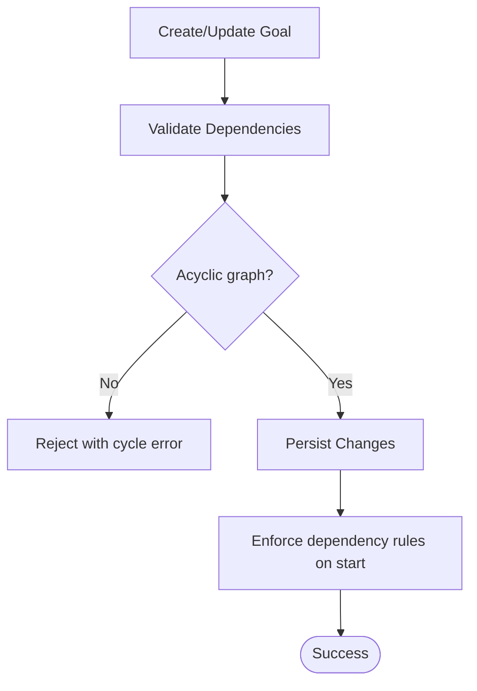

**Diagram sources**
- [goals.py](file://carrot/goals.py)
- [database.py](file://carrot/database.py)

**Section sources**
- [goals.py](file://carrot/goals.py)
- [database.py](file://carrot/database.py)

### Deadlines and Automation
- Deadline fields support scheduling and reminders
- Automated actions:
  - Overdue flagging and notifications
  - Status adjustments based on deadline proximity
  - Milestone due date enforcement

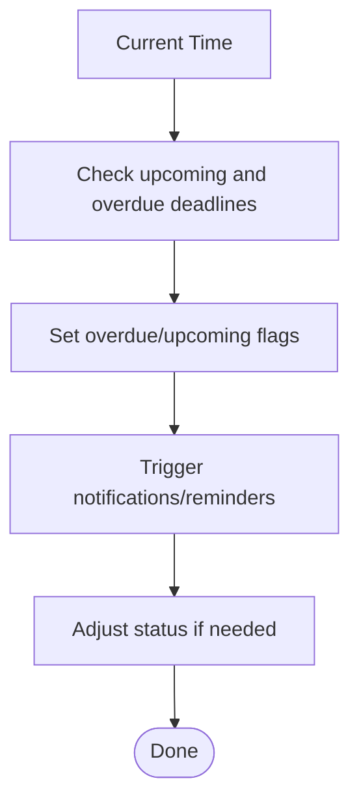

**Diagram sources**
- [goals.py](file://carrot/goals.py)

**Section sources**
- [goals.py](file://carrot/goals.py)

### Data Validation Rules and Constraints
- Required fields: id, title, status, timestamps
- Date validations: deadlines must be valid and logical relative to created_at
- Status transitions: enforced by allowed transition matrix
- Progress bounds: 0–100%, monotonic increases unless explicitly reset
- Dependency constraints: no self-references, no cycles
- Category/tag normalization: canonicalized values for consistency

**Section sources**
- [goals.py](file://carrot/goals.py)
- [database.py](file://carrot/database.py)

### Automated Status Updates
- Triggers:
  - Milestone completion events
  - Progress threshold crossings
  - Deadline checks (scheduled jobs or on-write hooks)
- Actions:
  - Update status field
  - Record audit trail/history entries
  - Emit events for downstream consumers

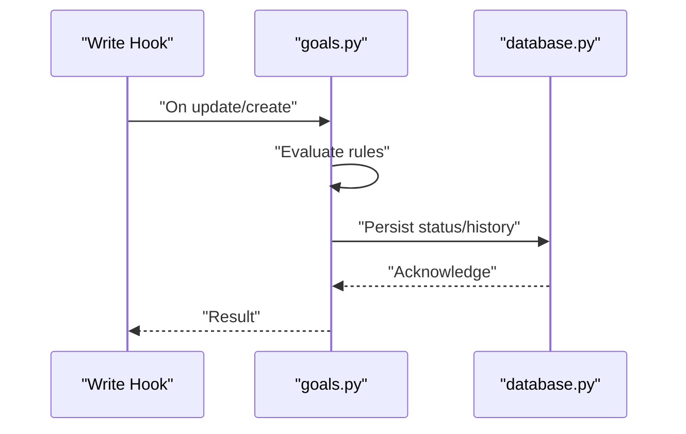

**Diagram sources**
- [goals.py](file://carrot/goals.py)
- [database.py](file://carrot/database.py)

**Section sources**
- [goals.py](file://carrot/goals.py)
- [database.py](file://carrot/database.py)

### Analytics and Reporting Structures
- Metrics:
  - Completion rate by category and time window
  - Average time to completion
  - Overdue count and trends
  - Progress distribution across goals
- Reports:
  - Daily/weekly summaries
  - Category-wise breakdowns
  - Historical snapshots for trend analysis

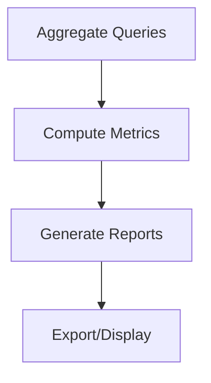

**Diagram sources**
- [goals.py](file://carrot/goals.py)
- [database.py](file://carrot/database.py)

**Section sources**
- [goals.py](file://carrot/goals.py)
- [database.py](file://carrot/database.py)

### Historical Tracking
- Audit trail:
  - Log status changes, progress updates, and edits
  - Capture who made changes and when
- Snapshots:
  - Periodic snapshots for long-term trend analysis
  - Rollback capability if needed

**Section sources**
- [goals.py](file://carrot/goals.py)
- [database.py](file://carrot/database.py)

### Example Workflows

#### Goal Creation Workflow
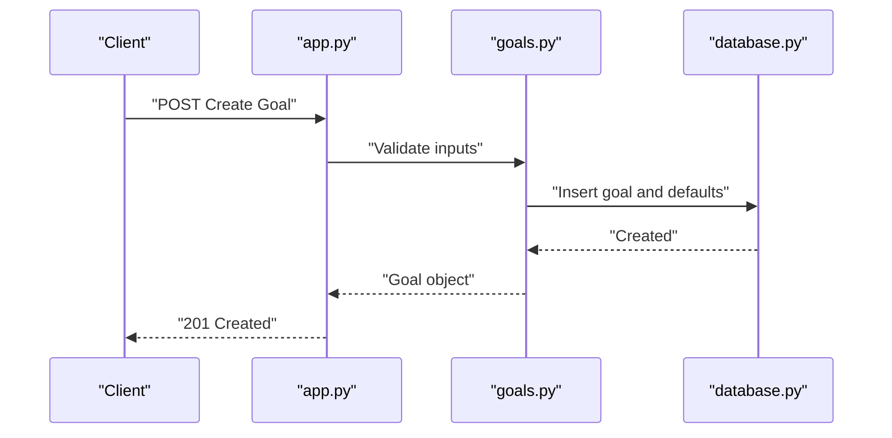

**Diagram sources**
- [app.py](file://carrot/app.py)
- [goals.py](file://carrot/goals.py)
- [database.py](file://carrot/database.py)

**Section sources**
- [app.py](file://carrot/app.py)
- [goals.py](file://carrot/goals.py)
- [database.py](file://carrot/database.py)

#### Goal Update Workflow
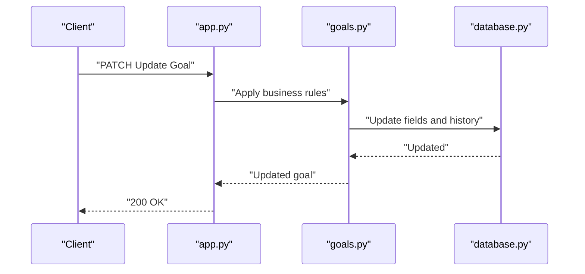

**Diagram sources**
- [app.py](file://carrot/app.py)
- [goals.py](file://carrot/goals.py)
- [database.py](file://carrot/database.py)

**Section sources**
- [app.py](file://carrot/app.py)
- [goals.py](file://carrot/goals.py)
- [database.py](file://carrot/database.py)

#### Goal Completion Workflow
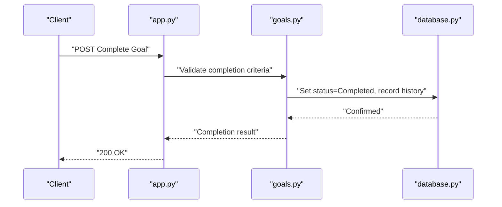

**Diagram sources**
- [app.py](file://carrot/app.py)
- [goals.py](file://carrot/goals.py)
- [database.py](file://carrot/database.py)

**Section sources**
- [app.py](file://carrot/app.py)
- [goals.py](file://carrot/goals.py)
- [database.py](file://carrot/database.py)

## Dependency Analysis
- Module coupling:
  - app.py depends on goals.py for domain operations
  - goals.py depends on database.py for persistence
  - config.py influences behavior across modules
- Cohesion:
  - goals.py encapsulates goal-related logic and validation
  - database.py centralizes schema and query logic
- External integrations:
  - Potential notification services triggered by automated updates
  - Scheduling mechanisms for deadline checks

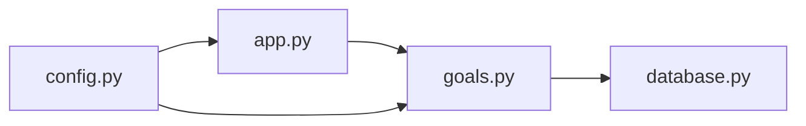

**Diagram sources**
- [app.py](file://carrot/app.py)
- [goals.py](file://carrot/goals.py)
- [database.py](file://carrot/database.py)
- [config.py](file://carrot/config.py)

**Section sources**
- [app.py](file://carrot/app.py)
- [goals.py](file://carrot/goals.py)
- [database.py](file://carrot/database.py)
- [config.py](file://carrot/config.py)

## Performance Considerations
- Batch operations for bulk updates to minimize round trips
- Indexing strategies for frequent queries (by category, status, deadline)
- Caching for read-heavy reports and dashboards
- Efficient milestone roll-ups using incremental updates
- Avoid deep recursive queries for hierarchies; use materialized paths where appropriate

[No sources needed since this section provides general guidance]

## Troubleshooting Guide
- Common issues:
  - Invalid status transitions: verify allowed transitions and input payloads
  - Dependency cycles: ensure graph validation runs on updates
  - Overdue misclassification: check timezone handling and deadline comparisons
  - Progress inconsistencies: confirm monotonic updates and milestone linkage
- Debugging steps:
  - Inspect audit logs for status and progress changes
  - Validate constraint violations via unit tests or integration tests
  - Review scheduled job outputs for automated updates

**Section sources**
- [goals.py](file://carrot/goals.py)
- [database.py](file://carrot/database.py)

## Conclusion
The goals data model provides a robust foundation for tracking objectives with clear status management, progress monitoring, categorization, hierarchies, dependencies, deadlines, and milestones. Validation rules and automated updates ensure data integrity and timely status transitions. Analytics and historical tracking support informed decision-making and continuous improvement.

[No sources needed since this section summarizes without analyzing specific files]

## Appendices

### Data Validation Rules Summary
- Required fields: id, title, status, timestamps
- Dates: valid and logically ordered
- Status transitions: constrained by defined matrix
- Progress: bounded and monotonic unless explicitly reset
- Dependencies: no self-references, no cycles
- Categories/tags: normalized and validated

**Section sources**
- [goals.py](file://carrot/goals.py)
- [database.py](file://carrot/database.py)

### Reporting Examples
- Daily summary: new goals, completed goals, overdue count
- Weekly report: category-wise completion rates, average progress
- Monthly trends: historical snapshots and performance metrics

**Section sources**
- [goals.py](file://carrot/goals.py)
- [database.py](file://carrot/database.py)