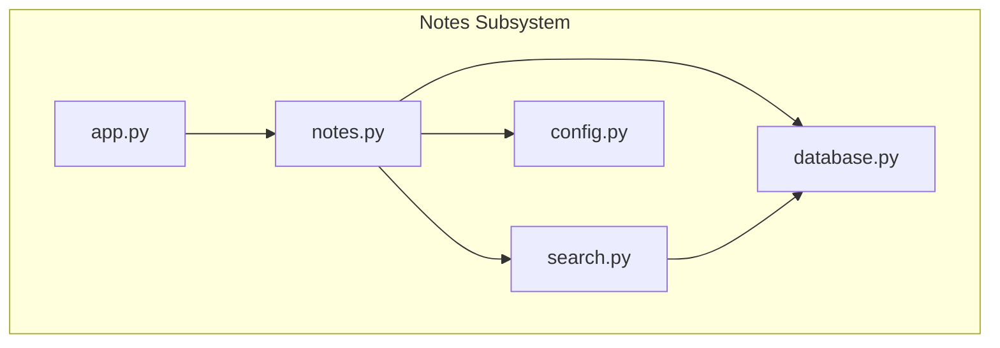
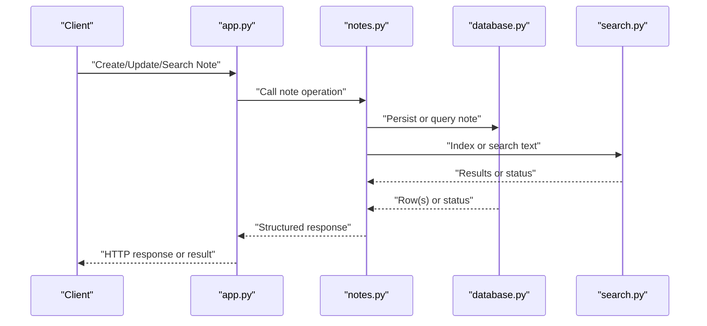
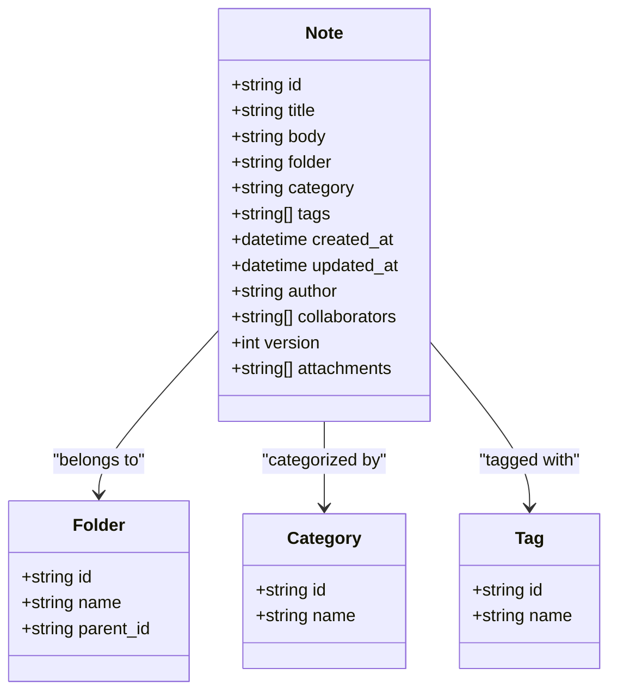
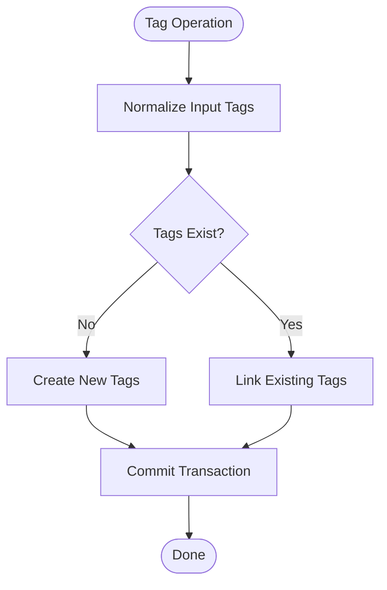
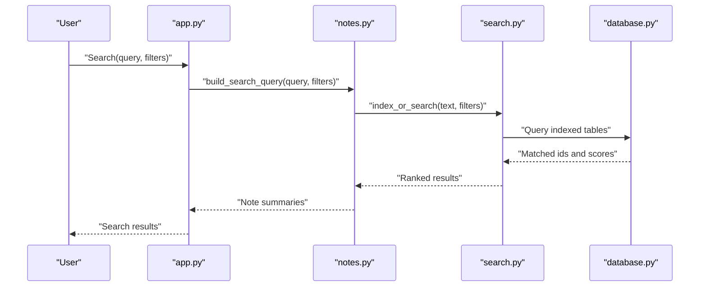
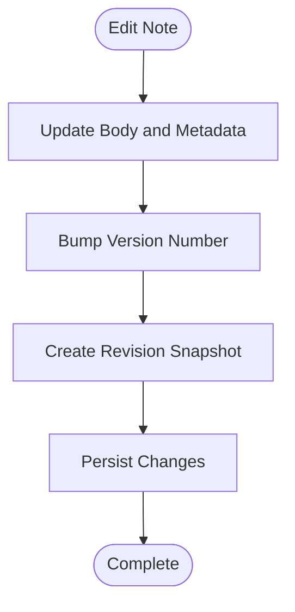
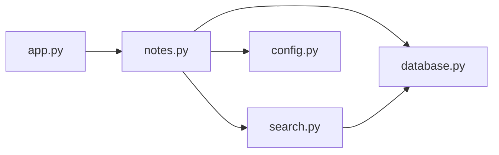

# Notes Data Model

<cite>
**Referenced Files in This Document**
- [notes.py](file://carrot/notes.py)
- [database.py](file://carrot/database.py)
- [search.py](file://carrot/search.py)
- [config.py](file://carrot/config.py)
- [app.py](file://carrot/app.py)
</cite>

## Table of Contents
1. [Introduction](#introduction)
2. [Project Structure](#project-structure)
3. [Core Components](#core-components)
4. [Architecture Overview](#architecture-overview)
5. [Detailed Component Analysis](#detailed-component-analysis)
6. [Dependency Analysis](#dependency-analysis)
7. [Performance Considerations](#performance-considerations)
8. [Troubleshooting Guide](#troubleshooting-guide)
9. [Conclusion](#conclusion)
10. [Appendices](#appendices)

## Introduction
This document describes the notes management data model and its implementation within the project. It explains how notes are represented, stored, organized, tagged, searched, and versioned, as well as how metadata is tracked and how collaboration features may be integrated. It also covers content formatting support, file attachments, and media handling patterns used by the system. The goal is to provide a clear, accessible reference for both technical and non-technical readers.

## Project Structure
The notes subsystem spans several modules:
- notes.py: Core note operations, schema definitions, and business logic for CRUD and organization.
- database.py: Persistence layer, including SQLite setup, migrations, and queries.
- search.py: Full-text search indexing and retrieval utilities.
- config.py: Configuration keys and defaults that influence storage paths and behavior.
- app.py: Application wiring that exposes endpoints or functions using the notes module.

**Diagram sources**
- [notes.py](file://carrot/notes.py)
- [database.py](file://carrot/database.py)
- [search.py](file://carrot/search.py)
- [config.py](file://carrot/config.py)
- [app.py](file://carrot/app.py)

**Section sources**
- [notes.py](file://carrot/notes.py)
- [database.py](file://carrot/database.py)
- [search.py](file://carrot/search.py)
- [config.py](file://carrot/config.py)
- [app.py](file://carrot/app.py)

## Core Components
- Note entity: Represents a single note with fields such as title, body, tags, category, folder, timestamps, and optional attachment references.
- Organization structures: Folders and categories provide hierarchical and categorical grouping; tags enable flexible multi-labeling.
- Content storage: Text bodies are persisted in the database; attachments/media are referenced via paths or identifiers.
- Search indexing: Full-text index supports fast keyword and phrase searches across titles and bodies.
- Metadata tracking: Creation/update timestamps, authorship, and optional versioning fields capture provenance and change history.
- Collaboration hooks: Optional fields and APIs can support shared ownership, comments, and access control.

Key responsibilities:
- notes.py: Defines schemas, validation, CRUD operations, tagging, categorization, and folder navigation.
- database.py: Manages connection lifecycle, table creation/migrations, and query execution.
- search.py: Builds and updates full-text indices and executes search queries.
- config.py: Provides configuration values for storage locations, indexing options, and feature flags.
- app.py: Integrates notes functionality into the application’s API surface.

**Section sources**
- [notes.py](file://carrot/notes.py)
- [database.py](file://carrot/database.py)
- [search.py](file://carrot/search.py)
- [config.py](file://carrot/config.py)
- [app.py](file://carrot/app.py)

## Architecture Overview
The notes subsystem follows a layered architecture:
- Presentation/API layer (app.py) calls into the notes service.
- Service layer (notes.py) orchestrates business logic, validation, and interactions with persistence and search.
- Persistence layer (database.py) abstracts SQL operations and schema management.
- Search layer (search.py) maintains an index for efficient querying.

**Diagram sources**
- [app.py](file://carrot/app.py)
- [notes.py](file://carrot/notes.py)
- [database.py](file://carrot/database.py)
- [search.py](file://carrot/search.py)

## Detailed Component Analysis

### Note Entity and Schema
The note entity includes:
- Identifiers and basic fields: id, title, body
- Organization: folder, category, tags
- Timestamps: created_at, updated_at
- Optional: author, collaborators, version, attachments

Data integrity and constraints are enforced at the database layer, while validation occurs in the notes service.

**Diagram sources**
- [notes.py](file://carrot/notes.py)
- [database.py](file://carrot/database.py)

**Section sources**
- [notes.py](file://carrot/notes.py)
- [database.py](file://carrot/database.py)

### Content Storage and Formatting
- Body content is stored as text in the database.
- Formatting support typically includes markdown-like syntax; rendering is handled outside the persistence layer.
- Attachments and media are referenced by stable identifiers or paths rather than embedding binary data directly.

Operational considerations:
- Validate content length and encoding.
- Sanitize user input to prevent injection.
- Normalize whitespace and handle large bodies efficiently.

**Section sources**
- [notes.py](file://carrot/notes.py)
- [database.py](file://carrot/database.py)

### Tagging System
Tags enable flexible labeling:
- Many-to-many relationships between notes and tags.
- Tag normalization (lowercasing, trimming) ensures consistency.
- Bulk tag operations support adding/removing multiple tags atomically.

**Diagram sources**
- [notes.py](file://carrot/notes.py)
- [database.py](file://carrot/database.py)

**Section sources**
- [notes.py](file://carrot/notes.py)
- [database.py](file://carrot/database.py)

### Organization Structures: Folders and Categories
- Folders provide hierarchical organization with parent-child relationships.
- Categories offer flat classification for cross-cutting concerns.
- Notes can belong to one folder and one category, but many tags.

Operations include creating folders, moving notes between folders, and listing contents recursively.

**Section sources**
- [notes.py](file://carrot/notes.py)
- [database.py](file://carrot/database.py)

### Search Indexing and Retrieval
Full-text search indexes titles and bodies for fast retrieval:
- Index updates occur on create/update/delete.
- Queries support keywords, phrases, and filters by folder/category/tags.
- Ranking considers relevance signals like match frequency and recency.

**Diagram sources**
- [search.py](file://carrot/search.py)
- [notes.py](file://carrot/notes.py)
- [database.py](file://carrot/database.py)
- [app.py](file://carrot/app.py)

**Section sources**
- [search.py](file://carrot/search.py)
- [notes.py](file://carrot/notes.py)
- [database.py](file://carrot/database.py)

### Metadata Tracking and Version Control
Metadata includes timestamps, authorship, and optional collaborator lists.
Version control tracks changes:
- Increment version on significant edits.
- Maintain a revision history table for rollback and audit.
- Store diff snapshots or pointers to previous versions.

**Diagram sources**
- [notes.py](file://carrot/notes.py)
- [database.py](file://carrot/database.py)

**Section sources**
- [notes.py](file://carrot/notes.py)
- [database.py](file://carrot/database.py)

### Collaboration Features
Collaboration can be modeled through:
- Author and collaborator fields on notes.
- Access control checks before read/write operations.
- Shared folders/categories for team-based organization.
- Audit logs for tracking changes by users.

Integration points:
- Enforce permissions in the notes service.
- Extend search to respect visibility rules.
- Provide APIs for inviting collaborators and managing roles.

**Section sources**
- [notes.py](file://carrot/notes.py)
- [database.py](file://carrot/database.py)

### File Attachments and Media Handling
Attachments are managed by reference:
- Store file paths or object identifiers.
- Validate file types and sizes.
- Support thumbnail generation for images and previews for documents.
- Ensure secure access controls for shared resources.

Operations include uploading, linking, previewing, and deleting attachments.

**Section sources**
- [notes.py](file://carrot/notes.py)
- [database.py](file://carrot/database.py)

### Examples of Operations
- Create a note:
  - Provide title, body, optional tags, folder, and category.
  - System assigns id, timestamps, and initializes version.
- Organize a note:
  - Move to a different folder or update category.
  - Add/remove tags in bulk.
- Retrieve a note:
  - Fetch by id or search by query and filters.
  - Include related tags, folder path, and attachment list.

These operations are implemented in the notes service and exposed via app endpoints.

**Section sources**
- [notes.py](file://carrot/notes.py)
- [app.py](file://carrot/app.py)

## Dependency Analysis
The notes subsystem depends on:
- database.py for persistence and schema management.
- search.py for indexing and querying.
- config.py for runtime configuration.
- app.py for integration into the application’s API.

**Diagram sources**
- [app.py](file://carrot/app.py)
- [notes.py](file://carrot/notes.py)
- [database.py](file://carrot/database.py)
- [search.py](file://carrot/search.py)
- [config.py](file://carrot/config.py)

**Section sources**
- [notes.py](file://carrot/notes.py)
- [database.py](file://carrot/database.py)
- [search.py](file://carrot/search.py)
- [config.py](file://carrot/config.py)
- [app.py](file://carrot/app.py)

## Performance Considerations
- Use transactions for batch operations to reduce overhead.
- Keep search indices updated incrementally to avoid full rebuilds.
- Paginate search results and limit returned fields for large datasets.
- Cache frequently accessed note summaries where appropriate.
- Optimize queries with proper indexes on folder, category, and tags.

[No sources needed since this section provides general guidance]

## Troubleshooting Guide
Common issues and resolutions:
- Database connection errors:
  - Verify configuration values and ensure the database file exists.
  - Check permissions and disk space.
- Search index inconsistencies:
  - Rebuild index after schema changes or data migrations.
  - Validate tokenization settings and stop words.
- Validation failures:
  - Ensure required fields are present and properly formatted.
  - Normalize inputs (trimming, lowercasing).
- Attachment access problems:
  - Confirm file paths are valid and accessible.
  - Review access control policies and permissions.

**Section sources**
- [database.py](file://carrot/database.py)
- [search.py](file://carrot/search.py)
- [config.py](file://carrot/config.py)

## Conclusion
The notes data model provides a robust foundation for storing, organizing, and retrieving notes with rich metadata, tagging, and search capabilities. Its layered architecture separates concerns effectively, enabling scalability and maintainability. By following the guidelines and best practices outlined here, teams can extend the system with advanced collaboration, versioning, and media handling features while preserving performance and reliability.

[No sources needed since this section summarizes without analyzing specific files]

## Appendices
- Configuration keys influencing notes behavior:
  - Storage paths for attachments and indices.
  - Feature flags for search and collaboration.
- Migration checklist:
  - Update schemas and indices.
  - Back up data before applying changes.
  - Validate integrity post-migration.

[No sources needed since this section provides general guidance]