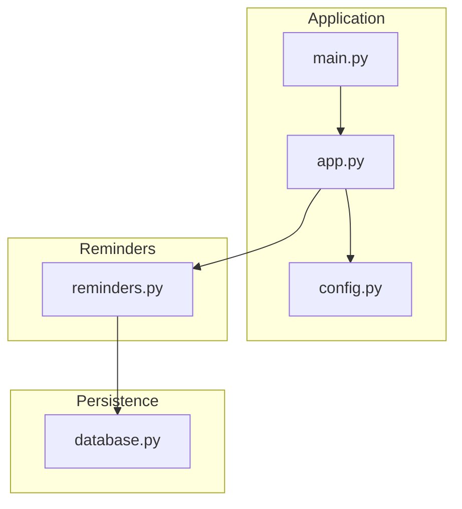
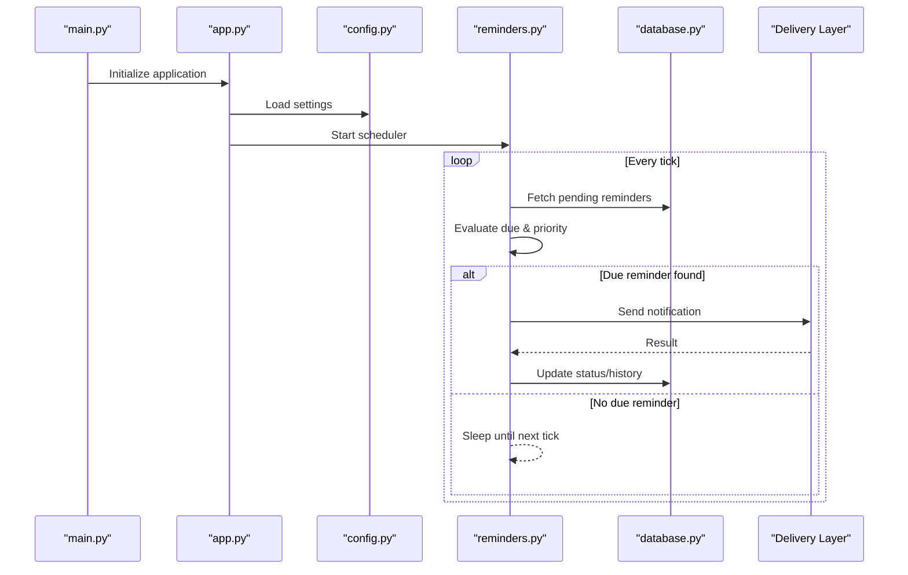
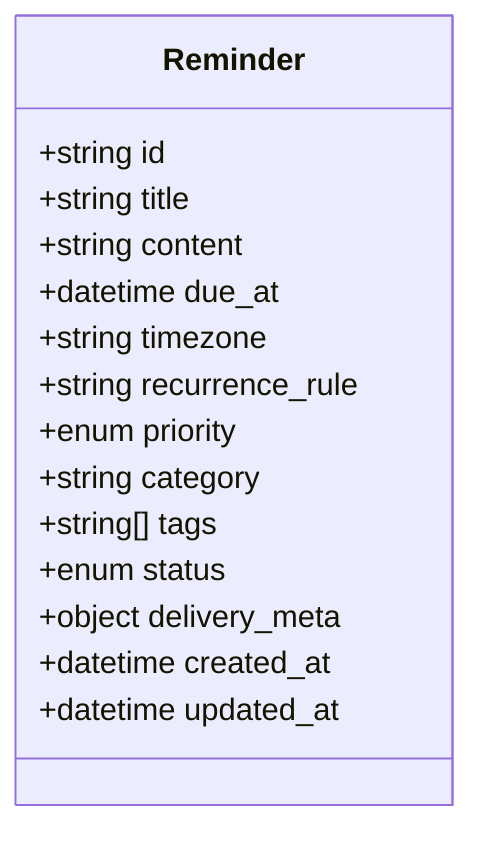
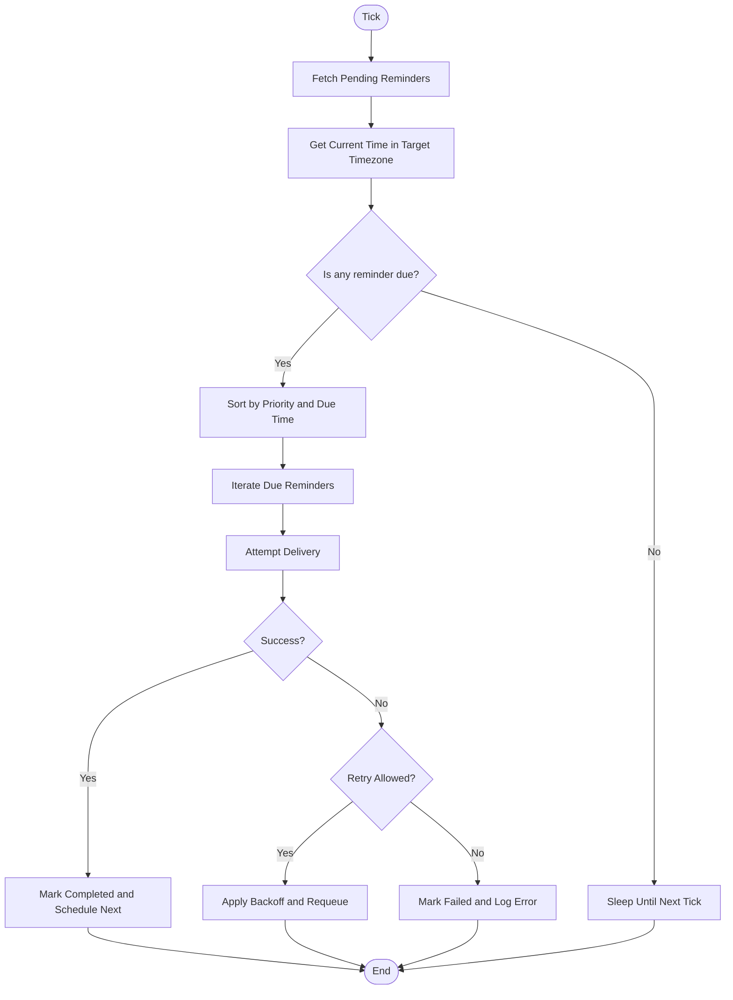
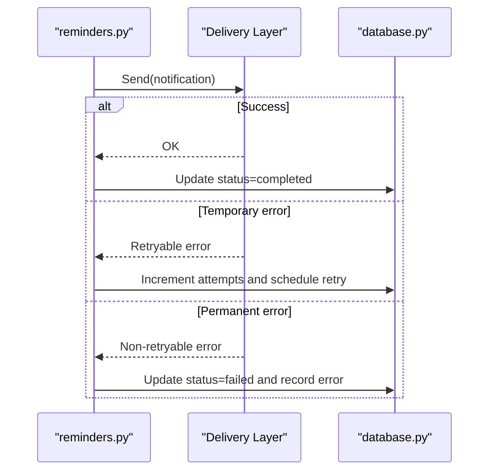
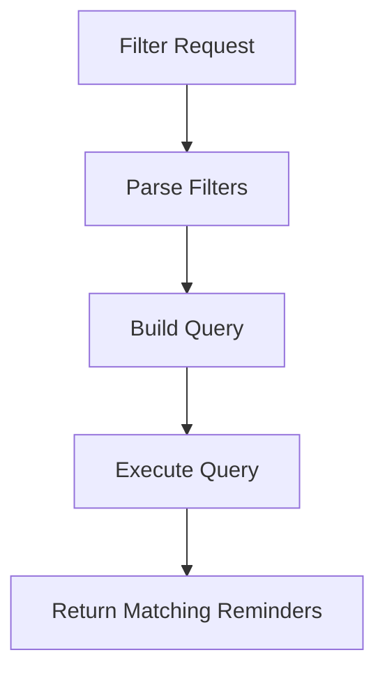
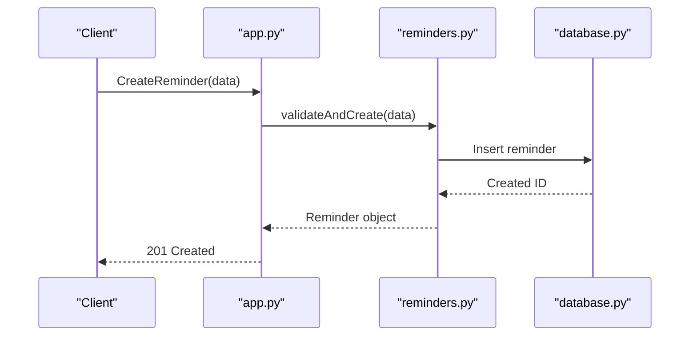
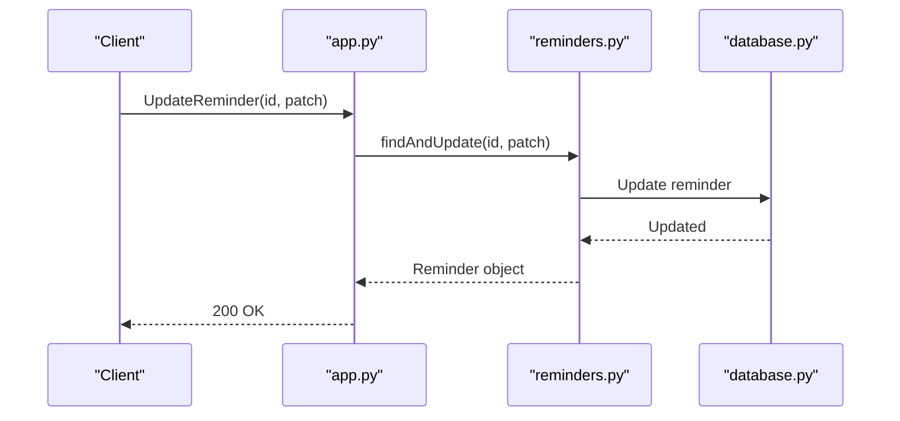
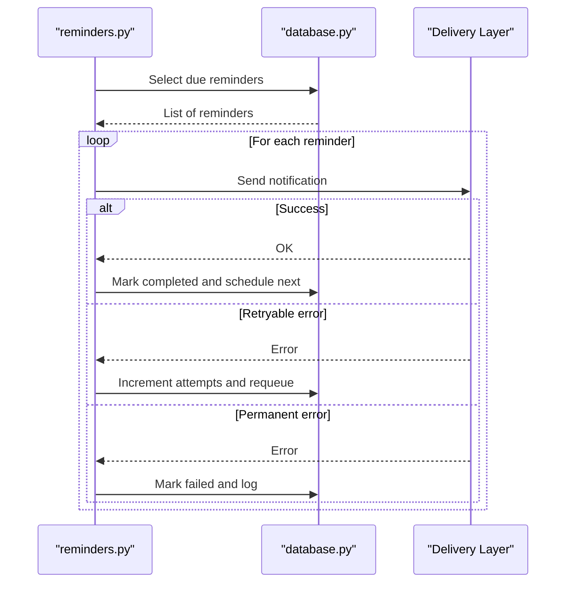
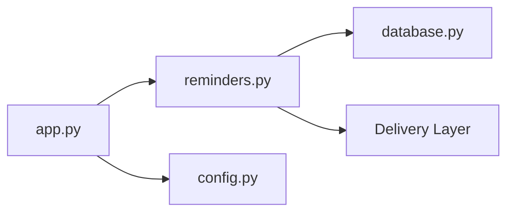

# Reminders Data Model

<cite>
**Referenced Files in This Document**
- [reminders.py](file://carrot/reminders.py)
- [database.py](file://carrot/database.py)
- [app.py](file://carrot/app.py)
- [config.py](file://carrot/config.py)
- [main.py](file://carrot/main.py)
</cite>

## Table of Contents
1. [Introduction](#introduction)
2. [Project Structure](#project-structure)
3. [Core Components](#core-components)
4. [Architecture Overview](#architecture-overview)
5. [Detailed Component Analysis](#detailed-component-analysis)
6. [Dependency Analysis](#dependency-analysis)
7. [Performance Considerations](#performance-considerations)
8. [Troubleshooting Guide](#troubleshooting-guide)
9. [Conclusion](#conclusion)

## Introduction
This document explains the reminders data model and scheduling system, focusing on reminder entities, recurrence patterns, notification triggers, priority levels, time-based scheduling, timezone handling, conflict resolution, categories/tags, filtering, delivery mechanisms, retry logic, failure handling, and example workflows for creation, modification, and execution.

## Project Structure
The reminders feature is implemented primarily within the Python application module and integrates with the database layer and configuration subsystem. The key files involved are:
- reminders.py: Defines the reminder data model, scheduling logic, and operations
- database.py: Provides persistence primitives used by reminders
- app.py: Wires reminders into the application lifecycle and exposes endpoints or commands
- config.py: Supplies runtime settings such as scheduling intervals and delivery options
- main.py: Entry point that initializes components and starts the scheduler

**Diagram sources**
- [app.py](file://carrot/app.py)
- [main.py](file://carrot/main.py)
- [config.py](file://carrot/config.py)
- [reminders.py](file://carrot/reminders.py)
- [database.py](file://carrot/database.py)

**Section sources**
- [reminders.py](file://carrot/reminders.py)
- [database.py](file://carrot/database.py)
- [app.py](file://carrot/app.py)
- [config.py](file://carrot/config.py)
- [main.py](file://carrot/main.py)

## Core Components
- Reminder entity: Represents a scheduled task with attributes such as title, content, due time, recurrence rule, priority, category, tags, status, and metadata.
- Scheduling engine: Evaluates pending reminders based on current time and timezone, handles recurring schedules, and dispatches notifications.
- Notification pipeline: Delivers reminders via configured channels (e.g., UI, OS notifications), manages retries, and records outcomes.
- Persistence layer: Stores reminders and their execution history using the database module.
- Configuration: Controls scheduling tick interval, retry policies, default timezone, and delivery preferences.

Key responsibilities:
- Create, update, delete, and query reminders
- Compute next due times for various recurrence patterns
- Enforce priority ordering and conflict resolution
- Trigger notifications and handle failures with retry/backoff
- Support filtering by category, tags, status, and time windows

**Section sources**
- [reminders.py](file://carrot/reminders.py)
- [database.py](file://carrot/database.py)
- [config.py](file://carrot/config.py)

## Architecture Overview
The reminders system follows a layered architecture:
- Application layer orchestrates initialization and exposes APIs/commands
- Scheduling loop periodically checks for due reminders
- Data access layer persists and retrieves reminder state
- Delivery layer sends notifications and logs results

**Diagram sources**
- [main.py](file://carrot/main.py)
- [app.py](file://carrot/app.py)
- [config.py](file://carrot/config.py)
- [reminders.py](file://carrot/reminders.py)
- [database.py](file://carrot/database.py)

## Detailed Component Analysis

### Reminder Entity and Schema
- Fields typically include:
  - Identifier and timestamps (created_at, updated_at)
  - Title and body/content
  - Due datetime and timezone-aware scheduling
  - Recurrence rule (none, daily, weekly, monthly, custom cron-like)
  - Priority level (e.g., low, normal, high, urgent)
  - Category and tags for grouping and filtering
  - Status (pending, active, completed, cancelled, failed)
  - Delivery metadata (channel, last_attempt, attempts, last_error)
- Validation ensures required fields and sensible defaults.

**Diagram sources**
- [reminders.py](file://carrot/reminders.py)

**Section sources**
- [reminders.py](file://carrot/reminders.py)

### Scheduling Engine and Time Handling
- Time-based scheduling:
  - Uses a periodic tick to scan for due reminders
  - Computes next due time based on recurrence rules
  - Supports timezone-aware comparisons against current time
- Conflict resolution:
  - Prioritizes higher-priority reminders when multiple are due
  - Deduplicates identical reminders within a short window
  - Prevents overlapping executions for the same reminder instance
- Recurrence patterns:
  - None: one-time
  - Daily/Weekly/Monthly: standard intervals
  - Custom: flexible expressions parsed from configuration or user input

**Diagram sources**
- [reminders.py](file://carrot/reminders.py)
- [config.py](file://carrot/config.py)

**Section sources**
- [reminders.py](file://carrot/reminders.py)
- [config.py](file://carrot/config.py)

### Notification Delivery Mechanisms
- Channels may include:
  - In-app notifications
  - Desktop OS notifications
  - External services (email, messaging)
- Delivery flow:
  - Serialize reminder payload
  - Attempt send via selected channel
  - Record success/failure and attempt count
  - Apply retry policy with exponential backoff if enabled
- Failure handling:
  - Temporary errors trigger retries
  - Permanent errors mark reminder as failed and surface error details
  - Dead-letter queue or audit log for persistent failures

**Diagram sources**
- [reminders.py](file://carrot/reminders.py)
- [database.py](file://carrot/database.py)

**Section sources**
- [reminders.py](file://carrot/reminders.py)
- [database.py](file://carrot/database.py)

### Categories, Tags, and Filtering
- Categories group reminders by domain (e.g., work, health, personal).
- Tags provide fine-grained labeling (e.g., meeting, deadline, exercise).
- Filtering capabilities:
  - By category and/or tags
  - By status (pending, active, completed, cancelled, failed)
  - By time window (next hour, today, this week)
  - By priority and due date range
- Indexing strategies:
  - Maintain indexes on category, tags, status, due_at for fast queries

**Diagram sources**
- [reminders.py](file://carrot/reminders.py)
- [database.py](file://carrot/database.py)

**Section sources**
- [reminders.py](file://carrot/reminders.py)
- [database.py](file://carrot/database.py)

### Example Workflows

#### Creation Workflow
- Steps:
  - Validate input fields (title, due_at, priority, category, tags)
  - Persist new reminder with initial status=pending
  - Schedule first due evaluation based on recurrence rule
- Key considerations:
  - Normalize timezone to UTC internally while preserving user timezone
  - Assign default priority and category if not provided

**Diagram sources**
- [app.py](file://carrot/app.py)
- [reminders.py](file://carrot/reminders.py)
- [database.py](file://carrot/database.py)

**Section sources**
- [app.py](file://carrot/app.py)
- [reminders.py](file://carrot/reminders.py)
- [database.py](file://carrot/database.py)

#### Modification Workflow
- Steps:
  - Locate reminder by ID
  - Apply updates (title, content, due_at, recurrence, priority, category, tags)
  - Persist changes and reschedule if due time or recurrence changed
- Constraints:
  - Prevent modifications to already completed/cancelled reminders
  - Ensure due_at remains valid after updates

**Diagram sources**
- [app.py](file://carrot/app.py)
- [reminders.py](file://carrot/reminders.py)
- [database.py](file://carrot/database.py)

**Section sources**
- [app.py](file://carrot/app.py)
- [reminders.py](file://carrot/reminders.py)
- [database.py](file://carrot/database.py)

#### Execution Workflow
- Steps:
  - Scheduler finds due reminders
  - Attempts delivery via configured channels
  - Updates status and history; retries on temporary failures
  - Schedules next occurrence for recurring reminders

**Diagram sources**
- [reminders.py](file://carrot/reminders.py)
- [database.py](file://carrot/database.py)

**Section sources**
- [reminders.py](file://carrot/reminders.py)
- [database.py](file://carrot/database.py)

## Dependency Analysis
- Internal dependencies:
  - reminders.py depends on database.py for persistence
  - app.py wires reminders into the application lifecycle
  - config.py provides scheduling and delivery settings
- External dependencies:
  - Delivery layer may integrate with OS notification APIs or external services
- Coupling and cohesion:
  - High cohesion within reminders.py for scheduling and delivery orchestration
  - Clear separation between persistence (database.py) and business logic (reminders.py)

**Diagram sources**
- [app.py](file://carrot/app.py)
- [reminders.py](file://carrot/reminders.py)
- [config.py](file://carrot/config.py)
- [database.py](file://carrot/database.py)

**Section sources**
- [app.py](file://carrot/app.py)
- [reminders.py](file://carrot/reminders.py)
- [config.py](file://carrot/config.py)
- [database.py](file://carrot/database.py)

## Performance Considerations
- Scheduling efficiency:
  - Use efficient queries with indexes on due_at, status, category, tags
  - Batch fetch reminders per tick to reduce DB round-trips
- Delivery optimization:
  - Coalesce notifications for rapid successive reminders
  - Implement concurrency limits for delivery workers
- Memory usage:
  - Stream large result sets when querying reminders
  - Avoid loading full payloads unless necessary

[No sources needed since this section provides general guidance]

## Troubleshooting Guide
Common issues and resolutions:
- Missed reminders:
  - Verify scheduler is running and tick interval is appropriate
  - Check timezone configuration and ensure due_at normalization
- Delivery failures:
  - Inspect retry counts and backoff settings
  - Review error logs for temporary vs permanent errors
- Slow queries:
  - Add or verify indexes on frequently filtered fields
  - Optimize pagination and filter conditions

**Section sources**
- [reminders.py](file://carrot/reminders.py)
- [database.py](file://carrot/database.py)
- [config.py](file://carrot/config.py)

## Conclusion
The reminders system provides a robust data model and scheduling engine supporting diverse recurrence patterns, priority-driven execution, and reliable delivery with retry and failure handling. Proper use of categories, tags, and filtering enables effective organization and retrieval. Integrating with the application lifecycle and configuration ensures consistent behavior across environments.