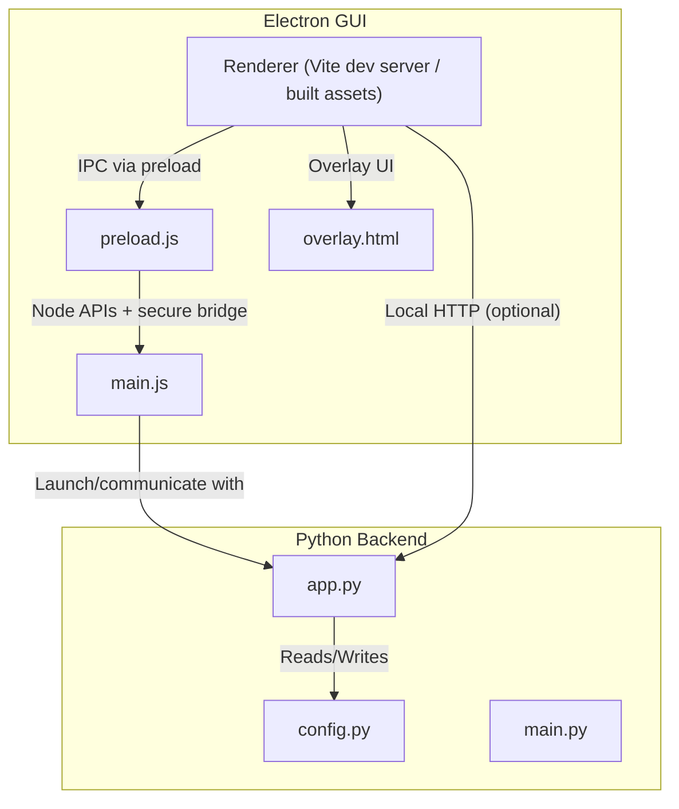
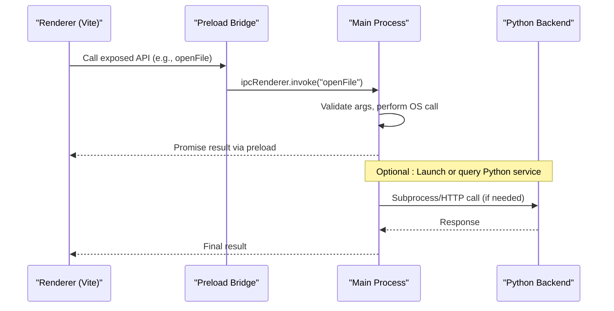
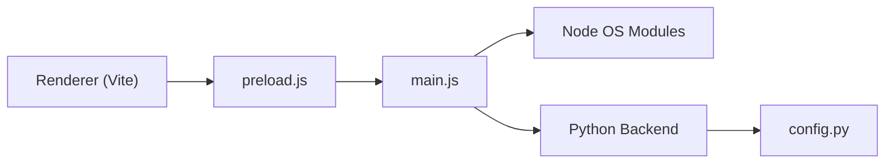

# Desktop Application

<cite>
**Referenced Files in This Document**
- [main.js](file://gui/main.js)
- [preload.js](file://gui/preload.js)
- [package.json](file://gui/package.json)
- [vite.config.js](file://gui/vite.config.js)
- [overlay.html](file://gui/public/overlay.html)
- [app.py](file://carrot/app.py)
- [config.py](file://carrot/config.py)
- [main.py](file://carrot/main.py)
- [build.bat](file://build.bat)
</cite>

## Table of Contents
1. [Introduction](#introduction)
2. [Project Structure](#project-structure)
3. [Core Components](#core-components)
4. [Architecture Overview](#architecture-overview)
5. [Detailed Component Analysis](#detailed-component-analysis)
6. [Dependency Analysis](#dependency-analysis)
7. [Performance Considerations](#performance-considerations)
8. [Troubleshooting Guide](#troubleshooting-guide)
9. [Conclusion](#conclusion)
10. [Appendices](#appendices)

## Introduction
This document describes the Electron-based desktop application wrapper that integrates a Python backend with an Electron frontend. It explains the main process architecture, preload script security model, renderer-to-main IPC patterns, window management, system integration, and native OS feature access. It also covers packaging and distribution strategies, auto-update mechanisms, platform-specific considerations, security best practices, debugging techniques, and the overlay functionality integrated with the web interface.

## Project Structure
The project is organized into two primary layers:
- Electron GUI layer under gui/, which includes the main process entry point, preload script, Vite configuration, and packaged assets.
- Python backend layer under carrot/, which provides core business logic, configuration, and services consumed by the Electron app via IPC or local HTTP.

**Diagram sources**
- [main.js](file://gui/main.js)
- [preload.js](file://gui/preload.js)
- [vite.config.js](file://gui/vite.config.js)
- [overlay.html](file://gui/public/overlay.html)
- [app.py](file://carrot/app.py)
- [config.py](file://carrot/config.py)
- [main.py](file://carrot/main.py)

**Section sources**
- [package.json](file://gui/package.json)
- [vite.config.js](file://gui/vite.config.js)

## Core Components
- Main process (main.js): Bootstraps the Electron app, creates BrowserWindow instances, manages lifecycle, handles system tray/menu, and exposes secure IPC handlers for privileged operations.
- Preload script (preload.js): Establishes a minimal, typed IPC bridge between renderer and main using contextBridge and contextIsolation. Exposes only necessary functions to the renderer.
- Renderer (Vite-managed): Serves the web UI during development and loads built assets in production. Communicates exclusively through the preload bridge.
- Overlay (overlay.html): A lightweight HTML page used as an overlay window or embedded view, interacting with the renderer via postMessage or the same preload bridge.
- Python backend (app.py, config.py, main.py): Provides core services (e.g., AI calls, file I/O, terminal interactions). The Electron main process can spawn or communicate with this backend via subprocess or local HTTP.

Key responsibilities:
- Window management: Create, show, hide, focus, and destroy windows; manage overlays and secondary windows.
- System integration: Access OS-level features such as notifications, clipboard, dialogs, and shell operations via Node modules in the main process.
- Security boundary: Enforce contextIsolation and nodeIntegration:false; expose only whitelisted APIs through preload.

**Section sources**
- [main.js](file://gui/main.js)
- [preload.js](file://gui/preload.js)
- [vite.config.js](file://gui/vite.config.js)
- [overlay.html](file://gui/public/overlay.html)
- [app.py](file://carrot/app.py)
- [config.py](file://carrot/config.py)
- [main.py](file://carrot/main.py)

## Architecture Overview
The application follows a layered architecture:
- Renderer processes run untrusted code and are isolated from Node and the filesystem.
- Preload scripts act as a trusted bridge, exposing a small set of methods to the renderer.
- The main process holds all privileged capabilities and communicates with the Python backend.

**Diagram sources**
- [preload.js](file://gui/preload.js)
- [main.js](file://gui/main.js)
- [app.py](file://carrot/app.py)

## Detailed Component Analysis

### Main Process (main.js)
Responsibilities:
- Initialize Electron and configure security settings (contextIsolation, nodeIntegration, sandbox).
- Create and manage BrowserWindow instances for the app and overlay.
- Register IPC handlers for privileged operations (file system, shell, notifications, etc.).
- Integrate with the Python backend by spawning processes or making HTTP requests.
- Handle application lifecycle events (ready, window-all-closed, before-quit).

Security considerations:
- Keep nodeIntegration disabled in renderers.
- Use contextIsolation and expose only necessary APIs via preload.
- Validate and sanitize all IPC arguments.

Window management:
- Centralized window registry to prevent duplicates and enable focus control.
- Overlay window creation with transparent/non-interactive options as needed.

System integration:
- Use Node modules for OS features (dialogs, shell, clipboard, notifications).
- Ensure cross-platform compatibility by abstracting OS differences.

**Section sources**
- [main.js](file://gui/main.js)

### Preload Script (preload.js)
Responsibilities:
- Enable contextIsolation and create a secure bridge using contextBridge.exposeInMainWorld.
- Define a minimal API surface for the renderer (e.g., invoke IPC channels safely).
- Wrap Node-only calls behind typed functions to prevent misuse.

Security model:
- No direct access to Node or Electron APIs from the renderer.
- All privileged actions go through explicit, auditable IPC channels.

Best practices:
- Keep the bridge small and versioned.
- Add input validation on both sides (renderer and main).

**Section sources**
- [preload.js](file://gui/preload.js)

### Renderer and Vite Configuration (vite.config.js)
Responsibilities:
- Configure development server and build output for Electron consumption.
- Set base path and asset handling for Electron’s file:// protocol.
- Optionally proxy local backend requests during development.

Development workflow:
- Vite serves the UI locally; Electron loads it via http://localhost.
- Build produces static assets loaded by Electron in production.

**Section sources**
- [vite.config.js](file://gui/vite.config.js)

### Overlay Functionality (overlay.html)
Purpose:
- Provide a floating or always-on-top overlay UI for quick interactions or status display.
- Communicate with the main process or parent window via postMessage or shared preload bridge.

Integration points:
- Lightweight HTML/CSS/JS page loaded in a separate BrowserWindow or iframe.
- Can be toggled visibility programmatically from the main process.

**Section sources**
- [overlay.html](file://gui/public/overlay.html)

### Python Backend Integration (app.py, config.py, main.py)
Roles:
- app.py: Orchestrates core services and endpoints consumed by Electron.
- config.py: Centralizes configuration values and environment variables.
- main.py: Entry point for running the Python service.

Communication patterns:
- Subprocess: Electron spawns Python scripts and streams results.
- Local HTTP: Electron makes REST calls to a local server started by the Python backend.

Security and robustness:
- Validate inputs and limit resource usage.
- Use timeouts and error propagation back to the renderer.

**Section sources**
- [app.py](file://carrot/app.py)
- [config.py](file://carrot/config.py)
- [main.py](file://carrot/main.py)

### Packaging and Distribution (package.json, build.bat)
Packaging:
- Use Electron Forge or similar tooling defined in package.json to bundle the app.
- Include Python runtime or embed dependencies as needed.

Distribution:
- Generate installers for Windows/macOS/Linux.
- Sign binaries and notarize where applicable.

Auto-update:
- Integrate electron-updater or similar to check and apply updates at runtime.
- Configure update servers and channel releases.

Build automation:
- build.bat orchestrates build steps for Windows environments.

**Section sources**
- [package.json](file://gui/package.json)
- [build.bat](file://build.bat)

## Dependency Analysis
The Electron GUI depends on:
- Vite for development and building the renderer.
- Node modules for OS integrations (dialogs, shell, notifications).
- IPC channels bridging renderer and main.

The main process depends on:
- Electron APIs for window management and lifecycle.
- Optional Python backend via subprocess or HTTP.

**Diagram sources**
- [vite.config.js](file://gui/vite.config.js)
- [preload.js](file://gui/preload.js)
- [main.js](file://gui/main.js)
- [app.py](file://carrot/app.py)
- [config.py](file://carrot/config.py)

**Section sources**
- [package.json](file://gui/package.json)

## Performance Considerations
- Minimize IPC calls; batch operations when possible.
- Avoid heavy computations in the main process; offload to worker threads or the Python backend.
- Use lazy loading for large assets and defer initialization until needed.
- Monitor memory usage and avoid leaks in long-running windows.
- Prefer streaming responses for large data transfers.

[No sources needed since this section provides general guidance]

## Troubleshooting Guide
Common issues and resolutions:
- IPC errors: Ensure channel names match exactly between preload and main; validate payloads.
- Permission denied: Verify OS permissions for file/directory access and shell commands.
- Overlay not showing: Check window flags (alwaysOnTop, transparent) and z-index stacking.
- Backend connectivity: Confirm Python service is running and accessible via expected port or path.
- Debugging:
  - Use Chrome DevTools for renderer inspection.
  - Log main process events and IPC traffic.
  - Inspect network requests if using local HTTP.

**Section sources**
- [main.js](file://gui/main.js)
- [preload.js](file://gui/preload.js)

## Conclusion
This Electron wrapper provides a secure, modular desktop experience by isolating untrusted renderer code, exposing a minimal IPC bridge, and delegating privileged operations to the main process. With careful window management, robust IPC patterns, and clear separation from the Python backend, the application achieves strong security and maintainability. Packaging, auto-update, and platform-specific considerations ensure reliable distribution across operating systems.

[No sources needed since this section summarizes without analyzing specific files]

## Appendices

### Security Best Practices
- Always enable contextIsolation and disable nodeIntegration in renderers.
- Whitelist IPC channels and validate all inputs.
- Avoid eval and dynamic code execution.
- Use HTTPS for any local server communication during development.
- Sign and notarize distributions where supported.

[No sources needed since this section provides general guidance]

### IPC Communication Patterns
- Use invoke/handle for request-response flows.
- Use send/listener for fire-and-forget messages.
- Implement error handling and timeouts consistently.
- Version your IPC API to support backward compatibility.

[No sources needed since this section provides general guidance]

### Platform-Specific Considerations
- macOS: Sandboxing, entitlements, and notarization requirements.
- Windows: Code signing, installer generation, and UAC prompts.
- Linux: AppImage/Flatpak packaging and desktop integration.

[No sources needed since this section provides general guidance]