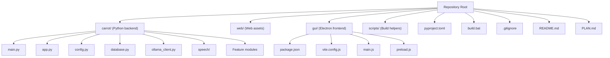
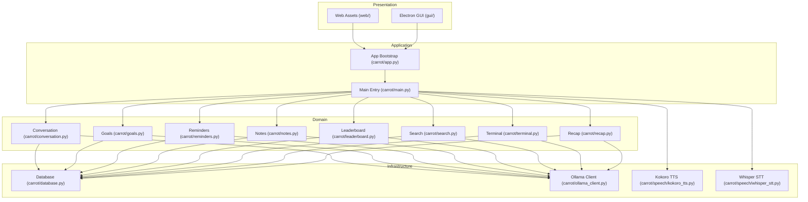
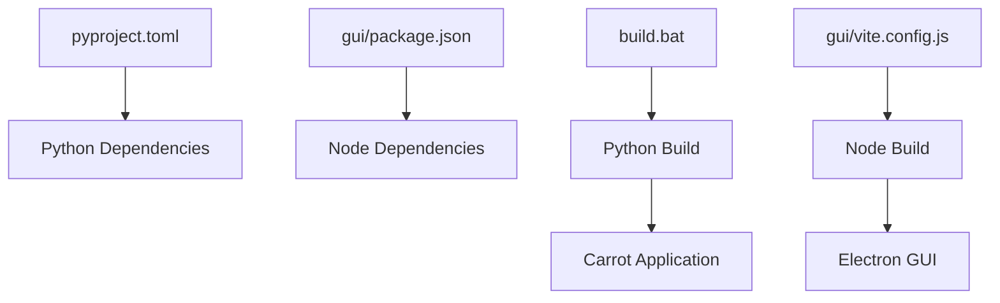

# Development Guide

<cite>
**Referenced Files in This Document**
- [README.md](file://README.md)
- [PLAN.md](file://PLAN.md)
- [pyproject.toml](file://pyproject.toml)
- [build.bat](file://build.bat)
- [.gitignore](file://.gitignore)
- [carrot/main.py](file://carrot/main.py)
- [carrot/app.py](file://carrot/app.py)
- [carrot/config.py](file://carrot/config.py)
- [carrot/database.py](file://carrot/database.py)
- [carrot/ollama_client.py](file://carrot/ollama_client.py)
- [carrot/speech/kokoro_tts.py](file://carrot/speech/kokoro_tts.py)
- [carrot/speech/whisper_stt.py](file://carrot/speech/whisper_stt.py)
- [gui/package.json](file://gui/package.json)
- [gui/vite.config.js](file://gui/vite.config.js)
- [gui/main.js](file://gui/main.js)
- [gui/preload.js](file://gui/preload.js)
</cite>

## Table of Contents
1. Introduction
2. Project Structure
3. Core Components
4. Architecture Overview
5. Detailed Component Analysis
6. Dependency Analysis
7. Performance Considerations
8. Troubleshooting Guide
9. Conclusion
10. Appendices

## Introduction
This guide explains how to set up the development environment, follow coding standards, and contribute effectively to the Carrot project. It covers the build process, dependency management, testing strategies, debugging techniques, performance profiling, release procedures, code review guidelines, commit message standards, branching strategies, and best practices for adding features and writing tests.

## Project Structure
Carrot is a Python application with an optional Electron-based GUI and web assets:
- Python backend under carrot/
  - Entry points and core modules (main.py, app.py, config.py, database.py, ollama_client.py)
  - Feature modules (conversation.py, goals.py, leaderboard.py, notes.py, reminders.py, search.py, terminal.py, recap.py)
  - Speech subsystem under speech/ (kokoro_tts.py, whisper_stt.py)
- Web assets under web/ (HTML/CSS/JS)
- Optional Electron GUI under gui/ (package.json, vite.config.js, main.js, preload.js)
- Build and scripts at repository root (build.bat, scripts/)
- Configuration and metadata at repository root (pyproject.toml, .gitignore, README.md, PLAN.md)

**Diagram sources**
- [README.md](file://README.md)
- [PLAN.md](file://PLAN.md)
- [pyproject.toml](file://pyproject.toml)
- [build.bat](file://build.bat)
- [.gitignore](file://.gitignore)
- [carrot/main.py](file://carrot/main.py)
- [carrot/app.py](file://carrot/app.py)
- [carrot/config.py](file://carrot/config.py)
- [carrot/database.py](file://carrot/database.py)
- [carrot/ollama_client.py](file://carrot/ollama_client.py)
- [carrot/speech/kokoro_tts.py](file://carrot/speech/kokoro_tts.py)
- [carrot/speech/whisper_stt.py](file://carrot/speech/whisper_stt.py)
- [gui/package.json](file://gui/package.json)
- [gui/vite.config.js](file://gui/vite.config.js)
- [gui/main.js](file://gui/main.js)
- [gui/preload.js](file://gui/preload.js)

**Section sources**
- [README.md](file://README.md)
- [PLAN.md](file://PLAN.md)
- [pyproject.toml](file://pyproject.toml)
- [build.bat](file://build.bat)
- [.gitignore](file://.gitignore)

## Core Components
- Application entry and runtime
  - Main entry point orchestrates startup and CLI or server modes
  - App module initializes configuration, logging, and core services
- Configuration and environment
  - Centralized configuration loader and defaults
- Data persistence
  - Database abstraction layer for storage operations
- External integrations
  - Ollama client for AI model interactions
- Speech subsystem
  - Text-to-speech via Kokoro
  - Speech-to-text via Whisper
- Web and GUI
  - Static web assets for browser usage
  - Optional Electron wrapper for desktop experience

Key responsibilities:
- Separation of concerns between UI, business logic, and data layers
- Modular feature organization under carrot/
- Clear boundaries for external dependencies (Ollama, speech engines)

**Section sources**
- [carrot/main.py](file://carrot/main.py)
- [carrot/app.py](file://carrot/app.py)
- [carrot/config.py](file://carrot/config.py)
- [carrot/database.py](file://carrot/database.py)
- [carrot/ollama_client.py](file://carrot/ollama_client.py)
- [carrot/speech/kokoro_tts.py](file://carrot/speech/kokoro_tts.py)
- [carrot/speech/whisper_stt.py](file://carrot/speech/whisper_stt.py)

## Architecture Overview
The system follows a layered architecture:
- Presentation layer: Web assets and optional Electron GUI
- Application layer: Orchestrates workflows, handles requests, and coordinates services
- Domain layer: Business logic modules (conversation, goals, reminders, etc.)
- Infrastructure layer: Database, Ollama client, speech engines

**Diagram sources**
- [carrot/main.py](file://carrot/main.py)
- [carrot/app.py](file://carrot/app.py)
- [carrot/conversation.py](file://carrot/conversation.py)
- [carrot/goals.py](file://carrot/goals.py)
- [carrot/reminders.py](file://carrot/reminders.py)
- [carrot/notes.py](file://carrot/notes.py)
- [carrot/leaderboard.py](file://carrot/leaderboard.py)
- [carrot/search.py](file://carrot/search.py)
- [carrot/terminal.py](file://carrot/terminal.py)
- [carrot/recap.py](file://carrot/recap.py)
- [carrot/database.py](file://carrot/database.py)
- [carrot/ollama_client.py](file://carrot/ollama_client.py)
- [carrot/speech/kokoro_tts.py](file://carrot/speech/kokoro_tts.py)
- [carrot/speech/whisper_stt.py](file://carrot/speech/whisper_stt.py)

## Detailed Component Analysis

### Python Backend Entry and Bootstrap
- main.py: Command-line interface and startup orchestration
- app.py: Application initialization, configuration loading, logging setup, and service wiring

Best practices:
- Keep startup logic minimal; delegate heavy initialization to dedicated modules
- Use centralized configuration to avoid scattered constants
- Ensure graceful shutdown handling for background tasks

**Section sources**
- [carrot/main.py](file://carrot/main.py)
- [carrot/app.py](file://carrot/app.py)

### Configuration Management
- config.py: Loads environment variables, default settings, and overrides

Guidelines:
- Define clear configuration keys and types
- Validate critical settings at startup
- Provide sensible defaults and document required env vars

**Section sources**
- [carrot/config.py](file://carrot/config.py)

### Database Abstraction
- database.py: Encapsulates connection lifecycle, queries, and transactions

Recommendations:
- Use context managers for safe resource handling
- Implement retry logic for transient failures
- Log query execution times for performance insights

**Section sources**
- [carrot/database.py](file://carrot/database.py)

### Ollama Integration
- ollama_client.py: HTTP client wrapper for Ollama API calls

Considerations:
- Handle timeouts and retries robustly
- Cache responses where appropriate
- Normalize error responses across the application

**Section sources**
- [carrot/ollama_client.py](file://carrot/ollama_client.py)

### Speech Subsystem
- kokoro_tts.py: Text-to-speech synthesis using Kokoro
- whisper_stt.py: Speech-to-text transcription using Whisper

Development tips:
- Abstract audio I/O behind interfaces for testability
- Stream large audio payloads when possible
- Provide fallbacks for missing dependencies

**Section sources**
- [carrot/speech/kokoro_tts.py](file://carrot/speech/kokoro_tts.py)
- [carrot/speech/whisper_stt.py](file://carrot/speech/whisper_stt.py)

### Web and GUI Layers
- web/: Static HTML/CSS/JS served by the application or standalone
- gui/: Electron wrapper with Vite for development and packaging

Workflow:
- Develop UI changes in web/ and validate via browser
- Use gui/ for desktop-specific features and packaging
- Configure Vite for hot reload during development

**Section sources**
- [gui/package.json](file://gui/package.json)
- [gui/vite.config.js](file://gui/vite.config.js)
- [gui/main.js](file://gui/main.js)
- [gui/preload.js](file://gui/preload.js)

### Feature Modules
Modules such as conversation.py, goals.py, reminders.py, notes.py, leaderboard.py, search.py, terminal.py, and recap.py encapsulate domain logic. Follow these patterns:
- Single responsibility per module
- Clear function/method signatures with type hints
- Consistent error handling and logging

**Section sources**
- [carrot/conversation.py](file://carrot/conversation.py)
- [carrot/goals.py](file://carrot/goals.py)
- [carrot/reminders.py](file://carrot/reminders.py)
- [carrot/notes.py](file://carrot/notes.py)
- [carrot/leaderboard.py](file://carrot/leaderboard.py)
- [carrot/search.py](file://carrot/search.py)
- [carrot/terminal.py](file://carrot/terminal.py)
- [carrot/recap.py](file://carrot/recap.py)

## Dependency Analysis
Dependencies are managed via Python’s pyproject.toml and Node’s package.json for the GUI:
- Python dependencies declared in pyproject.toml
- Node dependencies declared in gui/package.json
- Build automation via build.bat and Vite configuration

**Diagram sources**
- [pyproject.toml](file://pyproject.toml)
- [gui/package.json](file://gui/package.json)
- [build.bat](file://build.bat)
- [gui/vite.config.js](file://gui/vite.config.js)

**Section sources**
- [pyproject.toml](file://pyproject.toml)
- [gui/package.json](file://gui/package.json)
- [build.bat](file://build.bat)
- [gui/vite.config.js](file://gui/vite.config.js)

## Performance Considerations
- Database:
  - Use connection pooling and index frequently queried columns
  - Profile slow queries and optimize with EXPLAIN plans
- Network:
  - Implement retries with exponential backoff for Ollama calls
  - Cache frequent responses to reduce latency
- Audio:
  - Stream audio input/output to minimize memory usage
  - Prefer asynchronous processing for long-running tasks
- Logging:
  - Enable structured logs with timestamps and correlation IDs
  - Avoid excessive logging in hot paths

[No sources needed since this section provides general guidance]

## Troubleshooting Guide
Common issues and resolutions:
- Missing dependencies:
  - Install Python dependencies from pyproject.toml
  - Install Node dependencies in gui/package.json
- Environment misconfiguration:
  - Verify required environment variables for Ollama and speech engines
  - Check file permissions for database and asset directories
- Build failures:
  - Run build.bat and inspect output for errors
  - Validate Vite configuration for GUI builds
- Runtime errors:
  - Increase log verbosity temporarily
  - Isolate failing components by disabling optional features

Debugging techniques:
- Use Python debuggers (pdb, breakpoint()) for step-through analysis
- Inspect network traffic to Ollama endpoints
- Validate audio pipeline with sample inputs

Logging configuration:
- Centralize logging in app bootstrap
- Rotate logs and limit retention
- Include contextual information (request IDs, user IDs)

**Section sources**
- [carrot/app.py](file://carrot/app.py)
- [carrot/config.py](file://carrot/config.py)
- [build.bat](file://build.bat)
- [gui/vite.config.js](file://gui/vite.config.js)

## Conclusion
This guide outlines the development workflow, architecture, and best practices for contributing to Carrot. By following the outlined conventions for environment setup, coding standards, testing, debugging, and releases, contributors can maintain consistency and quality across the project.

[No sources needed since this section summarizes without analyzing specific files]

## Appendices

### Development Environment Setup
- Prerequisites:
  - Python 3.x with virtual environment support
  - Node.js and npm/yarn for GUI development
  - Git for version control
- Steps:
  - Clone the repository
  - Create and activate a Python virtual environment
  - Install Python dependencies from pyproject.toml
  - Install Node dependencies in gui/package.json
  - Configure environment variables for Ollama and speech engines
  - Run the application via main.py or build.bat

**Section sources**
- [pyproject.toml](file://pyproject.toml)
- [gui/package.json](file://gui/package.json)
- [build.bat](file://build.bat)

### Coding Standards
- Python:
  - Follow PEP 8 style guidelines
  - Use type hints and docstrings consistently
  - Organize imports (stdlib, third-party, local)
- JavaScript/TypeScript (GUI):
  - Use ESLint and Prettier configurations if available
  - Maintain consistent naming conventions
- Documentation:
  - Update README.md and inline comments as needed
  - Keep CHANGELOG or release notes aligned with commits

[No sources needed since this section provides general guidance]

### Testing Strategies
- Unit tests:
  - Test individual functions and classes in isolation
  - Mock external dependencies (Ollama, speech engines)
- Integration tests:
  - Validate database interactions and API calls
  - Use fixtures for consistent test data
- End-to-end tests:
  - Simulate user workflows through the GUI or web interface
- Automation:
  - Integrate tests into CI pipelines
  - Generate coverage reports

[No sources needed since this section provides general guidance]

### Debugging Techniques
- Python:
  - Use pdb or IDE breakpoints
  - Enable verbose logging for problematic flows
- GUI:
  - Open DevTools in Electron for UI debugging
  - Inspect network requests and console logs
- Profiling:
  - Use cProfile for CPU-bound functions
  - Monitor memory usage with tracemalloc

[No sources needed since this section provides general guidance]

### Build Process
- Python:
  - Use pyproject.toml for dependency resolution and packaging
  - Run build.bat for automated steps
- GUI:
  - Use Vite for development and production builds
  - Package Electron app with provided scripts

**Section sources**
- [pyproject.toml](file://pyproject.toml)
- [build.bat](file://build.bat)
- [gui/vite.config.js](file://gui/vite.config.js)

### Release Procedures
- Versioning:
  - Follow semantic versioning principles
  - Tag releases in Git
- Changelog:
  - Document breaking changes, new features, and fixes
- Distribution:
  - Publish Python packages to PyPI if applicable
  - Distribute Electron binaries for target platforms

[No sources needed since this section provides general guidance]

### Code Review Guidelines
- Checklist:
  - Readability and clarity
  - Adherence to coding standards
  - Test coverage and quality
  - Security considerations
- Process:
  - Request reviews before merging
  - Address feedback promptly
  - Ensure CI passes

[No sources needed since this section provides general guidance]

### Commit Message Standards
- Format:
  - Use conventional commits (feat, fix, docs, chore, etc.)
  - Keep messages concise and descriptive
- Examples:
  - feat: add voice command parsing
  - fix: resolve database connection timeout
  - docs: update API documentation

[No sources needed since this section provides general guidance]

### Branching Strategies
- Main branch:
  - Stable and deployable at all times
- Feature branches:
  - Named descriptively (feature/add-voice-command)
- Pull requests:
  - Link related issues and provide context
  - Request reviews from relevant team members

[No sources needed since this section provides general guidance]

### Adding New Features
Steps:
- Create a feature branch
- Implement functionality in modular components
- Add unit and integration tests
- Update documentation and configuration
- Submit a pull request with a detailed description

[No sources needed since this section provides general guidance]

### Modifying Existing Functionality
Steps:
- Identify affected modules and dependencies
- Update implementation and tests
- Validate backward compatibility
- Document changes and migration steps if necessary

[No sources needed since this section provides general guidance]

### Writing Comprehensive Tests
Guidelines:
- Cover happy paths and edge cases
- Mock external services and databases
- Use fixtures for reusable test data
- Assert both outputs and side effects

[No sources needed since this section provides general guidance]

### Logging Configuration
- Centralize logging setup in app bootstrap
- Use structured logs with levels (DEBUG, INFO, WARNING, ERROR)
- Rotate logs and manage retention policies
- Include contextual metadata for traceability

**Section sources**
- [carrot/app.py](file://carrot/app.py)
- [carrot/config.py](file://carrot/config.py)

### Development Workflow Best Practices
- Local development:
  - Use virtual environments and dependency locks
  - Enable hot reload for GUI development
- Collaboration:
  - Communicate changes via issue trackers
  - Review and merge small, focused PRs
- Quality assurance:
  - Automate linting, testing, and building
  - Monitor performance and resource usage

[No sources needed since this section provides general guidance]