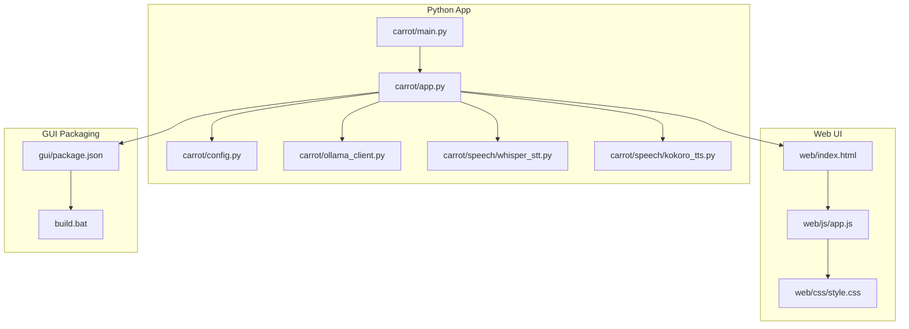
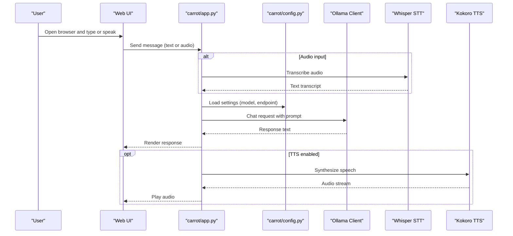
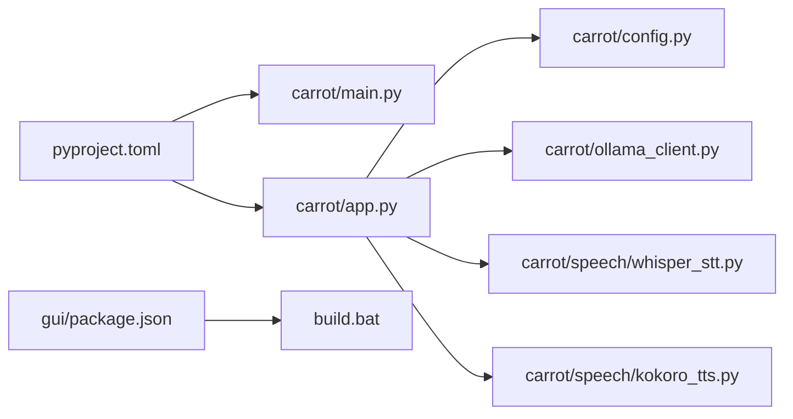

# Getting Started

<cite>
**Referenced Files in This Document**
- [README.md](file://README.md)
- [pyproject.toml](file://pyproject.toml)
- [carrot/main.py](file://carrot/main.py)
- [carrot/app.py](file://carrot/app.py)
- [carrot/config.py](file://carrot/config.py)
- [carrot/ollama_client.py](file://carrot/ollama_client.py)
- [carrot/speech/whisper_stt.py](file://carrot/speech/whisper_stt.py)
- [carrot/speech/kokoro_tts.py](file://carrot/speech/kokoro_tts.py)
- [gui/package.json](file://gui/package.json)
- [build.bat](file://build.bat)
</cite>

## Table of Contents
1. [Introduction](#introduction)
2. [Project Structure](#project-structure)
3. [Core Components](#core-components)
4. [Architecture Overview](#architecture-overview)
5. [Detailed Component Analysis](#detailed-component-analysis)
6. [Dependency Analysis](#dependency-analysis)
7. [Performance Considerations](#performance-considerations)
8. [Troubleshooting Guide](#troubleshooting-guide)
9. [Conclusion](#conclusion)
10. [Appendices](#appendices)

## Introduction
This guide helps you install, configure, and run the Carrot AI assistant application. You will set up Python dependencies, configure Ollama integration for local LLMs, prepare voice features (speech-to-text and text-to-speech), launch the web interface, and perform basic automation tasks. It also covers system requirements, supported platforms, common setup issues, verification steps, and quick-start examples for voice interaction, web usage, and computer automation.

## Project Structure
Carrot is a Python-based assistant with:
- A CLI entry point and application bootstrap
- Web UI assets under a dedicated folder
- Speech modules for STT and TTS
- Ollama client integration for local model inference
- Configuration management
- Optional GUI packaging scripts

**Diagram sources**
- [carrot/main.py](file://carrot/main.py)
- [carrot/app.py](file://carrot/app.py)
- [carrot/config.py](file://carrot/config.py)
- [carrot/ollama_client.py](file://carrot/ollama_client.py)
- [carrot/speech/whisper_stt.py](file://carrot/speech/whisper_stt.py)
- [carrot/speech/kokoro_tts.py](file://carrot/speech/kokoro_tts.py)
- [gui/package.json](file://gui/package.json)
- [build.bat](file://build.bat)

**Section sources**
- [README.md](file://README.md)
- [pyproject.toml](file://pyproject.toml)
- [carrot/main.py](file://carrot/main.py)
- [carrot/app.py](file://carrot/app.py)
- [carrot/config.py](file://carrot/config.py)
- [carrot/ollama_client.py](file://carrot/ollama_client.py)
- [carrot/speech/whisper_stt.py](file://carrot/speech/whisper_stt.py)
- [carrot/speech/kokoro_tts.py](file://carrot/speech/kokoro_tts.py)
- [gui/package.json](file://gui/package.json)
- [build.bat](file://build.bat)

## Core Components
- Application entry and runtime: The main script initializes configuration, sets up logging, and starts the server or CLI mode.
- Configuration: Centralized settings for Ollama endpoints, model names, and feature toggles.
- Ollama client: HTTP client to communicate with a local Ollama instance for chat completions and embeddings.
- Speech: Whisper-based speech-to-text and Kokoro-based text-to-speech modules.
- Web UI: HTML/CSS/JS frontend served by the app for interactive conversations and controls.
- GUI packaging: Node-based packaging utilities and build scripts for desktop distribution.

Key responsibilities:
- Orchestrating user input (voice/web) and routing to the LLM via Ollama.
- Managing conversation state and persistence where applicable.
- Exposing a simple web interface for quick interactions.
- Providing optional automation helpers for terminal and file operations.

**Section sources**
- [carrot/main.py](file://carrot/main.py)
- [carrot/app.py](file://carrot/app.py)
- [carrot/config.py](file://carrot/config.py)
- [carrot/ollama_client.py](file://carrot/ollama_client.py)
- [carrot/speech/whisper_stt.py](file://carrot/speech/whisper_stt.py)
- [carrot/speech/kokoro_tts.py](file://carrot/speech/kokoro_tts.py)

## Architecture Overview
The runtime integrates a Python backend with a lightweight web UI and an Ollama service. Voice inputs are transcribed locally, prompts are sent to Ollama, and responses can be spoken back using TTS.

**Diagram sources**
- [carrot/app.py](file://carrot/app.py)
- [carrot/config.py](file://carrot/config.py)
- [carrot/ollama_client.py](file://carrot/ollama_client.py)
- [carrot/speech/whisper_stt.py](file://carrot/speech/whisper_stt.py)
- [carrot/speech/kokoro_tts.py](file://carrot/speech/kokoro_tts.py)

## Detailed Component Analysis

### Installation and Environment Setup
- System requirements:
  - Python 3.10+ recommended
  - Ollama installed and running locally
  - Optional: microphone and speakers for voice features
- Supported platforms:
  - Windows, macOS, Linux (x86_64; ARM64 may require additional native dependencies for speech modules)
- Steps:
  1. Install Python and ensure pip is available.
  2. Clone or download the repository into your workspace.
  3. Create and activate a virtual environment.
  4. Install Python dependencies from the project’s package definition.
  5. Install Ollama and pull a compatible model.
  6. Configure environment variables or config files for Ollama endpoint and model name.
  7. Launch the application via the provided entry point.

Verification:
- Confirm Ollama responds to health checks.
- Start the app and open the web UI at the default address.
- Send a test message and verify a response appears.

**Section sources**
- [README.md](file://README.md)
- [pyproject.toml](file://pyproject.toml)
- [carrot/config.py](file://carrot/config.py)
- [carrot/ollama_client.py](file://carrot/ollama_client.py)

### Configuring Ollama Integration
- Ensure Ollama is running on localhost and accessible.
- Set the model name and base URL in the configuration.
- Validate connectivity by sending a minimal chat request through the app.

Common pitfalls:
- Wrong base URL or port
- Model not pulled or mismatched name
- Firewall blocking localhost connections

**Section sources**
- [carrot/config.py](file://carrot/config.py)
- [carrot/ollama_client.py](file://carrot/ollama_client.py)

### Setting Up Voice Features (STT/TTS)
- Speech-to-text uses a Whisper-based module; ensure required native dependencies are present.
- Text-to-speech uses a Kokoro-based module; confirm platform-specific binaries are available.
- Test microphone access and audio playback permissions.

Quick checks:
- Record a short clip and transcribe it via the STT module.
- Synthesize a short phrase and play the output.

**Section sources**
- [carrot/speech/whisper_stt.py](file://carrot/speech/whisper_stt.py)
- [carrot/speech/kokoro_tts.py](file://carrot/speech/kokoro_tts.py)

### Launching the Application
- Use the CLI entry point to start the server or interactive mode.
- Open the web interface in a browser.
- Interact via text or voice if configured.

**Section sources**
- [carrot/main.py](file://carrot/main.py)
- [carrot/app.py](file://carrot/app.py)

### Quick Start Examples
- Voice interaction:
  - Enable microphone permissions in the browser.
  - Speak a question; the app transcribes, sends to Ollama, and returns a response. Optionally enable TTS to hear the answer.
- Web interface:
  - Type a prompt in the chat box and press Enter.
  - Use any provided buttons to control TTS or clear history.
- Basic automation:
  - Ask the assistant to run a simple command or list files; the app executes via built-in helpers and returns results.

Note: Automation capabilities depend on permissions and security policies on your system.

[No sources needed since this section provides general guidance]

## Dependency Analysis
Carrot’s Python dependencies are defined in the project configuration. The app imports core modules for configuration, Ollama communication, and speech processing. The GUI packaging relies on Node tooling.

**Diagram sources**
- [pyproject.toml](file://pyproject.toml)
- [carrot/main.py](file://carrot/main.py)
- [carrot/app.py](file://carrot/app.py)
- [carrot/config.py](file://carrot/config.py)
- [carrot/ollama_client.py](file://carrot/ollama_client.py)
- [carrot/speech/whisper_stt.py](file://carrot/speech/whisper_stt.py)
- [carrot/speech/kokoro_tts.py](file://carrot/speech/kokoro_tts.py)
- [gui/package.json](file://gui/package.json)
- [build.bat](file://build.bat)

**Section sources**
- [pyproject.toml](file://pyproject.toml)
- [gui/package.json](file://gui/package.json)
- [build.bat](file://build.bat)

## Performance Considerations
- Prefer a local GPU-enabled Ollama instance for faster inference when available.
- Limit concurrent requests to avoid memory pressure on constrained systems.
- Disable TTS if not needed to reduce CPU usage during conversations.
- Keep models small enough for your hardware while meeting quality needs.

[No sources needed since this section provides general guidance]

## Troubleshooting Guide
Common installation problems:
- Missing Python packages: Reinstall dependencies from the project configuration.
- Ollama unreachable: Verify the service is running and the base URL/port matches the configuration.
- Model not found: Pull the correct model name used in configuration.
- Microphone or audio errors: Check OS permissions and default device selection.
- Platform-specific native libraries: Ensure appropriate wheels or binaries are installed for STT/TTS.

Verification checklist:
- Ollama health endpoint responds.
- App starts without import errors.
- Web UI loads and shows a chat interface.
- Sending a test message yields a valid response.
- STT transcribes a short audio clip successfully.
- TTS synthesizes and plays a short phrase.

**Section sources**
- [carrot/config.py](file://carrot/config.py)
- [carrot/ollama_client.py](file://carrot/ollama_client.py)
- [carrot/speech/whisper_stt.py](file://carrot/speech/whisper_stt.py)
- [carrot/speech/kokoro_tts.py](file://carrot/speech/kokoro_tts.py)

## Conclusion
You now have the essentials to install Carrot, connect it to Ollama, enable voice features, and use the web interface for quick interactions. For advanced usage, explore the automation helpers and customize configuration to fit your workflow.

[No sources needed since this section summarizes without analyzing specific files]

## Appendices

### Appendix A: System Requirements and Supported Platforms
- Python 3.10+
- Ollama installed and running locally
- Optional: microphone and speakers for voice features
- Supported operating systems: Windows, macOS, Linux (ARM64 may require extra native dependencies for speech modules)

[No sources needed since this section provides general guidance]

### Appendix B: Build and Packaging Notes
- GUI packaging uses Node tooling defined in the GUI package manifest.
- A Windows batch script is provided to streamline builds.

**Section sources**
- [gui/package.json](file://gui/package.json)
- [build.bat](file://build.bat)