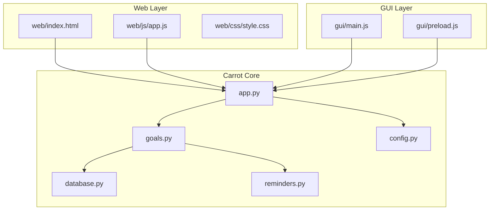
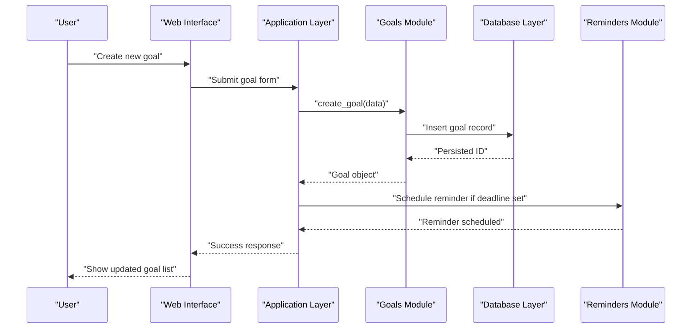
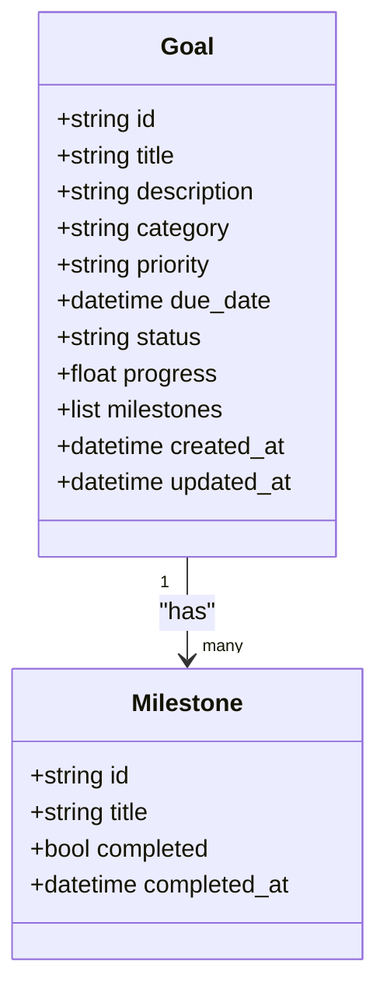
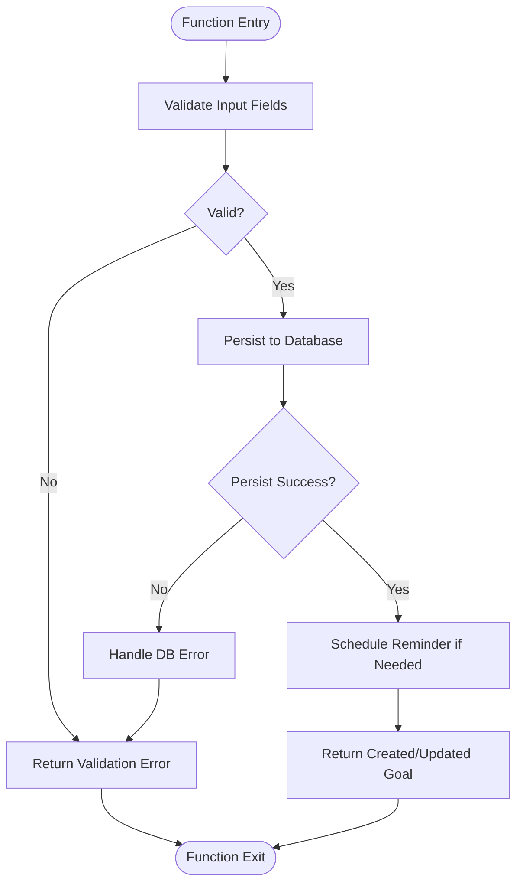
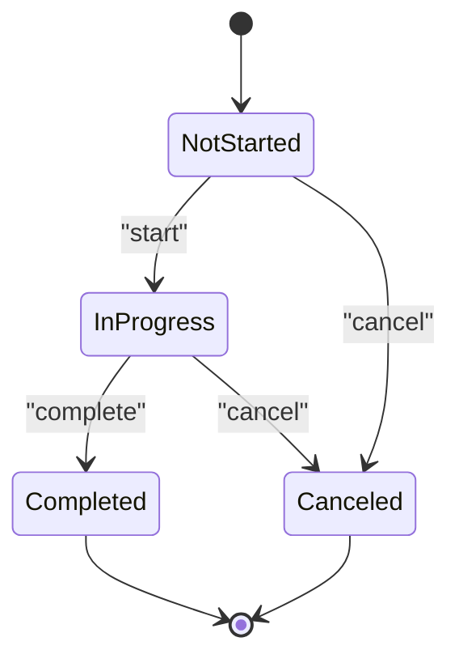
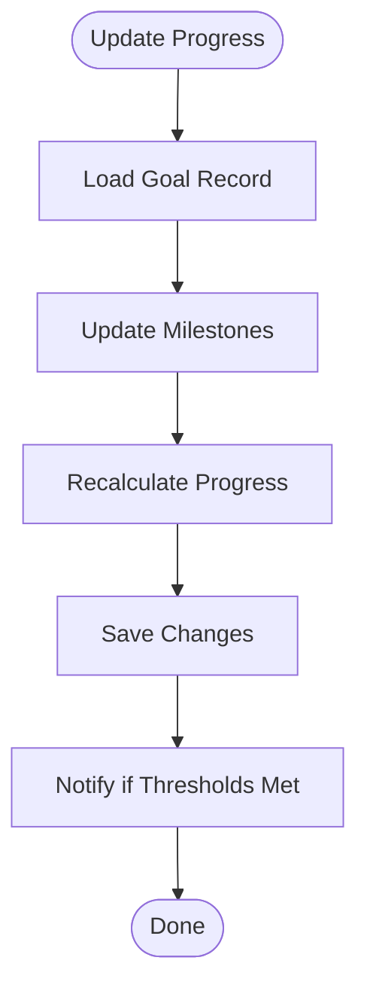
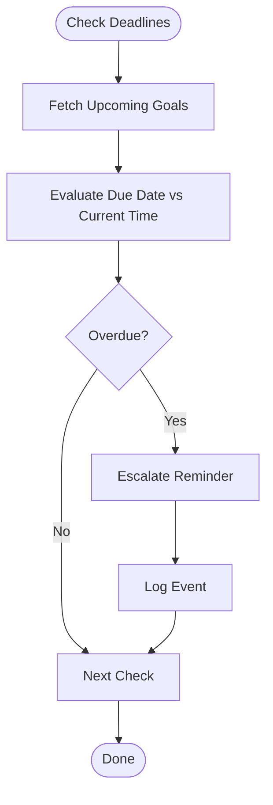
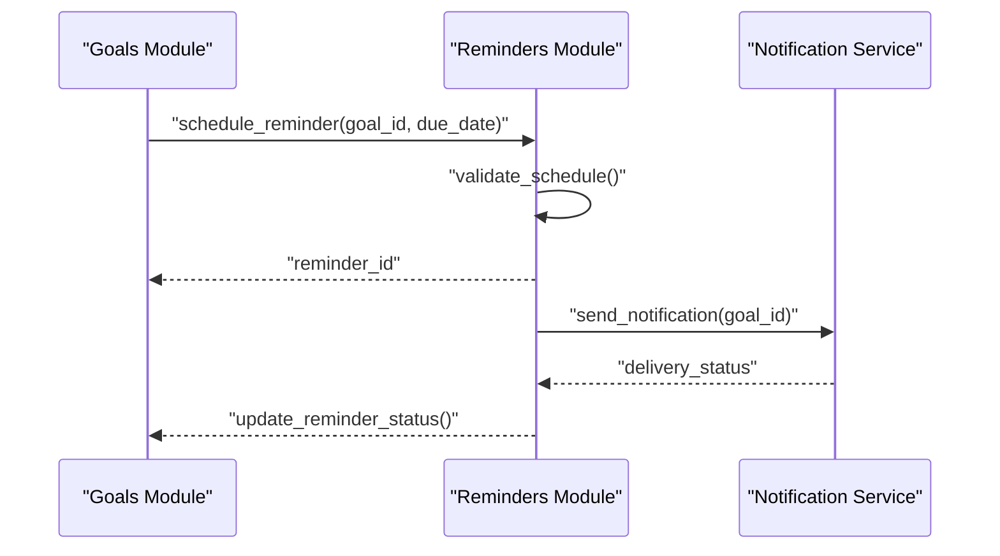
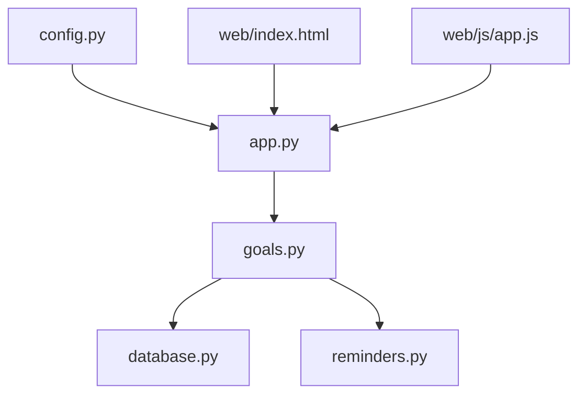

# Goal Tracking System

<cite>
**Referenced Files in This Document**
- [goals.py](file://carrot/goals.py)
- [database.py](file://carrot/database.py)
- [reminders.py](file://carrot/reminders.py)
- [app.py](file://carrot/app.py)
- [config.py](file://carrot/config.py)
- [README.md](file://README.md)
</cite>

## Table of Contents
1. [Introduction](#introduction)
2. [Project Structure](#project-structure)
3. [Core Components](#core-components)
4. [Architecture Overview](#architecture-overview)
5. [Detailed Component Analysis](#detailed-component-analysis)
6. [Dependency Analysis](#dependency-analysis)
7. [Performance Considerations](#performance-considerations)
8. [Troubleshooting Guide](#troubleshooting-guide)
9. [Conclusion](#conclusion)
10. [Appendices](#appendices)

## Introduction
This document explains the goal tracking system implemented in the project. It covers the goal data model, CRUD operations, status management, and progress tracking mechanisms. It also documents how goals are created, updated, and monitored over time, including examples of categories, priority levels, deadline management, integration with reminders and notifications, progress visualization, and historical analysis. Where applicable, it provides code example paths for programmatic goal management and custom workflows.

## Project Structure
The goal tracking functionality is primarily implemented in a dedicated module that defines the goal data model and operations, integrates with the application’s database layer, and coordinates with reminders and notifications. The web interface and configuration files support user interaction and environment setup.

**Diagram sources**
- [goals.py](file://carrot/goals.py)
- [database.py](file://carrot/database.py)
- [reminders.py](file://carrot/reminders.py)
- [app.py](file://carrot/app.py)
- [config.py](file://carrot/config.py)
- [web/index.html](file://web/index.html)
- [web/js/app.js](file://web/js/app.js)
- [web/css/style.css](file://web/css/style.css)
- [gui/main.js](file://gui/main.js)
- [gui/preload.js](file://gui/preload.js)

**Section sources**
- [README.md](file://README.md)

## Core Components
- Goal Data Model: Defines fields such as title, description, category, priority, deadlines, status, and progress metrics.
- CRUD Operations: Functions to create, read, update, delete, and list goals.
- Status Management: Enumerated states (e.g., not started, in progress, completed, canceled) and transitions.
- Progress Tracking: Mechanisms to record completion milestones and compute overall progress.
- Deadline Management: Due dates, reminders scheduling, and overdue handling.
- Integration Points: Database persistence, reminders/notifications, and UI updates.

**Section sources**
- [goals.py](file://carrot/goals.py)
- [database.py](file://carrot/database.py)
- [reminders.py](file://carrot/reminders.py)

## Architecture Overview
The goal tracking system follows a layered architecture:
- Presentation Layer: Web and GUI components render goal lists, forms, and progress visuals.
- Application Layer: Orchestrates business logic, validates inputs, manages state transitions, and coordinates with persistence and reminders.
- Persistence Layer: Stores goals and related metadata using the database module.
- Notification Layer: Schedules and sends reminders based on deadlines and statuses.

**Diagram sources**
- [goals.py](file://carrot/goals.py)
- [database.py](file://carrot/database.py)
- [reminders.py](file://carrot/reminders.py)
- [app.py](file://carrot/app.py)

## Detailed Component Analysis

### Goal Data Model
The goal data model includes:
- Title and Description: Human-readable identifiers and context.
- Category: Grouping by domain or type (e.g., health, finance, learning).
- Priority: Levels such as low, medium, high, urgent.
- Deadlines: Due date/time and optional recurring schedule.
- Status: Lifecycle states like not_started, in_progress, completed, canceled.
- Progress Metrics: Completion percentage, milestone checkpoints, and timestamps.

**Diagram sources**
- [goals.py](file://carrot/goals.py)

**Section sources**
- [goals.py](file://carrot/goals.py)

### CRUD Operations
- Create: Validates input, assigns default values, persists to database, and schedules reminders if needed.
- Read: Retrieves single goal by ID or lists goals with filters (category, priority, status).
- Update: Updates mutable fields, recalculates progress, and adjusts reminders.
- Delete: Removes goal and associated milestones; cancels reminders.
- List/Search: Supports filtering and sorting by fields like due date and priority.

**Diagram sources**
- [goals.py](file://carrot/goals.py)
- [database.py](file://carrot/database.py)
- [reminders.py](file://carrot/reminders.py)

**Section sources**
- [goals.py](file://carrot/goals.py)
- [database.py](file://carrot/database.py)

### Status Management
Statuses define the lifecycle of a goal:
- Not Started: Initial state before any action.
- In Progress: Active work underway.
- Completed: Fully achieved.
- Canceled: Abandoned or superseded.

Transitions are enforced by validation rules and may trigger side effects (e.g., sending completion notifications, updating progress).

**Diagram sources**
- [goals.py](file://carrot/goals.py)

**Section sources**
- [goals.py](file://carrot/goals.py)

### Progress Tracking Mechanisms
- Milestones: Subtasks with individual completion flags and timestamps.
- Percentage Calculation: Aggregates milestone completion and manual updates.
- Audit Trail: Records progress changes with timestamps and reasons.

**Diagram sources**
- [goals.py](file://carrot/goals.py)

**Section sources**
- [goals.py](file://carrot/goals.py)

### Deadline Management
- Due Dates: Stored per goal; can be absolute or relative.
- Overdue Handling: Flags goals past due date and escalates reminders.
- Recurring Schedules: Optional repeat intervals for periodic goals.

**Diagram sources**
- [goals.py](file://carrot/goals.py)
- [reminders.py](file://carrot/reminders.py)

**Section sources**
- [goals.py](file://carrot/goals.py)
- [reminders.py](file://carrot/reminders.py)

### Integration with Reminders and Notifications
- Scheduling: Reminders are scheduled when goals are created or updated with deadlines.
- Delivery: Notifications sent via configured channels (e.g., in-app alerts, email).
- Customization: Users can set reminder frequency and quiet hours.

**Diagram sources**
- [goals.py](file://carrot/goals.py)
- [reminders.py](file://carrot/reminders.py)

**Section sources**
- [goals.py](file://carrot/goals.py)
- [reminders.py](file://carrot/reminders.py)

### Progress Visualization
- Dashboards: Display goal lists, filters, and progress bars.
- Charts: Visualize completion trends and milestone achievements.
- Export: Generate reports for historical analysis.

[No sources needed since this section provides general guidance]

### Historical Goal Analysis
- Aggregation: Summarizes completed goals by category and priority.
- Trends: Tracks completion rates over time.
- Insights: Identifies patterns and bottlenecks.

[No sources needed since this section provides general guidance]

### Programmatic Goal Management Examples
- Creating a goal programmatically: Use the create function with validated data.
- Updating progress: Call update functions to modify milestones and recalculate progress.
- Listing goals: Query with filters for category, priority, and status.

**Section sources**
- [goals.py](file://carrot/goals.py)

### Custom Goal Workflows
- Custom Validators: Implement additional checks for specific domains.
- Hooks: Trigger actions on status changes or milestone completions.
- Integrations: Connect with external systems via APIs.

**Section sources**
- [goals.py](file://carrot/goals.py)

## Dependency Analysis
The goal tracking system depends on the database layer for persistence and the reminders module for scheduling notifications. The application layer orchestrates these dependencies and exposes APIs to the web and GUI layers.

**Diagram sources**
- [goals.py](file://carrot/goals.py)
- [database.py](file://carrot/database.py)
- [reminders.py](file://carrot/reminders.py)
- [app.py](file://carrot/app.py)
- [config.py](file://carrot/config.py)
- [web/index.html](file://web/index.html)
- [web/js/app.js](file://web/js/app.js)

**Section sources**
- [goals.py](file://carrot/goals.py)
- [database.py](file://carrot/database.py)
- [reminders.py](file://carrot/reminders.py)
- [app.py](file://carrot/app.py)
- [config.py](file://carrot/config.py)

## Performance Considerations
- Efficient Queries: Use indexed fields for frequent filters (status, due date).
- Batch Updates: Group progress updates to reduce database writes.
- Caching: Cache frequently accessed goal lists and summaries.
- Asynchronous Processing: Offload reminder scheduling and notifications to background tasks.

[No sources needed since this section provides general guidance]

## Troubleshooting Guide
Common issues and resolutions:
- Validation Errors: Ensure required fields are present and correctly formatted.
- Database Connectivity: Verify connection settings and permissions.
- Reminder Failures: Check notification service configuration and delivery logs.
- Progress Miscalculations: Review milestone updates and recalculation logic.

**Section sources**
- [goals.py](file://carrot/goals.py)
- [database.py](file://carrot/database.py)
- [reminders.py](file://carrot/reminders.py)

## Conclusion
The goal tracking system provides a robust framework for managing goals with clear data modeling, comprehensive CRUD operations, flexible status management, and effective progress tracking. Integration with reminders and notifications ensures timely follow-ups, while visualization and historical analysis support informed decision-making. The modular design allows for customization and extension to meet diverse use cases.

[No sources needed since this section summarizes without analyzing specific files]

## Appendices
- API Reference: Detailed endpoints and methods for goal management.
- Configuration Options: Environment variables and settings for customization.
- Migration Guides: Steps for upgrading schema and data models.

[No sources needed since this section provides general guidance]