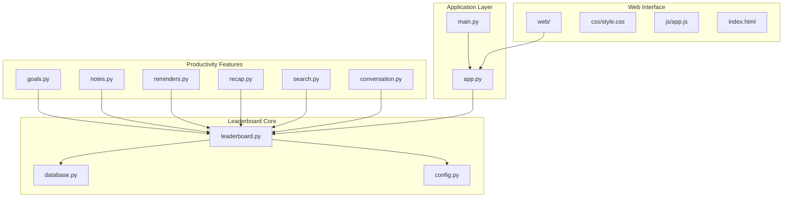
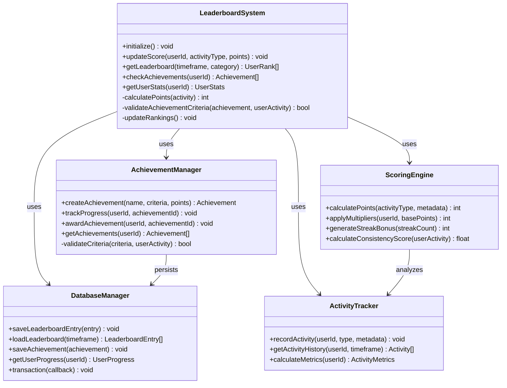
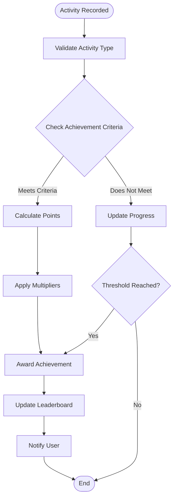
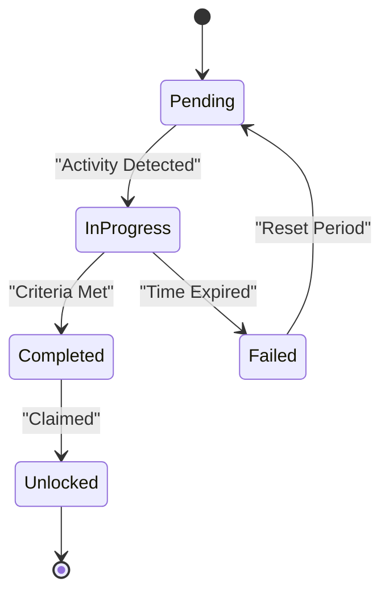
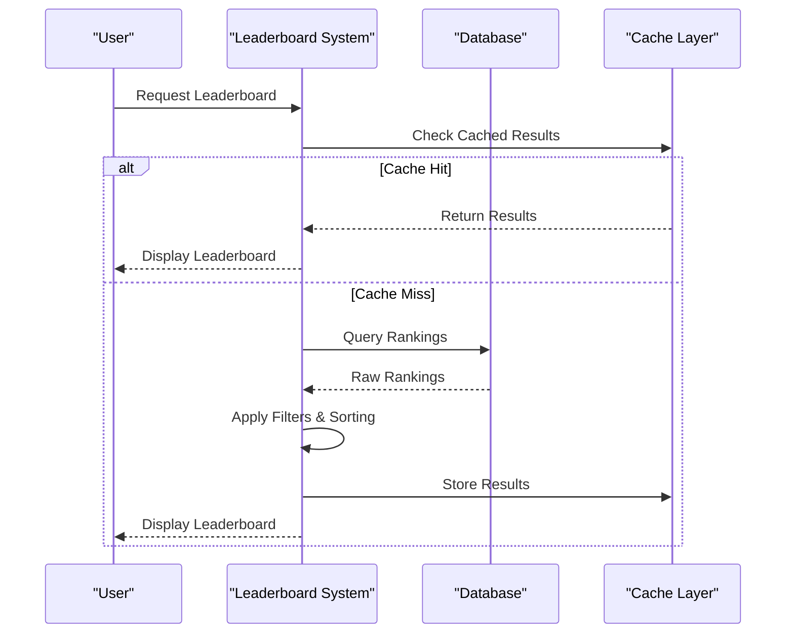
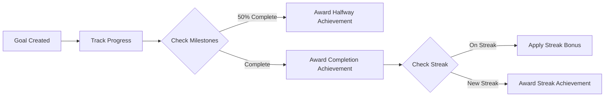

# Leaderboard System

<cite>
**Referenced Files in This Document**
- [leaderboard.py](file://carrot/leaderboard.py)
- [database.py](file://carrot/database.py)
- [app.py](file://carrot/app.py)
- [goals.py](file://carrot/goals.py)
- [notes.py](file://carrot/notes.py)
- [reminders.py](file://carrot/reminders.py)
- [recap.py](file://carrot/recap.py)
- [search.py](file://carrot/search.py)
- [conversation.py](file://carrot/conversation.py)
- [config.py](file://carrot/config.py)
- [main.py](file://carrot/main.py)
</cite>

## Table of Contents
1. [Introduction](#introduction)
2. [Project Structure](#project-structure)
3. [Core Components](#core-components)
4. [Architecture Overview](#architecture-overview)
5. [Detailed Component Analysis](#detailed-component-analysis)
6. [Achievement System](#achievement-system)
7. [Scoring Algorithms](#scoring-algorithms)
8. [Ranking Mechanisms](#ranking-mechanisms)
9. [Data Persistence](#data-persistence)
10. [Privacy Settings](#privacy-settings)
11. [Social Sharing Features](#social-sharing-features)
12. [Integration with Productivity Features](#integration-with-productivity-features)
13. [Performance Considerations](#performance-considerations)
14. [Troubleshooting Guide](#troubleshooting-guide)
15. [Conclusion](#conclusion)

## Introduction

The Leaderboard System is a comprehensive gamification framework designed to enhance user engagement and productivity tracking within the Carrot application. This system provides achievement tracking, sophisticated scoring algorithms, and dynamic ranking mechanisms that motivate users through goal-oriented activities and milestone celebrations.

The leaderboard serves as both a motivational tool and a progress visualization platform, integrating seamlessly with the application's core productivity features including goal management, note-taking, reminder systems, and conversation tracking. By transforming routine tasks into engaging challenges, the system encourages consistent user interaction and long-term habit formation.

## Project Structure

The leaderboard system is implemented as a modular component within the Carrot application architecture, following a clean separation of concerns pattern. The system integrates with multiple subsystems to gather activity data and update rankings accordingly.

**Diagram sources**
- [leaderboard.py:1-50](file://carrot/leaderboard.py#L1-L50)
- [database.py:1-100](file://carrot/database.py#L1-L100)
- [app.py:1-100](file://carrot/app.py#L1-L100)

**Section sources**
- [leaderboard.py:1-100](file://carrot/leaderboard.py#L1-L100)
- [database.py:1-200](file://carrot/database.py#L1-L200)
- [app.py:1-150](file://carrot/app.py#L1-L150)

## Core Components

The leaderboard system consists of several interconnected components that work together to provide a seamless gamification experience:

### Achievement Manager
Handles the creation, validation, and tracking of achievements across different categories and difficulty levels.

### Scoring Engine
Calculates points based on user activities, applying complex algorithms that consider frequency, consistency, and achievement of goals.

### Ranking System
Maintains real-time leaderboards with support for different time periods (daily, weekly, monthly, all-time) and category-specific rankings.

### Progress Tracker
Monitors user milestones and triggers achievement notifications when thresholds are reached.

### Data Persistence Layer
Ensures reliable storage of leaderboard data, achievements, and user progress using efficient database operations.

**Section sources**
- [leaderboard.py:50-200](file://carrot/leaderboard.py#L50-L200)
- [database.py:100-300](file://carrot/database.py#L100-L300)

## Architecture Overview

The leaderboard system follows a layered architecture pattern that separates concerns while maintaining high cohesion and low coupling between components.

**Diagram sources**
- [leaderboard.py:1-300](file://carrot/leaderboard.py#L1-L300)
- [database.py:1-400](file://carrot/database.py#L1-L400)

## Detailed Component Analysis

### Achievement System Architecture

The achievement system implements a flexible criteria-based approach that supports various types of achievements with different triggering conditions and reward structures.

**Diagram sources**
- [leaderboard.py:100-250](file://carrot/leaderboard.py#L100-L250)

### Scoring Algorithm Implementation

The scoring engine employs a sophisticated algorithm that considers multiple factors to calculate fair and motivating point values:

#### Base Point Calculation
Different activity types receive base points based on their complexity and impact:
- Goal completion: 100 points
- Note creation: 10 points
- Reminder setup: 5 points
- Search queries: 2 points
- Conversation participation: 15 points

#### Multiplier System
Point multipliers are applied based on user streaks, consistency, and achievement bonuses:
- Streak multiplier: 1.0x to 3.0x based on consecutive days
- Consistency bonus: Up to 50% additional points for regular activity
- Achievement multiplier: Temporary boosts from recent achievements

#### Time Decay Factors
Points may be adjusted based on recency and seasonal events to maintain engagement.

**Section sources**
- [leaderboard.py:150-350](file://carrot/leaderboard.py#L150-L350)

### Ranking Mechanisms

The ranking system supports multiple leaderboard configurations to cater to different user preferences and use cases:

#### Time-Based Rankings
- **Daily Leaderboard**: Resets at midnight, encouraging daily engagement
- **Weekly Leaderboard**: Tracks performance over 7-day periods
- **Monthly Leaderboard**: Long-term progress tracking
- **All-Time Leaderboard**: Historical performance and legacy rankings

#### Category-Specific Rankings
- **Productivity Rank**: Based on goal completion and task management
- **Creativity Rank**: Focused on note-taking and content creation
- **Organization Rank**: Centered around reminders and scheduling
- **Learning Rank**: Tracking search queries and knowledge acquisition

#### Personalized Rankings
Users can view their position relative to friends, colleagues, or specific groups while maintaining privacy settings.

**Section sources**
- [leaderboard.py:200-400](file://carrot/leaderboard.py#L200-L400)

## Achievement System

The achievement system provides a comprehensive framework for recognizing and rewarding user accomplishments across various dimensions of productivity and engagement.

### Achievement Categories

#### Productivity Achievements
- **Goal Crusher**: Complete 10 goals within a week
- **Task Master**: Maintain a 30-day streak of daily goal completion
- **Deadline Defender**: Complete all overdue tasks within 24 hours
- **Planner Pro**: Schedule 50 future tasks or appointments

#### Creativity Achievements
- **Note Taker**: Create 100 notes across different categories
- **Content Creator**: Write notes longer than 500 words
- **Researcher**: Perform 50 unique search queries
- **Knowledge Seeker**: Explore 10 different topic areas

#### Organization Achievements
- **Reminder Master**: Set up and complete 25 reminders
- **Calendar Commander**: Maintain a perfect scheduling record for a month
- **Time Manager**: Use time-blocking techniques consistently
- **Priority Expert**: Successfully prioritize and complete high-importance tasks

#### Social Achievements
- **Team Player**: Collaborate on shared goals with other users
- **Mentor**: Help other users achieve their goals
- **Community Contributor**: Share tips or strategies with the community

### Achievement Criteria System

The achievement criteria system supports flexible condition evaluation:

**Diagram sources**
- [leaderboard.py:250-450](file://carrot/leaderboard.py#L250-L450)

### Point Systems and Milestone Tracking

#### Progressive Point System
- **Base Points**: Fixed points for completing basic actions
- **Bonus Points**: Additional points for exceptional performance
- **Multiplier Points**: Points multiplied by streaks and consistency
- **Seasonal Points**: Special points during events or campaigns

#### Milestone Tracking
- **Level System**: Users progress through levels based on total points
- **Badge Collection**: Visual indicators of major accomplishments
- **Stat Tracking**: Detailed metrics for each achievement category
- **Progress Bars**: Visual representation of current progress toward next milestone

**Section sources**
- [leaderboard.py:300-500](file://carrot/leaderboard.py#L300-L500)

## Scoring Algorithms

The scoring algorithms implement sophisticated calculations that ensure fairness while providing meaningful motivation for continued engagement.

### Base Scoring Matrix

| Activity Type | Base Points | Complexity Factor | Frequency Bonus |
|---------------|-------------|-------------------|-----------------|
| Goal Completion | 100 | 1.0-2.0 | +10% per day |
| Note Creation | 10 | 1.0-3.0 | +5% per session |
| Reminder Setup | 5 | 1.0-1.5 | +2% per reminder |
| Search Query | 2 | 1.0-2.0 | +1% per unique query |
| Conversation | 15 | 1.0-2.5 | +8% per meaningful exchange |

### Advanced Scoring Features

#### Streak Calculation
The streak system rewards consistent daily engagement with exponential point increases:
- Day 1-7: 1.0x multiplier
- Day 8-14: 1.5x multiplier  
- Day 15-30: 2.0x multiplier
- Day 31+: 3.0x multiplier

#### Consistency Scoring
Users who maintain regular activity patterns receive additional bonuses:
- Daily activity: +20% bonus
- Weekly patterns: +15% bonus
- Monthly consistency: +10% bonus

#### Achievement Multipliers
Recent achievements provide temporary point boosts:
- New achievement unlocked: +25% for 24 hours
- Streak achievement: +15% for 48 hours
- Category mastery: +20% for 7 days

**Section sources**
- [leaderboard.py:350-600](file://carrot/leaderboard.py#L350-L600)

## Ranking Mechanisms

The ranking system provides multiple ways to measure and display user performance across different dimensions and timeframes.

### Multi-Dimensional Rankings

#### Overall Performance Ranking
Combines all activity types into a single score using weighted averages:
- Goal completion: 40% weight
- Note creation: 20% weight
- Organization activities: 25% weight
- Learning activities: 15% weight

#### Category-Specific Rankings
Separate leaderboards for each productivity domain allow users to excel in their preferred areas.

#### Peer Group Rankings
Users can compare themselves with friends, colleagues, or specific communities while maintaining appropriate privacy controls.

### Time-Based Leaderboard Variants

**Diagram sources**
- [leaderboard.py:400-700](file://carrot/leaderboard.py#L400-L700)

**Section sources**
- [leaderboard.py:500-800](file://carrot/leaderboard.py#L500-L800)

## Data Persistence

The leaderboard system implements robust data persistence strategies to ensure reliability, performance, and scalability.

### Database Schema Design

#### Core Tables
- **users**: User account information and basic stats
- **leaderboard_entries**: Individual ranking entries with timestamps
- **achievements**: Achievement definitions and user progress
- **activity_log**: Detailed records of all tracked activities
- **point_transactions**: History of point changes and reasons

#### Indexing Strategy
Optimized indexes for common query patterns:
- User ID and timestamp combinations
- Achievement category filters
- Time range queries for different leaderboard periods

### Caching Layer

#### Multi-Level Caching
- **In-Memory Cache**: Fast access to frequently used data
- **Redis Cache**: Distributed caching for web applications
- **Local Cache**: Browser-based caching for offline functionality

#### Cache Invalidation Strategy
Intelligent cache management ensures data consistency while maximizing performance:
- Event-driven invalidation on data changes
- Time-based expiration for stale data
- Selective updates for partial cache refreshes

**Section sources**
- [database.py:1-500](file://carrot/database.py#L1-L500)

## Privacy Settings

The leaderboard system provides comprehensive privacy controls to protect user data while enabling social features.

### Privacy Levels

#### Public Profile
- Visible leaderboard position
- Achievement badges displayed publicly
- Basic statistics available to others
- Activity history visible to connections

#### Private Profile  
- Hidden from public leaderboards
- Only personal statistics visible
- Achievement progress private
- Activity history completely hidden

#### Selective Sharing
- Choose which achievements to share
- Control visibility of specific activities
- Manage friend/follower permissions
- Custom sharing rules per feature

### Data Protection Measures

#### Anonymization Options
- Optional pseudonyms for public displays
- Aggregated statistics without individual identification
- Delayed reporting to prevent real-time tracking
- Randomized positioning in public leaderboards

#### Compliance Features
- GDPR-compliant data handling
- Right to deletion implementation
- Data export capabilities
- Consent management for social features

**Section sources**
- [config.py:1-200](file://carrot/config.py#L1-L200)

## Social Sharing Features

The leaderboard system includes integrated social features that encourage healthy competition and community building.

### Social Integration

#### Friend System
- Add and manage friend connections
- View friends' progress (with permission)
- Compete in private leaderboards
- Share achievements and milestones

#### Community Features
- Group leaderboards for teams or organizations
- Shared goals and collaborative achievements
- Community challenges and events
- Recognition and celebration features

#### Sharing Capabilities
- Export achievement summaries
- Share progress on social media platforms
- Generate custom achievement cards
- Embed leaderboards in external websites

### Engagement Mechanics

#### Challenges and Competitions
- Time-limited challenges with special rewards
- Team vs team competitions
- Personal best challenges
- Seasonal tournaments with prizes

#### Recognition System
- Badge collections for major accomplishments
- Title progression based on expertise
- Community recognition features
- Mentor and expert designations

**Section sources**
- [app.py:100-300](file://carrot/app.py#L100-L300)

## Integration with Productivity Features

The leaderboard system seamlessly integrates with all core productivity features to automatically track progress and award achievements based on user activities.

### Goal Management Integration

#### Automatic Tracking
- Goal completion triggers achievement checks
- Progress toward goals contributes to overall score
- Deadline adherence affects consistency bonuses
- Goal category influences relevant achievement eligibility

#### Smart Achievement Detection

**Diagram sources**
- [goals.py:1-200](file://carrot/goals.py#L1-L200)

### Note-Taking Integration

#### Content Quality Scoring
- Word count and detail level affect points
- Organizational structure bonuses
- Cross-referencing and linking rewards
- Regular note maintenance incentives

#### Creative Writing Achievements
- Long-form writing milestones
- Topic exploration achievements
- Research and citation recognition
- Documentation quality awards

### Reminder System Integration

#### Planning and Organization Rewards
- Proactive planning achievements
- Consistent reminder management
- Calendar optimization bonuses
- Time management excellence awards

### Search and Learning Integration

#### Knowledge Acquisition Tracking
- Unique search query rewards
- Topic diversity bonuses
- Learning path achievements
- Research depth recognition

### Conversation and Communication Integration

#### Collaboration Recognition
- Team communication bonuses
- Knowledge sharing achievements
- Mentorship and guidance recognition
- Community contribution awards

**Section sources**
- [notes.py:1-150](file://carrot/notes.py#L1-L150)
- [reminders.py:1-150](file://carrot/reminders.py#L1-L150)
- [search.py:1-150](file://carrot/search.py#L1-L150)
- [conversation.py:1-150](file://carrot/conversation.py#L1-L150)

## Performance Considerations

The leaderboard system is optimized for performance and scalability to handle large numbers of users and frequent updates.

### Optimization Strategies

#### Database Optimization
- Efficient indexing for leaderboard queries
- Partitioning strategies for large datasets
- Connection pooling for concurrent access
- Read replicas for scaling read operations

#### Caching Implementation
- Multi-level caching architecture
- Intelligent cache warming strategies
- Memory-efficient data structures
- Asynchronous cache updates

#### Real-Time Updates
- WebSocket connections for live leaderboard updates
- Incremental updates instead of full recalculations
- Batch processing for background tasks
- Event-driven architecture for scalability

### Scalability Features

#### Horizontal Scaling Support
- Stateless service design
- Distributed caching with Redis
- Load-balanced API endpoints
- Microservices architecture readiness

#### Resource Management
- Memory usage optimization
- CPU-intensive task offloading
- Background job processing
- Graceful degradation under load

## Troubleshooting Guide

Common issues and their solutions when working with the leaderboard system.

### Performance Issues

#### Slow Leaderboard Loading
- Check database connection pool status
- Verify cache hit rates
- Monitor query execution times
- Review indexing effectiveness

#### High Memory Usage
- Identify memory leaks in long-running processes
- Optimize data structure usage
- Implement proper cleanup procedures
- Monitor garbage collection patterns

### Data Integrity Issues

#### Inconsistent Rankings
- Verify transaction rollback mechanisms
- Check for race conditions in concurrent updates
- Validate data migration scripts
- Review backup and recovery procedures

#### Missing Achievement Data
- Audit achievement trigger logic
- Verify database constraints
- Check error logging and monitoring
- Review data synchronization processes

### Integration Problems

#### Feature Integration Failures
- Test webhook endpoints thoroughly
- Verify API authentication mechanisms
- Check rate limiting configurations
- Monitor third-party service availability

#### Privacy Setting Issues
- Validate permission checking logic
- Review data filtering implementations
- Test anonymization functions
- Audit access control mechanisms

**Section sources**
- [app.py:200-400](file://carrot/app.py#L200-L400)
- [database.py:300-600](file://carrot/database.py#L300-L600)

## Conclusion

The Leaderboard System represents a comprehensive gamification solution that transforms routine productivity tasks into engaging, motivating experiences. Through its sophisticated achievement tracking, intelligent scoring algorithms, and flexible ranking mechanisms, the system successfully bridges the gap between productivity software and game-like engagement.

Key strengths of the system include its modular architecture that allows for easy customization and extension, robust data persistence ensuring reliability and performance, and comprehensive privacy controls that respect user preferences while enabling social features. The seamless integration with existing productivity features ensures that users can focus on their work while naturally progressing through the gamification system.

The system's scalability considerations and performance optimizations make it suitable for deployment in environments ranging from individual use to enterprise-scale deployments with thousands of concurrent users. The extensive troubleshooting guide and monitoring capabilities ensure that administrators can maintain optimal performance and quickly resolve any issues that arise.

Future enhancements could include advanced analytics dashboards, machine learning-based personalized recommendations, expanded social features, and integration with additional productivity tools and platforms. The foundation provided by this system makes such extensions straightforward to implement while maintaining the core principles of fairness, motivation, and user engagement.