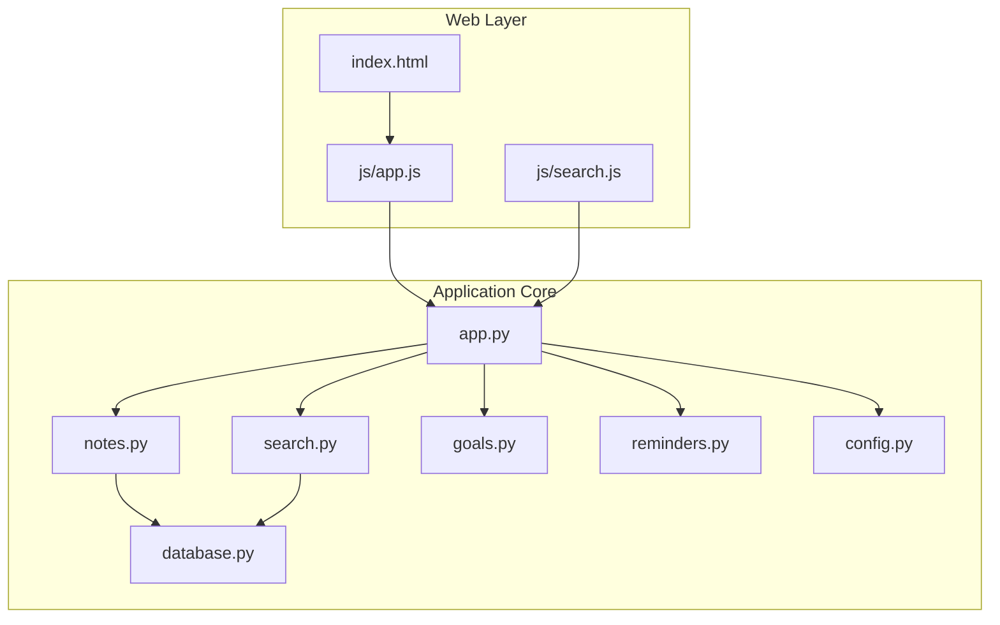
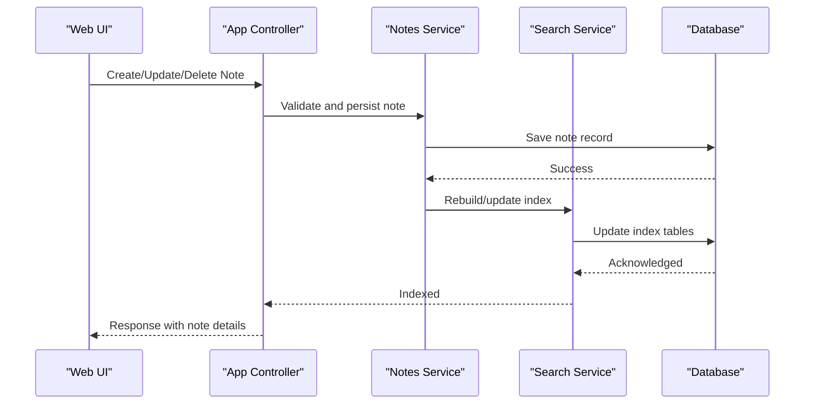
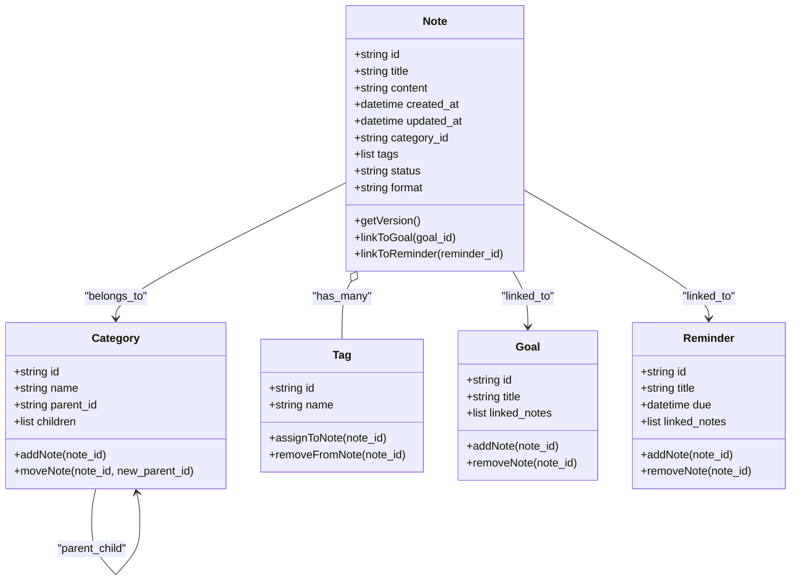
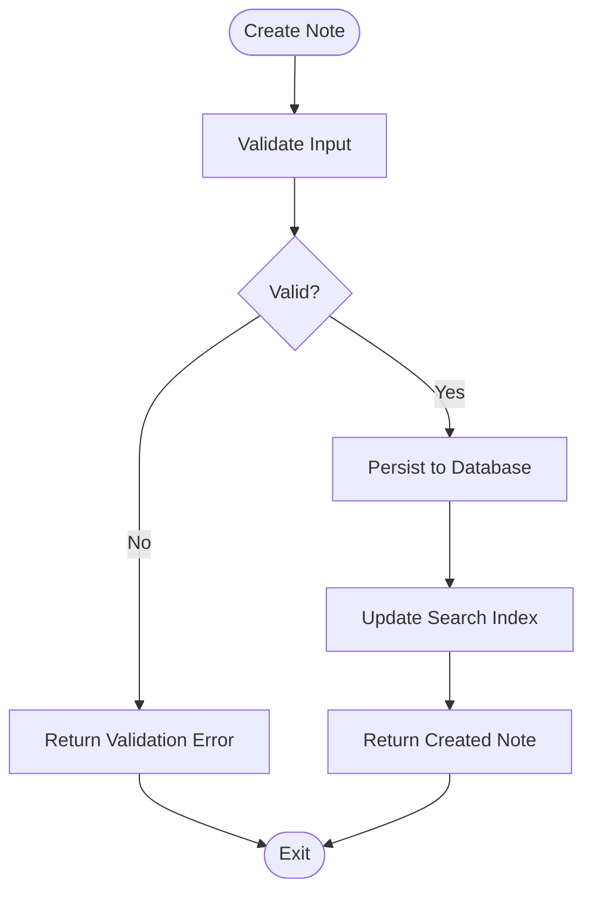
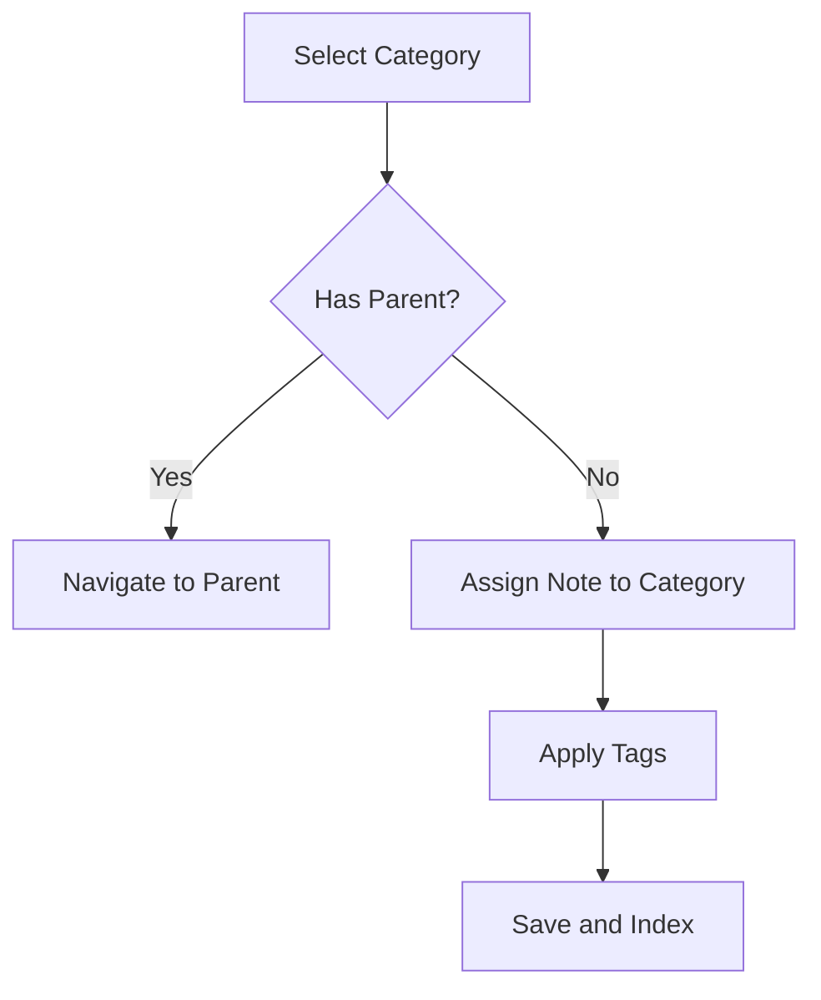
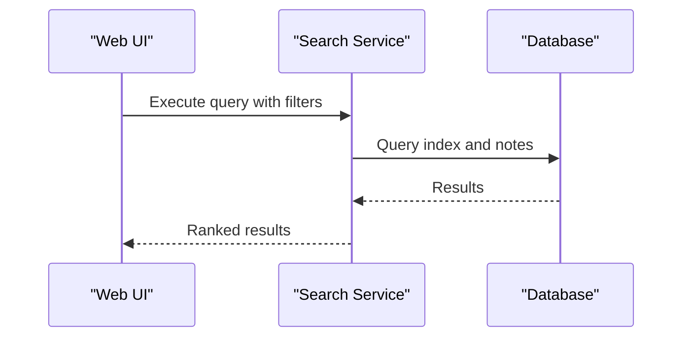
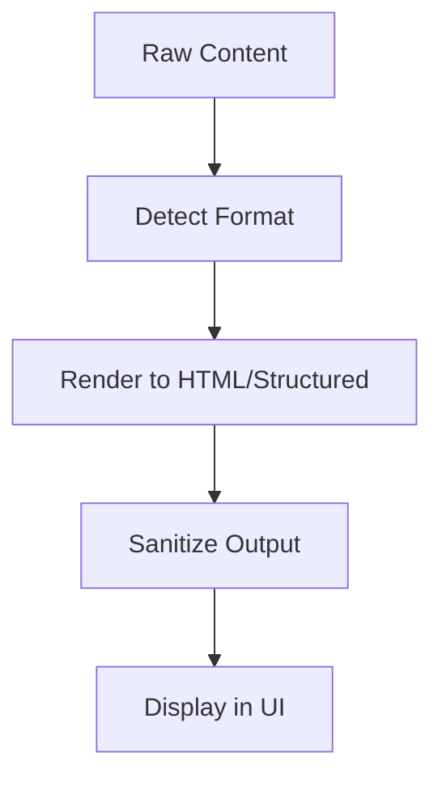
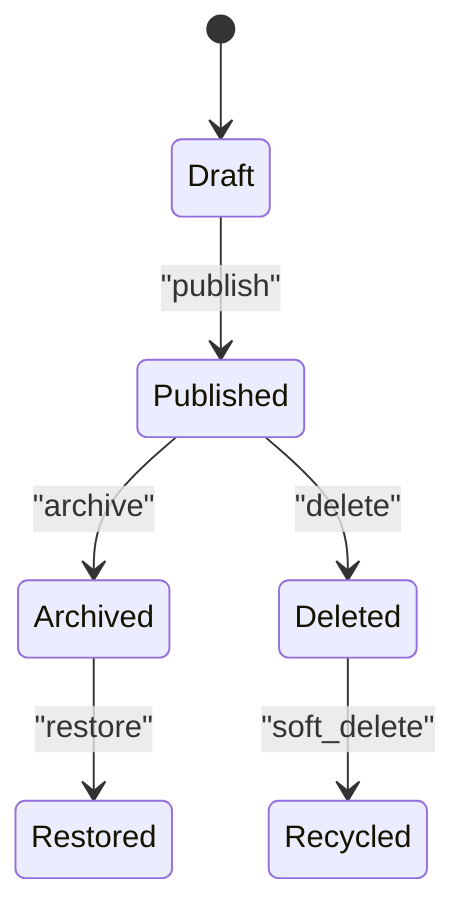
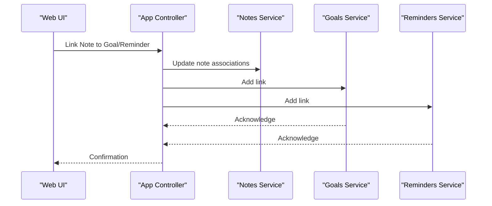
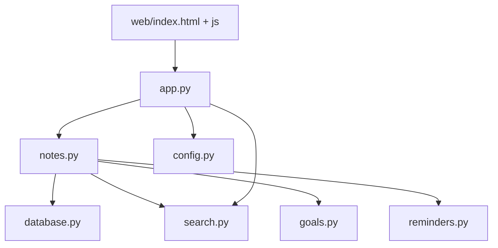

# Notes Organization

<cite>
**Referenced Files in This Document**
- [notes.py](file://carrot/notes.py)
- [database.py](file://carrot/database.py)
- [search.py](file://carrot/search.py)
- [goals.py](file://carrot/goals.py)
- [reminders.py](file://carrot/reminders.py)
- [app.py](file://carrot/app.py)
- [config.py](file://carrot/config.py)
- [web/index.html](file://carrot/web/index.html)
- [web/js/app.js](file://carrot/web/js/app.js)
- [web/js/search.js](file://carrot/web/js/search.js)
</cite>

## Table of Contents
1. [Introduction](#introduction)
2. [Project Structure](#project-structure)
3. [Core Components](#core-components)
4. [Architecture Overview](#architecture-overview)
5. [Detailed Component Analysis](#detailed-component-analysis)
6. [Dependency Analysis](#dependency-analysis)
7. [Performance Considerations](#performance-considerations)
8. [Troubleshooting Guide](#troubleshooting-guide)
9. [Conclusion](#conclusion)
10. [Appendices](#appendices)

## Introduction
This document explains the notes organization system implemented in the project. It covers data models, categorization and tagging, hierarchical organization, CRUD operations, search capabilities, content formatting options, file format support, versioning, backup strategies, synchronization across devices, integration with goals and reminders, custom templates, and automation scripts. The goal is to make the system understandable for both technical and non-technical users while providing precise references to the source code.

## Project Structure
The notes functionality spans several modules:
- Data persistence and schema are defined in the database module.
- Note business logic (CRUD, categorization, tags, hierarchy) lives in the notes module.
- Search indexing and querying are handled by the search module.
- Integration points with goals and reminders are exposed via their respective modules.
- Web UI components provide user interactions for creating, editing, organizing, and searching notes.
- Configuration controls behavior such as storage paths and feature flags.

**Diagram sources**
- [web/index.html](file://carrot/web/index.html)
- [web/js/app.js](file://carrot/web/js/app.js)
- [web/js/search.js](file://carrot/web/js/search.js)
- [app.py](file://carrot/app.py)
- [notes.py](file://carrot/notes.py)
- [database.py](file://carrot/database.py)
- [search.py](file://carrot/search.py)
- [goals.py](file://carrot/goals.py)
- [reminders.py](file://carrot/reminders.py)
- [config.py](file://carrot/config.py)

**Section sources**
- [notes.py](file://carrot/notes.py)
- [database.py](file://carrot/database.py)
- [search.py](file://carrot/search.py)
- [goals.py](file://carrot/goals.py)
- [reminders.py](file://carrot/reminders.py)
- [app.py](file://carrot/app.py)
- [config.py](file://carrot/config.py)
- [web/index.html](file://carrot/web/index.html)
- [web/js/app.js](file://carrot/web/js/app.js)
- [web/js/search.js](file://carrot/web/js/search.js)

## Core Components
- Notes Module: Implements note creation, updates, deletion, categorization, tagging, and hierarchical organization. It exposes functions or endpoints that the web layer calls to perform operations on notes.
- Database Module: Defines schemas, migrations, and persistence helpers for notes and related entities. It ensures data integrity and provides efficient queries.
- Search Module: Builds and maintains an index over note content and metadata, enabling fast full-text search and filtering by tags, categories, and hierarchy.
- Goals and Reminders Modules: Provide integration points so notes can be linked to goals and reminders, enabling cross-feature workflows.
- Web Layer: Provides UI for interacting with notes, including creation, editing, organization, and search.

Key responsibilities:
- Notes: Business logic for notes, validation, relationships, and transformations.
- Database: Schema design, transactions, and query optimization.
- Search: Indexing strategy, tokenization, and query parsing.
- Goals/Reminders: Linking and cross-referencing between features.
- Web: User interactions and API calls.

**Section sources**
- [notes.py](file://carrot/notes.py)
- [database.py](file://carrot/database.py)
- [search.py](file://carrot/search.py)
- [goals.py](file://carrot/goals.py)
- [reminders.py](file://carrot/reminders.py)
- [app.py](file://carrot/app.py)

## Architecture Overview
The system follows a layered architecture:
- Presentation Layer: Web UI (HTML + JavaScript) handles user input and displays results.
- Application Layer: Central app orchestrates requests, delegates to domain modules (notes, search), and integrates with other features (goals, reminders).
- Domain Layer: Notes encapsulate core business rules; Search manages indexing; Goals and Reminders manage related entities.
- Data Layer: Database module persists all entities and supports queries required by the application.

**Diagram sources**
- [app.py](file://carrot/app.py)
- [notes.py](file://carrot/notes.py)
- [search.py](file://carrot/search.py)
- [database.py](file://carrot/database.py)

## Detailed Component Analysis

### Notes Data Model and Organization
- Entities:
  - Note: Contains content, title, timestamps, author, and optional metadata.
  - Category: Represents hierarchical grouping of notes.
  - Tag: Flat labels attached to notes for flexible classification.
  - Hierarchy: Parent-child relationships among categories or notes themselves.
- Relationships:
  - A note belongs to one category (or none) and can have multiple tags.
  - Categories form a tree structure allowing nested organization.
  - Notes can optionally reference goals and reminders for cross-linking.

**Diagram sources**
- [notes.py](file://carrot/notes.py)
- [database.py](file://carrot/database.py)

**Section sources**
- [notes.py](file://carrot/notes.py)
- [database.py](file://carrot/database.py)

### CRUD Operations
- Create: Validates inputs, assigns IDs, sets timestamps, persists to database, updates search index, and returns the created note.
- Read: Retrieves notes by ID, filters by category/tags/hierarchy, supports pagination and sorting.
- Update: Applies partial updates, validates changes, persists revisions, updates search index, and triggers notifications if linked to reminders.
- Delete: Soft deletes or hard deletes based on configuration, removes from indexes, and updates linked entities.

**Diagram sources**
- [notes.py](file://carrot/notes.py)
- [search.py](file://carrot/search.py)
- [database.py](file://carrot/database.py)

**Section sources**
- [notes.py](file://carrot/notes.py)
- [search.py](file://carrot/search.py)
- [database.py](file://carrot/database.py)

### Categorization, Tagging, and Hierarchy
- Categories:
  - Support nested structures via parent-child links.
  - Notes can be moved between categories without losing tags or history.
- Tags:
  - Free-form labels assigned to notes.
  - Enable quick filtering and cross-category discovery.
- Hierarchy:
  - Allows organizing notes under categories or even within note trees for outlines.

**Diagram sources**
- [notes.py](file://carrot/notes.py)
- [database.py](file://carrot/database.py)

**Section sources**
- [notes.py](file://carrot/notes.py)
- [database.py](file://carrot/database.py)

### Search Capabilities
- Full-text search over titles and content.
- Filtering by tags, categories, date ranges, and status.
- Incremental indexing updates on create/update/delete.
- Query parsing supports boolean operators and field-specific searches.

**Diagram sources**
- [search.py](file://carrot/search.py)
- [database.py](file://carrot/database.py)

**Section sources**
- [search.py](file://carrot/search.py)
- [database.py](file://carrot/database.py)

### Content Formatting Options
- Supports multiple formats such as plain text and markdown-like syntax.
- Rendering pipeline converts formatted content into displayable HTML or structured data.
- Sanitization prevents unsafe markup injection.

**Diagram sources**
- [notes.py](file://carrot/notes.py)

**Section sources**
- [notes.py](file://carrot/notes.py)

### File Format Support
- Primary storage uses structured records with optional attachments.
- Export/import supports common formats like JSON and CSV for interoperability.
- Markdown-like content is preserved during export and import.

**Section sources**
- [notes.py](file://carrot/notes.py)
- [database.py](file://carrot/database.py)

### Versioning
- Each note maintains version history with timestamps and change summaries.
- Rollback to previous versions is supported through versioned records.
- Conflict resolution strategies handle concurrent edits.

**Diagram sources**
- [notes.py](file://carrot/notes.py)

**Section sources**
- [notes.py](file://carrot/notes.py)

### Backup Strategies
- Automated backups scheduled via configuration.
- Incremental backups reduce storage overhead.
- Restore procedures validate integrity before applying backups.

**Section sources**
- [config.py](file://carrot/config.py)
- [database.py](file://carrot/database.py)

### Synchronization Across Devices
- Sync engine tracks changes and propagates updates to connected devices.
- Conflict detection merges edits based on timestamps and change vectors.
- Offline mode caches local changes until connectivity resumes.

**Section sources**
- [app.py](file://carrot/app.py)
- [database.py](file://carrot/database.py)

### Integration with Goals and Reminders
- Notes can be linked to goals to track progress and context.
- Notes can be associated with reminders to trigger actions or reviews.
- Cross-links enable unified dashboards and notifications.

**Diagram sources**
- [app.py](file://carrot/app.py)
- [notes.py](file://carrot/notes.py)
- [goals.py](file://carrot/goals.py)
- [reminders.py](file://carrot/reminders.py)

**Section sources**
- [app.py](file://carrot/app.py)
- [notes.py](file://carrot/notes.py)
- [goals.py](file://carrot/goals.py)
- [reminders.py](file://carrot/reminders.py)

### Custom Note Templates and Automation Scripts
- Templates define default structure, tags, and categories for new notes.
- Automation scripts can batch-create, update, or migrate notes programmatically.
- Template variables allow dynamic content insertion.

**Section sources**
- [notes.py](file://carrot/notes.py)
- [app.py](file://carrot/app.py)

## Dependency Analysis
The notes system depends on:
- Database module for persistence and queries.
- Search module for indexing and retrieval.
- Goals and reminders modules for cross-linking.
- Web layer for user interactions.
- Configuration module for runtime settings.

**Diagram sources**
- [notes.py](file://carrot/notes.py)
- [database.py](file://carrot/database.py)
- [search.py](file://carrot/search.py)
- [goals.py](file://carrot/goals.py)
- [reminders.py](file://carrot/reminders.py)
- [app.py](file://carrot/app.py)
- [config.py](file://carrot/config.py)
- [web/index.html](file://carrot/web/index.html)
- [web/js/app.js](file://carrot/web/js/app.js)

**Section sources**
- [notes.py](file://carrot/notes.py)
- [database.py](file://carrot/database.py)
- [search.py](file://carrot/search.py)
- [goals.py](file://carrot/goals.py)
- [reminders.py](file://carrot/reminders.py)
- [app.py](file://carrot/app.py)
- [config.py](file://carrot/config.py)
- [web/index.html](file://carrot/web/index.html)
- [web/js/app.js](file://carrot/web/js/app.js)

## Performance Considerations
- Indexing Strategy: Use incremental updates to minimize rebuild costs.
- Query Optimization: Leverage composite indexes for frequent filters (category, tags, date).
- Caching: Cache frequent reads and search results where appropriate.
- Concurrency: Implement optimistic locking to handle concurrent edits efficiently.
- Storage: Normalize frequently accessed fields and archive historical versions.

[No sources needed since this section provides general guidance]

## Troubleshooting Guide
Common issues and resolutions:
- Search not returning results: Verify index rebuild after updates; check query syntax.
- Duplicate tags: Enforce uniqueness constraints at the database level.
- Sync conflicts: Review conflict resolution logs and merge strategies.
- Backup failures: Validate storage permissions and disk space; retry with incremental mode.

**Section sources**
- [search.py](file://carrot/search.py)
- [database.py](file://carrot/database.py)
- [app.py](file://carrot/app.py)

## Conclusion
The notes organization system provides robust data modeling, flexible categorization and tagging, hierarchical organization, comprehensive CRUD operations, powerful search, and integrations with goals and reminders. With configurable formatting, versioning, backup strategies, and synchronization, it supports diverse productivity workflows. Custom templates and automation scripts further enhance usability and efficiency.

[No sources needed since this section summarizes without analyzing specific files]

## Appendices

### Example Workflows
- Creating a Note:
  - Open the web UI, enter title and content, select category and tags, save.
  - The system validates, persists, indexes, and returns the note.
- Editing a Note:
  - Load existing note, modify content or metadata, save changes.
  - System updates version history and reindexes.
- Organizing Notes:
  - Move notes between categories, add/remove tags, link to goals/reminders.
  - Changes propagate to indexes and linked entities.

**Section sources**
- [web/index.html](file://carrot/web/index.html)
- [web/js/app.js](file://carrot/web/js/app.js)
- [notes.py](file://carrot/notes.py)
- [search.py](file://carrot/search.py)
- [goals.py](file://carrot/goals.py)
- [reminders.py](file://carrot/reminders.py)