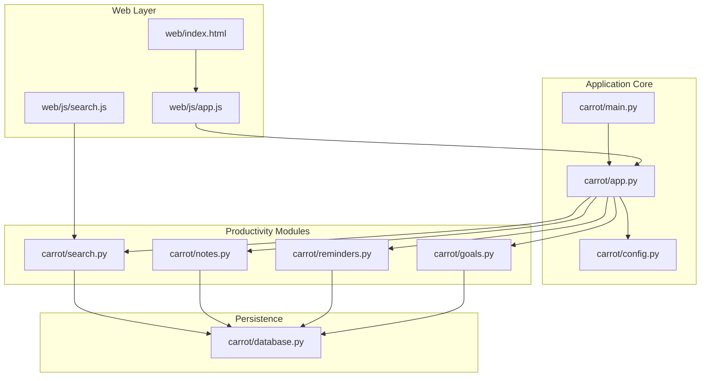
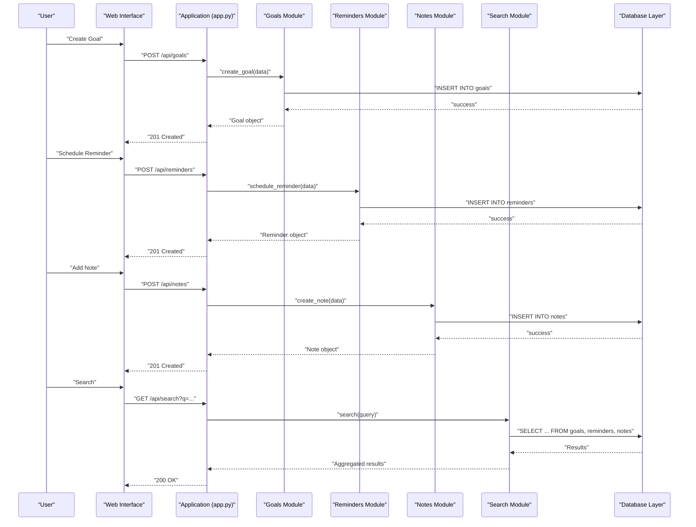
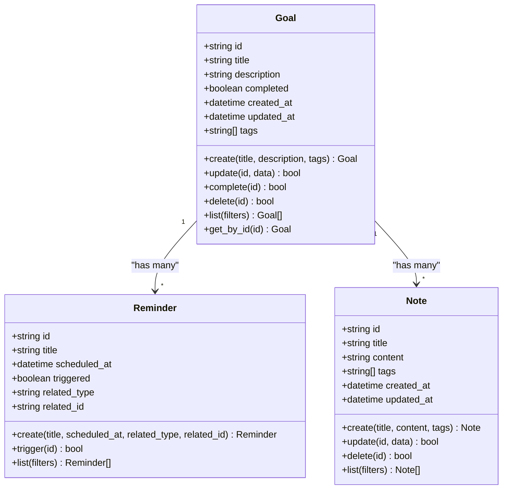
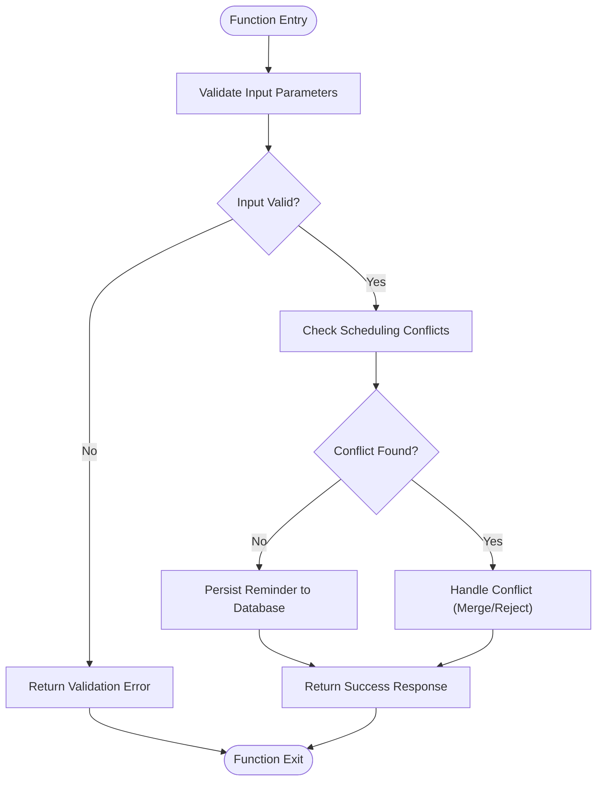
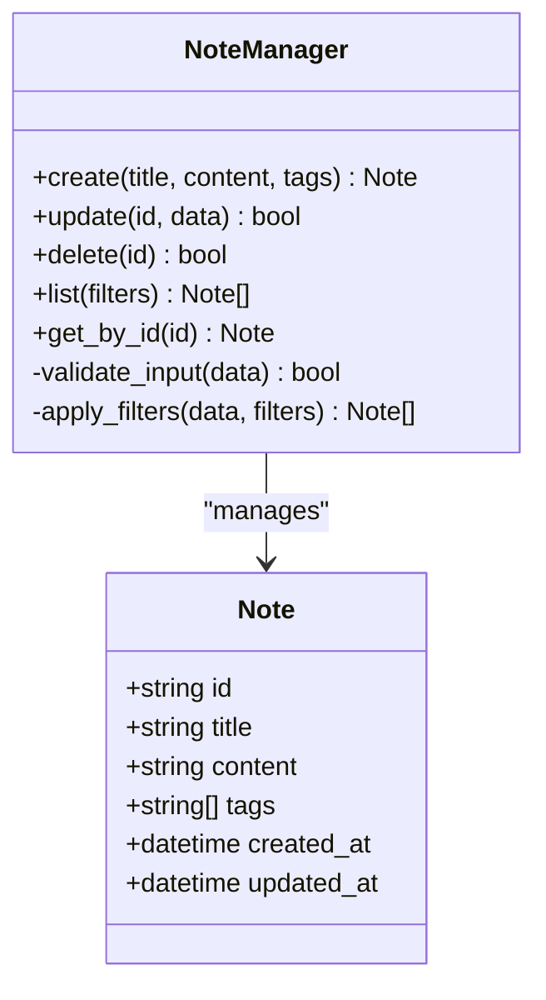
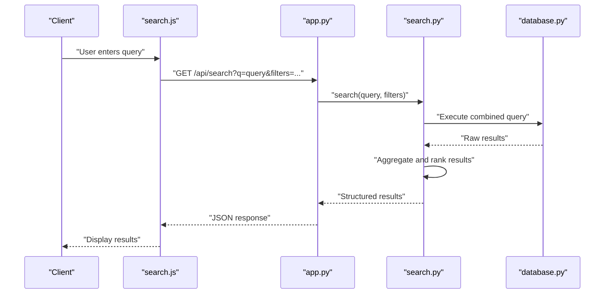
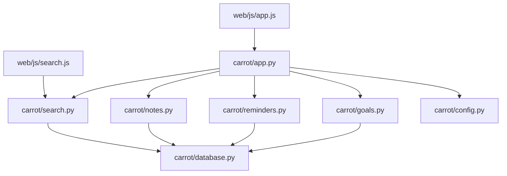

# Productivity Features

<cite>
**Referenced Files in This Document**
- [goals.py](file://carrot/goals.py)
- [reminders.py](file://carrot/reminders.py)
- [notes.py](file://carrot/notes.py)
- [search.py](file://carrot/search.py)
- [database.py](file://carrot/database.py)
- [config.py](file://carrot/config.py)
- [app.py](file://carrot/app.py)
- [main.py](file://carrot/main.py)
- [web/index.html](file://carrot/web/index.html)
- [web/js/app.js](file://carrot/web/js/app.js)
- [web/js/search.js](file://carrot/web/js/search.js)
</cite>

## Table of Contents
1. [Introduction](#introduction)
2. [Project Structure](#project-structure)
3. [Core Components](#core-components)
4. [Architecture Overview](#architecture-overview)
5. [Detailed Component Analysis](#detailed-component-analysis)
6. [Dependency Analysis](#dependency-analysis)
7. [Performance Considerations](#performance-considerations)
8. [Troubleshooting Guide](#troubleshooting-guide)
9. [Conclusion](#conclusion)
10. [Appendices](#appendices)

## Introduction
This document provides comprehensive documentation for the productivity features of the application, focusing on goal tracking, reminder management, note organization, and search capabilities. It explains data models, CRUD operations, user workflows, integration points with the main application and notification systems, cross-feature data sharing, programmatic access patterns, custom workflows, automation scenarios, data persistence, backup strategies, and synchronization mechanisms across devices and sessions.

## Project Structure
The productivity features are implemented as modular Python modules under the carrot package, with a web interface layer that exposes functionality via HTTP endpoints and client-side JavaScript. The database layer abstracts persistence, while configuration centralizes settings.

**Diagram sources**
- [web/index.html](file://carrot/web/index.html)
- [web/js/app.js](file://carrot/web/js/app.js)
- [web/js/search.js](file://carrot/web/js/search.js)
- [carrot/app.py](file://carrot/app.py)
- [carrot/main.py](file://carrot/main.py)
- [carrot/config.py](file://carrot/config.py)
- [carrot/goals.py](file://carrot/goals.py)
- [carrot/reminders.py](file://carrot/reminders.py)
- [carrot/notes.py](file://carrot/notes.py)
- [carrot/search.py](file://carrot/search.py)
- [carrot/database.py](file://carrot/database.py)

**Section sources**
- [carrot/app.py](file://carrot/app.py)
- [carrot/main.py](file://carrot/main.py)
- [carrot/config.py](file://carrot/config.py)
- [carrot/database.py](file://carrot/database.py)
- [carrot/goals.py](file://carrot/goals.py)
- [carrot/reminders.py](file://carrot/reminders.py)
- [carrot/notes.py](file://carrot/notes.py)
- [carrot/search.py](file://carrot/search.py)
- [web/index.html](file://carrot/web/index.html)
- [web/js/app.js](file://carrot/web/js/app.js)
- [web/js/search.js](file://carrot/web/js/search.js)

## Core Components
- Goal Tracking: Create, update, complete, and list goals; associate reminders and notes; track progress metrics.
- Reminder Management: Schedule one-time or recurring reminders; trigger notifications; link to goals and notes.
- Note Organization: Create, edit, tag, and search notes; attach metadata like creation time and last modified timestamp.
- Search Capabilities: Full-text search across goals, reminders, and notes; filter by tags, dates, and status.

These components share a common persistence layer and configuration, enabling consistent behavior and data integrity across features.

**Section sources**
- [carrot/goals.py](file://carrot/goals.py)
- [carrot/reminders.py](file://carrot/reminders.py)
- [carrot/notes.py](file://carrot/notes.py)
- [carrot/search.py](file://carrot/search.py)
- [carrot/database.py](file://carrot/database.py)
- [carrot/config.py](file://carrot/config.py)

## Architecture Overview
The system follows a layered architecture:
- Web Layer: HTML and JavaScript expose UI interactions and API calls.
- Application Layer: Central app module routes requests to feature modules.
- Feature Modules: Each productivity feature encapsulates domain logic and CRUD operations.
- Persistence Layer: Database abstraction manages storage, queries, and transactions.
- Configuration: Centralized settings control behavior and integrations.

**Diagram sources**
- [carrot/app.py](file://carrot/app.py)
- [carrot/goals.py](file://carrot/goals.py)
- [carrot/reminders.py](file://carrot/reminders.py)
- [carrot/notes.py](file://carrot/notes.py)
- [carrot/search.py](file://carrot/search.py)
- [carrot/database.py](file://carrot/database.py)

## Detailed Component Analysis

### Goal Tracking
Goal tracking supports creating, updating, completing, and listing goals. Goals can be associated with reminders and notes, and progress is tracked through completion flags and timestamps.

**Diagram sources**
- [carrot/goals.py](file://carrot/goals.py)
- [carrot/reminders.py](file://carrot/reminders.py)
- [carrot/notes.py](file://carrot/notes.py)

Key behaviors:
- CRUD operations for goals with validation and error handling.
- Association with reminders and notes via foreign keys or references.
- Progress tracking through completion flags and timestamps.

**Section sources**
- [carrot/goals.py](file://carrot/goals.py)
- [carrot/reminders.py](file://carrot/reminders.py)
- [carrot/notes.py](file://carrot/notes.py)

### Reminder Management
Reminder management enables scheduling one-time or recurring reminders, triggering notifications, and linking to goals and notes.

**Diagram sources**
- [carrot/reminders.py](file://carrot/reminders.py)
- [carrot/database.py](file://carrot/database.py)

Key behaviors:
- Scheduling logic with conflict detection and resolution.
- Notification triggers based on scheduled times and recurrence rules.
- Linking to goals and notes for contextual reminders.

**Section sources**
- [carrot/reminders.py](file://carrot/reminders.py)
- [carrot/database.py](file://carrot/database.py)

### Note Organization
Note organization supports creating, editing, tagging, and searching notes with metadata such as creation and modification timestamps.

**Diagram sources**
- [carrot/notes.py](file://carrot/notes.py)

Key behaviors:
- CRUD operations with input validation and filtering.
- Tag-based organization and retrieval.
- Metadata tracking for auditability and sorting.

**Section sources**
- [carrot/notes.py](file://carrot/notes.py)

### Search Capabilities
Search capabilities provide full-text search across goals, reminders, and notes with filtering by tags, dates, and status.

**Diagram sources**
- [carrot/web/js/search.js](file://carrot/web/js/search.js)
- [carrot/app.py](file://carrot/app.py)
- [carrot/search.py](file://carrot/search.py)
- [carrot/database.py](file://carrot/database.py)

Key behaviors:
- Full-text search with relevance ranking.
- Filtering by tags, dates, and status.
- Aggregation across multiple data types.

**Section sources**
- [carrot/search.py](file://carrot/search.py)
- [carrot/database.py](file://carrot/database.py)
- [carrot/web/js/search.js](file://carrot/web/js/search.js)

## Dependency Analysis
The productivity features depend on the database layer for persistence and configuration for behavior tuning. The web layer interacts with the application core, which delegates to feature modules.

**Diagram sources**
- [carrot/goals.py](file://carrot/goals.py)
- [carrot/reminders.py](file://carrot/reminders.py)
- [carrot/notes.py](file://carrot/notes.py)
- [carrot/search.py](file://carrot/search.py)
- [carrot/database.py](file://carrot/database.py)
- [carrot/config.py](file://carrot/config.py)
- [carrot/app.py](file://carrot/app.py)
- [web/js/app.js](file://carrot/web/js/app.js)
- [web/js/search.js](file://carrot/web/js/search.js)

**Section sources**
- [carrot/goals.py](file://carrot/goals.py)
- [carrot/reminders.py](file://carrot/reminders.py)
- [carrot/notes.py](file://carrot/notes.py)
- [carrot/search.py](file://carrot/search.py)
- [carrot/database.py](file://carrot/database.py)
- [carrot/config.py](file://carrot/config.py)
- [carrot/app.py](file://carrot/app.py)
- [web/js/app.js](file://carrot/web/js/app.js)
- [web/js/search.js](file://carrot/web/js/search.js)

## Performance Considerations
- Indexing: Ensure database indexes on frequently queried fields like tags, dates, and status to optimize search performance.
- Pagination: Implement pagination for large result sets in search and listing operations.
- Caching: Cache frequent queries and search results to reduce database load.
- Asynchronous Processing: Use background tasks for reminder triggers and notifications to avoid blocking user interactions.
- Connection Pooling: Configure database connection pooling for concurrent access.

[No sources needed since this section provides general guidance]

## Troubleshooting Guide
Common issues and resolutions:
- Database Connection Errors: Verify database configuration and connectivity.
- Search Query Failures: Check query syntax and ensure proper indexing.
- Reminder Trigger Delays: Review scheduling logic and notification queue processing.
- Data Integrity Issues: Validate foreign key relationships and constraints.

**Section sources**
- [carrot/database.py](file://carrot/database.py)
- [carrot/config.py](file://carrot/config.py)

## Conclusion
The productivity features provide a robust foundation for goal tracking, reminder management, note organization, and search capabilities. By leveraging a modular architecture, shared persistence layer, and centralized configuration, the system ensures consistency, scalability, and maintainability. Integration with the web interface enables seamless user interactions, while programmatic access supports automation and custom workflows.

[No sources needed since this section summarizes without analyzing specific files]

## Appendices

### Programmatic Access Examples
- Creating a Goal: Use the goals module to create a new goal with title, description, and tags.
- Scheduling a Reminder: Use the reminders module to schedule a reminder linked to a goal or note.
- Adding a Note: Use the notes module to create a note with content and tags.
- Searching Data: Use the search module to query across goals, reminders, and notes with filters.

**Section sources**
- [carrot/goals.py](file://carrot/goals.py)
- [carrot/reminders.py](file://carrot/reminders.py)
- [carrot/notes.py](file://carrot/notes.py)
- [carrot/search.py](file://carrot/search.py)

### Backup Strategies
- Regular Backups: Schedule automated backups of the database to secure storage.
- Version Control: Track schema changes and migrations in version control.
- Export Formats: Support exporting data in JSON or CSV formats for manual backup.

**Section sources**
- [carrot/database.py](file://carrot/database.py)

### Synchronization Mechanisms
- Local Sync: Ensure data consistency within a single device session.
- Cloud Sync: Integrate with cloud storage for cross-device synchronization.
- Conflict Resolution: Implement strategies to handle conflicting updates from multiple devices.

**Section sources**
- [carrot/database.py](file://carrot/database.py)
- [carrot/config.py](file://carrot/config.py)