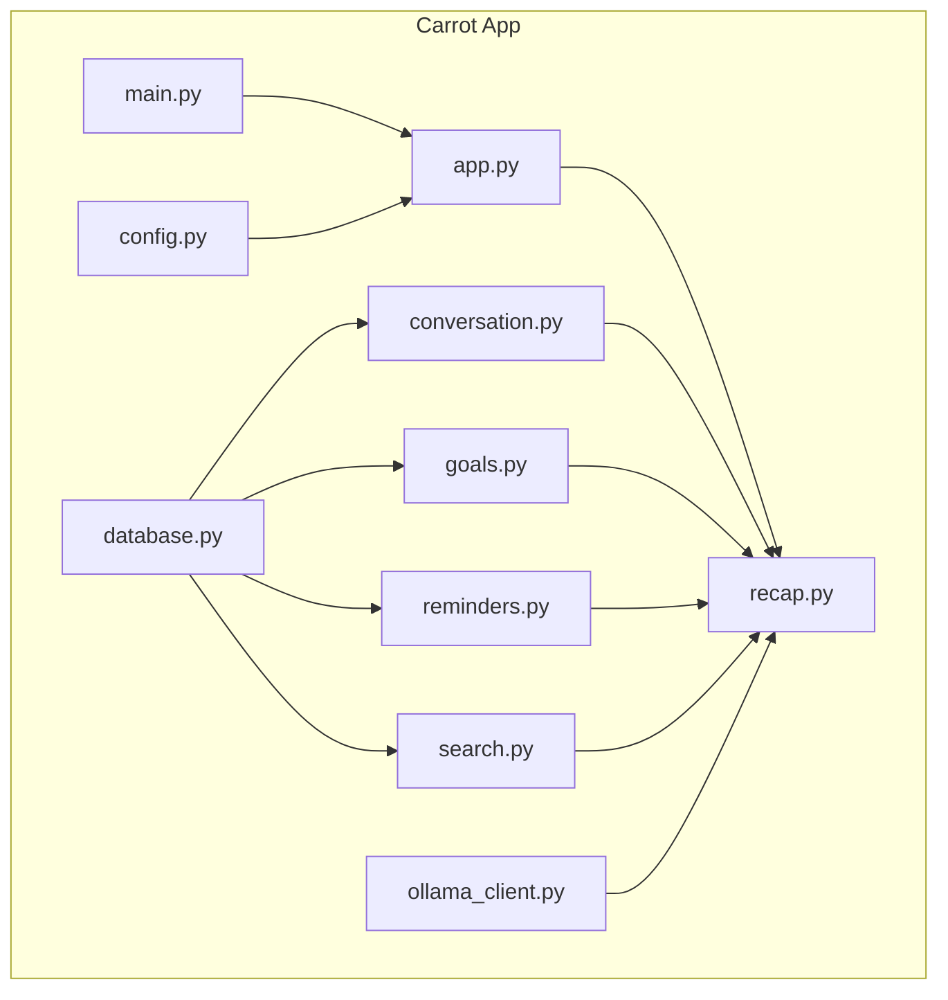
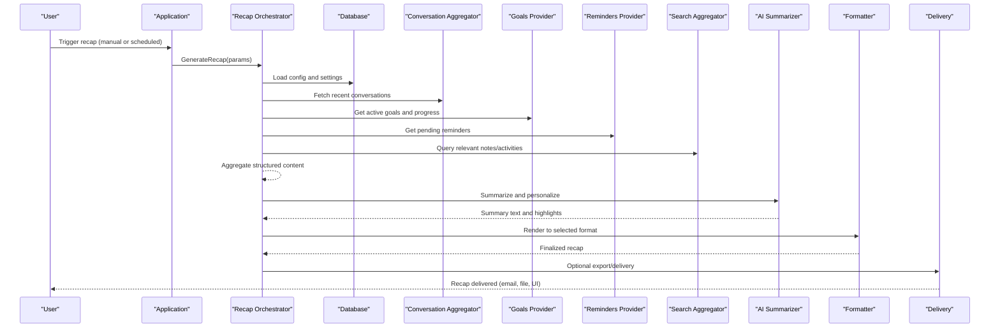
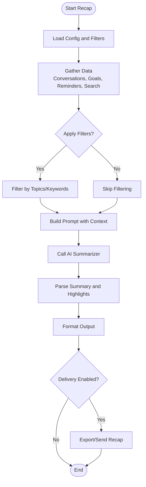
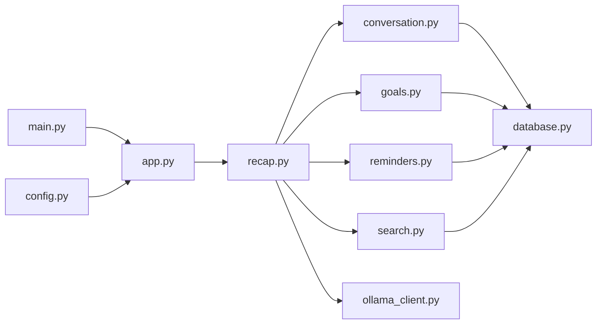

# Recap Generation

<cite>
**Referenced Files in This Document**
- [recap.py](file://carrot/recap.py)
- [conversation.py](file://carrot/conversation.py)
- [database.py](file://carrot/database.py)
- [goals.py](file://carrot/goals.py)
- [reminders.py](file://carrot/reminders.py)
- [search.py](file://carrot/search.py)
- [ollama_client.py](file://carrot/ollama_client.py)
- [config.py](file://carrot/config.py)
- [app.py](file://carrot/app.py)
- [main.py](file://carrot/main.py)
</cite>

## Table of Contents
1. Introduction
2. Project Structure
3. Core Components
4. Architecture Overview
5. Detailed Component Analysis
6. Dependency Analysis
7. Performance Considerations
8. Troubleshooting Guide
9. Conclusion

## Introduction
This document explains the recap generation system that automatically creates summaries and reports by aggregating conversation history, productivity metrics, and user activity. It covers recap formats, customization options, scheduling mechanisms, integration points, AI-powered summarization, content filtering, personalization, export formats, and automated delivery methods. The goal is to help users and developers understand how daily or weekly recaps are generated and delivered.

## Project Structure
The recap feature is implemented primarily within the Python application under the carrot package. Key modules include:
- Recap orchestration and formatting
- Conversation history retrieval
- Database access for persistence
- Goals and reminders for productivity context
- Search across activities and notes
- AI client for summarization
- Configuration and application entry points

**Diagram sources**
- [app.py](file://carrot/app.py)
- [main.py](file://carrot/main.py)
- [config.py](file://carrot/config.py)
- [database.py](file://carrot/database.py)
- [conversation.py](file://carrot/conversation.py)
- [goals.py](file://carrot/goals.py)
- [reminders.py](file://carrot/reminders.py)
- [search.py](file://carrot/search.py)
- [ollama_client.py](file://carrot/ollama_client.py)
- [recap.py](file://carrot/recap.py)

**Section sources**
- [recap.py](file://carrot/recap.py)
- [conversation.py](file://carrot/conversation.py)
- [database.py](file://carrot/database.py)
- [goals.py](file://carrot/goals.py)
- [reminders.py](file://carrot/reminders.py)
- [search.py](file://carrot/search.py)
- [ollama_client.py](file://carrot/ollama_client.py)
- [config.py](file://carrot/config.py)
- [app.py](file://carrot/app.py)
- [main.py](file://carrot/main.py)

## Core Components
- Recap orchestrator: coordinates data collection, filtering, summarization, formatting, and delivery.
- Conversation aggregator: retrieves and structures recent conversations for inclusion in recaps.
- Productivity context provider: pulls goals and reminders to enrich summaries with progress and tasks.
- Search aggregator: finds relevant notes, messages, and activities based on filters or keywords.
- AI summarizer: uses an external LLM client to generate concise, personalized summaries from aggregated content.
- Formatter: renders recaps into multiple output formats (text, markdown, JSON).
- Scheduler: triggers periodic recap generation (daily/weekly) and optional delivery actions.

Key responsibilities and interactions are detailed in the architecture and component analysis sections below.

**Section sources**
- [recap.py](file://carrot/recap.py)
- [conversation.py](file://carrot/conversation.py)
- [goals.py](file://carrot/goals.py)
- [reminders.py](file://carrot/reminders.py)
- [search.py](file://carrot/search.py)
- [ollama_client.py](file://carrot/ollama_client.py)

## Architecture Overview
The recap pipeline follows a clear sequence: configuration loading, data aggregation, AI summarization, formatting, and optional delivery. Scheduling can trigger this flow at defined intervals.

**Diagram sources**
- [app.py](file://carrot/app.py)
- [recap.py](file://carrot/recap.py)
- [database.py](file://carrot/database.py)
- [conversation.py](file://carrot/conversation.py)
- [goals.py](file://carrot/goals.py)
- [reminders.py](file://carrot/reminders.py)
- [search.py](file://carrot/search.py)
- [ollama_client.py](file://carrot/ollama_client.py)

## Detailed Component Analysis

### Recap Orchestrator
Responsibilities:
- Accepts parameters such as time window (daily/weekly), filters, and output format.
- Coordinates data gathering from conversations, goals, reminders, and search results.
- Invokes AI summarization with a tailored prompt reflecting user preferences and context.
- Formats the result and optionally triggers delivery/export.

Customization options:
- Time range selection (e.g., last 24 hours, last 7 days).
- Content filters (topics, tags, keywords).
- Personalization settings (tone, length, focus areas).
- Output formats (plain text, markdown, JSON).

Scheduling mechanisms:
- Supports cron-like triggers or app-level timers to run at fixed intervals.
- Can be invoked programmatically via API endpoints or CLI commands.

Integration points:
- Uses database for configuration and persisted state.
- Pulls conversation history and productivity signals.
- Calls AI client for summarization.
- Exposes delivery hooks for exporting or sending recaps.

**Diagram sources**
- [recap.py](file://carrot/recap.py)
- [conversation.py](file://carrot/conversation.py)
- [goals.py](file://carrot/goals.py)
- [reminders.py](file://carrot/reminders.py)
- [search.py](file://carrot/search.py)
- [ollama_client.py](file://carrot/ollama_client.py)

**Section sources**
- [recap.py](file://carrot/recap.py)

### Conversation Aggregator
Responsibilities:
- Retrieves recent conversations from the database within the specified time window.
- Structures entries with timestamps, participants, topics, and key snippets.
- Applies optional deduplication and relevance scoring.

Integration:
- Depends on database layer for persistence.
- Feeds summarized conversation highlights into the recap pipeline.

**Section sources**
- [conversation.py](file://carrot/conversation.py)
- [database.py](file://carrot/database.py)

### Productivity Context Providers (Goals and Reminders)
Goals provider:
- Returns active goals, milestones, and progress indicators.
- Helps highlight achievements and upcoming targets in recaps.

Reminders provider:
- Lists pending and completed reminders during the time window.
- Adds actionable insights and follow-ups to the summary.

**Section sources**
- [goals.py](file://carrot/goals.py)
- [reminders.py](file://carrot/reminders.py)

### Search Aggregator
Responsibilities:
- Searches across notes, messages, and activities using keywords or filters.
- Returns ranked results to prioritize high-signal content for summarization.

Use cases:
- Topic-focused recaps (e.g., “Project X” or “Health”).
- Tag-based filtering (e.g., “work”, “personal”).

**Section sources**
- [search.py](file://carrot/search.py)

### AI Summarizer
Responsibilities:
- Constructs prompts combining aggregated content, filters, and personalization settings.
- Calls the external LLM client to produce concise summaries and highlights.
- Handles parsing and validation of returned summaries.

Configuration:
- Model selection, temperature, max tokens, and safety filters.
- Custom templates for tone and structure.

**Section sources**
- [ollama_client.py](file://carrot/ollama_client.py)
- [recap.py](file://carrot/recap.py)

### Formatter and Delivery
Formatting:
- Renders summaries into plain text, markdown, or JSON depending on user preference.
- Ensures consistent structure across outputs.

Delivery:
- Optional export to files or integration with messaging/email services.
- Supports batch exports for weekly digests.

**Section sources**
- [recap.py](file://carrot/recap.py)

## Dependency Analysis
The recap system composes several modules with clear separation of concerns:
- Recap orchestrator depends on conversation, goals, reminders, search, and AI client.
- All data providers rely on the database layer.
- Application entry points configure and invoke the recap pipeline.

**Diagram sources**
- [recap.py](file://carrot/recap.py)
- [conversation.py](file://carrot/conversation.py)
- [goals.py](file://carrot/goals.py)
- [reminders.py](file://carrot/reminders.py)
- [search.py](file://carrot/search.py)
- [ollama_client.py](file://carrot/ollama_client.py)
- [database.py](file://carrot/database.py)
- [app.py](file://carrot/app.py)
- [main.py](file://carrot/main.py)
- [config.py](file://carrot/config.py)

**Section sources**
- [recap.py](file://carrot/recap.py)
- [database.py](file://carrot/database.py)
- [app.py](file://carrot/app.py)
- [main.py](file://carrot/main.py)
- [config.py](file://carrot/config.py)

## Performance Considerations
- Batch data retrieval: Combine queries for conversations, goals, reminders, and search results to reduce database round-trips.
- Streaming responses: For long summaries, stream partial results to improve perceived latency.
- Caching: Cache frequent queries and AI responses where appropriate to avoid redundant work.
- Prompt optimization: Keep prompts concise and focused to minimize token usage and response time.
- Concurrency: Use asynchronous calls for independent data gathering steps when safe.

[No sources needed since this section provides general guidance]

## Troubleshooting Guide
Common issues and resolutions:
- Missing data: Ensure database connectivity and correct time window filters; verify that conversations, goals, and reminders exist for the period.
- AI errors: Check model availability, network connectivity, and prompt constraints; validate response parsing logic.
- Formatting failures: Confirm output format settings and template variables; ensure required fields are present.
- Delivery problems: Verify export paths and service credentials; check permissions and quotas.

Debugging tips:
- Enable verbose logging in the recap pipeline to trace each step.
- Inspect intermediate aggregates before AI summarization to confirm content quality.
- Validate configuration values loaded from config sources.

**Section sources**
- [recap.py](file://carrot/recap.py)
- [ollama_client.py](file://carrot/ollama_client.py)
- [database.py](file://carrot/database.py)
- [config.py](file://carrot/config.py)

## Conclusion
The recap generation system integrates conversation history, productivity metrics, and user activity to produce meaningful daily or weekly summaries. With customizable formats, filters, and personalization, it supports flexible reporting needs. Scheduling and delivery options enable automated workflows, while AI-powered summarization ensures concise and relevant outputs. Proper configuration and monitoring will help maintain performance and reliability.

[No sources needed since this section summarizes without analyzing specific files]