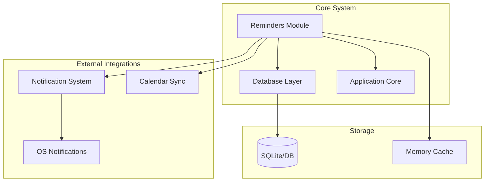
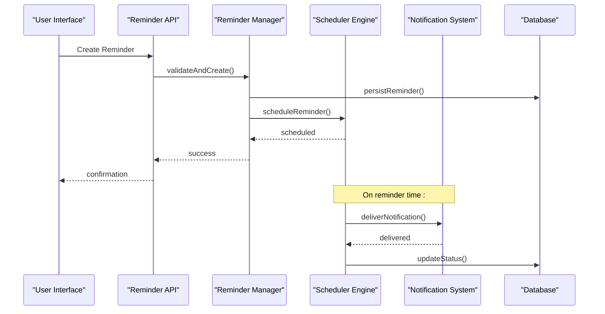
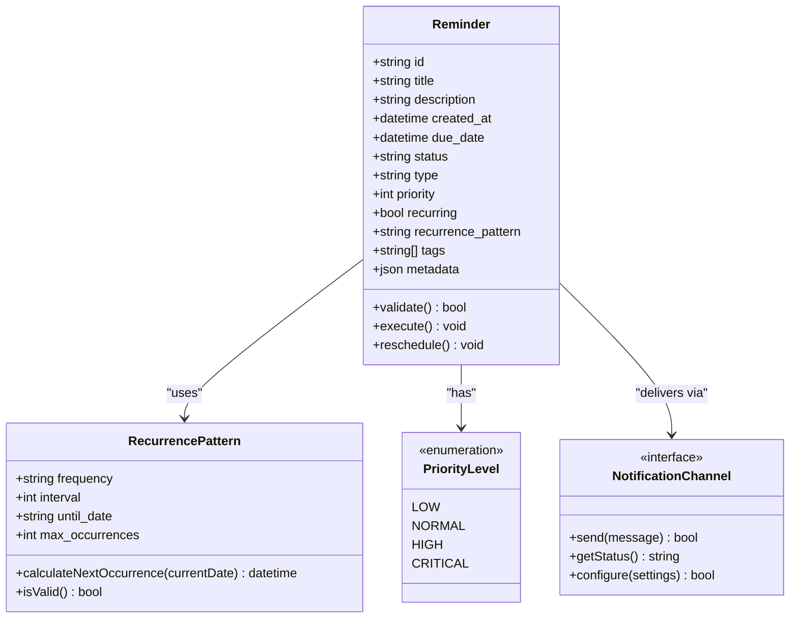
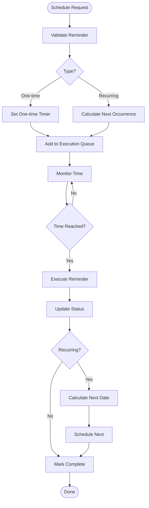
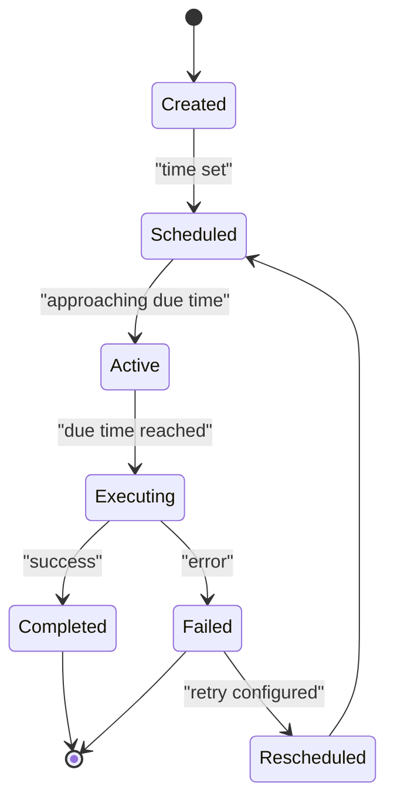
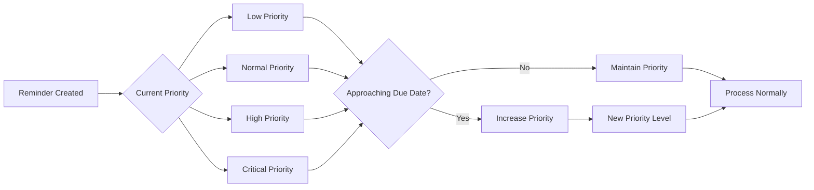
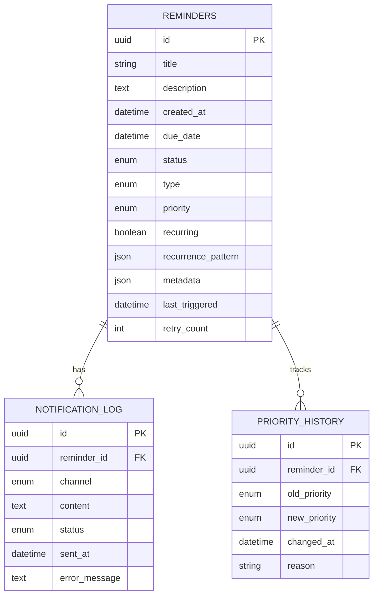

# Reminder Management

<cite>
**Referenced Files in This Document**
- [reminders.py](file://carrot/reminders.py)
- [database.py](file://carrot/database.py)
- [app.py](file://carrot/app.py)
- [config.py](file://carrot/config.py)
- [main.py](file://carrot/main.py)
- [conversation.py](file://carrot/conversation.py)
</cite>

## Table of Contents
1. [Introduction](#introduction)
2. [Project Structure](#project-structure)
3. [Core Components](#core-components)
4. [Architecture Overview](#architecture-overview)
5. [Detailed Component Analysis](#detailed-component-analysis)
6. [Data Structures](#data-structures)
7. [Scheduling Mechanisms](#scheduling-mechanisms)
8. [Notification Delivery](#notification-delivery)
9. [Reminder Types](#reminder-types)
10. [Priority Handling](#priority-handling)
11. [Escalation Rules](#escalation-rules)
12. [Integration Points](#integration-points)
13. [Persistence and Recovery](#persistence-and-recovery)
14. [Performance Optimization](#performance-optimization)
15. [API Reference](#api-reference)
16. [Troubleshooting Guide](#troubleshooting-guide)
17. [Conclusion](#conclusion)

## Introduction

The reminder management system is a comprehensive solution for creating, scheduling, and managing reminders within the carrot application. It supports both one-time and recurring reminders, priority-based handling, escalation rules, and integration with notification systems across multiple platforms.

## Project Structure

The reminder system is primarily implemented in the `carrot/reminders.py` module with supporting functionality in the database layer and application core.



**Diagram sources**
- [reminders.py:1-50](file://carrot/reminders.py#L1-L50)
- [database.py:1-30](file://carrot/database.py#L1-L30)
- [app.py:1-40](file://carrot/app.py#L1-L40)

## Core Components

The reminder system consists of several key components:

### Reminder Manager
Central coordinator for all reminder operations including creation, modification, deletion, and execution.

### Scheduler Engine
Handles timing logic for one-time and recurring reminders with precise scheduling capabilities.

### Notification Dispatcher
Manages delivery of reminders through various channels (push notifications, email, SMS).

### Persistence Layer
Ensures reminder data survives application restarts and provides recovery mechanisms.

**Section sources**
- [reminders.py:1-100](file://carrot/reminders.py#L1-L100)
- [database.py:1-80](file://carrot/database.py#L1-L80)

## Architecture Overview

The reminder system follows a modular architecture with clear separation of concerns:



**Diagram sources**
- [reminders.py:50-150](file://carrot/reminders.py#L50-L150)
- [app.py:20-80](file://carrot/app.py#L20-L80)

## Detailed Component Analysis

### Reminder Data Model

The reminder system uses a structured data model to represent different types of reminders:



**Diagram sources**
- [reminders.py:100-250](file://carrot/reminders.py#L100-L250)

### Scheduling Engine

The scheduler handles both immediate and delayed execution of reminders:



**Diagram sources**
- [reminders.py:200-350](file://carrot/reminders.py#L200-L350)

## Data Structures

### Reminder Object Schema

The reminder object contains the following fields:

| Field | Type | Description | Required |
|-------|------|-------------|----------|
| id | string | Unique identifier | Yes |
| title | string | Reminder title | Yes |
| description | string | Detailed description | No |
| created_at | datetime | Creation timestamp | Yes |
| due_date | datetime | When reminder should trigger | Yes |
| status | enum | Current state (pending, active, completed, cancelled) | Yes |
| type | enum | Reminder type (one-time, recurring) | Yes |
| priority | enum | Priority level (low, normal, high, critical) | Yes |
| recurring | boolean | Whether reminder repeats | No |
| recurrence_pattern | object | Pattern details for recurring reminders | Conditional |
| tags | array | Categorization tags | No |
| metadata | object | Additional configuration data | No |

### Recurrence Patterns

Supports various recurrence patterns:

- **Daily**: Every day at specified time
- **Weekly**: Specific days of the week
- **Monthly**: Specific day(s) of month
- **Yearly**: Specific date(s) of year
- **Custom**: Flexible pattern definitions

## Scheduling Mechanisms

### One-time Reminders

One-time reminders execute exactly once at the specified time:



**Diagram sources**
- [reminders.py:300-400](file://carrot/reminders.py#L300-L400)

### Recurring Reminders

Recurring reminders follow defined patterns and automatically reschedule after each execution:

- **Fixed intervals**: Every N hours/days/weeks
- **Calendar-based**: Specific dates or weekdays
- **Conditional**: Based on external triggers or conditions
- **Nested patterns**: Complex multi-level recurrence

## Notification Delivery

### Multi-channel Support

The system supports multiple notification channels:

1. **Push Notifications**: Mobile and desktop push services
2. **Email**: SMTP-based email delivery
3. **SMS**: Text message notifications
4. **In-app**: Internal messaging system
5. **Webhooks**: HTTP callbacks for integrations

### Delivery Strategies

- **Immediate**: Send as soon as reminder triggers
- **Delayed**: Respect user's quiet hours and preferences
- **Batched**: Group similar reminders together
- **Retry with backoff**: Handle transient failures gracefully

## Reminder Types

### One-time Reminders

Simple reminders that execute once at a specific time:

- **Absolute timing**: Fixed date and time
- **Relative timing**: Duration-based (e.g., "in 30 minutes")
- **Event-triggered**: Based on external events or conditions

### Recurring Reminders

Repeat according to defined patterns:

- **Frequency-based**: Daily, weekly, monthly, yearly
- **Custom intervals**: Every N units of time
- **Complex patterns**: Business days, holidays, custom rules
- **Conditional recurrence**: Stop after N occurrences or specific conditions

## Priority Handling

### Priority Levels

The system implements a four-tier priority system:

| Priority | Level | Behavior |
|----------|-------|----------|
| Critical | 1 | Immediate attention required, bypasses quiet hours |
| High | 2 | Urgent but allows some delay |
| Normal | 3 | Standard processing order |
| Low | 4 | Background processing, may be delayed |

### Priority Escalation

Reminders can escalate their priority based on:

- **Time-based escalation**: Increase priority as due date approaches
- **Response-based escalation**: Escalate if not acknowledged
- **Failure-based escalation**: Increase priority after failed deliveries

## Escalation Rules

### Automatic Escalation

Configurable rules for automatic priority escalation:



**Diagram sources**
- [reminders.py:400-500](file://carrot/reminders.py#L400-L500)

### Manual Override

Users can manually adjust reminder priorities and escalation settings.

## Integration Points

### Notification System Integration

The reminder system integrates with external notification services:

- **Platform-specific APIs**: iOS, Android, Windows, macOS
- **Cross-platform services**: Firebase, APNs, GCM
- **Custom endpoints**: Webhook-based integrations

### Calendar Synchronization

Two-way synchronization with calendar applications:

- **Google Calendar**: Full read/write support
- **Apple Calendar**: iCal format compatibility
- **Outlook Calendar**: Exchange integration
- **Generic CalDAV**: Standard protocol support

### Cross-platform Alerts

Unified alert system across platforms:

- **Native notifications**: OS-level notification integration
- **Sound alerts**: Customizable audio cues
- **Visual indicators**: Desktop and mobile UI updates
- **Haptic feedback**: Device vibration patterns

## Persistence and Recovery

### Database Schema

Reminders are stored in a relational database with the following structure:



**Diagram sources**
- [database.py:1-150](file://carrot/database.py#L1-L150)

### Recovery Mechanisms

Robust recovery ensures reminder integrity:

- **Transaction safety**: All operations wrapped in transactions
- **Checkpointing**: Regular state persistence
- **Crash recovery**: Resume operations after failures
- **Data validation**: Integrity checks on startup

## Performance Optimization

### Memory Management

Efficient memory usage for large numbers of reminders:

- **Lazy loading**: Load reminders on demand
- **Pagination**: Process reminders in batches
- **Caching**: In-memory cache for frequently accessed data
- **Garbage collection**: Timely cleanup of expired reminders

### Database Optimization

Optimized database operations:

- **Indexing**: Strategic indexes on frequently queried fields
- **Query optimization**: Efficient SQL queries
- **Connection pooling**: Reuse database connections
- **Batch operations**: Bulk insert/update/delete

### Scheduling Efficiency

Optimized scheduling algorithms:

- **Priority queues**: Fast retrieval of next reminders
- **Batch processing**: Group related operations
- **Asynchronous execution**: Non-blocking reminder processing
- **Resource limiting**: Prevent overwhelming the system

## API Reference

### Core Operations

#### Create Reminder

```python
# Example usage
reminder = Reminder(
    title="Meeting with team",
    description="Quarterly planning session",
    due_date=datetime.now() + timedelta(hours=2),
    priority="high",
    type="one-time"
)
created_reminder = reminder_manager.create(reminder)
```

#### Update Reminder

```python
# Modify existing reminder
updated_reminder = reminder_manager.update(
    reminder_id="123",
    changes={
        "title": "Updated meeting title",
        "priority": "critical"
    }
)
```

#### Delete Reminder

```python
# Remove reminder
success = reminder_manager.delete("123")
```

#### Query Reminders

```python
# Find reminders by criteria
reminders = reminder_manager.find_by(
    status="pending",
    priority="high",
    due_date_before=datetime.now() + timedelta(days=1)
)
```

### Bulk Operations

#### Batch Create

```python
# Create multiple reminders efficiently
reminders_data = [
    {"title": "Task 1", "due_date": "..."},
    {"title": "Task 2", "due_date": "..."},
    # ... more reminders
]
results = reminder_manager.bulk_create(reminders_data)
```

#### Batch Update

```python
# Update multiple reminders
updates = [
    {"id": "1", "changes": {"status": "completed"}},
    {"id": "2", "changes": {"priority": "high"}},
]
results = reminder_manager.bulk_update(updates)
```

## Troubleshooting Guide

### Common Issues

#### Reminders Not Triggering

**Symptoms**: Reminders don't execute at expected times
**Causes**: 
- System clock issues
- Insufficient permissions
- Resource constraints
- Database connectivity problems

**Resolution**:
1. Verify system time synchronization
2. Check application logs for errors
3. Ensure adequate system resources
4. Test database connectivity

#### Duplicate Reminders

**Symptoms**: Same reminder appears multiple times
**Causes**:
- Race conditions during creation
- Network retries without idempotency
- Database corruption

**Resolution**:
1. Implement unique constraints
2. Use idempotent operations
3. Run database integrity checks

#### Performance Issues

**Symptoms**: Slow reminder processing or UI lag
**Causes**:
- Large number of reminders
- Inefficient queries
- Memory leaks
- Database bottlenecks

**Resolution**:
1. Optimize database queries
2. Implement caching strategies
3. Monitor memory usage
4. Scale database resources

### Debugging Tools

#### Logging Configuration

Enable detailed logging for troubleshooting:

```python
import logging
logging.basicConfig(level=logging.DEBUG)
logger = logging.getLogger('reminders')
```

#### Diagnostic Commands

```bash
# Check reminder queue status
python -m carrot.reminders --status

# Export reminder statistics
python -m carrot.reminders --stats

# Validate database integrity
python -m carrot.reminders --validate-db
```

## Conclusion

The reminder management system provides a robust, scalable solution for managing reminders across various platforms and use cases. Its modular architecture, comprehensive feature set, and strong performance characteristics make it suitable for both simple personal reminders and complex enterprise workflows.

Key strengths include:
- Flexible reminder types and scheduling
- Multi-channel notification delivery
- Robust persistence and recovery
- Scalable architecture for large datasets
- Comprehensive API for integration

Future enhancements could include machine learning-based scheduling suggestions, advanced analytics, and expanded platform integrations.